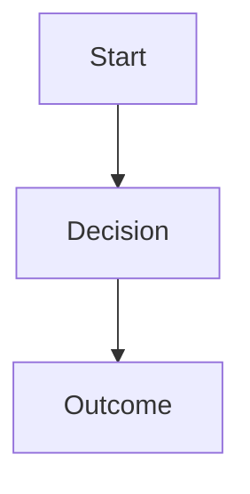

---
# Copy this file into a section folder (banking-credit / investing / technology /
# economy-policy / business-trade), rename it to your-article-id.md, and fill it in.
# Files starting with "_" are ignored, so this template never shows on the site.

id: your-article-id            # must equal the filename (without .md); URL-safe, lowercase-hyphens
title: "Your Article Headline Goes Here"
summary: A one or two sentence teaser shown on the card under the title.

# Drives the cover photo + the blog filter pill. Use one of the existing values:
#   Bonds & Bills | Unit Trusts | SME Trade Finance | Real Estate
#   Agri-Logistics | Wealth Optimization | Digital Strategy
#   Banking & Credit | SME Finance | Fintech & Banking
category: Bonds & Bills

date: June 2, 2026             # any readable format; shown as-is and used for ordering (newest first)
readTime: 6 min read

# featured: true               # optional flag
# coverImage: /images/your-cover.jpg   # optional, overrides the category photo (file in public/images/)

author:
  name: Bengula Jacob
  role: Relationship Manager & Founder of Bengula Inc.
  avatar: /images/jacob.jpg

# coAuthors:                   # optional, delete if single-author
#   - name: Jane Mwangi
#     role: Guest Analyst
#     avatar: /images/jane.jpg
---

### Start With a Clear Section Heading

Write naturally in plain Markdown. Separate every block with a blank line.

Supported formatting:
- `### Heading` and `#### Sub-heading`
- bullet points (one per line; **bold** works inside)
- **bold text**
- ``
- LaTeX formulas (see below)
- Mermaid diagrams (see below)
- Card grids (see below)

---

### LaTeX formulas

Inline-style display math uses double dollar signs. Renders as a formula box:

$$ \text{Net Yield} = \text{Gross} \times (1 - \text{Tax Rate}) $$

---

### Mermaid diagrams

Use a fenced code block with language `mermaid`:



---

### Cards

Use a fenced code block with language `cards` (or `card`). Body is YAML: a list of card objects.
Grid auto-layouts for 1, 2, 3, or 4+ cards.

**Fields (per card):**
- `icon` - Lucide icon name in PascalCase (e.g. `Landmark`, `CreditCard`, `ShieldCheck`) or kebab-case (`credit-card`)
- `title` - card heading
- `desc` - body text (aliases: `description`, `text`)
- `linkText` - CTA label (aliases: `btn`, `buttonText`)
- `linkUrl` - CTA href (aliases: `path`, `href`); internal paths like `/services`, `/contact`, `/blog/your-article-id`
- `type` - theme colour (aliases: `color`): `violet` (default), `amber`, or `emerald`

```cards
- icon: Landmark
  title: Simple & Practical
  desc: Our proven financial principles and methodologies have driven remarkable transformations for numerous clients. We are committed to providing straightforward, efficient, and effective financial planning.
  linkText: Explore Services
  linkUrl: /services
- icon: CreditCard
  title: Accessible
  desc: Accessibility is a top priority for Bengula because we are dedicated to breaking down barriers to knowledge and resources.
  linkText: Try Calculator
  linkUrl: /#credit-card-grace-calculator
  type: amber
- icon: ShieldCheck
  title: Personal
  desc: Personalization is paramount because we recognize that every individual and business is unique, with distinct goals, challenges, and aspirations.
  linkText: Book Session
  linkUrl: /contact
  type: emerald
```

Prefer content-relevant cards (choices, next steps, internal links) over generic brand copy. Three cards with mixed `type` values scan best.

---

### Interactive embeds

Some articles mount React tools via a fenced language tag (body can be empty):

````markdown
```inclusion
```
````

Supported today:
- `inclusion` — Financial Inclusion Score calculator (self-check, 0–100)

---

Close with a strong concluding paragraph that ties the article back to the reader's goals.
