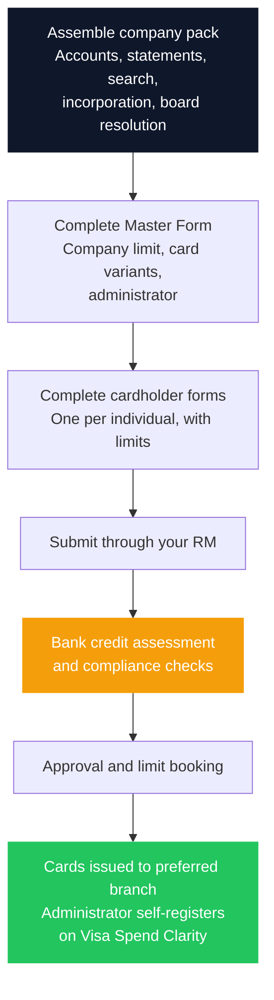

For growing businesses in Kenya, tracking employee expenses is an administrative burden that rarely gets solved properly. Personal cards get used for company purchases, petty cash gets reimbursed against handwritten receipts, and nobody has a clean view of what was spent until the accountant reconstructs it months later. The result is error-prone books, weak audit trails, and no policy control at the moment money is actually spent.

Commercial credit cards solve a narrow set of those problems well. Issued in partnership with Visa, corporate card programmes give a business a credit limit, individually controlled cards for staff, and a management platform that enforces spending rules before a purchase happens rather than auditing it afterwards.

This guide works through the **Absa Business Credit Card** as a worked example: the card variants, what it costs, the credit limit structure, the documents required to apply, and the discipline that determines whether the product is nearly free or genuinely expensive.

> **Key Insight:** A commercial card is a payment and control tool that happens to include credit, not a borrowing facility that happens to include a card. Settled in full each month, it is up to 50 days of interest-free payables with expense controls attached. Carried past the due date, it prices above most other formal business credit in Kenya. The entire value of the product sits on which of those two things you do.

```cards
- icon: Wallet
  title: Free working capital
  desc: Stretch payables 20 to 50 days at zero interest when settled in full. Cheaper than the short-term credit many SMEs default to.
  linkText: Compare borrowing options
  linkUrl: /blog/borrowing-money-in-kenya-guide
- icon: ShieldCheck
  title: Control before the spend
  desc: Set per-cardholder limits, block merchant categories, and apply location and time rules in advance rather than auditing after.
  type: amber
- icon: CreditCard
  title: Model the grace period
  desc: The interest-free window is the whole product. Work out where your purchase falls in the statement cycle.
  linkText: Try the grace calculator
  linkUrl: /#credit-card-grace-calculator
  type: emerald
```

---

### Why the Segment Matters

Commercial cards are not one product. SMEs and large corporates buy them for genuinely different reasons.

| | **SMEs** | **Corporates and large enterprises** |
|---|---|---|
| **Primary driver** | Cash flow and clean books | Visibility and policy enforcement |
| **The problem solved** | Business and personal money are mixed | No real-time view across departments and cost centres |
| **Working capital role** | 20 to 50 days of interest-free payables acts as a revolving line | Marginal; treasury has other tools |
| **Control need** | Basic separation and tracking | Per-cardholder limits, merchant category locks, fraud restriction |
| **Efficiency gain** | Replaces petty cash and manual reimbursement | Speeds vendor and procurement payment without slow treasury sign-off |

For a smaller business, the honest headline is the working capital. A card that defers payment for up to 50 days at no cost is doing the job many Kenyan SMEs currently hand to far more expensive short-term credit. For a larger business, the card is mostly a governance instrument, and the credit line is incidental.

---

### The Card Variants

A point the marketing rarely makes clearly: this is a family of cards, not a single product, and the variant determines both the currency you settle in and whether a physical card exists at all.

| Variant | Currency | Form | Typical use |
|---|---|---|---|
| Standard Corporate Card | KES | Physical | General business spend, travel, supplier payments |
| Standard Virtual Card | KES | Virtual | Online and recurring payments in shillings |
| Standard Virtual Card | USD | Virtual | Foreign-currency subscriptions and online vendors |
| KATA Virtual Card | KES | Virtual | Controlled or single-use payment scenarios |
| KATA Virtual Card | USD | Virtual | Controlled foreign-currency payments |

**The virtual cards deserve more attention than they get.** A virtual card number can be issued for a specific online vendor or a one-off payment without a plastic card existing, which removes an entire category of fraud exposure. For a business paying foreign software subscriptions, a USD virtual card also avoids paying a cross-currency markup on every single charge, which is a real saving once subscription spend is material.

Virtual card programmes are administered through the Visa Commercial Pay portal, and the application nominates an **Authorised Company Administrator** with rights to add and delete virtual card numbers. Choosing that person carefully matters: they can create payment instruments.

---

### Core Features

- **Credit limits set against your financials**, sized to the business rather than to an individual.
- **Global acceptance** on the Visa network, online and at physical merchants.
- **No transaction fees** at point of sale or online for purchases.
- **Up to 50 days interest-free** on purchases when the statement balance is settled in full by the due date.
- **Fraud mitigation** through chip-and-PIN, contactless, and virtual card options.

---

### Spend Control Through Visa Spend Clarity

The main operational reason to move off personal cards and petty cash is the management platform. During onboarding the business administrator self-registers using a link provided by the bank.

What it actually does:

- **Controls set in advance.** Per-cardholder spend limits, merchant category blocks, location whitelisting, and time-based rules. The policy is enforced at the point of purchase.
- **Receipt capture.** Cardholders photograph receipts and attach them to transactions in the mobile app, which removes the monthly hunt for paper.
- **Search and reporting.** Locate any transaction across the organisation by account, cardholder, date, merchant, or amount, with custom statement formats, frequencies, and currencies.
- **Accounting integration.** Transactions, notes, and attached receipts export into existing accounting or ERP systems.
- **Historical analysis.** Up to 27 months of data for spotting patterns and trends.

For a business currently reconciling expenses manually, this is usually a larger practical gain than the interest-free window, because it removes recurring administrative work rather than providing a one-off financing benefit.

---

### Where a Commercial Card Fits

The categories where commercial cards genuinely earn their place:

| Spend category | Why the card suits it |
|---|---|
| Employee travel and expenses | Controlled limits, no personal reimbursement cycle |
| Recurring subscriptions | Predictable, ideal for a dedicated virtual card |
| Office supplies and equipment | Small, frequent, previously petty cash |
| Marketing and advertising | Online platforms requiring card payment |
| Procurement and vendor payments | Faster than treasury sign-off for smaller tickets |
| Client and team entertainment | Auditable, policy-bounded |
| Departmental or project budgets | Per-card limits map to a budget line |
| Emergency and incidental spend | Available without a cash float |

The pattern is small, frequent, and previously invisible spend. Cards are a poor instrument for large lumpy purchases, which belong in [asset finance](/blog/asset-finance-vs-conventional-loans) or a term facility, and a poor instrument for funding a structural working capital gap, which is a [working capital cycle](/blog/working-capital-cycle-kenya-smes) problem that a 50-day window will not solve.

---

### Travel and Partner Benefits

Cardholders, particularly executives and frequent travellers, get a set of lifestyle benefits:

- **Airport lounge access:** 2 complimentary visits annually per cardholder, valued at USD 32 per visit, with one accompanying guest permitted.
- **Visa Luxury Hotel Collection:** access to over 900 properties worldwide.
- **Hotel and car rental discounts:** up to 20% off Jumeirah Hotels, and up to 11% on car rentals through Gettransfer.com and Rentalcars.com.
- **Partner offers:** over 40 business-focused discounts across productivity software, IT and telecoms, marketing, mentoring, and networking, available through [SME Offers on Poshvine](https://smeoffers.poshvine.com/en/).

Treat these as a bonus rather than a reason to choose the product. Two lounge visits a year is worth roughly USD 64 against an annual fee of KES 3,000, so the benefits are real but they are not the business case.

---

### Pricing and Tariff

| Service or transaction | Fee |
|---|---|
| Joining membership | **Free** |
| Annual membership | **KES 3,000** per card |
| Balance rollover interest | **3.99% per month** |
| Cross-currency markup | **3.00%** |
| Cash advance | **6.50%**, minimum KES 100 |
| Late payment | **10.00%** of the outstanding amount, minimum KES 1,000 |
| Returned payment (bounced cheque) | **KES 500** |

*Tariff as published in Absa's 2025 corporate card material. USD-denominated cards are priced separately in dollars. Fees are revised periodically, so confirm current pricing with Absa before applying.*

Three numbers deserve emphasis.

**The rollover rate is the whole risk.** At 3.99% per month, carrying a balance compounds to an effective annual cost above 60%, which is materially worse than most formal business credit in Kenya. The card is excellent at zero balance and expensive at any balance. Convert any quoted monthly rate using the method in [understanding interest rates and APR](/blog/mobile-loan-vs-bank-loan-apr-breakdown).

**Cash advances are not a feature to use.** At 6.50% with a minimum charge, and typically without the interest-free grace period applying, cash advances are among the most expensive money available to a business. If you need cash rather than a payment, this is the wrong instrument.

**The cross-currency markup is 3%.** On meaningful foreign spend that adds up quickly, which is the argument for a USD-denominated card if your foreign-currency spending is regular. The anatomy of FX pricing is covered in [the hidden leak of fees and FX spreads](/blog/sme-transaction-fees-fx-spreads-kenya).

---

### Credit Limit Structure

The limit structure has two floors that catch applicants out:

$$
\text{Total company limit} \geq \sum \text{Individual cardholder limits}
$$

- **Minimum total company limit: KES 50,000.**
- **Minimum individual cardholder limit: KES 25,000.**
- The company limit must cover the sum of all individual limits, and it is worth requesting headroom above current need so that adding a cardholder later does not require restructuring the facility.

Practically: a business issuing four cards at KES 100,000 each needs a company limit of at least KES 400,000, and should request more if a fifth card is foreseeable.

---

### What You Need to Apply

This is where most applications stall. Assembling the pack before you start is the difference between a fast approval and a month of back-and-forth.

**Company documentation:**

- Memorandum and articles of association
- Audited or draft accounts for the last two years
- Certified copies of bank statements for the last six months
- Certificate of incorporation, or certificate of change of name
- Current company search

**A board resolution**, passed at a properly convened meeting, authorising the bank to open the card account and specifying which positions may request cards for named individuals. This is a formal requirement, not a formality, and it needs the chairman's signature.

**Company and banking details:** nature of business, year of incorporation, issued share capital, physical and postal address, and your banking history, including previous bankers if you changed within the last two years.

**Risk and data privacy information.** The Risk Based Approach form asks for source of income and source of wealth, expected monthly account activity broken down by deposits and withdrawals, countries traded with, and tax residency for CRS and FATCA purposes. It also records your marketing preferences and data rights, including objection to profiling and data deletion. Prepare these answers rather than improvising them; they are compliance questions and inconsistency invites delay.

**Per-cardholder application forms** for every individual receiving a card, specifying that person's limit.

Two practical details: the company name printed on cards is limited to **26 characters including spaces**, so decide how an abbreviated trading name should appear, and the application nominates a **preferred Absa branch** for card collection on approval.

---

### The Application Process

From the applicant's side, the sequence is straightforward, though the bank runs internal verification steps in parallel that you will not see.



The credit assessment is the substantive stage, and it works the same way as any other business facility: the bank is reading your accounts, your bank statements, and your conduct. The preparation that improves the outcome is the same preparation described in [the anatomy of a bank proposal](/blog/anatomy-of-a-bank-proposal-kenya), and if your statements and filings do not reconcile, that is worth fixing before applying rather than after.

Once cards are issued, register on Visa Spend Clarity immediately and configure limits and category controls **before** distributing cards to staff. Controls applied after the first month of spending are a remediation exercise rather than a policy.

### Risk Factors

| Risk | Likelihood | Consequence |
|---|---|---|
| Balance carried past the due date | High without a settlement discipline | 3.99% monthly compounds above 60% a year |
| Card used as a cash advance | Moderate under cash pressure | 6.50% plus loss of the interest-free window |
| Cards issued before controls are configured | Common | Policy becomes retrospective; misuse already occurred |
| Foreign spend on a KES card | Common | 3% markup on every transaction |
| Company limit set to current need only | Common | Adding a cardholder later requires restructuring |
| Card used to fund a structural working capital gap | Moderate | Masks a cycle problem that keeps growing |
| Director or company credit record too thin | Depends on history | Application declined or limit set below usable level |

### Decision Framework: Is a Commercial Card Right for Your Business?

**Can you settle in full every month, reliably?** If the honest answer is no, the product is expensive and you should be comparing [term and working capital facilities](/blog/sme-finance-handbook-kenya) instead.

**Is your problem control or financing?** Control problems (invisible staff spend, mixed personal and business money, manual reconciliation) are exactly what this solves. Financing problems are not.

**How much of your spend is small, frequent, and card-suitable?** If most spending is a handful of large supplier payments, the administrative gain is limited.

**Do you have regular foreign-currency spend?** If so, price a USD card against paying 3% markup repeatedly on a shilling card.

**Who will administer it?** Someone must own the platform, set the controls, and review statements. Without a named owner the governance benefit does not materialise.

**Is your documentation ready?** Two years of accounts, six months of statements, and a board resolution. If these are not current, fix that first.

### Bengula View

Three observations from the desk.

First, **commercial cards are the most underused working capital tool in the Kenyan SME market**. Businesses routinely fund short gaps with mobile and digital credit at rates that would horrify them if annualised, while an interest-free 50-day window sits unused. For recurring, card-suitable spend, the comparison is not close.

Second, **the product inverts completely at the due date**. There is no middle setting. Settled in full, the effective financing cost is zero and you keep the controls and the perks. Carried, it becomes one of the more expensive facilities on your balance sheet. Any business adopting cards should decide in advance who is responsible for settlement and treat that date as non-negotiable, ideally by direct debit.

Third, **the controls are the part that compounds**. The interest-free window is a one-off benefit repeated monthly. Proper spend controls change staff behaviour, produce a clean audit trail, and make the business more legible to its own management and to lenders. Configure limits and merchant categories before cards go out, and use the virtual card options for online and subscription spend where the fraud exposure is highest.

### Conclusion

A commercial card programme is not a financing decision dressed up as a payments decision. It is a payments and governance decision that carries a financing option you should decline to use.

Adopted deliberately, with controls configured before distribution, a named administrator, virtual cards for online spend, and settlement by direct debit each month, it removes an entire category of administrative work, produces clean books, and provides genuinely free short-term liquidity. Adopted casually, it becomes an expensive revolving facility with lounge access attached.

The discipline is the product.

### Related Reading

- [The Complete Guide to Borrowing Money in Kenya](/blog/borrowing-money-in-kenya-guide) for how card credit compares with the alternatives.
- [Understanding Interest Rates and APR](/blog/mobile-loan-vs-bank-loan-apr-breakdown) for converting a monthly rate into a real annual cost.
- [The Hidden Leak: Fees and FX Spreads](/blog/sme-transaction-fees-fx-spreads-kenya) for the cross-currency markup in context.
- [The Complete SME Finance Handbook](/blog/sme-finance-handbook-kenya) for the wider facility map.
- [The Anatomy of a Bank Proposal](/blog/anatomy-of-a-bank-proposal-kenya) for how the credit assessment behind the application works.
- [The Working Capital Cycle](/blog/working-capital-cycle-kenya-smes) for diagnosing whether your gap is structural.

### References

- **Absa Bank Kenya PLC.** Corporate card product literature, tariff schedule (2025), and application documentation, including the corporate card master form and cardholder application form.
- **Visa Commercial Solutions.** [Visa Spend Clarity for Business](https://www.visa.co.ke/) control and reporting platform, and the Visa Commercial Pay portal for virtual cards.
- **Poshvine SME Offers.** [Partner benefits programme](https://smeoffers.poshvine.com/en/).
- **Central Bank of Kenya.** [Consumer protection and disclosure guidelines](https://www.centralbank.go.ke/) applying to card products.

*Bengula Inc is independent and is not acting for, or on behalf of, Absa Bank Kenya PLC. This guide describes a publicly available commercial product for educational purposes; it is not an Absa communication and Absa has not reviewed or endorsed it.*

*Fees, interest rates, limits, card variants, and benefits are set by the issuer and revised periodically. Figures cited reflect product material current at the time of writing and must be confirmed directly with Absa before you apply.*

*General business education, not individualized financial, tax, or legal advice.*
