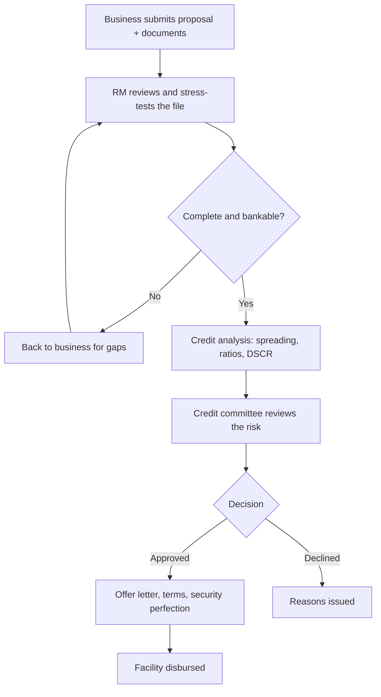

Two proposals land on a relationship manager's desk in the same week. Both are established businesses asking for a KES 10,000,000 facility. Both have real revenue, real customers, and a genuine need. One is approved inside two weeks; the other bounces back with questions, then stalls, then quietly dies in the pipeline. The difference is almost never the business. It is the proposal.

A bank facility is not granted because you asked politely or because your turnover is large. It is granted because a credit file persuaded a series of people, your RM, a credit analyst, and usually a credit committee, that the business will generate enough cash to service the debt, and that there is a sensible fallback if it does not. This article walks that file from the banker's side of the desk: what the RM is actually testing, the framework every Kenyan bank uses to test it, and how to assemble a proposal that answers the questions before they are asked.

> **Key Insight:** Your RM is not looking for a reason to say yes. They are looking for the reasons a credit committee might say no, so they can either fix them with you before submission or decline early. A perfect proposal is one that has already answered every one of those objections in writing. You are not selling optimism; you are removing doubt.

---

### What the RM Is Actually Doing

When a proposal arrives, the RM becomes your advocate and your first examiner at the same time. Their name goes on the file. If they push a weak deal through and it defaults, that is their credit judgement on record, so they interrogate your numbers harder than any committee will. Understanding this reframes the whole exercise: the RM is a partner you are equipping to defend your case in a room you will never enter. Everything in [why your relationship manager is your business's growth asset](/blog/why-rm-is-sme-growth-asset) starts here.

The appraisal itself follows a well-worn path inside the bank. The proposal does not go straight from your hands to an approval; it moves through analysis and a committee, and your file has to survive each stage without you present to explain it.

Notice how much of the journey happens after the file leaves your hands. The written proposal is the only version of you in the room during credit analysis and committee. If it cannot answer a question, no one phones you mid-meeting; the file simply waits, or is declined. That is why the document has to be complete, not merely honest.

---

### The Framework Behind Every Decision: The 5 C's of Credit

Every credit officer in Kenya, whether they name it or not, is scoring you against the **5 C's of credit**. It is the oldest framework in lending because it works: it separates the four things a business can prove from the one thing it cannot control.

| The C | The Question It Answers | What the Bank Reads It From |
|---|---|---|
| **Character** | Will you repay even when it is inconvenient? | CRB report, repayment history, account conduct, references, how long you have banked |
| **Capacity** | Can the business generate enough cash to service the debt? | Audited accounts, management accounts, bank statements, cash flow projections, DSCR |
| **Capital** | How much of your own money is in the business? | Owner's equity, retained earnings, the deposit or contribution on the deal |
| **Collateral** | What can the bank recover if repayment fails? | Title deeds, logbooks, debentures, cash cover, valuations |
| **Conditions** | Does the wider environment support repayment? | Sector outlook, the purpose of the facility, interest rate and currency risk |

Two of these carry most of the weight. **Character** is the gate: a poor CRB record or a history of bounced cheques and returned direct debits can stop a file before capacity is even assessed, which is why [building and protecting your credit score](/blog/credit-score-kenya-guide) is the groundwork you lay months before you ever apply, and why a listing must be [cleaned up first](/blog/how-to-fix-your-crb-listing-kenya). **Capacity** is where the actual lending decision is made, and it deserves a section of its own.

---

### Capacity Is King: The Debt Service Cover Ratio

Collateral gets a business owner's attention, but capacity gets the approval. No serious bank wants to repossess an asset and sell it; that is the failure case, slow and costly. What it wants is a business that pays from its own cash flow, month after month. The single number that captures this is the **debt service cover ratio (DSCR)**.

DSCR asks a blunt question: for every shilling of debt repayment due, how many shillings of cash does the business actually generate to cover it?

$$ \text{DSCR} = \frac{\text{Net Operating Income Available for Debt Service}}{\text{Total Annual Debt Service (Principal + Interest)}} $$

A DSCR of exactly 1.0 means the business generates just enough to cover its repayments and not a shilling more, no cushion for a bad month, a late-paying customer, or a rate rise. That is why banks want headroom. Minimum thresholds vary by lender and sector, but a DSCR in the region of **1.25x to 1.5x** is a common comfort zone; below it, the file needs a very good explanation.

**A worked example on the KES 10M facility.** Suppose you are asking for a KES 10,000,000 term loan over three years to buy equipment. Your accounts show:

- Net operating cash flow available for debt service: **KES 4,800,000 a year**
- Annual debt service on the new facility plus your existing obligations: **KES 3,000,000 a year**

$$ \text{DSCR} = \frac{4{,}800{,}000}{3{,}000{,}000} = 1.6 $$

A DSCR of **1.6x** tells the committee the business throws off 60% more cash than it needs to service every obligation, including the new one. That is a comfortable file. Now imagine the same business is already carrying other loans, so total debt service is KES 4,200,000. The ratio falls to 1.14x, below most comfort zones, and the same request suddenly looks stretched. The lesson is not to hide the existing debt (the RM will see it on your statements and CRB report anyway) but to understand that **capacity is assessed on all your debt combined**, not just the facility in front of you.

Two practical moves follow. First, calculate your own DSCR before you apply, on total debt service, and if it is thin, either ask for less, extend the tenor to lower the annual repayment, or wait until cash flow strengthens. Second, present the cash flow that supports the numerator honestly; inflated projections that the audited accounts do not support are the fastest way to lose an RM's trust. Our [loan appraisal tool on the home page](/) lets you sketch these figures before the meeting.

---

### Match the Facility to Your Cash Cycle

The most common structural mistake in an SME proposal is asking for the wrong *shape* of money. A business borrows a five-year term loan to fund stock that turns over in sixty days, or funds a long-term factory extension on an overdraft that the bank can recall on demand. Both are mismatches, and an experienced RM spots them immediately, because a facility whose repayment rhythm does not match the cash it funds is a facility that will strain.

The discipline is to match the facility to the **cash conversion cycle**: the time between paying for inputs and collecting cash from customers. Short, self-liquidating needs (stock, receivables, a single large order) belong in short-term, revolving facilities. Long-lived assets belong in term debt whose tenor roughly tracks the asset's useful life.

| Your Need | The Cash Behind It | The Right Facility |
|---|---|---|
| Buying stock that sells in weeks | Self-liquidating, short cycle | Overdraft or trade/stock finance |
| Waiting on invoices already raised | Receivables convert to cash on terms | [Invoice discounting or factoring](/blog/what-is-accounts-receivable) |
| Fulfilling a confirmed large order | Order pays out on delivery | [LPO / purchase order finance](/blog/lpo-purchase-order-finance-kenya) |
| Buying a vehicle or machine | Asset earns over years | [Asset finance](/blog/asset-finance-vs-conventional-loans) |
| Expansion, premises, long-term growth | Cash returns over several years | Medium-term loan |

When your request names the right facility for the right need, you signal something valuable to the RM: that you understand your own business's cash. That single act of matching does more for your credibility than an extra page of narrative. The full map of which facility suits which need lives in [the SME finance handbook](/blog/sme-finance-handbook-kenya).

---

### The File That Makes the Case

A bankable proposal is not a letter; it is a pack. The RM needs enough evidence to spread your numbers and defend them without calling you. For a facility around KES 10,000,000, expect to provide the following, and provide it unprompted:

- **Certificate of incorporation, CR12, KRA PIN, and a valid tax compliance certificate.** Register-level proof the business is real and current on its obligations. If you are not yet compliant, [eTIMS and tax status](/blog/etims-kenya-sme-guide) is the first thing to fix.
- **Audited financial statements** for the last two to three years, plus recent **management accounts**. This is what capacity is measured from.
- **Bank statements**, usually twelve months, from every bank you use. Account conduct is read here: bounced payments, salary-day-to-zero patterns, and undeclared loans all show up.
- **A cash flow projection** for the facility period, with the assumptions written down. This is where you defend the DSCR.
- **A clear statement of purpose and amount.** What the money is for, why this amount, and how it will be repaid.
- **Details of security offered**, with titles, logbooks, or valuations where relevant.
- **Aged debtors and creditors listings** for a trading business; they tell the RM how real your receivables are.

The quality signal here is completeness. A file that arrives whole, with the projection already reconciled to the audited accounts, tells the RM this is a borrower who runs the business the way they run the application: carefully. For a lender, that correlation is not a hunch; it is decades of default data.

---

### The Narrative: Turning Numbers Into a Case

Numbers prove capacity, but a short, honest narrative is what a credit committee remembers. Somewhere near the front of the pack, in a page or less, answer the four questions every credit officer holds in their head:

1. **What is the money for, specifically?** "Working capital" is weak. "To fund a KES 10M confirmed supply contract to [a named, creditworthy buyer], delivering over four months" is a case.
2. **How does it get repaid?** Name the source of repayment and tie it to the cash flow. The repayment story should be boring and obvious.
3. **What could go wrong, and what is the cushion?** Naming your own risks (a key customer, a currency exposure, a seasonal dip) and showing you have thought about them builds far more confidence than pretending there are none. It also mirrors how the bank itself thinks, one [priced risk margin](/blog/how-kenyan-banks-price-loans) at a time.
4. **Why is this business a good bet beyond this one deal?** The relationship, the track record, the sector position.

The counter-intuitive truth is that acknowledging risk strengthens a proposal. An owner who says "our single largest customer is 40% of revenue, and here is how we are diversifying" is more bankable than one who claims flawless prospects, because the first owner is telling the RM the truth the bank statements will eventually reveal anyway.

---

### Why a Good Business Still Gets a No

Sound businesses are declined every week for reasons that have nothing to do with whether they could repay. The common ones are avoidable:

- **A thin or damaged CRB record** that fails Character before Capacity is ever reached.
- **A DSCR that does not clear on total debt**, because existing loans were understated or forgotten.
- **A facility mismatch**, asking for a term loan for a short-cycle need or an overdraft for a long-term asset.
- **Projections the accounts do not support**, which read as optimism rather than evidence.
- **An incomplete file** that stalls in analysis and is overtaken by fresher deals.
- **Weak or unperfected security** where the deal genuinely needs it, or a valuation that does not stand up.

Every one of these is fixable before submission. That is the entire point of treating the RM as a partner: raise the deal early, in draft, and let them tell you which of these will sink it while there is still time to fix it.

---

### Risk Factors

- **Over-borrowing on a strong DSCR.** A comfortable ratio today can tempt you to take the maximum offered. Borrow to the need, not to the limit; every shilling drawn is serviced in every future month, including the slow ones.
- **Variable rates move.** Most commercial facilities are repriced quarterly under [risk-based pricing](/blog/how-kenyan-banks-price-loans). Stress-test your DSCR at a rate two or three points higher than today's before you commit.
- **Security is not a substitute for cash flow.** Pledging a title deed does not rescue a weak DSCR; it only defines the failure case. Never post family or personal property against a facility the business cannot comfortably service.
- **Personal guarantees are real liabilities.** Directors' guarantees are standard, but they reach beyond the company. Understand exactly what you are signing.

### Decision Framework: Are You Ready to Submit?

1. Is your CRB record clean, and has your account conduct been orderly for at least the last twelve months?
2. Have you calculated your DSCR on **total** debt service, including the new facility, and does it clear roughly 1.25x to 1.5x with room to spare?
3. Does the facility you are requesting match the cash cycle of the need it funds?
4. Do your projections reconcile to your audited and management accounts, with written assumptions?
5. Is the pack complete, incorporation and tax documents, statements, accounts, projections, security, so the file can be assessed without a single phone call to you?

Five yeses means the proposal is ready. A no on any of them is a task to complete before you submit, not a hurdle to hope the committee overlooks.

### Bengula View

The desk's view, formed on the frontline of Kenyan business banking, is that SMEs consistently under-invest in the one document that decides everything. Owners will spend weeks negotiating a supplier discount and then assemble a KES 10,000,000 credit application in an afternoon, then wonder why it stalls. The businesses that get approved quickly are rarely the largest; they are the ones whose files answer the committee's questions before they are asked. Treat the proposal as a discipline of the business, not a hurdle for the bank. Know your DSCR the way you know your bank balance. Match the facility to the cash it funds. Name your risks before the RM has to. Do that, and you stop being an applicant hoping for a yes and become a borrower the bank competes to keep. That shift, from supplicant to counterparty, is worth more over a business's life than any single rate you will ever negotiate.

### References
- [Central Bank of Kenya](https://www.centralbank.go.ke/). Risk-based credit pricing framework and banking sector supervision.
- [Total Cost of Credit (CBK and Kenya Bankers Association)](https://www.costofcredit.co.ke/). Compare the all-in cost of any facility before you accept an offer.
- Bengula Inc: [How Kenyan Banks Price Your Loan](/blog/how-kenyan-banks-price-loans), [Why Your RM Is Your Growth Asset](/blog/why-rm-is-sme-growth-asset), [The Complete SME Finance Handbook](/blog/sme-finance-handbook-kenya), [The Ultimate Guide to Banking in Kenya](/blog/ultimate-guide-to-banking-in-kenya), [How to Build an Accurate Startup Budget](/blog/how-to-build-an-accurate-startup-budget), [What Is Accounts Receivable](/blog/what-is-accounts-receivable).

*General business and market education, not individualized financial, tax, legal, or lending advice. The 5 C's, DSCR thresholds, and document requirements described are general Kenyan banking practice; exact criteria, minimum ratios, and terms vary by bank, sector, and facility, and are set by each lender's own credit policy. Figures are illustrative. Confirm current requirements and terms directly with your bank before applying.*
