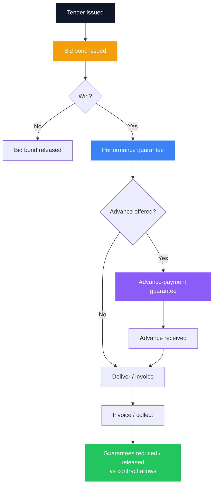
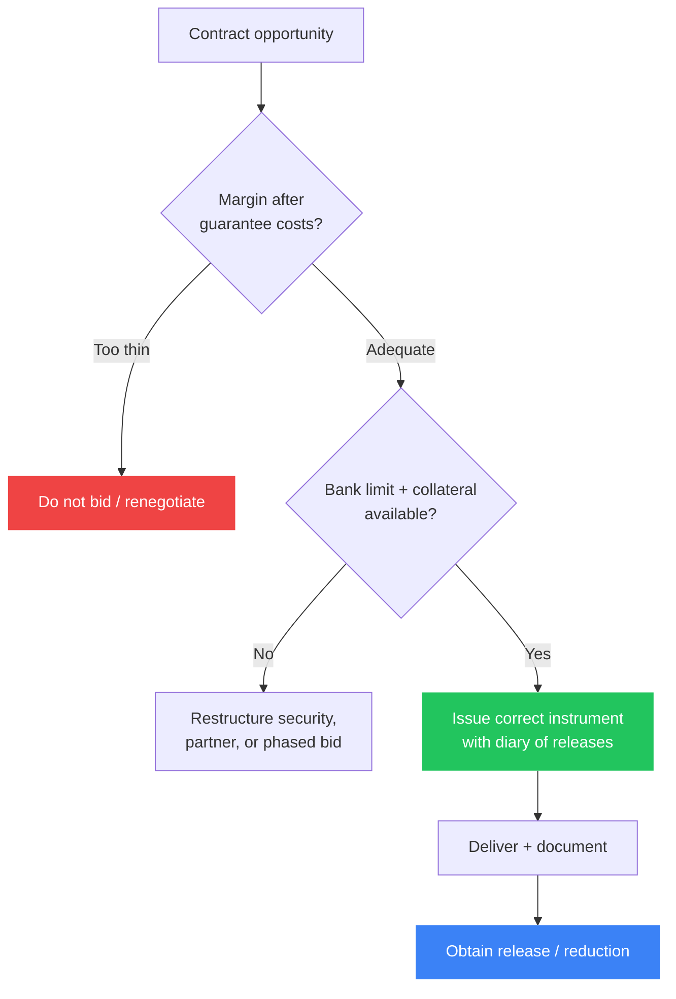

Many Kenyan SMEs discover bank guarantees the hard way: a tender portal demands a **bid bond**, a client will not issue an advance without an **advance-payment guarantee**, or a contract will not start without a **performance bond** - and the bank asks for cash collateral the business thought it would use to buy materials.

A guarantee is not working capital in your account. It is a **contingent promise**: the bank undertakes to pay the beneficiary if you fail to meet a defined obligation. Done well, guarantees **unlock contracts** you could not win on handshake alone. Done badly, they **freeze cash**, crowd out your overdraft, and turn thin-margin tenders into losses before work starts.

> **Key Insight:** Price the guarantee like a cost of goods line - **commission + collateral opportunity cost + limit utilisation** - before you bid. If the contract margin cannot survive that stack, you do not have a sales problem; you have a deal-selection problem.

```cards
- icon: Gavel
  title: Bid bond
  desc: Proves you will take the contract if awarded. Usually smaller face value and shorter tenor - still uses bank limit and often cash.
  linkText: SME facility map
  linkUrl: /blog/sme-finance-handbook-kenya
- icon: ShieldCheck
  title: Performance guarantee
  desc: Backs delivery quality and timelines after award. Larger, longer, and central to construction, supply, and service contracts.
  linkText: Trade finance context
  linkUrl: /blog/sme-trade-finance
  type: amber
- icon: Banknote
  title: Advance-payment guarantee
  desc: Protects the buyer’s mobilisation money. Often required before cash hits your account - plan WC around the lag.
  linkText: Working capital cycle
  linkUrl: /blog/working-capital-cycle-kenya-smes
  type: emerald
```

---

### What a Bank Guarantee Is (and Is Not)

| It is | It is not |
|---|---|
| A **contingent liability** product issued under your facility | Free credit you can spend on stock |
| Payable to a **named beneficiary** on compliant claim | Automatic proof you will perform (claims still happen) |
| Usually secured by **cash margin, fixed deposit, land, or debenture** | Something only “big corporates” use - SMEs live on these instruments |
| A fee-earning product for the bank ([how banks earn](/blog/how-banks-actually-make-money-kenya)) | A substitute for delivery capacity or margin |

Related instruments you will meet in the same conversations: **letters of credit** for imports ([import finance](/blog/import-finance-kenya-guide)), **LPO finance** when the order itself needs funding ([LPO guide](/blog/lpo-purchase-order-finance-kenya)), and invoice tools when the problem is collection after delivery ([accounts receivable](/blog/what-is-accounts-receivable)).

---

### The Three Guarantees SMEs Meet Most

#### 1. Bid bond (tender security)

- **Purpose:** Assures the procuring entity you will honour the bid (sign the contract / provide performance security if awarded).  
- **Typical size:** A fixed amount or a small percentage of bid value (check the tender document - do not guess).  
- **Tenor:** Through bid validity, sometimes with extension clauses.  
- **Failure mode:** You win and refuse to proceed, or you cannot produce the next security - bond is called; reputation and CRB-adjacent pain follow.

#### 2. Performance guarantee (performance bond)

- **Purpose:** Assures the client you will perform per contract (delivery, quality, timeline).  
- **Typical size:** Often a percentage of contract value (commonly discussed in the 5–10% range - **always use the contract**, not market folklore).  
- **Tenor:** Through performance period plus defects liability if required.  
- **Failure mode:** Call on non-performance, dispute, or documentary triggers you did not operationalise.

#### 3. Advance-payment guarantee (APG)

- **Purpose:** Protects the buyer if they pay an advance (mobilisation) and you do not deliver.  
- **Typical size:** Up to 100% of the advance amount.  
- **Tenor:** Until advance is amortised through deliveries or recovered.  
- **Failure mode:** Advance is spent on the wrong things; guarantee stays outstanding; cash is gone but contingent liability remains.



---

### How Banks Price and Secure Guarantees

Banks earn **commission** (and sometimes handling fees) for contingent risk. They also consume **limit** and usually demand **security**.

**Common security patterns:**

- Cash margin or blocked funds (percentage of face value)  
- Lien over fixed deposit  
- Legal charge over land or other assets  
- Debenture / directors’ support for larger lines  
- Counter-indemnity - you repay the bank if it pays the beneficiary  

**Illustrative all-in cost framing** (replace with your bank’s actual letter):

$$
\text{Guarantee cost} \approx \bigl(\text{Commission rate} \times \text{Face value} \times \text{Tenor factor}\bigr) + \text{Fees} + \text{Opportunity cost of collateral}
$$

**Opportunity cost** is the part owners forget. If you lock KES 2,000,000 in a low-yield margin account for nine months to support a performance bond, that capital cannot fund stock or an MMF sleeve. At an illustrative 10% annual opportunity yield:

$$
\text{Opportunity cost} \approx 2{,}000{,}000 \times 0.10 \times \frac{9}{12} = \text{KES } 150{,}000
$$

Add commission on the face value, and a “small” bond has eaten a visible slice of project margin.

| Cost component | What to ask the bank |
|---|---|
| Commission % p.a. or flat | Exact rate, calculation base, minimum fee |
| Tenor rules | How partial release works; extension pricing |
| Cash margin % | Can FD lien replace 100% cash? At what haircut? |
| Limit structure | Separate guarantee limit vs shared with overdraft/LC? |
| Claim process | What documents trigger payment? Notice periods? |

Guarantee lines often sit inside broader **trade and contingent facilities**. Structure them with the same care as revolving credit - see the [SME finance handbook](/blog/sme-finance-handbook-kenya) and [ultimate banking guide](/blog/ultimate-guide-to-banking-in-kenya).

```cards
- icon: Calculator
  title: Price before you bid
  desc: Commission + collateral drag + limit use must fit inside gross margin. If not, walk away or renegotiate scope.
  linkText: Margin discipline case
  linkUrl: /blog/sme-packager-optimization
- icon: Files
  title: Read the claim clause
  desc: “On first demand” vs conditional wording changes real risk. Align operations and legal review before signing.
  linkText: Bank proposal anatomy
  linkUrl: /blog/anatomy-of-a-bank-proposal-kenya
  type: amber
- icon: Link
  title: Align the cash cycle
  desc: APGs free buyer cash but may freeze yours as margin. Model both sides of the [working capital cycle](/blog/working-capital-cycle-kenya-smes).
  linkText: Working capital guide
  linkUrl: /blog/working-capital-cycle-kenya-smes
  type: emerald
```

---

### Worked Example: Thin Tender vs Healthy Tender

Assume a supply contract of **KES 10,000,000**.

| Item | Thin deal | Healthy deal |
|---|---|---|
| Gross margin before finance | 8% (KES 800,000) | 18% (KES 1,800,000) |
| Performance guarantee face (10%) | KES 1,000,000 | KES 1,000,000 |
| Commission (illustrative 2% flat for period) | KES 20,000 | KES 20,000 |
| Cash margin 50% locked 6 months | KES 500,000 | KES 500,000 |
| Opportunity cost @ 10% p.a. for 6 months | KES 25,000 | KES 25,000 |
| **Margin after guarantee stack** | **~KES 755,000** (and still exposed to delivery risk) | **~KES 1,755,000** |

Both “work” on a spreadsheet. The thin deal has little room for a fuel spike, a rejection, or a one-month delay that extends guarantee commission. The healthy deal can absorb friction. Same logic as [LPO margin arithmetic](/blog/lpo-purchase-order-finance-kenya): **finance and contingent costs are part of COGS**.

---

### What the Bank Needs From You

Expect a file that looks like credit - not a one-page email:

- Company KYC, CR12, KRA compliance, directors’ IDs  
- Contract or tender document stating the guarantee wording and amount  
- Evidence you can **perform** (past contracts, capacity, supplier quotes)  
- Financials / bank statements showing the business can survive a call  
- Security you are offering and any existing limit utilisation  
- Sometimes a **board resolution** authorising the facility and signatories  

Account conduct still matters. Chronic bounced payments and maxed overdrafts make contingent limits scarce even when a tender looks perfect. Build bankability as in the handbook’s foundation chapters and [eTIMS discipline](/blog/etims-kenya-sme-guide).

---

### Operational Rules That Prevent Calls

1. **Diary every expiry and extension** - expired bonds that were not replaced can breach contracts.  
2. **Never treat advance money as profit** - amortise it against delivery; keep APG release conditions visible.  
3. **Match subcontractor and supplier terms** to your performance obligations so your failure is not their delay.  
4. **Control variation orders** in writing; informal scope creep is how performance bonds get stressed.  
5. **Separate guarantee limits** from day-to-day overdraft where the bank allows - so one product does not silently kill the other.  
6. **Plan multi-bank structure** if one bank’s contingent appetite is the bottleneck ([multi-bank logic](/blog/ultimate-guide-to-banking-in-kenya)).  
7. **Do not bid every tender** your sales team likes - bid the ones whose guarantee stack your balance sheet can carry.



---

### Guarantees vs Neighbouring Products

| Need | Prefer | Not a substitute |
|---|---|---|
| Win the right to be considered | Bid bond | Personal cheque “goodwill” |
| Prove you will perform after award | Performance guarantee | More sales promises |
| Receive mobilisation safely for the buyer | Advance-payment guarantee | Unsecured verbal advance |
| Pay an overseas supplier against documents | Letter of credit | Performance bond |
| Fund purchase of goods for a local LPO | LPO / PO finance | Performance bond alone |
| Bridge unpaid invoices | Invoice discounting | Bid bond |

Mixing these up is how SMEs apply for the wrong product and lose weeks in credit.

---

### Risk Checklist Before You Sign

- Is the guarantee **on-demand** or conditional - and can we operationally satisfy conditions?  
- What exact **events** allow a call?  
- Is the amount **reducible** with partial delivery?  
- Who pays extension commissions if the client delays acceptance?  
- What happens to cash margin on release - **automatic** or on written discharge?  
- Are directors giving **unlimited** personal guarantees behind the counter-indemnity?  
- Does winning three tenders at once **triple** contingent exposure beyond our facility?

Personal and corporate guarantee entanglement is real - read the spirit of [guarantor risk](/blog/sacco-savers-guarantors) even when the paper is a bank instrument, not a SACCO form.

```cards
- icon: Handshake
  title: Structure the line
  desc: Separate contingent limits, clear security, and release mechanics beat last-minute panic the night before tender close.
  linkText: Why your RM matters
  linkUrl: /blog/why-rm-is-sme-growth-asset
- icon: ClipboardList
  title: Build the file
  desc: Contract wording, capacity evidence, and clean statements move guarantee requests from “possible” to “issued”.
  linkText: Proposal anatomy
  linkUrl: /blog/anatomy-of-a-bank-proposal-kenya
  type: amber
- icon: Phone
  title: Stress-test the deal
  desc: If one claim or one delayed release breaks payroll, the contract is too large for the balance sheet today.
  linkText: Book a session
  linkUrl: /contact
  type: emerald
```

---

### Closing

Bank guarantees are how serious buyers and procuring entities **transfer performance risk** to a regulated balance sheet - yours, via the bank. Treat bid bonds, performance guarantees, and advance-payment guarantees as **core SME infrastructure**, not clerical annoyances. Model commission and collateral drag inside the tender price, keep release diaries as tightly as you keep invoice aging, and refuse contracts whose only path to profit assumes nothing ever goes wrong.

For the wider facility map, use the [SME finance handbook](/blog/sme-finance-handbook-kenya). For cash timing around orders and collections, use the [working capital cycle](/blog/working-capital-cycle-kenya-smes) and [LPO finance](/blog/lpo-purchase-order-finance-kenya). For the full contractor sequence these guarantees sit inside, bid bond through mobilisation, progress claims, and retention, see [the contractor cash flow stack](/blog/contractor-cash-flow-stack-kenya). When you need a contingent facility structured - limits, security mix, multi-bank appetite - explore [services](/services) or [book a session](/contact). The goal is simple: win work that your guarantees can support, and release those guarantees as cleanly as you deliver.
