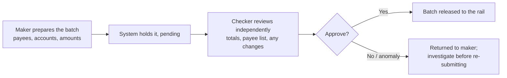

Paying one supplier or one worker is a task anyone can do from their phone. Paying fifty salaries on the 28th, or five hundred casual workers after a harvest, or a hundred suppliers at month-end, is not a bigger version of the same task. It is a **system**, and businesses that treat it as a pile of individual payments discover three problems at once: it is slow, it is needlessly expensive, and it is the single easiest place in the whole business to be robbed.

The [payment rails guide](/blog/how-to-move-money-kenya-payment-rails) established that EFT is the cheap rail for routine bulk payments. This guide is the operational half: *how* you actually run payroll and mass payouts well. It covers the methods for paying many people at once, how to choose between a bank EFT batch and an M-Pesa mass payout, the **maker-checker** control that stops one person emptying the account, the cut-off timing that decides whether salaries land on payday, and the unglamorous but essential work of reconciling the payments that fail and bounce back.

> **Key Insight:** Bulk payment is a controls problem as much as a cost problem. The money involved is large, the payees are many, and one dishonest or careless person with sole access can do enormous damage in a single batch, a ghost worker, an inserted payee, a swapped account. The single most important thing a business can do is separate the person who *prepares* a batch from the person who *approves* it. Get that split right and most of the risk disappears; skip it and no amount of cheap per-item pricing will save you.

```cards
- icon: Layers
  title: Batch, do not pay one by one
  desc: Fifty salaries belong in one uploaded EFT file or one M-Pesa mass payout, not fifty separate transfers. Cheaper, faster, and auditable.
- icon: Users
  title: Maker and checker, always
  desc: One person prepares the batch, a different person approves it. This dual control is the most important fraud defence a business has.
- icon: Wallet
  title: Match the rail to the payee
  desc: Banked payees go by EFT batch; workers on mobile money go by M-Pesa B2C. Paying the wrong rail wastes fees or strands the payment.
  linkText: The rails compared
  linkUrl: /blog/how-to-move-money-kenya-payment-rails
  type: emerald
```

---

### Part 1: The Ways to Pay Many at Once

Four methods cover almost every bulk-payment need, and they differ by who the payees are and how much automation you want.

**Bulk EFT via the bank portal.** You prepare a **batch file**, a list of payees with their bank accounts and amounts, and upload it to your bank's internet-banking or business portal as a single instruction. One approval releases the whole batch, the per-item cost is low, and value arrives the same or next business day. This is the workhorse for **paying banked employees and suppliers**, and for most businesses it is the backbone of payroll.

**M-Pesa mass payout (B2C).** Paying many people straight to their **mobile wallets** at once, through Safaricom's business-to-customer facility, either from the M-Pesa business portal or via integration. This is the right tool where your payees are **on mobile money rather than banked**, casual and field workers, agents, gig and delivery staff, farmer payments, where sending to bank accounts is not an option and instant wallet delivery is exactly what people want.

**Bulk PesaLink.** Some banks offer bulk PesaLink for **instant** multi-payee transfers to bank accounts, useful when a batch is urgent and cannot wait for EFT's clearing cycle.

**Host-to-host / API integration.** At volume, connecting your **payroll or ERP system directly to the bank or to M-Pesa** (through host-to-host links or APIs such as Safaricom's Daraja), so payments flow from your own system and confirmations and statements flow back automatically. This is the graduation step that turns bulk payment from a monthly manual chore into infrastructure, and it is the same automation logic as [the embedded-finance guide](/blog/embedded-finance-kenya-guide).

The one-line map: **EFT batch for banked payees, M-Pesa B2C for wallet payees, bulk PesaLink when it is urgent, and system integration once the volume justifies it.**

---

### Part 2: Choosing the Rail for a Payout

The choice is driven mostly by who is being paid.

| Payees | Best method | Why |
|---|---|---|
| Banked salaried staff and suppliers | Bulk EFT batch | Cheapest per item, one approval, next-day value |
| Casual, field, gig, or unbanked workers | M-Pesa B2C mass payout | They hold mobile money, not bank accounts; instant and usable |
| Urgent multi-payee, all banked | Bulk PesaLink | Instant when the EFT clearing cycle is too slow |
| A single large payment inside the run | RTGS, separately | Big-ticket, same-day; not a bulk rail |
| High, repeated volume | Integrated (host-to-host / API) | Removes manual upload and reconciliation |

Two practical points. First, **do not force one rail onto everyone**: a payroll of salaried staff plus casual workers is often cleanest as an EFT batch for the banked and an M-Pesa payout for the rest, each on the rail that fits. Second, **cost follows the rail**, EFT is the cheapest per item, M-Pesa B2C carries a per-transaction charge, so the mix affects your total cost of paying people, and that cost belongs in the same [fee audit](/blog/sme-transaction-fees-fx-spreads-kenya) as everything else.


---

### Part 3: Maker-Checker, the Control That Matters Most

This is the part small businesses skip and later regret. When one person can prepare *and* release a batch of payments alone, that person, or anyone who compromises their login, can pay whoever they like, and a payroll run is the perfect cover.

The defence is **maker-checker** (dual control): the person who prepares a batch is not the person who approves it.



The checker's job is not a rubber stamp. It is to look for the specific things bulk fraud relies on: a payee who should not be there, an account number that has changed, a total that does not match the approved payroll or invoice list, an amount that is subtly wrong. A checker who actually checks catches exactly the manipulations that a maker acting alone could push through.

For any business paying more than a handful of people, insist on this from your bank when you set up the portal, and enforce it internally, two named people, different logins, genuine review. It is the payments equivalent of the segregation-of-duties discipline in [the new business banking journey](/blog/new-business-banking-journey-kenya), and it is the highest-return control a growing business installs.

---

### Part 4: The Payday Cut-Off

Payroll has a feature no other payment has: the date cannot slip. Staff expect to be paid on the day, and "the bank was closed" is not an answer they accept.

- **EFT and RTGS run on the banking day and have cut-off times.** A batch submitted after the cut-off, or on a weekend or public holiday, does not settle until the next business day. So a payday that falls on, or just after, a weekend or holiday must be run *earlier*, against the cut-off, not against midnight on the day itself.
- **M-Pesa B2C runs 24/7**, so a wallet payout can go out any time, which is one reason it is favoured for time-sensitive field payments.
- **Build the payroll calendar around the bank's cut-offs**, not the nominal payday. Mark the days each month where the 28th or month-end lands awkwardly and schedule the run to clear on time.

This is the operational face of the cash-timing discipline in [the 13-week cash forecast](/blog/13-week-cash-forecast-kenya-sme): the forecast tells you the money is there; the cut-off tells you when it must leave to arrive on time. Missing a payroll cut-off is a morale and trust cost far larger than the payment itself.

---

### Part 5: Reconciliation and the Payments That Bounce

A batch is not finished when you release it. Some payments fail, and catching them is part of the job.

Payments bounce for ordinary reasons: a **wrong or closed account number**, a **dormant account**, a mismatched name, or an unregistered mobile number. When they do, the money is typically returned to your account, and unless someone is watching, a worker or supplier simply goes unpaid and complains later, by which time the batch is cold.

The discipline after every run:

- **Confirm the batch settled**, and pull the list of any **rejected or returned items**.
- **Fix the underlying data**, the corrected account or number, and re-pay the failed items promptly, ideally the same day.
- **Keep the payee master data clean.** Most failures trace back to stale account details; maintaining accurate payee records is cheaper than chasing bounced payments every cycle.
- **Reconcile the total**: what left the account should equal the approved batch minus returns. A gap is a problem to investigate now, not at month-end.

Clean reconciliation also feeds everything downstream, your accounts, your tax position, and the bankable record a lender wants to see, the same reason [reconciled collections matter on the M-Pesa side](/blog/mpesa-for-business-paybill-till-kenya).

---

### Part 6: Fraud on Bulk Payments

Bulk runs attract specific frauds because the volume hides manipulation. Know the shapes.

- **Ghost workers.** Fictitious employees added to the payroll, or real leavers never removed, whose salaries flow to an account the fraudster controls. Defence: periodic payroll audits against actual headcount, and a controlled process for adding and removing staff.
- **Inserted or altered payees.** A fake payee slipped into a batch, or a real payee's account quietly changed to the fraudster's. Defence: the checker reviews the payee list and any changed accounts against a trusted source, exactly what maker-checker is for.
- **Amount tampering.** Small, plausible over-payments to a colluding payee, or a decimal shifted. Defence: the checker reconciles batch totals to the approved payroll or invoice schedule.
- **Login compromise.** A stolen or shared credential used to prepare or release payments. Defence: unique logins, no sharing, strong authentication, and the maker-checker split so one compromised login is not enough.

The pattern is that **bulk fraud is an inside-or-access problem, not a rail problem**, and it is defeated by controls, not by technology alone: dual authorisation, clean payee data, headcount audits, and genuine review. This sits inside the wider [risk-management register](/blog/sme-risk-management-kenya) every SME should keep.

### Risk Factors

| Risk | How it arises | Consequence |
|---|---|---|
| No maker-checker | One person prepares and releases alone | A single actor or compromised login can pay anyone |
| Ghost workers | Fake or ex-staff left on payroll | Salaries drained to a fraudster every cycle |
| Altered payees | Inserted payee or swapped account in a batch | Money paid to the wrong, often unrecoverable, account |
| Missed cut-off | Batch run against the payday, not the cut-off | Salaries land late; trust and morale cost |
| Ignored failures | Bounced payments not caught and re-paid | Workers and suppliers unpaid; angry surprises later |
| Wrong rail | Banked and wallet payees mixed onto one method | Wasted fees or stranded payments |
| Stale payee data | Old account and phone details | High failure rate every run |

### Decision Framework: Before You Run a Batch

**Who am I paying, and on which rail?** Banked payees by EFT batch, wallet payees by M-Pesa B2C, urgent all-banked by bulk PesaLink. Split the run if needed.

**Is maker-checker enforced?** A different person must approve than prepared. If your setup allows one person to do both, fix that before anything else.

**Am I inside the cut-off for payday?** Count back from the day staff must be paid to the bank's cut-off, and schedule the run there, not at midnight.

**How will I catch failures?** Have a defined step to pull rejected items and re-pay them the same day, and keep payee data clean to minimise them.

**When should I integrate?** When manual upload and reconciliation are costing real time each cycle, host-to-host or API integration pays for itself.

### Bengula View

Three observations from the desk.

First, **the maker-checker split is the single most important thing most SMEs are not doing, and it is free.** I have seen more money lost to a trusted person with sole payment access than to any external hack, because a payroll run is the perfect place to hide a theft: large, routine, and rarely re-checked line by line. Separating preparation from approval, two people, two logins, real review, costs nothing and defeats the great majority of internal payment fraud. If a business installs one control this year, it should be this one.

Second, **payroll is an operations discipline pretending to be a payment.** The rail is the easy part; the hard parts are the ones nobody celebrates, running against the cut-off so pay lands on the day, keeping payee data clean so payments do not bounce, catching and re-paying the failures before anyone notices, and reconciling the total every single time. Businesses that treat payroll as a monthly fire-drill lurch from late payment to angry staff; businesses that treat it as a checklist run it quietly forever. The checklist is the product.

Third, **match the rail to the person, and stop overpaying to move money.** Sending salaries to banked staff by anything other than a batch, or forcing wallet workers onto bank rails they do not have, is a quiet, recurring waste. The right design is usually a mix, EFT for the banked, M-Pesa for the rest, and once the volume is real, integration to remove the manual handling entirely. It is not glamorous, but paying people correctly, on time, and cheaply, every cycle, is one of the clearest marks of a business that has its operations under control.

### Conclusion

Paying many people at once is a system, not a stack of tasks. Batch the banked onto EFT and the wallet workers onto M-Pesa B2C, run urgent all-banked payouts on bulk PesaLink, and integrate once the volume justifies it. But the method is the easy half. The half that protects you is the controls: a genuine maker-checker split so no one pays alone, a payroll calendar built around the bank's cut-offs so salaries land on payday, a clean reconciliation that catches and re-pays every bounce, and the audits that keep ghost workers and altered payees out of the batch.

Do the mechanics and you pay people cheaply and on time. Do the controls and you keep the business from being quietly robbed through its own payroll. The first makes you efficient; the second keeps you solvent, and a serious business needs both.

### Related Reading

- [How to Move Money in Kenya: Payment Rails Compared](/blog/how-to-move-money-kenya-payment-rails) for the rails behind each payout method.
- [M-Pesa for Business: Pay Bill vs Buy Goods](/blog/mpesa-for-business-paybill-till-kenya) for the collection side, and why reconciliation matters both ways.
- [The 13-Week Cash Forecast](/blog/13-week-cash-forecast-kenya-sme) for making sure the money is there before the batch runs.
- [The Hidden Leak: Fees and FX Spreads](/blog/sme-transaction-fees-fx-spreads-kenya) for auditing the cost of paying people.
- [The New Business Banking Journey](/blog/new-business-banking-journey-kenya) for setting up dual-control and clean records from the start.
- [If You Send Money to the Wrong Person](/blog/recover-wrong-payment-fraud-kenya) for what happens when a payment goes to the wrong account.

### References

- [Central Bank of Kenya](https://www.centralbank.go.ke/). National payment system oversight, the Automated Clearing House behind EFT, and KEPSS (RTGS).
- [Kenya Bankers Association](https://www.kba.co.ke/). Industry practice on bulk EFT, cut-off times, and business payment services.
- [Safaricom M-Pesa for Business](https://www.safaricom.co.ke/business/sme/m-pesa-for-business). Business-to-customer (B2C) mass payouts and the Daraja API for integration.
- [Kenya Revenue Authority](https://www.kra.go.ke/). PAYE obligations that sit alongside payroll processing; confirm current rates and deadlines.

*All methods, costs, and timings are indicative and stated as at 2026. Bank portal features, M-Pesa B2C tariffs, cut-off times, and integration options are set by each bank and Safaricom and change; confirm current terms with your providers before relying on them.*

*General business education, not individualized financial, payroll, or security advice. Payroll also carries tax and labour obligations beyond the scope of this guide; work with a qualified accountant and confirm current rules with KRA.*
