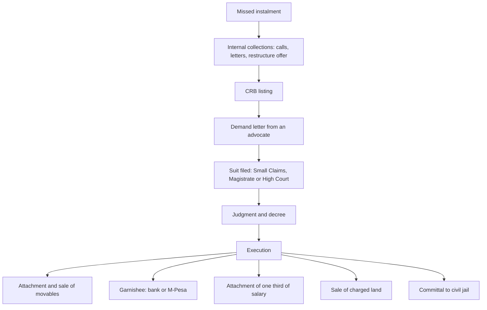

There is a strange silence in Kenyan money writing. We explain how to get a loan in enormous detail: how the bank prices it, what the relationship manager looks for, which product suits which cash flow. Then, at the exact moment the arrangement stops working, the explaining stops. The borrower is left with rumour, a WhatsApp group, and whatever a neighbour heard about auctioneers.

That silence is expensive, because the process that follows a default is not arbitrary. It is a sequence, it is written down, and most of it moves slowly enough that an informed borrower has real choices at several points. People lose property not because the law is merciless but because they did not know which rung of the ladder they were standing on, and so they did nothing until they were standing on the last one.

This guide walks the whole ladder, from the first missed instalment to the last day a judgment can be enforced. It is the hub for a cluster: separate pieces on what a creditor cannot take, and on what a write-off really means, follow it, and this article deliberately stops short of the detail those will own.

> **Key Insight:** Almost everything people fear about default sits at the bottom of the ladder, and almost every opportunity to change the outcome sits at the top. The auctioneer at the gate is the end of a process that began months earlier with a letter that went unanswered. The single most valuable thing in this article is not the law on attachment. It is the fact that a creditor must climb every rung in order, and that each rung takes time you can use.

### The Ladder, End to End



Two things about that diagram matter more than the boxes. First, everything above the decree is negotiable and most of it is reversible. Second, nothing below the decree happens without one. A creditor who has not sued you and obtained a decree cannot attach your property, whatever the caller on the phone implies.

### Part 1: Arrears, and the Stage Where You Still Hold the Cards

The first phase is internal to the lender and has no court in it. Calls, letters, a visit if the exposure is large enough, and at some point an offer to restructure.

This stage is badly misunderstood. Borrowers treat the calls as the problem and avoid them, when the calls are in fact the last stretch of the process where the lender still has discretion. Once a file leaves internal collections, the people you are dealing with have no authority to vary anything. A restructure, a payment holiday, a term extension or a partial settlement is far easier to agree in month two than in month nine.

If the pressure is coming from several lenders at once, the shape of the problem matters more than any single conversation. Work out whether this is a liquidity problem or a solvency problem before you negotiate with anyone. The [13-week cash forecast](/blog/13-week-cash-forecast-kenya-sme) is the tool for that, and [debt consolidation and refinancing](/blog/debt-consolidation-refinancing-kenya) is the route if the answer is that the debt is serviceable but badly structured.

A word on collectors, because the question always comes up. **Kenya has no standalone debt collectors statute and no debt collector's licence.** What binds a collector comes from four different places: the Central Bank of Kenya's Digital Credit Providers Regulations 2022, which licence and supervise digital lenders; the Business Laws (Amendment) Act 2024, which extends CBK supervision across credit providers and outlaws digital debt-shaming; the Data Protection Act 2019, enforced by the Office of the Data Protection Commissioner; and the Auctioneers Act and Rules, which bind auctioneers only. The Data Protection Act is where harassment actually gets punished in practice. The ODPC has fined a digital credit provider KES 2,975,000 for using contact details harvested from third parties to send threatening debt-recovery messages, and fined another operator KES 250,000 in March 2025 for listing a person as a loan guarantor without consent. If you are being contacted through your relatives, your employer or your phone contacts, that is a data protection complaint, not a banking complaint.

### Part 2: The CRB Listing Is Not Enforcement

A credit bureau listing feels like punishment and is often described as one. It is not a step in enforcement. It does not transfer any property, it does not create any obligation, and it does not entitle anyone to take anything. It is a record.

It matters for your access to credit, and the process for correcting an inaccurate one is a separate subject handled in [how to fix your CRB listing](/blog/how-to-fix-your-crb-listing-kenya). Two points belong here and only here. A listing can coexist with a perfectly current negotiation, so being listed does not mean talks have failed. And clearing a listing does not extinguish the debt, which is a confusion so common it gets its own treatment in the piece on write-offs.

### Part 3: The Suit, and Which Court Hears It

If internal collection fails, the next rung is a demand letter from an advocate, and then a suit. Which court hears it depends mostly on how much is claimed.

| Forum | What it handles | Practical note |
|---|---|---|
| Small Claims Court | Civil claims up to **KES 1,000,000**, under section 12(3) of the Small Claims Court Act 2016, covering sale and supply of goods or services, money held or received, liability in tort, and personal injury compensation | Fast, and designed to be used without an advocate. Most consumer and small trade debt lands here |
| Magistrates' Courts | Claims above the small claims ceiling, within the relevant magistrate's pecuniary limit | The workhorse for mid-sized commercial debt |
| High Court | Larger claims and matters outside subordinate court jurisdiction | Slower and more expensive for both sides |

The Small Claims ceiling is set by statute and the figure above is stated as at September 2026. Check it before relying on it, because monetary jurisdiction is the kind of thing that gets revised.

What comes out of a successful suit is a **judgment**, and the order giving effect to it is a **decree**. The decree is the hinge of this entire article. Before it, a creditor has a claim. After it, a creditor has an enforceable instrument and access to the machinery in Part 4.

This is also the stage where the largest number of Kenyan borrowers make the largest avoidable mistake, which is to ignore the suit. A judgment entered in default because nobody filed a defence is just as enforceable as one entered after a full hearing, and setting it aside afterwards is harder, slower and more expensive than defending it would have been.

### Part 4: Execution, and the Menu Available to a Decree Holder

A decree holder chooses how to enforce. The main routes:

**Attachment and sale of movable property.** The classic auctioneer scenario. Goods are attached, proclaimed and sold, subject to the exemptions in Part 5.

**Garnishee proceedings.** Under Order 23 of the Civil Procedure Rules, a decree holder can attach a debt owed to the judgment debtor by somebody else. Your bank owes you your credit balance, so a bank account is the obvious target. The procedure runs in two stages: an order **nisi**, which freezes the funds and requires the third party to come and show cause, and then an order **absolute**, which directs payment to the decree holder.

**And yes, this reaches M-Pesa.** This is the most frequently asked question about Kenyan debt enforcement and the popular answer is usually wrong. Mobile money held by Safaricom for a subscriber is a debt owed to that subscriber, and Kenyan courts have made garnishee orders absolute against Safaricom PLC in respect of funds held in a judgment debtor's M-Pesa account and in a till number. Moving money out of a bank and into mobile money is not a shield.

**Attachment of salary.** Available, but limited, and the limit is the subject of Part 5.

**Sale of charged or mortgaged property.** Where the lender holds security over land, it has remedies under the security instrument and the land statutes in addition to, and often instead of, the decree route. That is a different path with its own notice regime, touched on in [the mortgage decision framework](/blog/mortgage-decision-framework-kenya).

**Committal to civil jail.** The last resort, and the most misunderstood. Part 7.

### Part 5: What a Creditor Cannot Take

Section 44 of the Civil Procedure Act, Cap 21, states the general rule and then carves out a list. The general rule is broad: all property belonging to a judgment debtor, including property held in someone else's name on his behalf, is liable to attachment and sale.

The exemptions are where the practical protection lives. Property **not** liable to attachment includes:

- necessary wearing apparel, cooking vessels, beds and bedding of the debtor, his wife and children, and personal ornaments a woman cannot be parted from under religious usage
- the tools and implements necessary for the performance of his trade or profession
- books of accounts
- a right to sue for damages, and a right of personal service
- stipends and gratuities of government pensioners, service family pension fund payments, and political pensions
- a contingent or possible right or interest, including an expectancy of succession by survivorship
- a right of future maintenance
- any fund or allowance declared exempt by any other law
- **two thirds of the salary of a public officer or other person in employment**

That last one is the rule everybody has heard and most people state backwards. Two thirds of salary is **protected**. One third is exposed.

$$ \text{Maximum attachable from salary} = \frac{1}{3} \times \text{Salary} $$

On a salary of KES 90,000, the most that can be reached by attachment is KES 30,000, and KES 60,000 is beyond the creditor's reach no matter how large the decree.

Now the part nobody tells you. The section also protects an agriculturalist's means of production, and it does so in figures that were set by amendments in 1969 and 1981 and have **never been uprated**:

| Protected category, agriculturalist | Statutory ceiling |
|---|---:|
| Livestock | First **KES 10,000** in value |
| Implements, tools, utensils, plant and machinery for stock, dairy or crop production | First **KES 5,000** in value |
| Agricultural produce necessary to earn a livelihood | First **KES 1,000** in value |

Read those numbers against any real Kenyan farm in 2026. One dairy cow exhausts the livestock protection. A single water pump exhausts the equipment protection. The provision that is supposed to stop a creditor stripping a farmer of the ability to farm has been quietly hollowed out by fifty years of inflation, and it is still the operative law. No popular explainer of this subject mentions it.

One drafting relic worth knowing if you read the section yourself: section 44(2) still refers to the Armed Forces Act, Cap 199, which the Kenya Defence Forces Act 2012 replaced. The cross-reference is stale; the point survives.

The full treatment of protected property, including how the exemptions are argued in practice, is the subject of the next article in this cluster.

### Part 6: The Auctioneer, and the Clock You Did Not Know You Had

An auctioneer acting on a court warrant or a letter of instruction works to the Auctioneers Act and the Auctioneers Rules 1997, and the Rules impose a timetable that borrowers routinely waste through sheer inaction.

For **movable property** other than perishables and livestock, the auctioneer must prepare a proclamation on the prescribed form, setting out the specific items, their value and their condition, with the inventory signed by the owner or by an adult residing or working at the premises. The owner is then entitled to a written notice period, reported as seven days on the prescribed sale form, within which the goods may be redeemed by paying the amount set out in the warrant or letter of instruction.

For **immovable property**, the timetable is longer and involves newspaper advertisement, with the sale to be arranged no earlier than fourteen days after the first advertisement.

Those periods are stated as at September 2026 from the Auctioneers Rules 1997 and secondary summaries of them. Confirm the current rule text before relying on a specific day count, and if an auctioneer is at your gate, the date on the proclamation is the first thing to photograph.

The redemption window is real money. It is the difference between paying the decretal sum and watching your equipment sell at auction for a fraction of its worth, with the shortfall still owed by you.

> **Risk Factors:** The three failures that turn a manageable default into a ruinous one are always the same. Ignoring the suit, which converts a defensible claim into a default judgment. Ignoring the proclamation, which burns the redemption window. And moving assets to frustrate a creditor, which is both ineffective (section 44 reaches property held in another's name on your behalf) and capable of turning a civil problem into something worse. If a decree has been entered against you, get advice within days, not weeks.

### Part 7: Civil Jail, and the Test Most People Never Hear

This is where popular explanation and the actual law diverge most sharply.

Committal to civil jail exists. Its statutory basis is in the Civil Procedure Act and Order 22 of the Civil Procedure Rules, and the mechanics are specific:

- detention is capped at **six months** where the decree is for a sum exceeding KES 100, and **six weeks** in any other case
- the debtor must be released before that period expires on payment of the amount in the warrant, on the decree being otherwise satisfied, on the request of the creditor who applied for the detention, or if that creditor stops paying the subsistence allowance
- the creditor, not the state, funds the debtor's subsistence while detained
- a warrant can be cancelled, or the debtor released, on grounds of serious illness
- for the purpose of an arrest, no dwelling house may be entered after sunset and before sunrise, and a debtor who pays the decree and the costs of arrest to the arresting officer must be released at once

And the provision that surprises almost everyone: **release from civil jail does not discharge the debt.** What it does is bar re-arrest under that same decree. You can serve the full six months and still owe every shilling.

But the threshold question is the one that matters, and the popular version leaves it out entirely. In *In re Zipporah Wambui Mathara* [2010] eKLR the High Court held that committal for civil debt conflicted with Article 11 of the International Covenant on Civil and Political Rights, applied through Article 2(6) of the Constitution. Later decisions did not abolish committal. They confined it. The settled position is that committal is a penal measure available only where the court is satisfied that the debtor **has the means to pay and has wilfully refused or neglected to do so**. It is not available against a person who simply cannot pay. See, for a recent statement of the principle, *Kailikia v M'Thiringi & 2 others* (Civil Appeal E017 of 2024) [2024] KEHC 5860 (KLR).

The practical translation: civil jail is aimed at the debtor who is hiding money, not the debtor who has none. If you are genuinely unable to pay, your exposure is to your property, not your liberty. That distinction is worth a great deal of unnecessary fear.

### Part 8: How Long This Follows You

Two different clocks run, and people conflate them.

The **limitation clock** is in section 4(4) of the Limitation of Actions Act, Cap 22. An action may not be brought upon a judgment after **twelve years** from the date the judgment was delivered, or from the date of default where the judgment directed payment at a particular date or at recurring intervals. Separately, **arrears of interest on a judgment debt cannot be recovered after six years** from the date the interest became due. Note the asymmetry: the principal judgment has a long tail, the interest arrears a shorter one.

That section governs bringing an action **upon** a judgment. The execution timeline engages Order 22 of the Rules as well, and courts have generally run time from the last attempt at execution rather than from the original decree. Treat twelve years as the outer horizon and take advice on the execution position in any specific case.

The **accounting clock** is entirely separate and is the source of the single most damaging misconception in this whole area. When a lender writes a debt off, it is making an entry in its own books to reflect that it no longer expects to collect. It is not forgiving you. The obligation survives a write-off, the file can be sold to somebody else, and enforcement can continue. "Written off" and "written away" are different things, and the gap between them is the subject of the next article but one in this cluster.

```cards
- icon: ShieldCheck
  title: Know Your Rung
  desc: Before you panic or pay, establish exactly where you are. No decree means no attachment, whatever a caller tells you. A decree changes everything and starts a different clock.
  linkText: Borrowing guide
  linkUrl: /blog/borrowing-money-in-kenya-guide
- icon: Percent
  title: Two Thirds Is Yours
  desc: Only one third of a salary can be reached by attachment. The protection is automatic, but it does not apply itself if you never raise it.
  linkText: How banks price loans
  linkUrl: /blog/how-kenyan-banks-price-loans
  type: amber
- icon: Landmark
  title: Complaints Have a Home
  desc: Harassment, debt-shaming and contacting your relatives are data protection matters. The ODPC has issued real fines running into millions of shillings.
  linkText: Digital loan costs
  linkUrl: /blog/mobile-digital-loans-real-cost-kenya
  type: emerald
```

### Decision Framework: Where Are You Standing

**Have you been served with a suit?** If yes, this is the single highest-value moment in the entire process. File a defence or take advice immediately. A default judgment is the most expensive silence in Kenyan consumer finance.

**Has a decree been entered?** Then negotiation moves from the amount to the manner. Instalment arrangements after judgment are common and courts are receptive to realistic proposals backed by evidence of means.

**Is an auctioneer involved?** Photograph the proclamation, note its date, and establish the redemption window before anything is moved. That window is a right, not a courtesy.

**Is the pressure coming through your contacts, your employer or your family?** That is a data protection complaint to the ODPC, and it runs in parallel with everything else. It does not reduce the debt, but it stops the conduct.

**Is the problem solvency rather than liquidity?** If the arithmetic does not work at any repayment level, the enforcement ladder is the wrong frame entirely, and the insolvency route becomes the relevant conversation. That is its own article in this cluster.

### Bengula View

Three observations from the desk.

First, **the timeline is the asset and almost nobody uses it.** Every rung of this ladder has a notice period, a response window or a right of redemption attached. Borrowers who lose the most are rarely the ones with the weakest cases; they are the ones who opened nothing, answered nothing and appeared nowhere until the auctioneer arrived. The process is slow on purpose. Slowness only helps a person who is doing something with the time.

Second, **the fear is misallocated.** The thing people dread most is civil jail, which is the rarest outcome and is legally unavailable against someone who genuinely cannot pay. The thing people worry about least is the default judgment, which is common, cheap for the creditor to obtain and genuinely difficult to undo. If you are going to be frightened of one thing in this article, be frightened of an unanswered summons.

Third, **the agriculturalist exemptions are a quiet scandal and deserve to be said out loud.** A framework that protects the first KES 10,000 of a farmer's livestock is not protecting anything in 2026. It is a provision that has been repealed by inflation while remaining on the books, and the people it was written for are precisely those least able to notice or lobby about it. We will keep pointing at it.

### Conclusion

Default is not a cliff, it is a staircase, and it is a slow one. A missed instalment leads to collections, collections to a listing, a listing to a demand, a demand to a suit, and only a decree unlocks attachment, garnishee and the rest. Each step is written down and each has a clock.

The law is also less brutal than the rumour. Two thirds of your salary cannot be touched. Your tools of trade, your bedding and your children's clothes cannot be sold. You cannot be jailed for being unable to pay, only for refusing to pay when you can. What the law does not do is act on your behalf. Every protection in this article has to be raised by somebody, and the person with the strongest interest in raising it is you.

If you are somewhere on this ladder right now, the useful question is not how bad it can get. It is which rung you are on, and what the clock attached to that rung gives you.

### Frequently Asked Questions

**Can my M-Pesa be frozen for a debt?** Yes, through garnishee proceedings under Order 23 of the Civil Procedure Rules, once a decree exists. Funds Safaricom holds for you are a debt owed to you, and Kenyan courts have made such orders absolute. Moving money from a bank to mobile money does not protect it.

**Can I go to jail for a loan I cannot repay?** No. Committal is available only where a court is satisfied you have the means and have wilfully refused or neglected to pay. Genuine inability is a defence to committal, though not to enforcement against your property.

**How much of my salary can be attached?** One third at most. Two thirds is protected by section 44(1)(viii) of the Civil Procedure Act.

**The bank wrote off my loan. Am I free of it?** No. A write-off is the lender's accounting entry, not a discharge of your obligation. The debt can still be enforced and the file can be sold on.

**They are calling my relatives and my boss. Is that legal?** Processing your contacts' data to pressure you engages the Data Protection Act 2019 and is a complaint to the ODPC, which has imposed fines in the millions of shillings for exactly this conduct.

**How long can a judgment be enforced against me?** Section 4(4) of the Limitation of Actions Act sets twelve years for an action upon a judgment, and six years for arrears of interest on a judgment debt. The execution position in a specific case depends on the history of attempts and warrants advice.

### Related Reading

- [The Complete Guide to Borrowing Money in Kenya](/blog/borrowing-money-in-kenya-guide) for the cornerstone this article sits beneath.
- [How to Fix Your CRB Listing](/blog/how-to-fix-your-crb-listing-kenya) for correcting a listing rather than fearing it.
- [The Overdraft That Never Clears](/blog/overdraft-that-never-clears-kenya) for how a facility becomes permanent debt long before default.
- [Logbook Loans in Kenya](/blog/logbook-loans-kenya) for repossession under a chattels security, which follows a different path from a decree.
- [Mobile and Digital Loans: The Real Cost](/blog/mobile-digital-loans-real-cost-kenya) for the pricing that generates much of this distress.
- [Debt Consolidation and Refinancing](/blog/debt-consolidation-refinancing-kenya) for the route out while you still have options.
- [The 13-Week Cash Forecast](/blog/13-week-cash-forecast-kenya-sme) for telling a liquidity problem from a solvency one.
- [Hire Purchase vs Asset Finance vs Logbook](/blog/hire-purchase-vs-asset-finance-vs-logbook-kenya) for who actually owns the asset when things go wrong.

### References

- [Civil Procedure Act, Cap 21](https://new.kenyalaw.org/akn/ke/act/1924/3/eng@2022-12-31). Section 44 on property liable to attachment and the exemptions; sections 38 and 40 to 43 on arrest, subsistence allowance, detention and release. Read from the Revised Edition 2012; verify the current revision before relying on any provision.
- [Limitation of Actions Act, Cap 22](https://new.kenyalaw.org/akn/ke/act/1968/21). Section 4(4), actions upon a judgment and arrears of interest. Revised Edition 2012 [2010].
- [Small Claims Court Act, 2016](https://new.kenyalaw.org/akn/ke/act/2016/2/eng@2022-12-31). Section 12 on jurisdiction and the pecuniary limit.
- [The Judiciary of Kenya, Small Claims Court](https://judiciary.go.ke/small-claims-court/). Pecuniary jurisdiction and the categories of claim heard.
- [Auctioneers Rules, 1997](https://new.kenyalaw.org/akn/ke/act/ln/1997/120/eng@2022-12-31) and the Auctioneers Act, Cap 526. Proclamation, inventory, redemption notice and advertisement periods.
- Civil Procedure Rules, Order 22 (execution) and Order 23 (garnishee proceedings).
- *In re Zipporah Wambui Mathara* [2010] eKLR, and *Kailikia v M'Thiringi & 2 others* (Civil Appeal E017 of 2024) [2024] KEHC 5860 (KLR), on committal and the means test.
- [Data Protection Act, 2019](https://www.odpc.go.ke/) and the Office of the Data Protection Commissioner. Complaints under section 56 and administrative penalties under section 63; published enforcement decisions against digital credit providers.
- [Central Bank of Kenya](https://www.centralbank.go.ke/), Digital Credit Providers Regulations 2022, and the Business Laws (Amendment) Act 2024.

*Statutory provisions and monetary thresholds are stated as at September 2026 and are summarised, not reproduced in full. The Civil Procedure Act and Limitation of Actions Act provisions were read from the Revised Edition 2012. Statutes are amended and court practice changes; verify the current text on Kenya Law before acting.*

*This article is general legal and financial education, not legal advice, and it does not create an advocate-client relationship. Enforcement proceedings move on fixed timelines and the cost of missing one is usually permanent. If you have been served with a suit, a decree or a proclamation, instruct a qualified advocate immediately rather than relying on any general guide, including this one.*
