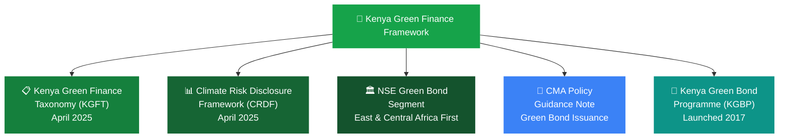

# Green Financing in Kenya: The Complete Guide for Businesses and Investors

Green financing is not a niche. It is the fastest-growing segment of global capital markets, and Kenya is ahead of most African peers in building the infrastructure to access it.

The total funding required to implement Kenya's climate mitigation and adaptation actions under its updated Nationally Determined Contributions (NDCs) is estimated at USD 62 billion. Kenya has committed to mobilising 13% of this amount domestically, approximately USD 8 billion, with the larger share of approximately USD 54 billion expected from private sector partnerships and international financing.

That USD 54 billion gap is the opportunity. It will not be filled by government budget lines. It will be filled by green bonds, blended finance structures, ESG-linked loans, development finance institution (DFI) credit lines, and climate-linked insurance. The question for Kenyan banks, SMEs, real estate developers, agribusinesses, and institutional investors is how to position themselves to access these flows.

On April 4, 2025, the Central Bank of Kenya launched the Kenya Green Finance Taxonomy (KGFT) alongside the Climate Risk Disclosure Framework (CRDF), providing a common language between financiers, regulators, investors, and policymakers, reducing ambiguity and minimising the risk of greenwashing. These two tools changed the green finance landscape in Kenya from aspirational to operational.

---

### What Green Financing Actually Is

Green financing is the channelling of capital, through debt, equity, or guarantees, into projects and activities that generate measurable environmental benefits. The environmental benefit must be real, verifiable, and reported against a recognised standard.

It covers a broad range of instruments:

- **Green bonds:** Fixed-income securities whose proceeds are ring-fenced for green projects
- **Sustainability-linked bonds (SLBs):** Bonds whose financial terms (interest rate) are tied to the issuer meeting specific sustainability performance targets
- **Green loans:** Loans where proceeds are designated for eligible green projects
- **Sustainability-linked loans (SLLs):** Loans where the interest rate adjusts based on the borrower's ESG performance
- **Blended finance:** Structures that combine concessional development finance with commercial capital to de-risk projects for private investors
- **Carbon credits:** Tradeable certificates representing verified emissions reductions, which green projects can generate and sell as an additional revenue stream
- **Climate insurance:** Products that protect businesses and farmers against climate-related losses

What green financing is not: a standard loan or bond with a green label attached. The Kenya Green Finance Taxonomy defines which economic activities and assets qualify as environmentally sustainable, enabling financial institutions to confidently support sectors such as renewable energy, climate-smart agriculture, energy-efficient housing, waste management, and sustainable transport.

---

### Why Kenya Needs Green Finance Urgently

Kenya is among the most vulnerable countries in the world to the impact of climate change. The climate-sensitive nature of Kenya's most important sectors, including agriculture, water, energy, and tourism, mean the economic costs of climate change are significant. Kenya could lose up to 7.25% of economic output by 2050 if it does not take strong action to adapt and mitigate.

Seventeen out of the 20 countries most threatened by climate change are located in Africa, despite the continent contributing minimally to global greenhouse gas volumes. Kenya bears the cost of a problem it did not create. Green finance is the mechanism for accessing the international capital that recognises that asymmetry.

The practical consequences of climate vulnerability in Kenya are already visible: longer and more severe droughts reducing agricultural yields, flash flooding destroying infrastructure in Nairobi and coastal counties, sea-level encroachment threatening Mombasa's port infrastructure, and erratic rainfall patterns disrupting the farming calendar for millions of smallholder farmers who supply Kenya's food system.

Each of these risks has a financing corollary. Climate-resilient irrigation reduces drought exposure. Green housing reduces urban heat island effects. Flood-resilient infrastructure reduces reconstruction costs. Green finance is the capital that funds those adaptations.

---

### The Regulatory Framework: What CBK Has Built

**Kenya Green Finance Taxonomy (KGFT).** Released by CBK in April 2025, the KGFT is a classification system that enables market participants to classify their economic activities as climate-aligned. It defines eligible sectors and minimum technical screening criteria. Any green bond, green loan, or ESG-linked product issued by a Kenyan financial institution must demonstrate alignment with the KGFT to be credibly labelled as green.

The taxonomy was developed in partnership with the European Investment Bank and initially focuses on climate change mitigation and adaptation, with plans to expand to biodiversity and other environmental objectives in future updates.

**Climate Risk Disclosure Framework (CRDF).** The CRDF compels banks and financial institutions to assess and publicly report how climate risks could affect their operations and portfolios. This is the accountability mechanism: banks that finance fossil fuel-heavy industries must disclose the climate risk exposure that creates. Investors and depositors can then price that risk accordingly.

**NSE Green Bond Segment.** The Nairobi Securities Exchange listed the first green bond market in East and Central Africa in 2020. The segment provides a dedicated listing venue for green bonds, with associated tax exemptions for qualifying issuers. Investors who purchase listed green bonds benefit from capital gains tax exemptions on secondary market trades.

**Kenya Green Bond Programme (KGBP).** Launched in 2017 by the NSE, Kenya Bankers Association (KBA), and Climate Bonds Initiative (CBI), the KGBP builds the market through dedicated support streams for smaller issuers, capacity building, and framework development.

---

### Green Bond Instruments: A Practical Guide

| Instrument | Where Proceeds Go | What Varies | Kenya Example |
|---|---|---|---|
| Green bond | Ring-fenced for green projects | Nothing; fixed coupon | Acorn KES 5B at 12.25% |
| Sustainability-linked bond | General budget | Coupon steps up if targets are missed | Planned USD 500M sovereign SLB |
| Green loan | Designated green activity | Preferential rate | Bank SME products post-KGFT |
| Sustainability-linked loan | General corporate purposes | Rate adjusts with ESG performance | Corporate facilities |
| Blended finance | Specific project | DFI guarantee de-risks commercial capital | GuarantCo on the Acorn bond |
| Carbon credits | Not financing; a revenue stream | Price of verified emissions reductions | Peercarbon agritech aggregation |

#### Green Bonds

Green bonds are fixed income instruments whose proceeds are earmarked exclusively for projects with environmental benefits, mostly related to climate change mitigation or adaptation, but also covering natural resources depletion, biodiversity loss, and air, water, or soil pollution.

For investors, green bonds function identically to conventional bonds in terms of coupon payments and principal repayment. The difference is the use of proceeds and the associated impact reporting obligation. For issuers, the benefit is access to a wider pool of capital from ESG-mandated investors who cannot or will not purchase conventional bonds.

**The Acorn Holdings Case Study.** Kenya's journey began in 2019 with a coordinated push from regulators and development partners. The catalyst was Acorn Holdings' KES 5 billion, five-year green bond, which became East and Central Africa's first certified green bond. Carrying a 12.25% yield, it funded eight energy-efficient, EDGE-certified student housing developments in Nairobi, creating more than 7,000 green beds, 980 direct jobs (41% held by women), and reducing 142.93 tCO2e annually per property.

The bond was oversubscribed by 46%, demonstrating that Kenyan investors had appetite for green instruments at the right yield. GuarantCo guarantees provided the credit enhancement that brought institutional investors in at scale. This is the blended finance model in action: a DFI guarantee de-risks the instrument for commercial investors, allowing the issuer to access capital it could not raise on a purely commercial basis.

#### Sustainability-Linked Bonds

Kenya is preparing a landmark USD 500 million sustainability-linked sovereign bond tied to emissions reductions and rural electrification targets, described as a first of its kind globally. The issuance is part of the external financing pipeline being executed with World Bank support.

Sustainability-linked bonds differ from green bonds in one critical way: the proceeds are not ring-fenced for specific green projects. Instead, the bond's coupon rate adjusts based on whether the issuer meets predetermined sustainability performance targets (SPTs). If Kenya hits its rural electrification target, the coupon stays at the base rate. If it misses, the coupon steps up, penalising the issuer financially.

This structure is more flexible for sovereign issuers who need general budget financing rather than project-specific funding, and it aligns the government's borrowing cost directly with its climate commitments.

#### Sovereign Green Bond

Kenya will issue its debut USD 500 million green sovereign bond with World Bank support. A sovereign green bond is a government fundraiser that seeks to raise money for projects promoting environmental sustainability, including renewable energy, clean transportation, and green housing.

For Kenya, sovereign green bond proceeds will fund NDC-aligned projects across renewable energy, water, transport, and agriculture. The issuance signals to international capital markets that Kenya's green finance framework is mature enough to support a rated sovereign instrument, opening the door for follow-on issuances and attracting ESG-mandated institutional investors who require sovereign-level credit quality.

---

### Eligible Sectors Under the Kenya Green Finance Taxonomy

The KGFT defines which activities qualify as green. The eligible sectors align with Kenya's NDC commitments and development priorities:

| KGFT Sector | Qualifying Examples |
|---|---|
| Renewable energy | Solar, wind, geothermal, off-grid rural electrification |
| Climate-smart agriculture | Drought-tolerant crops, efficient irrigation, agroforestry, index insurance |
| Energy-efficient buildings | EDGE-certified construction, 20%+ efficiency improvement |
| Sustainable transport | EVs and charging, non-motorised transport, mass rapid transit |
| Waste and circular economy | Waste-to-energy, recycling infrastructure, plastics reduction |
| Water and wastewater | Treatment, distribution efficiency, wastewater management |
| Blue economy | Sustainable fisheries, coastal ecosystem protection |

**Renewable Energy.** Solar, wind, geothermal, and small hydropower generation. Kenya's geothermal capacity at Olkaria and solar installations across arid and semi-arid regions are prime candidates. Off-grid solar for rural electrification qualifies under both mitigation and adaptation objectives.

**Climate-Smart Agriculture.** Eligible activities include drought-tolerant high-value and alternative crops, water harvesting for crop production, efficient irrigation systems, index-based weather insurance, conservation agriculture, agroforestry, soil management, animal breeding, and integrated farming systems including aquaculture. For Kenyan agribusinesses and farmer cooperatives, this is the most immediately accessible entry point into green finance.

**Energy-Efficient Buildings.** Buildings certified under EDGE (Excellence in Design for Greater Efficiencies) or equivalent standards that demonstrate at least 20% improvement over standard construction in energy, water, and embodied energy. Acorn Holdings used this standard for its student housing development.

**Sustainable Transport.** Electric vehicles and charging infrastructure, non-motorised transport networks, mass rapid transit systems. Nairobi's BRT project and Kenya Railways' upgrade programme have components that qualify under this category.

**Waste Management and Circular Economy.** Waste-to-energy projects, recycling infrastructure, and reduction of single-use plastics qualify. Several Kenyan plastic recycling startups have structured green finance applications around this category.

**Water and Wastewater.** Water treatment, distribution efficiency improvements, and wastewater management. Water scarcity in Kenya's arid counties makes this one of the most pressing adaptation finance categories.

**Blue Economy.** Sustainable ocean and freshwater fisheries management, coastal ecosystem protection. Relevant for Kenya's coastal counties and the fishing communities around Lake Victoria.

---

### How Kenyan SMEs Can Access Green Finance

Kenya's green bond market has mobilised over GBP 65 million since 2017. By 2030, the market could hit KSh 91 billion annually, with SMEs capturing 30% via blended models.

Most SMEs cannot issue their own green bonds, the minimum viable issuance size is KSh 50-200 million and the process requires CMA approval, third-party verification, and ongoing impact reporting. The more practical access points for smaller businesses are:

**Green loans from commercial banks.** Following the KGFT release, Kenyan commercial banks are developing green loan products for eligible SME activities. An agribusiness installing solar irrigation, a manufacturer replacing diesel generators with solar, or a real estate developer building to EDGE standards can access preferential lending rates under a green loan framework. The loan proceeds are designated for the green activity, and the borrower reports on environmental impact outcomes.

**DFI credit lines.** Development finance institutions including Proparco, DEG, FMO, and the African Development Bank channel concessional capital through Kenyan commercial banks to qualifying SME borrowers. Peercarbon, a Kenyan climate fintech startup, facilitated KSh 200 million in funding for 50+ agritech SMEs in 2025 via NCBA-Proparco credit lines, reducing diesel use by 30%. These DFI lines typically offer below-market interest rates for qualifying green activities.

**Carbon credits.** A Kenyan SME or agribusiness that implements verified emissions reductions, through reforestation, clean cooking fuel distribution, or sustainable land management, can earn carbon credits and sell them on voluntary carbon markets. This creates an additional revenue stream on top of the underlying business activity. The verification and registration process requires third-party auditing, which has historically been a cost barrier for small projects, but aggregation platforms are emerging to pool small projects into viable credit volumes.

**KGBP support structures.** The Kenya Green Bond Programme provides dedicated support streams for smaller issuers, including capacity building and access to credit guarantee schemes from partners such as GuarantCo. SMEs considering a green bond issuance should engage the KGBP early for technical assistance on structuring and verification.

---

### How Investors Access Kenya's Green Bond Market

Investing in Kenyan green bonds largely mirrors purchasing any Kenyan corporate bond, with added tax incentives.

**Step 1: Open a CDSC account.** The Central Depository and Settlement Corporation account holds your securities digitally. Required for any NSE-listed bond.

**Step 2: Open a brokerage account.** With a licensed NSE member firm. This enables secondary market trading.

**Step 3: Choose your instrument.** Primary issuance subscriptions offer the cheapest entry. Secondary market purchases through a broker are available for listed instruments. Review NSE's green bond resources, CMA guidelines, and KGBP frameworks before committing.

**Step 4: Monitor and report.** Green bond issuers are required to publish annual impact reports disclosing how proceeds were used and what environmental outcomes were achieved. Investors should review these reports to verify that the green label is substantive.

**Tax benefits.** Green bonds listed on the NSE qualify for income tax exemption on interest income and capital gains tax exemption on secondary market trades, making them tax-efficient relative to conventional fixed income instruments.

**Risk considerations.** Liquidity risk remains, since green bonds still trade in low volumes on the NSE. Greenwashing risk, where issuers mislabel ordinary projects as green, is mitigated by certification from the Climate Bonds Initiative (CBI) or ICMA. Interest rate risk is elevated given CBK's high benchmark rate environment. Many financial advisers recommend keeping green bonds at 10 to 20% of a diversified Kenyan portfolio until the market deepens.

---

### What Banks Must Do Under the CRDF

The Climate Risk Disclosure Framework compels banks to assess and publicly report how climate risks could affect their operations and portfolios. This applies to all CBK-licensed commercial banks and is not optional.

The CRDF requires:

**Physical risk assessment.** How exposed is the bank's loan book to climate-related physical risks? A bank with significant exposure to coastal real estate, agricultural lending in drought-prone regions, or manufacturing in flood-prone areas must quantify that exposure.

**Transition risk assessment.** How exposed is the portfolio to the economic risks of transitioning to a low-carbon economy? A bank heavily lending to fossil fuel importers or carbon-intensive manufacturers faces transition risk as regulations tighten and markets shift.

**Public disclosure.** Climate risk disclosures must be published in a standardised format, enabling investors, depositors, and regulators to compare institutions and identify those with unsustainable climate risk concentrations.

For Absa Bank Kenya and other tier-1 institutions, CRDF compliance is also a prerequisite for accessing international green finance facilities and DFI partnership arrangements. International investors increasingly require CRDF-aligned disclosures before committing capital to Kenyan banking institutions. See Bengula's [Ultimate Guide to Banking in Kenya](/blog/ultimate-guide-to-banking-in-kenya) for how this connects to the broader corporate banking landscape.

---

### Green Finance and the Kenyan Investor: The ESG Angle

ESG (Environmental, Social, and Governance) investing evaluates companies and projects not just on financial returns but on their environmental impact, social contribution, and governance quality. Green finance is the environmental dimension of ESG.

For Kenyan institutional investors (pension funds, insurance companies, unit trusts), ESG criteria are increasingly part of the investment mandate. The Retirement Benefits Authority has been developing ESG integration guidelines for pension fund trustees. A pension fund that ignores climate risk in its portfolio construction is potentially breaching its fiduciary duty to members whose retirement savings are exposed to stranded asset risk.

For individual Kenyan investors, the ESG angle is simpler: green bonds offer competitive yields with tax advantages, and the impact reporting provides transparency on where your money is working that conventional fixed income cannot offer.

---

### The Green Finance Opportunity in One Number

Kenya needs USD 62 billion to implement its climate commitments. USD 54 billion of that must come from private sector and international sources. Kenya's GDP is approximately USD 120 billion. The green finance gap is equivalent to nearly half of annual economic output.

That gap will not close through goodwill. It will close through structured financial products, credible taxonomies, transparent disclosure, and the same commercial discipline that drives any other capital allocation decision. The KGFT and CRDF are the infrastructure CBK has built to make that possible.

For businesses: the earlier you structure your activities to qualify under the KGFT, the sooner you access the concessional capital and DFI credit lines that carry better terms than commercial alternatives. For investors: Kenya's green bond market is early-stage, which means the yields are competitive and the entry points are good, but the due diligence requirement is higher than a mature market.

Green finance in Kenya is not a moral argument. It is a capital allocation argument. The money is moving. The question is whether Kenyan businesses and investors are positioned to receive it.

---

### Sources and Further Reading

- [Kenya Green Finance Taxonomy, CBK April 2025](https://data.sbfnetwork.org/sites/default/files/survey-attachments/2025-05/CBK%20-%20Kenya%20Green%20Finance%20Taxonomy%20-%20Final%20-%20April%202025.pdf)
- [CBK Issuance of KGFT and CRDF, CBK Press Release](https://www.centralbank.go.ke/2025/04/04/11193/)
- [Kenya Green Finance Tools, Green Central Banking](https://greencentralbanking.com/2025/04/09/kenya-launches-green-finance-tools-to-promote-sustainable-economy/)
- [Why CBK's New Green Finance Rules Matter, Business Daily](https://www.businessdailyafrica.com/bd/opinion-analysis/columnists/why-cbk-s-new-green-finance-rules-matter-now-more-than-ever-4992768)
- [Kenya Eyes KSh 64.5bn Debut Green Bond, Business Daily](https://www.businessdailyafrica.com/bd/markets/capital-markets/kenya-eyes-sh64-5bn-debut-green-bond-to-plug-funding-deficit-5429296)
- [NSE Green Bonds, Nairobi Securities Exchange](https://www.nse.co.ke/green-bonds/)
- [Complete Guide to Kenya's Green Bond Market, Africa Digest News](https://climatechange.co.ke/a-complete-guide-to-kenyas-green-bond-market-for-new-investors/)
- [Opportunities for SMEs in Kenya's Green Bond Market, Africa Digest News](https://climatechange.co.ke/opportunities-for-smes-in-kenyas-green-bond-market/)
- Bengula Inc: [Top Fintech Trends Shaping Kenya in 2026](/blog/top-fintech-trends-2026), [Banking-as-a-Service in Kenya](/blog/banking-as-a-service-kenya-baas-guide), [Ultimate Guide to Banking in Kenya](/blog/ultimate-guide-to-banking-in-kenya), [What Is a Cashless Economy](/blog/what-is-a-cashless-economy), [What Are the Different Types of Acquisitions](/blog/types-of-acquisitions)
