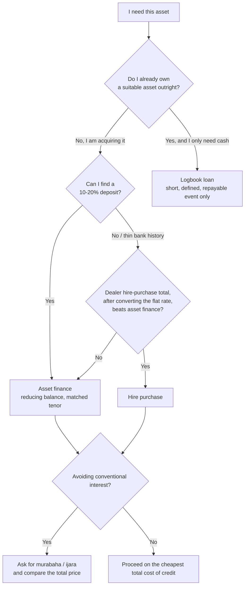

You need a vehicle, a delivery van, a posho mill, or a machine, and you do not have the cash to buy it outright. Three products will get it into your yard: **hire purchase**, **asset finance**, and, if you already own a similar asset, a **logbook loan** against it. They are advertised as if they are the same thing with different names. They are not.

They differ on the four things that actually matter: who legally owns the asset while you are paying, how the interest rate is quoted, how much deposit you must find, and what happens to you if the arrangement fails. Choosing the wrong one on a vehicle purchase routinely costs a Kenyan buyer several hundred thousand shillings over the life of the loan, and the mistake is almost always the same one: reaching for the fast, loudly-advertised product when a slower, cheaper one was available.

This guide sets the three side by side, converts the flat-rate quote that makes hire purchase look cheaper than it is, and ends with a rule simple enough to apply at the dealership.

> **Key Insight:** Match the product to the question you are actually asking. "I am acquiring an asset I do not yet own" is an asset-finance or hire-purchase question. "I own an asset outright and need cash against it" is a logbook question. The single most expensive error in this market is using a logbook-style facility to *buy* something, because it is priced for cash-against-collateral, not for acquisition, and it costs a multiple of the right product.

```cards
- icon: Car
  title: Buying? Asset finance first
  desc: If you are acquiring the vehicle or machine, asset finance is usually the cheapest, priced on a reducing balance over a tenor matched to the asset's life.
  linkText: Asset finance explained
  linkUrl: /blog/asset-finance-vs-conventional-loans
  type: emerald
- icon: Percent
  title: A flat rate is not the rate
  desc: Hire purchase is often quoted flat. A 13% flat quote can be near 22% on a reducing basis. Convert before you compare anything.
  linkText: How rates really work
  linkUrl: /blog/mobile-loan-vs-bank-loan-apr-breakdown
  type: amber
- icon: TriangleAlert
  title: Logbook is a last resort for buying
  desc: A logbook loan against a car you already own is for raising cash, not acquiring an asset. Using it to buy is the wrong instrument at the wrong price.
  linkText: What a logbook really costs
  linkUrl: /blog/logbook-loans-kenya
  type: rose
```

---

### Part 1: What Each Product Actually Is

The three look similar from the borrower's seat, a monthly instalment against an asset, but the legal structure underneath each is different, and that structure is what decides your rights.

**Hire purchase.** You "hire" the asset and pay for it in instalments, and ownership transfers to you only when the final instalment is paid. Until then the financier is the legal owner and you are the hirer in possession. In Kenya this sits under the Hire Purchase Act (Cap. 507). The practical consequence: for the whole term, the thing in your yard is not yet yours. Hire purchase is most common at dealerships and for equipment, and it is very often quoted on a **flat rate**, which is where the cost hides.

**Asset finance.** A bank lends you the money to buy the asset, and the asset itself secures the loan. Structures vary, some are documented as a loan with the asset as security, some as a lease or hire purchase inside the bank, but the commercial shape is a reducing-balance facility over a tenor matched to the asset. You typically put down a deposit (often 10% to 20%), the bank funds the rest, and the interest is charged on the declining balance. This is the mainstream, and usually the cheapest, way a business buys a vehicle or machine. The full mechanics sit in [asset finance versus conventional loans](/blog/asset-finance-vs-conventional-loans).

**Logbook loan.** You already own a vehicle outright, and you borrow cash against it. The lender registers an interest against the logbook at NTSA, you keep driving, and you repay in instalments. It is not an acquisition product at all: nothing is being bought. It is cash-against-collateral, usually quoted flat, usually the most expensive of the three, and enforced fastest. The full anatomy, including how a "3% a month" quote reaches roughly 61% a year, is in [logbook loans in Kenya](/blog/logbook-loans-kenya).

The one-line distinction to hold onto: hire purchase and asset finance **put an asset in your hands that you do not yet own**; a logbook loan **takes cash out of an asset you already own**.

---

### Part 2: The Comparison That Matters

Set the three against the variables that decide cost and risk.

| Dimension | Hire Purchase | Asset Finance | Logbook Loan |
|---|---|---|---|
| **Purpose** | Acquire an asset | Acquire an asset | Raise cash against an owned asset |
| **Who owns it while you pay** | The financier, until the last instalment | You (bank holds security over it) | You (lender's interest noted at NTSA) |
| **Rate method** | Usually flat | Usually reducing balance | Usually flat |
| **Typical deposit** | Often lower, sometimes minimal | 10% to 20% of asset value | None (you already own the asset) |
| **Tenor** | Matched to asset, often 1 to 4 years | Matched to asset, often up to 5 years | Short, often 6 to 24 months |
| **Headline cost** | Looks low (flat), is higher than it looks | Lowest of the three, on a like-for-like basis | Highest, priced for speed |
| **Early settlement** | Often penalised; flat interest may not rebate fully | Interest stops accruing on cleared balance | Often penalised; flat structure resists early payoff |
| **What default costs** | Repossession of an asset you never owned | Repossession, but you had equity in it | Fast repossession of transport you rely on |
| **Best when** | Dealer offer genuinely cheapest after conversion | Buying and want the lowest reducing-balance cost | You own a car and need short-term cash |

Two rows in that table do most of the work.

The **rate method** row is where money is won or lost. A flat rate charges interest on the full original amount for the whole term, ignoring the principal you have already repaid. A reducing-balance rate charges only on what you still owe. The same numerical rate is far cheaper on a reducing basis, and comparing a flat quote against a reducing quote as if they were equivalent, which is exactly what dealerships invite you to do, is comparing two different currencies.

The **who owns it** row decides what your instalments are buying. Under hire purchase you are building toward ownership you do not hold until the end; miss the final stretch and you can lose an asset you have very nearly paid off. Under asset finance you own the asset and have equity in it from the start, which is a materially stronger position if things go wrong.


---

### Part 3: The Flat-Rate Trap, Worked in Full

This is the part the comparison table cannot show in a single cell, so work it through on a real purchase.

You are buying a KES 2,000,000 vehicle. Assume in both cases a 10% deposit (KES 200,000), so KES 1,800,000 is financed over 48 months.

**Asset finance, reducing balance at 16% a year.** Interest is charged only on the outstanding balance, which falls every month.

$$
\text{Instalment} = \frac{P \times r}{1 - (1+r)^{-n}}, \qquad r = \frac{0.16}{12}, \quad n = 48
$$

That gives a monthly instalment of about **KES 51,000**, a total of roughly **KES 2,448,000**, and interest of about **KES 648,000** on the KES 1,800,000 financed.

**Hire purchase, flat rate at 13% a year.** This *sounds* cheaper than 16%. It is not.

$$
\text{Interest}_{\text{flat}} = P \times r_{\text{flat}} \times n_{\text{years}} = 1{,}800{,}000 \times 0.13 \times 4 = 936{,}000
$$

The monthly instalment is (1,800,000 + 936,000) ÷ 48, about **KES 57,000**, and the total financed cost is roughly **KES 2,736,000**.

| Line | Asset finance (16% reducing) | Hire purchase (13% flat) |
|---|---|---|
| Amount financed | KES 1,800,000 | KES 1,800,000 |
| Quoted rate | 16% | 13% |
| Total interest | ~KES 648,000 | KES 936,000 |
| Monthly instalment | ~KES 51,000 | ~KES 57,000 |
| **True rate on a reducing basis** | **16%** | **about 22%** |
| **Extra you pay** | baseline | **~KES 288,000 more** |

The 13% flat quote is really about **22% on a reducing basis**, higher than the 16% asset-finance rate it appeared to undercut, and it costs roughly **KES 288,000 more** over four years for the same vehicle. The buyer who "shopped on rate" and picked 13% over 16% chose the more expensive loan while believing they had saved.

The conversion rule is worth memorising: **a flat rate is roughly 1.8 to 1.9 times its reducing-balance equivalent** over a multi-year tenor. When a dealer quotes flat and a bank quotes reducing, you are not looking at two prices for the same thing. You are looking at one real price and one disguised one. The full arithmetic of why this happens is in the [guide to interest rates and APR](/blog/mobile-loan-vs-bank-loan-apr-breakdown).

---

### Part 4: "Lipa Mdogo Mdogo" and the Instalment Illusion

The retail version of this trap is the "lipa mdogo mdogo" (pay little by little) offer on phones, appliances, boda bodas, and small equipment. The pitch is always the instalment, never the total: "Only KES 3,500 a week."

The instalment is designed to be the only number you see, because it is the only number that looks small. Do the two calculations the seller hopes you will skip:

- **Multiply out the total.** KES 3,500 a week for 78 weeks is KES 273,000 for a device that sells for KES 150,000 cash. That is not a payment plan, it is an 82% markup wearing the costume of convenience.
- **Ask what the cash price is and what the financed price is.** The gap between them, divided by the cash price and annualised, is your real cost of credit. If the seller cannot or will not give you both numbers, that refusal is the answer.

None of this makes instalment buying wrong. For a productive asset that earns while you pay for it, spreading the cost is entirely rational, that is the whole logic of asset finance. It becomes a trap only when the instalment hides a cost you would reject if it were stated as one number, and when the asset is consumption rather than production. A boda that earns KES 1,500 a day can carry an instalment. A television cannot.

> **Risk Factors:** the instalment illusion works because it separates *affordability* (can I make this week's payment?) from *value* (is this a good price?). They are different questions. A payment you can afford on an asset that is badly overpriced is still a bad deal; you simply feel it slowly instead of all at once.

---

### Part 5: The Islamic Finance Alternative

For buyers who want to avoid conventional interest, the same acquisition can be structured without a flat or reducing *rate* at all.

Under **murabaha**, the bank buys the asset and sells it to you at a disclosed mark-up, payable in instalments. The total price is fixed and known upfront; there is no interest accruing on a balance, and no penalty interest that compounds. Under **ijara**, the bank leases the asset to you and ownership can transfer at the end, closer in shape to hire purchase but without interest.

The practical points for a buyer comparing this against asset finance:

- **Compare the total, not the mechanism.** A murabaha's fixed mark-up is directly comparable to the total cost of credit on an asset-finance deal. Put both totals side by side in shillings; the cheaper total wins, whatever it is called.
- **The fixed price is a genuine feature.** Because the mark-up is set at the outset and does not float with the base rate, a murabaha gives certainty that a variable-rate asset-finance deal does not. In a rising-rate environment that certainty has real value.
- **Early settlement differs.** Ask specifically how early repayment is treated, since the mark-up was fixed on the original tenor.

The full structures, including how they price and where they are offered in Kenya, are in the [guide to Islamic banking, murabaha and musharaka](/blog/islamic-banking-kenya-murabaha-musharaka-hajj-savings).

---

### Part 6: When Each One Is Actually Right

Strip away the marketing and the choice is nearly mechanical.

**Use asset finance when you are buying and can find the deposit.** It is the default for a reason: reducing-balance pricing, a tenor matched to the asset, and you hold equity in the asset from day one. For most SME vehicle and equipment purchases, this is the answer, and the others need a specific reason to beat it. Pair the purchase with the [working-capital picture](/blog/working-capital-cycle-kenya-smes) so the instalment fits the cash the asset generates.

**Use hire purchase only when the total, after converting the flat rate, genuinely beats asset finance.** Dealer-tied hire purchase sometimes carries a subsidised promotion that, even flat, works out cheaper, or it is available when a bank facility is not (thin trading history, no existing banking relationship). Both are legitimate reasons. "It felt cheaper because the rate number was lower" is not; convert first, then decide.

**Use a logbook loan only when you are not buying at all.** You own a vehicle outright, you need cash quickly for a defined short period, and you can name the event that repays it. That is the entire correct use. Using a logbook loan to buy a *different* car, or to fund a deposit for one, stacks the most expensive product onto the transaction and is almost never right.



---

### Decision Framework: Five Questions Before You Sign

**Am I buying an asset, or raising cash against one I own?** If buying, a logbook loan is the wrong product before you look at a single rate. If raising cash, hire purchase and asset finance do not apply.

**Is the quote flat or reducing?** Never compare across the two without converting. Assume a flat quote is nearly double its reducing-balance equivalent until proven otherwise.

**What is the total cost of credit, in shillings, over the full term?** One number, in writing, on every quote. It is the only figure that compares products honestly, and the one sellers are slowest to volunteer.

**Who owns the asset while I pay, and what happens if I miss instalments near the end?** Under hire purchase you can lose an almost-paid-for asset you never legally owned. Know that before, not after.

**Does the instalment fit what the asset earns?** A productive asset should carry its own finance from the income it generates. If the instalment only fits your other income, you are subsidising the asset, and the purchase needs re-examining against the [tests for any investment](/blog/evaluate-investment-opportunity-kenya).

### Bengula View

Three observations from the desk.

First, **the flat-versus-reducing confusion is not an accident, it is a sales technique**. A lower flat number placed next to a higher reducing number is engineered to make the more expensive option look like the saving. The defence is boring and total: convert everything to a reducing basis and a single shilling total before you compare, and treat any seller who resists giving you that total as having told you something useful about the deal.

Second, **the ownership question is underrated and occasionally decisive**. Most of the time hire purchase and asset finance behave similarly, but the divergence appears exactly when you can least afford it, late in the term, during a bad stretch. Losing an asset finance vehicle in which you hold substantial equity is painful; losing a hire-purchase vehicle you have almost finished paying for, and which you never legally owned, is worse. When the totals are close, the structure that gives you ownership and equity from the start is the safer one.

Third, **the logbook-to-buy mistake is the costliest and the commonest**. A buyer with an old car, no deposit, and a dealer in front of them is routinely talked into raising a logbook loan on the old car to fund a new purchase, combining the most expensive facility with the weakest structure. The right move in that position is almost always to wait, build the deposit, and take asset finance, or to buy less car. The logbook lender's speed is solving a problem the buyer created by not planning the purchase, and it charges a fortune to do it.

### Conclusion

Three products, one asset, wildly different costs. Asset finance is the default for acquisition: reducing-balance pricing, a matched tenor, and equity in the asset from day one. Hire purchase is worth it only when its total cost, honestly converted from the flat quote, actually beats asset finance, which is less often than the instalment suggests. A logbook loan is not an acquisition product at all, and using it to buy is the market's most expensive habit.

Before you sign anything: establish whether you are buying or borrowing against what you own, convert every rate to a reducing basis, demand the total cost of credit as one figure, and check that the asset earns enough to carry its own instalment. Do that, and the right product usually chooses itself.

### Related Reading

- [Asset Finance vs Conventional Loans](/blog/asset-finance-vs-conventional-loans) for the full mechanics of the default acquisition product.
- [Logbook Loans in Kenya](/blog/logbook-loans-kenya) for what cash-against-your-car really costs and how default works.
- [Understanding Interest Rates and APR](/blog/mobile-loan-vs-bank-loan-apr-breakdown) for converting flat quotes into real annual cost.
- [Islamic Banking in Kenya: Murabaha and Musharaka](/blog/islamic-banking-kenya-murabaha-musharaka-hajj-savings) for interest-free acquisition structures.
- [The Complete Guide to Borrowing Money in Kenya](/blog/borrowing-money-in-kenya-guide) for where each product sits among all the options.
- [The Working Capital Cycle for Kenyan SMEs](/blog/working-capital-cycle-kenya-smes) for sizing an instalment against what the asset earns.

### References

- [The Hire Purchase Act, Cap. 507, Kenya Law](https://new.kenyalaw.org/akn/ke/act/1968/42/eng@2012-12-31). Governs hire-purchase agreements in Kenya, including the hirer's rights and the timing of ownership transfer.
- [The Movable Property Security Rights Act, No. 13 of 2017, Kenya Law](https://new.kenyalaw.org/akn/ke/act/2017/13/eng@2022-12-31). The framework under which security over vehicles and equipment, including logbook loans, is registered and enforced.
- [Central Bank of Kenya](https://www.centralbank.go.ke/). Published lending-rate context and the disclosure regime for regulated institutions.
- [Total Cost of Credit portal](https://www.costofcredit.co.ke/). Compare the all-in cost of facilities across regulated lenders before signing.

*All rates, deposits, and worked examples are illustrative and used to show the mechanics. Actual pricing, deposit requirements, tenors, and quoting conventions vary by lender and by asset; convert every quote to a reducing-balance basis and confirm the total cost of credit in writing before committing.*

*General market education, not individualized financial or legal advice. Hire-purchase and security agreements create enforceable rights over the asset; read them, and take independent advice on anything you do not understand before signing.*
