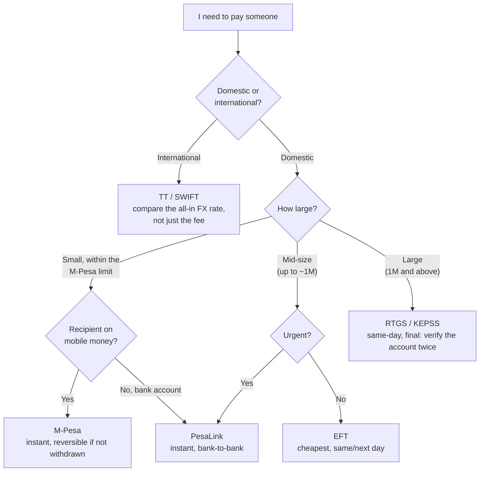

Kenya is one of the most advanced payments markets in the world, which means an ordinary person here has more ways to send money than someone in most rich countries. That is a genuine advantage, and it is also a quiet tax on people who never learn the differences, because every one of those methods, or **rails**, has a different cost, speed, limit, and, most importantly, a different answer to the question that matters when something goes wrong: can I get my money back?

Pay a KES 1.2 million property deposit by M-Pesa and you cannot, because it is over the limit. Pay a KES 5,000 supplier by RTGS and you have spent hundreds of shillings and half a day to do what PesaLink does in seconds for a fraction of the cost. Send KES 800,000 to the wrong account by RTGS and it is gone, because that rail is built to be final. The rails are not interchangeable, and the cost of treating them as if they are shows up as wasted fees, missed cut-offs, and, occasionally, money you will never recover.

This guide sets the five main rails side by side, M-Pesa, PesaLink, EFT, RTGS, and the international telegraphic transfer (TT), on the five things that actually decide which to use: speed, cost, limit, cut-off timing, and reversibility. Then it gives you a decision tree simple enough to run in your head before you press send. For the wider view of how banks earn from moving your money, see [how banks actually make money](/blog/how-banks-actually-make-money-kenya); this is the practical companion, which rail, when, and why.

> **Key Insight:** Choose the rail by the payment, not by habit. Three questions settle almost every case: how much, how urgent, and how sure am I of the recipient? Small and instant is M-Pesa. Mid-size and urgent, bank to bank, is PesaLink. Cheap and not urgent is EFT. Big and same-day is RTGS, and RTGS is effectively irreversible, so the "how sure am I" question matters most exactly where the money is largest.

```cards
- icon: Smartphone
  title: Small and instant
  desc: "Everyday payments up to the wallet limit go on M-Pesa: instant, 24/7, and the one rail with a real reversal path if you send to the wrong number."
- icon: Zap
  title: Mid-size and urgent
  desc: PesaLink moves money bank-to-bank in seconds, at higher limits than M-Pesa and lower cost than RTGS. The right rail for most urgent business payments.
- icon: ShieldAlert
  title: Big-ticket is final
  desc: RTGS settles large payments same-day and is effectively irreversible once sent. Confirm the account twice; there is no reversal to rely on.
  linkText: Where fees hide
  linkUrl: /blog/sme-transaction-fees-fx-spreads-kenya
  type: amber
```

---

### Part 1: The Five Rails, in Plain Terms

Before the comparison, a one-line picture of what each rail actually is, because the names hide the mechanics.

**M-Pesa (and mobile money generally).** The mobile wallet almost everyone has. It moves value between phone numbers instantly, any hour, and includes Send Money, Pay Bill (a biller number plus an account reference), and Buy Goods / Lipa na M-Pesa Till (a till number). It now interoperates with other mobile-money networks and with banks, so a wallet is no longer a walled garden. Its defining traits are instant settlement, universal reach, and modest limits.

**PesaLink.** A bank-to-bank instant transfer service run by Integrated Payment Services Limited (IPSL), which is owned by the Kenya Bankers Association. It moves money directly from your bank account to another person's bank account across member banks, in seconds, at any time, without going through a card network or a mobile wallet. Think of it as M-Pesa's speed with a bank account's higher limits.

**EFT (Electronic Funds Transfer).** The workhorse of routine bank payments, processed in batches through the Automated Clearing House. It is cheap and reliable, but it clears on a cycle rather than instantly, so the money typically arrives the same or the next business day, not immediately. This is the rail built for payroll and bulk supplier runs, where cost matters more than speed.

**RTGS (Real Time Gross Settlement), locally KEPSS.** The Kenya Electronic Payment and Settlement System, operated by the Central Bank of Kenya, is the rail for large-value payments. It settles each payment individually and in real time during CBK operating hours, which makes it same-day and final. It is what a lawyer uses to move a property purchase price and what a business uses for a big-ticket supplier payment. It costs more and, crucially, it is effectively irrevocable once settled.

**TT (telegraphic transfer / SWIFT).** The international rail. A cross-border wire sent through the SWIFT network and correspondent banks to pay someone in another country and currency. Its real cost is rarely the visible fee; it is the **foreign-exchange spread** buried in the rate, plus any intermediary-bank charges along the way, which is exactly the leak dissected in [the guide to SME fees and FX spreads](/blog/sme-transaction-fees-fx-spreads-kenya).


---

### Part 2: The Comparison That Decides It

Set the five rails against the things that actually change your decision. Treat the figures as *indicative and as at 2026*: limits and tariffs are set by Safaricom, the banks, IPSL, and CBK, and they change, so confirm the current numbers before a large or unusual payment.

| Rail | Best for | Speed | Cost shape | Typical limit | Reversibility |
|---|---|---|---|---|---|
| **M-Pesa** | Small, everyday, instant | Instant, 24/7 | Tiered; small sends cheap, larger sends and withdrawals cost more | Up to ~KES 250,000 per transaction, ~KES 500,000 a day | Best of the rails: reversal possible if the recipient has not withdrawn |
| **PesaLink** | Mid-size, urgent, bank-to-bank | Instant, 24/7 | Tiered; moderate, usually below RTGS | Up to ~KES 999,999 per transaction (bank-set daily caps) | Hard once credited; recovery via the banks |
| **EFT** | Bulk, routine, non-urgent | Same or next business day | Cheapest bank rail; low flat fee | Under KES 1,000,000 (larger goes RTGS) | Hard; limited recall within the clearing cycle |
| **RTGS (KEPSS)** | Big-ticket, same-day | Same-day, within CBK hours | Higher fixed fee (hundreds of shillings) | KES 1,000,000 and above (no practical upper limit) | Effectively irrevocable once settled |
| **TT / SWIFT** | International | 1 to 3+ business days | Fee plus FX spread plus correspondent charges | Bank and regulatory limits | Very hard; recall request only, not guaranteed |

Read the table and the pattern is clear: **as the amount rises, you move down the rows, and as you move down, reversibility falls away.** The small, instant rail at the top is also the most forgiving if you make a mistake; the large, same-day rail near the bottom is the least forgiving. That is not a coincidence, it is the design. High-value settlement systems are built to be final precisely so that the whole banking system can rely on a completed payment staying completed.

Two practical cost points the table cannot fully show:

- **M-Pesa's cost is not linear.** Small sends are cheap or free, but larger transfers and, especially, cash withdrawals carry a tariff that can make M-Pesa an expensive way to move a big sum, even before you hit the limit. For anything substantial between bank-account holders, PesaLink is usually both cheaper and cleaner.
- **The TT fee is the small part.** On an international payment, the quoted transfer fee is rarely the real cost. The margin inside the exchange rate, and any correspondent-bank deductions, usually dwarf it. Always ask for the all-in rate and compare it to the interbank rate.

---

### Part 3: The Decision Tree

Almost every payment resolves through three questions, in order: is it domestic or international, how urgent is it, and how large is it.



The tree encodes the whole guide. International splits off first, because it is a different world of FX cost. Domestic then sorts by size, with urgency deciding between the instant rail (PesaLink) and the cheap one (EFT) in the middle band, and size forcing RTGS at the top. The only branch that needs a second thought is the recipient's setup: a small payment to someone who banks with mobile money goes on M-Pesa, while the same amount to a bank account is cleaner and often cheaper on PesaLink.

---

### Part 4: Reversibility, the Question Nobody Asks Until It Is Too Late

Speed and cost are what people compare. Reversibility is what they wish they had compared, after they send money to the wrong recipient. The rails differ sharply here, and the difference runs opposite to the amount, which is the cruel part.

**M-Pesa is the most forgiving.** Send to a wrong number and, provided the recipient has not yet withdrawn or moved the money, there is a genuine reversal path: you can request a reversal through Safaricom, and the confirmation prompt that shows the recipient's name before you send (Hakikisha) exists precisely to prevent the error in the first place. Read the name on that prompt every time; it is the cheapest fraud control you will ever use.

**PesaLink and EFT are harder.** Once money has credited another bank account, getting it back depends on the receiving bank freezing and returning it, which needs the recipient's cooperation or a legal process. It is possible, but it is a request, not a right, and it is slow.

**RTGS is effectively final.** This is the single most important safety fact in this guide. An RTGS payment, once settled, is designed to be irrevocable. There is no reversal button. If you send a large sum to the wrong account, your recourse is to beg the recipient and, failing that, to litigate. **So the rail you use for your largest payments is the rail with the least protection against error.** The discipline that follows is absolute: before you release an RTGS payment, verify the account name and number twice, ideally against a source you trust independently of the email that gave them to you, because business-email-compromise fraud specifically targets large RTGS payments by swapping account details at the last moment.

**TT is the hardest of all**, because the money crosses borders and correspondent banks. A recall is a hopeful request through a chain of institutions, not a process you control.

The lesson is a rule of thumb worth internalising: **the bigger the payment, the more you verify before sending, because the bigger the payment, the less the rail will help you afterwards.**

---

### Part 5: Cut-Off Times and Timing

A rail that is "same-day" is only same-day if you use it before the day's cut-off, and this trips up businesses constantly.

- **M-Pesa and PesaLink run 24/7.** Time of day does not matter; they settle instantly whenever you send. This is a real advantage for urgent evening or weekend payments.
- **EFT and RTGS run on the banking day and have cut-off times.** Send an RTGS instruction after the afternoon cut-off, or on a weekend or public holiday, and it will not settle until the next business day, no matter how urgent. EFT, being batch-based, has its own clearing windows.

For a business, this turns into a simple operational habit: **know your bank's daily cut-off for RTGS and EFT, and treat a large payment due today as due before that cut-off, not before midnight.** A property completion or a supplier deadline that depends on RTGS same-day value is a deadline against the cut-off clock, and missing it by an hour costs you a day. This timing discipline belongs in the same place as your [13-week cash forecast](/blog/13-week-cash-forecast-kenya-sme): knowing not just that a payment is due, but on which rail and before which cut-off.

---

### Part 6: The SME Angle, Paying Suppliers and Salaries

For a business, rail choice is a monthly cost line, not a one-off decision, and matching the rail to the payment type saves real money at volume.

- **Payroll and routine bulk payments go on EFT.** Salaries, regular suppliers, and any batch of non-urgent payments belong on the cheapest rail, and EFT is built for exactly this: one batch file, low per-item cost, next-day value. Paying twenty salaries by individual M-Pesa or PesaLink transfers wastes money that EFT would save.
- **Urgent mid-size payments go on PesaLink.** A supplier who must be paid now to release goods, but for an amount within the limit, is a PesaLink payment: instant, bank-to-bank, cheaper than RTGS.
- **Big-ticket and deadline-critical payments go on RTGS.** The deposit on premises, a large equipment purchase, a tax payment at the wire, anything large and same-day, is RTGS, with the double-verification discipline from Part 4 applied without exception.
- **Retail collections come in on M-Pesa Pay Bill or Buy Goods.** For taking money from customers, the mobile rails dominate, and the choice between Pay Bill and a Buy Goods till affects your cost and your reconciliation. The customer-facing side of this sits in [selling on WhatsApp](/blog/whatsapp-sales-channel-kenya) and the broader [embedded-finance guide](/blog/embedded-finance-kenya-guide).

The through-line is the same as the personal one: the rail is a tool, and using the expensive same-day rail for a routine payment, or the slow cheap rail for an urgent one, is a small leak that runs every month. Auditing which rail carries which payment is part of the fee audit in [the hidden-leak guide](/blog/sme-transaction-fees-fx-spreads-kenya).


### Risk Factors

| Risk | How it arises | Consequence |
|---|---|---|
| Wrong rail for the amount | Habit rather than a decision | RTGS fees on a small payment, or hitting the M-Pesa limit on a large one |
| Irreversible error | A wrong account on an RTGS or TT | Large sum effectively unrecoverable; only litigation or goodwill remains |
| Business-email-compromise fraud | Swapped account details on a big payment | Money sent to a fraudster on the least reversible rail |
| Missed cut-off | Large payment sent after the RTGS/EFT cut-off | Same-day value lost; settlement slips to the next business day |
| Hidden FX cost on TT | Judging an international payment by its fee | The spread inside the rate quietly costs far more than the fee |
| Withdrawal-heavy M-Pesa use | Moving large sums through the wallet | Tiered tariffs and withdrawal charges make it dearer than a bank rail |
| Reconciliation mess | Mixing Pay Bill, Till, and transfers without references | Payments that cannot be matched to invoices; slow month-end |

### Decision Framework: Before You Press Send

**Domestic or international?** International means TT, and TT means the FX rate is the real cost. Get the all-in rate and compare it to interbank before you commit.

**How large is it?** Under the M-Pesa limit, mid-size, or a million-plus? Size alone eliminates most rails and usually points to one or two.

**How urgent is it?** If it is not urgent, EFT is almost always the cheapest domestic option. Urgency is what justifies paying more for PesaLink or RTGS.

**How sure am I of the recipient?** The larger and less reversible the rail, the more this matters. For RTGS and TT, verify the account name and number twice, independently of the message that supplied them.

**Am I inside the cut-off?** For same-day RTGS or EFT value, confirm you are before your bank's cut-off time, not merely before midnight.

### Bengula View

Three observations from the desk.

First, **Kenya's payments abundance is a genuine asset that most people under-use.** Having M-Pesa, PesaLink, EFT, and RTGS all available means there is an efficient rail for almost every payment, yet the common behaviour is to default to one rail for everything, usually M-Pesa, and pay for the mismatch in fees and limits. Learning the five-rail map is one of the highest-return hours of financial literacy a Kenyan can spend, because it applies to a payment you make most days. The map, not any single rail, is the skill.

Second, **the reversibility gradient is the thing the market has not taught well.** People intuitively understand speed and cost, but very few realise that their protection against a mistake falls exactly as the stakes rise, and that RTGS, the rail for their largest payments, has essentially none. Every serious payment fraud I have seen in business banking exploited this: a large payment, a plausible last-minute change of account details, and an irreversible rail. The defence is unglamorous and total, verify large account details independently and twice, and it would prevent the great majority of these losses. If you take one habit from this guide, take that one.

Third, **for businesses, rail discipline is a quiet margin.** It is not dramatic, but matching every payment to its cheapest appropriate rail, EFT for the routine, PesaLink for the urgent, RTGS only for the genuinely large, saves a real sum over a year and cleans up reconciliation as a bonus. It sits alongside tariff negotiation and FX-spread awareness as part of not bleeding money on the mechanics of moving it. The rails are plumbing, and plumbing you understand costs less than plumbing you do not.

### Conclusion

Every payment in Kenya travels on one of five rails, and they are built for different jobs. M-Pesa is small, instant, universal, and the most forgiving of mistakes. PesaLink is the instant bank-to-bank rail for urgent mid-size payments. EFT is the cheap workhorse for routine bulk payments that can wait a day. RTGS is the same-day rail for large sums, and it is effectively final. TT carries money across borders, where the exchange rate, not the fee, is the true cost.

Match the rail to the payment using three questions, how much, how urgent, how sure of the recipient, and the right choice is usually obvious. Watch the two things people miss: the cut-off clock that decides whether "same-day" happens today, and the reversibility gradient that leaves your largest payments the least protected. Verify big account details twice, use the cheap rail when speed is not needed, and treat the abundance of rails as the advantage it is, once you know which one to reach for.

### Related Reading

- [The Hidden Leak: SME Fees and FX Spreads](/blog/sme-transaction-fees-fx-spreads-kenya) for the cost buried inside a TT and how to audit transaction fees.
- [How Banks Actually Make Money in Kenya](/blog/how-banks-actually-make-money-kenya) for why the rails are priced the way they are.
- [The Ultimate Guide to Banking in Kenya](/blog/ultimate-guide-to-banking-in-kenya) for where these rails sit in the wider banking system.
- [What Is a Cashless Economy?](/blog/what-is-a-cashless-economy) for the bigger picture of Kenya's move off cash.
- [The 13-Week Cash Forecast](/blog/13-week-cash-forecast-kenya-sme) for planning payments against cut-off times and cash timing.
- [Selling on WhatsApp](/blog/whatsapp-sales-channel-kenya) and the [embedded-finance guide](/blog/embedded-finance-kenya-guide) for the collections side, taking money in rather than sending it out.
- [The New Business Banking Journey](/blog/new-business-banking-journey-kenya) for setting up the accounts these rails run on.

### References

- [Central Bank of Kenya](https://www.centralbank.go.ke/). Operator of KEPSS (RTGS), the national payment system oversight, and the National Payments Strategy driving interoperability. Large-value settlement, cut-off times, and system rules.
- [Safaricom M-Pesa](https://www.safaricom.co.ke/personal/m-pesa). Mobile-money tariffs, transaction and balance limits, Pay Bill and Buy Goods, and the reversal process. Limits and tariffs as at 2026; confirm current figures before a large payment.
- [PesaLink / Integrated Payment Services Limited](https://ipsl.co.ke/). The bank-to-bank instant payment service owned by the Kenya Bankers Association; limits and member banks.
- [Kenya Bankers Association](https://www.kba.co.ke/). The Automated Clearing House behind EFT, and industry practice on bank payment rails and cut-off times.

*All limits, fees, speeds, and thresholds are indicative and stated as at 2026. They are set by Safaricom, the banks, IPSL, and the Central Bank of Kenya and change over time; confirm the current figures directly with your provider before making a large or time-critical payment.*

*General financial education, not individualized banking, payments, or legal advice. Payment rules, limits, and fraud-recovery processes vary by institution and change; confirm current terms with your bank or provider, and treat large or irreversible payments with independent verification of the recipient.*
