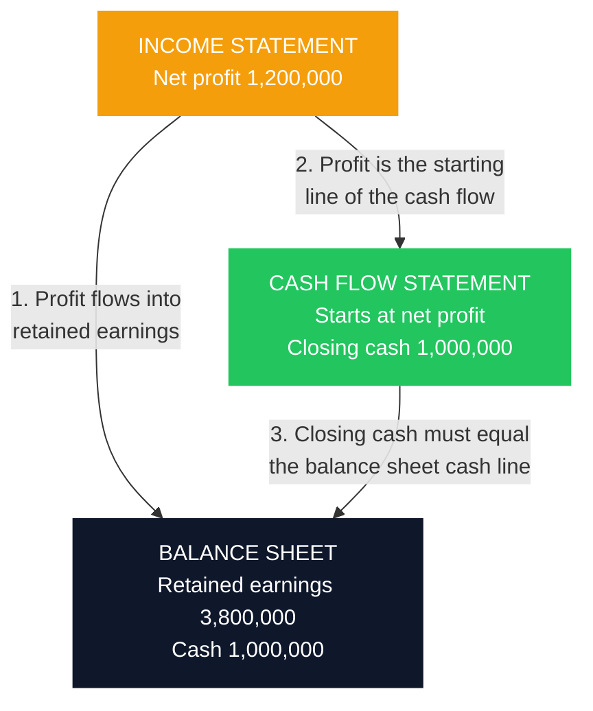

Ask a Kenyan business owner how the business is doing and most will answer from one of two places: the M-PESA balance, or the profit figure their accountant produced at year end. Both answers are incomplete, and in a bad year both can be actively misleading.

A profitable business can run out of cash and close. A business sitting on cash can be quietly insolvent. A business with a strong balance sheet can be bleeding on every sale it makes. You cannot see any of these from a single number, which is why accounts come in three statements rather than one. Each answers a different question, and each is a poor witness on its own.

This guide reads all three, line by line, using one set of accounts so the numbers tie together. It then does the part most explanations skip: showing the three specific places where the statements **must** connect to each other, which is both how you check that accounts are internally honest and how a lender reads them in about ninety seconds.

Once you can read the statements, the diagnosis comes from dividing them into each other. That is a separate skill and it has its own guide: [Financial Ratios Every SME Owner Should Know](/blog/sme-financial-ratios-kenya) works the seven ratios on this same company, so the two articles interlock. Read this one first.

### Key Insight

The income statement is an opinion, the balance sheet is a position, and only the cash flow statement is close to a fact. Profit is the product of judgement calls about when a sale counts and how fast an asset wears out. Cash either arrived or it did not. When the three disagree, the cash flow statement is usually telling the truth first, which is why lenders read it before the profit line.

```cards
- icon: Receipt
  title: Income statement
  desc: Did the business make money over a period? Revenue down to net profit, including costs no one wrote a cheque for.
  type: amber
- icon: Scale
  title: Balance sheet
  desc: What does the business own and owe on one specific day? A photograph, not a film.
- icon: Waves
  title: Cash flow statement
  desc: Where did the money actually go? The statement that explains why a profitable year still felt tight.
  type: emerald
```

---

### Part 1: What Each Statement Answers

| Statement | Question it answers | Covers | Also called |
|---|---|---|---|
| **Income statement** | Did we make a profit over this period? | A period (year, quarter, month) | Profit and loss, P&L, statement of comprehensive income |
| **Balance sheet** | What do we own and owe right now? | A single date | Statement of financial position |
| **Cash flow statement** | Where did the cash actually come from and go? | A period | Statement of cash flows |

The distinction that matters most is **period versus date**. The income statement and cash flow statement are films: they cover twelve months of activity. The balance sheet is a photograph taken at midnight on the last day of that year. A business can look healthy in the photograph and have had a terrible year in the film, or the reverse.

Throughout this guide we use **Mama Chai Foods Ltd**, a small Kenyan food processor with KES 12 million in annual revenue. Every figure below belongs to the same company and the same year.

---

### Part 2: The Income Statement

This statement starts with what you sold and subtracts your way down to what you kept.

| Line | KES | What it means |
|---|---|---|
| Revenue | 12,000,000 | Everything invoiced this year, whether or not the customer has paid |
| Less: Cost of goods sold | (7,800,000) | Direct costs of what you sold: ingredients, packaging, production labour |
| **Gross profit** | **4,200,000** | What survives production, before running the business |
| Less: Salaries and wages | (1,180,000) | |
| Less: Rent and utilities | (420,000) | |
| Less: Transport and distribution | (260,000) | |
| Less: Depreciation | (250,000) | Wear on equipment; no cash left the account |
| Less: Marketing and administration | (190,000) | |
| **Operating profit (EBIT)** | **1,900,000** | What the business itself earns, before financing and tax |
| Less: Interest on borrowings | (185,000) | The cost of how the business is funded |
| **Profit before tax** | **1,715,000** | |
| Less: Corporation tax | (515,000) | |
| **Net profit** | **1,200,000** | What the owners actually earned |

Four things worth understanding before you trust this statement.

**Revenue is not cash received.** Under accrual accounting, a sale counts when you deliver, not when you are paid. Mama Chai's KES 12,000,000 of revenue includes invoices still sitting unpaid with customers. This is the single biggest reason owners feel poorer than their P&L says they are, and it is dealt with in full in [what accounts receivable really costs you](/blog/what-is-accounts-receivable).

**Depreciation is a real cost with no cash attached.** The KES 250,000 depreciation line reduces profit but no money moved. It spreads the cost of equipment across the years that equipment is used. Remember this line: it comes back in the cash flow statement.

**The three profit lines answer three different questions.** Gross profit asks whether the product works. Operating profit asks whether the business works. Net profit asks whether the business works *given how it is financed and taxed*. A company can have healthy gross profit and negative net profit purely because of its debt load, which is a fixable problem of structure rather than a broken product.

**Interest sits below operating profit for a reason.** It is a financing cost, not a trading cost. Separating it lets you see whether a weak bottom line is an operations problem or a balance sheet problem. If operating profit is strong and net profit is thin, look at [what your loans are actually costing you](/blog/how-kenyan-banks-price-loans) rather than at your pricing.

---

### Part 3: The Balance Sheet

The balance sheet rests on one equation that must always hold:

$$
\text{Assets} = \text{Liabilities} + \text{Equity}
$$

Everything the business controls was funded either by someone it owes (liabilities) or by its owners (equity). There is no third source. If a balance sheet does not balance, it is not a balance sheet.

| | KES |
|---|---|
| **Assets** | |
| Cash and bank | 1,000,000 |
| Accounts receivable | 1,000,000 |
| Inventory | 1,000,000 |
| **Current assets** | **3,000,000** |
| Property, plant and equipment (net) | 5,000,000 |
| **Total assets** | **8,000,000** |
| **Liabilities** | |
| Trade payables | 900,000 |
| Accruals, tax and current portion of debt | 1,100,000 |
| **Current liabilities** | **2,000,000** |
| Long-term debt | 1,200,000 |
| **Total liabilities** | **3,200,000** |
| **Equity** | |
| Share capital | 1,000,000 |
| Retained earnings | 3,800,000 |
| **Total equity** | **4,800,000** |
| **Total liabilities and equity** | **8,000,000** |

Check the equation: 8,000,000 = 3,200,000 + 4,800,000. It balances.

**Current versus non-current is the distinction that predicts survival.** Current means within twelve months. Mama Chai holds KES 3,000,000 of current assets against KES 2,000,000 of current liabilities, so it can meet the coming year's obligations from the coming year's resources. Reverse those two numbers and the business is technically in trouble no matter what the profit line says.

**Not all current assets are equally current.** Cash is cash. Receivables are cash if customers pay. Inventory is cash only if it sells, and slow-moving stock is the most common place where a balance sheet flatters a business. One third of Mama Chai's current assets is inventory, which is fine for a food processor and would be alarming for a services firm.

**Retained earnings is the cumulative history of the business.** It is every shilling of profit ever earned, less every shilling ever taken out. It is not a pot of money sitting anywhere; it has already been spent on equipment, stock, and receivables. Owners who see KES 3,800,000 in retained earnings and expect to withdraw it are reading a record of the past, not a bank balance.

---

### Part 4: The Cash Flow Statement

This is the statement most owners have never read and the one a lender turns to first. It takes the profit figure and works out what actually happened to the money.

| | KES |
|---|---|
| **Operating activities** | |
| Net profit | 1,200,000 |
| Add back: depreciation | 250,000 |
| Increase in receivables | (300,000) |
| Increase in inventory | (200,000) |
| Increase in payables | 150,000 |
| **Net cash from operations** | **1,100,000** |
| **Investing activities** | |
| Purchase of equipment | (700,000) |
| **Net cash used in investing** | **(700,000)** |
| **Financing activities** | |
| New borrowing | 300,000 |
| Loan repayments | (250,000) |
| Dividends and drawings paid | (200,000) |
| **Net cash from financing** | **(150,000)** |
| **Net increase in cash** | **250,000** |
| Cash at start of year | 750,000 |
| **Cash at end of year** | **1,000,000** |

The three sections answer three separate questions, and the pattern between them is more diagnostic than any single figure.

**Operating** is cash generated by trading. This is the engine. A business whose operating cash flow is persistently negative while it reports profits is converting sales into receivables and stock rather than money, and it will eventually need financing to survive its own growth.

**Investing** is cash spent on or received from long-term assets. Negative is normal and usually healthy: it means the business is buying equipment. Persistently positive investing cash flow can mean a business is selling assets to stay afloat.

**Financing** is cash from lenders and owners. New borrowing is a cash inflow; repayments and dividends are outflows.

**Why the adjustments?** Depreciation is added back because it reduced profit without touching cash. The working capital movements convert accrual figures into cash reality: receivables rose by KES 300,000, meaning KES 300,000 of this year's revenue is sitting with customers rather than in the bank, so it is subtracted. Payables rose by KES 150,000, meaning suppliers are funding the business that much more, so it is added.

Mama Chai earned KES 1,200,000 of profit and generated KES 1,100,000 of operating cash. That is a healthy conversion. When the gap between those two numbers is large and persistent, profit is arriving as promises rather than money, and the cause is almost always [how long cash stays trapped in the working capital cycle](/blog/working-capital-cycle-kenya-smes).

---

### Part 5: How the Three Statements Connect

This is the section that turns three tables into one picture. The statements are not independent documents; they are three views of the same events, and they must tie at three specific points.



**Tie one: profit feeds equity.** Net profit less anything paid out to owners is added to retained earnings. Mama Chai opened the year with KES 2,800,000 retained, earned KES 1,200,000, and paid out KES 200,000:

$$
2{,}800{,}000 + 1{,}200{,}000 - 200{,}000 = 3{,}800{,}000
$$

That is the retained earnings figure on the balance sheet. This is why a profitable year makes a business stronger even if the bank balance barely moves.

**Tie two: profit starts the cash flow statement.** The indirect method begins at net profit and adjusts it to cash. The KES 1,200,000 at the bottom of the income statement is the KES 1,200,000 at the top of the cash flow statement.

**Tie three: closing cash equals the balance sheet.** The cash flow statement ends at KES 1,000,000 and the balance sheet shows cash of KES 1,000,000. These must match exactly, always.

If you check nothing else in a set of accounts, check tie three. When closing cash on the cash flow statement does not equal the cash line on the balance sheet, the accounts are wrong or something has been adjusted without being explained. It takes ten seconds and it is the single most effective sanity check available to a non-accountant.

---

### Part 6: How a Lender Reads the Same Pages

An RM assessing a facility is not reading for elegance. The reading order is roughly this, and knowing it tells you what to prepare.

**Operating cash flow first, not profit.** The question is whether the business generates cash from trading, because that is what repays a loan. Profit that never becomes cash cannot service debt.

**Then the trend, not the year.** One year is an anecdote. Three years shows direction. A business with falling margins and rising receivables is a different risk from the same business improving on both, even if this year's figures are identical.

**Then debt service capacity.** Operating profit against total debt service, the DSCR logic set out in [the anatomy of a bank proposal](/blog/anatomy-of-a-bank-proposal-kenya). Interest cover and existing commitments matter more than the size of the asset base.

**Then the working capital cycle.** How long money is trapped between paying suppliers and being paid by customers, which is where most SME facilities are actually needed and is covered in [the working capital cycle](/blog/working-capital-cycle-kenya-smes).

**Then quality of the numbers.** Are these audited, reviewed, or management accounts? Do they reconcile to bank statements and to filed returns? An [eTIMS](/blog/etims-kenya-sme-guide) and tax trail that agrees with the accounts is worth more to a credit committee than a flattering profit figure that agrees with nothing.

The practical implication for an owner is that presenting accounts is not about maximising the profit line. It is about producing three statements that tie to each other, to your bank statements, and to your filings. Consistency reads as competence.

---

### Part 7: Reading a Real Annual Report

An NSE-listed annual report runs to a couple of hundred pages, and the three statements occupy perhaps six of them. Knowing the structure lets you find what matters.

| Section | What it is | Worth your time? |
|---|---|---|
| Chairman and CEO statements | Narrative on the year | Skim; it is management's framing |
| Corporate governance report | Board, committees, attendance | Useful for governance quality |
| **Independent auditor's report** | The auditor's formal opinion | **Read first** |
| **The three statements** | The numbers themselves | **Read** |
| **Notes to the accounts** | Where the detail lives | **Read the ones that matter** |
| Sustainability and ESG | Non-financial reporting | Optional |

**Start with the auditor's report, not the statements.** You are looking for the word **unqualified**, meaning the auditor found the accounts fairly presented. A *qualified* opinion, an *emphasis of matter*, or any language about **material uncertainty related to going concern** changes how you read everything that follows. This paragraph takes one minute and is the highest-value minute in the document.

**Then the notes.** The statements are summaries; the notes are the substance, and they are where the uncomfortable detail is disclosed. Four are usually worth finding:

- **Accounting policies**, particularly revenue recognition and depreciation rates. These are the judgement calls that shape the profit figure.
- **Borrowings**, showing maturity profile and covenants, not just the total.
- **Contingent liabilities**, covering guarantees, pending litigation, and tax disputes. This is where obligations that are not yet on the balance sheet appear.
- **Related party transactions**, showing business done with directors and connected companies.

**Where to find them.** The [Nairobi Securities Exchange](https://www.nse.co.ke/) lists issuers and their disclosures, and each listed company publishes an investor relations section: [EABL's investor pages](https://www.eabl.com/investors) are a straightforward example to practise on. Safaricom and KCB Group publish equivalent annual reports through their own investor relations sections. These are public documents, free, audited, and prepared to a far higher standard than most accounts you will otherwise see, which makes them the best available training material for reading statements.

A useful exercise: open one listed company's annual report, find the three statements, and verify tie three. Closing cash on the cash flow statement will equal the cash line on the balance sheet. Once you have seen it hold in a set of audited accounts, you will notice immediately when it does not hold in your own.

---

### Part 8: Red Flags a Non-Accountant Can Spot

You do not need a CPA to notice most of these.

**Profit rising while operating cash flow falls.** The most important single divergence in accounts. Sales are being recognised without being collected.

**Receivables growing faster than revenue.** If sales rose 10% and receivables rose 40%, either collections have deteriorated or revenue quality has.

**Inventory growing faster than sales.** Stock that is not moving is cash that has been converted into shelf space.

**A cash balance sustained only by new borrowing.** Check the financing section. A healthy cash position built entirely on fresh debt is a different picture from one built on trading.

**Margins moving without explanation.** A gross margin that shifts several points year on year is either a pricing change, an input cost change, or a change in how costs are classified. All three deserve a question.

**Accounts that do not tie.** Failing tie three, or a balance sheet that does not balance, means stop reading and start asking.

### Risk Factors

| Risk | How it shows up | Consequence |
|---|---|---|
| Reading profit without cash flow | Strong P&L, thin bank balance | Growth funded by borrowing you did not plan for |
| Treating retained earnings as available money | Owner expects to withdraw a paper figure | Withdrawal starves working capital |
| Ignoring the current versus non-current split | Current liabilities exceed current assets | Technically unable to meet the year's obligations |
| Inventory or receivables overstated | Current ratio looks fine, cash does not arrive | Liquidity crisis behind a healthy-looking balance sheet |
| Management accounts that reconcile to nothing | Figures differ from bank and tax records | Credit application stalls or is declined |
| Skipping the auditor's opinion | Going concern or qualification missed | Reading numbers the auditor has already flagged |
| One year read in isolation | No trend visible | Deterioration mistaken for a normal year |

### Decision Framework: A Ten-Minute Read of Any Set of Accounts

**Does it balance, and does tie three hold?** Assets equal liabilities plus equity, and closing cash equals the balance sheet cash line. If either fails, stop.

**What is operating cash flow, and how does it compare with net profit?** A large or widening gap is the first thing to explain.

**Are current assets bigger than current liabilities?** If not, the business needs a plan for the next twelve months before anything else is discussed.

**What is the trend over three years on revenue, gross margin, and receivables?** Direction beats level.

**How much of the profit is financing-dependent?** Compare operating profit with net profit and look at the interest line.

**For audited accounts, what did the auditor say?** Find the opinion paragraph before forming a view.

**What do the notes disclose that the statements do not?** Contingent liabilities and related party transactions, at minimum.

### Bengula View

The desk would emphasise three habits.

First, **read the three statements together or do not bother**. Every serious misreading of a business comes from taking one statement as the whole truth: profit without cash, cash without obligations, or a balance sheet without the year that produced it. The statements were designed as a set, and the disagreements between them are the information.

Second, **owners should produce monthly management accounts, not annual ones**. A set of accounts delivered nine months after year end is a historical record. The same three statements produced monthly become a management instrument: you see receivables lengthening in month two rather than at the audit. The format does not need to be elaborate; it needs to be consistent and to tie.

Third, **the accounts you can explain beat the accounts that look best**. In a credit conversation, an owner who can walk a lender from revenue to operating cash flow, and explain why receivables moved, is demonstrating control of the business. That is a more persuasive signal than a flattering bottom line the owner cannot account for, and it is the difference the [relationship manager](/blog/why-rm-is-sme-growth-asset) will notice.

### Conclusion

Financial statements are not an accounting formality produced for KRA and the bank. They are the only complete description of what a business did and what it now is, and each of the three answers a question the other two cannot.

The income statement tells you whether the trading model works. The balance sheet tells you whether the business can survive the next twelve months. The cash flow statement tells you whether any of it is turning into money. Read together, they explain almost every question an owner has, including the ones that feel like mysteries: why a good year left no cash, why a growing business keeps needing an overdraft, why the profit figure and the bank balance have never once agreed.

Learn to read the statements, then learn to divide them into each other. The [seven ratios](/blog/sme-financial-ratios-kenya) work on this same company and turn these three tables into a diagnosis.

### Related Reading

- [Financial Ratios Every SME Owner Should Know](/blog/sme-financial-ratios-kenya) applies seven ratios to this same set of Mama Chai accounts.
- [What Accounts Receivable Really Costs You](/blog/what-is-accounts-receivable) for the receivables line in detail, and why revenue is not cash.
- [The Working Capital Cycle](/blog/working-capital-cycle-kenya-smes) for how long your money stays trapped.
- [The Anatomy of a Bank Proposal](/blog/anatomy-of-a-bank-proposal-kenya) for how these statements are assessed in a credit application.
- [Business Valuation in Kenya](/blog/business-valuation-kenya-guide) for how these statements become a price.
- [The Complete SME Finance Handbook](/blog/sme-finance-handbook-kenya) for the wider financing picture.

### References

- [Nairobi Securities Exchange](https://www.nse.co.ke/). Listed issuers and their published disclosures, including annual reports and financial statements.
- [East African Breweries PLC investor relations](https://www.eabl.com/investors). A worked example of a Kenyan listed company's published annual reporting.
- [Institute of Certified Public Accountants of Kenya (ICPAK)](https://www.icpak.com/). The professional body overseeing accounting and audit standards in Kenya.
- [Kenya Revenue Authority](https://www.kra.go.ke/). Filing obligations and the tax records against which management accounts should reconcile.

*Illustrative figures throughout. Mama Chai Foods Ltd is a composite example used consistently across this guide and the companion ratios guide; it is not a real company and its numbers are constructed to tie exactly, which real accounts do not always do. Presentation formats vary between IFRS, IFRS for SMEs, and management accounts, so line names in your own statements may differ.*

*General market education, not individualized financial, tax, legal, or accounting advice. Have material accounts prepared or reviewed by a qualified accountant.*
