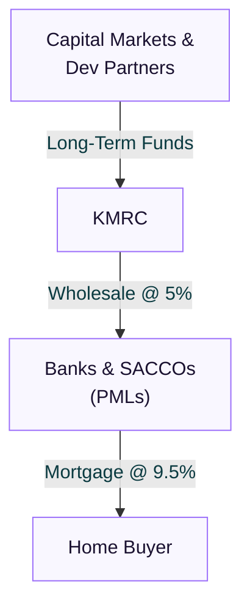

### Bypassing the High Cost of Home Ownership

For decades, the path to home ownership for middle-income Kenyans has been blocked by the high cost of credit. With commercial bank mortgage rates hovering between **15% and 18%**, a standard home loan is financially out of reach for most salaried workers. On a 20-year term, these double-digit rates mean a buyer ends up paying back more than three times the value of the house in interest alone.

To solve this demand-side bottleneck, the government established the **Kenya Mortgage Refinance Company (KMRC)**. KMRC operates as a wholesale liquidity provider, offering low-cost funds to primary lenders so they can issue home loans at a fixed, single-digit interest rate of **9.0% to 9.5%**.

> **Key Insight:** KMRC does not lend directly to the public. Instead, it operates through participating banks and SACCOs, enabling them to extend long-term, fixed-rate mortgages to Kenyans earning KSh 150,000 or less.

---

### How the Wholesale Model Works and the Asset-Liability Mismatch

Historically, Kenyan banks have been hesitant to offer long-term mortgages because of an **asset-liability mismatch**. Banks raise capital primarily through short-term retail deposits (which can be withdrawn at any time), but mortgages require long-term capital (typically 15 to 25 years). If a bank funds a 20-year mortgage using 3-month deposits, they expose themselves to liquidity shocks if depositors suddenly withdraw their cash or interest rates spike. To compensate for this risk, banks charge high interest premiums on mortgages.

KMRC solves this structural problem by acting as a wholesale intermediary. It raises long-term, low-cost capital from international development partners (such as the World Bank and the African Development Bank), local capital markets through corporate bonds, and the government. KMRC then lends this money to primary lenders (commercial banks and SACCOs) at a wholesale rate of **5.0%**. 

Because the primary lenders receive this money on a long-term basis at 5%, they can afford to lend to individual homebuyers at a capped rate of **9.0% to 9.5%**, adding a 4% to 4.5% margin to cover their operating expenses, credit risk, and profit.

---

### Two-Tier KMRC Mortgage Structures

To ensure that the funding reaches those who need it most while still supporting the broader housing market, KMRC classifies its refinanced mortgages into two distinct categories:

#### 1. Affordable Housing Mortgages (AHM)
This tier targets low-to-middle-income earners and features the lowest, most subsidized rates.
* **Borrower Income Limit:** Gross monthly income must not exceed **KSh 150,000** (either individual income or combined household income).
* **Maximum Loan Amount:** Capped at **KSh 10.5 million** in the Nairobi Metropolitan Area (Nairobi, Kiambu, Machakos, and Kajiado counties) and **KSh 8 million** elsewhere in the country.
* **Interest Rate:** Fixed at **9.0%** (when borrowed via SACCOs) or **9.5%** (when borrowed via commercial banks).
* **Target Property:** Must be owner-occupied. Speculative land purchases, rental units, or commercial buildings are strictly excluded from this tier.

#### 2. Market-Rate Mortgages (MRM)
For borrowers who exceed the income or property value thresholds of the affordable tier, KMRC provides refinancing to banks at slightly higher rates. This allows banks to offer mortgages that are still cheaper than standard commercial rates.
* **Borrower Income Limit:** No strict upper limit on income.
* **Maximum Loan Amount:** Varies by bank, but can extend up to **KSh 15 million**.
* **Interest Rate:** Typically ranges between **10.5% and 11.5%** fixed, providing a significant discount compared to the 16%–18% standard market rate.

---

### Qualifying Criteria for Borrowers

To qualify for a KMRC-backed mortgage, you must meet the national underwriting standards established by KMRC and the Central Bank of Kenya:

| Criteria | Affordable Housing Mortgage | Market-Rate Mortgage |
| --- | --- | --- |
| **Borrower Monthly Income** | Gross income of **KSh 150,000 or less** (individual or combined) | No limit |
| **Maximum Loan Amount** | Up to **KSh 10.5 million** (Metropolitan) / **KSh 8 million** (Rest of Kenya) | Up to **KSh 15 million** |
| **Target Property Use** | Must be owner-occupied (no rental or speculative investment) | Owner-occupied or residential investment |
| **Mortgage Interest Rate** | Single-digit fixed rate (typically **9.0% – 9.5%**) | Fixed rate (typically **10.5% – 11.5%**) |
| **Maximum Repayment Period** | Up to **25 years** (subject to retirement age limits) | Up to **20 years** |
| **Equity/Deposit Requirement** | Minimum **10% down payment** (90% LTV ratio) | Minimum **10% to 20% down payment** |

---

### Worked Economics: 16% Bank Rate vs. 9.5% KMRC Rate

To see the massive financial impact of KMRC refinancing, let us compare a home buyer borrowing **KSh 5,000,000** for a residential property under the two different interest rate regimes:

#### Scenario A: Standard Bank Mortgage (16% Interest Rate)
* **Loan Amount:** KSh 5,000,000
* **Interest Rate:** 16% variable
* **Repayment Term:** 20 Years (240 Months)
* **Monthly Payment (Principal + Interest):** **KSh 70,050**
* **Total Repayment over 20 years:** KSh 16,812,000
* **Total Interest Paid:** **KSh 11,812,000**

#### Scenario B: KMRC-Backed Mortgage (9.5% Fixed Rate)
* **Loan Amount:** KSh 5,000,000
* **Interest Rate:** 9.5% fixed
* **Repayment Term:** 20 Years (240 Months)
* **Monthly Payment (Principal + Interest):** **KSh 46,600**
* **Total Repayment over 20 years:** KSh 11,184,000
* **Total Interest Paid:** **KSh 6,184,000**

#### Financial Impact Comparison Table

| Metric | Standard 16% Mortgage | KMRC 9.5% Mortgage | Monthly & Lifetime Savings |
| --- | --- | --- | --- |
| **Monthly Installment** | KSh 70,050 | KSh 46,600 | **KSh 23,450 saved per month** |
| **Total Interest Paid** | KSh 11,812,000 | KSh 6,184,000 | **KSh 5,628,000 saved in interest** |
| **Total Cost of the House** | KSh 16,812,000 | KSh 11,184,000 | **33.5% reduction in total cost** |

> **Net Savings:** By securing a KMRC-backed loan, the monthly obligation falls by **KSh 23,450**, and the buyer saves **KSh 5,628,000** in total interest over the life of the loan. This is the difference between a viable purchase and financial distress.

---

### Step-by-Step Documentation Checklist

When applying for a KMRC mortgage through a partner bank or SACCO, you must compile a rigorous documentation package. Lenders will evaluate your creditworthiness, income stability, and the legal status of the target property.

#### 1. Personal & Income Verification Documents
* **For Salaried Employees:**
  * National ID card or Passport copy.
  * KRA PIN Certificate.
  * Certified pay slips for the last three consecutive months.
  * Bank statements for the last six consecutive months showing salary credit.
  * Employment contract showing permanent employment or long-term contract status.
* **For Self-Employed & Business Owners:**
  * Certificate of Incorporation or Business Registration.
  * Audited financial accounts for the last three financial years.
  * Company tax returns and bank statements for the last twelve consecutive months.
  * KRA PINs of the directors and the business entity.

#### 2. Property Underwriting Documents
* Copy of the **Certificate of Title** (Title Deed) for the target property (must be free from charges or disputes).
* Approved architectural and structural plans (for construction mortgages).
* Sale Agreement signed by both the buyer and seller.
* Official valuation report from an approved valuer registered with the bank/SACCO.
* Spousal consent form (where applicable).

---

### Where to Apply: Participating Institutions

You must submit your mortgage application directly to one of KMRC's partner institutions. The key participating lenders include:

* **Commercial Banks:** KCB Bank, Co-operative Bank, NCBA, Absa Bank Kenya, Stanbic Bank, DTB, Credit Bank, and HFC Limited.
* **Microfinance Banks:** Kenya Women Microfinance Bank (KWFT).
* **SACCOs:** Stima, Tower, Unaitas, Mwalimu National, Harambee, Kenya Police, Imarisha, and Apstar SACCOs.

*Note: SACCOs are often highly competitive because their internal processing times and structural requirements can be more flexible for self-employed or non-traditional earners. Furthermore, SACCOs typically offer KMRC loans at a lower rate of **9.0%** compared to commercial banks' **9.5%**.*

---

### Decision Framework: Your Roadmap to Application

If you plan to apply for a KMRC mortgage, follow this sequence:

1. **Verify your income bracket.** If your gross salary exceeds KSh 150,000, you will be directed to standard bank mortgage products.
2. **Identify an eligible property.** The home must cost less than KSh 10.5 million. Ensure the developer has a clean title deed, as banks will not finance properties with title disputes.
3. **Save for the deposit.** While some banks offer up to 105% financing to cover transaction fees, most require a **10% down payment**.
4. **Compare PML terms.** Rates range between 9% and 9.5%. Check the additional costs (valuation, legal fees, and mortgage protection insurance) across 2-3 participating banks or your SACCO before signing.

---

### Risk Factors & Suitability

* **Salary-Linked Terms:** The repayment amount is capped at **one-third (33%) of your basic salary**. If you have existing loans or salary deductions, your qualifying mortgage amount will decrease.
* **Transaction Closing Costs:** Apart from the 10% deposit, be prepared to pay for stamp duty (4% for urban areas), legal fees, bank facility fees, and building valuation, which can total **6% to 8%** of the property value.

### Related Reading
- [Mortgage Decision Framework for Kenya: Beyond KMRC](/blog/mortgage-decision-framework-kenya). Rent vs buy, AHM vs MRM vs standard lanes, closing-cost cash, and fixed vs variable - use this before you apply.
- [How Kenyan Banks Price Your Loan: The Base Rate Plus 'K' Margin](/blog/how-kenyan-banks-price-loans). Learn how banks price standard credit and why KMRC's 9.5% fixed rate is a significant discount.
- [Safe for Savers, Risky for Guarantors: The Changing Calculus of SACCO Membership in Kenya](/blog/sacco-savers-guarantors). Understand how to leverage SACCO membership to access home financing.
- [Why Asset Finance Is Cheaper Than a Conventional Loan in Kenya](/blog/asset-finance-vs-conventional-loans). Read how secured structures reduce risk premiums across credit products.

---

### Confidence Note & Compliance

> **Confidence Note:** Documented. This article relies on official Kenya Mortgage Refinance Company guidelines, Central Bank of Kenya lending circulars, and current retail product sheets from participating commercial banks.
> 
> **Bengula View:** KMRC is the first genuine attempt to structuralize housing finance in East Africa. If you are currently renting and earn under the KSh 150,000 limit, replacing a rent payment with a 9.5% mortgage is one of the most effective ways to build household net worth.
