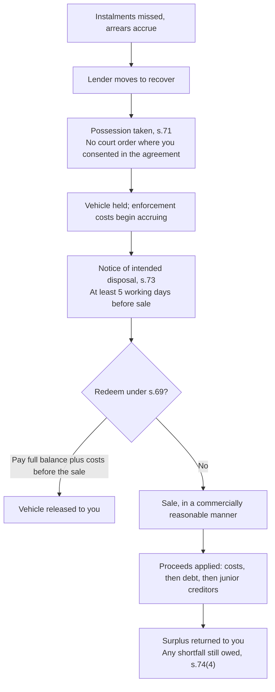

A logbook loan is the fastest large sum most Kenyans can raise without selling anything. The car stays in your hands, you keep driving to work, and the money can land in days rather than the weeks a bank term loan takes. For a genuine short emergency, or a business gap with a defined end, that speed has real value.

The speed is bought with something specific, and borrowers rarely price it properly. You are pledging the asset that gets you to the job that produces the income that repays the loan. If the arrangement fails, the recovery is not a slow negotiation. It is quicker, quieter, and considerably more one-sided than most borrowers expect, because the law governing security over movable property was deliberately written to make lending against movables enforceable.

This guide covers what you are actually signing, how logbook pricing is quoted versus what it costs, the fees that sit outside the interest line, what default looks like as an actual sequence with actual statutory timelines, and the fork where a different product is the right one. For where logbook borrowing sits among all the options, see [the complete guide to borrowing money in Kenya](/blog/borrowing-money-in-kenya-guide).

> **Key Insight:** A logbook loan is not an expensive personal loan. It is a secured loan priced like an unsecured one. The lender takes real security over a real asset, which should lower the price, and then charges a rate that assumes it has taken none. You carry the security, the enforcement speed, and the cost. That asymmetry, not the headline rate, is the thing to interrogate before signing.

```cards
- icon: Percent
  title: "3% a month is not 36% a year"
  desc: A flat monthly quote on a one-year logbook loan works out near 61% a year on a reducing basis. Convert every quote before comparing.
  linkText: How rates really work
  linkUrl: /blog/mobile-loan-vs-bank-loan-apr-breakdown
  type: amber
- icon: Gavel
  title: Recovery is faster than you think
  desc: Where you consented in the security agreement, possession can be taken without a court order, and only five working days notice is required before sale.
- icon: Car
  title: Buying? Use the other product
  desc: Logbook finance is for cash against a car you already own. If you are acquiring the vehicle, asset finance is cheaper and structured for it.
  linkText: Asset finance compared
  linkUrl: /blog/asset-finance-vs-conventional-loans
  type: emerald
```

---

### Part 1: What You Are Actually Signing

A logbook loan is a credit facility secured against a motor vehicle you already own, where you keep possession and use of the vehicle throughout. Nothing is pawned. You drive the car exactly as before.

What changes is legal, and it happens in two places at once.

**A security right is created over the vehicle.** Since 2017 this sits under the **Movable Property Security Rights Act, No. 13 of 2017**, which came into force on 16 May 2017 and repealed the older Chattels Transfer Act (Cap. 28) along with the Pawnbrokers Act (Cap. 529). The Act was designed to make movable assets, vehicles, stock, equipment, receivables, usable as collateral, by creating a single registry and, critically, a fast enforcement route. That second half is the part borrowers skip.

**The lender's interest is recorded against the vehicle at NTSA.** Through the Transport Integrated Management System, the lender is registered either as a joint owner or with an interest noted against the record, commonly called the in-charge process. The practical effect is that the vehicle cannot be sold or transferred without the lender being cleared first. When the loan is fully repaid, the interest is discharged and the record reverts to you alone.

Two things follow that are worth stating plainly.

First, **joint registration is not the same as the lender owning half your car**, and it is also not nothing. It is a recorded interest that blocks disposal and evidences the security. Borrowers who panic at the phrase tend to under-read the more consequential document, which is the security agreement itself.

Second, **the security agreement is where your enforcement exposure is set**. Part 5 explains why one clause in it, the one where you consent in advance to the lender taking possession, changes the entire character of what happens if you fall behind.


---

### Part 2: Who Is Actually Lending to You

This is the first question, ahead of rate, and most borrowers never ask it. Logbook lending in Kenya is offered from two quite different places.

**Regulated institutions.** Banks and microfinance banks lend against logbooks under Central Bank of Kenya supervision. They are bound by the disclosure regime, they report to credit reference bureaus, they price off a published framework, and they have a complaints path that ends somewhere real. Their logbook pricing is usually the most conservative and the least dramatic.

**Credit-only lenders.** A large share of the logbook market sits with non-deposit-taking credit providers: firms that lend their own or borrowed money and take no deposits. Historically this was the thinly supervised end of Kenyan credit, which is precisely why logbook lending concentrated there.

That gap is closing, and the direction matters if you are borrowing now.

- The **Central Bank of Kenya (Digital Credit Providers) Regulations, 2022** brought digital lenders under CBK licensing. By July 2026 CBK had licensed **252 digital credit providers**, which had advanced 8.4 million loans worth about **KES 150.56 billion** by May 2026.
- The **Business Laws (Amendment) Act, 2024** amended the CBK Act (Cap. 491) to extend oversight beyond digital lending to non-deposit-taking credit providers generally.
- Under that power CBK published the **draft Non-Deposit Taking Credit Providers Regulations, 2025** in August 2025, with public comment to 5 September 2025. The draft would replace the 2022 digital-credit regime, and it explicitly reaches **logbook-backed lenders**, alongside buy-now-pay-later, hire purchase, peer-to-peer and pay-as-you-go credit. Providers with capital, borrowings or a loan book above **KES 20 million** would require a licence; smaller ones would register.

The practical instruction for a borrower today is short: **ask for the licence or registration, and check it.** A lender inside the regulated perimeter reports your good repayment to the bureaus, which builds the record that prices your future borrowing, and it answers to a supervisor when collection behaviour goes wrong. A lender outside it offers you neither. That difference is worth more than a point or two on the rate, and it is the same lesson the [mobile and digital loan market](/blog/mobile-digital-loans-real-cost-kenya) taught Kenyan borrowers the expensive way.

---

### Part 3: The Rate You Are Quoted and the Rate You Pay

Logbook loans are almost always quoted as a **flat monthly percentage**: "3% a month," "2.5% a month." This is the single most expensive piece of financial shorthand in the Kenyan consumer market, because of what the borrower does with it next. They multiply by twelve, get 36%, decide it is steep but survivable, and sign.

That multiplication is wrong, and not by a little.

A flat rate charges interest on the **original principal for the whole tenor**, ignoring the fact that you are paying the principal down every month. By the final instalment you may owe a fraction of what you borrowed, while still paying interest calculated on the full original sum.

$$
\text{Instalment}_{\text{flat}} = \frac{P \times \left(1 + r_{\text{flat}} \times n\right)}{n}
$$

The honest cost is the rate that actually discounts those instalments back to the sum you received:

$$
P = \sum_{t=1}^{n} \frac{\text{Instalment}}{(1+i)^{t}} \qquad \text{APR} = 12 \times i
$$

Run it on a typical facility. KES 500,000 over 12 months at 3% per month flat:

| Line | Figure |
|---|---|
| Principal received | KES 500,000 |
| Interest charged (3% × 12 months, flat) | KES 180,000 |
| Total repaid | KES 680,000 |
| Monthly instalment | KES 56,667 |
| What the borrower assumes the rate is | 36% a year |
| **True reducing-balance rate** | **about 5.08% a month** |
| **True annual rate (APR)** | **about 61%** |
| **Effective annual rate, compounded** | **about 81%** |

The quoted number and the real number are not in the same conversation. And the comparison that stings most is against the product built for vehicles. The same KES 500,000 over the same twelve months at 16% on a reducing balance costs about **KES 44,400** in interest, against **KES 180,000** on the flat logbook quote. The borrower pays roughly **KES 135,600 more** for the same money over the same year.

The discipline is the same one that applies to [check-off and salary loans](/blog/check-off-salary-loans-kenya): **never compare a flat quote against a reducing-balance quote, and never accept a flat quote without converting it.** Ask every lender for the total cost of credit in shillings over the full tenor. A lender that will not put that single figure in writing has answered a different and more useful question.

---

### Part 4: The Cost That Is Not Interest

The interest line is not the facility. Logbook lending carries a cluster of charges that are individually reasonable and collectively material, and they are usually deducted from the amount you receive rather than added to what you repay, which disguises them.

| Cost | What it is | Why it matters |
|---|---|---|
| Valuation fee | Independent assessment of the vehicle | Sets your borrowing limit; usually paid by you regardless of whether you proceed |
| Facility or processing fee | Arrangement charge | Often deducted upfront, so you receive less than the principal you repay interest on |
| NTSA and registration charges | Recording the lender's interest, and discharging it later | Two events, sometimes two charges |
| Comprehensive insurance | Nearly always mandatory for the loan term | If your cover was third-party, this is a real new monthly cost, and the lender is usually noted as an interested party |
| Tracking device | Fitting and monthly subscription | Recurring; also the mechanism that makes recovery quick |
| Early settlement charge | Penalty for repaying ahead of schedule | Directly attacks the main defence against a flat-rate loan |

Two of these deserve emphasis.

**Insurance assignment.** The lender will require comprehensive cover with its interest noted, so that if the vehicle is written off the insurer pays the lender first. That is legitimate. What catches borrowers is the cash-flow effect: moving from third-party to comprehensive can add a significant monthly cost that was never in the affordability calculation. Where the cover is bundled and financed by the lender, check the price against the open market, because a captive placement is rarely the cheapest. The household context for this sits in the [insurance stack guide](/blog/insurance-stack-kenya-life-stages).

**Early settlement penalties.** On a flat-rate loan, paying early is the borrower's most powerful move, because the interest was computed on the assumption you would run the full tenor. A penalty exists precisely to blunt that move. Establish before signing what it costs to settle in month four, in writing. If early settlement is heavily penalised, the effective cost of the facility is higher than any table above suggests.

---

### Part 5: What Default Actually Looks Like

This is the section to read twice, because the gap between what borrowers imagine and what the statute permits is wider here than anywhere else in Kenyan consumer credit.

Most people assume that losing a car to a lender requires a court, a judgment, and months of process. Under the Movable Property Security Rights Act, in the ordinary case, it requires none of those things.

**Possession can be taken without going to court.** Section 71(1) allows a secured creditor to obtain possession of the collateral without applying to court where **the grantor consented in the security agreement**, or where the grantor does not object when possession is attempted. That consent clause is standard in logbook security agreements. You almost certainly signed it. No advance notice of the repossession itself is required in that case.

**Then a short clock starts.** Before selling the vehicle, section 73 requires the creditor to send notice of the intended disposal to the grantor, the debtor, and any other secured creditor registered against the collateral. The notice must identify the parties, describe the collateral, state the amount owed, and give the method, date and time of the sale. It must be sent **at least five working days before** the sale takes place. Section 73 also requires the disposal to be conducted in a **commercially reasonable manner**, which is the borrower's main substantive protection. Section 73(5) allows the notice to be dispensed with where the collateral may perish or fall rapidly in value.

**You can redeem, until you cannot.** Section 69 gives any person whose rights are affected the right to redeem the collateral by paying the **full secured obligation plus enforcement costs**. That right runs until the asset is sold or otherwise disposed of. It is not a right to catch up the arrears; it is a right to clear the whole balance.

**A shortfall remains your debt.** Section 74 applies the proceeds in order: enforcement expenses first, then the secured obligation, then subordinate creditors, with any surplus accounted for to you. And section 74(4) is explicit that **the debtor remains liable for any shortfall**. Losing the car does not necessarily close the account.



#### The Real Harm Is Rarely the Shortfall

Logbook lenders usually advance well below the vehicle's value, often around half, so a sale frequently covers the debt. That makes the shortfall the less likely injury. The actual damage is **the destruction of asset value to settle a much smaller debt**.

Work it through. A car worth KES 1.2 million secures a loan on which KES 380,000 is still outstanding when things go wrong:

| Step | Amount |
|---|---|
| Market value of the vehicle | KES 1,200,000 |
| Realised at a quick sale (roughly 70% of market) | KES 850,000 |
| Less recovery, towing, storage, auctioneer and legal costs | (KES 120,000) |
| Less outstanding loan balance | (KES 380,000) |
| **Surplus returned to you** | **KES 350,000** |

Before the default you held a KES 1.2 million asset against a KES 380,000 debt: a net position of **KES 820,000**. Afterwards you hold **KES 350,000** and no car. A KES 380,000 problem consumed roughly **KES 470,000** of net worth, and removed the transport that supported the income.

That is why the enforcement timeline matters more than the interest rate. The rate determines what the loan costs you. The enforcement structure determines what a bad month costs you, and the multiple is far larger.

#### Practical Defences

- **Read the possession clause before signing**, and know that consenting to it is what removes the court from the process.
- **Engage at the first missed instalment, not the third.** Restructuring is a commercial conversation while the account is merely late, and a much harder one once recovery has started and costs are accruing.
- **Keep your own record of payments and balances.** If a disposal is ever challenged, the commercially reasonable standard in section 73 is where the argument lives, and it needs evidence.
- **If a notice of intended disposal arrives, treat five working days as five working days.** Redemption under section 69 requires the whole balance plus costs, so raising that money, from a SACCO, family, or a refinancing lender, is a compressed exercise.
- **If the account is already impaired**, deal with the credit file consequences deliberately; [fixing a CRB listing](/blog/how-to-fix-your-crb-listing-kenya) is the first move before any new borrowing.

---

### Part 6: When a Logbook Loan Is the Wrong Instrument

Logbook finance answers one question well: *I own a vehicle outright and need cash against it, quickly, for a defined period.* Outside that, something else usually fits better.

| Your situation | Better instrument | Why |
|---|---|---|
| Buying a vehicle or machine | [Asset finance](/blog/asset-finance-vs-conventional-loans) or hire purchase | Priced for the asset, longer tenor, reducing balance, far cheaper |
| Salaried and need unsecured cash | [Check-off or SACCO loan](/blog/check-off-salary-loans-kenya) | Usually the cheapest mainstream credit; no asset at risk |
| Consolidating expensive debts | [Consolidation or refinancing](/blog/debt-consolidation-refinancing-kenya) | Fixes the cost structure rather than adding a secured layer on top |
| A business working-capital gap | Overdraft or invoice facilities, see the [SME finance handbook](/blog/sme-finance-handbook-kenya) | Matched to the trading cycle, and does not pledge personal transport |
| Faith-sensitive borrowing | [Murabaha and Islamic facilities](/blog/islamic-banking-kenya-murabaha-musharaka-hajj-savings) | Asset-based structures without conventional interest |

Two uses should be refused outright.

**Refinancing consumption.** Using a logbook loan to clear mobile loans or fund living costs converts an unsecured problem into a secured one. The debts that were merely expensive become debts that can take your car. This is a strict downgrade in position, and it is the commonest way logbook borrowers arrive at repossession.

**Rolling it.** A logbook facility repeatedly topped up or refinanced with the same or another lender has stopped being bridging finance and become permanent secured debt at an unsecured price. It is the same pathology as [the overdraft that never clears](/blog/overdraft-that-never-clears-kenya), with a car attached. If you cannot name the specific event that repays it, the loan does not have a repayment plan, it has a hope.

The general test for whether the borrowing earns its cost is in [how to evaluate any investment opportunity](/blog/evaluate-investment-opportunity-kenya); borrowing at an effective 80% to fund anything that does not clearly return more than that is a decision that only works if the alternative was worse.

### Risk Factors

| Risk | How it arises | Consequence |
|---|---|---|
| Flat-rate misreading | "3% a month" mentally annualised to 36% | Paying an effective rate near 61% APR believing it is a third of that |
| Consent-to-possession clause | Standard term in the security agreement | Repossession without a court order, and without advance notice |
| The five-working-day clock | Notice of intended disposal under s.73 | Almost no time to raise the full redemption sum |
| Redemption requires the whole balance | s.69 is not a right to cure arrears | Clearing three missed instalments does not stop the sale |
| Asset-value destruction | Quick sale of an asset worth far more than the debt | Large net-worth loss to settle a small balance, plus loss of transport |
| Residual liability | s.74(4) | Car gone and a balance still owed if proceeds fall short |
| Costs outside interest | Valuation, tracker, insurance, fees | Real cost materially above the quoted rate; net disbursement below principal |
| Forced comprehensive cover | Loan condition | New recurring cost absent from the affordability calculation |
| Early settlement penalty | Protects the lender's flat-rate assumption | Removes the borrower's best defence against a flat-rate loan |
| Unlicensed lender | Credit-only firm outside the CBK perimeter | No supervisor, no bureau reporting of good conduct, no complaints path |
| Securing consumption debt | Refinancing mobile loans with a logbook loan | Unsecured exposure converted into repossession risk |

### Decision Framework: Seven Questions Before a Logbook Loan

**Is this lender licensed or registered, and can I see it?** Check it rather than accept it. The regulatory perimeter is widening under the draft 2025 rules, but it is not yet complete.

**What is the total cost of credit in shillings, over the full tenor?** One number, in writing, including valuation, facility fee, insurance, tracker and NTSA charges. Refuse to compare percentages.

**Is the quote flat or reducing, and what is it on a reducing basis?** If the lender cannot or will not convert it, convert it yourself, or assume it is roughly double the flat number.

**How much will actually hit my account?** Upfront deductions mean the sum you receive is often meaningfully below the principal you pay interest on.

**What exactly does the security agreement say about possession?** Find the clause where you consent to the lender taking the vehicle without a court order, and read it before, not after.

**What is my specific repayment event, and what happens if it slips?** Name the salary, contract payment, or harvest that clears this. If there is no identifiable source, the answer is not a longer tenor, it is not borrowing.

**Am I buying the car or borrowing against one I own?** If buying, this is the wrong product. Asset finance exists for that, and costs a fraction.

### Bengula View

Three observations from the desk.

First, **the logbook loan is mispriced relative to its security, and borrowers accept it because of speed**. A lender holding registered security over a vehicle worth twice the advance, with a tracker fitted and a fast statutory enforcement route, is carrying materially less risk than an unsecured lender, yet frequently charges more. The premium is being paid for turnaround time, not for risk. That can be a rational trade for a genuine two-month bridge. It is a poor one for anything longer, and the borrowers who lose most are those who used a speed product for a structural problem.

Second, **the enforcement gap is the real financial literacy failure here**. Borrowers negotiate hard over a half-point of monthly interest and sign the consent-to-possession clause without reading it, when the clause is worth vastly more than the half point. Kenya's movable property framework was written to make lending against movables work, and it succeeded; it is a genuinely good piece of law for credit access. But it moved the balance decisively toward enforceability, and consumer understanding has not caught up. Anyone signing security over a vehicle should know what section 71 permits and how short the section 73 clock is, before they need to.

Third, **the fork between logbook and asset finance is where the most money is quietly lost**. A borrower buying a vehicle who uses a logbook-style facility rather than asset finance pays multiples of the necessary cost, and it happens routinely because logbook lenders advertise loudly and move fast while asset finance requires a bank process. The right sequence is boring and worth a great deal: get the asset-finance quote first, and let the logbook lender compete against it rather than replace it.

### Conclusion

A logbook loan is a legitimate instrument with a narrow, real use: raising cash quickly against a vehicle you own outright, for a period you can name, against a repayment you can identify. Inside that use it does something no other Kenyan retail product does as fast.

Outside it, the structure works against you in three compounding ways. The flat quote conceals a rate two-thirds higher than the borrower believes. The costs outside the interest line reduce what you receive and raise what you pay. And the enforcement route is faster and more final than almost any borrower assumes: possession without a court order where you consented, five working days notice before sale, redemption only at the full balance, and residual liability for any shortfall.

Convert every quote to a reducing basis. Demand the total cost of credit as one figure. Verify the lender is inside the regulatory perimeter. Read the possession clause. And if you are acquiring the vehicle rather than borrowing against one you already own, close this product and open [asset finance](/blog/asset-finance-vs-conventional-loans), because that is the instrument built for the job and it costs a fraction of this one.

### Related Reading

- [The Complete Guide to Borrowing Money in Kenya](/blog/borrowing-money-in-kenya-guide) for where logbook borrowing sits among all the options.
- [Understanding Interest Rates and APR](/blog/mobile-loan-vs-bank-loan-apr-breakdown) for converting flat rates into real annual cost.
- [Asset Finance vs Conventional Loans](/blog/asset-finance-vs-conventional-loans) for the product to use when you are buying the vehicle.
- [Hire Purchase vs Asset Finance vs Logbook](/blog/hire-purchase-vs-asset-finance-vs-logbook-kenya) for choosing between the three when you are acquiring a vehicle rather than borrowing against one.
- [Check-Off and Salary Loans](/blog/check-off-salary-loans-kenya) for the cheaper unsecured route available to salaried borrowers.
- [The Real Cost of Mobile and Digital Loans](/blog/mobile-digital-loans-real-cost-kenya) for the same disclosure lessons at the short end of the market.
- [Debt Consolidation and Refinancing in Kenya](/blog/debt-consolidation-refinancing-kenya) for restructuring without adding a secured layer.
- [Your Credit Score in Kenya](/blog/credit-score-kenya-guide) and [Risk-Based Credit Pricing](/blog/risk-based-credit-pricing-kesonia-cbr-kenya) for how conduct prices your next facility.

### References

- [The Movable Property Security Rights Act, No. 13 of 2017, Kenya Law](https://new.kenyalaw.org/akn/ke/act/2017/13/eng@2022-12-31). Section 69 (redemption of collateral), section 71 (obtaining possession without application to court where the grantor consented or does not object), section 73 (notice of at least five working days before disposal, contents of the notice, and the commercially reasonable standard), and section 74 (application of proceeds, surplus, and the debtor's continuing liability for a shortfall). The Act came into force on 16 May 2017 and repealed the Chattels Transfer Act (Cap. 28) and the Pawnbrokers Act (Cap. 529).
- ["Movable Property Security Rights in Kenya: Enforcement and Practical Pitfalls for Financial Lenders", Ckoile & Company Advocates](https://ckoilelaw.co.ke/enforcement-and-practical-pittfalls-of-movable-property-security-rights-in-kenya/). Independent confirmation of the mandatory section 73 notice and the five-working-day period.
- [Draft Central Bank of Kenya (Non-Deposit Taking Credit Providers) Regulations, 2025, CBK](https://www.centralbank.go.ke/2025/08/07/draft-non-deposit-taking-credit-providers-ndtcps-regulations-2025/). Published August 2025 under the Business Laws (Amendment) Act, 2024; public comment closed 5 September 2025. Extends the perimeter to logbook-backed and other non-deposit-taking credit providers, with a KES 20 million licensing threshold. Status as at July 2026: draft, not yet in force; confirm the current position with CBK before relying on it.
- [Central Bank of Kenya](https://www.centralbank.go.ke/). Digital Credit Provider licensing under the 2022 Regulations; 252 licensed providers as at July 2026, with 8.4 million loans worth KES 150.56 billion advanced by May 2026.
- [National Transport and Safety Authority](https://www.ntsa.go.ke/). Vehicle registration and the Transport Integrated Management System, through which a lender's interest or joint registration is recorded and later discharged.
- [Total Cost of Credit portal](https://www.costofcredit.co.ke/). Published pricing disclosures for comparing facilities across regulated institutions.

*All rates, fees, and worked examples are illustrative and used to demonstrate the mechanics. Logbook pricing, charges, valuation ratios, and quoting conventions vary widely by lender; convert every quote to a reducing-balance basis and confirm the total cost of credit in writing before signing. Statutory provisions are stated as at July 2026 and legislation changes; confirm the current text and the status of the draft 2025 regulations before relying on them.*

*General market education, not individualized financial, tax, or legal advice. Security agreements create enforceable rights over your property; take independent legal advice before signing one.*
