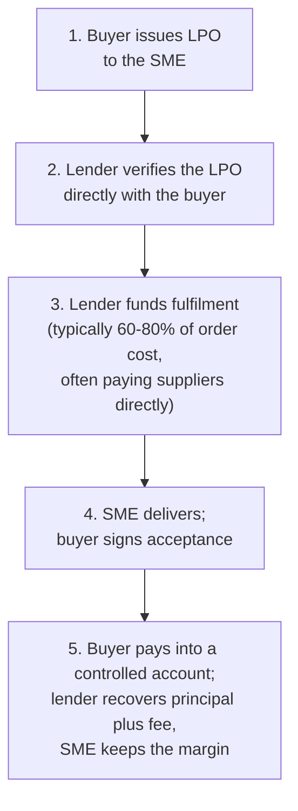

Every growing Kenyan trading business eventually meets the same wall: a Local Purchase Order it cannot afford to fulfil. A supermarket chain, a county government, a large contractor issues an order for KES 4 million of goods; the suppliers want KES 3 million before anything ships; the business has KES 600,000. Declining the order caps growth at the speed of your own cash. Accepting it without funding is how delivery failures and blacklistings happen.

Purchase order finance exists for exactly this wall. It is the facility that lends against the *future* transaction rather than past assets, which makes it both the most growth-shaped instrument in Kenyan SME finance and one of the most carefully underwritten.

> **Key Insight:** In LPO finance, the lender is not really lending to you; they are lending to your buyer's promise, through you. Everything about the facility, its availability, its price, and its paperwork, follows from that one fact. Strong buyer, verifiable order, adequate margin: fundable. Any of the three missing: not a financing problem, a deal problem.

---

### How the Facility Actually Works

The details that matter inside each step:

**Verification is non-negotiable.** The lender will confirm the LPO with the issuing organisation, its procurement office, not the person who handed you the document. Legitimate buyers expect this; any buyer who resists it is telling the lender something.

**Funding usually bypasses your account.** Most lenders pay your suppliers directly against quotations, precisely so the money cannot leak into other uses. Expect to fund the balance (20-40% of fulfilment cost) yourself; the facility is a partnership in the order, not a full ride.

**Collection is controlled.** The buyer is instructed to pay into an account the lender controls (or the payment is assigned). The lender takes principal and fees; the margin flows to you. This is also why buyer quality is the real security: the facility unwinds cleanly only if the payer pays.

**Tenor matches the order cycle**: typically 30-120 days from funding to buyer settlement. Government orders run longer, which the structure must anticipate, not discover.

---

### The Margin Arithmetic That Decides Everything

LPO finance is priced as a facility fee plus interest for the cycle, commonly working out to an all-in cost of roughly 4-8% of the funded amount per cycle depending on lender, buyer, and tenor. Whether that is cheap or ruinous depends entirely on your gross margin:

| The Order | Weak-Margin Deal | Healthy-Margin Deal |
|---|---|---|
| Order value | KES 4,000,000 | KES 4,000,000 |
| Fulfilment cost | KES 3,600,000 (10% margin) | KES 3,120,000 (22% margin) |
| Amount financed (75% of cost) | KES 2,700,000 | KES 2,340,000 |
| Financing cost at 6% all-in | KES 162,000 | KES 140,400 |
| Margin after financing | KES 238,000 | KES 739,600 |
| Margin consumed by finance | **40%** | **16%** |

Both deals "work", but the first one works the way a tightrope works: one price increase from a supplier, one month of buyer delay (extending the interest clock), one logistics surprise, and the margin is gone. The discipline is to compute your **fully loaded** margin, including transport, packaging, and the financing itself, before accepting the order; businesses that skip this are documented in the [packager margin case study](/blog/sme-packager-optimization), and the general budgeting muscle is built in [How to Build an Accurate Startup Budget](/blog/how-to-build-an-accurate-startup-budget).

The working rule of thumb: **below roughly 15% gross margin, LPO finance rarely makes sense**; the fee eats the deal. At 20%+ it is usually comfortable. In between, the buyer's payment speed decides.

---

### Government LPOs: The Special Case

Public entities issue a huge share of Kenya's LPOs, and they are simultaneously the best and the trickiest paper to finance:

- **The credit is strong**: the buyer is a national or county government entity, which is why lenders accept the paper at all.
- **The payment cycle is not the contract's promise.** Budget cycles, exchequer releases, and pending-bills backlogs mean 90-180 days is realistic planning, sometimes worse. Structure the facility tenor for the government's actual paying speed, and price the interest clock accordingly in your margin maths.
- **The exit is a handover, not a wait.** Once delivery is accepted, the LPO has become an invoice, and the position can often be refinanced into cheaper [invoice discounting](/blog/what-is-accounts-receivable) for the long collection tail, paying off the more expensive order facility early.
- **Documentation discipline is everything**: procurement paperwork, delivery notes, inspection and acceptance certificates. In a payment dispute with a public entity, the file is the argument.

---

### Who Offers It, and What They Need From You

LPO finance is offered by commercial banks (usually inside SME banking propositions), microfinance banks, and a large tier of specialist non-bank lenders. Banks price lower and verify harder; specialists move faster and cost more. The standard file, whoever you approach:

- The LPO itself, from a buyer the lender can accept
- Evidence of similar orders fulfilled (delivery notes, past LPOs, references)
- Supplier quotations for the fulfilment cost
- Business registration, KRA PIN, bank statements, and the rest of the [evidence file](/blog/sme-finance-handbook-kenya)
- Your own contribution to the fulfilment cost

Everything on that list is also the answer to "how do I get better pricing": each financed and fulfilled order becomes track record, and track record converts into higher advance rates, lower fees, and eventually a revolving order-finance line instead of deal-by-deal approvals. The first facility is the expensive one; the fifth is a relationship.

---

### The Fraud Patterns (Both Directions)

Order finance attracts fraud, and knowing the patterns protects you from both committing and suffering them:

- **Fake or inflated LPOs** are why verification is strict; presenting one, even "borrowed" from a real tender, is fraud, prosecuted as such.
- **Round-tripped supply chains** (the "supplier" is the borrower's other company) are screened via supplier verification; legitimate businesses with related suppliers should disclose upfront.
- **The broker who guarantees funding** for an upfront "processing fee", before any buyer verification, is running the oldest advance-fee script in Nairobi. Lenders charge fees on approval and disbursement, not on promises.
- **Diverted proceeds** (buyer pays the SME directly, SME spends it) is the classic borrower-side failure; it is also why controlled collections exist and why breaching them ends the relationship and starts the lawsuit.

---

### Risk Factors

- **Fulfilment risk is yours.** Unlike invoice finance, the work is not done yet; supplier failure, logistics, or quality rejection leaves a loan with no receivable behind it.
- **Buyer-delay risk compounds daily**: every week the buyer stretches, the interest clock runs against a fixed margin.
- **Concentration**: a business built on one buyer's LPOs is that buyer's unsecured creditor in every way that matters.
- **Rejection risk**: partial acceptance or quality disputes convert a financed order into a negotiation; contracts should specify inspection and acceptance mechanics before funding.

### Decision Framework: Should This Order Be Financed?

1. Is the buyer verifiable and would a lender accept their credit? If not, negotiate a deposit instead.
2. Does the fully loaded margin survive the all-in financing cost with room for one bad surprise (the 15%+ rule)?
3. Can you fund your share of fulfilment without touching payroll or tax money?
4. Is the tenor set to the buyer's real payment speed, with the invoice-discounting handover planned for slow payers?
5. Have you fulfilled something like this before, and can you prove it?

Five yeses fund the order. The order that fails question 2 should be declined or renegotiated, which is not a failure; it is the margin discipline that keeps you alive to win the next one.

### Bengula View

The desk regards LPO finance as the single most transformative facility for trading SMEs, and the least forgiving of sloppy arithmetic. It is the instrument by which a KES 600,000 business fulfils a KES 4 million order, and the instrument by which a 10%-margin business converts revenue growth into busy insolvency. Take the deals where the buyer is strong and the margin is honest, verify everything you would want verified, hand slow-paying paper to invoice discounting at delivery, and treat every fulfilled order as what it really is: collateral for the next, larger one.

---

### Sources and Further Reading

- [Central Bank of Kenya](https://www.centralbank.go.ke/): the lending-rate environment (indicative average 14.5%, 2 July 2026).
- Bengula Inc: [The Complete SME Finance Handbook](/blog/sme-finance-handbook-kenya), [What Is Accounts Receivable](/blog/what-is-accounts-receivable), [SME Trade Finance](/blog/sme-trade-finance), [How Kenyan Banks Price Your Loan](/blog/how-kenyan-banks-price-loans), [SME Packager Margin Optimization](/blog/sme-packager-optimization)

*General business education, not credit or legal advice. Facility terms, advance rates, and fees vary by lender and buyer; figures shown are illustrative. Confirm terms in a formal offer letter before committing to any order.*
