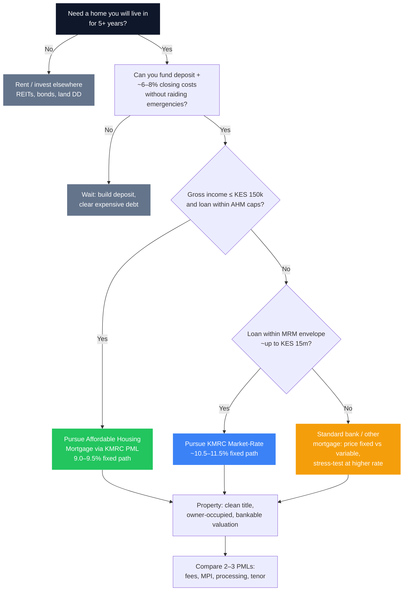

Home finance in Kenya is not one product. It is a **stack of doors**, and most buyers only try the first one they hear about. The most important door for middle-income owner-occupiers is the **Kenya Mortgage Refinance Company (KMRC)** path - fixed rates around **9.0%–9.5%** on the affordable tier versus **15%–18%** on many standard bank books. The full mechanics, income caps, loan ceilings, and worked KES 5 million comparison live in [Accessing KMRC Mortgages](/blog/kmrc-affordable-housing-mortgage).

This article sits **one level above** that guide. It answers the decision sequence an RM would walk with a client: **Should you buy now? If yes, which mortgage lane? What does the house cost after stamp duty and insurance? What breaks the deal even when the rate looks perfect?**

> **Key Insight:** Start with **eligibility and cash at completion**, not the advertised rate. A 9.5% KMRC loan you cannot document, on a title the bank will not take, with closing costs you did not save for, is worse than renting one more year while you fix the file. Rate is step four; fit and cash are steps one to three.

```cards
- icon: Home
  title: KMRC first when you fit
  desc: Income, loan size, and owner-occupation rules decide whether single-digit fixed funding is available. Read the full KMRC guide before you tour show houses.
  linkText: KMRC mortgage guide
  linkUrl: /blog/kmrc-affordable-housing-mortgage
- icon: Scale
  title: Then compare lanes
  desc: Affordable KMRC, market-rate KMRC, SACCO channel, and standard variable bank mortgages are different products - not minor price variants.
  linkText: How banks price loans
  linkUrl: /blog/how-kenyan-banks-price-loans
  type: amber
- icon: Calculator
  title: Model total cost
  desc: Deposit, stamp duty, legal, valuation, mortgage protection, and the instalment-to-income ratio decide survival - not the brochure rate alone.
  linkText: Book a structure session
  linkUrl: /contact
  type: emerald
```

---

### The Decision Tree (Use This Order)



---

### Step 1: Rent vs Buy (Before Any Application)

Buying is not automatically “building wealth.” It is a **levered, illiquid, concentrated** bet on one property plus your ability to service debt through job or business shocks.

**Buying tends to win when:**

- You will **occupy** the home for a long horizon (roughly five-plus years), so transaction costs amortise  
- The instalment is **sustainable** after school fees, transport, and a live [emergency fund](/blog/ultimate-guide-to-personal-finance-kenya)  
- You have access to **below-market fixed** funding (especially KMRC) relative to local rents  
- Title, location, and resale liquidity are defensible - not only “cheap”

**Renting (or waiting) tends to win when:**

- Your income or business cash flow is unstable  
- The only affordable unit has **dirty title** or developer risk the bank will reject  
- Deposit + closing costs would wipe your buffer and force [expensive short-term debt](/blog/mobile-digital-loans-real-cost-kenya)  
- You are buying mainly because of social pressure, with no rate or cash-flow edge  

Investment property is a **different** decision from owner-occupation. Affordable KMRC is explicitly **not** for speculative or pure rental plays in the AHM tier ([KMRC guide](/blog/kmrc-affordable-housing-mortgage)). Pure investors should also weigh [REITs](/blog/reits-in-kenya-guide) and liquid fixed income against landlord operational risk.

---

### Step 2: Which Mortgage Lane Are You On?

Recap of the three practical lanes (detail and participating lenders in the [KMRC article](/blog/kmrc-affordable-housing-mortgage)):

| Lane | Who it fits | Rate shape (indicative) | Hard limits to respect |
|---|---|---|---|
| **KMRC Affordable (AHM)** | Gross income **≤ KES 150,000** (individual or combined, as applied), owner-occupier | **~9.0% SACCO / ~9.5% bank**, fixed | Loan caps **~KES 10.5m** metro / **~KES 8m** rest of Kenya; min **~10%** deposit |
| **KMRC Market-Rate (MRM)** | Over AHM income or property box, still within MRM envelopes | **~10.5%–11.5%** fixed, still below many “street” mortgages | Often up to **~KES 15m**; deposit **~10%–20%** |
| **Standard commercial mortgage** | Above MRM size, non-eligible property, or lender not using KMRC for your case | Often **~15%–18%**, frequently **variable** / risk-priced | Bank LTV, income tests, valuation, and [risk-based pricing](/blog/how-kenyan-banks-price-loans) |

**KMRC does not lend to you directly.** You apply to a **Primary Mortgage Lender (PML)** - banks and SACCOs on the partner list. SACCOs can be sharper on the AHM rate (**9.0%** vs **9.5%**) and sometimes more flexible on non-traditional income, at the cost of membership mechanics ([SACCO realities](/blog/sacco-savers-guarantors)).

**If you are over the AHM income cap**, do not force a fake structure. Use **MRM** or standard pricing honestly. Misstated income is how approvals die in audit - and how banking relationships get damaged.

```cards
- icon: BadgePercent
  title: AHM lane
  desc: Single-digit fixed for qualifying owner-occupiers. Verify income, loan cap, and property use before you fall in love with a unit.
  linkText: Full KMRC criteria
  linkUrl: /blog/kmrc-affordable-housing-mortgage
- icon: Building2
  title: MRM lane
  desc: Still refinanced cheaply relative to many open-market mortgages - use when AHM caps do not fit.
  linkText: KMRC two-tier structure
  linkUrl: /blog/kmrc-affordable-housing-mortgage
  type: amber
- icon: Landmark
  title: Standard lane
  desc: Price the all-in rate, variability, and stress instalment. Compare like-for-like with KMRC economics.
  linkText: Loan pricing explained
  linkUrl: /blog/how-kenyan-banks-price-loans
  type: emerald
```

---

### Step 3: Affordability Beyond the Marketing Instalment

KMRC and CBK-aligned underwriting commonly cap repayment around **one-third of basic salary** (existing deductions reduce headroom). That is a **lender rule**, not a lifestyle recommendation.

**Household stress test (use this even if the bank says yes):**

$$
\text{Housing burden} = \frac{\text{Mortgage (or rent) + levies + insurance}}{\text{Net household take-home}}
$$

Stay honest about:

- School fees spikes  
- Commute and estate levies  
- Variable-rate shock if you are **not** on fixed KMRC pricing  
- One income loss for three to six months  

**Rough maximum loan intuition** (illustrative only - lenders use their own calculators):

$$
\text{Comfortable instalment} \lesssim 0.30 \times \text{net monthly income}
$$

Then back into loan size from rate and tenor. The [KMRC worked example](/blog/kmrc-affordable-housing-mortgage) shows why rate dominates lifetime cost: on **KES 5,000,000 over 20 years**, a **16%** path was about **KES 70,050**/month versus about **KES 46,600**/month at **9.5%** - roughly **KES 23,450**/month and **KES 5.6 million** less interest over the life of the loan in that illustration.

If you only qualify at the high rate, recompute whether the **same house** still makes sense - or whether a cheaper unit on KMRC terms is the real wealth move.

---

### Step 4: Cash at the Door (Deposit Is Not Enough)

Most AHM structures assume about **10% equity**. Closing costs often add another **~6%–8%** of property value in the KMRC guide’s framing, including:

| Cost | Why it bites |
|---|---|
| **Stamp duty** | Often cited around **4%** in urban contexts - confirm current KRA rules for your title |
| **Legal fees** | Buyer and bank counsel |
| **Valuation** | Bank-approved valuer; price may come in **below** asking |
| **Facility / arrangement fees** | Bank schedule |
| **Mortgage protection / life & fire** | Often required; protects lender and (if structured well) your dependants - see [insurance stack](/blog/insurance-stack-kenya-life-stages) |

**Cash needed ≈ deposit + closing stack + moving buffer.** If that stack empties your emergency fund, you are one repair bill away from high-cost debt - the wrong way to “own.”

Some products advertise very high LTV or fee financing; treat those as **exceptions to model line by line**, not as a plan to buy with zero cash.

---

### Step 5: Fixed vs Variable (and Why KMRC’s Fixed Matters)

| Feature | Fixed (e.g. KMRC AHM/MRM path) | Variable / risk-priced commercial |
|---|---|---|
| Payment predictability | High for the fixed term | Moves with base rates and bank policy |
| Planning school fees & payroll-like household budgets | Easier | Needs a rate-shock buffer |
| Link to [CBR cycle](/blog/cbr-cycle-portfolio-positioning-kenya) | Less day-to-day noise | Instalment can rise when policy is tight |
| Early settlement | Check penalties and lock-ins | Also check; not always free |

KMRC’s structural point - wholesale long-term funds fixing the bank’s **asset-liability mismatch** - is why participating PMLs can offer **long fixed** retail rates that ordinary deposit-funded books struggle to match. That story is in the [KMRC wholesale model section](/blog/kmrc-affordable-housing-mortgage); use it when a branch tries to push you to a dearer variable product “because it is simpler.”

---

### Step 6: Property Underwriting Will Kill More Deals Than Credit Score

Banks finance **bankable security**, not dreams. Expect scrutiny of:

- Clean **title** (no disputes, correct proprietor, registrable charge)  
- Approved plans for construction mortgages  
- Sale agreement consistency  
- Valuation supporting LTV  
- Spousal consent where required  
- Owner-occupation rules on AHM  

A beautiful unit on defective title is not a mortgage candidate. Fix legal issues **before** you pay a large commitment fee to a developer who cannot deliver chargeable paper.

**Self-employed and business owners:** bring the same evidence culture as any SME facility - separated accounts, tax filings, multi-year statements ([banking structure](/blog/ultimate-guide-to-banking-in-kenya), [eTIMS](/blog/etims-kenya-sme-guide)). The KMRC checklist already distinguishes salaried vs business packs; incomplete files are the main delay.

```cards
- icon: FileCheck
  title: Title first
  desc: No clean title, no mortgage. Legal due diligence is part of the purchase price.
  linkText: KMRC property checklist
  linkUrl: /blog/kmrc-affordable-housing-mortgage
- icon: Users
  title: Income evidence
  desc: Payslips and salary credits - or audited accounts and tax - must tell one story.
  linkText: Credit readiness
  linkUrl: /blog/anatomy-of-a-bank-proposal-kenya
  type: amber
- icon: Shield
  title: Protection layer
  desc: Life and fire covers are not optional extras on most books; size family cover beyond the bank’s minimum.
  linkText: Insurance by life stage
  linkUrl: /blog/insurance-stack-kenya-life-stages
  type: emerald
```

---

### Step 7: Compare PMLs Like a Professional

Even inside KMRC pricing bands, **total cost of credit** differs:

1. Interest rate (9.0% vs 9.5% on AHM is already material)  
2. Arrangement and commitment fees  
3. Valuation and legal panels (speed and cost)  
4. Mortgage protection premium methodology  
5. Processing time vs your sale agreement deadlines  
6. Redraw / early repayment / top-up rules  
7. Existing relationship and [CRB](/blog/credit-score-kenya-guide) narrative  

Run **two or three** partner banks or a SACCO-plus-bank comparison. Use the partner list and documentation checklist in the [KMRC guide](/blog/kmrc-affordable-housing-mortgage) as your application spine.

---

### When Standard Mortgages Still Make Sense

- Property or loan size **above** KMRC envelopes  
- Complex property types some PMLs will not put on KMRC books  
- You need speed and will accept higher cost for a short hold (rare - math usually hurts)  
- You are restructuring or porting in ways a specific bank handles better  

If you take variable pricing, write down the instalment at **+200 to +300 bps** and confirm the household still stands. Tie that stress to the [CBR playbook](/blog/cbr-cycle-portfolio-positioning-kenya).

---

### Common Failure Modes

1. **Assuming KMRC is automatic** because you saw a 9.5% headline online  
2. **Income just over KES 150,000** with no plan for MRM - and anger at the branch  
3. **Deposit saved, closing costs not**  
4. **Buying for rental on AHM assumptions**  
5. **Ignoring existing check-off loans** that consume the one-third ratio  
6. **Developer pressure** to pay before bank valuation and legal clearance  
7. **Empty emergency fund** the week after keys  
8. **No beneficiary / life cover thinking** beyond the bank’s credit life minimum  

---

### A Practical 90-Day Prep Plan

| Phase | Actions |
|---|---|
| **Days 1–30** | Pull CRB; clear junk digital debt; list gross income and existing deductions; read [KMRC eligibility](/blog/kmrc-affordable-housing-mortgage) |
| **Days 31–60** | Target deposit + closing cash in [MMF/liquid sleeve](/blog/bank-vs-sacco-vs-mmf-savings); shortlist estates with clean titles |
| **Days 61–90** | Pre-discuss with 2 PMLs; assemble salaried or business pack; only then sign a sale agreement with financing conditions |

---

### Closing

KMRC changed the **economics** of formal home loans for Kenyans who fit its boxes - especially the affordable tier’s single-digit fixed rates versus double-digit open-market mortgages. Your job is not to memorise every partner logo. It is to run a clean sequence: **horizon and cash → lane (AHM / MRM / standard) → affordability stress → total completion cost → bankable property → PML bake-off.**

For rates, caps, documentation, and the KES 5 million interest comparison, use [Accessing KMRC Mortgages](/blog/kmrc-affordable-housing-mortgage) as the operational manual. For pricing logic on non-KMRC credit, use [how banks price loans](/blog/how-kenyan-banks-price-loans). When you want a second pair of eyes on lane choice, cash-at-door maths, or pack quality, explore [services](/services) or [book a session](/contact).

The goal is not a house at any cost. It is a **survivable instalment on a chargeable title**, funded by the cheapest lane you truly qualify for - with enough liquidity left that ownership does not become a second emergency.
