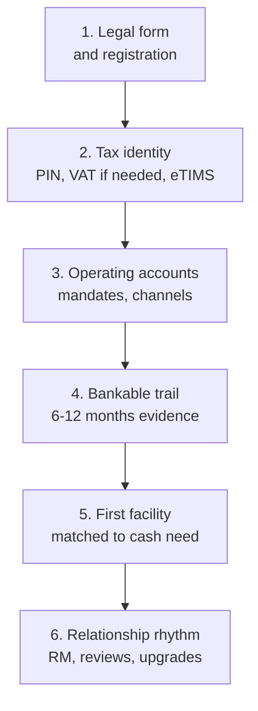

Most founders reverse the order. They need stock, a vehicle, or a tender performance bond, so they walk into a branch and ask for money. The bank asks for registration papers, a KRA PIN, six months of statements, tax compliance, and a story that ties the facility to cash generation. The founder hears bureaucracy. The banker hears **missing chapter zero**.

This article is that chapter: from **legal existence** to **first sensible facility**. It sits in front of [anatomy of a bank proposal](/blog/anatomy-of-a-bank-proposal-kenya) and [how banks price loans](/blog/how-kenyan-banks-price-loans). Compliance tools such as [eTIMS](/blog/etims-kenya-sme-guide) appear not as chores, but as the raw material of bankability.

> **Key Insight:** Your first facility is rarely won in the credit committee room. It is won in the six to twelve months before you apply, when every sale, tax invoice, and account turnover either builds or fails to build a file a Relationship Manager can defend.

```cards
- icon: FileCheck
  title: Exist cleanly
  desc: Registration, beneficial ownership, KRA PIN, and signatories that match reality.
  linkText: eTIMS and records
  linkUrl: /blog/etims-kenya-sme-guide
- icon: Landmark
  title: Bank on purpose
  desc: Choose account type, mandates, and channels for the business you run, not the one in a brochure.
  linkText: Banking guide
  linkUrl: /blog/ultimate-guide-to-banking-in-kenya
  type: amber
- icon: LineChart
  title: Earn the file
  desc: Turnover, tax compliance, and clean conduct create the evidence for facility one.
  linkText: Bank proposal
  linkUrl: /blog/anatomy-of-a-bank-proposal-kenya
  type: emerald
```

---

### The Journey at a Glance



Skip a step and you can still trade informally. You will struggle to borrow formally at sane prices.

---

### Step 1: Choose a Legal Form and Register It

Common Kenyan starting points:

| Form | Fits | Banking implication |
|---|---|---|
| **Sole proprietorship** | Single owner, simple ops | Simple, but personal and business risk blur |
| **Partnership** | Few co-owners | Clear partnership deed helps mandates |
| **Private limited company (Ltd)** | Growth, partners, tenders, investment | Preferred by many banks and corporates |
| **LLP** | Professional and some investment clubs | Hybrid; document members carefully |

Practical rules:

- Register through the official **eCitizen / Business Registration Service** channels, not a random agent WhatsApp forward.
- Keep **CR12 / official search** (or equivalent ownership evidence) current when shareholding changes.
- Align **trading name, invoices, contracts, and bank account name**. Mismatches slow everything later.

This is not legal advice on which form is optimal for tax or liability; use an advocate or qualified company secretary when ownership or regulated activity is non-trivial.

---

### Step 2: Tax Identity and Invoice Reality

Minimum stack for a bankable firm:

1. **KRA PIN** for the business (and clarity on directors' PINs where required).
2. **VAT registration** when you meet thresholds or your customers require it.
3. **eTIMS (or applicable electronic invoicing route)** so sales leave a verifiable trail. Full walkthrough: [eTIMS and the SME](/blog/etims-kenya-sme-guide).
4. **Tax compliance certificate** when you need tenders, some facilities, or large B2B contracts.

Why bankers care: credit files need **believable turnover**. eTIMS-aligned invoicing plus bank credits that roughly match is far more persuasive than a colourful spreadsheet.

---

### Step 3: Open the Right Operating Accounts

#### Account Design

| Need | Typical setup |
|---|---|
| Daily trading | KES current/operating account |
| Tax and statutory | Separate sub-account or disciplined ledger (even if one bank account) |
| USD costs or revenues | Multi-currency account when volumes justify ([FX hygiene](/blog/sme-transaction-fees-fx-spreads-kenya)) |
| Collections | Paybill/till or collection tools matched to customers |
| Directors' drawings | Stop mixing personal lifestyle spends into the only business account |

#### Mandates and Control

- Dual signatories above a threshold once headcount or fraud risk justifies it ([risk management](/blog/sme-risk-management-kenya)).
- Internet banking profiles with maker-checker, not a single shared password.
- Card and mobile access limited to roles that need them.

#### Choosing a Bank

Optimise for **fit**, not only free account opening:

- Branch and RM access where you actually operate
- Trade products if you import/export
- Digital channels your staff will use
- Tariff honesty (request the schedule)

The structural map of Kenyan banking sits in [Ultimate Guide to Banking in Kenya](/blog/ultimate-guide-to-banking-in-kenya). Relationship craft is in [why your RM matters](/blog/why-rm-is-sme-growth-asset).

---

### Step 4: Build the Bankable Trail (The Real Work)

Aim for **six to twelve months** of clean conduct before a meaningful first facility. Startups sometimes get thinner files, but they pay in price, security, or both.

#### What "Clean" Looks Like

| Signal | Why it helps |
|---|---|
| Regular credits matching your story | Capacity evidence |
| Limited unexplained cash dumps | Source-of-funds comfort |
| Few returned cheques / unpaid e-instructions | Character evidence |
| Tax filings reasonably current | Compliance character |
| Supplier payments that look commercial | Real business, not circular flows |
| Directors not draining every peak receipt | Sustainability |

#### Records to Keep From Day One

- Invoices and eTIMS trails
- Contracts or LPOs for large jobs
- Simple management accounts (even Excel) that can evolve into statements a lender trusts ([how to read statements](/blog/how-to-read-financial-statements-kenya), [ratios](/blog/sme-financial-ratios-kenya))
- Asset register for equipment you may later finance
- CRB awareness for directors and the entity ([credit score guide](/blog/credit-score-kenya-guide), [CRB repair](/blog/how-to-fix-your-crb-listing-kenya))

#### Personal Credit Still Matters

For new SMEs, banks often lean on **promoters' character**. A director with untreated listings can block a clean company file. Fix personal CRB issues before the company application, not during it.

---

### Step 5: Choose the Right First Facility

Do not start with the largest number you can imagine. Start with the **cash-cycle need**.

| If your problem is... | First facility to study | Deep dive |
|---|---|---|
| Stock or short operating gap | Overdraft / working capital on honest terms | [SME finance handbook](/blog/sme-finance-handbook-kenya) |
| A confirmed order you cannot fund | LPO / PO finance | [LPO finance](/blog/lpo-purchase-order-finance-kenya) |
| Invoices already issued to strong buyers | Invoice discounting / factoring | [Accounts receivable](/blog/what-is-accounts-receivable) |
| A vehicle or machine that earns over years | Asset finance | [Asset finance vs loans](/blog/asset-finance-vs-conventional-loans) |
| Import shipment | LC / import loan structure | [Import finance](/blog/import-finance-kenya-guide) |
| Bid or performance security | Bank guarantee (cash or facility-backed) | [Guarantees](/blog/bank-guarantees-kenya-sme-guide) |
| Longer expansion with repayment capacity | Term loan with DSCR logic | [Bank proposal anatomy](/blog/anatomy-of-a-bank-proposal-kenya) |

**Wrong first facility patterns:**

- Personal digital loans at extreme APR to fund a company gap ([mobile loan costs](/blog/mobile-digital-loans-real-cost-kenya))
- Long asset bought on expensive revolving lines
- Guarantee-heavy tendering without modelling cash lock ([AGPO cash flow](/blog/agpo-tender-cash-flow-kenya))

---

### Step 6: Package the Ask (When the Trail Exists)

When you are ready, the proposal logic in [anatomy of a bank proposal](/blog/anatomy-of-a-bank-proposal-kenya) takes over. In short:

1. **Who you are** legally and operationally
2. **What you need** and why that product fits
3. **How cash repays** (not only how sales grow)
4. **What security** exists without destroying household resilience
5. **What risks** you already manage

Pricing will follow risk-based logic: base rate plus margin ([loan pricing](/blog/how-kenyan-banks-price-loans)). Cleaner files borrow cheaper, all else equal.

---

### Timeline: A Realistic First-Year Path

| Month | Focus |
|---|---|
| 0-1 | Register, PIN, open accounts, set mandates, start eTIMS |
| 1-3 | Route real turnover through the account; separate personal spend |
| 3-6 | Basic management accounts; fix any CRB noise; meet the RM while you do **not** need money |
| 6-9 | Identify the first facility type from actual cash gaps |
| 9-12 | Assemble proposal pack; apply with evidence, not urgency theatre |

Urgent applications still happen. They simply price the missing months of evidence.

---

### Risk Factors

- **Using agents who "know someone"** for registration or banking shortcuts often creates compliance debt.
- **Account proliferation** without reconciliation creates the opposite of a clean file.
- **Mixing personal and business flows** is the fastest way to look unbankable.
- **Applying for the wrong product** burns RM goodwill and bureau enquiries.
- **Process timelines and portal names change;** always confirm current eCitizen, BRS, and KRA steps on official sites.
- **This is education**, not legal, tax, or credit approval advice.

---

### Decision Framework: Are You Ready to Apply?

Score yourself honestly:

1. Legal registration and ownership documents current?
2. KRA PIN and invoicing trail in place?
3. Business account receiving genuine turnover for 6+ months (or a documented startup exception)?
4. Personal CRB of promoters understood and treated?
5. Facility type matched to a specific cash need?
6. Simple financials and bank statements ready?
7. Security and contribution capital identified without reckless household pledges?
8. RM conversation already started (not a cold panic visit)?

If you have more than two "no" answers, keep building the trail. The [SME finance handbook](/blog/sme-finance-handbook-kenya) and [borrowing guide](/blog/borrowing-money-in-kenya-guide) cover the wider landscape once chapter zero is solid.

---

### Bengula View

The desk's view is that Kenyan entrepreneurship culture celebrates the launch and under-invests in the **boring file**. Banks are not allergic to new businesses; they are allergic to unreadable ones. Registration, tax identity, account discipline, and six months of truth in the statements are not obstacles invented by credit committees. They are how an outsider learns you exist.

Meet your RM before you need a favour. Build turnover where it can be seen. Choose the first facility for the cash cycle you actually run. Then use [proposal anatomy](/blog/anatomy-of-a-bank-proposal-kenya) when the number gets serious.

For a structured walkthrough from registration posture to facility design, use [services](/services) or [book a session](/contact).

---

### Sources and Further Reading

- Official channels: eCitizen / Business Registration Service, [Kenya Revenue Authority](https://www.kra.go.ke/), [Central Bank of Kenya](https://www.centralbank.go.ke/) (for banking sector context).
- Bengula Inc: [eTIMS and the SME](/blog/etims-kenya-sme-guide), [Turnover Tax vs Corporation Tax](/blog/turnover-tax-vs-corporation-tax-kenya), [VAT for Kenyan SMEs](/blog/vat-for-smes-kenya), [Anatomy of a Bank Proposal](/blog/anatomy-of-a-bank-proposal-kenya), [How Kenyan Banks Price Loans](/blog/how-kenyan-banks-price-loans), [SME Finance Handbook](/blog/sme-finance-handbook-kenya), [Ultimate Guide to Banking in Kenya](/blog/ultimate-guide-to-banking-in-kenya), [Credit Score in Kenya](/blog/credit-score-kenya-guide), [Why Your RM Is a Growth Asset](/blog/why-rm-is-sme-growth-asset).

*General financial and business education, not legal, tax, or credit advice. Registration portals, tax rules, and bank credit policies change; verify on official sites and with qualified professionals before acting.*
