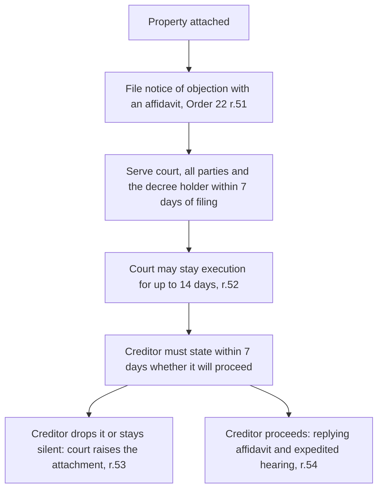

Once a creditor holds a decree, the conversation changes from whether you owe to what can be taken. Most Kenyans assume the answer is everything, and behave accordingly: they stop opening letters, they move a television to a cousin's house, and they are astonished when the things they actually needed are the things that go.

The real answer is narrower and stranger than the rumour. A specific list of property is beyond reach entirely. Two thirds of an employee's salary cannot be touched, while a self-employed trader earning the same money has almost no equivalent protection. Retirement savings are shielded more strongly than anything else a working Kenyan owns, more strongly even than the roof over their head. And one of the protections written for the poorest people in the country has been quietly destroyed by inflation while remaining on the books.

This article is the detailed companion to [the debt enforcement ladder](/blog/debt-enforcement-ladder-kenya), which sets out the sequence from first missed instalment to auction. Here we deal with one rung only, the point where property is actually attached, and what stands between an attachment and a sale.

> **Key Insight:** Exemptions are exceptions, and exceptions have to be raised by somebody. Nothing in Kenyan law requires an auctioneer to check whether the goods on the lorry are your tools of trade, and nothing stops a sale of exempt property that nobody objected to in time. The protections in this article are real, but they are claims you assert, not shields that deploy on their own. The procedure for asserting them is in Part 8, and it runs on a seven day clock.

### Part 1: The Rule, Then the Carve-Out

Section 44 of the Civil Procedure Act, Cap 21, opens wide. All property belonging to a judgment debtor is liable to attachment and sale in execution of a decree, including property over which he has a disposing power exercisable for his own benefit, and **including property held in someone else's name but on his behalf**.

That last clause is why the standard evasion fails. Transferring the car into a brother's name, or the shop stock into a spouse's, does not put it beyond reach if it remains in substance yours. It converts a straightforward problem into a contested one in which you have to explain the transfer.

Having opened wide, the section then carves out eleven categories. The rest of this article is about those carve-outs, two statutes that go further, and the things people wrongly believe are on the list.

### Part 2: The Two Thirds Rule, and the Asymmetry Nobody Mentions

Section 44(1)(viii) exempts **two thirds of the salary of a public officer or other person in employment**. One third is exposed.

$$ \text{Protected} = \frac{2}{3} \times \text{Salary} \qquad \text{Attachable} = \frac{1}{3} \times \text{Salary} $$

On KES 120,000 a month, KES 80,000 is beyond the reach of attachment and KES 40,000 is not. The protection is a proportion, not a floor, so it scales with income rather than with need. A person earning KES 20,000 keeps KES 13,333, which is protection in form more than in substance.

Now read the wording again, because it decides who gets this at all: *a public officer or other person in employment*. The protection attaches to **salary**, and salary presupposes employment.

A self-employed trader, a consultant invoicing clients, a landlord collecting rent, a boda operator, a shopkeeper: none of these people receive a salary. Their income arrives as business receipts, and business receipts sitting in a bank account or a mobile money wallet are simply a debt owed to them by the bank or by Safaricom, reachable in full by garnishee proceedings. There is no two thirds rule for money that has already landed in an account.

This is the single largest inequity in the Kenyan attachment regime and it runs exactly opposite to how people assume the law works. The employed professional with a payslip has a statutory floor under their income. The informal-sector trader, who has less margin and no sick pay, has none.

Two practical consequences follow. If you are employed, the protection exists but you must raise it when an attachment of salary is served on your employer; do not assume the payroll office knows the rule. If you are self-employed and facing a decree, understand that your operating account is the softest target you own, and that the protections in Parts 3 to 6 are the ones that will matter to you instead.

### Part 3: Tools of Trade, the Live Battleground

Section 44(1)(ii) exempts **the tools and implements of a person necessary for the performance by him of his trade or profession**.

The operative word is *necessary*. The test is not what you own, not what the item cost, and not whether you are fond of it. It is whether you need it to earn. That framing produces a fairly clear line in most real cases:

| Likely protected | Likely exposed |
|---|---|
| A mechanic's spanners, jacks and diagnostic kit | The pickup that carries them to jobs |
| A tailor's sewing machine and overlocker | The second machine kept as a spare for hire |
| A salon's clippers, dryers and chairs in use | Retail stock sitting on the shelf for sale |
| A carpenter's saws, planes and workbench | The delivery van and the timber inventory |
| A consultant's laptop, where the work is done on it | A second laptop, a tablet, a desktop at home |

The recurring dispute is over vehicles and over stock. A vehicle is rarely a tool in the statutory sense, even when it is genuinely useful, because the trade can usually be performed without that particular vehicle. Stock in trade is the clearest exclusion of all: goods held for sale are the business's realisable asset, which is precisely what a creditor is entitled to look to.

If your livelihood depends on a specific item, the time to make that argument is at the objection stage in Part 8, with evidence: photographs of the item in use, your trade licence, invoices in your trading name, and a short affidavit explaining what you do and why the item is indispensable to doing it.

### Part 4: The Household Floor, and How Low It Sits

Section 44(1)(i) exempts the **necessary wearing apparel, cooking vessels, beds and bedding** of the debtor and of his wife and children, together with those personal ornaments which, in accordance with religious usage, a woman cannot be parted from.

Read that list carefully, because what it leaves out is most of a Kenyan living room. Clothes, cooking pots, beds and bedding. Not the television. Not the sofa set. Not the fridge, the cooker, the microwave, the sound system or the furniture. The household floor in Kenyan law is a genuinely minimal one: it guarantees that a family is clothed, can cook and has somewhere to sleep, and it guarantees nothing else.

Section 44(1)(iv) adds **books of accounts**, which is a protection for the debtor's records rather than for their comfort, and a sensible one: a creditor gains nothing from carting away ledgers, and everyone loses if the trading history disappears.

### Part 5: The Farmer's Protection, Repealed by Inflation

Section 44(1)(iii) protects an agriculturalist's means of production. It does so in cash ceilings:

| Category | Statutory ceiling |
|---|---:|
| Livestock | First **KES 10,000** in value |
| Implements, tools, utensils, plant and machinery used in stock or dairy farming, or in producing crops or plants | First **KES 5,000** in value |
| Agricultural produce necessary to enable him to earn his livelihood | First **KES 1,000** in value |

Those figures come from amendments made by Act No. 10 of 1969 and Act No. 1 of 1981, and they have never been revised. They are the operative law in September 2026.

Hold them against a real smallholding. Ten thousand shillings does not cover one decent dairy cow. Five thousand shillings does not cover a water pump, let alone a pump and a spray unit. One thousand shillings of produce is a sack or two of maize. The provision that exists to stop a creditor stripping a farmer of the capacity to farm now protects, in practical terms, almost nothing.

Compare it with section 44(1)(ii), the tools of trade exemption, which has no cash ceiling at all. A mechanic in Industrial Area has an uncapped protection over the equipment he needs to work. A dairy farmer in Nyandarua has a protection capped at a 1981 figure. Nothing in policy justifies that difference. It is simply what happens when a monetary threshold is written into a statute and then left alone for forty five years.

There is also a drafting relic in the same section worth knowing if you read it yourself: section 44(2) still refers to the Armed Forces Act, Cap 199, which the Kenya Defence Forces Act 2012 replaced. The cross-reference is stale even though the substance survives.

### Part 6: Retirement Savings, the Strongest Shield in Kenyan Law

Here the Civil Procedure Act is not the main event. Section 44(1)(vii) exempts government pensioners' stipends and political pensions, and section 44(1)(xi) exempts *any fund or allowance declared by law to be exempt*. Two other statutes make exactly such declarations, and they are drafted far more forcefully than anything in section 44.

**The Retirement Benefits Act, No. 3 of 1997**, section 36, headed *Protection against attachment*, provides that notwithstanding anything to the contrary in any other written law, where a judgment or order against a scheme member is made, **no execution or attachment or process of any nature** shall be issued in respect of the contributions or funds of the member or his employer except in accordance with the scheme rules, and such contributions **shall not form part of the assets of the member in the event of bankruptcy**.

**The National Social Security Fund Act, No. 45 of 2013**, section 30(1), provides that notwithstanding any provision to the contrary in any written law, any benefit payable out of a member's account shall not be assigned, pledged, transferred or sequestered, shall not be **set off against any debt of the member**, and shall not be **attached, levied or executed in any form under a judgment**. Section 66(2) adds that benefits payable by the Fund are exempt from taxation and not liable to attachment for debt under any process of law, and section 66(3) keeps contributions out of the pool available to creditors in bankruptcy or insolvency.

| Asset | Protection | Source |
|---|---|---|
| Occupational or individual pension scheme funds | No execution, attachment or process of any nature; outside the estate in bankruptcy | Retirement Benefits Act s.36 |
| NSSF member benefits | No assignment, no set-off against a debt, no attachment or execution under a judgment | NSSF Act s.30(1) |
| NSSF benefits, tax and attachment | Exempt from taxation; not liable to attachment for debt | NSSF Act s.66(2) |
| NSSF contributions in bankruptcy | Not assets for the benefit of creditors | NSSF Act s.66(3) |
| Salary in employment | Two thirds protected, one third attachable | Civil Procedure Act s.44(1)(viii) |

Note how much stronger the pension language is than the salary rule. Salary gets a proportion. Pension savings get *no process of any nature*, and they survive bankruptcy, which almost nothing else does.

There is one deliberate hole, and it is one you choose to open. NSSF Act section 31 permits a prescribed proportion of a member's benefits to be assigned to secure a mortgage loan from a bank or similar institution. That is an option worth having, but understand what it does: it converts part of the most creditor-proof asset you own into security for a debt. Use it with open eyes.

The wider lesson is a planning one rather than a defensive one. The protected list rewards retirement saving in a way the tax code alone does not explain. Money inside a registered scheme is beyond a judgment creditor; the same money in your current account is gone in a week. That is a genuine argument for the pension contribution you have been postponing, set out in [NSSF Tier II versus a private pension](/blog/nssf-tier-ii-vs-private-pension-kenya).

### Part 7: What Is Not Protected, and Usually Surprises People

An honest list of exposure, because false comfort is worse than none:

- **Bank balances.** Fully reachable by garnishee under Order 23. A salary that was protected on the payslip is no longer salary once it lands in the account.
- **Mobile money.** Same analysis. Kenyan courts have made garnishee orders absolute against Safaricom PLC over funds held in a judgment debtor's M-Pesa account and till number.
- **Vehicles.** Rarely a tool of trade in the statutory sense, however necessary they feel.
- **Stock in trade.** The most obvious target a trading business owns.
- **Household electronics and furniture.** Not within the apparel, cooking vessels, beds and bedding exemption.
- **Land and buildings.** Subject to their own procedures, and where the lender holds a charge, to the security's own remedies rather than the decree route.
- **Property held by another on your behalf.** Expressly caught by the opening words of section 44(1).
- **Shares, sacco deposits and receivables.** Attachable, with sacco deposits depending on the society's own rules and any set-off, which is why [SACCO savings and guarantorship](/blog/sacco-savers-guarantors) deserves separate attention.

### Part 8: How to Actually Assert a Protection

This is the part that converts the law into an outcome, and it is the part almost no one knows. It is in Order 22 of the Civil Procedure Rules, rules 51 to 55.

The mechanics, from the Rules:

**Rule 51.** Any person claiming to be entitled to, or to have a legal or equitable interest in, the whole or part of attached property may give written notice of objection to the court, to all the parties and to the decree holder. Crucially, this may be done **at any time prior to payment out of the proceeds of sale**. The notice must be accompanied by an application supported by affidavit setting out briefly the nature of the claim, and must be served on all parties **within seven days** of filing.

**Rule 52.** On receipt of a valid objection the court may stay execution for **not more than fourteen days**, and must call on the attaching creditor to state in writing, **within seven days**, whether it intends to proceed.

**Rule 53.** If the creditor fails to reply in time, or says it will not proceed, the court **raises the attachment** over the whole or the relevant part of the property, and may make an order as to costs.

**Rule 54.** If the creditor does intend to proceed, it must file a replying affidavit and the court hears the application expeditiously.

Three things follow. First, this is the route for a third party whose goods were swept up in someone else's attachment, which in Kenyan households is extremely common: a spouse's equipment, a tenant's stock, a relative's furniture in the same compound. Second, it is equally the route for the judgment debtor asserting that attached property is exempt under section 44. Third, the window is defined by the sale proceeds, not by the seizure, so an objection is not automatically too late merely because goods have already gone. It becomes too late once the money has been paid out.

Do not attempt this by telephone or by argument at the gate. It is a filed notice with a supporting affidavit, and the seven day service requirement is real.

> **Risk Factors:** The two failures that destroy otherwise good objections are delay and vagueness. Delay, because although the outer limit is payment out of the proceeds, every day that passes makes recovery of specific items less likely and the evidence weaker. Vagueness, because an affidavit that asserts ownership without documents rarely persuades. Assemble proof of purchase, photographs of the item in use, your trade licence and any hire or lease agreement before you file, and be specific about which items you claim and on what basis. A blanket claim over everything attached invites the court to believe none of it.

### Decision Framework: Working Out What Is Actually At Risk

**Are you employed or self-employed?** This single fact determines whether you have an income protection at all. Employed: two thirds of salary is protected at source, but raise it with your employer's payroll when an attachment lands. Self-employed: you have no income protection, and your operating account is the softest target you own.

**Which items do you genuinely need in order to earn?** Those are your tools of trade argument, and they are uncapped. Build the list now, with evidence, not on the day the lorry arrives.

**Do you farm?** Then read Part 5 twice and plan on the basis that the statutory protection will not save your herd or your pump. It is capped at figures from 1981.

**Is anything attached actually somebody else's?** That is a third party objection under rule 51 and it belongs to them to bring, urgently.

**Where is your retirement money?** If it is in a registered scheme or in NSSF, it is the best protected asset you have. Think hard before assigning any part of it for housing under section 31.

**Has property already been sold?** The objection window runs until payment out of the proceeds. Check where the money is before assuming it is over.

### Bengula View

Three things from the desk.

First, **the protections are structural, not moral.** Parliament protected the means of production, a minimal household floor and retirement savings. It did not protect comfort, status or convenience. Once you see that logic, the list stops looking arbitrary: your spanners are safe and your television is not, because one earns and the other does not.

Second, **the employment asymmetry deserves far more attention than it gets.** Two thirds of salary is protected for the person with a payslip, and nothing equivalent protects the trader, the boda rider or the consultant. Our readership is disproportionately the second group. If you are in it, stop assuming a rule you have heard about applies to you, and concentrate on the protections that actually do: tools of trade, and retirement savings.

Third, **a protection you do not claim is not a protection.** This is the practical heart of the article. The statute does not enforce itself, the auctioneer has no duty to apply it for you, and the mechanism is a filed objection on a seven day clock. The gap between Kenyans who keep their equipment and Kenyans who lose it is very often not the merits. It is whether anybody filed the notice.

### Conclusion

A decree is not a licence to take everything. Two thirds of an employee's salary, the tools you need to do your work, a minimal household floor, your books of accounts and, most powerfully of all, your retirement savings sit outside what a creditor can reach. Those protections come from section 44 of the Civil Procedure Act and, for pensions, from provisions drafted in considerably stronger terms in the Retirement Benefits Act and the NSSF Act.

But the list is narrower than the rumour in some places and far stronger in others, and it is distributed unevenly. The employed are protected in their income and the self-employed are not. The artisan's tools are protected without limit and the farmer's herd is protected to KES 10,000.

What every one of these protections shares is that it must be raised. Know which items on your own list are genuinely exempt, keep the evidence where you can reach it quickly, and if an attachment happens, file the objection rather than arguing at the gate. The law will hold the line for you, but only once somebody asks it to.

### Frequently Asked Questions

**Can my whole salary be attached?** No. Section 44(1)(viii) protects two thirds of the salary of a public officer or other person in employment. One third is attachable. The protection applies to salary, so it does not help a self-employed person.

**They took my sewing machine. Can I get it back?** Possibly, if it is necessary for your trade. File a notice of objection with a supporting affidavit under Order 22 rule 51 and serve it within seven days. You can object at any time before the sale proceeds are paid out.

**They attached my husband's things along with mine. What do I do?** The person whose property it is brings the objection, claiming a legal or equitable interest under rule 51. The court can raise the attachment over that portion.

**Is my pension safe from a judgment creditor?** Yes, and it is the strongest protection in this area. Retirement Benefits Act section 36 bars execution or attachment of any nature over scheme funds and keeps them out of your estate in bankruptcy. NSSF Act sections 30 and 66 do the same for NSSF benefits.

**Can they take my television and fridge?** Yes. The household exemption covers necessary wearing apparel, cooking vessels, beds and bedding. Electronics and furniture are not on the list.

**I moved my car into my brother's name. Is it safe now?** No. Section 44(1) expressly reaches property held in another's name on your behalf, and the transfer itself will need explaining.

### Related Reading

- [The Debt Enforcement Ladder in Kenya](/blog/debt-enforcement-ladder-kenya) for the whole sequence this article sits inside.
- [NSSF Tier II vs a Private Pension](/blog/nssf-tier-ii-vs-private-pension-kenya) for where retirement money should sit in the first place.
- [SACCO Savers and Guarantors](/blog/sacco-savers-guarantors) for deposits, set-off and what guaranteeing someone else exposes you to.
- [The Complete Guide to Borrowing Money in Kenya](/blog/borrowing-money-in-kenya-guide) for the cornerstone above this cluster.
- [Logbook Loans in Kenya](/blog/logbook-loans-kenya) for why a chattels security follows a different path from a decree.
- [Hire Purchase vs Asset Finance vs Logbook](/blog/hire-purchase-vs-asset-finance-vs-logbook-kenya) for who actually owns the equipment before any of this starts.
- [The 13-Week Cash Forecast](/blog/13-week-cash-forecast-kenya-sme) for seeing the problem early enough to avoid this article entirely.

### References

- [Civil Procedure Act, Cap 21](https://new.kenyalaw.org/akn/ke/act/1924/3/eng@2022-12-31). Section 44, property liable to attachment and sale in execution of a decree, and the eleven exemptions in the proviso. Read from the Revised Edition 2012; amendments cited in the text are Act No. 10 of 1969 and Act No. 1 of 1981 s.25.
- Civil Procedure Rules, Order 22, rules 51 to 55. Objection to attachment, stay of execution, raising of attachment, and notice of intention to proceed.
- [Retirement Benefits Act, No. 3 of 1997](https://new.kenyalaw.org/akn/ke/act/1997/3/eng@2025-06-20). Section 36, protection against attachment. Read from the Revised Edition 2017 [2013].
- [National Social Security Fund Act, No. 45 of 2013](https://new.kenyalaw.org/akn/ke/act/2013/45/eng@2022-12-31). Sections 30, 31 and 66. Read from the Revised Edition 2013, Issue 3.
- [Retirement Benefits Authority](https://www.rba.go.ke/). Member rights on non-assignment and attachment of benefits.

*Statutory provisions and monetary thresholds are stated as at September 2026 and are summarised, not reproduced in full. Statutes are amended and court practice changes; verify the current text on Kenya Law before acting.*

*This article is general legal and financial education, not legal advice, and it does not create an advocate-client relationship. Objection proceedings run on short, strict timelines and a missed step is usually not recoverable. If property has been attached, instruct a qualified advocate immediately rather than relying on any general guide, including this one.*
