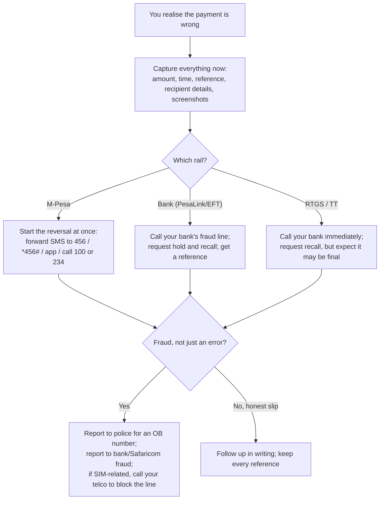

It happens in a second. You fat-finger a phone number, pick the wrong saved payee, or trust an invoice whose account details had been quietly changed by a fraudster, and your money is sitting in a stranger's account. The panic is immediate and universal. The useful question is narrow: **can I get it back, and what do I do right now?**

The honest answer, from [the payment rails guide](/blog/how-to-move-money-kenya-payment-rails), is that it depends almost entirely on two things: which rail carried the money, and how fast you move. The rails differ enormously in how forgiving they are, and, cruelly, the ones that carry the largest sums are the least forgiving of all. On top of that sits a layer of deliberate fraud, and much of it is engineered specifically to exploit how reversals work, so understanding recovery and understanding fraud are the same subject.

This guide covers both. It walks the actual reversal process for M-Pesa and for bank transfers, explains why RTGS and international wires are built to be final, gives an hour-by-hour playbook for the moment it goes wrong, and then dismantles the common frauds so you can avoid being on the wrong end of one. It is the risk-first companion to [the rails guide](/blog/how-to-move-money-kenya-payment-rails) and [M-Pesa for business](/blog/mpesa-for-business-paybill-till-kenya).

> **Key Insight:** Recovery is a race against withdrawal, and the finish line is different on every rail. Money still sitting in the recipient's wallet or account can often be frozen and returned; money already cashed out is gone unless the recipient agrees or a court orders otherwise. So the single most important thing you can do is act in minutes, not hours, and the single most important thing you can do *before* it ever happens is verify the recipient, because on the rails that show you a name, the wrong payment was preventable at the point of sending.

```cards
- icon: RotateCcw
  title: M-Pesa can be reversed
  desc: Send to a wrong number and there is a real reversal path, best if the recipient has not yet withdrawn. Start it in minutes, not hours.
- icon: Landmark
  title: Bank transfers need cooperation
  desc: Money in another bank account comes back only if that bank freezes it and the recipient agrees, or a court orders it. Possible, slow, not guaranteed.
- icon: ShieldAlert
  title: RTGS and wires are final
  desc: Large same-day and international payments are designed to be irrevocable. There is no reversal button, so verify twice before you send.
  linkText: The rails compared
  linkUrl: /blog/how-to-move-money-kenya-payment-rails
  type: amber
```

---

### Part 1: Reversing an M-Pesa Payment

M-Pesa is the most forgiving rail, and it is the one most people use, so start here.

**If you sent to the wrong number**, there is a genuine reversal process. As at 2026 the common routes are to **forward the M-Pesa confirmation message to 456**, dial the reversal option on **\*456#**, use the reversal function in the **M-Pesa app**, or call Safaricom customer care (**100** for prepaid, **200** for postpaid, or **234**). Safaricom then attempts the reversal, and the outcome hinges on one thing: whether the recipient has already moved the money.

- **If the money is still in the recipient's M-Pesa wallet**, Safaricom can freeze that amount and, following its process, reverse it to you. This is the good case, and it is why speed matters so much.
- **If the recipient has already withdrawn or spent it**, Safaricom cannot simply claw it back. It will attempt to contact the recipient and seek their consent to return it. Some people cooperate; many do not, and at that point you are relying on goodwill or a police process.

Two features of M-Pesa are worth naming because they are your friends here. The first is **Hakikisha**, the prompt that shows the recipient's registered name before you confirm; reading it prevents most wrong sends before they happen. The second is that because M-Pesa is a closed loop run by one operator, there is a single party who can act, which is exactly why its reversal path is cleaner than the bank rails below.

For a payment into a **Pay Bill or Buy Goods till** rather than a personal number, the reversal is handled through Safaricom and the business, and the same logic applies: the sooner you flag it, the better the odds.

The exact codes and process are set by Safaricom and change; confirm the current reversal steps on Safaricom's own channels before you need them, and save the number now.


---

### Part 2: Recovering a Wrong Bank Transfer

Money sent by **PesaLink or EFT** to the wrong bank account is harder to recover, because two banks and an unwilling stranger are now involved.

The process is roughly this:

1. **Contact your own bank immediately**, in person or through its fraud or contact line, and report the erroneous transfer with the exact details (amount, date, reference, and the account it went to).
2. **Your bank contacts the receiving bank** and requests that the funds be held and returned. If the money is still sitting in the recipient's account, the receiving bank may be able to freeze it pending the recipient's response.
3. **The recipient's consent, or a court order, is usually required** to actually reverse the credit. A bank cannot simply debit a customer's account to undo someone else's mistake without authority. If the recipient refuses, your route becomes legal.

So bank recovery is possible, but it is a **request, not a right**, and it is slow. Everything again turns on speed and on whether the money has been moved. The practical instruction is the same: report it to your bank the moment you notice, in writing, and get a reference for the report.

Because these rails do **not** show you the recipient's name in the reliable way M-Pesa's Hakikisha does (and RTGS/EFT often show none), the prevention burden shifts entirely onto you: verify the account number and name before sending, from a source you trust.

---

### Part 3: RTGS and International Wires, the Final Rails

This is the part to internalise before you ever send a large payment.

**RTGS (KEPSS)** is designed to be irrevocable. Once a large-value payment has settled through the Central Bank's system, there is no reversal mechanism; the whole point of a real-time gross settlement system is that a completed payment stays completed so the banking system can rely on it. If you send a large sum to the wrong account by RTGS, your only recourse is to ask the recipient to send it back, and, failing that, to litigate. That is why the discipline on RTGS is absolute: **verify the account name and number twice, independently of the message that gave them to you**, before you release the payment.

**International telegraphic transfers (TT / SWIFT)** are harder still. The money has crossed borders and passed through correspondent banks, and a "recall" is a hopeful request travelling back through that chain, not a process you control. Recovery of a wrong or fraudulent international payment is rare.

The pattern across all five rails is the one from the rails guide, and it is worth stating as a law: **the larger the payment, the less the rail will help you undo a mistake.** Your protection therefore has to move earlier, to the moment before you send, precisely where the stakes are highest.

---

### Part 4: The First-Hour Playbook

When you realise money has gone wrong, what you do in the first hour largely decides the outcome. Work the list in order.



Three rules run through the whole playbook:

- **Move in minutes.** Every rail's best outcome depends on the money not yet being withdrawn. The reversal you start in ten minutes often works; the one you start tomorrow rarely does.
- **Capture evidence before you do anything else.** Screenshot the confirmation, note the transaction ID, time, and amount. Any recovery, bank, Safaricom, police, or court, runs on that evidence.
- **Get a reference for every report.** An OB number from the police, a case reference from your bank, a ticket from Safaricom. Recovery is a paperwork process, and the paperwork starts now.

---

### Part 5: The Frauds That Engineer a "Wrong" Payment

Much of what looks like an accident is actually a designed fraud, and several of the commonest scams exploit exactly how reversals work. Knowing the shapes protects you.

**The reversal con (the "wrong send").** Money you were not expecting lands in your M-Pesa, and moments later someone calls, distressed, saying they sent it by mistake and begging you to send it back, often to a *different* number than it came from. Do not. The incoming money may be stolen or itself about to be reversed, and if you forward it you are out of your own cash while the "refund" you sent is gone. The correct response: **do not send it anywhere.** Tell the caller to request a reversal through Safaricom, which will return it to the true source, and verify independently before moving a shilling.

**Business email compromise (BEC).** A fraudster spoofs or hacks a supplier's email and sends you an invoice, or an "updated banking details" notice, pointing to their own account. You pay the real invoice to the wrong account, often by RTGS, the least reversible rail. This targets businesses specifically and is devastating because the amounts are large and final. The defence is a hard rule: **any change of bank details is verified by calling the supplier on a known number you already have**, never the number or email in the message announcing the change.

**SIM swap.** A fraudster gathers enough of your personal details to convince, or corrupt, someone into porting your phone number onto their SIM. Your line goes dead, and they use it to reset your M-Pesa and bank access and drain your accounts. If your phone suddenly loses service for no reason, treat it as an emergency: **call your mobile operator at once to block the line**, from another phone, and alert your bank.

**PIN and OTP phishing.** Callers posing as Safaricom or your bank, fake "customer care" numbers, and messages with links, all trying to get your PIN or a one-time password. The rule never changes: **Safaricom and your bank will never ask for your PIN or full OTP.** Anyone who does is a fraudster, full stop.

The common thread is that these frauds convert your own action into the theft; nobody hacks the rail, they get *you* to send the money. That is also the good news, because it means your own discipline is the defence.

---

### Part 6: Prevention, Which Is the Only Reliable Cure

Because recovery is uncertain and often impossible, the real protection is upstream. A short, boring list prevents the overwhelming majority of losses:

- **Read the name before you confirm.** On M-Pesa and PesaLink the recipient's registered name is shown before you authorise; read it every single time. On EFT, RTGS, and TT there is no such check, so verify the account details yourself.
- **Verify any change of details out of band.** New supplier account? Different paybill? Confirm by calling a number you already had, not one from the message. This one habit defeats BEC.
- **Never share your PIN or OTP, and never act on a link in a payment message.** Type addresses yourself; hang up and call the official number.
- **Protect your phone number.** It is the key to your money now. Guard the personal details used for SIM verification, and react instantly if your line dies.
- **For large payments, slow down and double-check.** The rails that move big money do not undo mistakes. A two-minute verification is cheap insurance against an unrecoverable loss.
- **If your credit or accounts are compromised,** deal with the [CRB consequences](/blog/how-to-fix-your-crb-listing-kenya) deliberately, and treat fraud exposure as part of your wider [risk management](/blog/sme-risk-management-kenya).

### Risk Factors

| Risk | How it arises | Consequence |
|---|---|---|
| Slow reaction | Reporting hours or days later | The money is withdrawn and recovery collapses |
| Wrong rail for the stakes | Large payment by RTGS/TT | An error becomes unrecoverable by design |
| No name check | EFT/RTGS/TT show no recipient name | Wrong account not caught before sending |
| Reversal con | Unexpected money plus a plea to send it back | You lose your own cash to a fake refund |
| BEC | Trusting changed bank details in an email | Large invoice paid to a fraudster, often finally |
| SIM swap | Line ported to a fraudster | M-Pesa and bank access reset and drained |
| PIN/OTP disclosure | Fake customer care, phishing links | Direct account takeover |

### Decision Framework: The Moment It Goes Wrong

**Which rail did the money take?** This decides your odds and your first call: M-Pesa (reversal process), bank (call the bank to recall), RTGS/TT (call the bank, expect finality).

**Has it likely been withdrawn yet?** If not, speed can save it, so act in minutes. If it has, prepare for a consent-or-court path.

**Is this an error or a fraud?** If fraud, add a police OB number and the relevant fraud reports, and, if your SIM is involved, block the line immediately.

**Have I captured the evidence?** Transaction ID, amount, time, screenshots, and a reference number for every report. Recovery runs on this.

**What will stop the next one?** Almost always an upstream habit: reading the name, verifying details out of band, and protecting your PIN and line.

### Bengula View

Three observations from the desk.

First, **speed beats everything, and almost nobody moves fast enough.** The difference between recovering a wrong payment and losing it is usually measured in minutes, because the money is either still sitting where it landed or already gone. People lose precious time in disbelief, or hunting for the right number to call, when they should be starting the reversal and screenshotting the evidence. Decide now what you would do and save the numbers, because in the moment you will not be thinking clearly.

Second, **the frauds are not attacks on the technology, they are attacks on the person, and that is both the bad news and the good.** No one is breaking M-Pesa's or the bank's systems; they are persuading you to send the money yourself, through a plausible story, a spoofed email, a distressed phone call. Which means the defence is not technical, it is behavioural, and it is completely within your control: read the name, verify out of band, never share a PIN, and treat unexpected money as a trap rather than a windfall. The businesses and individuals who internalise those few reflexes almost never lose money, regardless of how sophisticated the attempt.

Third, **the reversibility gradient should shape how you pay, not just how you react.** Because RTGS and international wires cannot be undone, the verification effort on a large payment should be wildly disproportionate to its convenience: call the supplier, confirm the account, have a second person check. It feels excessive right up until the day it saves you a sum you could never have recovered. Build the check into the process for every large payment, so it happens by default and not by memory.

### Conclusion

Whether you get your money back depends on the rail and the clock. M-Pesa has a real reversal path, best used within minutes and before the recipient withdraws. Bank transfers can be recalled, but only with the receiving bank's action and the recipient's consent or a court's. RTGS and international wires are built to be final, so for them the only real protection is verifying before you send. And a large share of "wrong" payments are not accidents at all but frauds, reversal cons, invoice tampering, SIM swaps, engineered to turn your own hand against you.

So act in minutes, capture evidence, get a reference for every report, and, above all, prevent: read the name, verify changes out of band, guard your PIN and your phone line, and slow down on anything large. Recovery is a gamble you may lose; prevention is a habit you control. Make the habit automatic, and the gamble rarely comes up.

### Related Reading

- [How to Move Money in Kenya: Payment Rails Compared](/blog/how-to-move-money-kenya-payment-rails) for the reversibility of each rail and how to choose.
- [M-Pesa for Business: Pay Bill vs Buy Goods](/blog/mpesa-for-business-paybill-till-kenya) for the merchant version, and the fake-confirmation scam.
- [The Real Cost of Mobile and Digital Loans](/blog/mobile-digital-loans-real-cost-kenya) for the lending scams that ride the same rails.
- [How to Fix Your CRB Listing](/blog/how-to-fix-your-crb-listing-kenya) for cleaning up after account compromise.
- [Risk Management for Kenyan SMEs](/blog/sme-risk-management-kenya) for treating fraud as one domain of a managed risk register.
- [The New Business Banking Journey](/blog/new-business-banking-journey-kenya) for setting up dual-authorisation controls on business payments.

### References

- [Safaricom M-Pesa](https://www.safaricom.co.ke/personal/m-pesa). The M-Pesa reversal process, Hakikisha, and fraud-reporting channels. Codes and steps are set by Safaricom and change; confirm current details before relying on them.
- [Central Bank of Kenya](https://www.centralbank.go.ke/). KEPSS (RTGS) settlement finality and national payment system oversight.
- [Directorate of Criminal Investigations](https://www.dci.go.ke/). Reporting financial fraud and obtaining a police report.
- [Communications Authority of Kenya](https://www.ca.go.ke/). SIM-registration rules and consumer guidance relevant to SIM-swap fraud.

*All processes, codes, and timelines are indicative and stated as at 2026. Reversal and recovery procedures are set by Safaricom, the banks, and the Central Bank of Kenya and change; confirm the current steps with your provider, and report suspected fraud to the police and your provider immediately.*

*General consumer education, not legal or security advice. If you are a victim of fraud, contact your bank or mobile operator and the police without delay; time is the single biggest factor in recovery.*
