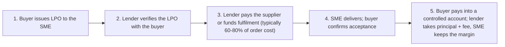

Kenyan SMEs do not have a financing problem. They have a matching problem.

The facilities exist, more of them than at any point in the country's history: overdrafts, invoice discounting to KES 50 million unsecured, LPO finance, letters of credit, asset finance at rates conventional loans cannot touch, embedded credit scored on till data, DFI green lines priced below market. And yet the standard SME borrowing story is still the same one every relationship manager knows by heart: an expensive overdraft quietly funding a warehouse of stock, a cash-flow crisis caused by an unpaid invoice the business never thought to finance, and a loan application that dies because two years of real trading history lives in a personal M-Pesa account the bank cannot see.

Under the risk-based pricing regime, commercial lending to Kenyan SMEs runs roughly 13-18% (the industry average lending rate stood at 14.5% in CBK's July 2026 indicative figures). At those prices, taking the *wrong* facility, or pricing as a stranger when you could price as a documented business, is one of the largest recurring costs a Kenyan SME carries. This handbook is the map: every meaningful facility, what it is actually for, what it costs, what the lender needs to see, and how to choose.

> **Key Insight:** Finance the transaction, not the vibe. Every strong SME facility is matched to a specific asset or cycle that repays it: the invoice that will be paid, the LPO that will be fulfilled, the truck that will earn, the stock that will sell. Facilities fail, and price brutally, when they fund something shapeless ("working capital", "expansion") that no specific cash flow repays. Before asking "how much can I borrow?", answer "what exactly does this money buy, and what event pays it back?"

---

### What This Handbook Covers

| Part | Ground Covered |
|---|---|
| The foundation | Becoming bankable: records, registration, the evidence file |
| The organising idea | The cash conversion cycle, and how it sizes every facility |
| The facility map | One table matching every need to its instrument |
| Working capital | Overdrafts, working capital loans, embedded and merchant credit |
| Receivables finance | Invoice discounting and factoring |
| Order finance | LPO and purchase order finance, including government orders |
| Trade finance | Imports, exports, LCs, and currency risk |
| Asset finance | Equipment and vehicles, including the Islamic route |
| Term debt | How banks price loans, the 5 C's, and DSCR |
| The equity side | From retained earnings to funds, and when debt is wrong |
| Business valuation | What your business is worth, and the methods that decide it |
| Credit profile and treasury | Building the record, and managing the cash you already have |
| Decisions | The facility-matching framework, mistakes, and risks |

All rates in this handbook are dated in the text; the CBK indicative snapshot used is 2 July 2026 (average lending 14.5%, KESONIA 8.7505%, 91-day T-bill 8.835%, inflation 6.41%, USD/KES 129.30). Rates move; confirm current figures before signing anything.

---

## Part One: The Foundation

### Becoming Bankable Before You Need Money

Every facility in this handbook is priced on evidence. The single highest-return financial project for a Kenyan SME is not finding a cheaper lender; it is becoming a business that lenders can read. Five components, all cheap, all boring, all decisive:

**1. Formal existence.** Registration through eCitizen, a KRA PIN in the business name, and the licences your county and sector require. A business that exists only as its owner borrows only as its owner, at personal rates against personal assets.

**2. Separated money.** A business account through which all business money flows, full stop. The moment sales land in a personal M-Pesa, they stop being evidence. Twelve clean months of business banking is the minimum diet for most facilities; the account structure that supports it is covered in the [Ultimate Guide to Banking in Kenya](/blog/ultimate-guide-to-banking-in-kenya).

**3. eTIMS discipline.** Electronic invoicing is no longer optional for tax purposes, and it has a second life lenders love: a KRA-verifiable revenue trail. A business whose eTIMS records, bank statements, and declared sales reconcile is a business a credit analyst can approve quickly. The compliance mechanics are in [eTIMS and the SME](/blog/etims-kenya-sme-guide), and the broader payments data trail in [What Is a Cashless Economy](/blog/what-is-a-cashless-economy).

**4. A clean CRB story.** Not necessarily a spotless one; a *managed* one. Check your listings (business and directors), fix what is fixable, and never let a KES 3,000 mobile loan default cost you a KES 3 million facility. The repair process is in [How to Fix Your CRB Listing](/blog/how-to-fix-your-crb-listing-kenya).

**5. The evidence file.** Registration documents, PIN and tax compliance certificate, twelve months of statements, eTIMS records, the latest management accounts, a debtor and creditor list, and copies of your biggest contracts, maintained continuously in one folder. Businesses that keep this file raise facilities in days; businesses that assemble it under pressure raise in months. Your relationship manager, whose real function is turning your evidence into the bank's confidence, can only work with what exists ([why the RM matters](/blog/why-rm-is-sme-growth-asset)).

---

### The Cash Conversion Cycle: The Number That Sizes Everything

One number organises all of SME finance: how long a shilling stays trapped between paying your supplier and being paid by your customer.

$$ \text{CCC} = \text{DIO} + \text{DSO} - \text{DPO} $$

Days Inventory Outstanding (how long stock sits) plus Days Sales Outstanding (how long customers take to pay, the discipline covered in [What Is Accounts Receivable](/blog/what-is-accounts-receivable)) minus Days Payables Outstanding (how long your suppliers let you take).

A worked example. A distributor holds stock for 45 days, collects invoices in 60, and pays suppliers in 30:

$$ \text{CCC} = 45 + 60 - 30 = 75 \text{ days} $$

If the business turns over KES 2 million a month at 70% cost of goods, it spends roughly KES 46,700 a day on stock. Seventy-five days of that is about **KES 3.5 million permanently locked in the cycle**, the true size of its working capital need, and the reason it always feels broke while profitable.

Three consequences flow from this number:

1. **It tells you how much to borrow.** Working capital facilities should be sized to the cycle, not to what the bank offers or the owner hopes.
2. **It tells you what to fix before borrowing.** Every day cut from DSO (collect faster), or DIO (hold less stock, the discipline in [SME Packager Margin Optimization](/blog/sme-packager-optimization) and [Retail Data & Decision Dashboard](/blog/retail-data-decision-dashboard)), or added to DPO (negotiate terms), releases cash at zero interest. Shortening the cycle by 15 days in the example frees KES 700,000, free money no facility matches.
3. **It names the facility.** Each component of the cycle has a purpose-built instrument, which is the logic of the map below.

---

### The Facility Map

| The Need | The Right Instrument | What Secures It | Cost Signal |
|---|---|---|---|
| Cash trapped in unpaid invoices | Invoice discounting or factoring | The invoices themselves | Discount fee per invoice cycle |
| An order you cannot afford to fulfil | LPO / purchase order finance | The order and its buyer | Fee plus interest for the fulfilment period |
| Stock for a season or a shipment | Import/trade finance, stock loans | Goods, shipping documents | Interest for the trade cycle |
| Equipment and vehicles | Asset finance or leasing | The asset itself | Below unsecured rates ([why](/blog/asset-finance-vs-conventional-loans)) |
| A short, genuine timing gap | Overdraft | Cash flow, sometimes collateral | Highest per-shilling cost; interest on utilisation |
| A multi-year project or premises | Term loan | Collateral plus cash flow | KESONIA + Premium K + fees |
| Losses on the way to scale | Equity, not debt | A share of the business | Dilution ([the ladder](/blog/how-to-raise-startup-capital-kenya)) |

The map's one rule: **the tenor of the money must match the life of what it buys.** Overdrafts fund days, trade facilities fund cycles, asset finance funds the asset's earning life, term loans fund years, and equity funds uncertainty. Every notorious SME finance disaster is a mismatch: the overdraft that bought a matatu, the term loan that funded a single season's stock, the equity given away to plug a receivables gap that discounting would have bridged for a fee.

---

## Part Two: The Facilities

### Working Capital: Overdrafts and Their Better-Priced Cousins

**The overdraft** is Kenyan SME finance's default product and its most misused. Its correct job is narrow: bridging short, genuine, *self-correcting* timing gaps, payroll three days before a confirmed receipt lands, a supplier discount worth taking a week early. Used that way, interest on a few days' utilisation is cheap flexibility. Used as permanent stock finance, an overdraft is the most expensive way to run a supply chain: the full facility price applied forever to a need that never self-corrects, with the bank entitled to call it on review. If your overdraft has been fully drawn for six months, it is not an overdraft; it is a badly structured term loan, and refinancing it into the right instrument is usually the single fastest cost cut available.

**Working capital term loans** fund the permanent layer of the cycle, the KES 3.5 million from the worked example, over one to three years at term-loan pricing, with a repayment schedule the cycle's margins can carry.

**Embedded and merchant credit** is the new layer: lenders scoring live transaction data instead of historical statements. Till-data lenders advance against your M-Pesa merchant flows; platform lenders like those covered in [How Embedded Finance Is Reimagining the Point of Payment](/blog/embedded-finance-kenya-guide) embed working capital inside the tools businesses already use. Strengths: speed and access without collateral. Cautions: facility sizes are small, costs annualise high (run every offer through the [interest-rate translation](/blog/mobile-loan-vs-bank-loan-apr-breakdown)), and the convenience is engineered to become a habit.

**Credit cards** deserve one honest line: a business credit card's interest-free period is a legitimate 30-50 day float on operating spend if, and only if, the balance clears monthly.

---

### Receivables Finance: Unlocking the Money You Have Already Earned

For any SME selling to corporates or government on 30-120 day terms, receivables are usually the largest idle asset on the balance sheet, and the most financeable.

**Invoice discounting**: borrow against unpaid invoices, keep the client relationship, repay when the client settles. Kenyan facilities have matured fast; bank programmes now run to KES 50 million unsecured with disbursement in 24-48 hours, and receivables lines finance up to 85% of the invoice book. **Factoring**: sell the invoices outright at 3-7% of face value and let the factor collect, right for high volumes and weak internal collection, costly for relationships. The full mechanics, providers, documentation, and the government-invoice specifics (where 90-180 day payment cycles make discounting nearly mandatory) are in the dedicated guide: [What Is Accounts Receivable and Why It Decides Your Business Survival](/blog/what-is-accounts-receivable).

The handbook-level rule: receivables finance is the *correct first facility* for most trading SMEs, because it borrows against work already done and sold, the least speculative collateral a business ever holds.

---

### Purchase Order and LPO Finance: Funding the Deal Itself

The most Kenyan of financing problems: you win an order bigger than your balance sheet. A supermarket chain issues a Local Purchase Order for KES 4 million of goods; fulfilling it needs KES 3 million you do not have; declining it caps your growth at your cash.

**PO/LPO finance** funds the fulfilment against the strength of the order and, crucially, the creditworthiness of the *buyer*:

**What lenders need to see:** a genuine, verifiable LPO from a pre-approved buyer (blue-chip corporates, government entities); evidence you have fulfilled similar orders; supplier quotations showing the fulfilment cost; and margins that survive the financing fee, typically a facility fee plus interest for the 30-120 day fulfilment window. Government LPOs qualify widely (the buyer's credit is sovereign) but bring the payment-cycle problem: structure the facility tenor for the government's actual paying speed, not the contract's promise, and plan the exit through invoice discounting once delivery converts the LPO into a receivable.

**The honest warnings.** LPO finance prices above invoice discounting because the lender carries fulfilment risk, not just payment risk: if you fail to deliver, there is no invoice. Fraudulent and inflated LPOs have burned enough lenders that verification is strict, and any broker promising LPO funding without buyer verification is describing either a scam or a victim. And the margin maths is unforgiving: an order at a 12% gross margin financed at a 6% all-in cost was half a deal; know your fully loaded margin (the [packager case study](/blog/sme-packager-optimization) shows how businesses get this wrong) before celebrating the order.

Used well, order finance is how trading SMEs jump size classes: each fulfilled financed order becomes track record, and track record becomes cheaper limits. Full deep dive, including the margin tables and fraud screens: [LPO and Purchase Order Finance in Kenya](/blog/lpo-purchase-order-finance-kenya).

---

### Trade Finance: Imports, Exports, and the Documents Between

Cross-border trade runs on a specific toolkit, built around one problem: the importer does not want to pay before goods exist, and the exporter does not want to ship before money does.

**On the import side:**

- **Letters of credit (LCs)**: your bank promises the exporter's bank payment against compliant shipping documents. The LC substitutes the bank's credit for yours, which is what a Chinese or Indian supplier who has never met you actually requires. Cost: issuance and confirmation fees plus margin/cash cover the bank requires. The credibility it buys often pays for itself in supplier pricing.
- **Import loans and document financing**: once goods ship, banks finance the gap between paying the supplier and selling the goods, secured on the shipping documents and the stock itself.
- **Duty and clearing finance**: the tax bill at Mombasa arrives before the goods earn; short facilities exist precisely for it.

**On the export side:** pre-shipment finance funds production against a confirmed export order; post-shipment finance bridges the voyage and the buyer's terms; export LCs received from your buyer can themselves be discounted. The full frontier-market toolkit is in [SME Trade Finance](/blog/sme-trade-finance), with the agri-corridor mechanics in [Agri-Export Supply-Chain](/blog/agri-export-supply-chain) and the cold-chain variant in the [Zindua case study](/blog/zindua-agri-logistics).

**The currency layer is not optional.** An importer who owes dollars in 90 days, or an exporter awaiting euros, is running an open FX position whether they chose to or not (USD/KES 129.30, 2 July 2026, and never guaranteed to stay there). Forwards and natural hedging are covered in [USD/Shilling Hedging](/blog/usd-shilling-hedging); the handbook rule is simply that the hedge decision must be made *at deal signing*, because by shipment it is a gamble already running. The import side's full relay, LC to duty finance to sell-through, with a worked consignment, is in [Import Finance in Kenya](/blog/import-finance-kenya-guide).

---

### Asset Finance: The Cheapest Debt Most SMEs Ever Touch

When the purchase is a titled, movable, income-producing asset, trucks, machinery, medical equipment, the asset itself is the collateral, and the pricing shows it: asset finance consistently undercuts unsecured lending because repossession risk is the lender's exit. Structures run from hire purchase through finance leases; deposits of 10-30%; tenors matched to the asset's earning life. The full comparison, including why a conventional loan for the same truck costs more, is in [Asset Finance vs Conventional Loans](/blog/asset-finance-vs-conventional-loans).

Two handbook-level additions. First, **the asset must earn its instalment**: finance the lorry that has a route, not the lorry that expresses ambition. Second, for businesses preferring Shariah-compliant structures, **murabaha asset purchase** delivers the same economics through a cost-plus sale, with the discipline of transaction-specific finance built in; the mechanics are in [Islamic Banking in Kenya](/blog/islamic-banking-kenya-murabaha-musharaka-hajj-savings).

---

### Term Loans and the Pricing Machine

For premises, long projects, and the permanent layer of working capital, the term loan is the workhorse, and since the 2025 reforms its price is assembled in the open:

$$ \text{Loan Rate} = \text{KESONIA} + \text{Premium K} + \text{Fees and Charges} $$

KESONIA (8.7505%, 2 July 2026) is the published overnight benchmark; **Premium K is you**: the bank's assessment of your risk, which is where everything in Part One earns its return. The assessment behind Premium K is the classic **5 C's**, character (your record and CRB story), capacity (cash flow), capital (your own money at risk), collateral, and conditions (your sector's weather).

The number that decides capacity is the **debt service coverage ratio**:

$$ \text{DSCR} = \frac{\text{Net Operating Cash Flow}}{\text{Debt Service}} = \frac{240{,}000}{160{,}000} = 1.5 $$

A business generating KES 240,000 of monthly cash flow against KES 160,000 of proposed monthly repayments covers its debt 1.5 times, comfortable territory; most lenders want to see at least 1.25-1.5, evidenced from statements rather than projections. Walk in knowing your own DSCR and you have answered the analyst's first question before it is asked. The full anatomy of what feeds the final rate is in [How Kenyan Banks Price Your Loan](/blog/how-kenyan-banks-price-loans), and the fee-and-APR translation in [Understanding Interest Rates in Kenya](/blog/mobile-loan-vs-bank-loan-apr-breakdown); compare any offer on the [Total Cost of Credit portal](https://www.costofcredit.co.ke/) before signing.

One growing corner deserves a flag: **green and DFI-linked credit lines**, concessional funding channelled through Kenyan banks for qualifying activities (solar, efficient irrigation, clean logistics) at below-market pricing. If your purchase qualifies under the green taxonomy, ask before accepting standard pricing; the map is in [Green Financing in Kenya](/blog/green-financing-kenya-guide).

---

### The Same Million, Priced Four Ways

Facility choice is a price decision before it is anything else. Take one need, KES 1,000,000 of funding for a 60-day trading cycle, repeated through a year, and price the honest alternatives (illustrative figures; your Premium K will move them):

| Route | How It Charges | Indicative Cost for the Year | The Catch |
|---|---|---|---|
| Invoice discounting | Fee per 60-day cycle on drawn amounts | ~KES 90,000-140,000 across six cycles | Needs invoices from acceptable buyers |
| LPO finance | Fee + interest per fulfilment cycle | ~KES 150,000-250,000 across the year's orders | Needs verifiable orders and margin headroom |
| Term working-capital loan (14.5% avg, Jul 2026) | Interest on the full balance all year | ~KES 145,000 plus fees, declining with amortisation | Money you also hold in the quiet months |
| Permanently drawn overdraft | Full facility rate on full utilisation, forever | Highest of the four, plus annual renewal fees | The structure everyone drifts into |

Two lessons hide in the table. Transaction facilities charge only when the cycle runs, which is why they suit lumpy trading businesses; balance-sheet facilities charge continuously, which is why they suit continuous needs. And the same shilling of funding can differ in cost by half depending purely on the instrument wrapped around it, before any negotiation happens.

---

### The 5 C's, Translated Into Kenyan Evidence

Every credit decision in this handbook reduces to five judgements. Here is what each one actually reads, so you can walk in holding the exhibits:

| The C | The Question | The Kenyan Evidence |
|---|---|---|
| Character | Do you honour obligations when it hurts? | CRB reports (yours and the directors'), account conduct, referee suppliers, how past facilities ended |
| Capacity | Does the cash flow cover the instalment? | Bank statements, eTIMS-reconciled sales, management accounts, your DSCR at 1.5 with stress headroom |
| Capital | Is your own money at risk first? | Owner's equity in the balance sheet, the deposit on the asset, retained profits not stripped out |
| Collateral | What is the exit if everything fails? | The security table below, and how close it sits to the transaction |
| Conditions | What is the sector's weather? | Your market's cycle, buyer concentration, currency exposure, and how the application acknowledges them |

The order matters more than borrowers think: collateral is fourth, not first. Kenyan banks decline fully secured loans weekly, because security is the exit nobody wants to use; capacity is the loan. A business that leads its application with cash flow evidence, and treats collateral as the reassurance rather than the argument, is speaking the analyst's language.

---

### A Year in the Life: One Business, Four Facilities

The map is easier to hold as a story. Meet a composite but realistic business: a Nairobi FMCG distributor, KES 3 million monthly turnover, supplying two supermarket chains on 60-day terms and a trail of smaller shops for cash.

**February: the receivables line.** The supermarkets owe KES 4 million at any given time, and payroll does not wait 60 days. The business takes an invoice discounting facility against the two chains' invoices, drawing 80% on delivery. Cost: a discount fee per cycle. Effect: the 60-day DSO stops mattering for cash purposes, and the owner stops financing a blue-chip's payment terms with her own sleep.

**May: the order that jumps a size class.** A third chain issues a KES 5 million LPO, twice anything fulfilled before. Supplier quotes put fulfilment at KES 3.9 million; the gross margin is 22%, comfortably clearing the LPO facility's all-in cost of about 5% for the cycle. The lender verifies the LPO with the chain, pays the suppliers directly, and collects from a controlled account on settlement. The business keeps roughly KES 850,000 of margin it had no balance sheet to earn, and, more valuably, a fulfilled-order record.

**August: the truck.** Two routes now justify a second truck. Asset finance at a 20% deposit prices several points below her unsecured alternatives because the logbook is the security; the instalment is set against the route's documented earnings, and the DSCR still clears 1.5 after it.

**November: the treasury turn.** The VAT and January stock money, briefly KES 2.8 million idle, goes into a 91-day T-bill through the [DhowCSD ladder](/blog/advanced-dhowcsd-t-bill-ladder) instead of decorating the current account. It returns in February, slightly larger, exactly when the cycle needs it.

Four facilities, each matched to a transaction, none funding a vibe. The same business run on a single overdraft would have paid more for less and grown at the speed of its own cash.

**The importer's variant.** A Mombasa hardware importer runs the same logic through the trade toolkit. March: a KES 6.5 million consignment from a Chinese supplier, first shipment with this counterparty, so the supplier demands security of payment. An LC does what no promise can: the importer's bank commits against shipping documents, and the supplier's pricing improves with the certainty. The FX exposure (payment due in dollars at sight of documents, roughly 45 days out) is forwarded on signing day, converting a gamble into a cost. Landing brings the second gap: duty and clearing at the port before a single sheet sells; a 90-day import loan against the stock bridges it. By July the consignment has sold through, the loan is cleared from the proceeds, and the business's file now contains something priceless for the next negotiation: a completed, documented trade cycle. Second shipments price better than first ones for exactly this reason.

---

### Inside the Bank: What Happens After You Apply

Demystifying the process removes both the fear and the delays.

1. **The RM assembles the case.** Your evidence file becomes a credit application: facility, amount, purpose, repayment source, security, and the story that connects them. A complete file here is the difference between days and months.
2. **Credit analysis interrogates capacity.** Statements are spread, the DSCR is computed, CRB reports pulled (business and directors), the buyer verified if the facility is order-based. Expect questions; fast, documented answers are themselves evidence of management.
3. **Sanctioning approves terms, not vibes.** The approval specifies amount, tenor, pricing (KESONIA plus your Premium K), security, covenants, and **conditions precedent**, the list of things that must exist before a shilling moves.
4. **The offer letter is a contract; read it as one.** Beyond the rate: the fees (negotiation, legal, valuation, insurance, excise duty on fees), the covenants you are promising to keep (turnover through the account, no new borrowing without consent, accounts submitted annually), the events of default, and the security clauses, especially **all-monies** wording that makes the collateral cover every present and future debt, and **cross-default** clauses that let one missed instalment anywhere trigger everything. Negotiate before signing; nothing renegotiates as poorly as a signed document.
5. **Security perfection takes the time nobody budgets.** Charges over land pass through valuation, legal drafting, and registration; logbooks through joint registration; debentures through registry filing. Weeks, sometimes months, and mostly at your cost. Start early, and keep copies of every perfected document.

---

### Read Your Own Statements Like the Analyst Will

Before any application, spend an hour on the twelve months of statements you are about to submit, looking for what the credit analyst will find in twenty minutes:

- **The average cleared balance**, not the month-end one; it is the truest single indicator of capacity, and window-dressed month-ends fool nobody who can compute an average.
- **Turnover consistency with the story.** Declared sales of KES 36 million against banked credits of KES 19 million is a question you will be asked; answer it in the application (cash sales banked net? A second account? Fix the leak first).
- **Round-trip transfers**, money that leaves and returns days later, read as related-party propping unless explained.
- **Concentration**, one payer providing 70% of credits is a risk finding; name it and show the mitigation before the analyst does.
- **Seasonality**, which is fine, expected, and only damaging when the proposed instalment ignores it; ask for a schedule shaped like your year.
- **The unpaids and reversals line.** Bounced items are character evidence, the expensive kind. Six clean months before applying is worth more than any cover letter.

The uncomfortable, liberating truth: the analyst's spreadsheet is not a mystery; it is your own account, read honestly. Do the reading first and every surprise becomes a paragraph you wrote yourself.

---

### What Kenyan Lenders Accept as Security

| Security | Typical Use | The Fine Print |
|---|---|---|
| Land and buildings (titled) | Term loans, large limits | Valuation, legal, and registration costs; matrimonial consent where applicable |
| Motor vehicles (logbook) | Asset finance, logbook loans | Joint registration with the lender; comprehensive insurance assigned |
| Cash and near-cash | Any facility, best pricing | Lien over deposits or T-bills; cheapest security there is |
| Debenture over the business | Working capital lines | Floating charge over stock and book debts; watch all-monies wording |
| Invoices, LPOs, contracts | Receivables and order finance | The document's counterparty is the real security |
| Directors' personal guarantees | Almost everything, by default | An unlimited contingent debt; negotiate caps and release triggers |
| Insurance assignment | Alongside most secured lending | Credit life and asset cover; priced into the deal |

The pattern worth exploiting: **the closer the security sits to the financed transaction, the cheaper the money.** Cash cover and self-securing assets (logbooks, verified invoices) price best; general debentures plus personal guarantees, the "everything, forever" package, price worst for the borrower and should be resisted where transaction security exists.

---

### How the Map Bends by Sector

| Sector | The Financing Reality | The Facilities That Fit |
|---|---|---|
| Agribusiness | Seasonal cycles, weather risk, offtaker contracts | Input/season loans, offtaker-backed order finance, [export toolkit](/blog/agri-export-supply-chain), index insurance alongside |
| Retail and distribution | Stock-heavy, thin margins, daily cash | Stock and trade lines, merchant/till credit, ruthless CCC management |
| Services and consultancies | No stock, everything in receivables | Invoice discounting is practically the whole map; overdraft for payroll timing only |
| Manufacturing | Long CCC (raw materials to collected sales) | Working capital term debt sized to the full cycle, asset finance for plant, order finance for contracts |
| Importers/traders | Currency exposure, document-heavy | LCs and import lines, duty finance, forwards from deal signing |
| Construction and contractors | Certificate-based payment, retentions | Certificate discounting, performance bonds and guarantees, LPO finance for materials |

---

### Government and Development-Linked Money

A layer of subsidised or guaranteed credit sits alongside commercial facilities, worth checking before accepting full market pricing:

- **The Credit Guarantee Scheme** (National Treasury, via participating banks) covers part of the lender's risk on qualifying SME loans, which can unlock approval where collateral is the binding constraint; ask your bank whether your facility qualifies.
- **Targeted public funds** (the Women Enterprise Fund, Youth Enterprise Development Fund, county revolving funds, and the Hustler Fund's business products) offer small facilities at concessional rates; sizes are modest, but as *first, record-building* credit they are precisely fit for purpose.
- **DFI-channelled lines** (through commercial banks) price below market for qualifying purposes, notably the green activities mapped in [Green Financing in Kenya](/blog/green-financing-kenya-guide) and women- and youth-owned business windows that several banks operate.

The universal caveat: concessional money still requires the Part One evidence file, still reports to the CRB, and still fails businesses that borrow it for the wrong transaction.

---

## Part Three: Beyond Debt

### The Equity Side: When Borrowing Is the Wrong Answer

Debt finances things that generate the cash to repay it. Three situations fail that test, and belong to equity:

1. **Losses on the way to scale** (product build, market entry).
2. **Bets whose payoff is real but unbankable** (a new line, a new region, before evidence exists).
3. **Balance sheets already carrying all the debt their DSCR allows.**

The full ladder, customer financing, friends and family done properly ([the structures that survive](/blog/how-to-structure-friends-and-family-investments)), grants, angels, funds, and the dilution maths, is mapped in [How to Raise Startup Capital in Kenya](/blog/how-to-raise-startup-capital-kenya). Two handbook rules: never sell permanent equity to solve a temporary gap a fee-based facility would bridge, and never let debt do equity's job, because a facility funding losses defaults on schedule.

---

### Business Valuation: What Is This Thing Actually Worth?

Sooner or later every SME owner needs a number: an investor asks for one, a partner exits, a buyer appears ([the acquisition landscape](/blog/types-of-acquisitions)), a bank weighs an equity-backed guarantee, or succession forces the question. Kenyan SMEs are chronically mis-valued in both directions, and the owner who understands the methods negotiates against people who use them.

| Method | The Logic | Best For | The Catch |
|---|---|---|---|
| Asset-based | Net assets at fair value: what the pieces would fetch | Asset-heavy firms; liquidation floors | Ignores the earning engine; punishes service businesses |
| Earnings multiple | Sustainable annual profit × a market multiple | Trading and service SMEs; the default | Everything hides in "sustainable" and in the multiple |
| Discounted cash flow | Future cash flows discounted to today | Businesses with credible projections | Projections; a spreadsheet will say anything |
| Revenue multiple | Sales × a sector factor | Early, unprofitable, or platform businesses | Values activity, not viability |

**The worked example (earnings multiple, the one most Kenyan SME deals actually use).** A distribution business reports KES 4 million annual profit. Normalise it first: add back the owner's private expenses run through the business (KES 600,000), then deduct the market salary the owner never paid themselves for a full-time role (KES 1,600,000). Sustainable profit: **KES 3 million**. Private Kenyan SMEs of this size typically transact at roughly 2.5-4× sustainable earnings depending on sector, customer concentration, and how transferable the business is without its owner:

$$ \text{Indicative Value} = 3{,}000{,}000 \times (2.5 \text{ to } 4) = \text{KES } 7.5\text{M to } 12\text{M} $$

**What moves the multiple** is a checklist worth running years before any transaction: revenue that repeats (contracts beat walk-ins), customers that number more than three, records an outsider can audit (the same evidence file from Part One), systems that run without the founder, and clean title to whatever the business uses. The brutal truth of SME valuation: **most of the discount is documentation**. Two businesses with identical profits sell at different multiples because one can prove everything and survive its founder's absence, and the other is a person with a till. Full deep dive, methods to multiple drivers: [Business Valuation in Kenya](/blog/business-valuation-kenya-guide).

---

### Building the Business Credit Profile

A business credit identity is built, not found, and it compounds like the portfolio it eventually funds:

- **Borrow small before you need big.** A modest facility taken and repaid visibly is the cheapest credit history money can buy; the multiplier logic SACCO members know ([deposits unlock roughly 3x](/blog/bank-vs-sacco-vs-mmf-savings)) has bank-side equivalents in graduated limits.
- **Let suppliers report for you.** Trade credit honoured on time creates referenceable history; ask your three biggest suppliers for reference letters annually.
- **Monitor all the bureaus** for the business and every director; a director's forgotten default prices the company's Premium K.
- **Keep the borrowing story coherent.** Serial small digital loans across many apps read as distress even when repaid; one banking relationship worked deeply reads as management.

---

### Treasury: Managing the Money You Already Have

SME finance is not only about borrowing; the same discipline applied to idle cash routinely funds more growth than a facility would.

- **The float and the buffer**: one month's costs in the current account, the genuine emergency layer in an MMF, per the [jobs framework](/blog/bank-vs-sacco-vs-mmf-savings).
- **Dated obligations, dated instruments**: VAT and PAYE money, the January stock purchase, the dividend, each parked against its date in T-bills through [the DhowCSD ladder](/blog/advanced-dhowcsd-t-bill-ladder) rather than earning nothing while waiting.
- **Structural surplus** belongs up the [investment ladder](/blog/ultimate-guide-to-investing-in-kenya) or back in the cycle, wherever the return is honestly higher; a business earning 25% margins on its own trade cycle should usually reinvest there first and say so in its accounts.
- **Never let the tax money trade.** The KRA's money is not working capital; businesses die of that specific confusion, on schedule, twice a year.

---

## Part Four: Decisions

### The Facility-Matching Framework

Work down; stop at the first fit:

1. **Is cash trapped in sold-but-unpaid work?** Invoice discounting. The money is yours already; borrow against it before borrowing anything new.
2. **Is the need a specific order you cannot fund?** LPO/PO finance, priced against your true margin.
3. **Is it stock for a defined cycle or shipment?** Trade/import finance matched to the cycle, hedged at signing if currency is involved.
4. **Is it a titled, income-producing asset?** Asset finance (or murabaha), never an overdraft.
5. **Is it a timing gap measured in days?** The overdraft, used as a bridge, cleared monthly.
6. **Is it the permanent layer of the cycle, or years-long?** A term loan sized by your CCC and defended with your DSCR.
7. **Is it losses, a bet, or beyond your DSCR?** Equity. Stop shopping for debt.

### The Five-Year Borrowing Roadmap

For a business starting from informal, the facilities in this handbook arrive in a learnable sequence:

- **Year one: become legible.** Registration, the business account, eTIMS discipline, the evidence file. Borrow nothing you can avoid; bank everything you earn. The year's product is twelve clean statements.
- **Year two: buy a credit history.** One modest facility, a record-building public-fund loan, a small stock line, merchant credit consolidated from the app zoo, taken deliberately and repaid visibly.
- **Year three: finance the transactions.** Invoice discounting against your best buyers; the first LPO facility; supplier terms negotiated with your record as the argument. The CCC becomes a number you manage monthly.
- **Year four: term debt and assets.** The truck or machine on asset finance; the permanent working-capital layer re-termed out of daily facilities; the DSCR computed before every signature.
- **Year five: negotiate as an institution.** Competing offers solicited, Premium K argued with evidence, guarantees capped, the relationship priced on its full value. Somewhere here, the valuation section stops being theoretical: businesses built this legibly are the ones with buyers.

The sequence compresses for well-documented businesses and stretches for stubbornly informal ones, but it rarely reorders: each stage's facilities are underwritten by the previous stage's evidence.

---

### The Mistakes That Cost Kenyan SMEs the Most

**Mixing the money.** Personal and business funds in one account destroys the evidence that prices every future facility, and it is the single most common reason good businesses borrow as strangers.

**Funding structure with the overdraft.** The permanently drawn overdraft is the most expensive loan in Kenya that nobody calls a loan.

**Waiting until desperate.** Facilities are priced on evidence and time; the business that arranges its line in the good quarter borrows at half the anxiety and better terms than the one begging in the bad one.

**Guaranteeing everyone.** Directors' personal guarantees, and guarantees for friends' loans, are contingent debts that surface in every credit assessment; sign them the way you would sign a loan, because you just did ([the guarantor's arithmetic](/blog/sacco-savers-guarantors)).

**Ignoring the margin when financing the deal.** Order finance on thin margins converts revenue growth into busy insolvency; the [budget discipline](/blog/how-to-build-an-accurate-startup-budget) comes before the facility.

**Treating restructuring as defeat.** A business drowning in mismatched facilities can usually be re-termed into survivable shape if it approaches the lender early with numbers; the [tea cooperative case](/blog/tea-cooperative-restructure) shows the anatomy. Silence, not distress, is what lenders punish.

### Risk Factors

- **Rate risk**: variable facilities ride KESONIA; a two-point rise flows straight into every drawn shilling. Stress-test the DSCR at +3 points before signing.
- **Concentration risk**: one buyer, one supplier, one banked relationship; every facility in this handbook prices better and fails less with three of each.
- **Currency risk**: unhedged trade positions are speculation wearing a business plan.
- **Collateral creep**: cross-default clauses and all-monies debentures quietly pledge tomorrow's assets to yesterday's loan; read the security documents, not just the rate.
- **The founder's signature**: personal guarantees convert limited companies into unlimited lives. Negotiate caps and release triggers, in writing, at origination.

### When It Goes Wrong: The Restructuring Playbook

Facilities outlive forecasts. The difference between a rough year and a terminal one is usually timing and posture, not the size of the problem.

**The early-warning signs you act on, not explain away:** the overdraft that stopped touching zero, supplier terms quietly stretching, VAT money bridging payroll, the DSCR at or under 1.0 on actuals. Any one of these is the moment to open the conversation, months before a missed instalment writes the bank's opinion for you.

**The options ladder, roughly in order of cost:**

1. **Re-terming**: stretching tenor to cut the instalment to what the cash flow actually covers; the cheapest fix and the most common.
2. **Moratorium**: a documented interest-only or payment holiday through a defined rough patch (a lost anchor client, a season's failure), with a resumption plan attached.
3. **Consolidation**: collapsing a zoo of mismatched facilities, the permanent overdraft, three digital loans, an expensive stock line, into one correctly structured term loan; often transformative for businesses that grew facility by facility.
4. **Asset release or sale-and-leaseback**: converting owned equipment back into working cash while keeping its use.
5. **Formal restructuring with security review**: the [tea cooperative case](/blog/tea-cooperative-restructure) shows the full anatomy, including what the lender needs to believe to say yes.

**How to approach the bank:** with numbers, causes, and a plan, before default. A borrower who arrives early with honest management accounts and a workable proposal is a restructuring; one who arrives after three missed instalments is a recovery file. And know the boundary rule: on regulated non-performing loans, the in duplum cap limits interest to the outstanding principal ([the details](/blog/mobile-loan-vs-bank-loan-apr-breakdown)), a shield worth knowing, though a plan beats a shield every time.

---

### Frequently Asked Questions

**How much can my business actually borrow?** Whatever your DSCR defends: monthly free cash flow ÷ 1.5, times the tenor, is a sober ceiling. Facility marketing quotes limits; your statements set them.

**I have no collateral. Am I locked out?** No, but you are steered: toward transaction-secured facilities (invoice discounting, LPO finance, asset finance, where the deal or asset is the security), guarantee-scheme lending, and record-building small facilities. "No collateral" is a routing instruction, not a rejection.

**My business is under a year old. What is realistic?** Supplier credit, targeted public funds, merchant/till credit sized to your flows, and asset finance with a solid deposit. Twelve documented months changes the menu; spend the year building the evidence file.

**Is the interest rate negotiable?** Premium K is: with evidence, with competing offers, and with the relationship's full value (deposits, FX, payroll) on the table. Fees are often more negotiable than the rate. Silence is the only guaranteed no.

**Should I bank with one institution or several?** Depth beats sprawl while you are building the record: one primary relationship that sees everything prices you best. A second relationship earns its place once you have limits worth competing for.

**The bank wants my personal guarantee. Is that normal?** For SMEs, near-universal; unlimited and perpetual versions are not. Negotiate an amount cap, a release trigger (a DSCR or net-worth milestone), and exclusion of the family home where possible, at origination, in writing.

**I was declined. What now?** Get the reason in writing; it is a to-do list, not a verdict. CRB issue: fix it. Capacity: shrink the ask or lengthen the tenor. Records: build the file and return in two quarters. Then reapply to the same lender, whose memory of your improvement is itself collateral.

**Do digital loans help or hurt my profile?** One, repaid, is history. A rotation of many apps reads as distress to every analyst who pulls the report, whatever the repayment record. Consolidate the habit into one visible facility.

---

### Glossary: The Fifteen Terms in Every Offer Letter

- **Tenor**: how long the money runs.
- **Limit**: the ceiling on a revolving facility; interest accrues on utilisation, fees often on the limit.
- **KESONIA / Premium K**: the published benchmark plus your risk margin; the two halves of your rate.
- **DSCR**: cash flow ÷ debt service; the capacity number.
- **CCC (cash conversion cycle)**: days money stays trapped between paying suppliers and being paid.
- **LPO**: Local Purchase Order; the financeable promise of an order.
- **Discounting vs factoring**: borrowing against invoices vs selling them.
- **Letter of credit**: a bank's promise to pay against compliant trade documents.
- **Conditions precedent**: what must exist before drawdown.
- **Covenants**: the promises you keep for the loan's whole life.
- **Debenture**: a charge over the business's assets, fixed and floating.
- **All-monies clause**: security wording that covers every present and future debt, not just this one.
- **Cross-default**: default on one facility triggers default on the others.
- **Moratorium**: a documented payment pause.
- **Perfection**: the legal registration that makes security enforceable, at your cost and on the calendar's schedule.

---

### Bengula View

The desk's summary of SME finance in Kenya, from the lending side of the table: the businesses that get money cheaply are not the biggest or the oldest; they are the *legible* ones. Every practice in this handbook, the separated accounts, the eTIMS trail, the evidence file, the CCC you can quote, the DSCR you computed before the bank did, is a legibility project, and legibility is priced: it is the difference between Premium K as a stranger and Premium K as a documented business, applied to every shilling you will ever borrow. Match each facility to the transaction that repays it, keep the tenor honest, fix the cycle before financing it, and treat your records as what they actually are: the cheapest collateral you will ever post.

---

### Sources and Further Reading

- [Central Bank of Kenya](https://www.centralbank.go.ke/): indicative rates (2 July 2026), KESONIA, and the risk-based pricing framework.
- [Total Cost of Credit portal](https://www.costofcredit.co.ke/): comparing full loan costs across banks.
- [Business Registration Service](https://brs.go.ke): formalisation through eCitizen.
- [Kenya Revenue Authority](https://www.kra.go.ke): eTIMS and tax compliance requirements.
- Bengula Inc deep dives: [The Complete Guide to Borrowing Money in Kenya](/blog/borrowing-money-in-kenya-guide) (the personal-side cornerstone), [LPO and Purchase Order Finance](/blog/lpo-purchase-order-finance-kenya), [Import Finance in Kenya](/blog/import-finance-kenya-guide), [Business Valuation in Kenya](/blog/business-valuation-kenya-guide), [What Is Accounts Receivable](/blog/what-is-accounts-receivable), [SME Trade Finance](/blog/sme-trade-finance), [Asset Finance vs Conventional Loans](/blog/asset-finance-vs-conventional-loans), [How Kenyan Banks Price Your Loan](/blog/how-kenyan-banks-price-loans), [Understanding Interest Rates in Kenya](/blog/mobile-loan-vs-bank-loan-apr-breakdown), [How to Raise Startup Capital](/blog/how-to-raise-startup-capital-kenya), [How to Build an Accurate Startup Budget](/blog/how-to-build-an-accurate-startup-budget), [eTIMS and the SME](/blog/etims-kenya-sme-guide), [How to Fix Your CRB Listing](/blog/how-to-fix-your-crb-listing-kenya), [Ultimate Guide to Banking in Kenya](/blog/ultimate-guide-to-banking-in-kenya), [USD/Shilling Hedging](/blog/usd-shilling-hedging), [Green Financing in Kenya](/blog/green-financing-kenya-guide), [Islamic Banking in Kenya](/blog/islamic-banking-kenya-murabaha-musharaka-hajj-savings), [The Advanced DhowCSD T-Bill Ladder](/blog/advanced-dhowcsd-t-bill-ladder), [Why the RM Is the SME's Growth Asset](/blog/why-rm-is-sme-growth-asset).

*General business and financial education, not credit, legal, tax, or investment advice. Facility features, eligibility, security requirements, and pricing vary by lender and change with market conditions; rates cited are CBK indicative figures as at 2 July 2026. Confirm current terms in a formal offer letter, and involve professional advisers for significant facilities, guarantees, or transactions.*

