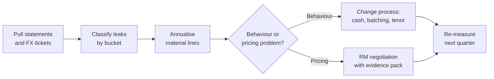

Most SME owners can quote their loan rate to one decimal place. Far fewer can quote their **effective cost of moving money**. Ledger fees, RTGS charges, cash deposit fees, LC amendment costs, guarantee commissions, and the quiet margin inside every USD/KES conversion do not feel dramatic on any single day. Over a year they compound into a second, invisible facility the business never approved.

This article is the negotiation playbook for that second facility. It sits beside [how banks make money](/blog/how-banks-actually-make-money-kenya) (the four engines) and [USD/KES hedging](/blog/usd-shilling-hedging) (how to lock rates). Here the focus is narrower and more tactical: **spot the leak, measure it, then renegotiate or redesign the behaviour that causes it**.

> **Key Insight:** Banks do not only earn from your loan. They earn from your **transactions and your FX**. A business that obsesses over 50 basis points on a term loan while ignoring a 1.5% all-in FX cost on monthly imports is optimising the wrong decimal place. Fee and spread control is credit management by another name.

```cards
- icon: Receipt
  title: Tariff literacy
  desc: Request the corporate tariff guide and map every recurring charge to a real process in your business.
  linkText: Banking structure
  linkUrl: /blog/ultimate-guide-to-banking-in-kenya
- icon: ArrowLeftRight
  title: FX anatomy
  desc: Separate interbank mid, bank buy/sell, and your effective rate including fees.
  linkText: Hedging guide
  linkUrl: /blog/usd-shilling-hedging
  type: amber
- icon: Handshake
  title: Negotiation leverage
  desc: Volume, multi-product wallet, and clean balances buy better tariffs than polite complaints.
  linkText: How banks earn
  linkUrl: /blog/how-banks-actually-make-money-kenya
  type: emerald
```

---

### Where the Money Actually Leaves

Think in four buckets. Most SMEs only monitor the first.

| Bucket | Examples | Why it hides |
|---|---|---|
| **Credit cost** | Interest, arrangement fees, insurance on facilities | Visible on offer letters |
| **Account and payment tariffs** | Ledger fees, EFT/RTGS, cash handling, statements, tokens | Many small lines |
| **Trade instrument fees** | LC issuance/amendment, collection, guarantee commission | Event-driven, forgotten between deals |
| **FX margin** | Spread on spot, forwards, and card FX | Embedded in the rate, not a separate invoice line |

[How banks actually make money](/blog/how-banks-actually-make-money-kenya) frames these as deliberate engines: interest spread, fees, FX, and trade. Your job as a customer is not to resent the model. It is to **stop subsidising it carelessly**.

---

### Reading a Corporate Tariff Guide

Ask your Relationship Manager for the **current corporate tariff guide** (or SME schedule) in writing. Verbal "it is standard" is not a control.

When you open it, do three things:

1. **Circle every charge you triggered in the last 90 days.** Ignore exotic lines you never use.
2. **Annualise the recurring ones.** A KES 2,500 monthly ledger fee is KES 30,000 a year before you move a shilling of value.
3. **Tag each charge as avoidable, negotiable, or structural.**
   - **Avoidable:** cash deposits you could digitise; duplicate statement fees; unnecessary RTGS when EFT would do.
   - **Negotiable:** FX spreads at volume; guarantee commission; bulk payment fees; account maintenance on multi-account setups.
   - **Structural:** statutory or truly fixed operational costs; still confirm they apply to your segment.

#### A Simple Annual Fee Map (Illustrative)

Figures below are **worked examples for teaching**, not any bank's live schedule. Replace them with your statement totals.

| Item | Monthly / per event | Est. annual | Avoidable? |
|---|---:|---:|---|
| Account maintenance (2 accounts) | KES 3,000 | KES 36,000 | Partly negotiable |
| Bulk salary / supplier EFT package | KES 8,000 | KES 96,000 | Negotiable at volume |
| RTGS (12 large payments) | KES 1,500 x 12 | KES 18,000 | Sometimes avoidable |
| Cash deposit fees | Varies | KES 40,000 | Often avoidable |
| Guarantee commission (average utilisation) | - | KES 120,000 | Negotiable / structure |
| FX spread cost on USD 200,000/year at 1.2% effective | - | ~KES 310,000 at 129.3 | Negotiable / hedge |
| **Directionally total "leak"** | | **~KES 620,000** | |

At that scale, the leak is the size of a junior hire or a meaningful marketing budget. It deserves a quarterly review the way facilities do.

---

### The Anatomy of a USD/KES Quote

Owners often compare "the rate the bank gave me" with "the rate on Google" and stop there. That comparison is incomplete.

Break every FX deal into layers:

1. **Market mid / interbank reference** (what professional screens roughly show).
2. **Bank bid/offer** (the rate at which the bank will buy or sell to you).
3. **Your side of the market** (are you buying USD to import, or selling USD export proceeds?).
4. **Any explicit commission or cable charge** added on top.
5. **Timing** (spot vs forward; value date).

#### Worked Table: Advertised Rate vs Effective Cost

Assume an importer needs **USD 50,000** and the public mid is **129.30**. These numbers are illustrative.

| Component | Rate / amount | Notes |
|---|---:|---|
| Public mid (USD/KES) | 129.30 | Reference only |
| Bank selling rate to client | 130.85 | Bank sells USD; client buys |
| Spread vs mid | 1.55 KES per USD | ~1.20% of mid |
| Gross KES paid | 6,542,500 | 50,000 x 130.85 |
| KES at mid | 6,465,000 | 50,000 x 129.30 |
| **Spread cost** | **KES 77,500** | Before any extra fees |
| Plus transfer / handling (example) | KES 5,000 | Check tariff |
| **All-in extra cost** | **KES 82,500** | What to track |

$$ \text{Effective spread \%} = \frac{\text{Client rate} - \text{Mid}}{\text{Mid}} \times 100 $$

In the example: \( (130.85 - 129.30) / 129.30 \approx 1.20\% \).

Do this for **every material FX month**. A business that imports USD 200,000 a year at a persistent 1.2% effective spread is paying roughly **USD 2,400 a year** (before other fees) for the privilege of not measuring.

#### Bid/Offer Depends on Your Direction

- **Importer buying USD:** you care about the bank's **offer** (how expensive USD is to you).
- **Exporter selling USD:** you care about the bank's **bid** (how little KES you receive per dollar).

Never let a salesperson quote "our USD rate" without specifying side and amount. Large tickets should be priced as tickets, not as retail card rates.

---

### Fee Audit: A 30-Day Process

Treat this like a mini internal audit.

#### Week 1: Extract

- Download 3 to 6 months of statements for every operating account.
- Export mobile and card settlement reports if you take digital payments.
- List trade instruments issued: LCs, collections, guarantees (see [bank guarantees](/blog/bank-guarantees-kenya-sme-guide) and [import finance](/blog/import-finance-kenya-guide)).

#### Week 2: Classify

Tag each debit:

- Interest and facility fees (credit bucket)
- Payment and account tariffs
- Cash and branch activity
- Trade and guarantee charges
- FX conversion differences (compare to mid on deal date)

#### Week 3: Diagnose Behaviour

Ask why the charge exists:

- Are you paying cash deposit fees because customers still pay cash?
- Are you using RTGS for amounts that could batch as EFT?
- Are guarantees open longer than the underlying contract needs?
- Are you converting FX in small daily drips at retail-like spreads?

#### Week 4: Negotiate or Redesign

- **Negotiate** where volume and relationship support it.
- **Redesign** where process is the problem (collections digitisation, payment batching, multi-currency accounts, forward cover for known exposures).



---

### How to Negotiate Without Bluffing

Banks price relationships, not isolated complaints. Bring a pack:

1. **Wallet summary:** deposits, facilities, trade turnover, FX volume, cards, salaries.
2. **Fee annualisation:** the table from your audit.
3. **Competitive context:** what another bank offered for a comparable wallet (honestly documented).
4. **Ask list:** three specific concessions ranked (for example: FX spread band at stated monthly USD volume; bulk payment package; guarantee commission).
5. **Give list:** what you can concentrate or automate (salary host, domiciliation, higher average balances).

#### What Usually Moves

| Lever | Why it works |
|---|---|
| **Concentrated FX volume** | Desk can price a band instead of retail tickets |
| **Multi-product wallet** | Fee concessions are cheaper for the bank than cutting loan yield alone |
| **Clean credit behaviour** | Low operational noise lowers servicing cost |
| **Term commitment** | Predictable flows justify portfolio pricing |
| **RM advocacy** | A prepared RM defends you in the same way they defend a credit file; see [why your RM matters](/blog/why-rm-is-sme-growth-asset) |

#### What Rarely Works

- Threatening to leave without a credible alternative ready
- Asking for "whatever you can do" with no numbers
- Comparing your SME ticket to a multinational's published headline rate
- Ignoring your own cash and branch behaviour while demanding retail-fee zeroing

---

### Structural Fixes Beyond Negotiation

Some leaks should not be negotiated forever; they should be designed out.

**1. Multi-currency accounts.** If you regularly earn or spend USD, holding and paying in USD can reduce round-tripping through KES. Pair with the hedging discipline in [USD/KES hedging](/blog/usd-shilling-hedging).

**2. Forwards for known exposures.** When an import invoice or export receipt date is known, a forward can convert rate gambling into a budgeted margin. Forwards have a cost; the point is margin certainty, not winning a currency bet.

**3. Payment architecture.** Batch suppliers, digitise collections, and reduce cash. Cash is expensive in fees, security, and reconciliation time.

**4. Trade instrument hygiene.** Open LCs and guarantees with realistic tenors; amendments and extensions are pure fee fuel. Import-side mechanics live in [import finance](/blog/import-finance-kenya-guide); export and broader trade context in [SME trade finance](/blog/sme-trade-finance).

**5. Facility design.** Do not fund long assets on expensive overdrafts "because the OD is convenient." Wrong product choice is a fee and interest leak at once; see [SME finance handbook](/blog/sme-finance-handbook-kenya).

---

### Risk Factors

- **Tariffs change.** Always re-read the schedule after segment changes or annual reviews.
- **FX mid is not a promise.** Mid is a reference; your executable rate includes bank inventory and risk.
- **Over-optimising payments can break controls.** Dual signatories and payment reviews exist for fraud reasons; do not delete control to save a fee.
- **Concentrating all banking for a 0.1% win** can create single-bank operational risk. Dual banking can still be rational.
- **This is education, not a tariff quote.** Your enforceable prices are in your bank's schedules and written variations.

---

### Decision Framework: Quarterly Treasury Hygiene

1. **Pull** three months of fees and all FX tickets above a materiality threshold (for example KES 500,000 equivalent).
2. **Rank** the top five cost lines by annualised KES impact.
3. **Label** each as avoidable, negotiable, or structural.
4. **Act** on at least one avoidable and one negotiable item before the next quarter ends.
5. **Write** FX rules: who can deal, minimum ticket for special pricing, when forwards are mandatory.
6. **Meet** the RM with a one-page wallet and ask list, not a venting session.
7. **Re-measure** the same five lines next quarter.

---

### Bengula View

The desk's view is blunt: many Kenyan SMEs run tight operating margins and loose treasury habits. They will fight for price with suppliers, then donate a percentage point to unexamined bank tariffs and FX spreads because those costs arrive as many small cuts rather than one frightening invoice.

We treat fee and FX leakage as **working-capital management**. Measure it, annualise it, and put it on the same agenda as stock turns and debtor days. Negotiate from wallet strength, not emotion. Redesign cash and conversion behaviour where the process is the villain. And keep the relationship adult: banks are entitled to earn; you are entitled to know the price and to shop the structure.

For the wider banking map, read [The Ultimate Guide to Banking in Kenya](/blog/ultimate-guide-to-banking-in-kenya). For credit pricing, read [how banks price loans](/blog/how-kenyan-banks-price-loans). For a structured review of facilities and tariffs together, use [services](/services) or [book a session](/contact).

---

### Sources and Further Reading

- [Central Bank of Kenya](https://www.centralbank.go.ke/): market indicators and banking sector context.
- Bengula Inc: [How Banks Actually Make Money](/blog/how-banks-actually-make-money-kenya), [Hedging USD/KES](/blog/usd-shilling-hedging), [Ultimate Guide to Banking in Kenya](/blog/ultimate-guide-to-banking-in-kenya), [Import Finance in Kenya](/blog/import-finance-kenya-guide), [Bank Guarantees for SMEs](/blog/bank-guarantees-kenya-sme-guide), [SME Finance Handbook](/blog/sme-finance-handbook-kenya), [Why Your RM Is a Growth Asset](/blog/why-rm-is-sme-growth-asset).

*General financial education, not a personalised banking, treasury, or FX advisory mandate. Tariff guides and executable FX rates are institution-specific and change; verify with your bank and consider professional advice for material exposures.*
