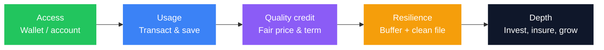
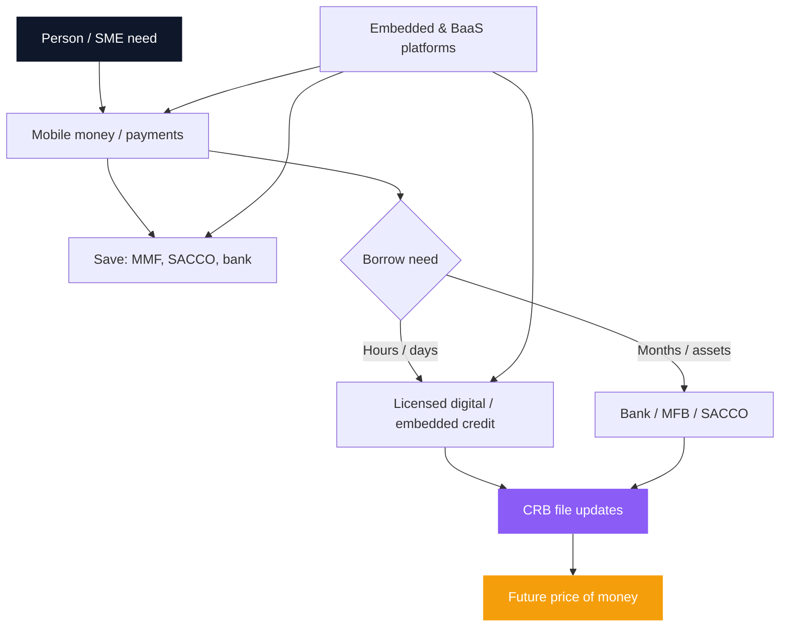

Kenya is the global reference market for **financial inclusion**. A generation ago, most adults lived outside formal finance. Today, mobile money penetration is measured in the high nineties of the adult population, formal access sits well above **80%**, and payments measured in **trillions of shillings** move over phone rails each year. That story is real—and incomplete.

Inclusion that stops at a wallet balance is only **access**. The harder questions are **use, quality, and cost**: Can you save without losing purchasing power? Can you borrow without destroying your CRB file? Can a SACCO build wealth without turning you into an unpaid guarantor? Can embedded credit at checkout help commerce without pricing like a permanent emergency?

This guide is the map of Kenya’s inclusion stack—from M-Pesa and microfinance banks through SACCOs, licensed digital credit providers (DCPs), CRB identity, and the new layer of [embedded finance](/blog/embedded-finance-kenya-guide) and [Banking-as-a-Service](/blog/banking-as-a-service-kenya-baas-guide). It ties together the deep dives already on this site so you can move from access to a **deliberate financial system**.

> **Key Insight:** Financial inclusion is not “having an account.” It is the ability to **move, store, borrow, insure, and invest** at costs and risks you can survive. Kenya has solved the first mile better than almost any country. The second mile is matching each need to the right rail—and refusing products whose APR and CRB footprint cost more than the problem they solve.

```cards
- icon: Smartphone
  title: Rails first
  desc: Mobile money and digital payments are the pipes. Most other inclusion products sit on top of them.
  linkText: Cashless economy
  linkUrl: /blog/what-is-a-cashless-economy
- icon: Landmark
  title: Institutions second
  desc: Banks, MFBs, SACCOs, and licensed DCPs each do different jobs at different prices and risks.
  linkText: Banking structure
  linkUrl: /blog/ultimate-guide-to-banking-in-kenya
  type: amber
- icon: ShieldCheck
  title: Identity third
  desc: Your CRB file is the passport that prices every regulated loan. Manage it like an asset.
  linkText: Credit score guide
  linkUrl: /blog/credit-score-kenya-guide
  type: emerald
```

---

## Key Takeaways

1. **Kenya’s inclusion miracle is payment-led.** M-Pesa and mobile money created identity, float, and transaction history before most people had a branch relationship.
2. **Access ≠ affordability.** Digital credit can be available in two minutes and cost triple-digit effective annual rates. Convert every short fee to [APR/EAR](/blog/mobile-digital-loans-real-cost-kenya) before you compare.
3. **SACCOs remain a savings-and-credit powerhouse**—and a guarantor risk machine if you do not understand co-obligation ([SACCO guide](/blog/sacco-savers-guarantors)).
4. **Microfinance and bank SME credit** serve longer-tenor, relationship-based needs that apps are not designed to underwrite well.
5. **CRB is the bridge.** Positive and negative data from banks, SACCOs, MFBs, and licensed DCPs now feed one pricing system ([score](/blog/credit-score-kenya-guide), [fix](/blog/how-to-fix-your-crb-listing-kenya)).
6. **Embedded finance is inclusion’s next chapter**—credit, insurance, and savings inside platforms people already use ([embedded finance](/blog/embedded-finance-kenya-guide)).
7. **Depth beats novelty.** An emergency fund, clean CRB, and one cheap long facility beat five maxed apps.

---

### How This Guide Is Organised

| Part | Question it answers |
|---|---|
| 1. What inclusion means | Access, usage, quality, welfare |
| 2. The Kenya stack | Who regulates what, and who serves whom |
| 3. Mobile money rails | Why payments came first |
| 4. Microfinance | When MFBs and group models fit |
| 5. SACCOs | Save, borrow, guarantee—with eyes open |
| 6. Mobile & digital credit | Real cost, CRB mechanics, when speed is worth it |
| 7. Credit identity | Building a file that lowers future rates |
| 8. Embedded finance & BaaS | Products at the point of need |
| 9. A practical inclusion ladder | What to do in order |
| 10. Library map | Links into deeper Bengula articles |

---

## Part 1: What Financial Inclusion Actually Means

Global frameworks (World Bank, AFI, and others) increasingly distinguish four layers:

| Layer | Meaning in plain Kenya |
|---|---|
| **Access** | Can you open a wallet, account, or membership? |
| **Usage** | Do you actually transact, save, or borrow regularly? |
| **Quality** | Are products suitable, transparent, and fair? |
| **Welfare** | Does the product improve resilience—or create distress? |

Kenya scores exceptionally on **access and usage of payments**. Scores are more mixed on **quality of credit** and **welfare outcomes** when expensive short-term debt funds consumption, school fees, or business stock month after month.

A useful personal definition:

$$
\text{Useful inclusion} = \text{Right product} \times \text{Survivable cost} \times \text{Manageable risk}
$$

If any factor is zero—wrong product, ruinous cost, or unmanageable CRB/guarantor risk—the “inclusion” is theatre.



---

## Part 2: The Kenya Inclusion Stack

Think in **layers**, not logos.

| Layer | Examples | Primary job | Main regulator / perimeter |
|---|---|---|---|
| **Payments & stores of value** | M-Pesa, Airtel Money, bank wallets | Move and hold small balances | CBK (payment systems, e-money) |
| **Deposit-taking banks** | Commercial banks, some digital banks | Full banking, larger credit, treasury | CBK; deposits under **KDIC** (limits apply) |
| **Microfinance banks** | Licensed MFBs | Smaller tickets, group/individual microcredit | CBK (microfinance banks) |
| **SACCOs** | Deposit-taking & non-DT societies | Member savings, check-off credit, guarantees | **SASRA** (regulated SACCOs); co-op law more broadly |
| **Digital credit providers** | Licensed DCPs / app lenders | Fast, small, data-scored credit | **CBK DCP** licensing regime |
| **Capital markets / CIS** | MMFs, unit trusts | Liquid yield and investment | **CMA** |
| **Insurance & pensions** | Micro-insurance, NSSF, IPPs | Protection and long-term saving | IRA / RBA / NSSF frameworks |
| **Platform layer** | E-commerce, agri apps, POS | [Embedded](/blog/embedded-finance-kenya-guide) products | Mix of partners’ licences |

For enterprise banking structure—tiers, account opening, multi-bank design—use the [Ultimate Guide to Banking in Kenya](/blog/ultimate-guide-to-banking-in-kenya). For household wealth tools beyond inclusion credit, use the [personal finance guide](/blog/ultimate-guide-to-personal-finance-kenya).

```cards
- icon: Building2
  title: Banks & MFBs
  desc: Relationship credit, asset finance, trade tools, and insured deposits (within KDIC limits).
  linkText: Banking guide
  linkUrl: /blog/ultimate-guide-to-banking-in-kenya
- icon: Users
  title: SACCOs
  desc: Member ownership, dividends, and loan multipliers—plus guarantor exposure you must price.
  linkText: Savers & guarantors
  linkUrl: /blog/sacco-savers-guarantors
  type: amber
- icon: Zap
  title: Digital credit
  desc: Speed with a price. Licensed DCPs now sit inside CRB reporting—habits matter.
  linkText: Real cost of digital loans
  linkUrl: /blog/mobile-digital-loans-real-cost-kenya
  type: emerald
```

---

## Part 3: Mobile Money—The Foundation Rail

Kenya did not bank the unbanked primarily through branches. It **walleted** them.

### Why payments came first

- SIM and agent networks reached where branches did not  
- KYC scaled through mobile registration and evolving regulation  
- Float and transaction trails created **data** that later powered credit  
- Everyday use (school fees, matatu, merchants, salaries) made the rail sticky  

Indicators cited across our fintech writing (mid-2025 / 2026 framing) include mobile money penetration near **91%**, tens of millions of active subscriptions, and multi-trillion-shilling annual transaction value. Agent cash volumes have even fallen in periods as people **complete payments digitally** rather than cash-out first—see [What Is a Cashless Economy](/blog/what-is-a-cashless-economy).

### What a wallet is good at

- P2P and merchant payments  
- Bill pay and airtime  
- Holding small operational balances  
- Gateway into savings products (lock boxes, MMFs via partners) and credit (Fuliza-style overdrafts, M-Shwari-style products)

### What a wallet is not

- A full substitute for a business bank account when you need credit files and trade finance  
- Deposit insurance identical to a bank current account (product and partner structure matter)  
- A licence to ignore fees on cash-in/cash-out and merchant tariffs  

**Inclusion move:** use mobile money as the **transaction layer**; park surplus emergency cash in a regulated [MMF or appropriate savings vehicle](/blog/bank-vs-sacco-vs-mmf-savings); open a bank or SACCO relationship when credit size and tenor outgrow the app.

---

## Part 4: Microfinance—Credit for Thin Files and Small Tickets

**Microfinance banks (MFBs)** and microfinance programmes exist for borrowers and micro-enterprises that traditional banks historically under-served: thin formal income proof, small ticket sizes, group methodologies, or high-touch collection models.

### When microfinance fits

- First formal loan after only mobile history  
- Micro-enterprise stock or tools with short cash cycles  
- Group or chamas-adjacent discipline (where still used)  
- Stepping stone toward bank SME facilities once records exist  

### When it does not

- Funding a multi-year asset that needs [asset finance](/blog/asset-finance-vs-conventional-loans)  
- Papering over a broken [working capital cycle](/blog/working-capital-cycle-kenya-smes) without fixing collections  
- Competing with a SACCO check-off loan that is clearly cheaper after full cost comparison  

### How to evaluate an MFB product

| Check | Why |
|---|---|
| Licence status | Regulated MFB vs informal lender |
| All-in cost | Interest + fees + compulsory savings + insurance add-ons |
| Tenor vs cash cycle | Match repayment to when the business generates cash |
| Collateral / guarantors | Group pressure is real social risk |
| CRB reporting | Building a positive file is part of the value |

Microfinance is **inclusion infrastructure**. It is not automatically “cheap.” Price it with the same honesty as digital loans and bank facilities ([how banks price loans](/blog/how-kenyan-banks-price-loans)).

---

## Part 5: SACCOs—Member Finance at Scale

SACCOs are one of Kenya’s most important inclusion and wealth institutions. SASRA-regulated societies hold **trillion-shilling** asset bases and hundreds of billions in member deposits—systemic scale, not a side niche ([SACCO deep dive](/blog/sacco-savers-guarantors)).

### Why SACCOs still win for savers

- **Member ownership**—surpluses can return as dividends and interest on deposits  
- **Forced discipline**—monthly contributions build capital  
- **Credit access**—deposits often unlock loans at multiples of savings (classically around **3×**, rules vary)  
- **Check-off** convenience for salaried members  
- Channel into products like [KMRC-backed home loans](/blog/kmrc-affordable-housing-mortgage) via participating SACCOs  

### The guarantor problem

The same model that expands access transfers risk to members who never borrowed. A guarantorship is a **legal co-obligation**: if the borrower defaults, recovery can reach your deposits and income. In a rising-default or governance-stress environment, the saver who signs casually is the unprotected creditor.

**Inclusion rule:** treat every guarantee like a loan you might have to pay. Cap how many you sign; know the borrower; read the form.

### Governance and regulatory overhaul

Post-**KUSCCO** losses and reform debates (membership thresholds, mergers of small societies, deposit guarantee operationalisation, stricter licensing) mean members should prefer **transparent, SASRA-compliant, well-capitalised** societies—and not assume every “SACCO” brand is equal. The full risk and reform picture is in [Safe for Savers, Risky for Guarantors](/blog/sacco-savers-guarantors).

### SACCO vs bank vs MMF (job map)

| Job | Prefer |
|---|---|
| Daily payments | Mobile money / bank |
| Liquid emergency yield | [MMF](/blog/future-mmfs-kenya) |
| Member credit + dividends | SACCO (if governance is sound) |
| Large structured credit / trade | Commercial bank |
| Fast tiny emergency | Digital loan—only if APR is acceptable for days, not months |

---

## Part 6: Mobile and Digital Lending—Inclusion’s Double Edge

No product expanded **credit inclusion** faster than the phone loan. None has taught harsher lessons about **price and behaviour**.

### How digital loans are sold vs how they cost

Apps quote a small **fee per short period** (14 or 30 days). Households hear “9%” and compare it to a bank’s “18% a year.” That comparison is false.

$$
\text{EAR} = (1 + r)^{n} - 1
$$

Where \(r\) is the fee rate per period and \(n\) is periods per year. A **9% monthly** fee compounds to roughly **181% EAR** if rolled all year—the worked example in [Mobile and Digital Loans: The Real Cost](/blog/mobile-digital-loans-real-cost-kenya). Bank personal loans often sit nearer **teens to low twenties** annual; secured facilities can be lower still.

**Inclusion that impoverishes** is still exclusion by another name.

### CRB mechanics most app users miss

Licensed digital credit now feeds the **same credit-information system** as banks. Damage paths include:

1. **Enquiry velocity**—shopping five apps in a week looks like distress  
2. **High utilisation** on revolving limits (e.g. overdraft-style products)—models dislike living at 90%+ of limit  
3. **Short-tenor lates**—a three-day late on a 14-day loan is still a late  
4. **Debt stacking**—App B pays App A; the file shows multiple concurrent lenders  

Full mechanics: [mobile loan cost article](/blog/mobile-digital-loans-real-cost-kenya) and [credit score guide](/blog/credit-score-kenya-guide).

### When fast credit is rational

- True emergency, **repaid within one cycle** from a known inflow  
- Bridging a **documented** receivable or salary date—not lifestyle  
- No cheaper SACCO/bank option available **in time**  
- You have calculated EAR and accepted it consciously  

### When it is a trap

- Rolling the same balance for months  
- Funding business stock that needs a 60-day cycle on a 14-day loan  
- App-hopping to protect pride instead of restructuring  
- Ignoring the CRB cost to a future mortgage or SME facility  

```cards
- icon: Calculator
  title: Annualise every fee
  desc: A single-digit monthly charge is often a triple-digit lifestyle APR. Do the EAR maths before you tap Accept.
  linkText: Digital loan guide
  linkUrl: /blog/mobile-digital-loans-real-cost-kenya
- icon: Search
  title: Stop enquiry spam
  desc: Limit hard pulls. Check your own CRB on a planned schedule instead of testing five apps.
  linkText: Fix your CRB
  linkUrl: /blog/how-to-fix-your-crb-listing-kenya
  type: amber
- icon: Replace
  title: Graduate the debt
  desc: Move repeated needs to SACCO check-off, bank term loans, or fixed working-capital lines.
  linkText: Borrowing map
  linkUrl: /blog/borrowing-money-in-kenya-guide
  type: emerald
```

---

## Part 7: CRB—The Inclusion Passport

You cannot talk seriously about inclusion in 2026 without **credit information sharing**.

### Who holds the file

Three CBK-licensed bureaus—**TransUnion, Metropol, and Creditinfo**—receive data from banks, microfinance banks, participating SACCOs, and **licensed digital credit providers**. The file holds positive and negative history: accounts, limits, payment behaviour, defaults, enquiries. It does **not** store your salary or your MMF balance.

### The blacklist myth

There is no permanent mystical ban list. There is a **history** that lenders convert into **probability and price** under risk-based pricing. Settling a default **updates** the story; it does not always erase the scar immediately. Details and dispute steps: [How to Fix Your CRB Listing](/blog/how-to-fix-your-crb-listing-kenya) and [Your Credit Score in Kenya](/blog/credit-score-kenya-guide).

### Building a file that includes you into *cheaper* credit

| Behaviour | Effect |
|---|---|
| On-time payments on few facilities | Strengthens file |
| Thin file (no credit history) | Can also raise price—no data is not always “clean” |
| Many small digital lates | Damages more than people expect |
| Settled old defaults + new clean conduct | Gradual repair narrative |
| Annual free report + error disputes | Stops wrong data from taxing you |

**Strategic inclusion:** use a **small, cheap, well-serviced** formal facility (or clean digital credit repaid perfectly) to build history—then stop using expensive channels as a lifestyle.

---

## Part 8: Fintech Innovations—Embedded Finance and BaaS

### Embedded finance

[Embedded finance](/blog/embedded-finance-kenya-guide) puts payments, credit, insurance, or investment **inside** a non-bank journey: checkout BNPL, agri input credit, POS merchant advances, micro-insurance with a purchase. Kenya’s reference pattern is telco + bank partnerships (the M-Shwari archetype): **bank balance sheet and licence** behind a **ubiquitous interface**.

For consumers and SMEs, the opportunity is **context**—credit when you buy stock, not after a branch appointment. The risk is **opacity**—forgetting that embedded credit is still credit, with CRB and APR consequences.

### Banking-as-a-Service (BaaS)

[BaaS](/blog/banking-as-a-service-kenya-baas-guide) is the plumbing: licensed banks expose APIs so fintechs, SACCOs, and platforms can offer branded deposits, payments, or credit without holding a full banking licence themselves. CBK’s DCP perimeter, sandbox activity, and renewed interest in digital banking models all sit in this evolution.

**Inclusion implication:** more products will appear **outside** bank branches. Your job is still to ask: Who is the licensed principal? What is the all-in cost? How is data and CRB handled?

### AI and underwriting

[AI in fintech](/blog/role-of-ai-in-fintech-kenya) accelerates scoring on alternative data (wallet behaviour, merchant tills, supply-chain signals). That can **include** thin-file borrowers. It can also **scale** high-cost credit efficiently. Regulation and personal discipline remain the seatbelts.

### Trends layer

For the broader product landscape, see [Top Fintech Trends 2026](/blog/top-fintech-trends-2026). For Islamic and alternative structures that expand who feels “served,” see [Islamic banking in Kenya](/blog/islamic-banking-kenya-murabaha-musharaka-hajj-savings). For green and impact-tilted credit, [green financing](/blog/green-financing-kenya).



---

## Part 9: The Practical Inclusion Ladder

Use this as a sequence, not a shopping list.

### Level 0 — Identity and rails

- National ID / KYC in order  
- Active mobile money on a SIM you control  
- Basic fraud hygiene (PIN, SIM-swap awareness)

### Level 1 — Transaction and buffer

- Separate personal vs business money if you trade  
- Emergency fund of 1–3 months essentials (grow to 3–6) in liquid form ([MMF vs bank vs SACCO](/blog/bank-vs-sacco-vs-mmf-savings))  
- Stop funding shocks exclusively with digital loans  

### Level 2 — Clean credit identity

- Pull CRB reports (start with the bureau your banks use; verify others)  
- Dispute errors; settle genuine arrears with proof of update  
- Limit simultaneous apps  

### Level 3 — Cheap structural credit

- SACCO membership **for saving first**, borrowing second; guarantor policy written for yourself  
- Bank relationship with salary or business account conduct  
- Replace rolled digital debt with one consolidation path if maths work ([debt consolidation](/blog/debt-consolidation-refinancing-kenya))  

### Level 4 — Depth

- [Insurance stack](/blog/insurance-stack-kenya-life-stages) so shocks do not force app debt  
- [Pension / NSSF / IPP](/blog/nssf-tier-ii-vs-private-pension-kenya) for long-term inclusion into retirement income  
- [Unit trusts beyond MMFs](/blog/unit-trusts-beyond-mmfs-kenya) and [bonds](/blog/kb-bond-guide-2026) when the buffer is solid  
- Business users: [SME handbook](/blog/sme-finance-handbook-kenya), [working capital](/blog/working-capital-cycle-kenya-smes), [trade finance](/blog/sme-trade-finance)

### Level 5 — Platform-native finance (optional)

- Use embedded credit **only** when the APR and CRB effect beat alternatives  
- Prefer platforms that disclose licensed partners clearly  
- Never confuse “approved in 30 seconds” with “good decision”

```cards
- icon: Footprints
  title: Climb in order
  desc: Rails → buffer → CRB → cheap structure → depth. Skipping to apps at Level 0 is how inclusion reverses.
  linkText: Personal finance system
  linkUrl: /blog/ultimate-guide-to-personal-finance-kenya
- icon: HeartPulse
  title: Protect the climb
  desc: One medical bill without cover undoes years of clean credit behaviour.
  linkText: Insurance stack
  linkUrl: /blog/insurance-stack-kenya-life-stages
  type: amber
- icon: LineChart
  title: Then grow
  desc: After expensive debt is gone, invest with horizon discipline—not with borrowed app money.
  linkText: Investing guide
  linkUrl: /blog/ultimate-guide-to-investing-in-kenya
  type: emerald
```

---

## Part 10: Decision Tables You Can Reuse

### Which channel for which need?

| Need | First choice | Last resort |
|---|---|---|
| Send/receive money | Mobile money / bank transfer | Cash courier |
| Emergency 7-day gap | Own buffer; then cheapest short facility | Rolled multi-app debt |
| School fees over months | SACCO/bank scheduled loan; savings plan | 14-day digital loans stacked |
| Business stock cycle | WC line / LPO / supplier credit | Personal digital loans |
| Asset (bike, fridge, machine) | [Asset finance](/blog/asset-finance-vs-conventional-loans) | Short digital credit |
| Home (eligible) | [KMRC path](/blog/mortgage-decision-framework-kenya) | Unsecured high-rate debt |
| Build credit history | One small formal loan, perfect conduct | Five concurrent apps |

### Cost hierarchy (typical, not a quote)

$$
\text{Usually: digital short credit} \gg \text{unsecured bank personal} > \text{SACCO / secured / asset} 
$$

Always verify **your** offer letter. Hierarchy is a prior, not a law.

---

## Part 11: Risks That Travel With Inclusion

1. **Over-indebtedness**—many small limits summing to unsustainable  
2. **Data and privacy**—alternative data underwriting cuts both ways  
3. **Agent and social engineering fraud**—inclusion expands attack surface  
4. **Governance risk in co-ops and MFIs**—your savings are only as safe as institutions  
5. **Policy and rate cycles**—cost of formal credit moves with [CBR](/blog/cbr-cycle-portfolio-positioning-kenya) and risk premia  
6. **Illusion of free**—“zero interest” promotions with fees, data, or lock-in  

---

## Part 12: Library Map—Read Deeper by Topic

| Topic | Article |
|---|---|
| Banking structure & accounts | [Ultimate Guide to Banking](/blog/ultimate-guide-to-banking-in-kenya) |
| Cashless / mobile money economy | [What Is a Cashless Economy](/blog/what-is-a-cashless-economy) |
| Digital loan APR & CRB habits | [Mobile & Digital Loans Real Cost](/blog/mobile-digital-loans-real-cost-kenya) |
| CRB repair | [Fix Your CRB Listing](/blog/how-to-fix-your-crb-listing-kenya) |
| Score building | [Credit Score Guide](/blog/credit-score-kenya-guide) |
| SACCO save / guarantee | [Savers & Guarantors](/blog/sacco-savers-guarantors) |
| Borrowing landscape | [Borrowing Money in Kenya](/blog/borrowing-money-in-kenya-guide) |
| Embedded products | [Embedded Finance](/blog/embedded-finance-kenya-guide) |
| Bank APIs / partners | [BaaS Guide](/blog/banking-as-a-service-kenya-baas-guide) |
| AI underwriting | [AI in Fintech](/blog/role-of-ai-in-fintech-kenya) |
| Fintech landscape | [Trends 2026](/blog/top-fintech-trends-2026) |
| Save vs park money | [Bank vs SACCO vs MMF](/blog/bank-vs-sacco-vs-mmf-savings) |
| Household system | [Personal Finance Guide](/blog/ultimate-guide-to-personal-finance-kenya) |
| SME facilities | [SME Finance Handbook](/blog/sme-finance-handbook-kenya) |

---

## Closing: From Access to Agency

Kenya proved that **inclusion at population scale** is possible when rails meet real daily life. The next decade of progress will not be measured only by how many wallets exist. It will be measured by how many households and SMEs can:

- Absorb a shock without permanent high-APR debt  
- Show a CRB file that **lowers** the cost of capital  
- Use SACCOs and banks as **wealth engines**, not only as ATMs for stress  
- Adopt embedded and fintech products as **tools**, not as default lifestyles  

That is financial inclusion with **agency**: the power to choose the right layer of the stack for the job, and to walk away from the wrong one even when it is one tap away.

If you want help designing a personal or business stack—buffer placement, CRB repair sequencing, SACCO vs bank credit, or SME facilities that replace app debt—explore [services](/services) or [book a session](/contact). The goal is not more products. It is a system where inclusion compounds into resilience and optionality, not into a faster path to the same tight month.
