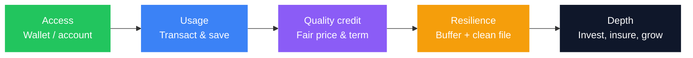
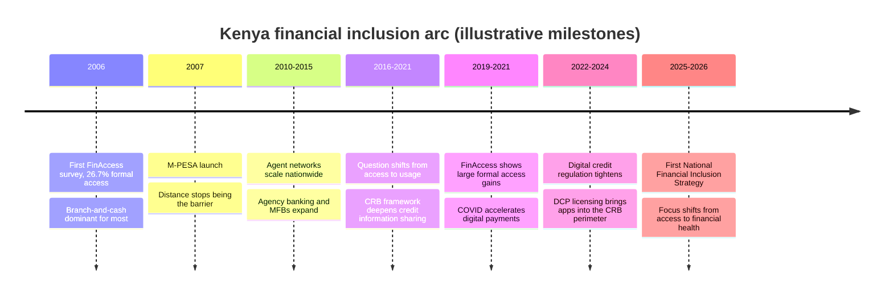
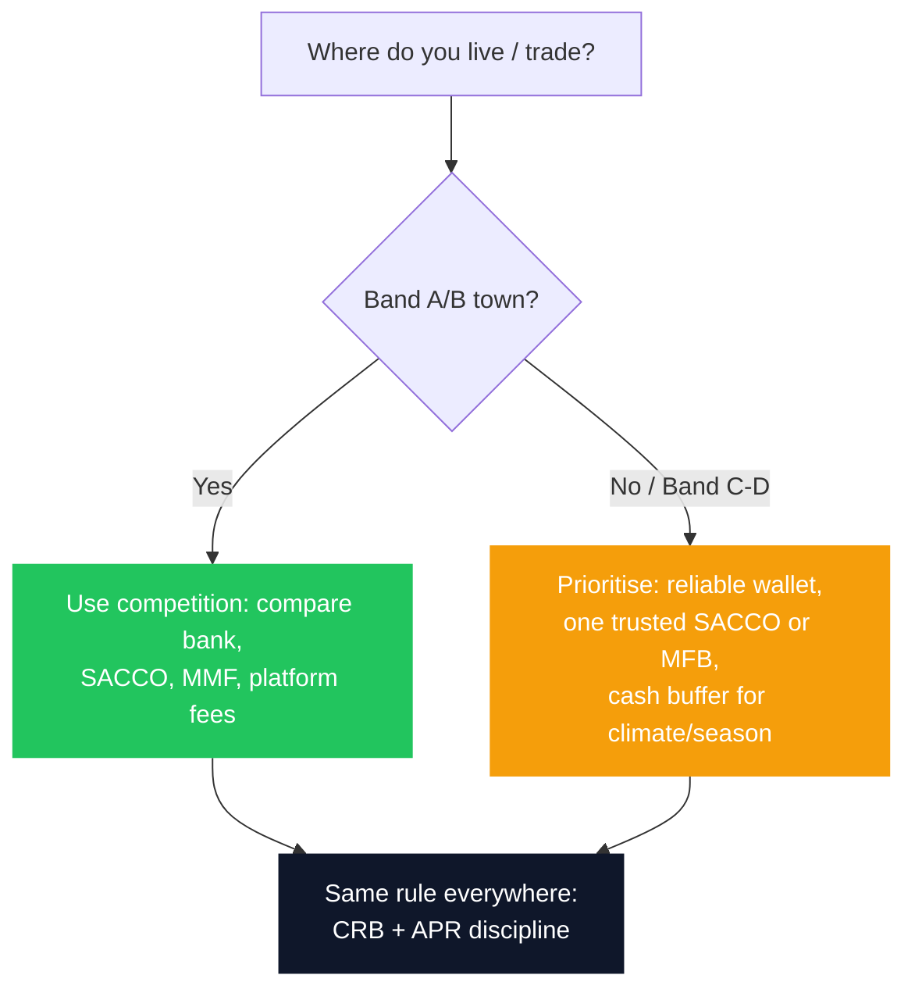
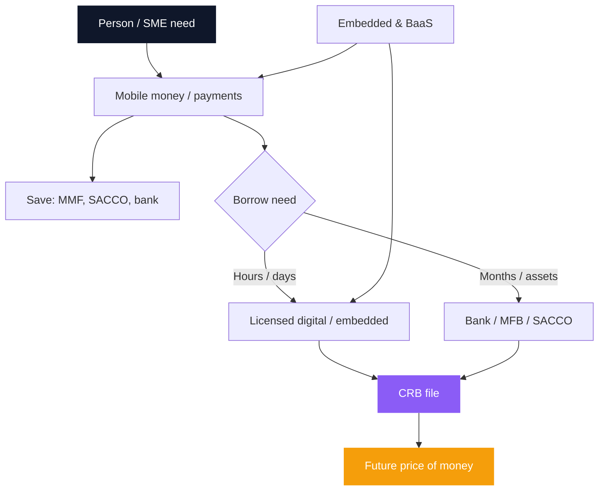

Kenya is the global reference market for **financial inclusion**. In roughly two decades the country moved from a branch-and-cash story to mobile money at population scale, formal access for the large majority of adults, and a dense web of SACCOs, microfinance banks, licensed digital credit, unit trusts, pensions, insurers, and embedded products inside everyday apps.

The headline number is extraordinary. Formal financial access rose from **26.7% of adults in 2006 to 84.8% in 2024**, while outright exclusion fell from roughly 41% to **7.2%**. Few countries have moved that far, that fast.

The second number is the reason this guide exists. Only **18.3%** of Kenyan adults are classified as **financially healthy**. Only **33.2%** save regularly for emergencies. Only **24.5%** could raise emergency cash within three days. A country can put a wallet in almost every hand and still leave most of those hands one bad month from crisis.

That gap is exactly what Kenya's first **National Financial Inclusion Strategy (2025-2028)** is built to close. It moves the national scorecard from *access* to *financial health*: can a household absorb a shock, insure against catastrophe, invest for growth, and retire without depending on relatives.

This guide combines the whole stack into one operating manual: the policy story and the personal system. It pulls together mobile money and the [cashless economy](/blog/what-is-a-cashless-economy), [banking structure](/blog/ultimate-guide-to-banking-in-kenya), [SACCOs](/blog/sacco-savers-guarantors), [digital loan cost](/blog/mobile-digital-loans-real-cost-kenya), [APR vs real cost](/blog/mobile-loan-vs-bank-loan-apr-breakdown), [CRB](/blog/credit-score-kenya-guide), [embedded finance](/blog/embedded-finance-kenya-guide), [BaaS](/blog/banking-as-a-service-kenya-baas-guide), [MMFs](/blog/future-mmfs-kenya), and household systems from the [personal finance](/blog/ultimate-guide-to-personal-finance-kenya) and [investing](/blog/ultimate-guide-to-investing-in-kenya) guides, so you can move from "I have an account" to "I run a system."

> **Key Insight:** Financial inclusion is not "having an account." It is the ability to **move, store, borrow, insure, and invest** at costs and risks you can survive. Kenya solved the first mile better than almost any country. The second mile is matching each need to the right rail, and refusing products whose APR and CRB footprint cost more than the problem they solve.

```cards
- icon: Map
  title: See where you stand
  desc: County patterns and a 2006-2026 timeline show how uneven, and how fast, inclusion still is.
  linkText: Jump to score tool
  linkUrl: "#financial-inclusion-score"
- icon: Layers
  title: Match the product
  desc: Banks, SACCOs, MMFs, wallets, and investment platforms do different jobs. Placement beats brand loyalty.
  linkText: Comparison table
  linkUrl: "#product-comparison"
  type: amber
- icon: ListChecks
  title: Act by life stage
  desc: Checklists for households, SMEs, farmers, students, and retirees turn the map into next steps.
  linkText: Practical checklists
  linkUrl: "#checklists"
  type: emerald
```

---

## Key Takeaways

1. **Kenya's inclusion miracle is payment-led.** M-PESA (2007 onward) created identity, float, and transaction history before most people had a branch relationship.
2. **Access is no longer the metric.** 84.8% formal access, but only 18.3% financially healthy. The NFIS 2025-2028 measures resilience, insurance, investing, and retirement readiness instead.
3. **Access is not affordability.** Digital credit can land in two minutes and cost triple-digit [effective annual rates](/blog/mobile-digital-loans-real-cost-kenya). Always convert fees using [APR discipline](/blog/mobile-loan-vs-bank-loan-apr-breakdown).
4. **Geography still matters.** Nairobi and major urban counties sit deeper in formal finance than many ASAL counties. Design products and habits for where you actually live.
5. **SACCOs remain a savings-and-credit powerhouse.** 3.3 million adult members and over KSh 1.21 trillion in regulated assets, and a guarantor risk machine if you sign casually ([SACCO guide](/blog/sacco-savers-guarantors)).
6. **Insurance and pensions are the most under-built pillars.** Penetration remains low against GDP; pension assets reached roughly **KSh 2.81 trillion** by end-2025, but informal-sector coverage lags badly.
7. **CRB is the passport.** Banks, SACCOs, MFBs, and licensed DCPs feed one pricing system ([score](/blog/credit-score-kenya-guide), [fix](/blog/how-to-fix-your-crb-listing-kenya)).
8. **Literacy is the binding constraint.** Roughly 42% of adults are considered highly financially literate. Access without literacy converts into fraud exposure and bad debt, not resilience.
9. **Depth beats novelty.** An [emergency fund](/blog/bank-vs-sacco-vs-mmf-savings), clean CRB, and one cheap long facility beat five maxed apps.
10. **Score yourself, then climb.** Use the interactive tool below, then follow the checklist for your role.

---

### How This Guide Is Organised

| Part | What You Get |
|---|---|
| 1 | What inclusion means (access to welfare) |
| 2 | The journey: 1900s post office to 2026 |
| 3 | Access vs financial health, and the NFIS scorecard |
| 4 | County-by-county inclusion map (patterns) |
| 5 | Product comparison: banks, SACCOs, MMFs, wallets, platforms |
| 6 | Interactive Financial Inclusion Score |
| 7 | The credit stack: MFBs, SACCOs, digital credit, CRB, embedded finance |
| 8 | Insurance inclusion |
| 9 | Pension inclusion |
| 10 | Investment inclusion |
| 11 | Literacy and consumer protection |
| 12 | Targeted inclusion: women, youth, MSMEs, counties |
| 13 | Case studies across income levels |
| 14 | Checklists: household, SME, farmer, student, retiree |
| 15 | The next layer: DPI, Open Finance, AI, green finance |
| 16 | Full library of linked deep dives |

---

## Part 1: What Financial Inclusion Actually Means

| Layer | Meaning in Plain Kenya |
|---|---|
| **Access** | Can you open a wallet, account, or membership? |
| **Usage** | Do you actually transact, save, or borrow regularly? |
| **Quality** | Are products suitable, transparent, and fairly priced? |
| **Welfare** | Does the product improve resilience, or create distress? |

Kenya scores exceptionally on **access and payment usage**. Outcomes are more mixed on **quality of credit** when expensive short-term debt funds consumption, school fees, or business stock every month.

$$
\text{Useful inclusion} = \text{Right product} \times \text{Survivable cost} \times \text{Manageable risk}
$$

If any factor is zero, "inclusion" is theatre.



The NFIS pushes the definition further. A financially included citizen should be able to save safely, borrow responsibly, invest confidently, insure against major risks, plan for retirement, pay digitally and securely, and do all of it without discrimination or unnecessary barriers. Inclusion is **participation in the formal economy**, not ownership of accounts.

---

## Part 2: The Journey, From Postal Counters to 2026

### 2.1 Before Mobile Money: The Post Office Was Kenya's First Financial Network

Kenya's inclusion story is usually told as "M-PESA happened in 2007." The fuller version starts much earlier. Long before smartphones or agency banking, the **Postal Corporation of Kenya** and its predecessors connected communities through a nationwide network of post offices that carried domestic and international money orders, government payments, bill collections, cash disbursements, and postal savings through the Kenya Post Office Savings Bank (today's Postbank).

Because post offices reached remote towns long before most commercial banks did, they became one of Kenya's earliest channels for formal financial access outside major urban centres. Posta still operates **more than 600 outlets nationwide**, one of the country's most extensive physical service networks.

Its digital successor, **PostaPay**, matters for a specific reason: it is a **telco-agnostic wallet**. Users can register on any major mobile network, and the platform is interoperable with banks and other mobile money providers. It supports person-to-person transfers, business collections and bulk payments, utility bills, government collections and disbursements, agency banking, standing orders, sub-wallets for budgeting, and escrow. Where M-PESA revolutionised person-to-person payments, PostaPay reflects the interoperability phase.

### 2.2 The Arc, 2006 to 2026



| Period | What Changed | Inclusion Effect |
|---|---|---|
| **Pre-2006** | Cash, chamas, ROSCAs, village lenders, cooperatives, postal savings | Formal finance concentrated in towns |
| **2006** | First **FinAccess Household Survey** | Inclusion measured from the household, not the bank ledger |
| **2007** | **M-PESA** launches | Payments and remittances without a branch |
| **2008-2012** | Agent networks, person-to-merchant growth | Rural and informal inclusion via SIM and agent |
| **2010-2015** | Agency banking, deposit-taking MFBs, bank-telco partnerships (M-Shwari archetype) | Credit and savings on the phone |
| **2010s** | SACCO growth under **SASRA**; deposit-taking scale | Member credit and dividends at national scale |
| **Mid-2010s** | Stronger **CRB** use in lending | History begins to price risk, and to punish forgotten micro-defaults |
| **2016-2021** | Policy question moves from access to usage | Savings, insurance, retirement, capability enter the frame |
| **2020-2021** | Pandemic digital shift | Higher usage of mobile rails; stress on small borrowers |
| **2021-2026** | Super apps: M-PESA Super App, Mini Apps, **My OneApp** | Payments, credit, savings, and lifestyle in one gateway |
| **2022-2025** | **Licensed digital credit providers (DCPs)** under CBK | Apps inside the regulated perimeter and reporting to CRBs |
| **2025-2028** | **National Financial Inclusion Strategy** | Health, not headcount |

### 2.3 The Two Numbers That Define The Next Decade

| Indicator | 2006 | 2024 |
|---|---|---|
| Formal financial access | 26.7% | **84.8%** |
| Financial exclusion | ~41% | **7.2%** |
| Financially healthy adults | N/A | **18.3%** |
| Adults saving for emergencies | N/A | **33.2%** |
| Adults able to raise emergency cash in three days | N/A | **24.5%** |

The first three rows are a success story. The last three are a warning. For the payment layer today, see [What Is a Cashless Economy](/blog/what-is-a-cashless-economy). For platform plumbing, see [BaaS](/blog/banking-as-a-service-kenya-baas-guide) and [embedded finance](/blog/embedded-finance-kenya-guide).

---

## Part 3: Access vs Financial Health

Two Kenyans can each hold a bank account, an M-PESA wallet, and access to digital credit. Statistically, both are "included." Only one of them has an emergency fund, medical cover, a pension contribution, and a diversified portfolio. Only one of them is financially healthy.

$$
\text{Financial health} = \text{Access} \times \text{Usage} \times \text{Resilience} \times \text{Long-term security}
$$

If any factor is missing, the household remains exposed. A wallet with no buffer behind it is still one hospital bill from a crisis. The NFIS defines a financially healthy person as one who can meet daily obligations, absorb shocks, plan for future goals, build long-term wealth, and feel confident about their financial future. Ten accounts do not improve financial health if none of them contributes to security.

**Where Kenya leads:** mobile-first payments infrastructure; one of Africa's most diverse regulated ecosystems (banks, MFBs, SACCOs, fintechs, insurers, pension providers, capital markets); and a regulatory bench that includes CBK, CMA, IRA, RBA, and SASRA working in parallel rather than in isolation.

**Where Kenya lags:** emergency preparedness (roughly one in four adults can raise cash within three days), insurance penetration, retirement savings outside formal employment, and participation in long-term investment products beyond a bank or mobile wallet.

Exclusion also is not evenly spread. Rural households, smallholder farmers, women entrepreneurs, youth entering the labour market, persons with disabilities, refugees, micro-enterprises, and low-income informal workers carry a disproportionate share of the remaining 7.2% and the bulk of the financial-health gap. Part 12 covers how the strategy targets them by name.

---

## Part 4: County-by-County Financial Inclusion Map

Kenya is not one inclusion market. **Nairobi and satellite urban counties** sit deepest in formal products; **arid and semi-arid (ASAL)** counties still lean more on mobile money, informal groups, and thinner bank and SACCO density. The bands below are a **practical planning map** synthesised from long-running FinAccess-style patterns (urban vs rural, ASAL lag, corridor effects), not a substitute for the latest county microdata from KNBS, CBK, or FSD surveys. Use them to set expectations for agents, credit, and product mix.

### Inclusion Bands (Planning View)

| Band | Pattern | Counties (Examples) | What Usually Works First |
|---|---|---|---|
| **A, Deep / dense** | High formal accounts, many bank and SACCO options, strong agent and merchant acceptance | **Nairobi**, **Kiambu**, **Mombasa**, **Nakuru**, **Uasin Gishu** (Eldoret) | Full stack: bank + MMF + SACCO + investment platforms |
| **B, Strong urban / cash-crop corridors** | Solid mobile money; growing bank and SACCO presence in towns | **Kisumu**, **Nyeri**, **Meru**, **Kakamega**, **Kisii**, **Kericho**, **Bungoma**, **Machakos**, **Kajiado**, **Kilifi** | Wallet + SACCO/MFB + town bank branch; build CRB carefully |
| **C, Mixed rural** | Wallet dominant; formal credit thinner outside headquarters | **Murang'a**, **Kirinyaga**, **Embu**, **Nyandarua**, **Bomet**, **Nandi**, **Trans Nzoia**, **Laikipia**, **Makueni**, **Kitui**, **Kwale**, **Taita-Taveta**, **Busia**, **Siaya**, **Homa Bay**, **Migori**, **Vihiga**, **Nyamira**, **Elgeyo-Marakwet**, **Baringo**, **West Pokot** (pockets), **Tharaka-Nithi** | Agent network + group/SACCO + MFB; avoid app stacking |
| **D, ASAL / sparse formal** | Distance, thin branches, climate income volatility | **Turkana**, **Marsabit**, **Wajir**, **Mandera**, **Garissa**, **Isiolo**, **Samburu**, **Tana River**, **Lamu** (mixed), parts of **Narok** and **Kajiado** pastoral zones | Mobile money + carefully chosen MFI/SACCO outreach; insurance and buffer matter more |

The NFIS sets **county-level targets** precisely because national averages hide these gaps. A salaried Nairobi worker with three banking relationships and a woman running a market stall in a remote county are both counted inside the same 84.8%.

### Reading The Map As A Household Or SME



- **Band A/B:** Your risk is **over-choice and over-borrowing**, too many apps rather than too little access.
- **Band C/D:** Your risk is **distance and seasonality**. Build buffers and relationships before peak lean months.
- **Diaspora and multi-county families:** Remittances often enter via mobile money. Park surplus in [MMF or bank](/blog/bank-vs-sacco-vs-mmf-savings), not only float.

---

## Part 5: Product Comparison, Banks, SACCOs, MMFs, Wallets, Investment Platforms

<a id="product-comparison"></a>

One of the most expensive inclusion mistakes is using the **wrong institution for the job**. The deep job map for save-vs-leverage lives in [Bank vs SACCO vs MMF](/blog/bank-vs-sacco-vs-mmf-savings); here is the expanded inclusion view.

| Dimension | **Banks** | **SACCOs** | **MMFs / Unit Trusts** | **Digital Wallets / Mobile Money** | **Investment Platforms** (bonds, NSE, CIS apps) |
|---|---|---|---|---|---|
| **Primary job** | Transactions, large credit, trade, treasury | Member save + borrow (multiplier) | Liquid / invested yield | Move money daily | Grow multi-year capital |
| **Regulator (typical)** | CBK; KDIC deposit insurance limits | SASRA (regulated DT SACCOs) | CMA (CIS) | CBK payment / e-money rules | CMA / CBK (instrument-dependent) |
| **Liquidity** | Instant (current/savings); FDs locked | Often poor on BOSA deposits | Usually 1-3 business days | Near-instant | Varies: T+ days; bonds secondary market |
| **Typical return role** | Low on ordinary savings; better FDs | Dividends / interest (variable) | Tracks short rates (MMF) or mandate | Little or no real yield on float | Market / coupon driven |
| **Credit access** | Income/CRB/risk-priced facilities | ~3x deposits + guarantors (rules vary) | None directly | Digital / overdraft-style products | Margin or leverage rare for retail, do not confuse |
| **Best for** | Payroll, SME facilities, mortgages | Disciplined saving + structured loans | [Emergency fund](/blog/bank-vs-sacco-vs-mmf-savings) | P2P, merchants, bills | [Bonds](/blog/kb-bond-guide-2026), [shares](/blog/how-to-buy-shares-nse-kenya), [unit trusts beyond MMFs](/blog/unit-trusts-beyond-mmfs-kenya) |
| **Main risk** | Fees, idle balances, wrong facility | Guarantor and governance risk | Market/credit in non-MMF funds | Fraud, cash-out fees, app credit | Volatility, fees, behaviour |
| **Deep dive** | [Banking guide](/blog/ultimate-guide-to-banking-in-kenya) | [SACCOs](/blog/sacco-savers-guarantors) | [MMFs](/blog/future-mmfs-kenya) | [Cashless](/blog/what-is-a-cashless-economy) | [Investing guide](/blog/ultimate-guide-to-investing-in-kenya) |

### Cost Of Credit Hierarchy (Typical, Always Verify Your Offer)

$$
\text{Digital short credit} \;\gg\; \text{Unsecured bank personal} \;\gtrsim\; \text{SACCO / secured / asset finance}
$$

Convert every quote with [APR and total cost thinking](/blog/mobile-loan-vs-bank-loan-apr-breakdown). Headline rate is not the full price (fees, insurance, flat vs reducing balance). For short mobile products, see [real cost of digital loans](/blog/mobile-digital-loans-real-cost-kenya). For debt clean-up paths, see [debt consolidation and refinancing](/blog/debt-consolidation-refinancing-kenya) and the [borrowing map](/blog/borrowing-money-in-kenya-guide).

```cards
- icon: Wallet
  title: Wallet = pipes
  desc: Move money. Do not park the whole emergency fund as spendable float.
  linkText: Cashless guide
  linkUrl: /blog/what-is-a-cashless-economy
- icon: PiggyBank
  title: MMF = buffer
  desc: Yield + liquidity for shocks so you do not open five loan apps.
  linkText: MMF future
  linkUrl: /blog/future-mmfs-kenya
  type: amber
- icon: Landmark
  title: Bank / SACCO = structure
  desc: Larger, longer, cheaper credit when the file and deposits support it.
  linkText: Borrowing guide
  linkUrl: /blog/borrowing-money-in-kenya-guide
  type: emerald
```

---

## Part 6: Interactive Financial Inclusion Score

<a id="financial-inclusion-score"></a>

Score yourself honestly. Each tick is **10 points** (max **100**). This is **not** a CRB score and is not used by lenders. It is a Bengula educational checklist for **depth of inclusion**.

```inclusion
```

**How To Use The Result**

| Score | Band | First Moves |
|---|---|---|
| 0-30 | Fragile access | Wallet KYC, tiny buffer, stop multi-app borrowing |
| 31-50 | Access only | [MMF emergency sleeve](/blog/bank-vs-sacco-vs-mmf-savings), pull [CRB](/blog/how-to-fix-your-crb-listing-kenya) |
| 51-70 | Active user | Replace rolled digital debt; join quality SACCO or bank path |
| 71-85 | Quality inclusion | [Insurance](/blog/insurance-stack-kenya-life-stages) + [pension](/blog/nssf-tier-ii-vs-private-pension-kenya) |
| 86-100 | Deep inclusion | Optimise investing; mentor others; annual review |

---

## Part 7: The Credit Stack

### 7.1 Microfinance Banks And Programmes

Commercial banks have never been well positioned to serve every segment. Micro and small enterprises, informal traders, farmers, and first-time borrowers often have limited collateral, irregular income, or short credit histories.

Deposit-taking **Microfinance Banks (MFBs)**, established under the **Microfinance Act, 2006** and licensed by CBK, fill that gap. Unlike non-deposit-taking lenders, they may accept customer deposits alongside credit, payments, and savings products designed for lower-income households and small businesses.

| Commercial Banks | Microfinance Banks |
|---|---|
| Serve retail and corporate customers | Focus on low-income households and MSMEs |
| Often require stronger financial histories | Designed for customers with limited formal banking experience |
| Larger average loan sizes | Smaller, relationship-based loans |
| Extensive corporate banking services | Community-focused financial inclusion |
| Broad product range | Savings, microcredit, business finance, group lending, financial education |

**Fit:** first formal loan, micro-stock, group models, women-focused lending, agricultural finance. **Not a fit:** multi-year assets that need [asset finance](/blog/asset-finance-vs-conventional-loans), or papering over a broken [working capital cycle](/blog/working-capital-cycle-kenya-smes). Price all-in cost the same way you would a bank loan.

The sector faces real pressure: banks entering the SME market, competition from digital lenders, higher costs of serving rural customers, and rising expectations for fully digital service. For many entrepreneurs, though, an MFB is still the **first formal relationship with a regulated financial institution**.

### 7.2 SACCOs, Save Hard And Guarantee Carefully

If mobile money changed how Kenyans move money, SACCOs changed how millions save, borrow, and build wealth together. Unlike banks, which are owned by shareholders, SACCOs are owned by their members, which shapes governance, lending, and profit distribution.

The scale is systemic:

- SACCOs served **3.3 million adult members** in 2024, up from 2.6 million in 2021.
- SACCO members recorded a **74.9% monthly financial service usage rate**, well above banks at **58.7%**.
- **178 Deposit-Taking (DT) SACCOs** and **177 Non-Withdrawable Deposit-Taking (NWDT) SACCOs** were licensed or authorised for the 2025 cycle.
- Regulated SACCO assets exceeded **KSh 1.21 trillion** by the end of 2025, with DT SACCOs accounting for roughly **KSh 1.07 trillion**.

That makes SACCOs one of Kenya's largest mobilisers of domestic savings outside commercial banking.

**Savers** get discipline, competitive loan pricing, and dividends. **Guarantors** can inherit default. Governance weakness, fraud, internal control failures, and cyber risk are the sector's live problems, so post-governance-shock (the KUSCCO-era lessons), prefer transparent, well-licensed societies and verify SASRA licensing before depositing. Full treatment: [Safe for Savers, Risky for Guarantors](/blog/sacco-savers-guarantors). Home finance channel: [KMRC](/blog/kmrc-affordable-housing-mortgage) and the [mortgage framework](/blog/mortgage-decision-framework-kenya).

### 7.3 Mobile And Digital Credit

Speed is the product; **EAR and APR** are the price. A single-digit monthly fee can compound to triple-digit annual cost. CRB damage also comes from enquiry spam, high utilisation, short-tenor lates, and debt stacking, even without a dramatic default.

Easy access to mobile credit genuinely helps households manage short-term liquidity. Repeated borrowing for routine expenses does the opposite: it builds debt dependency rather than resilience. Read [Mobile and digital loans](/blog/mobile-digital-loans-real-cost-kenya) and the [APR breakdown](/blog/mobile-loan-vs-bank-loan-apr-breakdown).

### 7.4 CRB, The Inclusion Passport

Three bureaus (TransUnion, Metropol, Creditinfo) hold your behaviour with credit, not your salary. There is no mystical permanent "blacklist"; there is history that **prices** you. Repair and rights: [Fix your CRB](/blog/how-to-fix-your-crb-listing-kenya). Build deliberately: [Credit score guide](/blog/credit-score-kenya-guide).

### 7.5 Embedded Finance, BaaS, And Super Apps

[Embedded finance](/blog/embedded-finance-kenya-guide) puts credit, insurance, or savings inside checkout, agri apps, or POS. [BaaS](/blog/banking-as-a-service-kenya-baas-guide) is the bank API layer underneath.

The super app is the consumer-facing version of the same trend. Safaricom's **M-PESA Super App** (2021) introduced **Mini Apps**, lightweight third-party services running inside the M-PESA ecosystem for transport, accommodation, shopping, and merchant services without separate downloads. In 2026 Safaricom began consolidating M-PESA and MySafaricom into **My OneApp**, combining balances and transactions, airtime and data, Bonga Points, savings and investment products, borrowing, insurance, and lifestyle services in one gateway.

Opportunity: credit and cover at the moment of need. Risk: forgetting it is still credit with CRB and APR consequences, and that consumer protection, data privacy, and interoperability get harder as ecosystems get more interconnected. AI scoring can include thin files, or scale expensive credit efficiently ([AI in fintech](/blog/role-of-ai-in-fintech-kenya), [trends 2026](/blog/top-fintech-trends-2026)).



---

## Part 8: Insurance Inclusion, Protecting Wealth Before Building It

A household can save diligently for a decade and lose all of it to one uninsured medical emergency. Insurance is the pillar inclusion discussions skip most often, and the one the NFIS now treats as a core service alongside payments, credit, and pensions.

Without cover, households respond to shocks by selling productive assets, borrowing at high rates, withdrawing children from school, delaying treatment, or closing businesses. Every one of those is a permanent setback bought to solve a temporary problem.

| Insurance Type | Protects Against | Common Products |
|---|---|---|
| Health | Medical costs | Hospital cover, transitioning from NHIF to the **Social Health Authority (SHA)** |
| Life | Loss of a breadwinner's income | Term life, income replacement |
| General | Property and asset loss | Motor, fire, home, business, marine, travel |
| Agricultural | Climate and crop risk | Index-based crop and livestock cover |
| Micro-insurance | Everyday shocks for low-income households | Funeral cover, hospital cash plans, personal accident |

Insurance penetration relative to GDP remains modest against more mature markets, and the gap is widest exactly where risk is highest: informal workers, smallholder farmers, and low-income households. **Bancassurance** and embedded distribution through SACCOs and MFBs are closing some of that gap by selling cover alongside products people already use, rather than as a separate purchase decision.

Barriers are consistent across the sector: low literacy about what a policy actually covers, affordability competing against food and school fees, a trust deficit built from slow claims processing, and product designs built for salaried employees rather than irregular incomes. None of these are solved by launching more products. They require literacy, transparent claims handling, and premium structures that match how people actually earn.

Savings cover smaller unexpected expenses. Insurance covers catastrophic ones. Together they create resilience, which is why a full [insurance stack by life stage](/blog/insurance-stack-kenya-life-stages) sits inside the inclusion ladder rather than beside it.

---

## Part 9: Pension Inclusion, Securing Retirement Income

Retirement is the inclusion pillar with the longest time horizon and the least urgency in daily decisions, which is exactly why it gets neglected. Without adequate retirement savings, people end up depending on family in old age, working because they cannot afford to stop, or selling productive assets to cover living costs.

| Layer | What It Is |
|---|---|
| **NSSF** | Mandatory retirement savings for covered employees; contribution rates recently increased under the NSSF Act |
| **Occupational schemes** | Employer-established defined-contribution, defined-benefit, or umbrella schemes |
| **Individual Retirement Benefit Schemes** | Voluntary, for the self-employed, freelancers, and anyone without an employer scheme |

Kenya's total pension assets under management reached roughly **KSh 2.81 trillion** by the end of 2025, regulated by the **Retirement Benefits Authority (RBA)**. That capital does not only secure individual retirements; it finances government securities, infrastructure, and equities, making pension inclusion a driver of national capital formation as much as personal security.

The structural gap is the informal economy: farmers, boda boda operators, traders, artisans, domestic workers, and gig workers with irregular income, for whom a fixed monthly contribution model does not fit. Flexible, mobile-linked contribution products are the strategy's answer, and digital onboarding, mobile contributions, and performance tracking are lowering the friction.

Awareness remains the larger constraint. Most Kenyans underestimate how much retirement actually costs, and delaying contributions by even a decade meaningfully raises the amount needed later, because pension growth depends on compounding over time more than any other savings product. Compare the layers in [NSSF Tier II vs private pension](/blog/nssf-tier-ii-vs-private-pension-kenya).

---

## Part 10: Investment Inclusion, From Saving To Growing Wealth

Saving protects money against loss. Investing is the only pillar that protects it against inflation and grows it over time. For most of Kenya's inclusion history this pillar barely existed for ordinary households; it was a private-bank product, not a retail one.

| Product | Typical Role |
|---|---|
| **Money Market Funds (MMFs)** | Entry-level investment; liquid, professionally managed, invests in T-Bills and short-term paper |
| **Treasury Bills** | Capital preservation, up to 1-year maturity |
| **Treasury Bonds** | Longer-dated, periodic interest, predictable income |
| **Listed shares (NSE)** | Higher risk and return, ownership in listed companies |
| **Collective Investment Schemes (CIS)** | Pooled and professionally managed, ranging from money market to equity and multi-asset funds |
| **REITs** | Property exposure without direct ownership |

CIS assets under management passed **KSh 600 billion** in 2025, regulated by the **Capital Markets Authority (CMA)**, with MMFs acting as the default first product for a new investor. The CMA has approved a widening range of money market, balanced, fixed income, equity, and multi-asset funds, so the constraint is no longer product availability.

The barriers that keep participation below its potential are familiar: limited literacy on risk, return, and compounding; the belief that all investing equals speculation; short-term pressure crowding out long-term thinking; and, increasingly, social-media exposure to unlicensed schemes promising unrealistic returns. Before committing capital anywhere, verify the provider is licensed by the CMA, RBA, IRA, SASRA, or CBK, depending on the product.

Investment inclusion is ultimately about **choice**, not pressure. A recent graduate, a young family, an entrepreneur, and a retiree should each be able to find products matched to their income, goals, time horizon, risk tolerance, and liquidity needs. Go deeper in the [investing guide](/blog/ultimate-guide-to-investing-in-kenya), [unit trusts beyond MMFs](/blog/unit-trusts-beyond-mmfs-kenya), and the [bond guide](/blog/kb-bond-guide-2026).

---

## Part 11: Literacy And Consumer Protection

Kenya's biggest remaining inclusion gap is not a missing product. It is understanding. Roughly **42%** of adults are considered highly financially literate, a wide gap against 84.8% formal access.

**Financial literacy** is understanding financial concepts: budgeting, interest, inflation, credit, insurance, investment risk, retirement. It answers "do I understand financial products?"

**Financial capability** is acting on that understanding: following a budget, saving consistently, comparing loan costs, building a buffer, investing regularly, avoiding unnecessary debt. The goal is behaviour, not knowledge. The NFIS's Pillar 3 targets capability specifically, through a proposed **National Financial Literacy and Capability Framework** spanning school and community programmes.

| A Financial Consumer Should Expect | In Practice |
|---|---|
| Transparency | Clear disclosure of fees, charges, rates, risks, and product terms |
| Fair treatment | No misleading marketing or unfair discrimination |
| Privacy | Secure, responsible handling of personal and financial data |
| Complaint resolution | Access to effective dispute-resolution channels |

Digital finance has expanded fraud exposure in step with access: investment scams promising unrealistic returns, fake mobile money messages, phishing sites, social engineering, identity theft, and fraudulent loan applications in your name. The single most effective consumer-protection habit remains simple: **verify licensing before committing money**, through CBK (banks, MFBs, payment providers), CMA (investment products and CIS), IRA (insurers), RBA (pension schemes), or SASRA (regulated SACCOs), and treat unrealistic return promises as a red flag rather than an opportunity.

---

## Part 12: Targeted Inclusion, Women, Youth, MSMEs, And Counties

The NFIS treats inclusion as a design problem, not an averages problem. **Pillar 6** focuses specifically on women, youth, MSMEs, persons with disabilities, informal workers, refugees, and underserved counties.

```cards
- icon: Users
  title: Women
  desc: Target of raising perceived financial literacy among women from 35% to 70% by 2028, backed by gender-responsive product design (WE Finance Code).
  type: amber
- icon: GraduationCap
  title: Youth
  desc: Nearly three-quarters of Kenya's population is under 35. Targeted savings, investment products, and literacy programmes aim to build habits before debt does.
- icon: Building2
  title: MSMEs
  desc: The State Department for MSME Development pushes responsible lending, digital record-keeping, and micro-insurance for Kenya's largest employer segment.
  linkText: SME finance handbook
  linkUrl: /blog/sme-finance-handbook-kenya
  type: emerald
```

**Women** own businesses, manage households, lead agricultural production, and anchor thousands of SACCOs and chamas, yet face lower financial literacy, unequal access to productive assets, limited collateral ownership, lower rural digital access, and smaller average business financing. When women gain greater financial control, household savings, children's education, health outcomes, and business resilience all tend to improve, which makes this an economic development issue rather than a niche one.

**Youth** increasingly access mobile money, digital banking, investment apps, and freelance income, but carry limited credit histories, low investment participation, high unemployment, and irregular incomes. The most valuable interventions are habit-forming rather than product-pushing: budgeting, emergency savings, avoiding unnecessary debt, investing consistently, and starting retirement contributions early.

**MSMEs** are among the largest contributors to employment and economic activity, and still face limited collateral, informal records, cash-based operations, and thin access to long-term financing. Beyond credit, they need business current accounts, digital payment acceptance, accounting tools, inventory and trade finance, insurance, employee pension solutions, and somewhere to put surplus cash.

**Persons with disabilities and refugees** are named explicitly as populations requiring product design changes, not marketing changes: local-language interfaces, accessible digital channels, alternative credit assessment, and flexible savings and credit terms built in from the start rather than bolted on. Technology alone does not eliminate inequality. Thoughtful product design does.

---

## Part 13: Real-Life Kenyan Case Studies (Across Income Levels)

Names are composite; arithmetic is realistic for planning conversations.

### Case A: "Amina," Campus And First Job (Student To Graduate)

| | |
|---|---|
| **Profile** | 22, final-year student then first job at KES 45,000 gross |
| **Starting point** | M-Pesa only; two digital loan apps; no CRB awareness |
| **Mistake** | Rolled KES 3,000-5,000 balances for "upkeep"; enquiry spam before interviews |
| **Turn** | Cleared apps with first salary; opened MMF standing order KES 3,000; pulled CRB; one SACCO join for discipline not loans |
| **Score path** | ~20 to ~60 in 12 months |
| **Read next** | [Digital loan cost](/blog/mobile-digital-loans-real-cost-kenya), [CRB fix](/blog/how-to-fix-your-crb-listing-kenya), [personal finance](/blog/ultimate-guide-to-personal-finance-kenya) |

### Case B: "Brian," Factory Supervisor (Lower-Middle Income Household)

| | |
|---|---|
| **Profile** | 34, KES 75,000 gross, two children, rents in Athi River |
| **Starting point** | Salary account + SACCO check-off + Fuliza habit in the last week of month |
| **Mistake** | Emergency fund locked in non-withdrawable SACCO deposits; lifestyle on wallet credit |
| **Turn** | Split jobs: MMF for 3 months expenses; SACCO deposits sized only to a planned school-fees loan; stopped guarantorships beyond one brother |
| **Score path** | ~45 to ~75 |
| **Read next** | [Bank vs SACCO vs MMF](/blog/bank-vs-sacco-vs-mmf-savings), [SACCOs and guarantors](/blog/sacco-savers-guarantors), [insurance stack](/blog/insurance-stack-kenya-life-stages) |

### Case C: "Carol," Kiosk And Supply SME (Micro-Enterprise)

| | |
|---|---|
| **Profile** | 41, informal retail, ~KES 400,000 monthly turnover, Kisii town |
| **Starting point** | Business money in personal M-Pesa; stock financed on digital loans |
| **Mistake** | 14-day credit funding a 45-day stock cycle, so permanent rollover |
| **Turn** | Business till + bank account; eTIMS discipline; MFB/bank working capital discussion with statements; one supplier credit line |
| **Score path** | Business resilience up; personal CRB repaired in parallel |
| **Read next** | [Working capital](/blog/working-capital-cycle-kenya-smes), [SME handbook](/blog/sme-finance-handbook-kenya), [eTIMS](/blog/etims-kenya-sme-guide), [borrowing](/blog/borrowing-money-in-kenya-guide) |

### Case D: "Daniel," Tea Smallholder (Farmer)

| | |
|---|---|
| **Profile** | 52, Kericho, seasonal bonus + monthly advance |
| **Starting point** | Co-op deductions, SACCO, mobile money to family in Nairobi |
| **Mistake** | Borrowed against peak bonus at high cost in lean months; guaranteed neighbours' loans |
| **Turn** | Lean-season MMF buffer built in flush months; limited guarantees; explored input credit only with clear repayment from known delivery cycles; index-based crop cover reviewed |
| **Score path** | Seasonality managed; guarantor exposure cut |
| **Read next** | [SACCOs](/blog/sacco-savers-guarantors), agri and logistics context in [agri export](/blog/agri-export-supply-chain), [emergency placement](/blog/bank-vs-sacco-vs-mmf-savings) |

### Case E: "Esther," Professional Couple (Upper-Middle)

| | |
|---|---|
| **Profile** | Combined KES 350,000+ net, Nairobi; aiming at home ownership |
| **Starting point** | Multiple bank apps, MMFs, some shares; still two digital overdrafts "for convenience" |
| **Mistake** | Access rich, system poor: no written insurance stack; AHM eligibility not checked early |
| **Turn** | Closed convenience overdrafts; full [insurance stack](/blog/insurance-stack-kenya-life-stages); [KMRC and mortgage framework](/blog/mortgage-decision-framework-kenya); pension top-up toward tax room |
| **Score path** | ~70 to ~90 |
| **Read next** | [KMRC](/blog/kmrc-affordable-housing-mortgage), [NSSF vs pension](/blog/nssf-tier-ii-vs-private-pension-kenya), [unit trusts beyond MMFs](/blog/unit-trusts-beyond-mmfs-kenya) |

### Case F: "Francis," Retiree (Fixed Income)

| | |
|---|---|
| **Profile** | 63, pension + small rental, Nakuru |
| **Starting point** | Lump-sum temptation; grandchildren's school fees via mobile loans in his name |
| **Mistake** | Becoming the family's high-APR guarantor and borrower |
| **Turn** | Separate "family help" budget; refused new guarantees; laddered income thinking for the pot; medical cover continuity after employer scheme |
| **Score path** | Protection of capital over new credit inclusion |
| **Read next** | [Retirement planning](/blog/retirement-planning-kenya-guide), [monthly income engine](/blog/monthly-income-engine-kenya), [debt boundaries](/blog/debt-consolidation-refinancing-kenya) |

---

## Part 14: Practical Checklists

<a id="checklists"></a>

### Household Checklist

- [ ] Mobile money + PIN and SIM hygiene
- [ ] [Emergency fund](/blog/bank-vs-sacco-vs-mmf-savings) of at least 1 month essentials (target 3-6) in MMF or equivalent, not only wallet float
- [ ] CRB report pulled in last 12 months; errors disputed ([fix guide](/blog/how-to-fix-your-crb-listing-kenya))
- [ ] No rolled multi-app digital debt ([cost](/blog/mobile-digital-loans-real-cost-kenya))
- [ ] Written rule on guarantorships
- [ ] Basic [insurance](/blog/insurance-stack-kenya-life-stages): medical, plus life if dependants
- [ ] One automatic save (standing order)
- [ ] A retirement contribution running, however small
- [ ] School fees planned without 14-day loans

### SME Checklist

- [ ] Business account separate from personal ([banking](/blog/ultimate-guide-to-banking-in-kenya))
- [ ] [eTIMS](/blog/etims-kenya-sme-guide) and invoice trail lenders can read
- [ ] Know your [CCC and working capital](/blog/working-capital-cycle-kenya-smes)
- [ ] Stock and receivables not funded on personal digital loans
- [ ] Facility map for growth: OD, LPO, invoice, not "an app for everything" ([SME handbook](/blog/sme-finance-handbook-kenya))
- [ ] Directors' CRB clean enough for bank appetite
- [ ] Business and asset insurance sized to actual replacement cost
- [ ] Contingent limits understood before tenders ([guarantees](/blog/bank-guarantees-kenya-sme-guide), [AGPO cash-flow](/blog/agpo-tender-cash-flow-kenya))

### Farmer / Agri Checklist

- [ ] Wallet + one formal save channel before planting debt
- [ ] Lean-season buffer funded in harvest and flush months
- [ ] Co-op and SACCO deductions reconciled (employer and co-op remittance risk)
- [ ] Guarantees limited; neighbours' loans are not free
- [ ] Input credit matched to delivery and payment cycle, not hope
- [ ] Index-based crop or livestock cover priced before the season, not after a loss
- [ ] Climate and price risk discussed before maxing credit

### Student Checklist

- [ ] One wallet, controlled fees; avoid five loan apps "to try limits"
- [ ] Understand that app lates hit [CRB](/blog/credit-score-kenya-guide) before your first real job
- [ ] If borrowing for fees, prefer structured education or family plans over rolling digital
- [ ] First salary: kill expensive debt, start MMF, then lifestyle
- [ ] Build the file with **one** clean facility later, not enquiry spam

### Retiree Checklist

- [ ] Protect capital: avoid new high-APR debt for relatives
- [ ] Written "help budget" so family shocks do not use your CRB
- [ ] Income plan for the pot ([retirement](/blog/retirement-planning-kenya-guide), [income engine](/blog/monthly-income-engine-kenya))
- [ ] Medical cover continuity after the employer scheme ends
- [ ] Review SACCO and guarantor exposures still live
- [ ] Estate basics: beneficiaries on accounts and policies

```cards
- icon: Home
  title: Household
  desc: Buffer, CRB, insurance, no rolled apps. The core four.
  linkText: Personal finance guide
  linkUrl: /blog/ultimate-guide-to-personal-finance-kenya
- icon: Factory
  title: SME
  desc: Separate money, evidence file, cycle-matched facilities.
  linkText: SME handbook
  linkUrl: /blog/sme-finance-handbook-kenya
  type: amber
- icon: GraduationCap
  title: Student to retiree
  desc: Do not scar the file early; do not become the family's expensive lender late.
  linkText: Borrowing map
  linkUrl: /blog/borrowing-money-in-kenya-guide
  type: emerald
```

---

## Part 15: The Inclusion Ladder (Order Of Operations)

1. **Rails**: wallet + identity
2. **Buffer**: liquid emergency sleeve ([MMF placement](/blog/bank-vs-sacco-vs-mmf-savings))
3. **Identity**: CRB known and cleaned
4. **Cheap structure**: SACCO or bank path; retire digital credit as a lifestyle
5. **Protect**: insurance stack
6. **Depth**: pension, bonds, unit trusts, shares
7. **Platform tools**: embedded credit only when the APR wins

Debt management sits across steps 2 to 4: expensive revolving debt is **negative inclusion** until cleared ([consolidation](/blog/debt-consolidation-refinancing-kenya)).

---

## Part 16: The Next Layer, DPI, Open Finance, AI, And Green Finance

The NFIS bets on four mechanisms to convert access into health by 2028.

```cards
- icon: Fingerprint
  title: Digital Public Infrastructure
  desc: Shared digital identity, interoperable Fast Payment Systems, and secure data-sharing frameworks, so consumers move between providers without friction.
- icon: Share2
  title: Open Finance
  desc: Consent-based sharing of financial data across institutions. Could eventually let lenders assess affordability from verified data instead of collateral alone.
  type: amber
- icon: Sparkles
  title: AI in finance
  desc: Fraud detection, faster credit assessment, personalised advice. The NFIS frames AI as a complement to human judgment, not a replacement for it.
  type: emerald
- icon: Leaf
  title: Green finance
  desc: One of the NFIS's strategic pillars, building inclusive markets for climate adaptation, renewable energy, and climate-resilient agricultural insurance.
  linkText: Green financing in Kenya
  linkUrl: /blog/green-financing-kenya
```

None of these replace the fundamentals. Rural inclusion still depends on connectivity, agency banking reach, and SACCO modernisation. Fintech's role is shifting from disruption to partnership, working alongside banks, insurers, and SACCOs rather than against them.

And the measurement itself is changing. Historically inclusion was counted in bank accounts, mobile money accounts, branches, ATMs, and loan volumes. Those still matter, but the next scorecard weights household resilience, financial literacy, consumer trust, product usage, wealth creation, and long-term financial health.

---

## Part 17: Full Library Map

| Topic | Article |
|---|---|
| This guide (hub) | *You are here* |
| Cashless and mobile money | [What Is a Cashless Economy](/blog/what-is-a-cashless-economy) |
| Banking structure | [Ultimate Guide to Banking](/blog/ultimate-guide-to-banking-in-kenya) |
| Bank vs SACCO vs MMF (jobs) | [Where savings should sit](/blog/bank-vs-sacco-vs-mmf-savings) |
| MMF deep dive | [Future of MMFs](/blog/future-mmfs-kenya) |
| Unit trusts beyond MMFs | [Unit trusts guide](/blog/unit-trusts-beyond-mmfs-kenya) |
| SACCO save and guarantee | [Savers and Guarantors](/blog/sacco-savers-guarantors) |
| Digital loan cost | [Mobile and Digital Loans](/blog/mobile-digital-loans-real-cost-kenya) |
| APR and real cost of credit | [Interest rates and APR](/blog/mobile-loan-vs-bank-loan-apr-breakdown) |
| Debt management | [Debt consolidation](/blog/debt-consolidation-refinancing-kenya), [Borrowing map](/blog/borrowing-money-in-kenya-guide) |
| CRB repair | [Fix CRB listing](/blog/how-to-fix-your-crb-listing-kenya) |
| Credit score | [CRB score guide](/blog/credit-score-kenya-guide) |
| Embedded finance | [Embedded finance](/blog/embedded-finance-kenya-guide) |
| BaaS | [Banking-as-a-Service](/blog/banking-as-a-service-kenya-baas-guide) |
| AI and trends | [AI in fintech](/blog/role-of-ai-in-fintech-kenya), [Trends 2026](/blog/top-fintech-trends-2026) |
| Household system | [Personal finance](/blog/ultimate-guide-to-personal-finance-kenya) |
| Investing | [Investing guide](/blog/ultimate-guide-to-investing-in-kenya) |
| Bonds and ladders | [Bond guide](/blog/kb-bond-guide-2026), [T-bill ladder](/blog/advanced-dhowcsd-t-bill-ladder) |
| SME credit | [SME handbook](/blog/sme-finance-handbook-kenya), [Working capital](/blog/working-capital-cycle-kenya-smes) |
| Home finance | [KMRC](/blog/kmrc-affordable-housing-mortgage), [Mortgage framework](/blog/mortgage-decision-framework-kenya) |
| Protection | [Insurance stack](/blog/insurance-stack-kenya-life-stages) |
| Retirement | [Retirement](/blog/retirement-planning-kenya-guide), [NSSF vs IPP](/blog/nssf-tier-ii-vs-private-pension-kenya) |
| Green and climate finance | [Green Financing in Kenya](/blog/green-financing-kenya) |
| Policy rates | [CBR cycle playbook](/blog/cbr-cycle-portfolio-positioning-kenya) |

---

## Closing: From Access To Agency

From **2006 to 2026**, Kenya proved population-scale inclusion is possible when rails meet daily life. Access moved from 26.7% to 84.8%. That story is finished, and it was a genuine achievement.

The next scorecard, through 2028, measures something harder: whether households can survive a shock without selling an asset, whether a farmer can insure against a failed harvest, whether a boda boda rider is building a pension, and whether a woman running a market stall has the same product options as a salaried employee in Nairobi.

For your own household or business, the same shift looks like this:

- Absorb a shock without permanent high-APR debt
- Show a CRB file that **lowers** the cost of capital
- Use SACCOs and banks as wealth engines, not only stress ATMs
- Insure the catastrophic risks before optimising the small ones
- Have a retirement contribution running, however modest
- Adopt embedded and fintech products as **tools**, not default lifestyles
- Match products to **county reality** and **life stage**

Use the **Financial Inclusion Score**, the **comparison table**, and the **checklist for your role**. Then climb one level of the ladder, this month, not "someday."

If you want a structured stack for your household or business, buffer placement, CRB sequencing, insurance and pension structure, SACCO vs bank credit, or SME facilities that replace app debt, explore [services](/services) or [book a session](/contact). The goal is not more products. It is a system where inclusion compounds into resilience and optionality.
