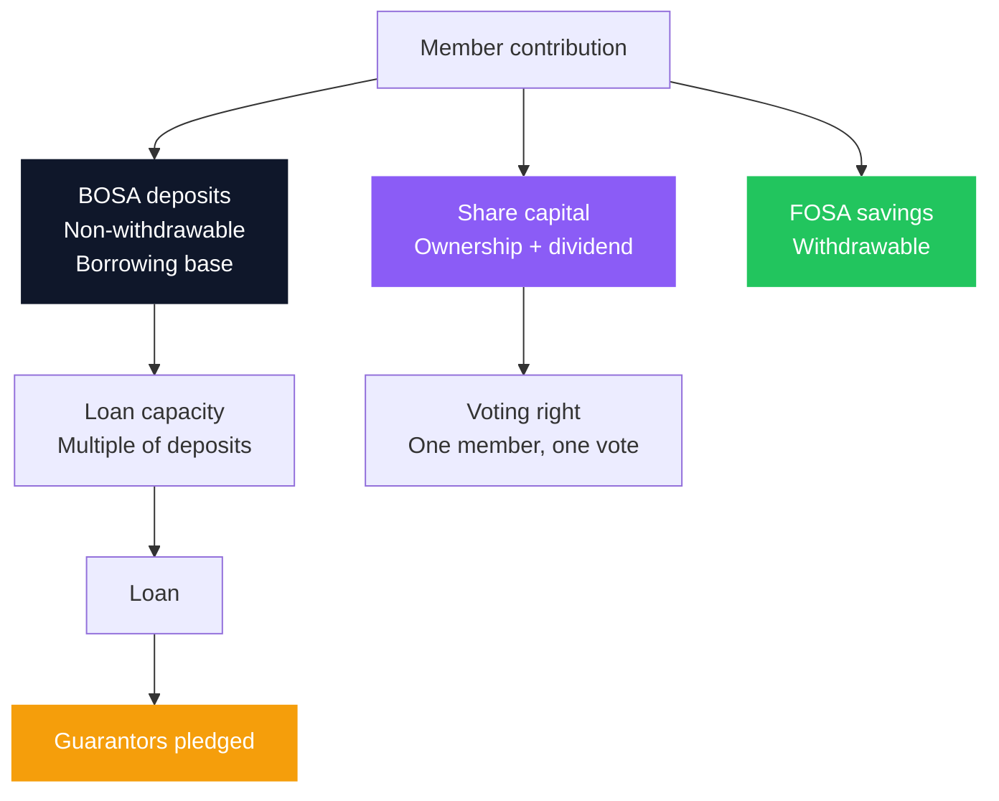
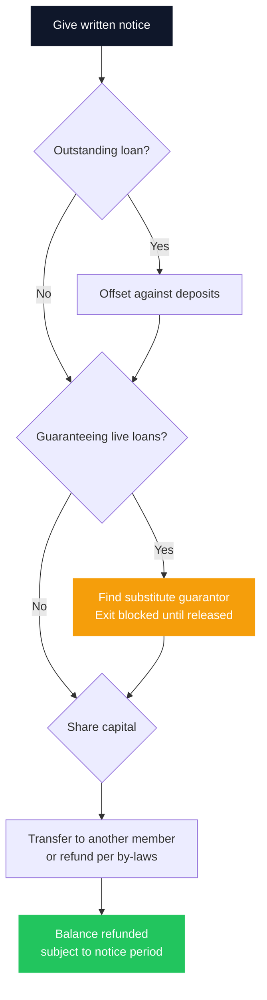

Ask most Kenyan SACCO members what they own and you will get a number: "I have KES 400,000 in my SACCO." Ask them to split that number into share capital and deposits, and the conversation usually stops.

That gap matters. Those two pots behave completely differently. One of them earns dividends, cannot normally be withdrawn while you remain a member, and is the reason you have a vote. The other earns interest, secures your borrowing capacity, and is often locked in ways members only discover when they try to leave. Neither is a savings account in the sense people assume.

SACCOs are not a fringe product in Kenya. They served [3.3 million adult members in 2024, up from 2.6 million in 2021](https://www.sasra.go.ke/), and SACCO members record a monthly financial service usage rate of 74.9%, well ahead of banks at 58.7%. Regulated SACCO assets exceeded KES 1.21 trillion by the end of 2025. For millions of households the SACCO is not a supplementary account; it is the primary financial institution.

This guide covers the membership mechanics that the lending conversation crowds out. The credit side, guarantees, default, and recovery, is dealt with in depth in [Safe for Savers, Risky for Guarantors](/blog/sacco-savers-guarantors), and where SACCO deposits belong against a bank or an MMF is settled in [Bank Account vs SACCO vs MMF](/blog/bank-vs-sacco-vs-mmf-savings). What follows is everything else: what you own, how it pays, how you vote, who inherits it, how you get out, and what happens if the institution does not survive.

### Key Insight

A SACCO member is an owner, not a customer. That single distinction explains almost every feature members find surprising: why your deposits are illiquid, why your dividend is declared rather than earned at a contracted rate, why one member with KES 50,000 outvotes another with KES 5 million, and why leaving is a process with a queue rather than a withdrawal. Judge a SACCO by its governance and its exit terms, not by the dividend it advertised last year.

```cards
- icon: Layers
  title: Two pots, not one
  desc: Share capital buys ownership and dividends. Deposits secure borrowing and earn a rebate. Confusing them is the most expensive membership mistake.
  linkText: Where savings should sit
  linkUrl: /blog/bank-vs-sacco-vs-mmf-savings
- icon: Vote
  title: One member, one vote
  desc: Your influence at the AGM does not scale with your money. That protects small members and caps large ones.
  type: amber
- icon: DoorOpen
  title: Read the exit first
  desc: Notice periods, loan offsets, and live guarantees decide how fast you can leave. Check them before you join, not after.
  type: emerald
```

---

### Part 1: What You Actually Own

A SACCO membership is made of distinct components that most statements list together. Separating them is the foundation for every other decision in this guide.

| Component | What it is | Can you withdraw it? | How it earns |
|---|---|---|---|
| **Share capital** | Your ownership stake in the society | Not while you remain a member; normally transferred or refunded only on exit | **Dividend**, declared annually as a percentage of shares |
| **Non-withdrawable deposits (BOSA)** | Long-term member deposits that build borrowing capacity | No, not on demand; this is the defining feature | **Interest on deposits** (often called a rebate), declared annually |
| **Withdrawable savings (FOSA)** | Ordinary savings or current account at SACCOs with a FOSA | Yes, like a bank account | Low or no interest, varies by product |
| **Loans** | Credit advanced against deposits and guarantees | Not applicable | You pay interest |

One statutory limit is worth knowing at the outset. **No member, other than another co-operative society, may hold more than one fifth of a society's issued and paid-up share capital:**

$$
\text{Maximum member shareholding} = \tfrac{1}{5} \times \text{Issued and paid-up share capital}
$$

The cap stops any single member from owning the society outright. It is the ownership-side counterpart to the one-member-one-vote rule in Part 4: cooperative law limits concentration of both control and capital.

The distinction members most often miss is the second row. **Non-withdrawable deposits are not an emergency fund.** They are the collateral base of the cooperative lending model: your deposits sit as security for your own borrowing and, through guarantees, for other members' borrowing too. That is precisely why they cannot be pulled on demand. A member who treats BOSA deposits as their shock absorber discovers the problem at the worst possible moment, which is why the [emergency fund](/blog/bank-vs-sacco-vs-mmf-savings) belongs somewhere liquid instead.

#### BOSA and FOSA

Most established SACCOs run two arms:

- **BOSA (Back Office Savings Activity)** is the classic cooperative: non-withdrawable deposits, share capital, and the loan book priced against them. This is the wealth-building engine.
- **FOSA (Front Office Savings Activity)** is the quasi-banking counter: withdrawable savings, salary processing, ATM cards, mobile banking, sometimes agency banking. Only deposit-taking SACCOs licensed by SASRA may operate a FOSA.

Members are frequently unaware that money moved into FOSA no longer counts toward BOSA multipliers. If your borrowing plan depends on a deposit multiple, parking cash in FOSA for convenience can quietly reduce the loan you qualify for.



---

### Part 2: Deposit-Taking, Non-Withdrawable, and Unregulated

Not every organisation calling itself a SACCO sits under the same supervision, and the difference decides what protection you have.

| Type | Regulator | What it may do |
|---|---|---|
| **Deposit-Taking (DT) SACCO** | Licensed by **SASRA** under the Sacco Societies Act, 2008 | Operate a FOSA, take withdrawable deposits, offer quasi-banking services |
| **Non-Withdrawable Deposit-Taking (NWDT) SACCO** | Authorised by **SASRA** | Share capital and non-withdrawable deposits for lending; no FOSA counter |
| **Other registered co-operatives** | Commissioner for Co-operative Development under the Co-operative Societies Act | Operate as a co-operative, but outside SASRA prudential supervision |

For the 2025 cycle, SASRA licensed **178 DT SACCOs** and authorised **177 NWDT SACCOs**. That is roughly 355 supervised societies out of approximately 13,000 registered co-operatives nationally, of which [only about 2,700 currently meet their statutory reporting obligations](https://www.dawan.africa/news/over-10000-saccos-face-deregistration-in-state-crackdown).

The practical instruction is short: **verify the licence before you deposit.** SASRA publishes the licensed and authorised lists annually. A society that is registered as a co-operative but not licensed by SASRA is not subject to the same prudential rules, and the gap tends to become visible only when something goes wrong.

---

### Part 3: How Your Money Actually Earns

This is where SACCO returns differ most sharply from a bank product, and where advertised numbers mislead most often.

**Dividends** are paid on share capital. **Interest on deposits**, often called a rebate, is paid on BOSA deposits. They are different rates on different pots, and members routinely quote the higher of the two as though it applied to everything they hold.

Your actual blended return is therefore:

$$
\text{Blended return} = \frac{(\text{Shares} \times r_{\text{div}}) + (\text{Deposits} \times r_{\text{int}})}{\text{Shares} + \text{Deposits}}
$$

A member with KES 60,000 in shares and KES 540,000 in deposits does not earn the headline dividend rate on KES 600,000. Shares are 10% of their position, so a strong dividend on a small share base moves the blended number far less than the marketing suggests. When comparing SACCOs, ask for both rates and the split, not the poster.

Three further features change the picture:

**Declared, not contracted.** Both rates are proposed by the board and approved by members at the Annual General Meeting, out of the year's surplus. They are not a contractual yield. A difficult year, a large loan-loss provision, or an exposure to a failed institution can compress them. This is exactly what happened when member SACCOs had to [provision more than KES 1.8 billion against the KUSCCO losses](https://nation.africa/kenya/business/companies/sacco-provisions-for-kuscco-scandal-losses-hit-sh1-8-billion-4946980), money that would otherwise have funded distributions.

**Timing.** Distributions are typically declared and paid after the AGM, following the financial year end, so the cash arrives well after the period it relates to.

**Tax, and it is not the same on both pots.** This is the detail that quietly reshapes the comparison. KRA applies withholding tax at different rates depending on which pot the money came from:

| Return type | Source account | Resident WHT rate | Non-resident | Tax status |
|---|---|---|---|---|
| **Share dividends** | Share capital (non-withdrawable equity) | **5%** | 15% | Final tax |
| **Deposit interest / rebate** | Member deposits (the loan multiplier base) | **15%** | Varies | Final tax |

Rates are set by the Third Schedule to the Income Tax Act.

Three consequences follow.

**Shares are the tax-favoured pot.** Interest on your deposits is taxed at three times the rate applied to your share dividends. Any comparison of the two rates that ignores this overstates the deposit side.

**Both are final taxes, deducted at source.** The obligation to withhold sits with the SACCO under Section 35(3)(d) of the Income Tax Act, and it remits to KRA by the 20th of the following month. For resident members, KRA treats withholding tax as **final on qualifying dividends and qualifying interest**, so you do not declare the income again in your annual return. The figure that lands in your account is the figure you keep.

**The calculation bases differ, and the timing is worth money.** Dividends are a flat percentage of your share capital, so when you contributed is irrelevant. Deposit interest is computed on a **pro-rata time basis**: what you earn depends on how many months each deposit actually sat with the SACCO during the financial year. Money contributed in January works for twelve months; the same amount contributed near the year end may earn little or **nothing at all**. If you are making a lump-sum top-up to deposits, doing it early in the SACCO's financial year is a free increase in your return.

Putting tax into the earlier formula gives what you actually receive:

$$
\text{Net blended return} = \frac{(\text{Shares} \times r_{\text{div}} \times 0.95) + (\text{Deposits} \times r_{\text{int}} \times 0.85)}{\text{Shares} + \text{Deposits}}
$$

**Worked example.** Take a SACCO declaring a 20% dividend on shares and 10% interest on deposits, and a member holding KES 10,000 in each:

| | Shares | Deposits |
|---|---|---|
| Holding | KES 10,000 | KES 10,000 |
| Declared rate | 20% | 10% |
| Gross return | KES 2,000 | KES 1,000 |
| Withholding tax | KES 100 (5%) | KES 150 (15%) |
| **Net payout** | **KES 1,900** | **KES 850** |

The gross gap between the two pots is 2:1. After tax it widens to better than 2.2:1. That is an argument for understanding your share-to-deposit ratio rather than assuming deposits are automatically the better place to accumulate, while remembering that deposits, not shares, are what drive your borrowing capacity. The two pots do different jobs, and now you can see that they are taxed for different jobs too.

> A dividend history is evidence, not a promise. Ask for five years, not last year, and ask what the board provisioned against in the weak years.

---

### Part 4: Governance, Or Why Your Vote Does Not Scale

In a company, votes follow shares. In a co-operative, they do not. **One member, one vote**, regardless of whether you hold the minimum share capital or a hundred times it.

This principle cuts both ways. It protects small members from being steamrolled by large ones, which is the cooperative ideal working as designed. It also means a member with a substantial position cannot exert influence proportionate to the money at risk. If you are contemplating a large concentration in one SACCO, that asymmetry is a genuine consideration.

Governance runs through a structure worth understanding before you need it:

- **The Annual General Meeting** approves audited accounts, elects the board, and approves the surplus distribution. This is where dividends are decided.
- **Delegates.** Larger SACCOs use a delegate system rather than assembling every member. You vote for a delegate who votes at the AGM. Find out whether your SACCO is direct or delegate-based, because it changes how much distance sits between you and the decision.
- **The board** is drawn from the membership and is generally not composed of career bankers. Under the reform agenda, officials would be vetted through an **Approved Persons Regime**.
- **Supervisory committee** provides internal oversight on behalf of members.

Attending the AGM is the single most underused member right in Kenyan cooperative finance. It is where you can see the audited accounts, the NPL trend, the provisioning, and the board's explanation for a weak distribution, before you decide whether to increase your position. Sector NPLs stood at [8.39% for the year ended December 2024](https://saccoreview.co.ke/sacco-sector-posts-ksh-845-billion-in-loans-as-npl-ratios-hold-steady-amid-rising-risks/) against a gross loan book of roughly KES 845 billion; your own SACCO's figure is the one that matters, and the AGM is where you get it.

---

### Part 5: Nominees, Death, and Succession

This section exists because it is the one members most reliably neglect, and the consequences fall on people who cannot fix it.

Under **Section 39 of the Co-operative Societies Act**, a member may **nominate a person to receive their share or interest in the society on death**. The nomination is made in writing to the society and can be revised at any time. It covers share capital and deposits.

The critical feature is what a nomination actually does. **There is no monetary ceiling on the transfer.** Once a valid nomination sits on file, the member's share or interest passes directly to the nominee and **bypasses the estate entirely**: the society is required to transfer it to the nominated person, with no grant of representation and no succession process, whatever the amount involved.

That makes the nomination form one of the highest-leverage documents a SACCO member will ever sign, and it is why the following points matter.

**A nomination is not a will, and a will is not a nomination.** They are separate instruments. Because the nominated interest never enters the estate, a carefully drafted will does not override a valid nomination sitting at the society. Members who have done their succession planning properly often assume it reaches here. Check what your SACCO actually holds on file.

**Bypassing the estate is precisely what causes disputes.** Co-operative law and the general law of succession pull in different directions, and nominees and legal heirs routinely end up contesting the same funds. A nomination that no longer reflects the member's actual dependants is not a plan; it is a dispute waiting to happen, and it lands on a grieving family.

**Stale nominations cause real harm.** A nomination made at joining, naming a parent or a former spouse, and never revisited across two decades of marriages, children, and deaths, is a document that will be honoured exactly as written. Review it whenever your circumstances change.

By-laws still shape the detail: a society's registered rules may govern how many shares a member can hold and how the interest is apportioned where several nominees are named. Those are society-level rules, not a statutory cap on value.

Outstanding loans and live guarantees do not disappear on death. They are settled against the deceased member's deposits before anything reaches the nominee, which is one more reason to know your total guarantee exposure.

---

### Part 6: Exiting a SACCO

Members research entry thoroughly and exit almost never. Yet the exit terms are where the illiquidity of the model becomes concrete.

The general shape of the process, which varies by by-laws:

1. **Written notice.** By-laws set a notice period for withdrawal from membership, commonly measured in months. This is a queue, not a button.
2. **Loan settlement.** Any outstanding loan is cleared first, typically by offsetting your deposits against the balance.
3. **Guarantee release.** This is the binding constraint. **You generally cannot fully exit while you are guaranteeing another member's live loan.** The SACCO will not release deposits that are securing someone else's debt. You must first be substituted by another guarantor, which requires the borrower to find one willing.
4. **Share capital.** Shares are frequently **transferred to another member rather than refunded**, because refunding share capital reduces the society's capital base. Your ability to exit may depend on finding a buyer.
5. **Refund of the balance.** What remains is paid out, subject to the by-laws and the SACCO's liquidity position.



The lesson generalises beyond exit. Every guarantee you sign is also a lock on your own ability to leave. Members who think of guarantees purely as a credit risk miss that they are simultaneously a liquidity commitment on their own position.

---

### Part 7: Mergers, Restricted Licences, and Deregistration

The sector a member joins today may not be the sector they exit. Consolidation is the explicit direction of travel.

In the 2026 licensing round, SASRA [gazetted 176 deposit-taking SACCOs and placed five on restricted, credit-only licences](https://kenyanwallstreet.com/five-saccos-put-on-credit-only-status-as-two-exit), barring them from taking new deposits, while two exited through merger. Meanwhile the reform agenda proposes [raising minimum membership from 10 to 100](https://www.theeastafrican.co.ke/tea/business-tech/kenya-uganda-in-race-to-change-sacco-rules-losses-hit-members-5372036), tiered prudential licensing by asset size, and a public sanctions register. The [Sacco Societies (Amendment) Bill, 2025](https://www.parliament.go.ke/node/24259) additionally proposes [compelling SACCOs with deposits below KES 100 million to merge](https://www.breakingkenyanews.com/2026/04/30/saccos-reject-bill-proposing-merger-of-small-cooperatives/) with larger institutions, a provision smaller societies are actively resisting. Public participation closed on 24 April 2026 and the final law is still being negotiated.

What this means for a member, in order of practical impact:

- **A restricted licence** means the SACCO can still lend but cannot take new deposits. If yours is on that list, your contribution plan needs rethinking immediately.
- **A merger** transfers your membership into a larger society. Your deposits and shares carry over, but product terms, dividend policy, loan multiples, and service standards change to those of the absorbing institution.
- **Deregistration** applies to the long tail of non-compliant societies and is the scenario with the least member protection.

If your SACCO is small and sits below the proposed thresholds, treat its independent existence over a five-year loan horizon as uncertain rather than assumed.

---

### Part 8: Insolvency and the Deposit Guarantee Question

This is the most important thing in this guide, and the least widely known.

When a Kenyan bank fails, the **Kenya Deposit Insurance Corporation** covers depositors up to a statutory limit. Members frequently assume an equivalent backstop exists for SACCOs. **In practice, it does not currently operate.**

The Sacco Societies Act provides for a **Deposit Guarantee Fund**, but it has remained dormant, which is precisely why its **operationalisation** is one of the headline proposals in the Sacco Societies (Amendment) Bill, 2025, alongside a **Central Liquidity Facility**. Until that is funded and operational, a SACCO member does not have a comparable payout guarantee behind their deposits.

The consequence is that **institutional selection carries more weight in a SACCO than in a bank**. With a licensed bank, choosing poorly within the insured limit is survivable. With a SACCO, governance quality is doing the work that deposit insurance does elsewhere. The KUSCCO collapse, roughly [KES 13.3 billion lost](https://www.capitalfm.co.ke/business/2025/05/kuscco-audit-reveals-billions-lost-in-mismanagement-report-tabled-in-parliament/) with [KES 24.8 billion in deposits from 247 SACCOs placed at risk](https://www.xtrafrica.com/kenya/kuscco-loses--billions-to-froud-leaving-247-saccos-at-risk-), demonstrated that the risk is real rather than theoretical, and that it can arrive from an institution two steps above your branch.

This is not an argument against SACCO membership. It is an argument for concentration limits and for doing the governance homework that the absence of a backstop makes necessary.

### Risk Factors

| Risk | Likelihood | Severity for the member |
|---|---|---|
| Treating non-withdrawable deposits as an emergency fund | Very common | High, the money is unavailable exactly when the shock lands |
| Dividend or rebate falls below expectation | Routine, it is declared not contracted | Moderate, plans built on last year's rate miss |
| Exit blocked by a live guarantee | Common among long-standing members | High, your capital is locked by someone else's loan |
| Stale or missing nominee record | Very common | High, a stale nomination pays the wrong person and invites an heir dispute; a missing one drops the balance into the estate and the succession process |
| Share capital refundable only by transfer | By-law dependent | Moderate, exit timing depends on finding a buyer |
| SACCO placed on a restricted licence | Rising, five in the 2026 round | Moderate to high, contributions and service disrupted |
| Forced merger under the proposed thresholds | Rising for small societies | Moderate, terms change to the absorbing institution's |
| Institutional failure with no operational Deposit Guarantee Fund | Rare but proven | Severe, no comparable payout backstop today |

### Decision Framework: Seven Checks Before You Join or Concentrate

**Is it licensed or authorised by SASRA?** Check the published list. This is non-negotiable and takes five minutes.

**What are the two rates, and what is my split?** Get the dividend rate on shares and the interest rate on deposits separately, plus the share-to-deposit ratio required. Compute the blended return **after withholding tax** (5% on dividends, 15% on deposit interest), not the headline.

**What does the five-year distribution history look like?** One strong year proves nothing. Ask what was provisioned against in the weak years, including any KUSCCO exposure.

**What are the exit terms?** Notice period, whether share capital is refunded or must be transferred, and how guarantees are released. Read this clause before joining.

**Does it clear the proposed thresholds?** The 100-member and KES 100 million deposit proposals are the rough dividing line between institutional continuity and merger uncertainty.

**Is the AGM direct or delegate-based, and when is it?** Then attend one before increasing your position materially.

**Have I filed and updated a nominee?** Do it at joining, and review it whenever your family circumstances change.

### Bengula View

The desk would frame SACCO membership around three ideas.

First, **place the money by job, not by loyalty**. A SACCO is an excellent long-horizon wealth engine and a poor emergency fund, because non-withdrawable deposits are structurally illiquid by design rather than by accident. Members who hold their buffer elsewhere and their long money in the SACCO get the best of the model; members who invert that get a liquidity crisis with a good dividend attached.

Second, **the absence of an operational deposit guarantee changes the arithmetic on concentration**. Where a bank depositor can rely on statutory insurance within the limit, a SACCO member is relying on governance. That argues for reading the audited accounts, attending the AGM, and setting a ceiling on how much of a household's total assets sit inside any single society, particularly a small one facing the merger thresholds.

Third, **the paperwork nobody enjoys is the paperwork that matters most**. The nominee form and the exit clause in the by-laws are, between them, worth more to a member's family than a percentage point of dividend. They are also the two documents almost no member reads. Read them at joining, when you have leverage and time, rather than at exit or bereavement, when you have neither.

### Conclusion

SACCO membership remains one of the most effective wealth-building structures available to ordinary Kenyans, and the usage data supports that: members transact more actively through their SACCO than bank customers do through their banks. The model's strengths, member ownership, enforced savings discipline, distributions that flow back to members, and credit priced for people the banking system has historically underserved, are real and hard to replicate.

But membership is ownership, and ownership carries obligations that customers do not have. Your deposits are working capital for a lending institution you part-own, not idle savings. Your returns are declared by a vote you are entitled to attend. Your exit runs through a queue shaped by other members' borrowing. And, for now, your protection against institutional failure is the quality of the board rather than a statutory fund.

Understand those four things and the SACCO becomes what it should be: the disciplined, long-horizon core of a household balance sheet, sitting alongside a liquid buffer held somewhere else entirely.

### Related Reading

- [Safe for Savers, Risky for Guarantors](/blog/sacco-savers-guarantors) for the credit and guarantee side of membership in full.
- [Bank Account vs SACCO vs MMF](/blog/bank-vs-sacco-vs-mmf-savings) for where SACCO deposits belong against the alternatives.
- [The Ultimate Guide to Financial Inclusion in Kenya](/blog/ultimate-guide-to-financial-inclusion-kenya) for the SACCO sector's place in the national picture.
- [The Complete Chama Guide](/blog/complete-chama-guide-kenya) for structuring group money outside the SACCO framework.
- [Retirement Planning in Kenya](/blog/retirement-planning-kenya-guide) for how SACCO deposits interact with a retirement plan.
- [How Kenyan Banks Price Your Loan](/blog/how-kenyan-banks-price-loans) for comparing SACCO credit with bank lending.

### References

- [Sacco Societies Regulatory Authority (SASRA)](https://www.sasra.go.ke/). Licensing lists for deposit-taking and non-withdrawable deposit-taking SACCOs, and sector statistics including membership and asset figures.
- [The Sacco Societies Act, No. 14 of 2008, Kenya Law](http://kenyalaw.org/kl/fileadmin/pdfdownloads/Acts/SaccoSocietiesAct_No14of2008.pdf). Licensing, the Deposit Guarantee Fund, and the framework for deposit-taking SACCOs.
- [The Sacco Societies (Amendment) Bill, 2025, Parliament of Kenya](https://www.parliament.go.ke/node/24259). Central Liquidity Facility, operationalisation of the Deposit Guarantee Fund, and the merger threshold.
- ["SASRA Flags Five Saccos and Boots Out Two For 2026", The Kenyan Wallstreet, February 2026](https://kenyanwallstreet.com/five-saccos-put-on-credit-only-status-as-two-exit). The 2026 licensing round and restricted licences.
- ["Kenya, Uganda in race to change Sacco rules as losses hit members", The EastAfrican](https://www.theeastafrican.co.ke/tea/business-tech/kenya-uganda-in-race-to-change-sacco-rules-losses-hit-members-5372036). Committee of Experts proposals, including the 10-to-100 minimum membership change and the Approved Persons Regime.
- ["Over 10,000 Saccos Face Deregistration in State Crackdown", Dawan Africa](https://www.dawan.africa/news/over-10000-saccos-face-deregistration-in-state-crackdown). Compliance levels across the registered co-operative base.
- ["Sacco provisions for Kuscco scandal losses hit Sh1.8 billion", Daily Nation](https://nation.africa/kenya/business/companies/sacco-provisions-for-kuscco-scandal-losses-hit-sh1-8-billion-4946980). How institutional losses reach member distributions.
- ["KUSCCO audit reveals billions lost in mismanagement", Capital Business, May 2025](https://www.capitalfm.co.ke/business/2025/05/kuscco-audit-reveals-billions-lost-in-mismanagement-report-tabled-in-parliament/). The PwC forensic audit findings.
- ["Sacco sector posts KES 845 billion in loans as NPL ratios hold steady", Sacco Review](https://saccoreview.co.ke/sacco-sector-posts-ksh-845-billion-in-loans-as-npl-ratios-hold-steady-amid-rising-risks/). Sector loan book and NPL ratio for the year ended December 2024.
- [Kenya Revenue Authority, withholding tax FAQs](https://www.kra.go.ke/component/kra_faq/faqcategory/64). "For resident persons, WHT is final in the case of qualifying dividends and qualifying interest," so resident members do not re-declare these in an annual return.
- ["Taxation of Dividends Issued by SACCOs in Kenya", Ronalds LLP](https://ronalds.co.ke/taxation-of-dividends-issued-by-saccos-in-kenya/). The 5% resident rate (15% non-resident) under the Third Schedule to the Income Tax Act, the SACCO's duty to withhold under Section 35(3)(d), and remittance to KRA by the 20th of the following month.
- [PwC Worldwide Tax Summaries: Kenya withholding taxes](https://taxsummaries.pwc.com/kenya/corporate/withholding-taxes). The 15% resident rate on interest, and the 5% dividend rate applicable below the 12.5% voting-power threshold.
- ["Understanding How SACCO Dividends and Rebates Are Calculated", Sacco Review](https://saccoreview.co.ke/understanding-how-sacco-dividends-and-rebates-are-calculated/). Rebates computed on a pro-rata time basis, so deposits made late in the financial year may earn little or nothing.
- [The Co-operative Societies Act, No. 12 of 1997 (Cap 490), Kenya Law](https://kenyalaw.org/akn/ke/act/1997/12). Co-operative governance, the one-fifth cap on a single member's share of issued and paid-up share capital, and Section 39 on nomination of a person to receive a deceased member's share or interest.
- ["Resolving Succession Disputes Involving Cooperatives in Kenya", LawGuide Kenya](https://lawguide.co.ke/understanding-law/legal-forum/topic/resolving-succession-disputes-involving-cooperatives-in-kenya/). How a valid nomination bypasses the estate under Section 39, and why nominees and legal heirs end up in dispute.

*Sector figures cited as at the dates shown (SASRA membership and usage data 2024; regulated assets end-2025; NPL and loan book December 2024; licensing rounds 2025 and 2026). Withholding tax rates are those under the Third Schedule to the Income Tax Act as at July 2026 and are revised by Finance Act, so verify before relying on them. Re-date on refresh. Notice periods, share transfer rules, nominee apportionment, and distribution rates are set by individual SACCO by-laws and vary; confirm yours directly.*

*General market education, not individualized financial, tax, legal, or investment advice. Verify live rates, licensing, and suitability before acting.*
