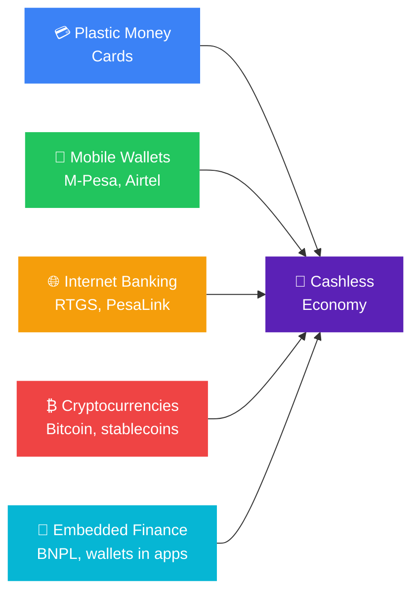

# What Is a Cashless Economy? Kenya's Digital Money Revolution

A cashless economy is one in which all transactions are conducted electronically (through mobile money, debit and credit cards, internet banking, or digital wallets) rather than through physical cash or coins.

Kenya is the world's most advanced proof of concept. [Mobile money penetration reached 91% by June 2025, with 47.7 million active subscriptions, up sharply from 77.3% penetration just one year earlier.](https://fintechmagazine.com/news/kenya-leads-the-world-in-mobile-money-penetration) [Mobile money transactions crossed KES 8.66 trillion ($62 billion) in the year to late 2025.](https://techcabal.com/2026/05/13/next-wave-kenya-has-conquered-mobile-money-now-it-must-fix-the-system-underneath/) That is not a developing market adopting digital finance. That is a digital economy that still carries a legacy cash problem in its rural and informal sectors.

The countries that have achieved the highest cashless adoption globally are Kenya, India, China, and Sweden. [Only 15-20% of the world's currency supply exists as physical cash](https://www.worldbank.org/en/news/press-release/2022/06/29/covid-19-drives-global-surge-in-use-of-digital-payments). The rest is created by banks as deposits and circulates electronically. The direction of travel is clear. The question for Kenyan businesses and individuals is not whether to participate in a cashless economy but how to navigate the one already around them.

---

### How Kenya Got Here

M-Pesa launched in 2007 as a Safaricom airtime transfer service. Within five years it had become the dominant payment rail for a country where most adults had no bank account. By 2025, [more than 83% of Kenyan adults have formal access to financial services](https://fintechmagazine.com/news/kenya-leads-the-world-in-mobile-money-penetration), a transformation driven almost entirely by mobile money rather than by branch banking.

The shift is now visible in transaction behaviour. [Mobile money agent cash volumes fell by KSh 430.3 billion in the first 11 months of 2025 compared to the same period in 2024](https://eastleighvoice.co.ke/business/271957/cbk-data-shows-decline-in-mobile-money-agent-cash-volumes-amid-digital-payment-shift), a direct signal that Kenyans are increasingly completing transactions digitally rather than withdrawing cash first. Everyday payments, including groceries, matatu fares, and utility bills, are shifting to mobile, cutting the need to visit agents for withdrawal.

[Cash still dominates at 84% of point-of-sale preferences, with mobile money close behind at 80%.](https://www.pesapal.com/blog/bridging-the-digital-divide-making-a-cashless-society-inclusive-for-all) Kenya is not cashless. It is dual-track: cash and digital running simultaneously, with digital growing faster every year.

---

### The Five Instruments of a Cashless Economy

#### 1. Mobile Wallets

A mobile wallet is a digital account on your phone that lets you deposit, withdraw, send, or pay, without requiring a bank account or physical card. It works online and offline, through an app or via USSD push notifications.

In Kenya, M-Pesa remains the dominant mobile wallet, operated by Safaricom. Airtel Money and Telkom's T-Kash are growing competitors. [CBK raised the mobile wallet limit from KES 300,000 to KES 500,000 in 2023, and increased the daily transaction cap to KES 250,000](https://techweez.com/2025/07/01/kenya-goes-cashless-mobile-money-subscriptions-soar-to-45-million/), reflecting the growing role of mobile money in high-value personal and business transactions, not just micro-payments.

Globally: Alipay, WeChat Pay, GCash, PayPal, Venmo, MTN Mobile Money, Orange Money.

#### 2. Plastic Money

Credit, debit, and prepaid cards issued by Visa and Mastercard in collaboration with banks were the first cashless iteration widely adopted before mobile money existed. Originally used at ATMs to withdraw cash, cards now enable direct purchases at point of sale, online checkout, and contactless tap payments.

In Kenya, debit card usage sits at 22% and credit cards at 20% of point-of-sale preference, well below mobile money but growing, particularly in formal retail and e-commerce. Absa, Equity, KCB, and NCBA all issue Visa and Mastercard debit and credit products integrated with their mobile banking apps.

#### 3. Internet Banking

Internet banking settles payments between parties across institutions and borders electronically, without requiring cash or cards. Core infrastructure includes:

- **RTGS (Real-Time Gross Settlement)**: instant settlement of high-value interbank transfers, used for corporate treasury and large commercial payments
- **[PesaLink](https://www.ipsl.co.ke/pesalink/how-to-use-pesalink)**: Kenya's real-time interbank transfer service operated by IPSL, supporting instant account-to-account payments across participating banks
- **SWIFT**: the global messaging network for international transfers
- **EFT (Electronic Funds Transfer)**: batch settlement used for payroll and bulk payments

For businesses, internet banking is the primary mechanism for payroll, supplier payments, and treasury management. See Bengula's [Ultimate Guide to Banking in Kenya](/blog/ultimate-guide-to-banking-in-kenya) for how to structure your corporate digital banking setup.

#### 4. Cryptocurrencies

Blockchain-based digital currencies enable peer-to-peer transactions without a central bank or intermediary. Bitcoin remains the largest by market cap. Stablecoins (pegged to fiat currencies like the US dollar) are increasingly used for cross-border remittances, particularly in markets where local currency volatility creates risk.

Kenya has one of Africa's highest crypto adoption rates by population. [Kenyans in the diaspora sent home KES 649.9 billion in 2025](https://eastleighvoice.co.ke/business/271957/cbk-data-shows-decline-in-mobile-money-agent-cash-volumes-amid-digital-payment-shift), a significant portion flowing through both traditional remittance channels and crypto rails. CBK's regulatory posture on crypto remains cautious but has shifted from outright discouragement to structured engagement, with a framework for digital asset service providers under development.

#### 5. Embedded Finance

The newest and fastest-growing instrument. Financial products built directly into non-financial platforms: BNPL at checkout, working capital credit inside an SME management tool, insurance bundled with an agri-platform purchase. The customer never visits a separate financial product; it is part of the workflow they already use.

This is explored in depth in Bengula's [How Embedded Finance Is Reimagining the Point of Payment in Kenya](/blog/embedded-finance-kenya-guide).

---

### The Real Advantages of a Cashless Economy

**Security.** Digital transactions are traceable. Stolen cash is gone. A fraudulent digital transaction leaves a record and can be reversed. [According to Kenya's bank account ownership rate reaching 90.1% in 2024 from 79.1% in 2021](https://financeinafrica.com/news/kenya-mobile-money-payments-drops/), the formalisation of transactions through digital rails has given more Kenyans recourse when things go wrong.

**Transparency and tax compliance.** Every digital transaction is a data point. Governments can track spending patterns, identify tax gaps, and pursue VAT compliance more effectively when the economy moves through digital rails. Kenya's mandatory e-invoicing requirement for tax-deductible expenses is a direct product of this. The KRA can now reconcile invoices against M-Pesa and bank records automatically.

**Efficiency.** Cash requires physical handling: printing, counting, transporting, securing, exchanging. Digital payments eliminate every step. A corporate treasury moving KES 500 million via RTGS takes seconds. The same amount in cash requires armoured vehicles and armed guards.

**Financial inclusion.** M-Pesa gave millions of Kenyans access to financial services without a bank account. BNPL platforms are now giving SMEs access to working capital without three years of audited accounts. Each wave of cashless innovation reaches a segment that the previous financial system excluded.

**Better data for businesses.** Digital transaction records give merchants, lenders, and platform operators access to behavioural data that cash cannot provide. A business processing M-Pesa payments has a live dashboard of revenue by time of day, customer frequency, and average transaction value. A cash-only business has a till and guesswork.

---

### The Real Risks

**Privacy erosion.** Every digital transaction is a record. Governments, banks, payment providers, and data brokers can see what you bought, where, and when. [The Kenyan government's 2025 Finance Bill proposal to enhance monitoring of M-Pesa transactions triggered public backlash over fears of increased surveillance and taxation of informal transactions](https://financeinafrica.com/news/kenya-mobile-money-payments-drops/). The bill was ultimately dropped, but the concern it surfaced is legitimate.

**Technology dependency.** A cashless economy fails when the technology fails. Power outages, internet downtime, system maintenance windows, and SIM card issues all interrupt transactions. [Russia's exclusion from the SWIFT network in 2022 demonstrated how quickly a technology dependency can become a geopolitical weapon](https://www.worldbank.org/en/news/press-release/2022/06/29/covid-19-drives-global-surge-in-use-of-digital-payments). Digital rails can be switched off in ways that physical cash cannot.

**Identity fraud and cybercrime.** Digital economies create digital fraud vectors. SIM swap fraud, phishing, account takeover, and fake merchant scams are all growing in Kenya alongside digital payment adoption. [As everyday payments shift to mobile, the attack surface for fraudsters grows proportionally.](https://eastleighvoice.co.ke/business/271957/cbk-data-shows-decline-in-mobile-money-agent-cash-volumes-amid-digital-payment-shift)

**Exclusion of the digitally unserved.** [Approximately 21% of Kenyans remain outside the formal banking system.](https://www.pesapal.com/blog/bridging-the-digital-divide-making-a-cashless-society-inclusive-for-all) Older Kenyans, rural communities with poor network coverage, and informal traders who rely on cash remain disadvantaged in a system optimised for digital. A fully cashless economy today would leave this population behind.

**Fragmentation.** [Kenya's digital payments ecosystem, despite its scale, remains fragmented. A merchant in Nairobi may maintain separate relationships with banks, mobile money providers, card processors, and payment gateways, each with different settlement timelines, fees, and reconciliation systems.](https://techcabal.com/2026/05/13/next-wave-kenya-has-conquered-mobile-money-now-it-must-fix-the-system-underneath/) The next phase of Kenya's cashless evolution is not adding more rails; it is consolidating the ones that already exist.

---

### Where Kenya's Cashless Economy Is Heading

Three developments will define the next five years:

**Interoperability.** CBK has been pushing for full interoperability: the ability to send money from M-Pesa to Airtel Money to a bank account without friction or extra fees. [This is already partially in place but not seamless.](https://techweez.com/2025/07/01/kenya-goes-cashless-mobile-money-subscriptions-soar-to-45-million/) Full interoperability removes the last structural advantage M-Pesa holds through network lock-in and accelerates competition.

**Capital markets access via mobile.** [The NSE's plan to allow investors to fund brokerage accounts and trade equities directly through M-Pesa extends the cashless economy into securities.](/blog/embedded-finance-kenya-guide) The target of nine million retail investors by 2029 is only achievable if the onboarding and funding mechanism is mobile money, not a bank account.

**Lower transaction fees.** [There is mounting pressure to reduce fees on low-value mobile money payments.](https://techweez.com/2025/07/01/kenya-goes-cashless-mobile-money-subscriptions-soar-to-45-million/) High fees on small transactions are the primary reason informal traders and low-income users still prefer cash. Reducing them is the single most effective lever for expanding cashless adoption in Kenya's base of the pyramid.

---

### The Bottom Line

Kenya is not heading toward a cashless economy. It is already in one, just not completely. The infrastructure is mature, the adoption is deep, and the regulatory framework is broadly enabling. The remaining work is finishing the last mile: rural network coverage, lower fees, better fraud protection, and system consolidation that makes the fragmented ecosystem feel like a single coherent rail.

For businesses, the practical question is simpler: every payment that goes through a digital rail rather than cash is a transaction you can see, reconcile, and eventually use as evidence for credit. That data trail is worth more than the convenience.

---

### Sources and Further Reading

- [Kenya's Mobile Money Market Hits 91% Penetration, FinTech Magazine](https://fintechmagazine.com/news/kenya-leads-the-world-in-mobile-money-penetration)
- [Kenya Has Conquered Mobile Money, TechCabal](https://techcabal.com/2026/05/13/next-wave-kenya-has-conquered-mobile-money-now-it-must-fix-the-system-underneath/)
- [CBK Data Shows Decline in Mobile Money Agent Cash Volumes, Eastleigh Voice](https://eastleighvoice.co.ke/business/271957/cbk-data-shows-decline-in-mobile-money-agent-cash-volumes-amid-digital-payment-shift)
- [Making a Cashless Society Inclusive for All, PesaPal](https://www.pesapal.com/blog/bridging-the-digital-divide-making-a-cashless-society-inclusive-for-all)
- [Kenya Goes Cashless: Mobile Money Subscriptions Soar, TechWeez](https://techweez.com/2025/07/01/kenya-goes-cashless-mobile-money-subscriptions-soar-to-45-million/)
- [Digital Payments Promoting Cashless Economy in Africa, TechTrends](https://techtrendske.co.ke/2025/03/13/how-digital-payments-are-promoting-a-cashless-economy-in-africa/)
- [World Bank Digital Payments Press Release](https://www.worldbank.org/en/news/press-release/2022/06/29/covid-19-drives-global-surge-in-use-of-digital-payments)
- Bengula Inc: [Banking-as-a-Service in Kenya](/blog/banking-as-a-service-kenya-baas-guide), [How Embedded Finance Is Reimagining the Point of Payment](/blog/embedded-finance-kenya-guide), [Ultimate Guide to Banking in Kenya](/blog/ultimate-guide-to-banking-in-kenya)
