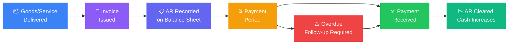

# What Is Accounts Receivable and Why It Decides Your Business Survival

Accounts receivable (AR) is money your business is owed for goods or services already delivered but not yet paid for. It sits on your balance sheet as a current asset. It is real revenue that has been earned but not yet collected.

For most Kenyan SMEs, AR is also the single biggest source of cash flow risk. You have delivered the goods. You have done the work. The invoice is out. But the money is not in your account, and your payroll runs Friday.

[A study of SMEs in Kisii County found that inefficient credit policies, lack of debt collection strategies, and inadequate monitoring of receivables significantly affect SME profitability in Kenya.](https://carijournals.org/journals/IJF/article/view/2721) The same pattern repeats across Kakamega, Nairobi, and Mombasa. Most SMEs treat AR as an accounting function rather than a cash flow management discipline. That distinction costs them.

---

### How AR Works on the Balance Sheet

When you deliver goods or complete a service and issue an invoice, two things happen:

1. Revenue is recognised on your income statement
2. The invoice amount appears as AR on your balance sheet under current assets

When the client pays, AR decreases and cash increases. Until then, you have recognised income you cannot spend.

This gap between recognition and collection is where cash flow problems originate. A business turning KES 5 million in monthly revenue with 60-day payment terms is carrying KES 10 million in receivables at any given time; capital tied up in someone else's payment cycle.

---

### The AR Lifecycle

---

### Key AR Metrics Every Business Owner Should Track

**Days Sales Outstanding (DSO).** How many days on average it takes to collect payment after an invoice is issued. Formula: (AR / Total Credit Sales) x Number of Days. A DSO of 45 means you wait an average of 45 days to collect. Lower is better. If your payment terms are 30 days and your DSO is 55, you have a collection problem.

**Accounts Receivable Turnover Ratio.** How many times per year your AR is collected in full. Formula: Net Credit Sales / Average AR. A higher ratio means faster collection. Low turnover means cash is sitting in unpaid invoices rather than circulating through the business.

**Aging Report.** A breakdown of outstanding invoices by how long they have been unpaid: 0-30 days, 31-60 days, 61-90 days, 90+ days. [SMEs that use aging reports and regular follow-ups report better financial outcomes than those that do not.](https://carijournals.org/journals/IJF/article/view/2721) The aging report tells you which invoices are at risk of becoming bad debts before they cross that line.

**Bad Debt Ratio.** The percentage of AR that is never collected. Any bad debt ratio above 2-3% signals a credit policy problem; you are extending credit to customers who cannot or will not pay.

$$ \text{DSO} = \frac{\text{Accounts Receivable}}{\text{Total Credit Sales}} \times \text{Days} = \frac{10{,}000{,}000}{5{,}000{,}000 \times 3} \times 90 = 60 \text{ days} $$

The worked example above is the business from earlier: KES 5 million in monthly credit sales carrying KES 10 million in receivables collects, on average, in 60 days. The four metrics in one view:

| Metric | Formula | Healthy Signal |
|---|---|---|
| Days Sales Outstanding | (AR ÷ credit sales) × days | At or below your stated payment terms |
| AR turnover ratio | Net credit sales ÷ average AR | Higher; cash circulating, not sitting |
| Aging report | Invoices bucketed 0-30, 31-60, 61-90, 90+ days | Nothing drifting past 60 without escalation |
| Bad debt ratio | Uncollected AR ÷ total AR | Under 2-3% |

---

### AR Management Practices That Directly Affect Profitability

[A 2025 study of Kenyan SMEs found that collection practices and risk assessment practices have the strongest impact on financial performance, ahead of financing practices and credit extension policies.](https://carijournals.org/journals/IJF/article/view/2721) In order of impact:

**1. Credit risk assessment before extending terms.**
Before offering a customer 30 or 60-day payment terms, assess their ability and track record of paying. For new corporate clients, request trade references. For government contracts, understand the procurement cycle; government entities in Kenya are notorious for 90-180 day payment cycles that SME suppliers are not capitalised to absorb.

**2. Clear credit terms on every invoice.**
State the payment due date, the late payment penalty, and the payment method on every invoice. Ambiguous terms are an invitation to delay. "Payment within 30 days" is a term. "Payment by [specific date] via M-Pesa Paybill [number] or bank transfer to [account]" is a system.

**3. Proactive follow-up before the due date.**
Do not wait for the invoice to become overdue before making contact. A reminder sent three days before the due date reduces late payments significantly. Most overdue invoices in Kenya are not disputes; they are forgotten items in someone's accounts payable queue.

**4. Aging report review every two weeks.**
Any invoice past 45 days with no payment or response should trigger escalation. At 60 days, a formal written demand. At 90 days, evaluate whether to refer to a debt collection agency, offer a settlement, or write off and adjust your credit policy for that client.

**5. Consistent enforcement of late payment penalties.**
If your invoice states a 2% per month late fee and you never charge it, you have no leverage. Enforce the penalty consistently or remove it; inconsistent enforcement signals that your terms are negotiable.

---

### AR Financing: Unlocking Cash Without Waiting for Clients

When AR is large and collection is slow, Kenyan businesses have three main financing options to unlock that trapped cash.

| Option | How It Works | Cost and Limit Signals | Who Chases the Client |
|---|---|---|---|
| Invoice discounting | Borrow against unpaid invoices | Up to KES 50M unsecured (Absa), funds in 24-48 hours | You; the client never knows |
| Invoice factoring | Sell invoices outright at a discount | Typically 3-7% of face value | The factor, directly |
| AR as collateral | Pledge receivables against a working capital loan | Formal assignment of the debtor book | You, with lender recourse |

**Invoice Discounting.**
You retain control of your debtor book but borrow against your unpaid invoices. The lender advances a percentage of the invoice value and you repay when the client settles.

[Absa Bank Kenya offers two invoice discounting frameworks under its SME and Wezesha Biashara propositions.](https://www.absabank.co.ke/media-centre/press-releases/absa-bank-kenya-plc-revamps-sme-proposition-with-new-funding-lin/) The first is **General Invoice Discounting**, which allows businesses to access up to KES 50 million unsecured, often with funds disbursed within 24 to 48 hours of approval. The second is **Receivables Finance**, a broader supply chain solution where you can finance up to 85% of your invoices while retaining full control of your debtors' book and the collection process. Both are managed through a secure digital platform for drawdown requests.

Standard documentation required: business registration certificate, 12 months of bank or M-Pesa statements, valid PIN and ID documents, CRB reports, and active proforma invoices or contracts. [Absa has also partnered with Unilever to roll out a KES 4 billion SME financing programme](https://www.the-star.co.ke/business/2026-07-04-absa-bank-unilever-roll-out-sh4bn-sme-financing-programme) giving suppliers embedded access to receivables financing within the Unilever supply chain.

[Discount Capital Kenya offers invoice discounting up to KES 7 million with a maximum tenor of 90 days, with no single invoice exceeding 25% of the facility limit.](https://discountcapital.co.ke/invoice-discounting-facility-in-kenya/) [Bank of Africa Kenya offers unsecured invoice discounting for SMEs with invoices from pre-approved corporate clients or government entities, with tenors matching the invoice maturity from 30-120 days.](https://boakenya.com/business-banking/loans-credit-facilities/other-loans/unsecured-invoice-discounting/)

The client never knows you have financed the invoice. You manage the collection relationship yourself.

**Invoice Factoring.**
You sell your invoices outright to a factor at a discount, typically 3-7% of face value. The factor takes ownership of the debt and manages collection directly. You get immediate cash. You lose the collection relationship and pay a higher cost than discounting.

Best for businesses with high AR volumes and weak internal collection capacity. Not ideal if you have ongoing relationships with the debtors; having a factor chase your clients can damage commercial relationships.

**Using Receivables as Collateral.**
Some lenders accept a formal assignment of AR as security for a working capital loan. You retain control of collection but pledge the AR as collateral. If clients do not pay, the lender can pursue the debtors directly.

[A 2025 study of Kenyan SMEs found that discounting or selling overdue invoices has the highest adoption rate among AR financing methods (mean 3.88), followed by factoring (3.72) and using receivables as collateral (3.53).](https://carijournals.org/journals/IJF/article/view/2721)

[Africa's factoring market reached $52 billion in 2024, achieving over 100% growth from 2018 to 2024 the highest growth rate of any continent.](https://unctad.org/system/files/official-document/aldc2025d3_en.pdf) Kenya mandates e-invoicing for deductible expenses, which is accelerating digital receivables financing adoption across the market.

---

### AR and Government Contracts: The Specific Kenya Problem

Government tenders are attractive for Kenyan SMEs  large contract values, guaranteed payment from a creditworthy counterparty. The catch is payment timing. National and county government entities routinely pay 90-180 days after delivery, sometimes longer when budget absorption is delayed.

An SME that wins a KES 3 million government contract and delivers in January may not receive payment until July. If that SME has KES 800,000 in monthly overheads, it needs to carry six months of operations from other sources while waiting.

The solution is to factor or discount the LPO or invoice immediately after delivery and acceptance, rather than waiting for the standard payment cycle. Most invoice discounting providers in Kenya explicitly accept government invoices and LPOs as qualifying instruments. [The condition is that the invoice must be from a pre-approved government entity or major corporate client](https://boakenya.com/business-banking/loans-credit-facilities/other-loans/unsecured-invoice-discounting/); meaning the creditworthiness of the debtor (government) is stronger than the creditworthiness of the SME, which is exactly what makes the financing viable.

This connects directly to how you structure your banking. A business banking relationship that includes a pre-approved invoice discounting facility means you can convert government receivables to cash within days of delivery acceptance, rather than months. See Bengula's [Ultimate Guide to Banking in Kenya](/blog/ultimate-guide-to-banking-in-kenya) for how to negotiate this type of facility with your bank.

---

### Setting Up an AR System for a Kenyan SME

Most early-stage Kenyan businesses manage AR in a spreadsheet or not at all. That works to about KES 2 million in monthly revenue. Beyond that, the volume of invoices, follow-up cycles, and aging tracking becomes unmanageable without a system.

Minimum viable AR system:

**Invoice numbering.** Every invoice gets a unique sequential number. This is how you track, reference, and reconcile payments. No unnumbered invoices.

**Standard invoice template.** Business name, PIN, invoice number, date, due date, itemised services, total, payment terms, and payment details. This is a legal document; treat it as one.

**AR ledger.** A running record of every outstanding invoice: client, amount, date issued, due date, payment received date. Update it every time a payment comes in or a follow-up is made.

**Aging report.** Built from the AR ledger. Updated every two weeks minimum. Reviewed by the business owner, not delegated entirely to accounts.

**Follow-up calendar.** Scheduled reminders for every invoice: 3 days before due date, on due date if unpaid, 7 days after if unpaid, 14 days after if unpaid, 30 days after if unpaid (formal demand). Make this automatic if your invoicing software supports it.

KCB, Equity, and most Kenyan banks now offer integrated digital banking tools with AR tracking and automated payment reminders built into their SME banking platforms.

---

### The One Rule That Fixes Most AR Problems

Extend credit based on the client's payment track record, not their contract size.

A KES 10 million contract from a client who pays 120 days late is worse for your cash flow than four KES 1 million contracts from clients who pay in 21 days. Before extending 60-day terms to any new client, ask for trade references and check them. One phone call to a supplier the client has worked with before tells you more than a signed contract.

Bad debt is not a collection problem. It is a credit extension problem. Fix it upstream.

---

### Sources and Further Reading

- [Accounts Receivable Management Practices and Financial Performance of SMEs in Kisii County, CARI Journals, 2025](https://carijournals.org/journals/IJF/article/view/2721)
- [Invoice Financing as a Catalyst for Business Growth in Kenya, Corporate Factoring](https://corporate-factoring.com/invoice-financing-as-a-catalyst-for-business-growth-in-kenya/)
- [Invoice Discounting Facility in Kenya, Discount Capital](https://discountcapital.co.ke/invoice-discounting-facility-in-kenya/)
- [Unsecured Invoice Discounting, Bank of Africa Kenya](https://boakenya.com/business-banking/loans-credit-facilities/other-loans/unsecured-invoice-discounting/)
- [Absa Bank Kenya SME Proposition and Invoice Discounting](https://www.absabank.co.ke/media-centre/press-releases/absa-bank-kenya-plc-revamps-sme-proposition-with-new-funding-lin/)
- [Absa Supply Chain Finance Brochure](https://cib.absa.africa/wp-content/uploads/2023/10/95739_Supply_Chain_Finance_Brochure.pdf)
- [Absa and Unilever KES 4 Billion SME Financing Programme, The Star](https://www.the-star.co.ke/business/2026-07-04-absa-bank-unilever-roll-out-sh4bn-sme-financing-programme)
- [UNCTAD World Supply Chain Finance Report 2025](https://unctad.org/system/files/official-document/aldc2025d3_en.pdf)
- Bengula Inc: [Ultimate Guide to Banking in Kenya](/blog/ultimate-guide-to-banking-in-kenya), [How to Build an Accurate Startup Budget](/blog/how-to-build-an-accurate-startup-budget), [How Embedded Finance Is Reimagining the Point of Payment in Kenya](/blog/embedded-finance-kenya-guide)
