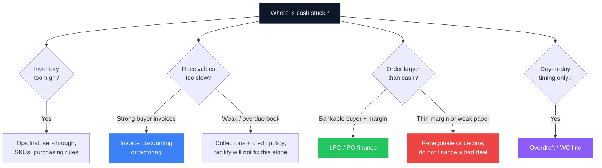

Most Kenyan SMEs do not fail because they lack customers. They fail because cash arrives later than bills. You can be profitable on the P&L, fully booked for the quarter, and still unable to pay rent, payroll, or a supplier who wants cash before delivery. That is not bad luck. It is a **working capital cycle** problem: money is trapped in stock, unpaid invoices, or orders you cannot afford to fulfil.

Banks see this before you name it. When an RM opens your statements, they are not only asking “are you profitable?” They are asking “how long does a shilling take to leave the business and come back?” If that loop is slow, expensive, or unmeasured, every growth step feels like a cash crisis.

> **Key Insight:** Working capital is not a leftover after profit. It is a **position** you design: how much inventory you hold, how long customers take to pay, how long suppliers let you wait, and which facility covers the gap without destroying margin. Measure the cycle first. Choose the facility second.

```cards
- icon: RefreshCw
  title: Map the cycle
  desc: Measure days inventory, receivables, and payables before you pick any facility. A number beats a story in every credit conversation.
  linkText: Read the ratios guide
  linkUrl: /blog/sme-financial-ratios-kenya
- icon: Landmark
  title: Match the facility
  desc: Overdraft for smooth operating gaps; invoice tools when B2B collections lag; LPO finance when the order is bankable but your cash is not.
  linkText: LPO finance guide
  linkUrl: /blog/lpo-purchase-order-finance-kenya
  type: amber
- icon: Handshake
  title: Structure with an RM
  desc: Clean packs, multi-bank setup, and pricing negotiation beat shopping advertised rates alone.
  linkText: Book a session
  linkUrl: /contact
  type: emerald
```

---

### What Working Capital Actually Is

**Working capital** is the money tied up in running the business day to day:

$$
\text{Working Capital} = \text{Current Assets} - \text{Current Liabilities}
$$

In plain language for a trading or manufacturing SME:

- **Current assets that matter:** cash, stock (inventory), and [accounts receivable](/blog/what-is-accounts-receivable) (invoices clients have not paid).
- **Current liabilities that matter:** supplier payables, short-term bank facilities (overdrafts, revolving credit), VAT/PAYE arrears, and other bills due within a year.

Positive working capital means current assets exceed short-term obligations. It does **not** automatically mean you are liquid. You can have a large positive figure that is almost entirely stuck in slow-moving stock and 90-day government invoices - while Friday’s payroll still needs cash.

That is why relationship managers care about the **cycle**, not only the stock figure on the balance sheet.

---

### The Cash Conversion Cycle (The Number That Explains Everything)

The cash conversion cycle (CCC) answers one question: **how many days does cash stay outside the business between buying inputs and collecting from customers?**

$$
\text{CCC} = \text{DIO} + \text{DSO} - \text{DPO}
$$

| Metric | Full name | What it measures | Direction that helps cash |
|---|---|---|---|
| **DIO** | Days Inventory Outstanding | How long stock sits before it is sold | Lower |
| **DSO** | Days Sales Outstanding | How long customers take to pay after sale | Lower |
| **DPO** | Days Payable Outstanding | How long you take to pay suppliers | Higher (within trust) |

A shorter CCC means cash returns faster. A longer CCC means growth consumes more cash every time sales rise - the classic “we are busier than ever and broker than ever” trap.


---

### Worked Example: Mama Chai Foods Ltd

Use the same style of numbers you would pull from management accounts (the ratio guide uses a similar company for consistency).

| Line | Amount |
|---|---|
| Annual COGS | KES 7,800,000 |
| Average inventory | KES 1,000,000 |
| Annual credit sales | KES 12,000,000 |
| Average receivables | KES 1,000,000 |
| Average trade payables | KES 900,000 |

$$
\text{DIO} = \frac{1{,}000{,}000}{7{,}800{,}000} \times 365 \approx 47 \text{ days}
$$

$$
\text{DSO} = \frac{1{,}000{,}000}{12{,}000{,}000} \times 365 \approx 30 \text{ days}
$$

$$
\text{DPO} = \frac{900{,}000}{7{,}800{,}000} \times 365 \approx 42 \text{ days}
$$

$$
\text{CCC} = 47 + 30 - 42 = 35 \text{ days}
$$

**What that means:** on average, Mama Chai needs to fund about **35 days** of operating cycle with its own cash or a facility. If monthly COGS run roughly KES 650,000, a rough working-capital need is on the order of a month of cost of sales - before seasonality, safety stock, or slow payers.

If DSO drifts from 30 to 60 days (common when a few large clients stretch terms), CCC jumps to **65 days** and the cash need nearly doubles without any change in “profitability.” That single shift is why [AR discipline](/blog/what-is-accounts-receivable) is a financing strategy, not only a collections chore.

---

### Where Kenyan SMEs Get Stuck (Four Failure Modes)

**1. Inventory that feels like wealth.** Bulk buying to “save on price” locks cash. If stock turns twice a year, you are running a warehouse financed by overdraft interest. Track dead stock monthly; finance cannot fix what operations will not clear.

**2. Receivables that feel like sales.** Invoice issued is not cash received. Government and large corporates often run 60–180 day cycles. Winning the tender without planning the gap is how profitable suppliers go insolvent. See also [LPO finance](/blog/lpo-purchase-order-finance-kenya) when the problem is *funding the order*, not only collecting after delivery.

**3. Paying suppliers faster than customers pay you.** Early settlement discounts can be smart; habitual cash-on-delivery while selling on 45-day terms is a structural loss. Negotiate DPO deliberately - without destroying supplier trust.

**4. Mixed personal and business cash.** Salary drawings, school fees, and stock purchases on one account destroy CCC measurement and [credit readiness](/blog/anatomy-of-a-bank-proposal-kenya). Banks underwrite the business they can see.

```cards
- icon: Package
  title: Inventory drag
  desc: Slow-moving stock is a silent loan to your own warehouse. Cut dead SKUs before you increase the overdraft limit.
  linkText: Margin discipline
  linkUrl: /blog/sme-packager-optimization
- icon: FileText
  title: Receivables drag
  desc: Stretching DSO is the most common growth tax. Age invoices every two weeks and escalate before 60 days.
  linkText: AR survival guide
  linkUrl: /blog/what-is-accounts-receivable
  type: amber
- icon: Truck
  title: Order-fulfilment drag
  desc: A large LPO with thin margin and long public-sector payment is a working-capital event, not a sales win.
  linkText: Fund the order
  linkUrl: /blog/lpo-purchase-order-finance-kenya
  type: emerald
```

---

### Match the Facility to the Gap (Not the Advert)

Once you know *where* cash is stuck, product choice becomes logical.

| Gap you face | Better fit | Poor fit | Why |
|---|---|---|---|
| Uneven weekly cash, ongoing trading | **Overdraft / revolving working-capital line** | Long-term asset loan | You need flexible draw and repay, not a 48-month amortising loan for stock |
| Delivered invoices unpaid (strong buyers) | **Invoice discounting / factoring** | Expensive mobile loans | You are monetising a receivable, not borrowing against hope |
| Large order you cannot fund to deliver | **LPO / purchase-order finance** | Maxing personal credit cards | Lender underwrites the order and buyer; structure matches the cycle |
| Equipment or vehicles that earn over years | **Asset finance** | Funding machines on overdraft | Match tenor to asset life; protect WC line for stock and debtors |
| One-off temporary squeeze | Short facility + collection plan | Permanent limit increase with no process change | Limits without CCC improvement just fund inefficiency |

> **Key Insight:** The wrong product is often more expensive than a slightly higher rate on the right product. An overdraft used as a five-year machine loan, or an LPO facility used to fund perpetual dead stock, will show up as chronic limit stress and awkward annual reviews.

The most common version of this mistake is the overdraft that stops returning to zero and becomes permanent debt at a flexibility price. [The Overdraft That Never Clears](/blog/overdraft-that-never-clears-kenya) covers the daily-utilisation pricing, the clean-down covenant, the statement pattern a lender reads as hardcore, and the arithmetic of terming it out.

For how banks price risk and facilities more broadly, see [how Kenyan banks price loans](/blog/how-kenyan-banks-price-loans) and the [SME finance handbook](/blog/sme-finance-handbook-kenya). For comparing asset finance to conventional borrowing, use [asset finance vs conventional loans](/blog/asset-finance-vs-conventional-loans).



---

### How Much Working Capital Do You Need?

A practical planning approach (good enough for board packs and bank conversations):

1. **Compute CCC** from the last 12 months (or trailing four quarters).
2. **Estimate daily cash operating need** ≈ annual COGS (or cash operating costs) ÷ 365.
3. **Base WC requirement** ≈ daily need × CCC.
4. **Add buffers:** seasonality (school terms, festive trade, harvest), one large slow payer, and a safety stock policy you can defend.
5. **Subtract** reliable non-cash support (stable supplier credit, customer advances, confirmed facilities).

$$
\text{Rough WC need} \approx \left(\frac{\text{Annual COGS}}{365}\right) \times \text{CCC} + \text{Seasonal buffer}
$$

This is a planning model, not a statute. Lenders will still look at [financial ratios](/blog/sme-financial-ratios-kenya), account conduct, CRB, and industry norms. But owners who walk in with CCC, aging, and a facility map get better conversations - and often better structures - than owners who only say “we need two million more limit.”

---

### What Your RM Looks For in a Working-Capital Conversation

Bring a file that answers these without theatre:

- **13-week cash-flow** (or at least a monthly view for two quarters) with assumptions written down  
- **Aging of receivables and payables** (0–30, 31–60, 61–90, 90+)  
- **Stock summary** by category: fast movers vs dead stock  
- **Top 10 customers and suppliers** with terms  
- **Existing facilities:** limits, utilisation, security, next review date  
- **Purpose of any increase:** stock build, tender, temporary delay - not “general pressure”

Account conduct still matters: bounced cheques, constant limit maxing, and tax arrears read as control problems. For the proposal narrative itself, use [anatomy of a bank proposal](/blog/anatomy-of-a-bank-proposal-kenya). For why a relationship manager is part of the system, not a formality, see [why your RM is an SME growth asset](/blog/why-rm-is-sme-growth-asset).

```cards
- icon: Calculator
  title: Know your CCC
  desc: DIO + DSO − DPO is the single number that turns “we are tight” into a bankable diagnosis.
  linkText: Seven ratios explained
  linkUrl: /blog/sme-financial-ratios-kenya
- icon: Building2
  title: Build the pack
  desc: Aging, stock, cash-flow, and purpose beat a vague request for a higher limit.
  linkText: Bank proposal anatomy
  linkUrl: /blog/anatomy-of-a-bank-proposal-kenya
  type: amber
- icon: Scale
  title: Price the true cost
  desc: Compare facilities on all-in cost and cycle fit, not the headline rate on a flyer.
  linkText: How banks price loans
  linkUrl: /blog/how-kenyan-banks-price-loans
  type: emerald
```

---

### Operating Levers That Beat Another Loan

Facilities are tools. Process is the strategy.

- **Sell or write down dead stock** before asking for inventory finance.  
- **Tighten credit terms** for new customers; require deposits where leverage allows.  
- **Invoice same day** as delivery or milestone - delays here silently extend DSO.  
- **Remind before due date**; escalate on a fixed calendar.  
- **Negotiate supplier terms** after you have proven volume, not only at the first order.  
- **Separate accounts** for operations, tax, and owner drawings so the cycle is visible.  
- **Prefer advances or staged payments** on large contracts instead of 100% arrears billing.  
- **Do not use expensive mobile or card debt** as permanent working capital - see [the real cost of digital loans](/blog/mobile-digital-loans-real-cost-kenya) and [credit-card grace mechanics](/blog/credit-card-interest-free-period).

---

### A Simple Quarterly Rhythm

| Week in quarter | Action |
|---|---|
| Week 1 | Refresh DIO, DSO, DPO, CCC; update aging |
| Week 2 | Kill or discount dead stock; chase 60+ day invoices |
| Week 3 | Review facility utilisation vs plan; flag covenant or review dates |
| Week 4 | Re-forecast next 13 weeks; decide if structure (not only limit) must change |

Run this for four quarters and you will know more about your business than most annual audits reveal - and you will walk into bank meetings as a manager of cash, not a petitioner for it.

---

### Closing

Growth that outruns the working capital cycle feels like success until it feels like a crisis. The fix is rarely “more hustle.” It is **measure the loop, shorten what you control, finance what you must, and refuse deals whose margin cannot survive the cost of the gap**.

If you know your CCC, your aging, and which of inventory, receivables, or order fulfilment is the bottleneck, you already speak the language your bank uses. From there, choosing overdraft, invoice tools, or [LPO finance](/blog/lpo-purchase-order-finance-kenya) becomes a design decision - not a panic response.

When you want a second pair of eyes on the structure - facility mix, pack quality, or multi-bank setup - use the [services](/services) page or [book a session](/contact). Working capital is where strategy and banking meet; treat it that way and the business can scale without living permanently one supplier payment away from failure.
