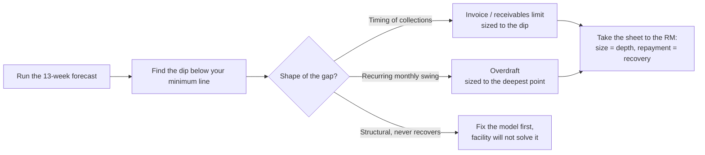

Most Kenyan businesses that fail are not unprofitable. They are profitable and out of cash at the same time, which is a distinction the owner usually understands only in hindsight. A business can book a healthy margin on paper, be owed money it will genuinely collect, hold stock it will genuinely sell, and still be unable to pay salaries on the 28th. Profit is what you earned. Cash is what you can spend. The gap between them is where companies quietly die.

The instrument that closes that gap is not the profit-and-loss statement, which looks backward and ignores timing, nor the balance sheet, which is a snapshot. It is a **rolling 13-week cash forecast**: a simple weekly spreadsheet showing money in, money out, and the running cash balance, thirteen weeks ahead. Thirteen weeks is one quarter, far enough to see a squeeze coming while it can still be managed, close enough that the numbers are real rather than guessed.

This guide builds the forecast from an empty sheet, adds the three scenario columns that turn it from a record into a decision tool, and shows how the finished sheet becomes the strongest thing you can put in front of a bank when you need a facility. History, the ratios and statements covered in [how to read financial statements](/blog/how-to-read-financial-statements-kenya) and [the SME ratios guide](/blog/sme-financial-ratios-kenya), tells you where you have been. The forecast is the only tool that tells you where the cash is going.

> **Key Insight:** A cash forecast is not an accounting exercise, and you do not need an accountant to run one. It is a weekly discipline of writing down what is actually contracted to arrive and what is actually due to leave, then reading the running balance for the week it goes negative. That week, spotted eight weeks early, is a problem you solve with a phone call. Spotted on the day, it is a crisis you solve by not paying someone.

```cards
- icon: CalendarRange
  title: Thirteen weeks, one quarter
  desc: Far enough ahead to act, close enough that the numbers are contracted rather than hoped for. Roll it forward one week, every week.
- icon: TrendingDown
  title: Find the negative week early
  desc: The whole point is the row that shows your cash balance dipping below zero, or below your minimum line, weeks before it happens.
- icon: Landmark
  title: It sizes your facility for you
  desc: The depth and duration of the dip is exactly the overdraft or invoice limit to ask for. Walk into the bank with the number, not a vague worry.
  linkText: How banks read the ask
  linkUrl: /blog/anatomy-of-a-bank-proposal-kenya
  type: emerald
```

---

### Part 1: Why History Cannot Warn You

The reports a business already produces are all backward-looking or timing-blind, and each fails to warn you for a specific reason.

- **The profit-and-loss statement** records a sale when you invoice it, not when the customer pays. A month can show a strong profit while not one shilling of it has arrived. It cannot show you a cash gap because it does not track cash timing at all.
- **The balance sheet** shows what you own and owe on one day. It tells you that you *have* receivables and stock; it does not tell you *when* the receivables turn into money or the stock turns into sales.
- **The bank balance** is the truest of the three but the least useful for planning, because it only tells you today. By the time the bank balance shows the problem, the problem has already arrived.

The cash forecast is different in kind. It takes the timing that the P&L ignores and projects it forward: not "did we make money?" but "on which specific Friday do we not have enough to cover what is due?" That question has an answer, and the answer is actionable precisely because it is dated.

This is the forward half of the working-capital story. [The working capital cycle](/blog/working-capital-cycle-kenya-smes) explains why cash gets trapped in the gap between paying suppliers and collecting from customers; the 13-week forecast is how you see the trap opening before you fall into it.

---

### Part 2: Building the Sheet, Column by Column

Open a blank spreadsheet. You are building a grid: **rows are cash-flow lines, columns are the next thirteen weeks.** Date the columns as week-ending Fridays so every week has a clear close.

The structure, top to bottom, is always the same five blocks.

**Block 1: Opening cash.** The first row of each week is the cash you start the week with. For Week 1 this is your actual bank balance today (plus any cash float you genuinely control). For every week after that, opening cash is simply last week's closing cash. This single link is what makes the sheet "roll".

**Block 2: Cash in.** List the money you expect to *receive*, week by week, split into two honesty-tiers:

- **Contracted inflows:** invoices already raised with known due dates, confirmed customer payments, a disbursed loan, a signed retainer. Money you can name the source of.
- **Expected sales:** new business not yet contracted. Real, but softer. Keep it on its own line so you can see how much of your survival depends on sales you have not yet made.

**Block 3: Cash out.** List the money due to *leave*, split into two:

- **Fixed outflows:** rent, salaries, loan instalments, statutory payments (PAYE, NHIF/SHIF, NSSF), licences, insurance. These arrive whether or not you sell anything.
- **Variable outflows:** supplier payments, stock purchases, fuel, casual labour, anything that scales with trading.

**Block 4: Net movement and closing cash.** Two calculated rows:

$$
\text{Net cash flow}_{\text{week}} = \text{Total in} - \text{Total out}
$$

$$
\text{Closing cash}_{\text{week}} = \text{Opening cash} + \text{Net cash flow}
$$

Then closing cash carries down to become next week's opening cash. That is the engine of the whole sheet.

**Block 5: The minimum cash line.** One more row, and the most important one: the lowest cash balance you are willing to operate on, your buffer. It is not zero. Zero means one late payment triggers a bounced cheque, a failed standing order, and a supplier who stops your account. Set a realistic floor, perhaps one to two weeks of fixed outflows, and draw it as a line across the sheet. The forecast's job is to warn you whenever closing cash is heading below that line, not just below zero.


---

### Part 3: A Worked Sheet

Here is a compressed six-week view of a small Nairobi trading business, so you can see the running balance do its work. (A real sheet runs the full thirteen weeks; six fit on the page.)

| Line (KES '000) | Wk 1 | Wk 2 | Wk 3 | Wk 4 | Wk 5 | Wk 6 |
|---|---|---|---|---|---|---|
| **Opening cash** | 420 | 505 | 340 | 95 | 210 | 60 |
| Contracted inflows | 300 | 180 | 150 | 600 | 120 | 150 |
| Expected sales | 120 | 100 | 90 | 100 | 110 | 120 |
| **Total in** | 420 | 280 | 240 | 700 | 230 | 270 |
| Fixed outflows | 185 | 185 | 185 | 385 | 185 | 185 |
| Variable outflows | 150 | 260 | 300 | 200 | 195 | 240 |
| **Total out** | 335 | 445 | 485 | 585 | 380 | 425 |
| Net cash flow | +85 | (165) | (245) | +115 | (150) | (155) |
| **Closing cash** | **505** | **340** | **95** | **210** | **60** | **(95)** |
| Minimum line (buffer) | 150 | 150 | 150 | 150 | 150 | 150 |

Read the closing-cash row against the minimum line and the story writes itself. The business looks comfortable in Week 1. But by **Week 3 it is below its buffer** (95 against a 150 floor), and by **Week 6 it is negative** (minus 95), meaning it cannot meet everything due that week. Note that Week 4 shows a big fixed outflow (salaries plus a quarterly payment of 385) and a large collection (600) landing together; the danger is not the average, it is the specific weeks where outflows cluster and inflows do not.

Crucially, this business may be perfectly profitable across the quarter. Total in over six weeks is more than total out. It still runs out of money in Week 6, because the timing is wrong, not the economics. That is the exact failure the forecast exists to catch, and catching it in Week 1 gives you five weeks to fix it.

---

### Part 4: The Three Scenarios That Make It a Decision Tool

A single-column forecast tells you what you expect. A business does not fail on what it expects; it fails on what it did not plan for. So the forecast earns its keep only when you run it three ways. The cleanest method is three copies of the closing-cash row, driven by three assumptions.

| Scenario | What you change | What it answers |
|---|---|---|
| **Base** | Your honest best estimate | What happens if things go roughly as planned? |
| **Slow collections** | Push contracted inflows 2 to 4 weeks later; halve expected sales | What if customers pay late and new sales are thin? |
| **Shock** | Remove the single largest customer's payment, or add one large unplanned cost | What if the one thing that must not go wrong, does? |

The "slow collections" case is the most important for Kenyan SMEs, because late payment is the national trading condition rather than the exception. If your base case survives but your slow-collections case goes deep negative in Week 5, you have not discovered a problem in the future, you have discovered a problem in your assumptions. You are one slow-paying customer away from a crisis, and now you know it while you can still act.

The **shock** column is where you pressure-test concentration. If losing one customer's payment for a single month sinks the whole sheet, the real finding is not a cash problem, it is that your business is dangerously dependent on one relationship, a risk the [SME risk management guide](/blog/sme-risk-management-kenya) treats as its own domain.

---

### Part 5: What the Forecast Tells You to Do

A dip below the line is not a verdict, it is a prompt. Depending on when and how deep the dip is, the response differs, and the forecast tells you which lever to reach for.

- **A shallow, short dip (a week or two, just below the buffer):** manage it operationally. Chase a specific invoice early, delay a discretionary purchase, ask one supplier for a fortnight's grace. No financing needed.
- **A deeper dip driven by collection timing:** this is what an **invoice/receivables facility** is for. If the gap is caused by money you are genuinely owed arriving too late, financing the invoice bridges exactly that gap. The mechanics are in [what accounts receivable financing actually does](/blog/what-is-accounts-receivable).
- **A recurring, sawtooth dip every month:** this is what an **overdraft** is for, a revolving buffer that swings in and out with the trading cycle. But watch the pattern: an overdraft that dips and recovers is healthy; one that never returns to zero has become permanent debt, the exact trap dissected in [the overdraft that never clears](/blog/overdraft-that-never-clears-kenya).
- **A structural, deepening gap that never recovers:** no working-capital facility fixes this, and borrowing to fill it only buys time at a cost. A forecast that trends down forever is telling you the business model has a cash problem that pricing, collections, or cost structure must solve first.

The discipline is matching the lever to the shape of the gap. The commonest financing mistake is using a permanent facility (a term loan or a never-clearing overdraft) to plug a temporary, timing-driven dip, and thereby converting a cash-flow wrinkle into a standing interest cost.

---

### Part 6: The Forecast Is Your Strongest Facility Application

Here is the part most owners miss: the 13-week forecast is not just a management tool, it is the single most persuasive document you can hand a relationship manager.

When you ask a bank for an overdraft or invoice limit without a forecast, you are asking them to guess how much you need and whether you can repay it, and banks price guesswork as risk. When you walk in with a forecast, you have already answered the two questions the RM must answer to approve anything:

- **How much?** The *depth* of the dip below your minimum line is the facility size. If the sheet says you go KES 800,000 below your buffer at the worst point, that is the overdraft you need, evidenced, not the round number you hoped for.
- **How, and when, does it get repaid?** The *recovery* in the sheet, the weeks where closing cash climbs back up, is your repayment story. A revolving facility that the forecast shows swinging back to positive is a facility a bank can approve with confidence.

This is precisely the evidence the credit assessment in [the anatomy of a bank proposal](/blog/anatomy-of-a-bank-proposal-kenya) is built to reward. An owner who can show the RM the specific weeks the gap opens and closes, under a base case and a stressed case, is demonstrating exactly the cash-flow control that the [5 C's of credit](/blog/how-kenyan-banks-price-loans) call "capacity". You have sized your own facility and pre-answered the risk questions. That is the difference between a facility priced as an unknown and one priced as a managed, temporary, self-liquidating need.



---

### Part 7: The Weekly Rhythm That Keeps It Honest

A forecast built once and forgotten is worse than none, because it breeds false confidence. The value is entirely in the update. Set a fixed 45 minutes, same time each week, and do four things:

1. **Roll it forward.** Delete the week just finished, add a new Week 13 at the far end. The sheet always shows the next thirteen weeks, never a shrinking window.
2. **Replace estimates with actuals.** Where a payment landed, put the real figure in. Where it did not, move it to the week you now expect it, and notice that you moved it.
3. **Re-read the closing-cash row against the line.** Has a new negative week appeared? Has an old one moved closer? That is the whole point of the update.
4. **Act on the earliest breach, once.** Do the one thing this week that addresses the nearest dip: the collection call, the delayed order, the conversation with the RM. Then close the sheet.

The habit is the asset. A business owner who spends 45 minutes every Monday with this sheet is never surprised by a cash crisis, because by definition they saw it thirteen weeks out. The spreadsheet is trivial; the routine is what separates the businesses that manage cash from the ones cash manages.

### Risk Factors

| Risk | How it shows in the forecast | The discipline |
|---|---|---|
| Optimistic inflows | "Expected sales" carrying the survival, not contracted money | Keep the two on separate lines; never let hope fund fixed costs |
| Late-payment reality | Base case survives, slow-collections case sinks | Plan to the slow case, not the base, in a late-paying market |
| Customer concentration | Removing one payer breaks the shock column | Treat it as a risk to fix, not just a number to watch |
| Zero buffer | Cash planned to run to nil | Set a minimum line of one to two weeks of fixed costs |
| Clustered outflows | A single week stacks salaries, tax, and a supplier | Read weekly, not monthly; averages hide the killer weeks |
| Set-and-forget | An old forecast breeding false comfort | The weekly roll-forward is the product, not the sheet |
| Wrong facility for the gap | Term debt used to plug a timing dip | Match the lever to the shape: invoice, overdraft, or fix the model |

### Decision Framework: Before You Trust the Sheet

**Is every inflow either contracted or clearly marked as hoped-for?** If you cannot tell which of your survival depends on sales you have not made, the forecast is lying to you comfortably.

**Have I set a minimum cash line above zero?** A buffer of one to two weeks of fixed outflows. Planning to zero is planning to bounce.

**Does the slow-collections scenario survive?** In Kenya this is the realistic case, not the pessimistic one. If it does not survive, act now, not when it arrives.

**Do I know the depth and duration of my worst dip?** Those two numbers are your facility size and your repayment story. If you cannot state them, you are not ready to ask a bank for anything.

**Am I updating it every week, same time, without fail?** The forecast that is not rolled forward is a historical document pretending to be a warning system.

### Bengula View

Three things I would tell any owner starting this.

First, **the forecast changes the emotional register of running a business**, and that alone is worth the hour a week. Owners without one live in a low, permanent anxiety about cash that spikes into panic near month-end. Owners with one have converted that free-floating dread into a specific, dated, solvable list: the Week 6 gap, the slow-paying customer, the clustered outflow in Week 4. Named problems are smaller than nameless ones, even when the numbers are identical.

Second, **it is the cheapest credibility a business can buy with a bank**. I have approved facilities faster and priced them better for owners who arrived with a competent 13-week forecast than for larger, more established businesses that arrived with a vague number and a good story, because the forecast answers capacity directly and the story does not. If you want to be treated as a lower risk, demonstrate that you already manage the risk. The sheet does that in a single page.

Third, **resist the urge to make it sophisticated**. There is a temptation to build a beautiful model with formulas, tabs, and automation. Do not, at least not first. A rough sheet updated religiously every week beats an elegant model updated when you remember, every time. The graduation to a proper system, the same path the [inventory guide](/blog/data-driven-inventory-small-shops-kenya) describes, comes later and only if volume demands it. Start with thirteen columns and an honest hour on Monday.

### Conclusion

The report that decides whether a Kenyan business survives the next quarter is not the profit-and-loss statement. It is the 13-week cash forecast, because it is the only one that answers the question that actually closes companies: on which specific week do we run out of money? Built from five simple blocks, stressed three ways, and rolled forward every Monday, it turns cash from the thing that ambushes you into the thing you manage.

And when a gap does appear, the same sheet tells you what to do about it: manage a shallow dip operationally, bridge a collection-timing gap with an invoice facility, cover a recurring swing with a right-sized overdraft, and fix the model where the gap never closes. Better still, it hands the bank the two numbers it needs to say yes: how much, and how it gets repaid. Build it this week.

### Related Reading

- [The Working Capital Cycle for Kenyan SMEs](/blog/working-capital-cycle-kenya-smes) for why cash gets trapped between paying suppliers and collecting from customers.
- [How to Read Financial Statements](/blog/how-to-read-financial-statements-kenya) for the backward-looking half the forecast complements.
- [Financial Ratios Every SME Owner Should Know](/blog/sme-financial-ratios-kenya) for reading the health behind the numbers.
- [The Anatomy of a Bank Proposal](/blog/anatomy-of-a-bank-proposal-kenya) for how the forecast becomes a facility application.
- [The Overdraft That Never Clears](/blog/overdraft-that-never-clears-kenya) for using a revolving facility without turning it into permanent debt.
- [What Accounts Receivable Financing Does](/blog/what-is-accounts-receivable) for bridging a collection-timing gap.
- [VAT for Kenyan SMEs](/blog/vat-for-smes-kenya) for the fixed 20th-of-the-month outflow that belongs in the forecast alongside payroll.
- [How to Move Money in Kenya: Payment Rails Compared](/blog/how-to-move-money-kenya-payment-rails) for choosing the rail, and beating the cut-off, on a payment the forecast says is due today.

### References

- [Central Bank of Kenya](https://www.centralbank.go.ke/). Context on SME lending, working-capital facilities, and the pricing framework banks apply.
- [Kenya Revenue Authority](https://www.kra.go.ke/). Statutory payment calendars (PAYE, VAT) that drive the fixed-outflow timing in the forecast.
- [Total Cost of Credit portal](https://www.costofcredit.co.ke/). Compare the cost of overdrafts and short-term facilities across regulated lenders once the forecast has sized the need.

*All figures in the worked example are illustrative and used to show the mechanics of a rolling cash forecast. Build the sheet with your own contracted inflows, dated outflows, and honest scenarios.*

*General business education, not individualized financial or accounting advice. For complex cash-flow, tax-timing, or facility-structuring decisions, work with a qualified accountant and your relationship manager.*
