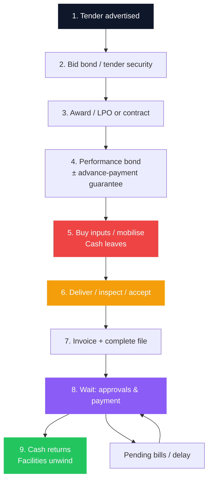
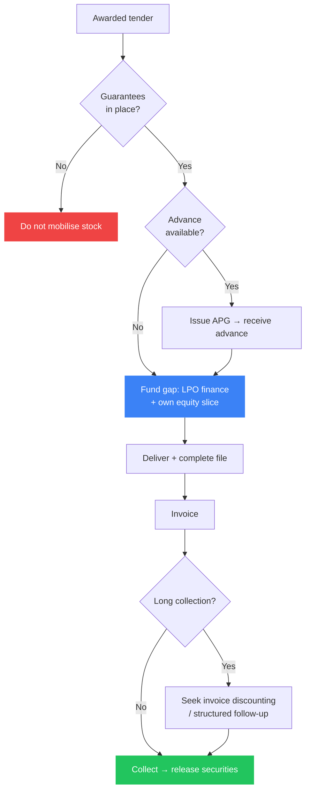

Every year, Kenyan SMEs celebrate the same dangerous victory: **they win the tender**. The portal shows “awarded.” The WhatsApp group congratulates. The owner starts buying stock - or borrowing to buy stock - before anyone has modelled **when cash actually returns**.

Public procurement and **AGPO** (Access to Government Procurement Opportunities) exist to open doors for youth-, women-, and PWD-owned enterprises and for broader SME participation in government spend. The policy intent is real. The **cash-flow physics** are also real: you often fund fulfilment first, wait on inspection and paperwork, then wait again on the exchequer - while [bid and performance guarantees](/blog/bank-guarantees-kenya-sme-guide) quietly freeze collateral and [working capital](/blog/working-capital-cycle-kenya-smes) disappears into a single buyer.

> **Key Insight:** A tender is a **project balance sheet**, not a sales trophy. Before you bid, compute the **working-capital gap** - cost to deliver minus advance minus cash you can safely deploy - then add guarantee costs and a realistic **90–180 day** collection tail for many public buyers. If the margin cannot survive that stack, declining the tender is strategy, not fear.

```cards
- icon: Gavel
  title: Bid only bankable work
  desc: Clean AGPO/registration status and a margin thick enough for finance and delay beat winning thin paper you cannot fund.
  linkText: SME finance map
  linkUrl: /blog/sme-finance-handbook-kenya
- icon: ShieldCheck
  title: Price the guarantees
  desc: Bid, performance, and advance-payment bonds consume limits and often cash margin before the first delivery note.
  linkText: Bank guarantees guide
  linkUrl: /blog/bank-guarantees-kenya-sme-guide
  type: amber
- icon: Truck
  title: Fund the fulfilment gap
  desc: LPO/PO finance, supplier terms, and controlled collection - not personal mobile loans - belong on public orders.
  linkText: LPO finance guide
  linkUrl: /blog/lpo-purchase-order-finance-kenya
  type: emerald
```

---

### What AGPO Is (and What It Is Not)

**AGPO** is Kenya’s preference framework that channels a share of public procurement toward eligible enterprises (commonly discussed as the **30%** set-aside for youth, women, and persons with disabilities, alongside broader SME access rules). In practice you will meet:

- Registration / certification requirements for the preference categories you claim  
- Tender notices reserved or preferential for AGPO-eligible bidders  
- The same **performance, documentation, and payment** realities as other public contracts once awarded  

**AGPO is not:**

- Instant payment  
- Free working capital  
- A waiver of bid securities, performance bonds, or tax compliance  
- Protection from rejection of goods or services that fail inspection  

Treat AGPO as a **door into the queue**. Survival depends on how you fund and document the journey through that queue.

Official procurement rules and portals change; always read the **specific tender document** and current PPRA / AGPO guidance for eligibility, securities, and evaluation. This article is cash-flow education, not a substitute for the tender file.

---

### The Tender Cash Cycle (Where SMEs Actually Break)



The fatal misunderstanding is treating step 3 as income. **Award is a claim on future cash contingent on performance and paperwork.** Steps 5–8 are where solvent businesses become “busy and broke.”

---

### The Working-Capital Gap Formula

Before you bid, force a one-page model:

$$
\text{WC gap} \approx \text{Cost to deliver} - \text{Advance received} - \text{Own cash available}
$$

Then stress it:

$$
\text{Stressed need} \approx \text{WC gap} + \text{Guarantee cash margin} + \text{Delay buffer (interest \& holding costs)}
$$

| Input | What to put in the model |
|---|---|
| **Cost to deliver** | Supplier quotes, transport, packaging, subcontractors, statutory costs - not “hopeful” unit costs |
| **Advance** | Only amounts the contract **actually** pays after any [APG](/blog/bank-guarantees-kenya-sme-guide) is in place |
| **Own cash** | Surplus after payroll, tax, and emergency buffer - not the overdraft you already live on |
| **Guarantee drag** | Commission + opportunity cost of locked FD/cash ([full pricing](/blog/bank-guarantees-kenya-sme-guide)) |
| **Delay buffer** | Interest on [LPO finance](/blog/lpo-purchase-order-finance-kenya) or OD for **90–180 days** if the buyer is public |

If stressed need exceeds facilities you can **pre-arrange**, do not bid - or bid a smaller lot.

---

### Stage-by-Stage Survival Rules

#### 1. Before the bid

- Confirm **AGPO / business registration**, tax compliance, and capacity evidence the tender requires  
- Read securities: bid bond amount, performance %, advance terms, liquidated damages  
- Run the WC gap model at **honest margins** (see [packager margin discipline](/blog/sme-packager-optimization))  
- Speak to your bank or SACCO **before** portal submission if the contract would consume your whole contingent limit  

#### 2. Bid bond issued

- Diary expiry and extension risk  
- Treat limit utilisation as real - another tender may be blocked until release  
- Losing bids should trigger **prompt discharge** follow-up so cash margin returns  

#### 3. Award and contract / LPO

- Verify the document the way a lender will ([LPO verification culture](/blog/lpo-purchase-order-finance-kenya))  
- Do not buy the full inventory on verbal “you’ve won” messages  
- Map **inspection and acceptance** clauses - payment stories die on missing certificates  

#### 4. Performance and advance-payment guarantees

- Price them inside the bid; do not discover cash collateral after award  
- Advances are **not profit** - amortise against delivery; keep APG release conditions visible  
- Detail in the [guarantees guide](/blog/bank-guarantees-kenya-sme-guide)

#### 5. Fulfilment

- Prefer **supplier terms** or [LPO/PO finance](/blog/lpo-purchase-order-finance-kenya) over personal credit cards and mobile loans ([digital loan costs](/blog/mobile-digital-loans-real-cost-kenya))  
- Keep the fulfilment file: delivery notes, GRNs, inspection sheets, photos if useful  
- Partial delivery rules matter - do not assume you can invoice the whole contract early  

#### 6. Invoice and the long wait

- Invoice **immediately** on acceptance with a complete attachments pack  
- Public payment cycles often run far longer than private 30-day terms; plan **90–180 days** unless you have hard evidence this entity pays faster  
- Age the receivable ruthlessly ([accounts receivable](/blog/what-is-accounts-receivable))  
- Where lenders allow, **handover** from expensive order finance into invoice discounting after acceptance - the LPO article’s public-sector playbook  

```cards
- icon: FileText
  title: Paper is cash
  desc: Incomplete inspection and acceptance files are the quiet reason “the ministry has not paid.” Build the file as you deliver.
  linkText: AR and collections
  linkUrl: /blog/what-is-accounts-receivable
- icon: Timer
  title: Assume slow pay
  desc: Budget interest and holding costs for long public cycles. Surprise speed is upside; surprise delay is default.
  linkText: Working capital cycle
  linkUrl: /blog/working-capital-cycle-kenya-smes
  type: amber
- icon: ArrowLeftRight
  title: Refinance the stage
  desc: Order finance for fulfilment; invoice tools after acceptance. One product for the whole journey is often the wrong price.
  linkText: LPO then invoice
  linkUrl: /blog/lpo-purchase-order-finance-kenya
  type: emerald
```

---

### Worked Example: The Tender That Looks Profitable

**Contract:** supply goods, **KES 4,000,000**  
**Fulfilment cost:** **KES 3,200,000** (20% gross margin before finance)  
**Advance:** none in year one of dealing with this entity  
**Performance guarantee:** 10% face (**KES 400,000**), 50% cash margin locked six months  
**Collection:** **120 days** after invoice  

| Line | Amount (illustrative) |
|---|---|
| Gross margin before finance | KES 800,000 |
| LPO-style finance on 75% of cost @ 6% all-in for the cycle | ~KES 144,000 on KES 2,400,000 funded |
| Guarantee commission (illustrative) | KES 15,000 |
| Opportunity cost on KES 200,000 margin @ 10% p.a. for 6 months | KES 10,000 |
| **Margin after finance stack** | **~KES 631,000** |

Still viable - **if** nothing slips. Stretch collection to 180 days, hit a partial rejection, or fund on 30%+ mobile-style APR, and the “win” becomes a loss. That is why the LPO guide’s **~15%+ gross margin** rule of thumb before order finance matters even more on public paper.

**Same contract at 10% gross margin** (cost KES 3,600,000): after similar finance drag, you are funding stress for almost no equity return. **Do not bid.**

$$
\text{Finance-aware margin} = \text{Contract value} - \text{Fulfilment} - \text{All-in finance} - \text{Guarantee stack} - \text{Penalty risk}
$$

---

### Facility Map for Tendering SMEs

| Stage need | Better instrument | Avoid |
|---|---|---|
| Tender security | Bid bond under a contingent line | Personal post-dated cheques as “professionalism” |
| Contract security | Performance guarantee | Hoping the PE waives what the tender requires |
| Mobilisation cash from buyer | Advance + APG, if offered | Spending advance on unrelated debts |
| Pay suppliers to deliver | [LPO / PO finance](/blog/lpo-purchase-order-finance-kenya), supplier credit | Maxing personal digital loans |
| Bridge accepted invoices | Invoice discounting / factoring where available | Silent forbearance with no escalation plan |
| Day-to-day unevenness | Overdraft sized to CCC | Using OD as a five-year capital loan |

Structure multi-product limits **before** peak tender season. Anatomy of how banks read the pack: [bank proposal](/blog/anatomy-of-a-bank-proposal-kenya). Broader menu: [SME finance handbook](/blog/sme-finance-handbook-kenya).



---

### Concentration and “One Big Tender” Risk

Public buyers are strong credits **in theory** and lumpy payers **in practice**. Risks that kill SMEs:

- **Single-entity dependence:** one ministry or county is your whole book  
- **Pending bills culture:** legally owed money that still starves cash  
- **Change of officials / budget freeze** mid-contract  
- **Variation orders** done verbally - unpaid scope creep  
- **Blacklisting risk** from non-performance after you under-capitalised the job  

**Portfolio rule:** no single tender should require more cash than you can lose without missing payroll and tax. Scale lots as facilities and equity grow - the same compounding logic as repeat LPO track records in the [LPO guide](/blog/lpo-purchase-order-finance-kenya).

---

### Documentation Discipline (The Argument Is the File)

In a payment dispute with a public entity, **the file is the argument**:

- Tender / contract / LPO  
- Bid and performance security copies and release letters  
- Delivery notes, GRNs, inspection and acceptance certificates  
- Invoices aligned to accepted quantities  
- Correspondence log (dates matter)  
- Tax invoices / [eTIMS](/blog/etims-kenya-sme-guide) trail consistent with bank credits  

Banks financing you will ask for the same pack. Build it **during** delivery, not three months into a chase.

---

### When Not to Bid (A Short, Unpopular List)

1. Margin cannot survive finance + 120-day delay  
2. Contingent limits or cash margin would freeze the rest of the business  
3. You have never delivered comparable scope and cannot subcontract safely  
4. Title of the “deal” is a brokered LPO you cannot verify  
5. You would need to raid PAYE/VAT money to buy stock  
6. Personal guarantors and family savings are the only “facility”  
7. The tender timeline is shorter than your real supply lead time  

Walking away preserves the AGPO certificate for a **survivable** contract.

```cards
- icon: CircleX
  title: Decline thin paper
  desc: A 10% gross public supply deal funded on expensive short credit is often a loss dressed as empowerment.
  linkText: Margin case study
  linkUrl: /blog/sme-packager-optimization
- icon: Landmark
  title: Pre-clear the bank
  desc: Contingent limits, LPO appetite, and security mix should be known before you upload the bid.
  linkText: Why your RM matters
  linkUrl: /blog/why-rm-is-sme-growth-asset
  type: amber
- icon: ListChecks
  title: Bid with a model
  desc: WC gap, guarantee stack, and collection tail on one page - then submit.
  linkText: Book a session
  linkUrl: /contact
  type: emerald
```

---

### 30-Day Prep for Serious Tenderers

| Week | Focus |
|---|---|
| **1** | Update AGPO/eligibility docs, KRA compliance, company registry papers |
| **2** | Meet bank/SACCO: guarantee headroom, LPO line, invoice options; get indicative pricing |
| **3** | Build supplier lead times and quote validity; draft the WC gap spreadsheet template |
| **4** | Only then shortlist live tenders whose lot size fits the pre-cleared stack |

Pair this with clean account conduct and CRB hygiene ([credit score](/blog/credit-score-kenya-guide)) so approvals move when a notice drops with a short deadline.

---

### Closing

AGPO and open government tenders can scale an SME faster than almost any private cold-call pipeline. They can also **concentrate working-capital risk** into one slow-paying, document-heavy buyer. The operators who last treat every notice as a **mini investment memo**: eligibility, margin, guarantee drag, fulfilment funding, collection tail, and concentration limit.

Use [bank guarantees](/blog/bank-guarantees-kenya-sme-guide) for the securities stack, [LPO finance](/blog/lpo-purchase-order-finance-kenya) for the order gap, [accounts receivable](/blog/what-is-accounts-receivable) for the collection phase, [the contractor cash flow stack](/blog/contractor-cash-flow-stack-kenya) for the bid-to-retention sequence, and the [working capital cycle](/blog/working-capital-cycle-kenya-smes) for the system view. When you want a facility map sized to your tender pipeline - not a single panicked application the night before closing - explore [services](/services) or [book a session](/contact).

Win work your balance sheet can finish. That is how preference schemes become wealth instead of a story about the year the big LPO almost killed the company.
