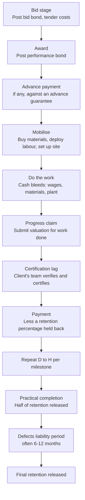

A contractor wins a KES 40 million tender, celebrates, and is broke within two months. The job is profitable, the client is good for the money, and the contractor still cannot pay the fundi on Friday. This is not bad luck and it is not rare; it is the structural shape of contract work, and it destroys competent builders and suppliers every year in Kenya.

The reason is timing. On a contract, the cash goes out first and comes in last. You post a bid bond to be allowed to bid. You buy materials and mobilise labour before you have certified a shilling of work. You wait weeks for a progress certificate, then more weeks for payment against it. And a slice of everything you earn is held back as retention until months after the job is done. The margin is real, but it arrives late and in pieces, while the costs arrive early and in full.

Surviving contract work is therefore not mainly about winning tenders or building well. It is about running a **cash-flow stack**: a sequence of financial instruments, each matched to a stage of the contract, that keeps you solvent through the gap between spending and being paid. This guide walks the stack stage by stage and shows how the tools you may already know in isolation, guarantees, LPO finance, and tender cash-flow discipline, fit together into one operating system.

> **Key Insight:** A contract does not pay you when you do the work. It pays you weeks after someone certifies the work, minus a retention it keeps for months. Your job as a contractor is to fund the distance between "money spent" and "money received", and to price the cost of that funding into your bid before you win it. Contractors who discover this after signing are already losing; the funding cost was always there, they just did not charge for it.

```cards
- icon: FileSignature
  title: Guarantees are priced, not free
  desc: Bid, performance, and advance guarantees each carry a fee and tie up limit. Build their cost into the tender margin, not into your overdraft afterwards.
  linkText: How guarantees work
  linkUrl: /blog/bank-guarantees-kenya-sme-guide
  type: amber
- icon: Hourglass
  title: The gap is the enemy
  desc: Money leaves for materials and labour weeks before a progress certificate turns into payment. Fund the gap deliberately, or it funds itself out of your survival.
- icon: Landmark
  title: Public work pays late, not never
  desc: Government contracts are good money on a slow, uncertain clock. Plan for the delay; AGPO and LPO tools exist precisely to bridge it.
  linkText: Tender cash-flow playbook
  linkUrl: /blog/agpo-tender-cash-flow-kenya
  type: emerald
```

---

### Part 1: The Contractor Cash Cycle, Start to Finish

Before the tools, the map. Every contract, large or small, public or private, runs the same cash sequence, and the cash balance dips deepest exactly when the work is most intense.



Two features of that cycle cause almost all contractor cash failures.

**The bleed before the certificate.** Between mobilising (D) and being paid (H), you are spending continuously and receiving nothing. On a large milestone this gap can run six to ten weeks, and it repeats every cycle. This is the deep water.

**The retention tail.** A percentage of every payment, commonly 5% to 10%, is held back and released only at practical completion and then after the defects period, often a year later. On thin contractor margins, the withheld retention can exceed the entire profit on the job. You can complete a contract, be owed nothing on the main works, and still be waiting a year for the money that was actually your margin.

Everything in the stack below exists to survive one of those two features.

---

### Part 2: Pricing the Guarantees Into the Bid

Guarantees are the entry ticket to serious contract work, and contractors routinely treat them as a free formality. They are not free, and mispricing them starts the job at a loss.

Three guarantees recur:

| Guarantee | When | What it protects | Typical shape |
|---|---|---|---|
| **Bid / tender bond** | To be allowed to bid | Client, if you win and then walk away | Small % of tender value, short-lived |
| **Performance bond** | On award | Client, if you fail to deliver | Often 10% of contract value, runs the whole job |
| **Advance payment guarantee** | If you take an advance | Client's advance, until you have worked it off | Equal to the advance, reduces as you deliver |

Each of these does two things to your finances, and you must price both.

First, **each carries a fee**, typically an annual percentage of the guaranteed amount, charged by the bank that issues it. On a KES 40 million contract, a 10% performance bond is a KES 4 million guarantee; even a modest fee on that, running for the length of the job, is real money that must sit inside your quoted price.

Second, **each consumes your facility limit**. A guarantee is a contingent liability the bank carries for you, and it counts against the limit the bank has granted you, exactly as a loan would. Post a large performance bond and you may have less headroom left for the overdraft you need to fund mobilisation. The guarantee and the working-capital facility compete for the same limit, so plan them together, not separately. The full mechanics, including how banks assess and price these, are in the [guide to bank guarantees for SMEs](/blog/bank-guarantees-kenya-sme-guide).

The discipline is simple and widely skipped: **before you submit a tender price, add up every guarantee fee across the expected life of the contract, and put that figure into the bid as a cost.** A contractor who prices the build correctly but forgets the guarantee fees has quietly given the client a discount out of their own margin.


---

### Part 3: Funding Mobilisation, With or Without an Advance

Mobilisation is the first cash cliff: you must buy materials, hire plant, and put people on site before any work is certified. There are three ways to fund it, in rough order of preference.

**The advance payment, worked off honestly.** Many contracts, especially public ones, offer an advance (often 10% to 20% of contract value) against an advance payment guarantee. This is the cheapest mobilisation money there is, because it is the client's own cash. The catch is discipline: the advance is *recovered* from your later payment certificates, so every certificate is reduced until the advance is repaid. Treat the advance as a loan you are already spending down, not as profit that has arrived early. Contractors who spend the advance as windfall find their mid-contract certificates mysteriously thin, because the advance is being clawed back exactly when the bleed is deepest.

**LPO or purchase-order financing for the materials.** Where the contract or a supply order is the security, LPO finance funds the specific purchase of materials against a confirmed order, and is repaid when the client pays. It is matched, self-liquidating, and does not clog your general overdraft. This is the right tool for the materials half of mobilisation on a confirmed order; the full structure is in [LPO and purchase-order finance](/blog/lpo-purchase-order-finance-kenya).

**The overdraft, for the labour and running gap.** The revolving, unpredictable costs, wages, fuel, small purchases, are what an overdraft is built for, swinging out as you spend and back as certificates are paid. The warning is the same one every revolving facility carries: if your overdraft never returns toward zero between certificates, it has stopped bridging the gap and become permanent debt, the failure dissected in [the overdraft that never clears](/blog/overdraft-that-never-clears-kenya). On a healthy contract the overdraft breathes in and out with the milestone cycle.

The principle across all three: **match the funding to the cost.** Advance and LPO finance for the material, self-liquidating spikes; overdraft for the running bleed. Using a term loan to fund mobilisation, or funding materials out of general working capital you needed for wages, is how contractors mismatch and drown.

---

### Part 4: Surviving the Progress-Certificate Lag

You have done the work. Now comes the part that separates contractors who understand the game from those who merely build well.

You submit a **progress claim**: a valuation of the work completed this period. The client's engineer or quantity surveyor then **certifies** it, verifying the work and the value, and only the certified amount gets paid, less retention. Two lags stack here:

- **The certification lag:** the time between submitting your claim and getting a signed certificate. This depends entirely on the client's team, and on public contracts it can be slow.
- **The payment lag:** the time between certification and money actually landing, which on government work is governed by process and budget cycles, not by your need.

Three practices shorten the pain.

**Claim early, claim clean, claim often.** Submit claims promptly and support them properly (measured work, agreed rates, photos, delivery notes), because a claim that is queried goes to the back of the queue. A clean claim that the QS can certify without a site argument is paid weeks sooner than a sloppy one. Frequent smaller claims also keep cash arriving more steadily than a few large ones.

**Know that the certificate is a financeable asset.** A certified-but-unpaid progress certificate is, in effect, a confirmed receivable. Depending on the contract and the client, it may be financeable, the same logic as [receivables and invoice finance](/blog/what-is-accounts-receivable) applied to a construction certificate. This turns the payment lag from dead time into bridgeable time.

**Manage the client relationship as a cash-flow instrument.** The single largest determinant of your certification speed is your standing with the client's project team. A contractor the engineer trusts and the QS finds easy to deal with is certified faster, and on contract work, faster certification is more valuable than a slightly better rate.

---

### Part 5: Public vs Private Employers, and the AGPO Reality

Who you are contracting for changes the cash cycle more than the size of the job does.

**Private employers** are faster but harder-edged. A reputable private client with its own financing certifies and pays on commercial timelines, sometimes within the contract's stated terms. But private clients also fail, dispute, and go quiet, and your protection is contractual, not political. Due-diligence the client's ability to pay as carefully as they diligence you.

**Public employers** are the reverse: the money is almost certain to arrive eventually, but the clock is slow and driven by budget cycles, exchequer releases, and process. Government does not usually refuse to pay; it pays late. For an SME, "certain but late" is survivable only if you planned the delay into your funding from the start.

For SMEs and disadvantaged groups, the **AGPO** framework (Access to Government Procurement Opportunities) reserves 30% of government tenders for enterprises owned by youth, women, and persons with disabilities. AGPO is a genuine opening, but it does not change the payment clock; if anything it puts smaller, thinner-capitalised contractors into exactly the slow-payment environment that punishes weak cash planning hardest. The tools and discipline for surviving government payment timelines, including LPO finance against public orders and how to structure around exchequer delays, are the whole subject of the [AGPO tender cash-flow guide](/blog/agpo-tender-cash-flow-kenya). Winning the tender is the easy part; being paid for it is the skill.

---

### Part 6: Getting Retention Back

Retention is the contractor's most-forgotten money, and on a thin-margin job it can be the whole profit. Understand its two-stage release and manage it deliberately.

- **At practical completion**, typically half the retention is released, once the works are certified substantially complete.
- **At the end of the defects liability period** (often 6 to 12 months after completion), the remaining half is released, provided you have made good any defects.

Two consequences follow.

First, **retention is often financed unknowingly.** If retention across your active contracts exceeds your net margin on them, you are effectively lending the client your profit, interest-free, for up to a year, while possibly paying interest on an overdraft to cover the gap. Track total retention outstanding as a live number; it is real money you have earned and not received.

Second, **the defects period is a cash-flow obligation, not just a warranty.** You must remain solvent and available to fix defects for months after the job's costs have stopped and its final payment has not yet arrived. Budget for it. A contractor who treats practical completion as the end of the job is surprised twice: by the defects that need fixing and by the retention that has not yet come back.

Where retention ties up material sums, some contracts allow a **retention bond** in place of cash retention, a guarantee that lets you take the cash now and gives the client security instead. It carries a fee (another guarantee to price), but it releases working capital that would otherwise sit idle for a year. Weigh the fee against the value of having your margin in hand.

### Risk Factors

| Risk | How it arises | Consequence |
|---|---|---|
| Unpriced guarantee fees | Treating bid/performance/advance bonds as free | The build is profitable, the contract is not |
| Guarantee vs overdraft clash | Bonds and working capital drawing on one limit | No headroom left to fund mobilisation |
| Advance spent as profit | Forgetting the advance is recovered from certificates | Mid-contract certificates come in thin, at the worst moment |
| Certification lag | Slow or queried progress claims | Weeks of extra bleed with no incoming cash |
| Never-clearing overdraft | Mobilisation gap funded by permanent revolving debt | Timing gap converted into standing interest cost |
| Public-payment delay | Government pays certainly but slowly | Solvent-on-paper contractor runs out of cash mid-job |
| Retention exceeds margin | 5-10% of everything held for up to a year | Your entire profit lent to the client, interest-free |
| Client credit risk (private) | Weak private employer disputes or fails | Certified work unpaid, with only contractual recourse |

### Decision Framework: Before You Sign the Contract

**Have I priced every guarantee fee into the bid?** Add up bid, performance, and advance guarantee costs over the contract's life and put the total in the price, before you win, not after.

**Do my guarantees and my working-capital facility fit inside one limit?** Confirm with your bank that posting the performance bond still leaves headroom to fund mobilisation. Plan them as one facility conversation.

**How deep and how long is the mobilisation gap, and what funds it?** Advance and LPO finance for materials, overdraft for the running bleed. Name the tool for each cost before you spend.

**What are the certification and payment lags for this specific client?** Public or private, get the honest number and fund the whole gap. "They will pay" is not a plan; "they pay in roughly nine weeks and I have funded ten" is.

**What is my total retention exposure, and when does it come back?** Track it as live money. If it exceeds your margin, consider a retention bond, and budget to survive the defects period.

### Bengula View

Three observations from the desk.

First, **the contractors who fail are rarely the worst builders; they are the ones who priced the build and not the cash**. Two firms bid the same job at the same margin. One adds up the guarantee fees, the funding cost of the mobilisation gap, and the year of tied-up retention, and prices them in. The other quotes the construction cost and hopes. The first firm's price looks higher and its business survives; the second wins more tenders and goes under on them. Contract work rewards the contractor who charges for the cash, not just the concrete.

Second, **the stack only works assembled, not in pieces**. A contractor who understands guarantees but not the retention tail, or who funds materials with LPO finance but bleeds out on uncosted mobilisation, has a strong link in a chain that still breaks. The value is in matching each instrument to its stage and seeing the whole cycle as one funded sequence. This is why the tools cross-reference each other: they are chapters of a single operating system, not a menu of separate products.

Third, **public work is a cash-flow discipline wearing a procurement costume**. AGPO and government tenders are a real path to scale for Kenyan SMEs, and I encourage contractors to pursue them, but the tender is not the achievement. The achievement is being capitalised and organised enough to survive the payment clock that comes with it. The firms that build lasting contracting businesses on public work are, without exception, the ones that treated slow certain payment as a planning problem to solve, not a grievance to nurse.

### Conclusion

A contract pays you late, in pieces, and holds back a slice for a year, while demanding that you spend early, in full, and post guarantees to be allowed to start. That is not a flaw in your particular job; it is the shape of contract work everywhere. Survive it by running the stack: price the guarantees into the bid, fund mobilisation with matched advance and LPO money plus a breathing overdraft, shorten the certification lag with clean frequent claims and a good client relationship, plan for the public-payment clock, and track retention as the real, delayed margin it is.

Do that and a profitable contract makes you money. Skip it and the same profitable contract closes your business, which is the paradox every experienced contractor has watched happen to someone who deserved better. Win the tender with a price; survive it with a cash plan.

### Related Reading

- [Bank Guarantees for Kenyan SMEs](/blog/bank-guarantees-kenya-sme-guide) for how bid, performance, and advance guarantees are structured and priced.
- [LPO and Purchase-Order Finance](/blog/lpo-purchase-order-finance-kenya) for funding materials against a confirmed order.
- [AGPO and Government Tender Cash-Flow](/blog/agpo-tender-cash-flow-kenya) for surviving public-sector payment timelines.
- [The 13-Week Cash Forecast Every SME Should Run](/blog/13-week-cash-forecast-kenya-sme) for mapping the mobilisation and certificate gaps week by week.
- [What Accounts Receivable Financing Does](/blog/what-is-accounts-receivable) for turning a certified certificate into cash sooner.
- [The Overdraft That Never Clears](/blog/overdraft-that-never-clears-kenya) for using a revolving facility without making it permanent.
- [The Complete SME Finance Handbook](/blog/sme-finance-handbook-kenya) for where contract finance sits among all facilities.

### References

- [Public Procurement and Asset Disposal Act, 2015, Kenya Law](https://new.kenyalaw.org/akn/ke/act/2015/33/eng@2015-12-18). Governs public tendering, performance security, and payment obligations for government contracts in Kenya.
- [Access to Government Procurement Opportunities (AGPO)](https://agpo.go.ke/). The 30% reservation of government tenders for enterprises owned by youth, women, and persons with disabilities.
- [Central Bank of Kenya](https://www.centralbank.go.ke/). Context on guarantee facilities, contingent liabilities, and working-capital lending for SMEs.
- [Public Procurement Regulatory Authority](https://ppra.go.ke/). Rules and guidance on tender security, advance payments, and retention in public contracts.

*All fees, percentages, and timings are illustrative and used to show how the contractor cash cycle works. Actual guarantee fees, advance and retention percentages, defects-liability periods, and payment timelines are set by each contract and each bank; confirm them for your specific job before pricing or signing.*

*General business education, not individualized financial or legal advice. Construction and supply contracts are complex legal instruments; take professional advice on the contract terms and on structuring the finance around them.*
