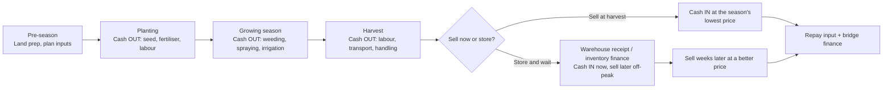

Agriculture runs on a clock that does not match any standard loan. You spend heavily at one end of the season, on seed, fertiliser, labour, and land preparation, and you receive nothing until the other end, at harvest, months later. In between there is no income, only cost and weather. Then at harvest the whole district sells at once, so the price is at its floor exactly when your produce is ready. The cash cycle is lumpy, seasonal, and unforgiving, and financing it with the wrong-shaped loan turns a good season into a debt trap.

This is a domestic problem, and it is the one this guide is about. Kenya's export corridors, cold chains, and cross-border produce logistics are their own subject, covered in [the agri-export supply chain](/blog/agri-export-supply-chain) and [SME trade finance](/blog/sme-trade-finance). Here the focus is the farmer, the trader, and the small processor selling into the local market, and the question is narrow and practical: how do you fund the gap between spending at planting and being paid at harvest, without a facility that punishes you for the shape of your own business?

The answer is not one product. It is three, each matched to a different stage of the season: **input credit** going in, a **harvest bridge** coming out, and **warehouse-receipt or inventory finance** for holding produce back from a glutted market. And it starts with refusing the loan that mismatches all three.

> **Key Insight:** The most expensive mistake in agri finance is not a high rate; it is a mismatched shape. A five-year term loan with fixed monthly instalments demands cash every month from a business that earns cash twice a year. The farmer then borrows again to make the monthly payment, and the term loan that was meant to help becomes a permanent drag serviced by more debt. Match the repayment to the harvest, or the harvest ends up servicing the mismatch.

```cards
- icon: CalendarClock
  title: Repay at harvest, not monthly
  desc: Seasonal income needs seasonal repayment. A facility due in a lump at harvest fits the cash; a monthly instalment fights it.
- icon: Sprout
  title: Input credit funds the season in
  desc: Seed, fertiliser, and labour bought on structured credit, repaid when the crop sells, beats draining savings or taking a term loan for a three-month need.
- icon: Warehouse
  title: Storage turns a glut into a price
  desc: Warehouse-receipt and inventory finance let you borrow against stored produce and sell weeks later, off the harvest-floor price. Cash now, better price later.
  linkText: The working-capital logic
  linkUrl: /blog/working-capital-cycle-kenya-smes
  type: emerald
```

---

### Part 1: The Seasonal Cash Map

Every seasonal agri business, whether a farmer growing it or a trader aggregating it, runs a version of the same cash curve. Draw it once and the finance choices become obvious.



Two features of that curve define the whole financing problem.

**The cash trough runs for months.** From planting through to harvest, the business spends continuously and earns nothing. This is a genuine working-capital gap, structurally identical to the one every business faces between paying suppliers and collecting from customers, only stretched across a growing season and dictated by biology rather than negotiation. The [working capital cycle](/blog/working-capital-cycle-kenya-smes) is the same idea; agriculture just makes the gap long and the timing non-negotiable.

**The price is lowest when your cash need is highest.** At harvest, supply peaks across the whole region simultaneously, so the market price bottoms out. The farmer who must sell at harvest to raise cash is a forced seller into a glut, accepting the worst price of the year precisely because they had no way to hold on. This single dynamic, forced selling into the harvest-floor price, transfers enormous value every year from farmers to whoever can afford to buy, store, and wait.

Almost all of agri finance is about softening one of those two features: bridging the trough, or escaping the forced sale.

---

### Part 2: Funding the Season In, Input Credit vs Merchant Credit

The costs at the front of the season, inputs and labour, are the first thing to fund, and there are better and worse ways to do it.

**Input credit.** Structured input finance provides seed, fertiliser, and sometimes agronomy, on credit, repaid when the crop is sold. It comes in several forms in Kenya: agro-dealer credit lines, cooperative and SACCO input schemes, contract-farming arrangements where a buyer supplies inputs against a commitment to sell them the crop, and some digital input-credit products. Its great virtue is *shape*: it is advanced when you need inputs and repaid when you have income, so the facility matches the season instead of fighting it.

**Merchant / supplier credit.** The oldest form: the agro-dealer lets you take fertiliser now and pay after harvest. Convenient and often relationship-based, but price it honestly. "Pay after harvest" almost always carries an embedded cost, either a higher price than the cash price or an explicit interest charge, and because it is rarely quoted as a rate, farmers seldom compare it. Ask the cash price and the credit price, and work out what the difference costs over the months of credit; it is often dearer than it looks, the same disclosure discipline that the [real cost of any credit](/blog/mobile-loan-vs-bank-loan-apr-breakdown) demands everywhere.

**What to avoid: a term loan for a seasonal need.** Taking a multi-year amortising loan to buy this season's inputs is the classic mismatch. You needed money for three months; you have borrowed it for three years, and now you owe a fixed instalment every month including all the months you have no income. Use seasonal money for a seasonal need.

The choice among the good options turns on total cost and reliability of supply. Structured input credit tied to a reputable buyer or cooperative often gives both the inputs and a route to market; standalone merchant credit gives flexibility at a price you must insist on seeing.


---

### Part 3: The Harvest Bridge

Harvest itself is a cash paradox: it is your income event, and it is also a burst of new costs, harvest labour, transport, handling, drying, and sometimes packaging, all falling due before the produce is sold and paid for. Many farmers, having spent through the growing season, hit harvest with the crop in the field and no cash to bring it in.

A **harvest-bridge facility** funds exactly this short, sharp gap: a short-term advance covering the cost of getting the crop harvested, aggregated, and to market, repaid within weeks from the sale proceeds. The defining features you want are:

- **Short tenor, matched to the sale.** Weeks, not years. The facility exists to cross harvest, not to sit on the books.
- **Repayment from proceeds, in a lump.** It clears when the crop sells, not on a monthly schedule that starts before the money arrives.
- **Sized to the harvest cost, not the crop value.** You are funding the cost of realising the crop, not borrowing against its full value; keep it tight so it self-liquidates cleanly.

The harvest bridge and input credit together cover the whole "in and through" of the season. What they do not solve is the price problem, and that is where the third tool comes in.

---

### Part 4: Warehouse Receipts and Inventory Finance, Escaping the Forced Sale

This is the tool that changes a seasonal business's economics most, because it attacks the forced-sale-into-a-glut problem directly.

The idea: instead of selling at the harvest-floor price to raise cash, you **store** the produce in a certified warehouse, receive a **warehouse receipt** certifying the quantity and grade in store, and borrow against that receipt. You get cash now, the receipt-holding lender is secured by the stored goods, and you sell weeks or months later when the seasonal glut has cleared and the price has recovered. The gain from the higher off-peak price, net of storage and finance costs, is value you would otherwise have handed to whoever bought your harvest cheap.

In Kenya this sits under the **Warehouse Receipt System Act, 2019**, which established a legal framework and a regulator (the Warehouse Receipt System Council) to make receipts bankable and enforceable. The system works best for **storable, gradable commodities**, maize, grains, pulses, coffee, and similar, where quality can be certified and preserved. It is not a tool for perishables, which must move fast regardless.

Weigh it honestly with a simple test:

$$
\text{Store if:} \quad (P_{\text{later}} - P_{\text{harvest}}) > \text{storage cost} + \text{finance cost} + \text{quality loss}
$$

If the expected price recovery over the storage period more than covers the cost of storing, the cost of the finance, and any deterioration in the stored crop, storing and borrowing against the receipt beats selling into the glut. If it does not, sell at harvest and do not romanticise holding. The point is that the decision becomes a calculation you can actually run, rather than a forced sale you have no choice about.

The practical constraints to check before relying on it: a **certified warehouse** must be reachable from your farm or aggregation point; the commodity must be one the system and lenders accept; and grading and storage fees must be understood upfront. Where the infrastructure exists and the crop qualifies, inventory finance is the single most powerful lever a seasonal producer has over their own price.

---

### Part 5: Matching the Facility to the Season

Pull the three tools together against the calendar and the rule is visible at a glance: every facility is short, and every repayment lands when income does.

| Season stage | Cash problem | Right facility | Repayment |
|---|---|---|---|
| Planting | Inputs and labour, no income | Input credit | At crop sale |
| Growing | Ongoing field costs | Input credit / short working capital | At crop sale |
| Harvest | Harvest, transport, handling costs | Harvest-bridge facility | From sale proceeds, weeks |
| Post-harvest | Forced to sell into a glut | Warehouse-receipt / inventory finance | On later sale, off-peak |
| **Wrong at every stage** | A three-month need | **Multi-year term loan** | Fixed monthly, all year |

The single organising principle: **seasonal income demands seasonal repayment.** A facility that falls due in a lump when the crop sells is working *with* the business. A facility that demands a fixed instalment every month is working *against* it, forcing a twice-a-year earner to find cash twelve times a year, and the gap between those two shapes is filled, invariably, by more borrowing.

Term debt still has a place in agriculture, for the right thing: a tractor, an irrigation system, a store, a processing line, capital assets with multi-year lives that genuinely earn across many seasons. Match term debt to long-lived assets and seasonal debt to the season. The error is only ever using one where the other belongs, which is the same product-matching logic that separates [asset finance from a working-capital facility](/blog/asset-finance-vs-conventional-loans).

---

### Part 6: The Aggregating Trader's Version

The same map applies to the trader or small processor who buys from farmers rather than growing, with the timing compressed and the price bet more explicit.

The trader's cash goes out to buy produce at harvest (when it is cheap) and comes back when they sell it on, graded, bulked, or lightly processed, weeks or months later. Their working-capital need is a buying facility that funds purchasing at the harvest low, secured ideally by the stock itself through the same warehouse-receipt or inventory-finance mechanism. Their risk is concentrated in the price bet: they are explicitly betting the price rises enough between buying and selling to cover cost, storage, finance, and loss.

For the trader, the discipline is the [evaluate-the-opportunity test](/blog/evaluate-investment-opportunity-kenya) applied to every buying decision: what price am I paying, what price do I realistically expect, over what storage period, at what carrying cost, and what if the price does not move? A trader who borrows to buy and store without running that arithmetic is gambling with a facility, not trading with one.

### Risk Factors

| Risk | How it arises | Consequence |
|---|---|---|
| Shape mismatch | Term loan funding a seasonal need | Monthly instalments in months with no income; re-borrowing to service |
| Forced harvest sale | No storage or bridge, must sell for cash | Selling into the glut at the year's floor price |
| Hidden merchant-credit cost | "Pay after harvest" not quoted as a rate | Paying more than a bank facility would have cost, unaware |
| Price bet on storage | Storing in hope the price recovers | If it does not, storage and finance costs turn a hold into a loss |
| Quality loss in store | Poor storage, pests, moisture | Graded value falls below the receipt, and below the harvest price |
| Weather / yield shock | Season underperforms | Input and bridge finance still due against a smaller crop |
| Warehouse access | No certified store within reach | Inventory-finance route simply unavailable for that producer |
| Buyer default (contract farming) | Off-taker fails to buy as agreed | Crop grown against a market that vanished, finance still owed |

### Decision Framework: Financing a Season

**Does the repayment fall when my income does?** If the facility demands cash before harvest, it is the wrong shape. Insist on seasonal, at-sale repayment for a seasonal need.

**What does my input credit actually cost?** Get the cash price and the credit price, compute the real cost over the months of credit, and compare structured input finance against merchant credit on that number, not on convenience.

**Can I avoid the forced sale?** Is there a certified warehouse in reach, is my crop storable and gradable, and does the expected price recovery beat storage plus finance plus loss? If yes, inventory finance is your strongest lever.

**Am I matching term debt to long-lived assets only?** Tractors, stores, and irrigation, yes; this season's fertiliser, never. Seasonal money for seasonal needs.

**What is my plan if the season underperforms?** Yield and weather shocks do not pause the finance. Know what a bad harvest does to your ability to repay before you borrow, not after.

### Bengula View

Three observations from the desk.

First, **agriculture is punished less by dear credit than by wrong-shaped credit**. A farmer paying a fair rate on a facility that repays at harvest is in a sound position; a farmer paying the same rate on a term loan that demands a monthly instalment is in a slowly tightening trap, borrowing to service the mismatch until the mismatch owns them. When I see agri distress, the cause is far more often the shape of the loan than the price of it. Fixing the shape is free and it is the first thing to fix.

Second, **the forced sale is the quiet wealth transfer nobody prices**. Every harvest, farmers who cannot afford to wait sell into the glut at the floor, and the value they leave on the table flows to buyers who can store and wait. Warehouse-receipt and inventory finance exist to let the farmer capture that value instead of donating it, and where the infrastructure reaches, it is transformative. The gap is access: the system works best for those near a certified warehouse growing a gradable crop, which is not yet everyone. Where it is available, use it; where it is not, the case for building that infrastructure is exactly this.

Third, **structured beats informal, but only if you read the structure**. Contract farming and input-credit schemes tie inputs to a route to market and can be excellent, but they also tie you to a single buyer and a single price mechanism, and the fine print on pricing and off-take is where the value is won or lost. The convenience of "they supply the inputs and buy the crop" can mask a poor price on both ends. Take the structure, but diligence it like the [borrowing decision](/blog/borrowing-money-in-kenya-guide) it is, not the favour it is dressed as.

### Conclusion

Seasonal agribusiness fails on timing, not on effort. The cash goes out at planting and comes in at harvest, the price is lowest exactly when the crop is ready, and an ordinary monthly-repayment term loan mismatches the whole rhythm. The fix is three facilities, each matched to a stage: input credit and honestly-priced merchant credit to fund the season in, a short harvest bridge to cross the harvest cost, and warehouse-receipt or inventory finance to escape the forced sale and hold for a better price.

The organising rule beneath all three is one line: seasonal income needs seasonal repayment. Match the money to the calendar, reserve term debt for long-lived assets, and use storage finance to turn a glut into a price. Do that, and a good season pays. Ignore it, and the finance quietly converts a good season into a standing debt, one mismatched instalment at a time.

### Related Reading

- [The Working Capital Cycle for Kenyan SMEs](/blog/working-capital-cycle-kenya-smes) for the general logic of financing the gap between spending and earning.
- [The 13-Week Cash Forecast Every SME Should Run](/blog/13-week-cash-forecast-kenya-sme) for mapping a seasonal cash trough week by week.
- [Asset Finance vs Conventional Loans](/blog/asset-finance-vs-conventional-loans) for matching term debt to long-lived farm assets.
- [Understanding Interest Rates and APR](/blog/mobile-loan-vs-bank-loan-apr-breakdown) for pricing merchant credit honestly.
- [The Agri-Export Supply Chain](/blog/agri-export-supply-chain) and [SME Trade Finance](/blog/sme-trade-finance) for the export-corridor side this guide deliberately leaves out.
- [How to Evaluate Any Investment Opportunity](/blog/evaluate-investment-opportunity-kenya) for the trader's buy-and-store price bet.

### References

- [The Warehouse Receipt System Act, No. 8 of 2019, Kenya Law](https://new.kenyalaw.org/akn/ke/act/2019/8/eng@2019-07-26). Establishes the legal framework, the Warehouse Receipt System Council, and the basis on which receipts over stored commodities become bankable security.
- [Warehouse Receipt System Council](https://wrsc.go.ke/). The regulator for certified warehouses and warehouse receipts in Kenya.
- [Agriculture and Food Authority](https://www.afa.go.ke/). Sector context for commodity handling, grading, and storage.
- [Central Bank of Kenya](https://www.centralbank.go.ke/). Context on agricultural lending, seasonal facilities, and the pricing framework banks apply.

*All prices, costs, and timings are illustrative and used to show how seasonal agri cash cycles and their financing work. Actual input costs, facility terms, storage and grading fees, and price movements vary by crop, region, season, and provider; confirm them for your own situation before borrowing.*

*General business education, not individualized financial or agronomic advice. This guide addresses cash timing and finance, not crop science. For farming decisions consult an agronomist, and for structuring seasonal finance work with your cooperative, SACCO, or bank.*
