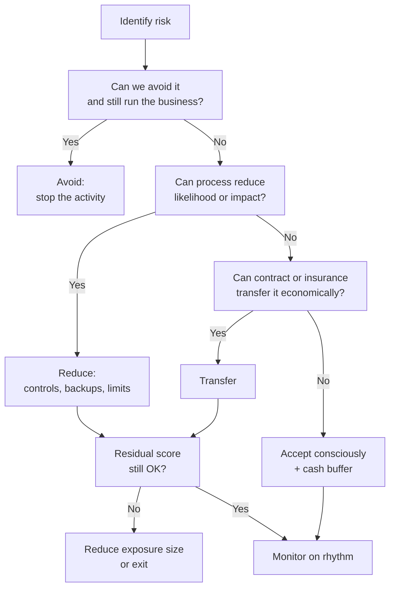

Every SME already manages risk. The question is whether it is managed **on purpose**. Most owner-managers carry the register in their head: a large customer who pays late, a single supplier of a critical input, a cashier who also reconciles, a USD invoice with no hedge, a van with no spare, a password shared on WhatsApp. That mental list works until the week two of those risks arrive together.

This guide turns the mental list into a **small, living system**. It is written for Kenyan firms that will not hire a chief risk officer, but will lose sleep over payroll, tax, and stock. Insurance is one tool inside the system; the companion piece is [Business Insurance in Kenya](/blog/business-insurance-kenya-sme-guide). Cash and credit mechanics link to [working capital](/blog/working-capital-cycle-kenya-smes) and [accounts receivable](/blog/what-is-accounts-receivable).

> **Key Insight:** Risk management is not about predicting the future. It is about **pre-deciding your response** to the losses you cannot afford. If a risk is neither reduced by process, transferred by contract or insurance, nor buffered by cash, you have silently chosen to accept it. Acceptance is valid only when it is conscious.

```cards
- icon: ClipboardList
  title: Register the real risks
  desc: Five to fifteen threats that can stop trading or wipe months of profit, not a 200-line corporate template.
  linkText: Financial statements
  linkUrl: /blog/how-to-read-financial-statements-kenya
- icon: Shield
  title: Treat in order
  desc: Avoid, reduce, transfer, then accept. Insurance sits in transfer, not at the start of the conversation.
  linkText: Business insurance
  linkUrl: /blog/business-insurance-kenya-sme-guide
  type: amber
- icon: Timer
  title: Run a rhythm
  desc: Weekly cash and fraud checks, monthly customer/supplier concentration, quarterly full register review.
  linkText: Working capital
  linkUrl: /blog/working-capital-cycle-kenya-smes
  type: emerald
```

---

### The SME Risk Map

Use seven domains. Most failures sit at the intersections (for example currency plus customer concentration).

| Domain | Examples | Typical early warning |
|---|---|---|
| **Financial / liquidity** | Cash shortfall, covenant breach, tax arrears | Falling cash cover days; rising overdraft |
| **Credit** | Customer default, slow debtors | Ageing beyond terms; disputed invoices |
| **Currency** | USD/KES moves on imports/exports | Margin compression after conversion |
| **Operational** | Equipment failure, quality defects, process gaps | Rework rates; downtime hours |
| **People** | Key-person loss, fraud, skills gaps | Single approver; no deputy |
| **Cyber / payments fraud** | Invoice redirection, SIM-swap, weak access | Changed bank details by email only |
| **Supply chain** | Sole supplier, logistics breaks, input shocks | Lead-time slips; one-source SKUs |

Sector colour:

- Exporters and importers lean currency + logistics ([hedging](/blog/usd-shilling-hedging), [import finance](/blog/import-finance-kenya-guide)).
- Tender-led firms lean guarantee cash lock and payment delay ([AGPO cash flow](/blog/agpo-tender-cash-flow-kenya), [guarantees](/blog/bank-guarantees-kenya-sme-guide)).
- Retailers lean stock, theft, and pricing ([inventory discipline](/blog/data-driven-inventory-small-shops-kenya) once published; [retail dashboard](/blog/retail-data-decision-dashboard)).

---

### Build a One-Page Risk Register

Keep it ugly and used. Columns that matter:

| Risk | Domain | Likelihood (1-5) | Impact (1-5) | Score | Owner | Treatment | Review date |
|---|---|---|---|---|---|---|---|

$$ \text{Score} = \text{Likelihood} \times \text{Impact} $$

**Impact anchors for a typical SME** (adjust to your size):

| Impact | Meaning |
|---|---|
| 5 | Can close the firm or wipe more than a year of profit |
| 4 | Multi-month cash crisis or major facility default risk |
| 3 | Serious but survivable with buffers and action |
| 2 | Painful, contained by normal management |
| 1 | Noise |

Score the **residual risk** after existing controls, not the nightmare version with zero process.

#### Example rows (illustrative distributor)

| Risk | L | I | Score | Treatment |
|---|---:|---:|---:|---|
| Top customer 35% of sales defaults | 3 | 5 | 15 | Credit limits, deposits, diversify pipeline, AR discipline |
| USD import without cover, 60-day cycle | 4 | 4 | 16 | Forward policy above threshold; multi-currency account |
| Single warehouse fire | 2 | 5 | 10 | Fire policy, backups of records, alternate storage plan |
| Payment fraud via changed supplier details | 3 | 4 | 12 | Dual verification on channel outside email; payment matrix |
| Founder incapacitated 90 days | 2 | 5 | 10 | Deputies, banking mandates, key-person cover |

Anything scoring **12+** deserves a named owner and a dated action, not a hope.

---

### Treatment Options (In Order)



**Avoid.** Do not enter contracts you cannot fund ([AGPO working-capital gap](/blog/agpo-tender-cash-flow-kenya) is a classic avoid-or-price decision).

**Reduce.** Dual control on payments, stock counts, service-level agreements, preventive maintenance, documented SOPs, eTIMS-clean records ([eTIMS guide](/blog/etims-kenya-sme-guide)).

**Transfer.** Insurance ([business insurance guide](/blog/business-insurance-kenya-sme-guide)), contractual risk allocation, sometimes banking instruments.

**Accept.** Only with a buffer: cash in an MMF, undrawn headroom you actually understand, and a written trigger for escalation.

---

### Domain Playbooks

#### 1. Financial and liquidity risk

- Know **cash cover days** and the cash conversion cycle ([working capital cycle](/blog/working-capital-cycle-kenya-smes)).
- Match facility type to need ([SME finance handbook](/blog/sme-finance-handbook-kenya)); do not fund machines on perpetual overdraft.
- Keep tax and statutory payments inside the operating plan; surprise compliance hits are liquidity events.
- Read statements the way a lender would ([financial statements](/blog/how-to-read-financial-statements-kenya), [ratios](/blog/sme-financial-ratios-kenya)).

#### 2. Credit risk (customers)

- Credit application, limit, and stop-supply rules beat optimism.
- Age receivables weekly; escalate at 30/60/90.
- Concentration: any buyer above ~25-30% of sales needs a deliberate plan.
- Invoice finance and factoring are tools, not substitutes for collection culture ([accounts receivable](/blog/what-is-accounts-receivable)).

#### 3. Currency risk

- Measure natural hedges first (USD revenue vs USD cost).
- Policy example: hedge or pre-buy cover when net exposure exceeds a set KES amount or % of monthly gross profit.
- Detail in [USD/KES hedging](/blog/usd-shilling-hedging); fee and spread leakage in [fees and FX spreads](/blog/sme-transaction-fees-fx-spreads-kenya).

#### 4. Operational risk

- Single points of failure: one machine, one vehicle, one password, one person who "knows how the file works".
- Quality and delivery failures become financial through returns, penalties, and reputation.
- Document processes enough that a deputy can run them for two weeks.

#### 5. People risk

- Segregation of duties on cash, stock, and payments.
- Leave and rotation for cashiers and storekeepers.
- Key-person map: who, if absent 30 days, stops revenue or compliance.
- Personal protection for owners remains part of enterprise survival ([insurance stack](/blog/insurance-stack-kenya-life-stages)).

#### 6. Cyber and payments fraud

Kenyan SMEs lose more to **business email compromise and changed-bank-detail fraud** than to cinematic hacks.

Minimum controls:

- Verify supplier bank changes on a known phone number, not the email thread.
- Dual release on payments above a threshold.
- Unique logins; no shared "company" passwords on WhatsApp.
- Out-of-band confirmation for large or first-time beneficiaries.

#### 7. Supply chain risk

- Identify sole-source inputs and dual-source where margin allows.
- Buffer stock is a financial decision, not only an operations one ([inventory](/blog/data-driven-inventory-small-shops-kenya)).
- Logistics partners need backup lanes for critical routes; agri and cold-chain lessons appear in [agri export supply chain](/blog/agri-export-supply-chain) and [Zindua logistics](/blog/zindua-agri-logistics).

---

### The Operating Rhythm

| Cadence | Agenda |
|---|---|
| **Daily** | Cash position; payment releases; obvious fraud red flags |
| **Weekly** | Receivable ageing; stock exceptions; open high-score risks |
| **Monthly** | Customer/supplier concentration; FX result vs budget; insurance claims/incidents |
| **Quarterly** | Full register rescore; facility headroom; scenario: "top customer late 60 days" |
| **Annually** | Insurance programme review; banking tariff and FX audit; strategy risks |

If the firm is two people, the "committee" is still a 30-minute calendar block. Unscheduled worry is not a control system.

---

### Scenario Tests Worth Running

Write the answer in one page each:

1. **Top customer pays 60 days late.** What stops first: tax, salaries, suppliers, or loan instalments?
2. **KES moves 5% against you over an import cycle.** Does pricing absorb it?
3. **Founder offline 30 days.** Who signs, who collects, who knows the passwords?
4. **Warehouse incident.** What is insured, what is excess, what is the restart plan?
5. **Key supplier fails.** Alternate source, lead time, and margin hit?

If you cannot answer, the risk is unmanaged regardless of how confident the culture feels.

---

### Risk Factors (Of Risk Management Itself)

- **Paper theatres:** beautiful registers never opened.
- **Over-control:** so many approvals that the business cannot trade.
- **Insurance as superstition:** buying certificates without reading warranties.
- **Optimism bias after good years:** scores drift down without evidence.
- **This guide is education**, not a certification, audit opinion, or legal compliance programme.

---

### Decision Framework: 30-Day Stand-Up Plan

**Week 1:** List top 10 risks; score them; pick owners.

**Week 2:** Install payment dual-control and bank-detail verification.

**Week 3:** Fix the single highest credit or liquidity score (limit, deposit, facility match, or collection blitz).

**Week 4:** Align insurance to the register ([business insurance](/blog/business-insurance-kenya-sme-guide)); diary the quarterly review.

Then stop. Do not build a bureaucracy. Raise the quality of the top five risks before expanding the list.

---

### Bengula View

The desk's position is that SME risk management fails when it tries to imitate banks and multinationals. You do not need 40 policies. You need **honest scoring, a few non-negotiable controls, sized insurance, and a calendar**.

We weigh **liquidity, concentration, fraud, and key-person** risks above exotic narratives. We treat currency as an operating risk for traders, not a macro hobby. And we treat insurance as transfer after process, not as a substitute for process.

If you want the finance facility map that sits under many of these risks, use the [SME finance handbook](/blog/sme-finance-handbook-kenya). If you want help turning a mental list into a one-page register and banking structure, use [services](/services) or [book a session](/contact).

---

### Sources and Further Reading

- Bengula Inc: [Business Insurance in Kenya](/blog/business-insurance-kenya-sme-guide), [Working Capital Cycle](/blog/working-capital-cycle-kenya-smes), [Accounts Receivable](/blog/what-is-accounts-receivable), [Hedging USD/KES](/blog/usd-shilling-hedging), [Fees and FX Spreads](/blog/sme-transaction-fees-fx-spreads-kenya), [SME Finance Handbook](/blog/sme-finance-handbook-kenya), [Bank Guarantees](/blog/bank-guarantees-kenya-sme-guide), [AGPO Tender Cash Flow](/blog/agpo-tender-cash-flow-kenya), [Insurance Stack](/blog/insurance-stack-kenya-life-stages).

*General business education for Kenyan SMEs, not legal, insurance, or risk-consultancy advice for a specific firm. Adapt thresholds to your size and sector, and obtain professional advice for material exposures.*
