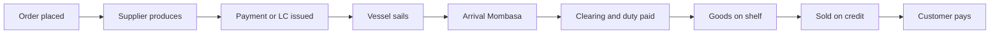
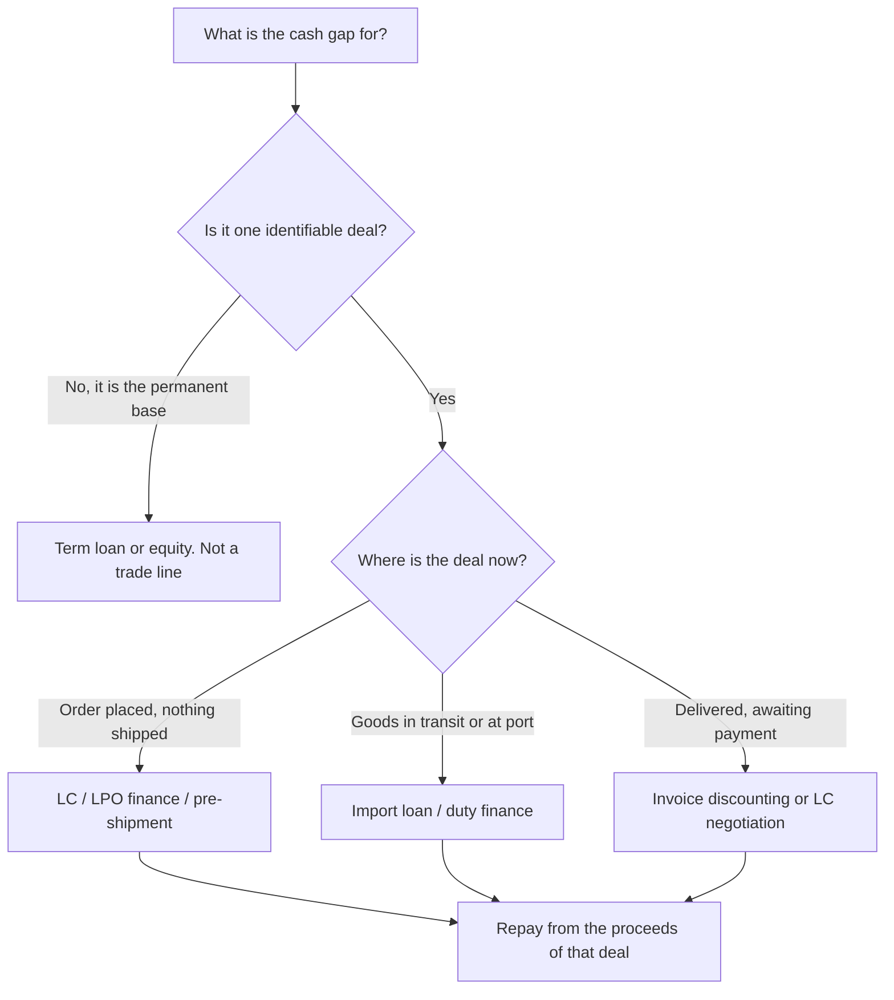

Two businesses that have never met, in two countries with different courts, agree to exchange goods for money. One of them has to move first. The importer does not want to send KES 4 million to a supplier in Guangzhou who may ship nothing. The supplier does not want to load a container for a Nairobi company he cannot sue. Neither is being unreasonable. That standoff is the oldest problem in commerce, and the entire apparatus of trade finance, letters of credit, guarantees, documentary collections, exists to solve it without either party having to trust the other.

Solve the trust problem and a second one appears immediately, and it is the one that actually kills Kenyan SMEs. The money leaves long before it comes back. You pay the supplier at shipment, the vessel takes five weeks to Mombasa, clearing takes another ten days, the goods sit on a shelf for six weeks, and then your best customer takes thirty days to pay. That is roughly four months of your capital sitting inside a transaction that is, on paper, profitable. Businesses do not fail because the margin was wrong. They fail because nobody financed the gap.

This guide is the map of both problems. It walks the importer's journey and the exporter's journey end to end, covers the two pieces of shared infrastructure that sit under both (guarantees and foreign exchange), and matches a facility to every stage. It is the hub for a cluster that already runs deep: [import finance](/blog/import-finance-kenya-guide) owns the import letter of credit and the import loan in detail, [LPO and purchase order finance](/blog/lpo-purchase-order-finance-kenya) owns the domestic order, [accounts receivable](/blog/what-is-accounts-receivable) owns the invoice, [bank guarantees](/blog/bank-guarantees-kenya-sme-guide) owns the bonds, and [USD/KES hedging](/blog/usd-shilling-hedging) owns the currency. What follows connects them into one system and fills the pieces none of them own: the payment-method ladder, the document file, Incoterms and what they do to your cash, the landed-cost stack, and the regional corridor.

> **Key Insight:** Trade finance is not borrowing. It is the deliberate reshaping of *when* money moves so that a transaction funds itself. A general-purpose loan gives you cash and hopes you repay from the business. A trade facility attaches itself to one specific deal, is repaid by that deal, and expires with it. That is why a well-structured trade line is cheaper, faster to approve, and safer than an overdraft doing the same work: the bank is lending against a shipment it can see, not against your optimism.

```cards
- icon: Handshake
  title: First solve trust
  desc: Open account, documentary collection, letter of credit, advance payment. Every trade sits on one of these four rungs, and the rung you accept decides who carries the risk.
- icon: Clock
  title: Then fund the gap
  desc: Transit plus clearing plus shelf time plus customer credit, less any supplier credit, is your trade cash gap. Count the days before you price the deal.
  type: amber
- icon: FileCheck
  title: The file is the deal
  desc: In documentary trade the bank pays against paper, not against goods. A comma in the wrong place on a bill of lading can delay payment by weeks.
  linkText: How import LCs work
  linkUrl: /blog/import-finance-kenya-guide
  type: emerald
```

---

### Part 1: The Trade Cash Gap, Counted in Days

Before any facility is chosen, the deal has to be measured. Trade finance sizing is not a feeling about how much you need; it is an arithmetic of days.

Every cross-border transaction runs the same clock:



Your money is out of your hands from block C to block I. The measure that matters is the **trade cash gap**:

$$
\text{Trade cash gap (days)} = \text{Transit} + \text{Clearing} + \text{Inventory} + \text{Debtor days} - \text{Supplier credit days}
$$

Run it on an ordinary Nairobi importer bringing goods from China:

| Stage | Days |
|---|---:|
| Payment at shipment (supplier credit) | 0 |
| Sea transit, Shanghai to Mombasa | 30 |
| Discharge, clearing, transport to Nairobi | 12 |
| Average time on the shelf | 45 |
| Credit given to trade customers | 30 |
| **Trade cash gap** | **117 days** |

One hundred and seventeen days. If that importer turns over KES 4 million of stock per consignment, roughly KES 4 million of working capital is permanently absent from the business, and it grows every time the business grows. This is the reason profitable importers are chronically broke, and it is the same mechanic described in the [working capital cycle](/blog/working-capital-cycle-kenya-smes), just with an ocean in the middle of it.

Two levers shorten the gap and both are commercial rather than financial. Negotiating 60 days of supplier credit removes 60 days from the top of the calculation. Collecting from customers in 15 days instead of 30 removes 15 more. Only after those levers have been pulled does financing the remainder make sense, because financing an unnecessarily long gap is simply paying interest on a bad habit.

A note on which capital funds which gap. Import consignment gaps are self-liquidating: the goods arrive, sell, and repay. They belong on a trade facility that expires with the deal. Permanent gaps caused by giving all your customers 60 days do not self-liquidate, and putting them on an overdraft creates exactly the trap described in [the overdraft that never clears](/blog/overdraft-that-never-clears-kenya).

---

### Part 2: The Payment Ladder, or Who Moves First

Every international trade sits on one of four rungs. The rung determines who carries the risk, and it is the single most consequential commercial term in the contract, more consequential than price.

| Method | Who moves first | Importer risk | Exporter risk | Typical use |
|---|---|---|---|---|
| Advance payment | Importer pays before shipment | Highest | None | New supplier relationships, custom manufacture, small orders |
| Letter of credit | Bank promises, then documents move | Low | Low | First deals with a real counterparty, high value, long voyages |
| Documentary collection | Goods ship, bank holds documents | Medium | Medium | Established relationships, shorter corridors |
| Open account | Exporter ships, invoices, waits | None | Highest | Long relationships, group companies, strong buyers |

The ladder is a seesaw. Everything that protects the importer exposes the exporter, and vice versa. There is no neutral position, only a negotiated one.

#### Advance Payment

The importer wires the money and hopes. Kenyan importers do this constantly, particularly on small Chinese consignments where an LC would cost more than the margin, and it works until the day it does not. The exposure is total: there is no bank, no document, and no practical recourse. If you must pay in advance, split it (30% deposit, 70% against a copy bill of lading is a common compromise), verify the supplier independently rather than through the contact details the supplier gave you, and never scale an advance-payment relationship faster than the trust that supports it.

#### Documentary Collection

The exporter ships the goods and hands the documents to their bank, which sends them to the importer's bank with instructions: release these documents against payment (documents against payment, D/P), or against the importer's signed acceptance to pay on a future date (documents against acceptance, D/A). Because the importer cannot clear the goods without the bill of lading, the paper acts as a lever.

It is cheaper than an LC and offers real protection, with one gap that matters enormously in Kenya: **no bank has promised to pay**. If the importer simply refuses the documents, the exporter has a container sitting in Mombasa incurring demurrage, and the choice between selling it locally at a discount or shipping it home at a loss. Documentary collection protects against dishonesty, not against a buyer who changes their mind.

#### The Letter of Credit

An LC replaces the importer's promise with a bank's promise. The importer's bank (the issuing bank) undertakes to pay the exporter, provided the exporter presents documents that comply exactly with the credit's terms. The goods themselves are irrelevant to the bank. It pays against paper.

That is worth repeating because it is where SMEs get hurt: **the bank checks documents, not cargo**. A compliant set of documents covering a container of sand will be paid. A non-compliant set covering the correct goods will not, at least not without the importer's waiver. Letters of credit are governed by the ICC's Uniform Customs and Practice for Documentary Credits (UCP 600), which is a rulebook about documents.

The import-side mechanics, issuing, margins, cash cover, and how the facility converts into an import loan on payment, are covered in full in [import finance in Kenya](/blog/import-finance-kenya-guide). What follows in Part 4 is the export side of the same instrument, which no article in the library has yet owned.

#### Open Account

The exporter ships and invoices, exactly like a domestic sale. This is how most mature trade actually runs, because it is the cheapest and most flexible, and it is why [accounts receivable](/blog/what-is-accounts-receivable) discipline matters more to an established exporter than any bank product. The risk is the whole invoice. It is managed with credit insurance, with a bank guarantee from the buyer's side, or by only selling on open account to buyers you have already been paid by repeatedly.

> **Practical rule:** move down the ladder as a relationship matures, never up. Starting on open account and demanding an LC after a dispute is a commercial insult that usually ends the relationship. Starting on an LC and relaxing to open account after four clean cycles is a reward you can grant, and it costs you nothing.

---

### Part 3: The Importer's Journey

The Kenyan importer's cash problem is that the state gets paid before the customer does. Duty and VAT fall due at the port, months before the goods generate a shilling.

#### Stage 1: Price the Landed Cost, Not the Invoice

The supplier's quote is not the cost of the goods. The cost is the landed cost, and Kenyan importers routinely underprice because they forget half the stack.

Take a consignment with a customs value (cost, insurance and freight, or CIF) of **KES 4,000,000**, in a 25% duty band:

| Line | Basis | Amount (KES) |
|---|---|---:|
| Customs value (CIF) | Invoice + freight + insurance | 4,000,000 |
| Import duty | 25% of customs value | 1,000,000 |
| Import Declaration Fee (IDF) | 3.5% of customs value | 140,000 |
| Railway Development Levy (RDL) | 2% of customs value | 80,000 |
| **VAT base** | CIF + duty + IDF + RDL | **5,220,000** |
| VAT | 16% of VAT base | 835,200 |
| Clearing, port charges, inland transport | Estimate | 180,000 |
| **Total cash needed at the port** | | **6,235,200** |

Four points that decide whether the deal works:

1. **The duty band is not a detail.** The East African Community Common External Tariff runs in four bands: 0% on most raw materials and capital goods, 10% on intermediate goods, 25% on finished goods, and a 35% band introduced in 2022 for sensitive finished products. Whether your item is classified as an intermediate or a finished good can move the landed cost by 15 percentage points of CIF. Get the tariff code confirmed before you order, not after the container arrives.
2. **The levies compound onto the VAT base.** IDF at 3.5% and RDL at 2% of customs value are not just 5.5%; they also increase the base on which 16% VAT is charged. (RDL rose from 1.5% to 2% under the Tax Laws (Amendment) Act 2024, effective 27 December 2024. Rates and exemptions move with each Finance Act; confirm both on KRA before pricing.)
3. **VAT is a cash event, not a cost.** If you are VAT-registered, the KES 835,200 of import VAT is input tax you will reclaim against the VAT you charge on the sale. It is not part of your margin. It is, however, KES 835,200 you must find on the day of clearing, and that timing difference is a working-capital problem of its own, explored in [VAT for Kenyan SMEs](/blog/vat-for-smes-kenya).
4. **Freight and insurance are inside the customs value.** Which means the Incoterm you agreed changes your tax bill, not just your logistics. Part 6 returns to this.

Net of recoverable VAT, the true cost of the consignment is KES 5,400,000 against goods invoiced at KES 4,000,000. An importer who priced off the supplier's invoice and added a 30% markup has just sold at a loss and will not discover it for a quarter.

#### Stage 2: Fund the Purchase

Match the instrument to the trust level and the corridor:

| Need | Instrument | What it does |
|---|---|---|
| Supplier will not ship without security | Import letter of credit | Bank's promise replaces yours; you post a margin, not the full value |
| Supplier ships, you need time to pay | Import loan / trade loan | Bank settles the supplier, you repay from sales, typically 90 to 180 days |
| Duty and VAT due at the port | Duty finance / short trade loan | Funds the KRA bill so goods are not stuck at the port accruing storage |
| Recurring, predictable consignments | Revolving trade line | Pre-approved limit drawn down per shipment |

The instinct to pay for a consignment out of the overdraft is understandable and usually wrong. An overdraft has no self-liquidating structure, is priced as general-purpose risk, and permanently consumes a limit you will need for the next consignment. A structured trade loan attached to a shipment is typically cheaper, and it clears itself. Against a CBK industry average lending rate of **14.5%** (May 2026 indicative), the pricing difference between a well-structured trade line and a general facility is real money on a KES 6 million exposure repeated four times a year.

#### Stage 3: Clear the Goods

The customs process is where document errors become expensive. The importer needs a valid Import Declaration Form lodged before shipment, a compliant tariff classification, and, for regulated goods, a Certificate of Conformity from a KEBS-appointed inspection agent issued in the country of supply. Goods that arrive without pre-export verification where it is required face destination inspection, delay, and cost.

The financial point is simple: **every day a container sits uncleared costs money in storage and demurrage while earning nothing**. Clearing delays are a financing problem disguised as a logistics problem, which is why duty finance exists and why the clearing agent's competence belongs on your risk register alongside the supplier's.

#### Stage 4: Sell and Repay

The consignment repays the facility. This is the discipline that separates trade finance from borrowing: proceeds from the goods that were financed should settle the facility that financed them, before the money is used for anything else. Where an importer routinely diverts consignment proceeds into other costs, the trade line silently becomes permanent debt, and the bank will see it in the utilisation pattern long before the owner admits it.

---

### Part 4: The Exporter's Journey

The Kenyan exporter has the opposite problem to the importer. Instead of paying the state early, the exporter spends everything early: buying crop, packing, certifying, and freighting, all before a foreign buyer who may pay 45 days after arrival.

#### Stage 1: Contract and Currency

The export contract fixes four things that determine whether the deal is bankable: the buyer, the Incoterm, the payment method, and the currency. Get the last one wrong and a good margin evaporates, which is the whole subject of [hedging USD/KES](/blog/usd-shilling-hedging).

#### Stage 2: Pre-Shipment Finance

Money is needed before the goods exist. Pre-shipment finance (also called packing credit) funds the purchase of raw material, harvest, processing, and packaging against a confirmed export order or an LC in hand.

The bank's comfort here is not your balance sheet. It is the order. A confirmed order from a creditworthy foreign buyer, ideally backed by an export LC, is what converts an unbankable request into a financeable one. This is the same logic as [LPO finance](/blog/lpo-purchase-order-finance-kenya) on the domestic side: the order is the security.

#### Stage 3: The Export Letter of Credit

Here is the export side of the instrument, which behaves quite differently from the import side.

When your buyer's bank issues an LC in your favour, you are the **beneficiary**. The credit arrives at your bank in Nairobi (the advising bank), which authenticates it and passes it to you. Four decisions follow, and each one is money.

**Decision one: is the issuing bank good for it?** An LC is only as strong as the bank behind it. A credit issued by a large bank in the Netherlands is money. A credit issued by a small bank in a country with foreign exchange controls or an active political crisis is a promise with country risk attached. If you cannot assess the issuing bank, ask your own bank to; they can see correspondent bank ratings you cannot.

**Decision two: do you need it confirmed?** A **confirmed** LC adds a second, independent undertaking from a bank you can reach (usually your Kenyan bank or an international correspondent). If the issuing bank fails or its country blocks payment, the confirming bank still pays you. Confirmation is not free; it is priced as country and bank risk and can run from a modest fee to a very expensive one on a difficult corridor. The rule of thumb: confirm when the issuing bank or its country is unfamiliar, and price the confirmation cost into the quotation rather than absorbing it out of margin.

**Decision three: read the credit before you ship, not after.** This is the discipline that separates exporters who get paid on time from those who do not. When the LC arrives, check every term against what you can actually deliver:

- Is the latest shipment date achievable given your harvest or production calendar?
- Is the expiry date far enough after shipment to allow document preparation and presentation (21 days is the usual presentation period unless the credit says otherwise)?
- Does it require a document you cannot obtain, such as an inspection certificate from a named agency that does not operate in Kenya, or a certificate signed by the buyer (which hands the buyer a veto over your payment)?
- Are partial shipments and transhipment allowed? On a route that transhipments through Salalah or Jebel Ali, a credit prohibiting transhipment is a trap.
- Does the description of goods match your invoice wording exactly?

Any term you cannot meet must be amended **before shipment**, by asking the buyer to instruct an amendment. Amendments after shipment are requests for mercy.

**Decision four: present clean documents.** The bank pays against a compliant presentation. Discrepancies, and first presentations are frequently discrepant in practice, hand the issuing bank a legitimate reason to refuse payment, at which point you are relying on the buyer to waive them. A buyer whose market has moved against them will happily use a misspelled port name as an exit. The discrepancy fee itself is minor; the delay and the loss of leverage are not.

**Then, the financing.** Once documents are presented and accepted, an LC payable at a future date (a usance or deferred-payment credit, say 90 days from bill of lading) becomes a financeable asset. Your bank can **negotiate** or **discount** the accepted draft, paying you now, less interest, and collecting from the issuing bank at maturity. Because the risk sits with a bank rather than with your buyer, discounting an accepted export LC is typically cheaper than discounting an ordinary invoice. This is the single most underused facility among Kenyan exporters: they accept 90-day terms to win the order, then finance the wait on an expensive overdraft instead of discounting the very instrument that guarantees the payment.

#### Stage 4: Post-Shipment Finance on Open Account

Where the exporter has moved down the ladder to open account, the invoice replaces the LC as the financeable asset, and the tools are the ones described in [accounts receivable](/blog/what-is-accounts-receivable): invoice discounting or factoring, priced against the buyer's credit standing. Adding export credit insurance improves both the price and the availability, because it converts an uninsured foreign receivable into an insured one.

#### The Corridor Reality: Meru to Rotterdam

Corridor risk is not an abstraction. An exporter shipping fresh produce from Meru faces a cash timeline that no facility can shorten, only fund:

| Stage | Days | Cash position |
|---|---:|---|
| Buy crop from out-growers (cash on delivery) | 0 | Money out |
| Grade, pack, cold storage | 3 | Money out |
| Inland haulage to Mombasa or JKIA | 2 | Money out |
| Documentation and export clearance | 2 | Money out |
| Transit to Rotterdam (sea) | 25 | Nothing |
| Buyer inspects and accepts | 3 | Nothing |
| Payment at 45 days from bill of lading | 45 | Money in |

Roughly 55 to 60 days from first shilling out to first shilling in, on a business that must buy from farmers in cash weekly. That gap, repeated every week, is the entire reason agri-exporters need structured finance rather than a bigger overdraft, and it is the operating problem examined in [the agri-export supply chain](/blog/agri-export-supply-chain) and [SME trade finance](/blog/sme-trade-finance). Air freight compresses the transit but multiplies the freight cost, which is a margin decision, not a financing one.

---

### Part 5: The Document File Is the Deal

In documentary trade, the goods are represented by paper. Get the paper right and the money moves. Get it wrong and the money stops, regardless of how perfect the cargo is.

| Document | What it proves | Where SMEs get it wrong |
|---|---|---|
| **Bill of lading (B/L)** | Title to the goods; the carrier's receipt and contract | Consignee and notify party wrongly stated; not marked "clean on board"; issued to order without proper endorsement |
| **Air waybill (AWB)** | Receipt for air cargo. **It is not a document of title** | Treating it like a B/L. Air cargo is released to the named consignee, so naming the buyer on an unpaid shipment gives away the goods |
| **Commercial invoice** | The contract price and the goods description | Description differs by a word from the LC or the purchase order |
| **Packing list** | What is in each carton or pallet | Quantities that do not reconcile to the invoice |
| **Certificate of origin** | Where the goods were made; unlocks preferential duty | Wrong issuing body; missing for an EAC or AfCFTA preference claim |
| **Insurance certificate** | Cargo cover for the voyage | Cover starting later than the risk transfer point under the Incoterm; insured value below the credit's requirement (commonly CIF plus 10%) |
| **Inspection or conformity certificate** | Compliance with standards | Not arranged pre-export where destination rules require it |
| **Phytosanitary or health certificate** | Plant or food safety clearance | Issued too late; agricultural exports have hard validity windows |

Three habits prevent most losses. First, build a **document checklist per shipment** taken directly from the LC or contract, and tick it before presentation rather than after rejection. Second, **never let the buyer control a required document**. A credit calling for a certificate signed by the applicant's representative is a credit the buyer can refuse at will. Third, keep the **description of goods identical** across the invoice, packing list, bill of lading and certificate of origin. Consistency is not pedantry here; it is the test the checking bank applies.

An air-freight warning worth its own line: because an air waybill is not a document of title, an exporter who ships by air on open account or against a collection has already handed over the goods. Air shipments to unfamiliar buyers belong on advance payment or an LC, not on trust.

---

### Part 6: Incoterms and Where Your Cash Is Exposed

Incoterms (the ICC's Incoterms 2020 rules) are three-letter codes that answer three questions: who arranges carriage, who pays which costs, and at what precise point risk passes from seller to buyer. Kenyan SMEs treat them as shipping jargon. They are cash-flow terms.

| Incoterm | Seller's job ends | Who pays main freight | Who insures the voyage | Cash implication for the Kenyan side |
|---|---|---|---|---|
| **EXW** (Ex Works) | At the seller's factory door | Buyer | Buyer | Importer funds everything from the supplier's gate, including export formalities abroad. Cheapest headline price, most exposure and hassle |
| **FOB** (Free on Board) | When goods are on board at the port of loading | Buyer | Buyer | The Kenyan importer's workhorse. You control freight and can shop the rate, but you must have freight and insurance arranged before the vessel sails |
| **CFR** (Cost and Freight) | Goods on board; seller pays freight | Seller | **Buyer** | The dangerous middle. The seller pays freight but does not insure, so an uninsured importer carries the voyage risk without realising it |
| **CIF** (Cost, Insurance and Freight) | Goods on board; seller pays freight and minimum insurance | Seller | Seller (minimum cover) | Simplest for a new importer, but the seller's minimum cover may be thin, and the freight margin is buried in the price |
| **DAP** (Delivered at Place) | At the named destination, duty unpaid | Seller | Seller | Importer still pays duty and VAT at Mombasa. Good for exporters wanting control; check who handles clearing |
| **DDP** (Delivered Duty Paid) | At destination, all duties paid | Seller | Seller | Maximum comfort, maximum price. A foreign exporter quoting DDP into Kenya is pricing in Kenyan duty risk plus a margin for it |

Two consequences most SMEs miss:

**Your Incoterm changes your customs bill.** The customs value in Kenya is the CIF value: goods plus insurance plus freight. Buying FOB and arranging cheap freight yourself lowers the customs value and therefore lowers duty, IDF, RDL and VAT, all of which are charged on that value. Buying DDP hands the whole stack to the supplier at a price you cannot see. The cheapest total cost is often FOB with your own freight forwarder, provided you are competent enough to run it.

**Your Incoterm changes when your risk starts and when your money is exposed.** Under FOB, risk passes when the goods are loaded, so an importer who has already paid must be insured from that moment. Under CFR, nobody has insured the voyage unless the importer arranged it separately, and cargo losses on that term are a recurring, entirely avoidable Kenyan loss.

> **Negotiating tip:** when you compare two supplier quotes on different Incoterms, you are not comparing prices. Convert both to the same term (landed at Mombasa is the useful one) before deciding. A "cheaper" EXW quote frequently loses once export handling, inland haulage abroad, freight and insurance are added.

---

### Part 7: Shared Infrastructure One, Guarantees

Guarantees are not trade finance in the narrow sense; no goods move because of them. They are the instrument that lets a small company make a promise a large counterparty will accept, and they run underneath both journeys.

The three an SME meets most often are the bid bond, the performance guarantee and the advance-payment guarantee, covered in full in [bank guarantees in Kenya](/blog/bank-guarantees-kenya-sme-guide). The trade-specific points worth stating here:

- **A guarantee consumes your limit even though no money moved.** A KES 5 million performance bond sits against your facility as surely as a KES 5 million loan. Contractors and traders who bid aggressively discover that their bonds have eaten the working-capital limit they needed to actually deliver, which is the clash examined in [the contractor cash flow stack](/blog/contractor-cash-flow-stack-kenya).
- **An advance-payment guarantee is how an exporter gets paid early.** If the buyer will advance 30% at contract, an APG in the buyer's favour is what makes them comfortable. The advance funds your pre-shipment costs; the guarantee reduces as you deliver.
- **A standby letter of credit is a guarantee wearing an LC's clothes.** Used where the counterparty's jurisdiction prefers credits to bonds, it pays on presentation of a simple demand statement rather than shipping documents. Treat it with the seriousness of a guarantee, because that is what it is.

---

### Part 8: Shared Infrastructure Two, Foreign Exchange

Every cross-border deal is two transactions: the trade and the currency bet you did not intend to place.

An exporter who prices a contract in dollars at 129 and is paid four months later at 122 has lost more than the entire financing cost of the deal. An importer who costs a consignment at one rate and settles at another has lost the same money in the opposite direction. Neither of them was trading currencies, which is precisely the problem.

The tools are three, and they are set out with worked examples in [hedging USD/KES](/blog/usd-shilling-hedging):

1. **Forward contracts**, which fix a rate today for settlement on a future date. The correct use is to hedge a known, contracted exposure, not to speculate on direction.
2. **Natural hedging**, matching foreign-currency income to foreign-currency costs so the exposure never arises. An exporter earning dollars who also buys imported inputs in dollars is partly hedged for free.
3. **Timing discipline**, converting when the exposure crystallises rather than when the rate feels good.

Alongside the rate itself sits the quieter leak: **the spread and the fee stack**. The rate your bank quotes is not the interbank rate, and the gap is revenue. On a business converting USD 500,000 a year, a spread negotiated down by 50 basis points is KES 300,000 or so of pure margin recovered for the cost of a conversation. That negotiation, and the fee audit that supports it, is the subject of [the hidden leak](/blog/sme-transaction-fees-fx-spreads-kenya).

---

### Part 9: The Domestic Corridor

Not all trade crosses a border, and the same structures apply to domestic supply chains where a large buyer places orders a small supplier cannot fund.

- **LPO and purchase order finance** funds the order itself, against a confirmed local purchase order from a credible buyer. See [LPO and purchase order finance](/blog/lpo-purchase-order-finance-kenya).
- **Invoice discounting and factoring** funds the wait after delivery. See [accounts receivable](/blog/what-is-accounts-receivable).
- **AGPO and government tenders** are their own species, because the buyer is creditworthy but slow, and the cash cycle is punishing in a specific, predictable way. See [AGPO and government tender cash flow](/blog/agpo-tender-cash-flow-kenya).
- **Seasonal domestic trade**, where the goods are agricultural and the cash cycle follows a crop calendar rather than a shipping schedule, is covered in [seasonal working capital for agribusiness](/blog/seasonal-agri-working-capital-kenya).

The unifying idea is identical to the cross-border case: finance the transaction, repay from the transaction, and let the facility expire with it.

---

### Part 10: The Regional Corridor, EAC and AfCFTA

Two preferential regimes should matter to a Kenyan exporter, and the honest position on both is that the paperwork matters more than the politics.

**The East African Community** is the working one. Goods that qualify under the EAC rules of origin move between partner states at preferential (largely zero) duty, provided they carry a valid EAC certificate of origin. The commercial catch is that qualification depends on origin, not on where you shipped from: goods you merely re-exported without sufficient local transformation do not qualify, and a certificate obtained on a loose interpretation is a customs dispute waiting at the border.

**The African Continental Free Trade Area** is the larger prize and the slower one. Kenya has ratified the agreement, gazetted its provisional schedules of tariff concessions, and was among the first movers under the Guided Trade Initiative, sending its first AfCFTA consignment to Ghana in October 2022. KRA now issues AfCFTA certificates of origin. What has not arrived at the same speed is the trade itself, and the reason is instructive: for most African corridors the binding constraint is not the tariff but the logistics, the payment rails, and the cost of moving a container between two African ports that have no direct service.

For an SME the practical position as at August 2026 is this. Treat AfCFTA as a real but corridor-specific opportunity: check whether your destination country has an operative tariff offer for your product line, obtain the certificate of origin through KRA, and cost the logistics honestly before assuming the duty saving translates into a margin. Where the freight adds more than the tariff saves, the preference is theoretical. Verify current tariff schedules and certificate procedures with KRA before quoting, because implementation is still moving.

---

### Part 11: Matching the Facility to the Stage

The whole guide reduces to one decision: which instrument fits which point on the clock.

| Stage of the deal | Problem | Instrument |
|---|---|---|
| Before the order | Buyer needs assurance you can perform | Bid bond, performance guarantee |
| At the order (import) | Supplier wants security before shipping | Import letter of credit |
| At the order (export) | You must buy inputs before being paid | Pre-shipment / packing credit, advance-payment guarantee |
| At the order (domestic) | You cannot fund a confirmed local order | LPO / purchase order finance |
| At shipment | Supplier must be paid, you need time | Import loan / trade loan, 90 to 180 days |
| At the port | Duty and VAT due before sales begin | Duty finance, short trade loan |
| After shipment (export, LC) | Buyer pays at 90 days | Negotiation or discounting of the accepted draft |
| After delivery (open account) | Invoice outstanding | Invoice discounting or factoring |
| Throughout | Currency exposure | Forwards, natural hedge, timing discipline |
| Throughout | Permanent working-capital base | Term facility, not a trade line |



The final row of the table is the one most often broken. A trade facility used to fund a permanent gap becomes a rolling debt that never clears, and the bank notices before the borrower does.

---

### Part 12: What a Trade Facility Actually Costs

Trade finance is priced in layers, and the layers are where the surprises live. A business that compares only the interest rate on an import loan against the interest rate on an overdraft has compared a quarter of the cost.

There are three kinds of charge and they behave differently:

**Interest**, charged on money actually advanced, for the days it is outstanding. This is the import loan, the discounted export bill, the pre-shipment advance. It is the layer SMEs look at, and usually the layer that matters least in absolute terms because the tenor is short.

**Commission**, charged on exposure the bank has taken without advancing money. Letters of credit and guarantees are priced this way, typically as a percentage per quarter or part quarter on the face value, because the bank is carrying a contingent liability for that period. This is the layer SMEs forget entirely. A guarantee that runs for thirteen months is charged for five quarters, not four, and a credit whose expiry is set carelessly late costs a full extra quarter for nothing.

**Fixed fees**, charged per event: issuance, amendment, discrepancy, document handling, SWIFT, confirmation, negotiation. Individually small, collectively meaningful on a business doing forty shipments a year.

| Charge | Applies to | How it is usually quoted | What controls it |
|---|---|---|---|
| Issuance commission | LC, guarantee | Percentage of face value per quarter or part quarter | Face value and **validity period**, so do not over-run the expiry |
| Confirmation fee | Export LC | Percentage per quarter, priced on issuing bank and country risk | The corridor. A difficult country is genuinely expensive to confirm |
| Amendment fee | LC | Flat fee per amendment | Reading the credit properly before shipment |
| Discrepancy fee | Export LC presentation | Flat fee, deducted from proceeds | Document discipline |
| Negotiation or discount | Accepted export bill | Interest for the days to maturity, plus a handling fee | Tenor and the issuing bank's standing |
| Interest on trade loan | Import or pre-shipment loan | Annual rate, charged for actual days | Your credit profile and the security |
| FX spread | Every conversion | Built into the quoted rate, rarely stated | Volume, and whether you ask. See [the hidden leak](/blog/sme-transaction-fees-fx-spreads-kenya) |
| Cash margin | LC, guarantee | Percentage of face value held as cover | Your track record and available security |

Two practical consequences.

First, **the cash margin is a cost even though nobody calls it one**. If your bank requires a 30% cash margin on a KES 6 million import LC, KES 1.8 million of your money is frozen for the life of the credit. That is working capital removed from the business at exactly the moment the business is stretched. Margins fall as a trade track record builds, which is one of the concrete returns on doing three clean cycles with the same bank rather than shopping every consignment.

Second, **every one of these lines is negotiable and almost none of them are negotiated**. Banks publish tariff guides; corporate customers get bespoke ones. The trigger for a better schedule is volume plus a clean file, and the ask is a single conversation with your relationship manager, which is the argument made in full in [why the relationship manager is the SME's most underrated growth asset](/blog/why-rm-is-sme-growth-asset).

*Charging structures vary by bank and by customer. Treat the shapes above as the questions to ask, not as a price list, and get your own bank's tariff guide in writing.*

---

### Part 13: Getting the Line Approved

Trade facilities are approved on the transaction, but they are opened on the business. A bank assessing a first trade line is asking six questions, and the file that answers them is short.

1. **Is the business real and documented?** Certificate of incorporation, KRA PIN, tax compliance certificate, and, critically, bank statements that show the trading actually happening. An importer whose real turnover runs through a personal mobile-money account has no history to lend against. The remedy is the same one set out in [from registration to first facility](/blog/new-business-banking-journey-kenya): trade through the account for six to twelve months before you need the money.
2. **Is the counterparty real?** The supplier or buyer's details, prior invoices, and evidence of previous shipments. Banks are considerably more comfortable financing the fourth consignment on a corridor than the first.
3. **Is the transaction self-liquidating and is the margin real?** A costing sheet showing landed cost against selling price. If the margin cannot absorb the financing cost plus a currency buffer, the bank will decline and it will be right.
4. **Is the cash gap understood?** The day count from Part 1, written down. This is the single document that most changes the tone of a trade conversation, because it shows the borrower has sized the facility rather than guessed it. The mechanics of building it sit in [the 13-week cash forecast](/blog/13-week-cash-forecast-kenya-sme).
5. **What secures it?** Trade facilities are partly secured by the goods themselves (pledged stock, documents held to the bank's order), partly by cash margin, and partly by conventional security. The stronger the transaction structure, the less conventional security is needed, which is precisely why structure is worth the paperwork.
6. **Who else is exposed?** Existing facilities, existing guarantees, and any bonds outstanding. A clean summary of what you already owe, offered rather than extracted, is worth more credibility than any projection.

The full appraisal logic behind these questions, from the banker's side of the desk, is in [the anatomy of a perfect bank proposal](/blog/anatomy-of-a-bank-proposal-kenya), and the facility map that surrounds trade finance in a wider SME context is in [the complete SME finance handbook](/blog/sme-finance-handbook-kenya).

---

### Frequently Asked Questions

**Is a letter of credit only for large transactions?**
No, but it has a minimum economic size. Issuance commission, SWIFT charges, amendment risk and the cash margin mean an LC on a KES 300,000 consignment usually costs more than the risk it removes. Below that threshold, most Kenyan importers use a split advance payment and accept the exposure knowingly. Above KES 2 million to a new supplier, the calculation reverses sharply.

**Can a bank finance an importer with no security?**
Partly. The goods and the documents are the primary security in a properly structured import facility, and the cash margin covers part of the rest. What is genuinely unsecured is the gap between the two, and that gap is priced against your track record. First-time importers should expect a high margin requirement that falls with each clean cycle.

**What is the difference between factoring and invoice discounting on an export?**
Discounting is a loan against the invoice, and you still collect from the buyer. Factoring sells the receivable, and the factor collects. On export receivables the distinction matters because chasing a foreign debtor is expensive for you and routine for a factor. Both are set out in [accounts receivable](/blog/what-is-accounts-receivable).

**My buyer wants 90-day open-account terms and my bank will not fund it. What now?**
Three options in order of preference: ask for a standby letter of credit or a bank guarantee from the buyer's side, which converts buyer risk into bank risk; take out export credit insurance, which converts an uninsured receivable into an insured one that banks will lend against; or price the 90 days into the quotation explicitly. Refusing the order is a fourth option and sometimes the right one.

**Do I need to hedge if I both import and export in dollars?**
Less than you think, and that is the point of a natural hedge. Match the dollar inflows against the dollar outflows and hedge only the net exposure. Businesses that hedge gross positions pay twice for the same protection.

---

### Risk Factors

**Supplier fraud.** The classic Kenyan loss is an advance payment to a supplier verified using contact details the supplier supplied. Verify independently, use an LC for first transactions of any size, and treat a supplier's unusual willingness to accept small trial orders followed by pressure to scale as a warning, not a relationship.

**Documentary discrepancy.** Under an LC you are paid against paper. Assume your first presentation will be checked hard, build the document checklist from the credit itself, and amend impossible terms before shipment rather than begging for a waiver after.

**Tariff misclassification.** A wrong HS code discovered by customs is a reassessment plus penalty on a consignment you have already priced and possibly already sold. Confirm classification before ordering.

**Currency drift.** Four months between pricing and settlement is long enough to erase a trade margin. If the exposure is contracted, hedge it or price a buffer into the quotation, and say which one you did.

**Concentration.** One buyer taking 70% of your export volume is not a customer, it is a shareholder without the paperwork. The same applies to a single supplier and a single corridor.

**Facility mismatch.** Financing a self-liquidating consignment on an overdraft, or a permanent working-capital base on a trade line, are the two commonest structural errors and both are visible in a bank statement. See [the overdraft that never clears](/blog/overdraft-that-never-clears-kenya).

**Regulatory movement.** Duty rates, levies, exemptions and preferential schedules change with each Finance Act and each EAC gazette. Every figure in this guide is dated; re-verify with KRA before you commit to a price.

---

### Decision Framework: Before You Sign the Next Trade Contract

Six questions. If you cannot answer all six, the deal is not priced.

1. **What is the landed cost?** Not the invoice. Goods plus freight plus insurance plus duty plus IDF plus RDL plus VAT plus clearing, with the tariff code confirmed.
2. **What is the trade cash gap in days?** Transit plus clearing plus shelf plus debtor days, less supplier credit. Multiply by the daily cost of the consignment to size the facility.
3. **Which rung of the payment ladder, and why that one?** State whose risk you are accepting and what you are being paid to accept it.
4. **Which Incoterm, and what does it do to my customs value and my insurance?** Convert competing quotes to a common term before comparing.
5. **Which currency, and is the exposure hedged or buffered?** Name the tool.
6. **Which facility repays this, and from what?** The answer must be "the proceeds of this deal", with a date.

---

### Bengula View

The Kenyan trade-finance market is not short of products. Letters of credit, guarantees, import loans, invoice discounting, pre-shipment lines and forwards are all available from any serious commercial bank, and have been for years. What is short is structuring. The typical SME trade conversation I see begins with a request for a larger overdraft to fund something that is, on inspection, a specific shipment with a specific repayment date attached to it, which is exactly what a trade facility is designed for and exactly what an overdraft is not.

The reason the mismatch persists is that the overdraft is familiar and the trade facility requires a file: an order, a supplier, a document set, a corridor, a repayment source. That file is more work up front. It is also the cheapest work available to a trading business, because it converts a general-purpose borrowing request priced as an unknown into a transaction the bank can see, price, and approve faster.

Start where the money is largest and the discipline is smallest. Price one consignment properly, all the way to landed cost. Count the cash gap in days and write the number down. Then take that single page to your relationship manager and ask which facility fits the shape of it. That conversation, repeated per deal, is what a trade-finance strategy actually looks like, and it is what separates an importer who compounds from one who spends a decade financing the same 117 days at 14.5%.

---

### Sources and Further Reading

- [Kenya Revenue Authority](https://www.kra.go.ke/) for tariff classification, import declaration requirements, VAT and current levy rates, and AfCFTA certificates of origin.
- [Kenya Trade Network Agency (KenTrade)](https://www.kentrade.go.ke/) for the single window and trade documentation procedures.
- [Kenya Bureau of Standards](https://www.kebs.org/) for pre-export verification of conformity and standards requirements.
- [Central Bank of Kenya](https://www.centralbank.go.ke/) for indicative lending, deposit and exchange rate data.
- [International Chamber of Commerce](https://iccwbo.org/) for UCP 600 and the Incoterms 2020 rules.
- East African Community rules of origin and Common External Tariff schedules, and the AfCFTA Secretariat for tariff offers by partner state.

*Rates, levies and thresholds cited are dated to August 2026 and are Finance Act sensitive. This guide is educational and does not constitute financial, legal, tax, or customs advice. Confirm classification and duty treatment with KRA or a licensed clearing agent, and structure facilities with your own bank before committing to a contract.*
