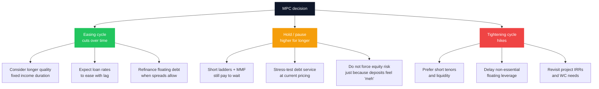
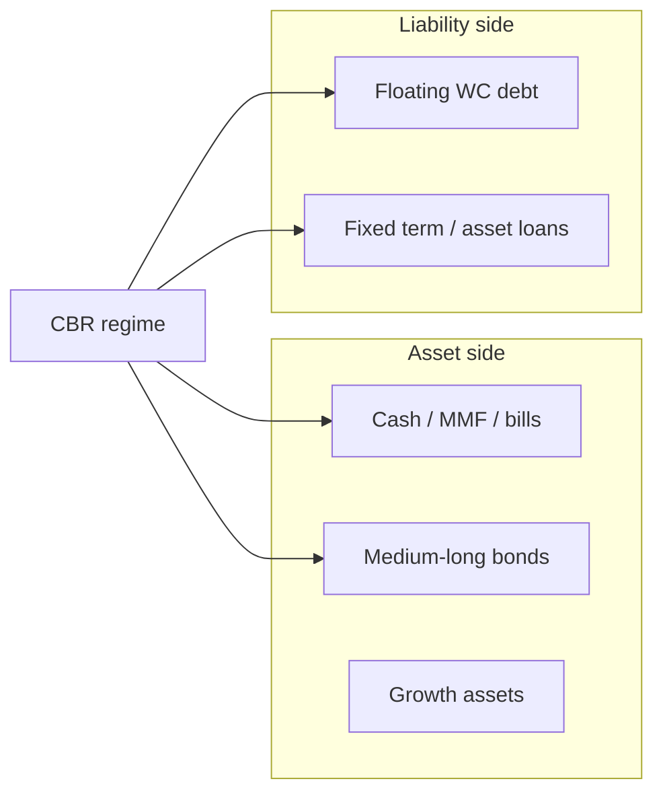

The Central Bank Rate (CBR) is not a trivia number for economists. It is the **reference cost of money** in Kenya’s formal system. When the Monetary Policy Committee (MPC) cuts, holds, or hikes, the effects show up in auction yields, bank loan negotiations, overdraft pricing, fixed-deposit offers, and - with a lag - Money Market Fund distributions.

You do not need to predict the next vote. You need a **positioning playbook**: what to emphasise when rates are high and sticky, what to lock when they are falling, and what to avoid when cheap credit tempts bad projects. This article is that playbook, written for households and SME owners who already use tools like [Treasury bonds](/blog/kb-bond-guide-2026), [T-bill ladders](/blog/advanced-dhowcsd-t-bill-ladder), and bank facilities.

> **Key Insight:** The CBR sets the **direction of travel** for the price of money; your job is to match **duration, debt, and liquidity** to that direction. In a cutting cycle, long fixed-rate assets gain appeal and floating-rate debt gets lighter over time. In a hiking or “higher for longer” hold, cash and short tenors pay you to wait, and new long fixed-rate borrowing is a decision you make with eyes open.

```cards
- icon: Landmark
  title: Know the signal
  desc: CBR is the policy anchor. Watch it with inflation and auction results - not in isolation - before you rearrange a portfolio.
  linkText: Sovereign debt explained
  linkUrl: /blog/sovereign-debt-explained
- icon: CandlestickChart
  title: Match duration
  desc: Falling-rate worlds favour locking longer quality yields; rising-rate worlds favour shorter ladders and dry powder.
  linkText: T-bill ladder guide
  linkUrl: /blog/advanced-dhowcsd-t-bill-ladder
  type: amber
- icon: Scale
  title: Match the liability
  desc: Floating SME debt and fixed investment income are a mismatched couple. Structure both sides deliberately.
  linkText: How banks price loans
  linkUrl: /blog/how-kenyan-banks-price-loans
  type: emerald
```

---

### What the CBR Is (and Is Not)

The **Central Bank Rate** is the CBK’s policy rate - the stance signal from the MPC. It influences:

- Interbank and short-term money-market conditions  
- The environment in which **Treasury bill and bond** auctions clear  
- How banks think about **base pricing** for loans and deposits (with lag, competition, and risk premia)  
- The opportunity cost of holding cash in low-yield current accounts  

It is **not**:

- Your personal loan rate (that is CBR-influenced **plus** bank margin, risk premium, and fees - see [loan pricing](/blog/how-kenyan-banks-price-loans))  
- Your MMF yield tomorrow morning (portfolios reprice with a lag)  
- A guarantee that inflation will sit at any single print  

Always pair CBR with **inflation**. The real return that matters for savers is approximately:

$$
r_{\text{real}} \approx r_{\text{nominal}} - \pi
$$

where \(r_{\text{nominal}}\) is your after-fee, after-tax yield and \(\pi\) is inflation. A 10% nominal yield with 7% inflation is a very different wealth engine from 10% nominal with 3% inflation.

For a dated snapshot of how rates sit next to banking structure, see the [ultimate banking guide](/blog/ultimate-guide-to-banking-in-kenya). Confirm live figures on the [CBK](https://www.centralbank.go.ke/) site before large decisions - this article teaches **response rules**, not a frozen rate sheet.

---

### Three Policy Regimes (Use These, Not Crystal Balls)



| Regime | Saver / investor emphasis | Borrower / SME emphasis |
|---|---|---|
| **Easing (cuts)** | Extend duration selectively; lock attractive bond yields; keep an emergency sleeve liquid | Ask for reviews on floating facilities; refinance expensive short debt if cash-flow supports it |
| **Hold (pause)** | Barbell: liquid MMF/T-bills + core long bonds already owned; avoid FOMO | Assume current debt cost persists; fix [working capital](/blog/working-capital-cycle-kenya-smes) leaks before expanding limits |
| **Tightening (hikes)** | Short ladders; avoid stretching into illiquid yield chases | Postpone marginal projects; raise prices/collections; do not fund dead stock on dear overdrafts |

---

### Household Playbook

**1. Emergency fund first - always.** Rate cycles change *where* the buffer sits (MMF vs short T-bills vs SACCO), not *whether* you need one. See [personal finance](/blog/ultimate-guide-to-personal-finance-kenya) and [bank vs SACCO vs MMF](/blog/bank-vs-sacco-vs-mmf-savings).

**2. When policy is easing:**  
- Reinvest maturing T-bills with a plan: some stay short for cash needs; some roll into longer [bonds/IFBs](/blog/kb-bond-guide-2026) if the locked yield still beats your inflation assumption after tax.  
- Do not dump a well-bought long bond only because headlines say “rates are falling” - price already moves in anticipation; transaction costs and reinvestment risk matter.  
- Review expensive consumer debt before chasing an extra 1% on savings.

**3. When policy is tight or on hold at high levels:**  
- Short **ladders** (the discipline in the [DhowCSD guide](/blog/advanced-dhowcsd-t-bill-ladder)) pay you to stay liquid.  
- Idle current-account balances are a silent tax - move operational surplus deliberately.  
- Prefer **quality** sovereign exposure over obscure high-yield promises.

**4. Tax still ranks with yield.** After-tax, after-fee comparisons beat raw coupon bragging - same logic as [tax drag](/blog/sleeping-asset-optimization) on long-term pots.

```cards
- icon: Wallet
  title: Household
  desc: Buffer in liquid yield tools; lengthen only money you will not need for years; kill expensive consumer debt before yield-chasing.
  linkText: Investing cornerstone
  linkUrl: /blog/ultimate-guide-to-investing-in-kenya
- icon: Factory
  title: SME operator
  desc: Floating WC lines, fixed asset loans, and inventory cycles respond differently to CBR. Match facility type to the gap.
  linkText: Working capital cycle
  linkUrl: /blog/working-capital-cycle-kenya-smes
  type: amber
- icon: PieChart
  title: Long-term allocator
  desc: Policy cycles are for rebalancing edges - not abandoning a written plan every MPC week.
  linkText: Bond anchor guide
  linkUrl: /blog/kb-bond-guide-2026
  type: emerald
```

---

### SME and Borrower Playbook

Bank credit does not reprice the morning after an MPC statement. Spreads, collateral, and conduct still dominate. But the **direction** matters.

**Floating working-capital and overdrafts**  
- In an easing cycle, prepare a **clean pack** and ask for a structured review - do not wait passively ([proposal anatomy](/blog/anatomy-of-a-bank-proposal-kenya)).  
- In a hiking cycle, utilisation discipline matters more: maxed limits + rising rates = margin compression. Fix CCC before begging for headroom.

**Term and asset finance**  
- Fixed-rate asset loans taken at peak rates can look painful later if the cycle eases - but early settlement rules and penalties decide whether refinancing is real.  
- Never fund multi-year machines on perpetual overdraft “because CBR might fall.” Match tenor to asset life ([asset finance vs conventional loans](/blog/asset-finance-vs-conventional-loans)).

**Trade and guarantees**  
- Facility fees and cash collateral opportunity cost rise in tight liquidity regimes. Price [guarantees and trade instruments](/blog/bank-guarantees-kenya-sme-guide) into contract margins before you bid.

**Simple project test when rates are high:**

$$
\text{Project needs margin thick enough that } \text{ROI} \gg \text{all-in borrowing cost} + \text{risk buffer}
$$

If the deal only works at last year’s cheaper debt, it is not a good deal - it is a rate bet.

---

### Investor Sleeve: Bonds, Bills, MMFs, Deposits

| Tool | Easing-cycle tendency | Tight/hold tendency | Watch-outs |
|---|---|---|---|
| **T-bills / short ladder** | Still useful for cash buckets | Core parking place | Reinvestment risk if yields fall fast |
| **Long Treasuries / IFBs** | Attractive to **lock** if yield still adequate | Be selective on entry price | Mark-to-market pain if yields spike after you buy |
| **MMFs** | Yields lag downward | Competitive parking | Platform and fund risk; not a bond substitute for long goals |
| **Fixed deposits** | Shop less urgently | Negotiate; compare net of tax to bills/MMF | Breakage costs; bank concentration vs KDIC limits |
| **Equities / credit risk assets** | Can re-rate if growth improves | Demand higher risk premium | Do not “reach for yield” in junk credit |

Sovereign issuance and fiscal news move the same curve the CBR influences - context in [sovereign debt explained](/blog/sovereign-debt-explained) and regional framing in [East African sovereign themes](/blog/east-african-sovereign-summit).



**Mismatch to avoid:** long floating-rate debt funding a slow inventory cycle while all your savings sit in a five-year bond you refuse to touch. Both sides of the balance sheet should be designed.

---

### A 90-Day Personal Rate-Cycle Routine

| When | Action |
|---|---|
| **MPC week** | Read the decision and the inflation paragraph; do not trade on headlines alone |
| **Week after** | Note T-bill auction results vs your ladder maturities |
| **Monthly** | Recompute real yield on your main savings sleeve |
| **Quarterly** | Review floating facilities utilisation and pricing with your RM |
| **Any large decision** | Write the thesis: “I am extending duration / refinancing / delaying leverage because…” |

If you cannot write the thesis in one sentence, you are reacting, not positioning.

---

### What Not to Do

1. **Rotate 100% of long-term money into cash** on every hike rumour - abandoning a plan is how investors buy high and sell low.  
2. **Max floating credit** because “rates will be cut soon” - that is speculation with payroll risk.  
3. **Ignore tax and fees** when comparing FD, MMF, and bond yields.  
4. **Confuse CBR cuts with instant cheaper SME loans** - conduct and risk tier still price the facility.  
5. **Use mobile or card debt as a macro hedge** - see [digital loan costs](/blog/mobile-digital-loans-real-cost-kenya); the APR rarely cares about the MPC communique.

---

### Closing

The CBR cycle is a **weather system**, not a lottery ticket. Households should keep a liquid buffer, then lengthen or shorten quality fixed-income exposure as the regime changes. SMEs should treat policy easing as a moment to **renegotiate structure**, and tightening as a moment to **repair cash conversion and project discipline**. Long-term investors should rebalance at the edges - not rebuild their philosophy four times a year.

For instrument-level depth, continue with [Treasury bonds](/blog/kb-bond-guide-2026), [T-bill ladders](/blog/advanced-dhowcsd-t-bill-ladder), and [loan pricing](/blog/how-kenyan-banks-price-loans). For a balance-sheet conversation that ties deposits, debt, and investment sleeves together, use [services](/services) or [book a session](/contact). Position for the cycle you are in; do not bet the firm on the cycle you hope for.
