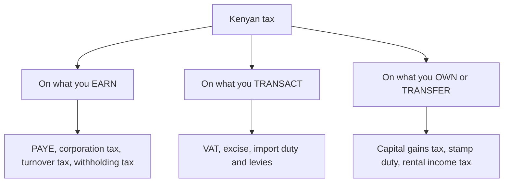
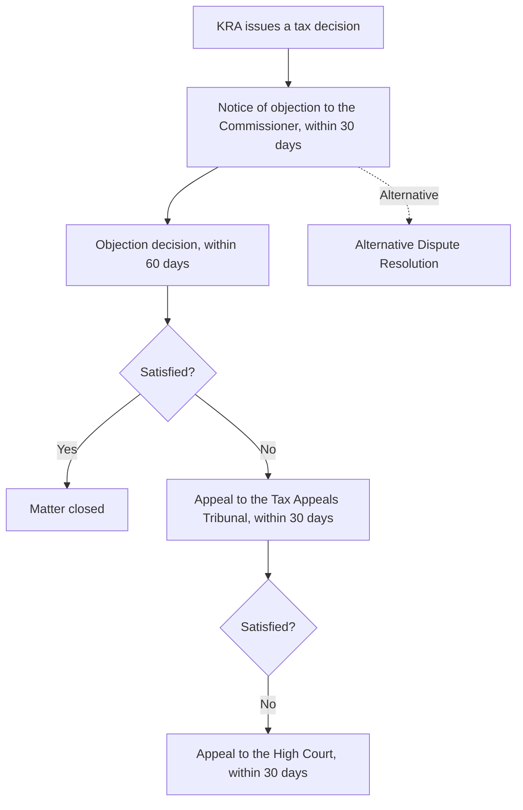

Ask a Kenyan employee what tax they pay and they will say PAYE. Ask an SME owner and they will name whichever return is due this week. Both answers are true and both are useless, because the burden that actually matters is the total, and almost nobody computes the total.

Here is what the total looks like. An employee on KES 150,000 a month keeps KES 103,618. Their employer spends KES 158,730 to employ them. The gap between what the business pays out and what the person takes home is **KES 55,112 a month, or 34.7% of the total cost of employment**, and no single return, payslip line or KRA notice ever displays that number. It is assembled from four separate deductions administered under three separate laws, and the only place it exists as one figure is in a calculation nobody performs.

The business version is worse, because the taxes arrive in a sequence and each one switches on at a different threshold. Register a company and corporation tax applies. Hire someone and you become an unpaid PAYE collector. Cross KES 5 million of taxable supplies and VAT makes you an unpaid VAT collector too, with a remittance date that ignores whether your customers have paid. Sell the premises at the end and capital gains tax appears on a number you cannot reconstruct because you threw away the receipts in 2018.

This guide is the map of the whole system. It does not re-teach any individual tax; four deep-dives already own that ground and are linked at every turn. What it owns is the part none of them can: how the pieces fit, what they cost together, when each one falls due, what happens when you miss, and the single distinction that determines whether a business survives its own tax obligations.

> **Key Insight:** There are two kinds of tax money and confusing them destroys businesses. **Assessed tax** is charged on your profit: corporation tax, turnover tax, capital gains tax. If there is no profit there is generally no tax, and the money was always yours until the assessment. **Collected tax** is money you took from somebody else and hold for KRA: VAT charged to your customers, PAYE deducted from your staff, withholding tax deducted from your suppliers. It was never yours for a second. It arrives in the same bank account as everything else, looks identical, and spends identically, and the businesses that fail on tax are almost always the ones that spent the second kind while thinking about the first.

```cards
- icon: Layers3
  title: Add the stack, not the line
  desc: PAYE plus SHIF plus housing levy plus NSSF is one number, and it is much larger than the one on the payslip that says tax.
- icon: HandCoins
  title: Collected money is not yours
  desc: VAT and PAYE are held on behalf of others. Move them out of the operating account on the day they land, or you will spend them.
  type: amber
- icon: BadgeCheck
  title: Compliance opens doors
  desc: A tax compliance certificate gates tenders, AGPO, permits and, in practice, credit. Being compliant is worth money, not just peace of mind.
  linkText: The bankable trail
  linkUrl: /blog/new-business-banking-journey-kenya
  type: emerald
```

---

### Part 1: The Three Families

Every tax a Kenyan meets falls into one of three families, and knowing which family you are dealing with tells you when it falls due, whether you can plan around it, and what happens if you have no money.



**Taxes on what you earn** follow income. They rise and fall with profit, they can be reduced by legitimate deductions, and in a bad year they largely disappear. This is the family most people think of as "tax".

**Taxes on what you transact** follow activity, not profitability. VAT is charged on sales whether or not the sale was profitable. Import duty is charged on the consignment whether or not it sells. These are the taxes that hurt a struggling business, because they keep arriving when the profits have stopped.

**Taxes on what you own or transfer** are episodic. They appear at a moment of change: a sale, a transfer, an inheritance, an exit. Because they are rare, they are the ones people are least prepared for and the ones where preparation pays best.

| Family | Examples | Falls due | Survives a bad year? |
|---|---|---|---|
| Earn | PAYE, corporation tax, turnover tax | Monthly, quarterly, annually | Mostly falls with profit (turnover tax does not) |
| Transact | VAT, excise, customs duty and levies | On the transaction, monthly | **No.** Payable regardless of profit |
| Own or transfer | Capital gains tax, rental income tax, stamp duty | On the event | N/A, but the bill is large and one-off |

The single most dangerous cell in that table is turnover tax sitting in the "earn" family while behaving like a "transact" tax, because it is charged on gross sales and is payable in a loss year. That is the whole argument of [turnover tax vs corporation tax](/blog/turnover-tax-vs-corporation-tax-kenya).

---

### Part 2: The Distinction That Decides Everything

Return to the Key Insight, because it is worth a section of its own.

**Money you were assessed on** is money you earned. Corporation tax on profit, turnover tax on sales, capital gains tax on a gain. The tax is a share of something that was yours.

**Money you collected** was never yours:

- **VAT** you charged a customer. You are an agent. See [VAT for Kenyan SMEs](/blog/vat-for-smes-kenya).
- **PAYE** you deducted from an employee's salary. It is their tax, deducted by you.
- **Withholding tax** you deducted from a consultant's invoice. Same.

The failure pattern is identical in every case. The money arrives in the operating account, indistinguishable from revenue. Cash gets tight. A supplier demands payment. The tax due on the 20th, or the 9th, is the one obligation with no human being on the other end of the phone, so it slips. Next month it happens again against a larger balance, and the business is now funded by a liability it cannot see.

**The fix is a second account and a rule.** On the day money lands, the collected portion moves out. For VAT that is the gross receipt times 16 over 116. For PAYE it is the deduction schedule your payroll already produces. Neither calculation is difficult. The discipline is the whole intervention, and it is the difference between a business with a tax problem and a business without one.

$$
\text{VAT inside a gross receipt} = \text{Gross} \times \frac{16}{116}
$$

There is a second reason to take this seriously. Unremitted collected tax is the hardest category of tax debt to negotiate, because the money was taken from third parties in the first place. An assessment you dispute is an argument about numbers. Unremitted PAYE is an argument about where somebody else's money went.

---

### Part 3: What an Employee Actually Keeps

Take the worker from [PAYE, withholding, and freelance tax](/blog/paye-withholding-freelance-tax-kenya), on a gross salary of KES 150,000 a month. That article works the PAYE computation itself in full, including the order of operations and the 2024 change that moved SHIF and the housing levy from reliefs to allowable deductions. What it does not do, and what belongs here, is decompose the whole stack.

| Layer | Monthly (KES) | % of gross |
|---|---:|---:|
| **Gross pay** | **150,000** | 100% |
| NSSF (employee, at the February 2026 maximum) | 6,480 | 4.3% |
| SHIF at 2.75% of gross | 4,125 | 2.75% |
| Affordable Housing Levy at 1.5% of gross | 2,250 | 1.5% |
| **Taxable pay** | **137,145** | 91.4% |
| PAYE (after personal relief) | 33,527 | 22.4% |
| **Net pay** | **103,618** | **69.1%** |

Three observations that only appear once the layers are stacked.

**The line labelled "tax" is not the tax.** PAYE takes 22.4% of gross. The full statutory bite is 30.9%. The KES 12,855 of contributions is invisible in most conversations about tax because it is called something else, and two thirds of it (SHIF and the housing levy) buys the employee no individual entitlement they can point to.

**The employer pays more than the payslip shows.** NSSF is matched by the employer at KES 6,480, and the housing levy is matched at KES 2,250. SHIF is employee-only. So:

| | Amount (KES) |
|---|---:|
| Total cost to the employer | 158,730 |
| Received by the employee | 103,618 |
| **The wedge** | **55,112** |
| **Wedge as a share of employment cost** | **34.7%** |

More than a third of what it costs to employ this person never reaches them. For an SME owner deciding whether to hire, this is the number that matters, and it is not the salary. For an employee negotiating, it explains why an employer resists a raise that looks affordable on the payslip.

**The contributions are not all bad news.** NSSF is your money in a retirement pot, discussed in [NSSF Tier II vs private pension](/blog/nssf-tier-ii-vs-private-pension-kenya) and [retirement planning in Kenya](/blog/retirement-planning-kenya-guide). And because SHIF, the housing levy and pension contributions are now *allowable deductions* rather than reliefs, each one costs you less than its face value: a contribution of KES 100 costs a 30% taxpayer only KES 70 of take-home. That mechanism is worked in the PAYE article and is the single most useful thing an employee can understand about their payslip.

*Statutory rates as at August 2026: NSSF 6% each side with the fourth-phase limits effective February 2026 (employee maximum KES 6,480 a month); SHIF 2.75% of gross, employee only, minimum KES 300, no upper cap; Affordable Housing Levy 1.5% employee and 1.5% employer. Confirm on KRA and with the respective funds.*

#### And Then You Spend It

The KES 103,618 that reaches the account is not the end of the story either, because the second family of tax is waiting on the other side of it.

Every purchase at a formal retailer carries **16% VAT**, embedded in the shelf price rather than added at the till, so it is never experienced as tax. Fuel carries excise duty and a stack of levies on top of VAT at the special rate. Airtime and data carry excise. Imported goods arrive having already absorbed customs duty, the import declaration fee and the railway development levy, all of which sit inside the price before the retailer's margin is added. Money in a savings account or a money market fund has **15% withholding tax** taken at source before the interest is credited, which is why the [fixed income guide](/blog/fixed-income-kenya-complete-guide) insists on comparing after-tax yields.

None of this appears on a payslip and none of it is avoidable. The point is not to compute it, which is impractical for a household, but to correct the mental model: **the 30.9% on the payslip is a floor, not a total**. The genuinely useful response is the one the [personal finance guide](/blog/ultimate-guide-to-personal-finance-kenya) argues for anyway, which is to plan from net income and to place savings where the tax treatment is favourable rather than where the headline rate looks highest. An infrastructure bond paying tax-free beats a savings account paying 15%-taxed interest by considerably more than the difference in their advertised rates.

---

### Part 4: What a Freelancer Actually Keeps

The independent contractor faces the same income tax as the employee and a completely different rhythm, plus two traps that catch nearly everyone.

**Trap one: withholding tax is an advance, not a settlement.** A client deducting 5% from a professional fee has not paid your tax. They have made a down payment on it. The gap between the 5% withheld and the 25% or 30% marginal rate eventually assessed is the single commonest cause of a filing-season catastrophe among Kenyan consultants, and it is worked with a full year's numbers in [PAYE, withholding, and freelance tax](/blog/paye-withholding-freelance-tax-kenya).

**Trap two: turnover tax is not available on fee income.** Management, professional and training fees are **excluded** from the turnover tax regime entirely. The consultant who assumed 1.5% of billings was their cheap option cannot use it, and is instead in the ordinary regime at graduated rates on net profit. The compensation is real, though: the ordinary regime allows deductions, and a consultant's genuine costs are frequently 30% or more of billings. See [turnover tax vs corporation tax](/blog/turnover-tax-vs-corporation-tax-kenya).

The freelancer's obligations, in order of how often they are missed:

1. **Set aside on receipt, not at filing.** A fixed percentage of every payment, moved to a separate account the day it arrives. This is the same discipline as the VAT sinking account and it fails for the same reason when neglected.
2. **Instalment tax**, where the tax payable for the year exceeds KES 40,000, in four payments on the 20th of the fourth, sixth, ninth and twelfth months of the year of income.
3. **The annual return** by 30 June for the previous calendar year.
4. **VAT registration** if billings reach KES 5 million in any rolling twelve months. Consultants routinely cross this without noticing, because they are thinking about income tax.

---

### Part 5: What an SME Actually Keeps

A business meets taxes in a sequence, and the sequence is predictable enough to plan for.

| Stage | What switches on | Where the detail lives |
|---|---|---|
| Registration | PIN, then corporation tax or the graduated rates if unincorporated | [From registration to first facility](/blog/new-business-banking-journey-kenya) |
| First sales | Regime choice: turnover tax or the normal regime, decided by **net margin** not revenue | [Turnover tax vs corporation tax](/blog/turnover-tax-vs-corporation-tax-kenya) |
| First employee | PAYE, NSSF, SHIF, housing levy, all as a collector | Part 3 above |
| Any invoicing | eTIMS electronic invoices, which support both your customers' claims and your own records | [eTIMS and the SME](/blog/etims-kenya-sme-guide) |
| KES 5m taxable supplies | VAT registration, monthly, a working-capital event | [VAT for Kenyan SMEs](/blog/vat-for-smes-kenya) |
| Paying consultants, rent, royalties | Withholding tax as a deducting agent | Part 2 above |
| Importing | Duty, IDF, RDL and import VAT, all payable at the port | [The complete guide to trade finance](/blog/trade-finance-kenya-complete-guide) |
| Owning property | Rental income tax if let; capital gains tax on transfer | [Rental income in Kenya](/blog/rental-income-yield-tax-kenya), [Capital gains tax](/blog/capital-gains-tax-kenya) |
| Exit | Capital gains tax, and the share-versus-asset structure decision | [Capital gains tax](/blog/capital-gains-tax-kenya), [Business valuation](/blog/business-valuation-kenya-guide) |

The pattern worth noticing is that **the taxes an SME finds hardest are almost all collection obligations rather than assessments**. PAYE, VAT and withholding tax are the ones that generate penalties, arrears and sleepless nights, and none of them is a tax on the business at all. The business is simply the state's collection agent, unpaid, with a fixed calendar and no discretion.

That reframing changes what you do about it. You do not manage a collection obligation by trying to reduce it. You manage it by never letting the money mix.

---

### Part 6: The Total Tax Bill of One Small Business

Nobody adds it up, so here it is added up.

Take a distributor: a limited company in Nakuru, VAT-registered, six employees, turnover of KES 40,000,000 excluding VAT, an 18% gross margin, and a net profit of KES 2,400,000, which is a 6% net margin. Ordinary, unremarkable, and probably regarded by its owner as a business that pays "about 720,000 in tax".

Here is the actual year.

| Tax head | Basis | Amount (KES) | Whose money? |
|---|---|---:|---|
| Corporation tax | 30% of KES 2.4m profit | 720,000 | **The business's** |
| Employer NSSF | 6% matched, 6 staff | 216,000 | **The business's** |
| Employer housing levy | 1.5% of KES 3.6m payroll | 54,000 | **The business's** |
| VAT remitted, net | Output 6,400,000 less input 5,440,000 | 960,000 | Customers' |
| PAYE | 6 staff averaging KES 50,000 a month | 421,000 | Employees' |
| Withholding tax on professional fees | 5% of KES 600,000 | 30,000 | Suppliers' |
| **Total remitted to the state** | | **2,401,000** | |

Two figures deserve to be sat with.

**The business remits KES 2,401,000 in a year it earned KES 2,400,000.** The total passing through its bank account to KRA is almost exactly equal to its entire annual profit. Any owner who has felt that the business works for the taxman is not imagining it, though the feeling and the arithmetic point at different things.

**Only KES 990,000 of it is the business's own money.** Corporation tax plus the employer's statutory contributions. The other **KES 1,411,000**, nearly 59% of the total, was collected from customers, employees and suppliers, and was never the company's at any point.

That split is the whole argument of Part 2 made concrete. The owner who thinks of the tax burden as KES 2.4 million is depressed by a number that is not theirs. The owner who thinks of it as KES 720,000 is ignoring KES 1.4 million of other people's money moving through their account every year, which is the money that actually gets spent by accident.

The right mental model is neither. It is: **KES 990,000 is my tax, and KES 1,411,000 is float I am legally required not to touch.**

---

### Part 7: The Withholding Tax You Must Deduct

Most articles cover withholding tax from the perspective of the person it is deducted from. The business-side obligation is the opposite and is more often missed: when you pay certain suppliers, **you must deduct tax and remit it**, and failing to do so makes the shortfall your problem, not theirs.

Common resident rates:

| Payment | Resident rate | Non-resident rate |
|---|---:|---:|
| Management or professional fees | 5% | 20% |
| Training fees | 5% | 20% |
| Contractual fees | 3% | 20% |
| Royalties | 5% | 20% |
| Dividends (holding under 12.5% of voting power) | 5% | 15% |
| Dividends (holding 12.5% or more) | Exempt | 15% |
| Interest, general | 15% | 15% |
| Rent on immovable property | Applies to appointed agents | 30% |

*Rates as at August 2026 per PwC's maintained Kenya summary; confirm on KRA, and note that the non-resident column is where the largest and least-expected liabilities sit.*

Four practical points.

**Remit within five working days of deduction.** This is a much tighter clock than the monthly rhythm of everything else, and it is the reason withholding tax obligations pile up in businesses that batch their administration weekly.

**The certificate matters to your supplier.** The consultant you deducted from needs the withholding certificate to claim the credit against their own liability. Issuing them promptly is both an obligation and ordinary commercial courtesy.

**Paying a non-resident is the high-risk case.** A 20% deduction on a payment to a foreign consultant or a software vendor is easy to miss entirely, and easy to get wrong where a double tax treaty applies. Take material cross-border payments to an adviser before you make them, not after.

**Failure to deduct is penalised separately.** KRA lists a 10% penalty on the amount involved for failure to deduct withholding VAT or rental income tax, on top of the underlying liability. The economics of "we'll just pay the supplier gross and sort it later" are worse than they look.

---

### Part 8: The Filing Calendar

Every date in one place. This is the table to print.

#### Monthly

| Tax | Due | Who |
|---|---|---|
| PAYE, NSSF, SHIF, Housing Levy | **9th** of the following month | Any employer |
| Withholding tax remittance | Within **5 working days** of deduction | Anyone deducting |
| VAT | **20th** of the following month | VAT-registered persons |
| Turnover tax | **20th** of the following month | TOT taxpayers |
| Rental income tax (MRI) | **20th** of the following month | Residential landlords in the MRI regime |
| Excise duty | **20th** of the following month | Licensed manufacturers and providers |

#### Quarterly

| Tax | Due |
|---|---|
| Instalment tax, four payments | **20th** of the 4th, 6th, 9th and 12th months of the year of income |
| Instalment tax, agricultural businesses | **75%** in the 9th month, **25%** in the 12th |

Instalment tax is not required where the tax payable for the year is KES 40,000 or less, and each instalment is the lower of 110% of the previous year's liability or an estimate of the current year's.

#### Annually

| Tax | Due |
|---|---|
| Individual income tax return | **30 June** for the previous calendar year |
| Company income tax return | Within **6 months** of the financial year end |
| Balance of company tax | Within **4 months** of the financial year end |

#### On the event

| Tax | Due |
|---|---|
| Capital gains tax | The **earlier** of the vendor receiving the full price or registration of the transfer |
| Stamp duty | On the instrument, before registration |
| Customs duty, IDF, RDL, import VAT | At clearing, before the goods are released |

Two habits make this calendar manageable. First, **put the recurring dates into the cash forecast as fixed outflows**, exactly as you would payroll, using the method in [the 13-week cash forecast](/blog/13-week-cash-forecast-kenya-sme). Second, note that **the 9th and the 20th are two different problems**. The 9th is payroll-linked and predictable. The 20th is sales-linked and moves with the month you have just had, which is precisely why it surprises people after a good month.

*Deadlines as at August 2026. Where a due date falls on a weekend or public holiday, confirm KRA's treatment. Verify all dates on the KRA portal.*

---

### Part 9: What It Costs to Miss

Penalties differ by tax head, and the differences are large enough to change which return you prioritise on a bad week.

| Tax head | Late filing penalty |
|---|---|
| **PAYE** | **25% of the tax due or KES 10,000, whichever is higher** |
| VAT | 5% of the tax due or KES 10,000, whichever is higher |
| Excise duty | 5% of the tax due or KES 10,000, whichever is higher |
| Company or partnership income tax | 5% of the tax due or KES 20,000, whichever is higher |
| Individual income tax | 5% of the tax due or KES 2,000, whichever is higher |
| Rental income (MRI) | 5% or KES 2,000 (individuals); 5% or KES 20,000 (non-individuals) |
| Withholding tax | 5% of the tax due |
| Turnover tax | KES 1,000 per month |
| Failure to deduct withholding VAT or rental income tax | 10% of the amount involved |

**Late payment**, across the major heads: **5% of the tax due**, plus **interest at 1% per month** on the unpaid amount.

*Penalties as published by KRA and current at August 2026. Note that some advisory sources quote a different turnover tax penalty; KRA's own turnover tax page states KES 1,000 per month, and KRA is the authority. Confirm on the KRA portal before relying on any figure here.*

Three things this table tells you:

**PAYE is the one to never miss.** At 25% of the tax due, its late-filing penalty is five times the rate applied to VAT or corporation tax. That is not an accident. It reflects that PAYE is money already taken from employees.

**Filing and paying are separate obligations.** If cash is short, **file on time and pay late**. You will incur the 5% late-payment penalty and 1% monthly interest, but you avoid the late-filing penalty entirely, which on PAYE is the larger of the two by a wide margin. Businesses in difficulty routinely do the opposite, skipping the return because they cannot fund it, and pay twice for the privilege.

**Interest compounds quietly.** One per cent a month on a balance that already carries a penalty is how a manageable arrear becomes an unmanageable one over two years. Approach KRA early. A payment plan on a declared liability is an ordinary conversation; an undeclared one discovered later is not.

---

### Part 10: Compliance as a Commercial Asset

The framing of tax as pure cost misses something that matters commercially, and it is the reason this guide is not called "how to pay less tax".

A **tax compliance certificate** is issued to taxpayers who have filed and paid what is due. It is ordinarily valid for twelve months. And it is a gate:

- **Tenders.** Public procurement requires it. No certificate, no bid, however good your price. That includes the [AGPO](/blog/agpo-tender-cash-flow-kenya) reserved categories.
- **Corporate supply chains.** Large private buyers increasingly require it from suppliers, partly for their own VAT input-credit reasons, since a supplier who does not declare sales destroys their customer's input claim.
- **Permits and licences.** Various regulatory and immigration processes require it.
- **Credit, in practice.** A bank assessing a facility wants to see a business whose declared numbers, filed returns and bank statements tell the same story. They frequently do not, and the borrower is then asking to be lent against figures the state has never seen.

That last point is the one under-appreciated by owners who under-declare to save tax. The saving is real and so is the cost: a business with two sets of numbers can only ever borrow against the smaller one. On a facility priced around a 14.5% industry average lending rate, the difference between being financeable and not is usually larger than the tax "saved", and it compounds because the facility funds growth the under-declared business never gets.

This is the same argument made from the records side in [eTIMS and the SME](/blog/etims-kenya-sme-guide) and from the lender's side in [the anatomy of a perfect bank proposal](/blog/anatomy-of-a-bank-proposal-kenya): **the file you keep for KRA is the file you borrow against.** Building two files means building neither properly.

---

### Part 11: When You Disagree with KRA

KRA's published position is the authority on how a tax is administered, and for practical purposes it is final. But "final" has a precise meaning, and it is not "unchallengeable". There is a defined path, it is governed by the Tax Procedures Act, and it runs on short clocks.



The essentials:

**Object within 30 days.** A taxpayer disputing a tax decision must lodge a notice of objection with the Commissioner within 30 days of being notified. This is the gateway, and missing it is close to fatal to the dispute.

**The Commissioner must decide within 60 days.** Where no objection decision is issued within 60 days of the objection, or of any further information the Commissioner requested, the objection is deemed allowed. That deadline is a real protection and worth knowing about.

**Then the Tax Appeals Tribunal, within 30 days.** The Tribunal hears appeals against the Commissioner's decisions, sitting in panels of at least three, at least one an advocate of the High Court.

**Then the High Court, within 30 days** of a Tribunal decision you are dissatisfied with.

**Alternative Dispute Resolution** exists alongside this and can settle a matter without running the full course, subject to the Tribunal's or the court's permission and a time limit on reaching settlement.

Two warnings. First, **you are generally confined to the grounds stated in your original objection** on any later appeal, unless the Tribunal or court permits new ones. That makes the drafting of the objection, at the very start and under a 30-day clock, the most consequential step in the whole process. Second, this is not a self-service process. Engage a tax agent or an advocate at the objection stage, not at the Tribunal stage, because by then the grounds are already fixed.

The practical posture for a small business is therefore straightforward. Treat KRA's stated position as the operating rule and comply with it. If you have a genuine, evidenced disagreement, object properly and on time rather than ignoring the assessment, because ignoring it removes every option you had.

---

### Part 12: Where the Rest of the Detail Lives

This hub deliberately does not restate what other articles own. If you need the mechanics rather than the map:

| Topic | Article |
|---|---|
| PAYE order of operations, reliefs vs deductions, freelance WHT and instalment tax | [PAYE, withholding, and freelance tax](/blog/paye-withholding-freelance-tax-kenya) |
| VAT registration, zero-rated vs exempt, input credits, the cash-flow trap | [VAT for Kenyan SMEs](/blog/vat-for-smes-kenya) |
| Turnover tax vs the normal regime, the 5% margin break-even, the fees exclusion | [Turnover tax vs corporation tax](/blog/turnover-tax-vs-corporation-tax-kenya) |
| Capital gains on land, shares and business exit; share sale vs asset sale | [Capital gains tax in Kenya](/blog/capital-gains-tax-kenya) |
| Monthly Rental Income tax, the 7.5% on gross rent, election out | [Rental income in Kenya](/blog/rental-income-yield-tax-kenya) |
| Withholding tax on listed dividends | [Dividend income on the NSE](/blog/dividend-income-nse-kenya) |
| Withholding tax on SACCO dividends and deposit interest | [The ultimate guide to SACCO membership](/blog/ultimate-guide-to-sacco-membership-kenya) |
| Withholding tax across the fixed-income ladder, and the infrastructure bond exemption | [The complete guide to fixed income](/blog/fixed-income-kenya-complete-guide) |
| eTIMS, electronic invoicing, and turning compliance into bankable records | [eTIMS and the SME](/blog/etims-kenya-sme-guide) |
| Import duty, IDF, RDL and import VAT in the landed-cost stack | [The complete guide to trade finance](/blog/trade-finance-kenya-complete-guide) |

---

### Frequently Asked Questions

**I have no money to pay this month's return. What do I do?**
File it anyway, on time, and pay what you can. Filing and payment are separate obligations with separate penalties, and the filing penalty is the heavier of the two on PAYE at 25% of the tax due. Then approach KRA about the balance rather than waiting to be found. A declared liability you are paying down is a normal conversation; an undeclared one discovered later is not.

**Does being on turnover tax mean I do not have to worry about VAT?**
No, and this is one of the commonest and most expensive misunderstandings. The two are entirely independent. Turnover tax settles your income tax; VAT is a separate obligation triggered by KES 5 million of taxable supplies in any rolling twelve months. A great many turnover tax payers are also VAT-registered.

**My client did not deduct withholding tax from my invoice. Am I in the clear?**
No. Withholding tax is an advance against your own liability, so if it was not deducted, the full liability simply falls due from you at filing. The absence of a deduction is a cash-flow difference, not a tax saving.

**Should I incorporate to pay less tax?**
Usually the wrong question. Incorporation is driven by liability, funding and succession first. On tax alone, a company pays a flat 30% while an individual pays graduated rates that are gentler at the bottom, so incorporation frequently increases the tax on a small profit. The regime arithmetic is in [turnover tax vs corporation tax](/blog/turnover-tax-vs-corporation-tax-kenya).

**How long should I keep records?**
Longer than you think. Tax records generally need to be kept for five years, but capital gains tax works on a different horizon entirely: the receipts for a property improvement made today may be needed a decade later to reduce a gain. Keep property and share acquisition files indefinitely.

**I have not filed for three years. What now?**
See a registered tax agent this month rather than next year. Penalties and interest compound, and the position only ever worsens with time. Voluntary regularisation from a standing start is a materially better conversation than the one that follows a compliance check, and the practical consequence of an unresolved position, an inability to obtain a tax compliance certificate, quietly closes off tenders, permits and credit in the meantime.

---

### Decision Framework: The Tax Operating System

Five things, done once and then maintained. Together they are a complete tax posture for an earner or a small business.

1. **Know which taxes apply to you, and write the list down.** Most people cannot name theirs. Use the lifecycle table in Part 5.
2. **Separate collected money from your money.** A second account, and a rule that the VAT and PAYE portions move on the day they land. This single habit prevents most tax failures.
3. **Put every due date in the cash forecast** as a fixed outflow, not an estimate.
4. **File even when you cannot pay.** The filing penalty and the payment penalty are separate, and on PAYE the filing penalty is five times heavier.
5. **Keep one set of records, good enough for both KRA and a bank.** Two sets means you can only borrow against the smaller one.

And one annual review, best done alongside the accounts:

- Has my regime stopped fitting? Margin moves, and it decides turnover tax versus the normal regime.
- Have I crossed a threshold without noticing? KES 5 million for VAT, KES 25 million for turnover tax eligibility, KES 40,000 for instalment tax.
- Am I keeping the records that will matter years from now? Property receipts are worth 15 cents in the shilling at exit.

---

### Risk Factors

**Spending collected tax.** The commonest business-ending tax failure in Kenya, and entirely preventable with a second bank account.

**Skipping a return because you cannot fund it.** Doubles the cost. File, then negotiate the payment.

**Assuming one tax is the whole tax.** The employee who thinks PAYE at 22.4% is their burden is understating it by a third; the SME owner focused on corporation tax may be carrying far more risk in VAT.

**Under-declaring to save tax.** The saving is real and so is the borrowing capacity you destroy. On a growing business the second cost usually exceeds the first.

**Threshold blindness.** VAT registration, turnover tax eligibility and instalment tax all have thresholds that a growing business crosses silently.

**Property records.** Capital gains tax is decided by documents you must keep for a decade. Nothing in the annual cycle reminds you.

**Annual legislative change.** Every figure in this guide is dated to August 2026 and every one of them is Finance Act sensitive. The PAYE bands, the NSSF limits, the CGT rate, the turnover tax rate and the VAT rules have all moved within the last four years.

---

### Bengula View

The most expensive tax mistakes I see are not aggressive positions or clever schemes gone wrong. They are administrative. A business that collected KES 2.3 million of VAT over a year and spent it in the ordinary course of operating, without any moment of decision, because it was in the same account as everything else. An employer who skipped three PAYE returns during a cash squeeze and now owes the penalty as much as the tax. An owner who under-declared for six years to save perhaps KES 400,000 a year and then could not raise a KES 15 million facility to buy the premises they had been renting for a decade, because on paper the business was too small to service it.

None of those required a tax adviser to prevent. They required a second bank account, a calendar, and a decision to keep one set of books.

There is a wider point about how tax should sit in your thinking. Tax is not a moral category and it is not a mystery. It is a cash-flow line with a known amount and a known date, which makes it one of the most forecastable outflows in any Kenyan business or household, more predictable than sales, more predictable than supplier prices, more predictable than the shilling. Almost everything that goes wrong with it goes wrong because it was treated as a compliance event that happens *to* the business, rather than as a scheduled payment the business plans *for*.

Move it into the plan. The rest is detail, and the detail is linked above.

---

### Sources and Further Reading

- [Kenya Revenue Authority](https://www.kra.go.ke/) for rates, thresholds, filing deadlines, the offences and penalties schedule, and tax compliance certificates.
- [KRA offences and penalties](https://www.kra.go.ke/business/business-compliance-penalties/business-how-to-file/business-offences-penalties) for the penalty amounts by tax head.
- [Kenya Law](https://www.kenyalaw.org/) for the Income Tax Act, the Value Added Tax Act, the Tax Procedures Act and the current Finance Act.
- [Social Health Authority](https://sha.go.ke/) and [NSSF](https://www.nssf.or.ke/) for contribution rates and limits.
- [PwC Worldwide Tax Summaries: Kenya](https://taxsummaries.pwc.com/kenya/) for a maintained summary of rates, bands and the instalment tax calendar.

*Every rate, band, threshold, deadline and penalty in this guide is dated to August 2026 and is subject to change with each Finance Act. Where sources conflict, KRA's published position is treated as authoritative. This guide is educational and is not a substitute for advice from a registered tax agent on your own circumstances. Confirm every figure with KRA before acting on it.*
