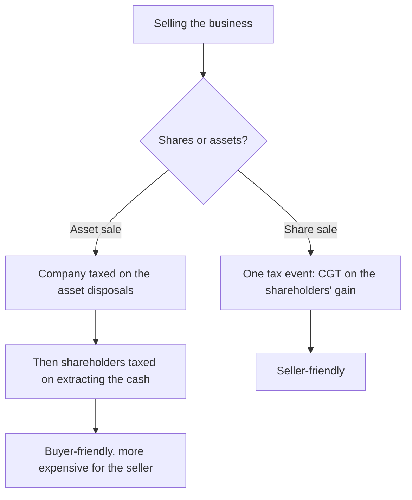

Most Kenyan taxes arrive on a schedule. PAYE every month, VAT on the 20th, instalment tax four times a year. You get used to them, and familiarity makes them manageable.

Capital gains tax is not like that. Most people meet it once or twice in a lifetime, at the end of a transaction they have already spent in their heads: the plot sold to fund a house, the shares sold to exit a business, the inherited land finally being converted into money. The buyer has paid, the advocate is preparing the transfer, and then a number appears that nobody budgeted for.

Three features make it worse than the rate alone suggests. It **tripled** to 15% at the start of 2023, so anyone reasoning from what a relative paid in 2019 is out by a factor of three. It falls due at the point of transfer, which means it gates the registration rather than waiting for a filing season. And, most expensively, what you actually pay depends on documents rather than on law: the gain is the sale price less what you can **prove** you spent, and a decade later most sellers can prove far less than they actually spent.

This guide covers what triggers the tax, how the net gain is computed, the exemption list worth reading before you sign anything, and the structural question that decides the tax bill on a business exit: whether you sell the shares or the assets.

> **Key Insight:** Capital gains tax is a records tax wearing a rate. The 15% is fixed and nothing you do changes it. What you can change, and what routinely moves the bill by hundreds of thousands of shillings, is the **adjusted cost**: the acquisition price plus the legal fees plus every improvement you ever made, each of which reduces the taxable gain and each of which you must be able to evidence. The receipts for a perimeter wall built in 2018 are worth 15% of their face value in 2026. Almost nobody keeps them.

```cards
- icon: Receipt
  title: Keep the file, not the memory
  desc: Purchase price, stamp duty, legal fees, and every improvement receipt. Each one reduces the gain, and each one must be evidenced years later.
- icon: Landmark
  title: It gates the transfer
  desc: CGT falls due at the earlier of receiving the full price or registering the transfer. It is not a filing-season problem; it is a completion problem.
  type: amber
- icon: GitCompareArrows
  title: Shares or assets changes everything
  desc: Selling the company and selling what the company owns produce different tax outcomes on the same business. Decide it before you negotiate, not after.
  linkText: What your business is worth
  linkUrl: /blog/business-valuation-kenya-guide
  type: emerald
```

---

### Part 1: What Triggers It

Capital gains tax is charged on the **net gain on the transfer of property situated in Kenya**. Property is broad: land, buildings, and shares in companies, including unquoted shares.

The essentials, per KRA as at August 2026:

| | Position |
|---|---|
| Rate | **15% of the net gain**, effective **1 January 2023** (previously 5%) |
| Who pays | The **transferor**, that is the seller |
| Nature | A **final tax**. The gain is not taxed again once the 15% is paid |
| Tax point | The **earlier** of the vendor receiving the full purchase price or the registration of the transfer instrument |
| Applies to | Property situated in Kenya, whether or not it was acquired before 1 January 2015 |

Two extensions introduced with effect from 1 July 2023 catch structures that used to sit outside the net:

- The sale of shares in a **foreign entity** that derives more than 20% of its value, directly or indirectly, from immovable property in Kenya.
- A **non-resident** disposing of an interest exceeding 20% in a Kenyan company.

These matter to diaspora investors and to anyone holding Kenyan land through an offshore vehicle. If that describes you, this is a conversation for a tax adviser, not a guide.

"Transfer" is wider than "sale". It includes a disposal by way of sale, exchange, or conveyance, and it can be triggered by transactions that involve no cash changing hands at all, which is exactly why the exemption list in Part 4 matters.

---

### Part 2: How the Gain Is Computed

The tax is on the gain, not the price. The computation runs in two halves.

$$
\text{Net gain} = (\text{Transfer value} - \text{Incidental costs of transfer}) - \text{Adjusted cost}
$$

$$
\text{CGT} = \text{Net gain} \times 15\%
$$

**Transfer value** is what you sold it for.

**Incidental costs of transfer** are what the sale itself cost you: agent's commission, advertising, legal fees on the sale, valuation fees.

**Adjusted cost** is the accumulated total of what the property cost you to own:

1. The **acquisition or construction cost**.
2. **Incidental costs of acquisition**: the legal fees, stamp duty and valuation you paid when you bought.
3. **Enhancement costs**: money spent improving the property, as distinct from maintaining it. A perimeter wall, an access road, a borehole, an extra floor.

KRA also lists interest on money borrowed to acquire the property among the allowable expenses, which matters for anyone who bought on a mortgage.

#### Worked: A Plot Sold Ten Years On

An owner buys a plot in Kiambu in 2016 for KES 2,500,000, paying KES 150,000 in stamp duty and legal fees. Over the following years they build a perimeter wall and an access road for KES 600,000. In 2026 they sell for KES 9,000,000, paying a 3% agent's commission and KES 90,000 in legal fees.

| Line | Amount (KES) |
|---|---:|
| Transfer value | 9,000,000 |
| Less agent's commission at 3% | (270,000) |
| Less legal fees on sale | (90,000) |
| **Net transfer value** | **8,640,000** |
| Purchase price | (2,500,000) |
| Stamp duty and legal fees on purchase | (150,000) |
| Perimeter wall and access road | (600,000) |
| **Adjusted cost** | **(3,250,000)** |
| **Net gain** | **5,390,000** |
| **CGT at 15%** | **808,500** |

#### The Same Sale Without the Paperwork

Now run it again for the far commoner case: the seller has the sale agreement from 2016 but cannot evidence the stamp duty receipt or the KES 600,000 of improvements, because the wall was built by a fundi paid in cash over three months in 2018.

| Line | Amount (KES) |
|---|---:|
| Net transfer value | 8,640,000 |
| Adjusted cost (purchase price only) | (2,500,000) |
| **Net gain** | **6,140,000** |
| **CGT at 15%** | **921,000** |

**KES 112,500 of extra tax, for want of receipts.** That is 15% of the KES 750,000 of legitimate costs the seller genuinely incurred and cannot prove. Nothing about the transaction changed. Only the file did.

This is the single most actionable fact in the whole subject. Every shilling of documented acquisition cost or improvement is worth 15 cents of tax saved at exit, and the exit may be a decade away. **Open a folder the day you buy the property and never close it.**

---

### Part 3: What Counts as an Improvement

Because enhancement costs reduce the gain and maintenance costs do not, the boundary is worth knowing.

**Generally enhancement (reduces the gain):**
- Construction: a wall, a gate, an additional room, a borehole, a septic system
- Site works: levelling, murram access road, drainage
- Permanent installations: solar, water tanks, fencing
- Professional fees directly tied to the improvement, such as an architect or an engineer

**Generally maintenance (does not):**
- Repainting, replacing broken fittings, routine repairs
- Ordinary upkeep that restores the property rather than improving it
- Land rates and service charge, which are running costs

The test is whether the spending made the property better or merely kept it as it was. Where the line is genuinely unclear, and on a large sum it often is, that is a question for a tax agent before the transaction rather than an argument with KRA after it.

The practical discipline is the same in every case. Keep the invoice, keep the proof of payment, and keep them together with the title documents. Bank transfers and mobile-money records are evidence; a memory of paying a fundi in cash is not.

---

### Part 4: The Exemptions

A substantial share of Kenyan property transfers are exempt, and knowing which before you sign can change how a transaction is structured. KRA's list of exempt transfers includes:

| Category | Exemption |
|---|---|
| **Value threshold** | Transfer of land where the transfer value is **KES 3,000,000 or less** |
| **Your home** | A **private residence** the individual owner has occupied continuously for the **three years** immediately before the transfer |
| **Agricultural land** | Agricultural property of **less than 50 acres** situated outside a municipality, gazetted township or urban area |
| **Listed securities** | Securities traded on a licensed securities exchange, which is why gains on **NSE shares are not subject to CGT** |
| **Family** | Transfers between spouses, or between former spouses as part of a divorce or separation settlement; transfers to immediate family; transfers to a company wholly owned by the individual, spouse or immediate family |
| **Estates** | Transfers by a personal representative to a beneficiary; sales in the course of administering an estate within **two years** of the death |
| **Trusts** | Transfers to a registered family trust |
| **Security** | Property transferred to secure a debt or a loan, and the return of it on repayment |
| **Company shares** | A company issuing its **own** shares or debentures |
| **Restructuring** | Corporate reorganisations including incorporation, recapitalisation and amalgamation, subject to conditions including a minimum period of existence for group restructurings |

Four notes that matter more than the list itself.

**The listed-shares exemption is why the NSE is quiet on this subject.** Buying and selling shares on the Nairobi Securities Exchange produces no capital gains tax. What listed shares do attract is withholding tax on dividends, covered in [dividend income on the NSE](/blog/dividend-income-nse-kenya). Unquoted shares in a private company are a different matter entirely and are fully chargeable.

**The three-year residence rule is a calendar, not an intention.** Continuous occupation for the three years immediately before transfer is the test. Someone who moved out eighteen months ago and let the house does not qualify, however long they lived there before.

**"Agricultural" and "outside an urban area" are both definitional.** As Kenyan towns expand, land that was comfortably rural at purchase may not be at sale. Do not assume the exemption survived the last boundary review.

**Do not assume an exemption applies itself.** Expect to have to claim it and evidence it as part of the transfer process rather than have it granted silently, and build that time into the transaction timetable. An exemption you are entitled to but have not documented behaves, at the registry, exactly like no exemption at all.

---

### Part 5: Land, the Commonest Event

Land is where most Kenyans meet this tax, and the timing is what catches them.

The tax point is the earlier of the vendor receiving the full purchase price or the registration of the transfer instrument. In practice this means CGT sits **inside the completion process**, not after it. The transfer will not proceed cleanly until it is dealt with, so a seller who has mentally allocated the entire sale proceeds to the next purchase discovers at the worst possible moment that 15% of the gain is not theirs.

Three practical consequences:

1. **Compute the CGT before you agree a price**, not after. On the worked example above, the seller walks away with **KES 7,831,500** after selling costs and tax, not the KES 9,000,000 written on the agreement. That net figure, roughly 87% of the headline, is the one that should drive any decision about what they can afford next.
2. **If the sale is funding a chain**, the tax has to be in the chain's cash plan. This is the property equivalent of the working-capital timing problem, and it is solved the same way: by writing the outflow into the plan before it arrives.
3. **Diaspora sellers should start earlier than they think.** Running a Kenyan land transaction remotely already carries the frictions set out in [buying land from the diaspora without getting burned](/blog/diaspora-land-purchase-kenya), and adding a tax computation that depends on ten-year-old receipts held by a relative is not a two-week job. Non-resident sellers should also check whether the extended rules on indirect transfers apply to their holding structure.

Land held collectively adds a layer. A [chama holding land through an LLP](/blog/chama-llp-land-banking-kenya) needs to know, before it sells, whose gain it is and how the proceeds are distributed, because the answer differs by vehicle and the members will assume the wrong one. Settle it in the agreement at formation, not at exit.

---

### Part 6: Shares

The rule is clean at the two ends and complicated in the middle.

**Listed shares: exempt.** Securities traded on a licensed securities exchange are outside CGT. Gains on the NSE are not taxed, which is a genuine and underappreciated advantage of the listed market over private holdings. The mechanics of buying and selling are in [how to buy shares on the NSE](/blog/how-to-buy-shares-nse-kenya).

**Unquoted shares: chargeable.** Selling your stake in a private company is a transfer of property and the 15% applies to the net gain. Adjusted cost here is the original subscription price plus any subsequent capital you injected, plus the incidental costs of acquiring the shares. Founders who capitalised the business through a series of small injections over years should be reconstructing that record now rather than at exit, because it is the same receipts problem as the perimeter wall, with more zeros.

**REITs** are units in a listed vehicle where the REIT is listed, which is one of several structural differences between owning property directly and owning it on paper, set out in [REITs in Kenya](/blog/reits-in-kenya-guide).

---

### Part 7: Selling Your Business, Shares Versus Assets

This is the section that changes the number most, and it is decided long before the tax is computed.

There are two ways to sell a company, and they are not two routes to the same place.

**A share sale.** The shareholders sell their shares. The buyer acquires the company whole: its contracts, its licences, its staff, its bank facilities, and also its history, including any liabilities that have not surfaced yet. Tax-wise this is one event at one level: the shareholders pay CGT on their gain, and it is a final tax.

**An asset sale.** The company sells its assets, the business continues to exist as a shell holding cash, and the buyer takes only the things it wanted. Tax-wise this is two levels. The **company** faces tax on the disposal of the assets: CGT on chargeable property such as land and buildings, and balancing charges or allowances on plant and equipment. Then the **shareholders** must still get the cash out of the company, by dividend or on winding up, which is a second taxable event.



The structural tension is permanent and worth understanding before you sit down to negotiate. **Sellers generally prefer a share sale** because it is a single layer of tax and a clean exit. **Buyers generally prefer an asset sale** because they leave the history behind, avoid inheriting unknown liabilities, and often get a better cost base for future deductions.

This is not a stalemate to be discovered in month three of a negotiation. It is a term to be priced. A buyer insisting on an asset purchase is asking the seller to accept a materially worse tax outcome, and the correct response is not to refuse but to reprice: the headline number has to compensate for the structure. A seller who agrees a price on a share basis and then concedes an asset structure without moving the price has given away real money.

Two supporting points. First, the tax outcome should be modelled alongside the valuation itself, because the seller's real proceeds, not the headline, is what determines whether the deal achieves what they wanted; [business valuation in Kenya](/blog/business-valuation-kenya-guide) covers how the headline is arrived at. Second, the restructuring exemptions exist precisely so that genuine reorganisations are not taxed as exits, but they carry conditions, and they are not a planning tool to be applied casually. For the wider taxonomy of deal structures, see [the different types of acquisitions](/blog/types-of-acquisitions).

**This section is a map, not advice.** Business exits are the single most adviser-dependent area in this guide. Model it with a tax adviser and an advocate before you agree heads of terms, because the structure is far harder to change afterwards.

---

### Part 8: When It Is Not Capital Gains Tax At All

A significant category of property transactions in Kenya is not subject to CGT, and the reason is not favourable.

**If you deal in property as a business, your gains are trading income**, taxed at your ordinary income tax rate, not at 15%. A developer buying, subdividing and selling plots is running a business; a family selling the plot they have held for fifteen years is realising a capital gain. KRA's exemption list reflects this: gains that are already taxable as business income fall outside CGT rather than escaping tax.

The distinction turns on the pattern rather than on a single transaction. Frequency, the intention at acquisition, whether the property was improved for resale, and how the activity is financed all point one way or the other. Someone who has sold four plots in three years is not obviously an investor, and 15% is a good deal less than the top individual rate of 35%, so the classification is worth getting right rather than assuming.

If your activity looks like a business, the regime questions in [turnover tax vs corporation tax](/blog/turnover-tax-vs-corporation-tax-kenya) apply to you instead, and the answer will not be CGT.

---

### Part 9: The File to Keep

The whole guide reduces to a filing habit. From the day you acquire any property that could one day be sold, keep in one place:

1. The **sale agreement and transfer documents** from the purchase.
2. The **stamp duty receipt** and the **advocate's fee note** from the purchase.
3. **Every improvement**: invoice, quotation, and proof of payment. Pay improvements by bank transfer or traceable mobile money wherever possible, precisely so that a record exists.
4. **Valuation reports**, particularly any obtained for a mortgage, since they establish condition and value at a point in time.
5. **Loan documents and interest statements** where the purchase was financed.
6. For shares: the **share certificates, the subscription evidence and every subsequent injection**, with board resolutions.

Then, at the point of any transaction:

7. Compute the expected CGT **before agreeing a price**.
8. Check the exemption list, and if one applies, plan to evidence it rather than assume it.
9. For anything structurally unusual, a company, a trust, an offshore holder, an estate, or a business exit, take it to a professional.

---

### Decision Framework: Before You Sign

1. **Is this transfer chargeable at all?** Run the exemption list. Land at or under KES 3,000,000, a three-year private residence, agricultural land under 50 acres outside an urban area, and listed securities are the four that catch most household transactions.
2. **What is my adjusted cost, and what of it can I prove?** Reconstruct it before you negotiate, because the gap between what you spent and what you can evidence is a real cost at 15%.
3. **What is my net gain and therefore my actual proceeds?** Decide what you can afford next from the net figure, never the headline.
4. **When does the tax fall due against my cash timeline?** The earlier of full payment and registration, so it sits inside completion, not after it.
5. **If this is a business, am I selling shares or assets, and has the price been adjusted for that choice?** Never concede the structure without repricing.

---

### Risk Factors

**Reasoning from the old rate.** The rate was 5% until the end of 2022 and is 15% now. Anyone budgeting from a relative's experience before 2023 is out by a factor of three.

**Undocumented improvements.** The commonest and most avoidable loss. Legitimate spending you cannot evidence is taxed as though it were gain.

**Assuming an exemption.** Being entitled to one and being able to demonstrate one are different things, and only the second gets the transfer registered.

**Definitional drift on agricultural land.** Urban boundaries move. An exemption that applied at purchase may not apply at sale.

**Treating a business exit as a tax afterthought.** The share-versus-asset choice is worth more than most of the other terms in the deal and is close to impossible to unwind once agreed.

**Misclassification as a trader.** Frequent property transactions may be business income, taxed at ordinary rates, not 15%.

**Annual change.** The rate has already moved once and the indirect-transfer rules arrived in 2023. Every figure here is dated to August 2026 and is Finance Act sensitive.

---

### Bengula View

Of all the taxes in the Kenyan system, capital gains tax is the one where preparation pays the highest and most measurable return, and it is the one nobody prepares for. The reason is timing. It arrives once, at the end, years after the decisions that determined its size were made, and by then every one of those decisions is closed.

The decisions are small and cheap at the time. Ask the advocate for a copy of the stamp duty receipt and file it. Pay the fundi through the bank instead of in cash, so that the KES 600,000 wall is evidence rather than an anecdote. Keep the mortgage interest statements. Know, before your third plot sale in three years, whether you have quietly become a property trader in KRA's eyes. None of that is tax planning in the aggressive sense; it is just refusing to throw away deductions you have already paid for.

The exit version of the same point is sharper. Owners spend months negotiating a headline price and then accept a deal structure in an afternoon, without noticing that the structure moved their actual proceeds by more than the last two rounds of price haggling did. If you take one thing from this guide into a live transaction, make it this: **negotiate the structure with the same seriousness as the number, because on a business sale the structure is part of the number.**

---

### Sources and Further Reading

- Bengula Inc: [Tax, Compliance, and Cash in Kenya](/blog/tax-compliance-cash-kenya-guide), the hub covering where CGT sits among the taxes on what you own and transfer, plus the full filing calendar and the objection process.
- [Kenya Revenue Authority: Capital Gains Tax](https://www.kra.go.ke/individual/filing-paying/types-of-taxes/capital-gains-tax) for the rate, the tax point, the computation and who pays.
- [Kenya Revenue Authority: Capital Gains Tax FAQs](https://www.kra.go.ke/helping-tax-payers/faqs/capital-gain-taxes) for the exemption list and payment procedure on iTax.
- [Kenya Law](https://www.kenyalaw.org/) for the Income Tax Act and its Eighth Schedule, which governs the computation and the exemptions.
- [PwC Worldwide Tax Summaries: Kenya](https://taxsummaries.pwc.com/kenya/) for a maintained summary of the rate and recent Finance Act changes.

*Rates and thresholds cited are as at August 2026: CGT at 15% of the net gain, effective 1 January 2023, up from 5%; the indirect-transfer rules for foreign entities and non-residents effective 1 July 2023. All figures are Finance Act sensitive. This guide is educational and is not legal, tax, valuation or conveyancing advice. Property transfers, estates, trusts and business exits should be handled with a registered tax agent and an advocate. Confirm every figure with KRA before acting.*
