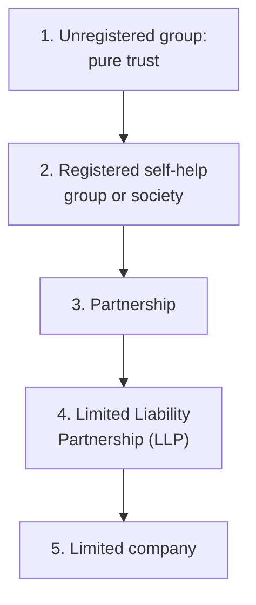

Successive FinAccess household surveys have found that roughly a third of Kenyan adults use some form of group finance: a merry-go-round at work, a table-banking circle at church, an investment club buying land. Chamas move more household money than the stock exchange touches, and they do it largely on trust, a WhatsApp group, and a treasurer's notebook.

That informality is the chama's genius and its weakness. It costs nothing to start and requires no lawyer, which is why chamas exist everywhere. It also means that when the pot grows past a few hundred thousand shillings, the structure that was charming at KES 5,000 a month becomes dangerous: no legal identity, no enforceable rules, one signature between the savings and a disappearing treasurer.

This guide covers the full arc: what kind of chama you are actually running, when and how to formalise it, how to bank it, and how to invest a growing pot without breaking the group.

> **Key Insight:** A chama does not fail because members are dishonest. It fails because the rules were never written down, so the first serious disagreement has nothing to appeal to. Structure is not bureaucracy; it is the thing that lets friends stay friends after money gets involved.

---

### The Three Species of Chama

Most group finance in Kenya is one of three animals, and the right structure, banking, and investments depend entirely on which one you are.

| | Merry-Go-Round (ROSCA) | Table Banking (ASCA) | Investment Chama |
|---|---|---|---|
| **Money flow** | Pooled monthly, paid out to one member in rotation | Pooled and lent back to members at interest | Pooled and invested outside the group |
| **Return** | Zero; you get out exactly what you put in | Interest earned on member loans | Whatever the assets earn |
| **Horizon** | One rotation cycle | Rolling, with periodic share-outs | Years |
| **Main risk** | Early recipients defaulting on later contributions | Loan defaults, weak recovery | Bad assets, fraud, disputes over exit |
| **Structure needed** | Written rules and a schedule | Written rules, a loan book, penalties | Legal registration, a bank mandate, a constitution |
| **Best for** | Cash-flow smoothing, discipline | Affordable credit within a trusted circle | Wealth building: land, bonds, businesses |

The commonest chama mistake is species confusion: a merry-go-round that starts "investing" leftovers without changing its rules, or an investment club that lends to members like a table bank with no loan policy. Decide what the group is, write it down, and run it as that.

---

### The Legal Ladder: From Handshake to Structure

A chama can hold any of five legal forms. Each step up the ladder costs more effort and buys more protection.

| Structure | Legal Identity | Can Hold Land Title? | Member Liability | Fits When |
|---|---|---|---|---|
| Unregistered group | None; the members personally | No; title sits in individuals' names | Unlimited, informal | Merry-go-rounds, small table banks |
| Self-help group / society | Registration certificate | Awkward; usually via trustees | Unclear in disputes | Social groups, early-stage chamas |
| Partnership | Yes, but partners are the business | Yes, in partners' names jointly | **Unlimited and joint**: one member's mess binds all | Rarely the right answer for chamas |
| **LLP** | Separate legal person | **Yes, in the LLP's name** | Limited to each member's contribution | Investment chamas holding serious assets |
| Limited company | Separate legal person | Yes | Limited to shares | Chamas running an actual business |

For an investment chama that intends to hold land, bonds, or a portfolio, the destination is usually the **Limited Liability Partnership** under the [Limited Liability Partnerships Act, 2011](https://new.kenyalaw.org/akn/ke/act/2011/42), registered through the [Business Registration Service](https://brs.go.ke) on eCitizen. The LLP gives the group what the notebook never can: a separate legal person that owns the assets, survives members leaving, limits each member's liability to what they put in, and can sign, sue, borrow, and be audited.

The practical trigger points for climbing the ladder:

- **Register as a self-help group** the moment the pot exceeds what any member could comfortably absorb losing.
- **Form an LLP** before the group's first land purchase, first bond investment in the group's name, or first pot above roughly KES 1 million. Registering after the asset is bought means the title is already in the wrong name.
- **Skip the ordinary partnership.** Joint and unlimited liability means one member's personal debt problem can reach the group's assets. The LLP costs little more and removes that risk.

---

### The Constitution: Rules That Survive a Quarrel

Whatever the legal form, the chama needs a written constitution that answers the ugly questions while everyone still likes each other. The minimum set:

- **Purpose and species.** What the group is (rotation, table bank, investment club) and what it may not do without a special vote.
- **Contributions.** Amount, due date, grace period, and the penalty for lateness, applied automatically, not debated monthly.
- **Officials and terms.** Chairperson, treasurer, secretary; how long they serve; how they are removed. Rotate the treasurer role or subject it to annual election.
- **Meetings and quorum.** How often, how decisions pass, what needs a simple majority versus a super-majority (admitting members, buying assets, changing contributions).
- **The exit clause.** How a member leaves, how their share is valued, and how long the group has to pay them out. This is the clause that saves chamas; without it, every exit is a negotiation and every death is a crisis.
- **Dispute resolution.** Internal first, then named mediation, then the courts as a last resort.
- **Records.** Who keeps the books, who may inspect them, and when accounts are presented (at minimum, quarterly).

A one-page schedule of members, contributions, and shares should be appended and updated every time either changes. When a chama reaches an LLP, this constitution becomes the partnership deed an advocate formalises.

---

### Banking the Chama

The treasurer's personal M-Pesa is not a treasury. Group money should sit in an account that belongs to the group, with controls no single person can bypass.

**The account.** Most Kenyan banks and SACCOs offer dedicated chama or group accounts with no or low ledger fees, and several waive minimum balances for registered groups. A registered group (certificate plus constitution plus minutes appointing signatories) gets an account in the group's name; an LLP gets a full business account. How to choose the institution and negotiate the tariff is covered in Bengula's [Ultimate Guide to Banking in Kenya](/blog/ultimate-guide-to-banking-in-kenya).

**The mandate.** Two-to-sign, minimum, drawn from three named signatories, none of whom are related to each other. The mandate should require board minutes for withdrawals above a stated threshold. This single control eliminates the most common chama loss: not theft by a stranger, but a lone signatory under personal pressure.

**The rails.** Mobile money group wallets and paybills make collections effortless and, more importantly, create a transaction record per member. Every contribution should land as an identifiable line, not as cash handed over at a meeting. Twelve clean months of such records is also the beginning of the group's credit file; the same evidence discipline described in [What Is Accounts Receivable](/blog/what-is-accounts-receivable) applies to a chama's books.

**The separation.** The operating float (next payout, small expenses) stays in the current account. Everything else moves to where it earns. Idle group money in a current account is the group version of the problem described in [Sleeping Asset Optimization](/blog/sleeping-asset-optimization).

---

### Investing the Pot: A Ladder for Group Money

Group money should climb the same ladder disciplined individual money climbs, matched to horizon and pot size.

| Pot and Horizon | Instrument | Why It Fits | Bengula Deep Dive |
|---|---|---|---|
| Any size, under 1 year | Money market fund | Daily liquidity, pooled yields, low minimums | [The Future of MMFs in Kenya](/blog/future-mmfs-kenya) |
| KES 100K+, 3-12 months | Treasury bills via CDS | Sovereign risk, laddered maturities | [Sovereign Debt Explained](/blog/sovereign-debt-explained) |
| KES 100K+, multi-year | Treasury and infrastructure bonds | Fixed coupons, tax-free infrastructure issues | [Kenyan Treasury Bonds Guide](/blog/kb-bond-guide-2026) |
| KES 1M+, 5+ years | Land through a registered structure | Long-horizon appreciation | [Kikuyu Ridge Land-Banking Syndicate](/blog/kikuyu-ridge-syndicate) |
| Steady pot, income focus | A blended income engine | Monthly distributions across instruments | [Monthly Income Engine](/blog/monthly-income-engine-kenya) |

Two rules make the ladder work for a group:

**Match the instrument to the exit clause.** A chama whose constitution promises members a 60-day payout cannot hold 80% of the pot in land. The portfolio's liquidity must be able to honour the exit clause in the worst month, or the exit clause must be rewritten to match the portfolio.

**Understand what the merry-go-round costs.** Rotation is a discipline tool, not an investment. Twelve members contributing KES 5,000 each month rotate KES 720,000 in a year, and the group ends the year with exactly KES 720,000 of value. The same contributions swept monthly into a money market fund at an illustrative 9% net yield end the year at roughly KES 750,000:

$$ \text{FV} = P \times \frac{(1+i)^n - 1}{i} = 60{,}000 \times \frac{(1.0075)^{12} - 1}{0.0075} \approx \text{KES } 750{,}000 $$

The KES 30,000 difference is the price of pure rotation, and it compounds every year the group exists. Many mature chamas run both: a rotation for discipline and cash-flow needs, and an invested pot for wealth. Current yields change with CBK rate decisions; check prevailing MMF and T-bill rates (the live figures on this site's rates ticker are a starting point) before modelling.

---

### When the Chama Buys Land

Land is where chamas make their largest gains and suffer their worst disasters. The full due-diligence and syndication mechanics are covered in the [Kikuyu Ridge Land-Banking Syndicate](/blog/kikuyu-ridge-syndicate) case study; the group-specific rules are three:

1. **The buyer is the structure, not a member.** Title in the chairman's name "for convenience" is how chamas lose everything. Register the LLP first; the LLP buys the land.
2. **Search, survey, and advocate before deposit.** An official land search, a licensed surveyor's confirmation of beacons, and an advocate's review of the sale agreement are group expenses, approved in minutes, paid from the group account.
3. **Agree the exit horizon in writing before purchase.** Land pays nothing until sold. A member who needs their share out in year two of a ten-year land play is a governance crisis unless the constitution already answers it.

---

### Risk Factors

- **The lone-signatory loss.** Most chama theft is a single trusted official with sole access. The two-to-sign mandate is non-negotiable, however small the group.
- **Contribution decay.** Groups die slowly, one missed month at a time. Automatic penalties, applied without debate, keep the social pressure honest.
- **Species drift.** A table bank that starts holding land, a merry-go-round that starts lending: each drift adds risks the rules were never built for. Change the constitution before changing the activity.
- **Liquidity mismatch.** Long assets against short exit promises. The exit clause and the portfolio must agree.
- **Governance capture.** A founder who cannot be outvoted, minutes that are never kept, accounts presented "when ready". If the books cannot be inspected, assume the worst.
- **Unregistered asset purchases.** Any asset bought before the structure exists sits in someone's personal name, exposed to their debts, their divorce, and their heirs.

---

### Decision Framework: Five Questions Before the First Contribution

1. **What species are we?** Rotation, table bank, or investment club. One answer, written down.
2. **What is the exit?** How a member leaves, how their share is valued, how fast they are paid.
3. **Who signs?** Three names, two signatures, no relatives, rotated by election.
4. **Where does idle money sit?** Named institution, named instrument, and a threshold above which cash must be moved out of the current account.
5. **At what point do we register, and as what?** Set the trigger (pot size or first asset) now, so formalisation is automatic rather than a debate.

A group that can answer all five in one meeting is ready to collect money. A group that cannot should not be collecting yet.

---

### Bengula View

The chama is the most underrated wealth institution in Kenya, and the most under-structured. Our desk's view: run the discipline of an informal group with the paperwork of a formal one. Register early, bank with a two-to-sign mandate from day one, sweep everything above the operating float into earning instruments, and put the exit clause in writing before the first shilling moves. The groups that compound for decades are not the ones with the most trusting members; they are the ones whose rules made trust cheap. Structure the chama as if the friendship will one day be tested, and it probably never will be.

---

### Sources and Further Reading

- [Limited Liability Partnerships Act, 2011, Kenya Law](https://new.kenyalaw.org/akn/ke/act/2011/42)
- [Business Registration Service, eCitizen](https://brs.go.ke)
- [FSD Kenya: FinAccess Household Survey research](https://www.fsdkenya.org)
- Bengula Inc: [The Ultimate Guide to Investing in Kenya](/blog/ultimate-guide-to-investing-in-kenya), [How to Structure Friends and Family Investments](/blog/how-to-structure-friends-and-family-investments), [Safe for Savers, Risky for Guarantors: SACCOs](/blog/sacco-savers-guarantors), [Kikuyu Ridge Land-Banking Syndicate](/blog/kikuyu-ridge-syndicate), [The Future of MMFs in Kenya](/blog/future-mmfs-kenya), [Kenyan Treasury Bonds Guide](/blog/kb-bond-guide-2026), [Monthly Income Engine](/blog/monthly-income-engine-kenya), [Ultimate Guide to Banking in Kenya](/blog/ultimate-guide-to-banking-in-kenya)

*General financial education, not legal, tax, or investment advice. Group structures, land transactions, and partnership deeds have legal consequences; involve a qualified advocate before registering a structure or signing on behalf of a group.*
