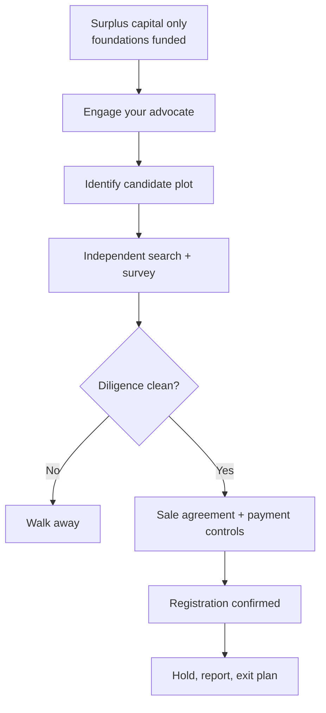

Diaspora capital already has a clean sovereign path: open [DhowCSD](/blog/cbk-diaspora-bond-access), buy bills and bonds, and hold instruments the market understands. Land is different. It is culturally magnetic, emotionally marketed, and operationally hostile to buyers who cannot walk the beacon line on a Tuesday morning.

This guide is for Kenyans abroad who want land without becoming a case study. It reuses the diligence culture of [Kikuyu Ridge](/blog/kikuyu-ridge-syndicate) and the group rules of [chama land-banking](/blog/chama-llp-land-banking-kenya). It is **not legal advice** and not a promise that any corridor will appreciate.

> **Key Insight:** From abroad, you are not primarily buying soil. You are buying **a chain of trust**: advocate, surveyor, payment path, and title process. If any link is a cousin's friend who "knows the chief," you are underwriting fraud with love.

```cards
- icon: Globe
  title: Separate jobs of money
  desc: Emergency and near-term funds stay in liquid instruments; only true long surplus touches land.
  linkText: Diaspora bonds
  linkUrl: /blog/cbk-diaspora-bond-access
- icon: Search
  title: Independent diligence
  desc: Your advocate and surveyor work for you, not for the seller's urgency.
  linkText: Evaluate investments
  linkUrl: /blog/evaluate-investment-opportunity-kenya
  type: amber
- icon: Users
  title: Prefer structured groups
  desc: Clean SPV chamas beat informal family collections for multi-buyer plots.
  linkText: Chama LLP guide
  linkUrl: /blog/chama-llp-land-banking-kenya
  type: emerald
```

---

### Why Diaspora Land Fraud Works

Attackers exploit four gaps:

1. **Asymmetry of presence** - you cannot casually re-check the plot.
2. **Urgency theatre** - "another buyer flies in Friday."
3. **Family and community pressure** - saying no feels like betraying home.
4. **Payment rails** - mobile money and personal accounts that leave weak legal trails.

The product pitched is appreciation. The product sold is often **hope plus a PDF**.

---

### Decide the Job Before the Plot

Apply the [eight-test filter](/blog/evaluate-investment-opportunity-kenya):

| Question | Diaspora-specific note |
|---|---|
| Horizon | If you may need the money for fees, visas, or relocation within 3 years, land is usually wrong |
| Liquidity | Exit from abroad is slower and more agency-dependent |
| Risk | Fraud and process risk dominate market risk early |
| Opportunity cost | DhowCSD and MMFs exist; "land or nothing" is a false frame |
| Exit | Who will sell it for you, and on what mandate? |

Idle land still has holding costs and zero coupon; see [sleeping asset optimisation](/blog/sleeping-asset-optimization).

---

### The Remote Buyer Control Stack

#### 1. Hire professionals who answer to you

- **Advocate** experienced in conveyancing, engaged on a written fee note.
- **Surveyor** to confirm beacons and acreage on the ground.
- Optional: valuer if price discovery is unclear.

Do not use the seller's "in-house lawyer" as your only counsel.

#### 2. Title and registry work before deposit

Minimum:

- Independent official search
- Confirmation of seller authority (especially estates, companies, attorneys)
- Encumbrance check
- Rates/rent status
- Physical visit report with dated photos and GPS if possible

#### 3. Payment path

| Do | Don't |
|---|---|
| Pay to advocate clients' account or documented escrow-style arrangement your lawyer designs | Pay a broker's personal Till "to secure" |
| Keep full SWIFT/bank trail to named payees | Split cash via friends "to avoid fees" without records |
| Match payments to written sale agreements | Send money on WhatsApp voice-note instructions alone |

#### 4. Power of attorney discipline

If you must use a POA:

- Narrow scope and time limit
- Prefer your advocate or a tightly trusted attorney-in-fact
- Require dual control for funds above a threshold
- Revocation mechanics understood before issuance

Wide, permanent POAs to opportunistic relatives are how quiet transfers happen.

#### 5. After purchase

- Confirm registration in the correct name (you or your SPV)
- Secure beacons and, where sensible, basic fencing/security
- Diary rates payments
- Store digital and physical document sets in two locations

---

### Family and Syndicate Structures

**Solo purchase** can work with strong counsel. **Family collections** without a vehicle are fragile: one member contributes late, another wants out, a third "managed the workers" and wants a larger share.

Prefer:

- Written contributions and shares
- A single legal vehicle where ticket size justifies it ([chama LLP guide](/blog/chama-llp-land-banking-kenya))
- Bank account in the vehicle's name
- Pre-agreed exit and dispute rules

The governance tone in [Kikuyu Ridge](/blog/kikuyu-ridge-syndicate) is the model: structure first, emotion second.

---

### Red Flags (Automatic Pause)

- Seller refuses independent search time
- Pressure to pay before you speak to your own advocate
- Title documents only as photos, never process
- Price "far below market" without a boring explanation
- Same parcel marketed to multiple diaspora WhatsApp groups
- Unlicensed "investment managers" guaranteeing resale multiples
- Relatives who block you from hiring outside professionals

Pause is not rudeness. Pause is how capital survives.

---

### A Sensible Sequencing for Overseas Buyers



1. Fund emergency and near-term needs in liquid instruments first.
2. Size land as a long-horizon sleeve only.
3. Professionals first, brochure second.
4. Diligence gate is binary: clean or walk.
5. Registration confirmed before you celebrate on social media.
6. Annual remote review: rates, photos, any offers, any disputes.

---

### When Bonds Beat Land (For This Pot)

Choose sovereign or liquid financial assets instead when:

- Horizon is short or uncertain
- You lack a trusted on-ground control stack
- You need income, not a story ([monthly income engine](/blog/monthly-income-engine-kenya))
- Family conflict risk is high
- You already hold enough illiquid Kenya property risk

Diaspora bond access is documented in [CBK diaspora bond access](/blog/cbk-diaspora-bond-access). Portfolio design sits in [investing in Kenya](/blog/ultimate-guide-to-investing-in-kenya).

---

### Risk Factors

- **Process and fraud risk** can total-loss capital even when the "corridor thesis" is fine.
- **Market risk** still exists after clean purchase; land can go sideways for years.
- **Currency** of your wages vs KES land price creates a second volatility layer.
- **Succession and marital property issues** need proper estate planning, not assumptions.
- **Laws, registry practice, and portal processes change;** confirm currently with your advocate.
- **This article is education**, not a conveyancing service or investment recommendation.

---

### Decision Framework: Diaspora Go / No-Go

Proceed only if all are true:

1. Capital is long-horizon surplus after liquid foundations.
2. Independent advocate and surveyor engaged by you.
3. Official search and physical verification completed.
4. Payment path is documented and professional.
5. Title will register into a name/vehicle you control.
6. Holding-cost budget exists (rates, security, travel, fees).
7. Exit idea is written, even if approximate.
8. No urgency theatre overrode a checklist item.

If any item fails, keep the money in instruments you can audit from abroad, and revisit land when controls exist.

---

### Bengula View

The desk supports diaspora investment in Kenya and refuses to romanticise land as a loyalty test. Bonds and bills are how many overseas Kenyans should **start**. Land is an advanced, illiquid, process-heavy allocation that demands professional controls.

We would rather you buy a boring IFB ladder this year and a cleanly diligenced plot next year than wire a deposit tonight to a persuasive brochure. Home is not a substitute for title search. Love is not a substitute for dual control on payments.

For group purchases, read [chama land-banking](/blog/chama-llp-land-banking-kenya). For liquid sovereign access, read [diaspora DhowCSD](/blog/cbk-diaspora-bond-access). For help framing the portfolio split, use [services](/services) or [book a session](/contact), and retain a Kenyan advocate for the transaction itself.

---

### Sources and Further Reading

- Bengula Inc: [CBK Diaspora Bond Access](/blog/cbk-diaspora-bond-access), [Kikuyu Ridge Syndicate](/blog/kikuyu-ridge-syndicate), [Chama LLP Land-Banking](/blog/chama-llp-land-banking-kenya), [Evaluate Any Investment Opportunity](/blog/evaluate-investment-opportunity-kenya), [Ultimate Guide to Investing in Kenya](/blog/ultimate-guide-to-investing-in-kenya), [Sleeping Asset Optimization](/blog/sleeping-asset-optimization).
- Market context: [Hass Consult land index](https://www.hassconsult.com/hassindex).

*General education for diaspora readers, not legal, tax, or investment advice. Land law and registry practice are professional domains; verify every step with qualified Kenyan counsel before sending funds.*
