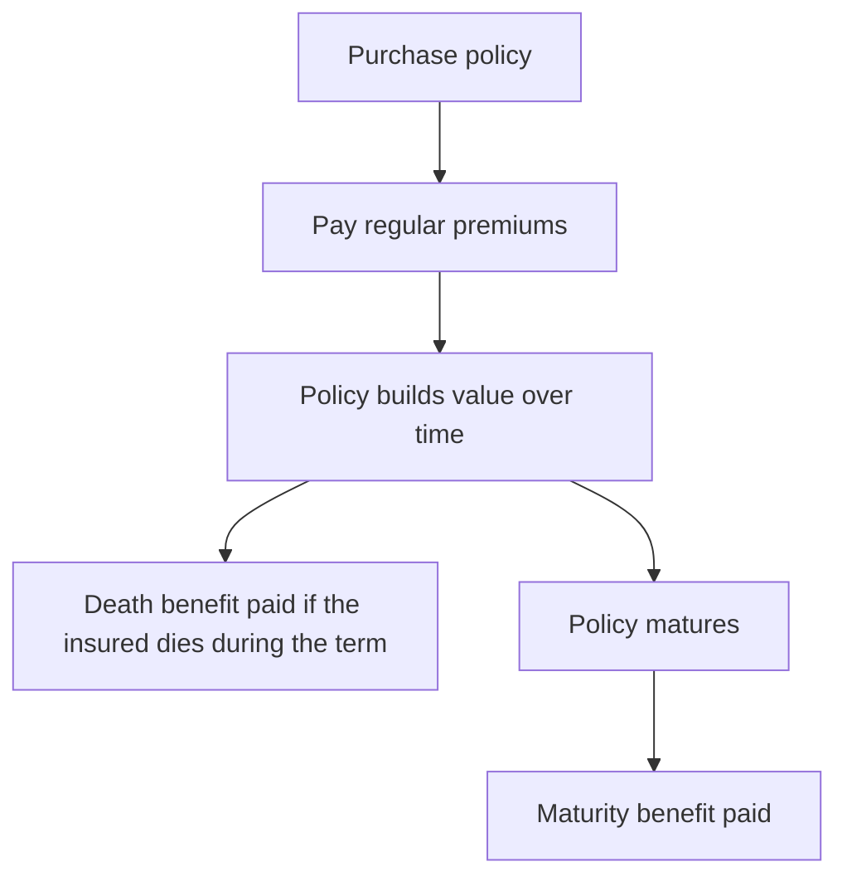
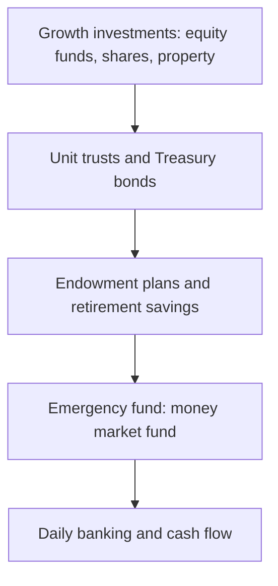

> **Can one financial product help you save for your child's education, protect your family if something happens to you, and provide a lump sum for future goals?**
> 
> An endowment plan aims to do exactly that.

Long-term financial planning has become increasingly important for Kenyan households. The cost of university education continues to rise, home ownership remains expensive, retirement planning is often delayed, and many families still depend on a single income earner.

At the same time, Kenyans have more financial products to choose from than ever before. Money Market Funds (MMFs), Treasury Bills, Treasury Bonds, SACCO deposits, unit trusts, pension schemes, and insurance products all compete for the same savings.

Among these options, **endowment plans occupy a unique position**. Unlike a pure investment or a standard life insurance policy, an endowment plan combines disciplined savings with life insurance protection. This combination makes it one of the most widely used financial planning tools for education savings and other long-term goals.

However, endowment plans are also one of the **least understood** financial products in Kenya.

Many buyers sign policy documents believing they are simply opening a savings account. Others expect investment returns comparable to stocks or MMFs. Some surrender their policies after only a few years and are surprised to receive far less than they contributed.

Understanding how these policies work before signing a contract can save you from costly mistakes.

This guide explains everything you need to know, including:

- What an endowment plan is
- How endowment plans work in Kenya
- Their advantages and disadvantages
- Tax benefits available to Kenyan taxpayers
- How bonuses and maturity values are calculated
- Common mistakes policyholders make
- How endowment plans compare with MMFs, Treasury Bills and SACCO savings
- A practical case study using **APA Akiba Halisi**
- Questions you should ask before purchasing any policy

Whether you are planning for your child's education, saving for retirement, or simply looking for a disciplined way to build wealth while protecting your family, this guide will help you decide whether an endowment plan fits your financial goals.

---

> **Key Takeaway**
> 
> An endowment plan should not be viewed as a high-return investment. Its greatest strength lies in combining **disciplined long-term savings with financial protection**, helping families achieve major life goals while reducing the financial impact of unexpected events.

---

### Table of Contents

1. What Is an Endowment Plan?
2. Why Endowment Plans Are Popular in Kenya
3. How Endowment Plans Work
4. Understanding Premiums, Bonuses and Maturity Value
5. **APA Akiba Halisi Case Study**
6. Tax Relief on Endowment Plans
7. Policy Loans and Surrender Values
8. Endowment Plans vs MMFs
9. Endowment Plans vs Treasury Bills
10. Endowment Plans vs SACCO Deposits
11. Advantages
12. Disadvantages
13. Who Should Buy One?
14. Questions to Ask Before Buying
15. Frequently Asked Questions
16. Final Verdict

---

### What Is an Endowment Plan?

An **endowment plan** is a long-term financial product that combines **life insurance** with a structured savings plan.

Instead of keeping your savings in an ordinary bank account, you agree to contribute regular premiums to an insurance company over a specified number of years.

If everything goes according to plan, the insurer pays you a **lump sum at maturity**.

If you pass away before the policy matures, the insurer pays the agreed benefit to your nominated beneficiaries, subject to the policy terms and conditions.

In simple terms, an endowment plan answers two important financial questions at the same time:

1. **How can I save consistently for a future goal?**
2. **What happens to my family if I die before reaching that goal?**

Unlike a savings account, an endowment plan includes life insurance protection.

Unlike term life insurance, it also builds value over time and can provide a payout if you outlive the policy term.

---

#### A Simple Example

Imagine Mary is 33 years old and wants to ensure she has money available when her son begins university in 15 years.

Instead of relying on willpower alone, she purchases a 15-year endowment policy.

She pays a fixed monthly premium.

If she survives the full term, she receives the maturity benefit, which may include the guaranteed sum assured together with any declared bonuses, depending on the policy.

If she dies during the policy term, her beneficiaries receive the death benefit in accordance with the policy provisions.

Either way, the financial goal remains protected.

---

#### The Two Components of an Endowment Plan

Many first-time buyers assume every shilling they pay goes directly into savings.

That is not how endowment plans work.

Your premium is generally used to fund several components.

|Component|Purpose|
|---|---|
|Life insurance cover|Protects your beneficiaries if you die during the policy term|
|Savings component|Builds value toward the maturity benefit|
|Investment component|Supports returns where the policy participates in insurer profits|
|Administration costs|Covers policy management and servicing|
|Distribution costs|May include commissions and acquisition expenses|

Because part of every premium pays for insurance protection and policy administration, **an endowment plan is not directly comparable to a bank savings account or an MMF**.

This also explains why surrendering a policy early often results in receiving less than the total premiums paid.

---

> **Bengula Insight**
> 
> One of the biggest misconceptions in Kenya is that an endowment policy is simply "a savings account with an insurance company." In reality, it is a bundled financial product that combines protection, long-term saving, and investment features. Understanding this distinction helps set realistic expectations about returns and early withdrawal penalties.

---

#### Common Financial Goals Supported by Endowment Plans

Although education funding is the most common reason Kenyans purchase endowment plans, these policies can support many other long-term objectives.

Examples include:

- Paying university tuition
- Building a house
- Purchasing land
- Starting a business
- Retirement planning
- Wedding expenses
- Creating an inheritance
- Capital for farm expansion
- Saving for children's future needs

The common factor is **time**.

Endowment plans are designed for goals that are several years away, not short-term savings.

---

#### How Long Do Endowment Plans Last?

Policy terms vary by insurer and product.

Typical durations include:

|Policy Term|Common Use|
|---|---|
|5 years|Short-term financial goals|
|10 years|Education planning|
|15 years|Secondary or university education|
|20 years|Retirement planning|
|25 years|Long-term wealth accumulation|

Generally, longer policy terms allow more time for bonuses to accumulate where applicable, though they also require a longer commitment from the policyholder.

---

#### Who Offers Endowment Plans in Kenya?

Several licensed life insurers offer endowment products designed for different financial goals. Features, bonus structures, eligibility requirements, and optional riders vary by provider.

Examples include insurers that offer education-focused or general endowment products, such as APA Life Assurance, Britam, CIC Life, ICEA LION Life Assurance, Jubilee Life Insurance, Sanlam Life Insurance Kenya, and others licensed by Kenya's insurance regulator.

When comparing providers, focus on factors such as:

- Financial strength
- Claims-paying history
- Product flexibility
- Policy charges
- Customer service
- Transparency of policy illustrations
- Availability of optional benefits
- Bonus declaration history (for participating policies)

Choosing an insurer should involve more than comparing projected maturity values alone.

---

### Why Endowment Plans Remain Popular in Kenya

Endowment plans have existed in Kenya for decades, yet they continue to attract thousands of new policyholders every year. While newer investment products such as Money Market Funds (MMFs), exchange-traded funds (ETFs), and digital investment platforms have gained popularity, endowment plans remain a cornerstone of long-term financial planning.

Why?

The answer lies in understanding **how Kenyan households save**.

Unlike investors whose primary objective is maximizing returns, many families simply want certainty. They want confidence that school fees will be available when needed, that their mortgage deposit will be ready on time, or that their family will not face financial hardship if they pass away unexpectedly.

Endowment plans address these concerns by combining disciplined savings with life insurance protection.

---

> **Bengula Insight**
>
> Investing is about growing wealth. Insurance is about managing risk. An endowment plan sits somewhere in the middle, offering moderate wealth accumulation while protecting against life's uncertainties.

---

#### 1. They Encourage Disciplined Saving

One of the greatest challenges facing Kenyan savers is not a lack of income but a lack of consistency.

Unexpected expenses, family obligations, social events, and the convenience of mobile money often make it difficult to stick to long-term savings goals.

An endowment plan helps solve this problem by creating a contractual commitment to save.

Once you choose your premium amount and payment schedule, you are expected to continue making contributions throughout the policy term.

Unlike an ordinary savings account, where withdrawing money is as simple as tapping a phone, accessing funds from an endowment plan before maturity can involve penalties. While this may appear restrictive, many policyholders view it as an advantage because it reduces the temptation to dip into long-term savings for short-term wants.

For individuals who admit they struggle with financial discipline, this "forced saving" mechanism can be one of the product's biggest strengths.

---

#### 2. They Protect Long-Term Goals

Imagine saving for your daughter's university education over the next 15 years.

Halfway through your savings journey, you unexpectedly pass away.

If you had been saving in a regular bank account, your family would only receive whatever amount you had managed to accumulate.

An endowment plan works differently.

Subject to the policy terms, the insurer pays the agreed death benefit to your beneficiaries, ensuring that the financial goal remains funded even if you are no longer there to continue making premium payments.

For families with young children, this protection can provide significant peace of mind.

---

##### Illustration

| Saving Method | If the Saver Dies After 7 Years |
|---------------|---------------------------------|
| Savings Account | Family receives account balance only |
| MMF | Family receives accumulated investment value |
| Endowment Plan | Beneficiaries receive the insured benefit according to policy terms |

This is one of the biggest differences between endowment plans and traditional investments.

---

#### 3. Education Planning Drives Demand

Education remains one of the largest financial commitments for many Kenyan families.

From primary school through university, tuition fees, accommodation, books, transport, and other expenses can amount to millions of shillings over a child's academic journey.

As a result, many parents begin planning years in advance.

Education-focused endowment plans are particularly popular because they align the maturity date with important academic milestones, such as:

- Transition to secondary school
- Entry into university
- Graduation
- Overseas education

Some products also provide staged payouts at different education levels, helping parents spread costs over several years.

---

> **Did You Know?**
>
> Many "education policies" sold in Kenya are simply specialized endowment plans designed with payout dates that match a child's expected educational journey.

---

#### 4. They Combine Saving and Insurance in One Product

Without an endowment plan, a family might need to purchase:

- A life insurance policy
- A separate investment account
- A dedicated education savings account

Managing multiple products can be time-consuming and confusing.

An endowment plan simplifies financial planning by combining these objectives into a single policy.

For busy professionals, entrepreneurs, and salaried employees, this convenience is often a significant selling point.

---

#### 5. Potential Tax Relief

One of the lesser-known advantages of qualifying life insurance policies in Kenya is the availability of **life insurance relief**, subject to the Income Tax Act and applicable conditions.

Where eligible, policyholders may claim relief on qualifying premiums, reducing their income tax liability.

However, eligibility depends on several factors, including:

- The type of policy
- Policy duration
- Compliance with current tax legislation
- Individual taxpayer circumstances

Because tax laws can change, policyholders should confirm current rules with the Kenya Revenue Authority (KRA) or a qualified tax adviser before relying on tax benefits.

We'll examine this in greater detail later in this guide.

---

#### 6. Access to Policy Loans

Life is unpredictable.

Medical emergencies, business opportunities, school fees, or urgent repairs may require access to cash before your policy reaches maturity.

Many participating endowment plans allow policyholders to borrow against the policy's accumulated value after certain conditions have been met.

Although this varies by insurer, policy loans often offer advantages over unsecured borrowing because:

- Interest rates may be lower than digital loans.
- No additional collateral may be required.
- The policy remains in force if loan conditions are met.

However, unpaid loans generally reduce the eventual maturity or death benefit.

---

#### 7. They Appeal to Conservative Investors

Not everyone is comfortable investing in shares or volatile markets.

Many Kenyans prefer financial products that emphasize stability and predictability over potentially higher, but uncertain, returns.

Endowment plans appeal to these savers because they typically offer:

- Defined policy terms
- Life insurance protection
- Structured saving
- Potential bonuses (where applicable)
- Reduced exposure to market volatility compared with direct equity investing

This conservative approach can be especially attractive to first-time investors or those nearing retirement.

---

#### 8. They Support Major Life Milestones

An endowment plan is rarely purchased simply to "make money."

Instead, it is usually tied to a meaningful life event.

Common objectives include:

| Goal | Typical Policy Term |
|--------|--------------------|
| Child's secondary education | 8–12 years |
| University education | 12–18 years |
| Buying land | 5–15 years |
| Building a home | 10–20 years |
| Business startup capital | 5–15 years |
| Retirement supplement | 15–25 years |

Having a clearly defined objective often makes it easier for policyholders to remain committed throughout the policy term.

---

#### 9. Predictability Matters

Investment returns fluctuate.

Interest rates change.

Property prices rise and fall.

Stock markets can be volatile.

While participating endowment policies may include non-guaranteed bonuses, they also provide a contractual framework that many families find reassuring.

This predictability is especially valuable for financial goals with fixed deadlines, such as university admissions or planned retirement dates.

---

#### Why Some Kenyans Are Choosing Other Products Instead

Although endowment plans remain popular, they are no longer the only option available.

Many financially informed savers now compare them against alternatives such as:

| Product | Why People Choose It |
|----------|----------------------|
| Money Market Funds | Daily liquidity and competitive yields |
| Treasury Bills | Government-backed short-term investments |
| Treasury Bonds | Long-term fixed-income returns |
| Unit Trusts | Diversified investment portfolios |
| SACCO Deposits | Dividend potential and loan eligibility |
| Pension Schemes | Retirement-focused tax advantages |

Each product serves a different purpose.

The best choice depends on your financial goals, investment horizon, liquidity needs, and tolerance for risk.

Later in this guide, we'll compare these products in detail to help you determine where an endowment plan fits within a broader financial strategy.

---

> **Bengula Perspective**
>
> One of the most common mistakes is treating every financial product as though it should outperform every other product.
>
> An MMF is designed for liquidity.
>
> A Treasury Bill is designed for short-term capital preservation.
>
> A pension is designed for retirement.
>
> An endowment plan is designed to help you achieve a long-term financial goal while protecting your loved ones if life takes an unexpected turn.
>
> The right question isn't "Which product has the highest returns?" but rather "Which product best matches my financial objective?"

---

#### Key Takeaways

- Endowment plans remain popular because they combine disciplined saving with life insurance protection.
- They are particularly well suited for long-term goals such as education, home ownership, and retirement.
- The inability to withdraw funds easily can actually help many people stay committed to their savings goals.
- Policy loans provide flexibility without necessarily ending the policy.
- Conservative investors often value the predictability of endowment plans over potentially higher but more volatile investment returns.
- Endowment plans should be evaluated based on their ability to achieve specific financial goals rather than solely on investment returns.

---

### How Endowment Plans Work in Kenya

Understanding **how an endowment plan works** is perhaps the most important step before purchasing one.

Many policyholders focus only on two numbers:

- The monthly premium
- The projected maturity value

While these figures are important, they tell only part of the story.

An endowment plan is a long-term legal contract between you and an insurance company. Behind every premium payment is a carefully designed financial structure that balances savings, life insurance, investment management, administrative costs, and risk protection.

This section walks through the entire lifecycle of an endowment policy, from your first premium to the final maturity payout.

---

> **Bengula Insight**
>
> Think of an endowment plan as a financial journey rather than a savings account. Every premium you pay serves multiple purposes, and understanding those purposes will help you set realistic expectations about returns, surrender values, and long-term benefits.

---

### The Lifecycle of an Endowment Plan

A typical endowment policy follows five major stages:

---

### Step 1: Choosing Your Policy

Before your policy begins, the insurer will ask several questions to determine the level of cover and premium.

Typical information includes:

- Your age
- Occupation
- Annual income
- Health status
- Smoking status (where applicable)
- Financial goal
- Desired policy term
- Desired sum assured

The insurer uses this information to calculate:

- Your premium
- Your life insurance cover
- Policy conditions
- Eligibility for optional benefits

In many cases, applicants may also complete a medical questionnaire or undergo a medical examination, depending on the amount of insurance requested.

---

### Step 2: Paying Your Premiums

Once your policy begins, you agree to pay premiums according to your chosen schedule.

Most Kenyan insurers offer:

| Payment Frequency | Common Choice |
|-------------------|---------------|
| Monthly | Most popular |
| Quarterly | Common |
| Semi-Annual | Less common |
| Annual | Often attracts discounts |
| Single premium | One payment at inception, offered on selected products |

Premiums can usually be paid through:

- Standing orders
- Direct debit
- Employer payroll deductions
- Bank transfers
- Mobile money (where supported)
- Online customer portals

Missing premium payments may affect your policy, so it is important to understand the insurer's grace period and reinstatement rules.

##### The Single-Premium Option

Several Kenyan plans can be funded by **one lump-sum payment at inception** instead of a recurring schedule. APA's Wealth Builder is built around it (single premium from KES 250,000), and single-premium quotes are also issued for Akiba Halisi through selected distribution channels, including bancassurance desks; availability can depend on where you buy, so confirm with the insurer or your bank.

The single-premium route has one large advantage: **it removes missed-payment risk entirely**. There is no standing order to fail, no lapse to trigger, no grace period to track, and no policy quietly dying in year three because a job changed. The commitment is settled on day one, and the life cover and policy value run their course regardless of what happens to your monthly cash flow afterwards.

It often carries a second, less advertised advantage: **total cost**. Insurers load recurring premiums for collection risk and administration. On a real mid-2026 Akiba Halisi quote (anonymised in the case study later in this guide), the same six-year policy cost KES 1,000,000 as a single premium but roughly KES 1.47 million paid monthly, about 47% more in total outlay for the same benefits.

The trade-offs are equally clear:

- **It requires the capital upfront**, which excludes the salaried savers for whom endowments' forced-discipline feature exists in the first place.
- **The discipline benefit disappears.** A single premium builds no monthly saving habit; it is an allocation decision, not a savings mechanism.
- **The comparison changes.** A lump sum committed for years must be judged against the alternatives a lump sum can buy: a Treasury bond ladder, an MMF, or the options in [The Ultimate Guide to Investing in Kenya](/blog/ultimate-guide-to-investing-in-kenya). Run that comparison net of costs before signing.

The practical rule: choose single premium if you have the capital, since it eliminates lapse risk and usually costs less in total; choose a regular-premium plan if the monthly commitment itself is the behaviour you are buying. A middle path some insurers allow is the short premium-paying term, paying for five years on a policy that runs fifteen, which concentrates the payment risk into your highest-earning years.

---

### Where Does Your Premium Go?

One of the biggest misconceptions about endowment plans is that every shilling paid becomes savings.

In reality, your premium is divided into several components.

Although the exact allocation differs between insurers and products, it generally supports the following:

| Premium Component | Purpose |
|-------------------|---------|
| Life insurance cost | Pays for death benefit protection |
| Savings component | Builds your policy value |
| Investment fund | Generates returns for participating policies |
| Administration | Policy servicing and customer support |
| Distribution costs | Sales and acquisition expenses |
| Statutory obligations | Applicable taxes and regulatory charges |

This explains why surrendering a policy in its early years often results in receiving much less than the total premiums paid.

---

> **Important**
>
> Endowment plans are **not** equivalent to depositing money into a fixed savings account. They combine insurance, investment, and administration within a single product.

---

### Step 3: Your Policy Begins Building Value

As premiums continue to be paid, the policy gradually accumulates value.

This value generally grows from three sources:

1. Guaranteed policy benefits
2. Investment returns (where applicable)
3. Declared bonuses for participating policies

The growth is usually slow during the early years because a larger proportion of premiums goes toward policy setup costs and insurance protection.

As the policy matures, a greater proportion contributes toward the accumulated value.

---

#### Understanding Cash Value

Many endowment plans develop what is commonly called a **cash value** or **policy value**.

This is **not necessarily equal** to:

- Total premiums paid
- Maturity value
- Death benefit

Instead, it represents the value that has accumulated under the policy according to its terms.

The cash value becomes important because it may determine:

- Eligibility for policy loans
- Surrender value
- Paid-up value (where applicable)

---

### Step 4: Bonus Declarations

Some endowment plans are described as **participating** or **with-profits** policies.

These policies may receive bonuses based on the insurer's investment performance and actuarial decisions.

The three most common types are:

---

#### Reversionary Bonus

This is an annual bonus declared by the insurer.

Once added to the policy (subject to the policy terms), it generally cannot be removed.

Over many years, these bonuses can significantly increase the maturity benefit.

---

#### Terminal Bonus

Some insurers may declare an additional bonus when the policy matures.

Unlike reversionary bonuses, terminal bonuses are usually **not guaranteed** and depend on the insurer's financial performance and policy conditions.

---

#### Guaranteed Benefits

Every endowment policy contains certain guaranteed contractual benefits.

These are specified in the policy document and are payable provided the policy remains in force and all applicable conditions are met.

Guaranteed benefits should not be confused with projected maturity values, which often include assumptions about future bonuses that may or may not materialize.

---

> **Bengula Tip**
>
> When comparing two endowment plans, ask the insurer to separate:
>
> - Guaranteed maturity value
> - Projected bonuses
> - Non-guaranteed benefits
>
> This gives you a clearer picture of what is contractually promised versus what is projected.

---

### Step 5: Life Insurance Protection

While your savings are growing, your life insurance protection is already active.

If you pass away during the policy term, your beneficiaries may receive the applicable death benefit, subject to the policy's terms, conditions, and exclusions.

This allows your financial goal to continue even if you are no longer there to fund it.

For many families, this is the feature that distinguishes an endowment plan from ordinary investments.

---

### Step 6: Policy Maturity

If you survive until the end of the policy term, your insurer pays the maturity benefit.

Depending on the policy, this may include:

- Guaranteed sum assured
- Reversionary bonuses
- Terminal bonus (if applicable)
- Other contractual benefits

Many policyholders use this lump sum for:

- University fees
- House construction
- Land purchase
- Retirement income
- Business expansion
- Mortgage deposits

---

### What Happens If You Stop Paying?

Life circumstances can change.

Job loss, illness, or financial difficulties may make it difficult to continue paying premiums.

Possible outcomes depend on your policy and insurer.

These may include:

| Situation | Possible Outcome |
|-----------|------------------|
| Short delay | Grace period applies |
| Several missed premiums | Policy may lapse |
| Sufficient accumulated value | Policy may become paid-up |
| Early cancellation | Surrender value may be paid |

Each insurer has different rules, so always review the policy document before making decisions.

---

### Understanding Grace Periods

Most insurers provide a grace period after the premium due date.

During this period:

- The policy may remain active.
- You can make the missed payment without immediately losing cover.

If premiums remain unpaid beyond the grace period, additional consequences may apply according to the policy conditions.

---

### What Is a Paid-Up Policy?

Some endowment policies allow you to stop paying premiums after a minimum qualifying period.

Instead of cancelling the contract, the insurer may convert it into a **paid-up policy**.

A paid-up policy generally means:

- No further premiums are required.
- Insurance cover may reduce.
- Future maturity value may be lower.

This can be preferable to surrendering the policy altogether.

---

### Policy Loans

Many participating endowment policies allow borrowing against the accumulated policy value once certain conditions have been met.

Typical characteristics include:

- Loan amount depends on accumulated value.
- Interest is charged.
- Outstanding loans reduce maturity benefits if unpaid.
- Policy conditions continue to apply.

We'll examine policy loans in detail later in this guide.

---

### A Practical Example

Imagine David, aged 32, purchases a 20-year endowment plan.

His objective is to build capital for retirement while protecting his young family.

##### Year 1

- Policy begins.
- Premium payments start.
- Life insurance cover becomes active.

##### Year 5

- Policy has accumulated value.
- Eligible for policy loan (subject to insurer rules).

##### Year 12

- Bonuses declared over several years have increased projected maturity value.

##### Year 18

- Children are approaching university.
- Policy remains active.

##### Year 20

David survives.

The insurer pays:

- Guaranteed benefits
- Accumulated bonuses (where applicable)
- Final maturity amount

David now has a lump sum that can supplement retirement or fund other financial goals.

If David had died during Year 12 instead, his beneficiaries would generally have received the applicable death benefit under the policy terms, helping protect the family's financial plans.

---

### Common Misconceptions

| Myth | Reality |
|------|----------|
| Every premium becomes savings | Premiums also fund insurance and policy expenses. |
| Bonuses are guaranteed | Many bonuses depend on insurer performance and policy terms. |
| I can withdraw my money anytime | Early withdrawal may result in significant penalties. |
| Returns will always beat MMFs | Endowment plans prioritize protection and disciplined saving, not maximum investment returns. |
| The maturity value shown is guaranteed | Illustrations often include projected, non-guaranteed bonuses. |

---

> **Bengula Perspective**
>
> Buying an endowment plan without understanding how premiums are allocated is like buying a house without reading the floor plan. The headline numbers may look attractive, but the details determine whether the product truly matches your financial goals.

---

### Key Takeaways

- Endowment plans combine savings, investment features, and life insurance into one contract.
- Premiums are divided between insurance costs, savings, investments, and administration.
- Participating policies may earn bonuses, but not all projected benefits are guaranteed.
- Cash value, surrender value, and maturity value are different concepts.
- Policy loans can provide flexibility, but they reduce future payouts if not repaid.
- Understanding your policy document is just as important as understanding the premium amount.

---

### Understanding Premiums, Bonuses, Cash Values and Maturity Payouts

One of the biggest reasons people misunderstand endowment plans is that they focus on a **single number**:

> *"How much will I get at maturity?"*

While this is an important question, it is not the only one you should ask.

A maturity illustration often combines **guaranteed benefits** with **projected benefits** based on assumptions that may change over time. To make an informed decision, you need to understand how insurers calculate these values and what each figure actually represents.

In this section, we'll unpack the language commonly used in policy illustrations and explain what it means for your money.

---

> **Bengula Insight**
>
> A policy illustration is not a promise. It is a projection based on assumptions about premiums, investment performance, bonus declarations, and the policy remaining in force until maturity.

---

### The Five Numbers Every Policyholder Should Understand

Before buying an endowment plan, you should be able to distinguish between these five terms:

| Term | Meaning |
|------|---------|
| Premium | The amount you pay regularly to keep the policy active |
| Sum Assured | The guaranteed insurance amount specified in the contract |
| Cash Value | The accumulated value of your policy while it is active |
| Surrender Value | The amount payable if you terminate the policy early, subject to policy terms |
| Maturity Benefit | The amount paid when the policy reaches the end of its term |

Although these figures are related, they are **not interchangeable**.

---

### Premium: The Foundation of Your Policy

The **premium** is the amount you agree to pay at regular intervals.

It is influenced by several factors, including:

- Your age
- Policy term
- Sum assured
- Optional riders
- Health profile (where underwriting applies)
- Payment frequency

Generally:

- Younger applicants often pay lower premiums for the same level of cover.
- Longer policy terms spread costs over more years but require a longer commitment.
- Higher sums assured result in higher premiums.

---

##### Example

| Applicant | Policy Term | Sum Assured | Likely Premium Trend |
|------------|------------|-------------|----------------------|
| 28 years old | 20 years | KES 2 million | Lower |
| 45 years old | 20 years | KES 2 million | Higher |

The difference reflects the insurer's assessment of risk over the policy period.

---

### Understanding the Sum Assured

The **sum assured** is the contractual amount that forms the basis of the policy's guaranteed benefits.

For example:

- Sum assured: **KES 1,500,000**

This amount is not necessarily the final maturity payout.

If the policy participates in insurer profits, bonuses may increase the eventual amount received.

Think of the sum assured as the policy's **starting point**, not necessarily its final destination.

---

### Guaranteed vs Non-Guaranteed Benefits

This distinction is one of the most important concepts in life insurance.

#### Guaranteed Benefits

These are contractual obligations that the insurer agrees to pay, provided the policy remains in force and all conditions are met.

Examples include:

- Basic sum assured
- Specified maturity benefits
- Certain contractual riders

These benefits do not depend on investment performance.

---

#### Non-Guaranteed Benefits

Some policies also provide projected benefits that depend on:

- Investment returns
- Bonus declarations
- Actuarial valuations
- Insurer profitability
- Long-term financial performance

Because these variables change over time, non-guaranteed benefits may be:

- Higher than illustrated
- Lower than illustrated
- In some cases, not declared at all

---

> **Warning**
>
> Marketing brochures often highlight projected maturity values. Always ask your insurer to clearly separate guaranteed amounts from projected bonuses before making a purchase decision.

---

### How Bonuses Work

Many traditional endowment plans are **participating** (also called **with-profits**) policies.

Instead of crediting interest like a savings account, these policies may receive bonuses declared by the insurer.

The exact methodology varies between insurers, but bonuses generally reflect the long-term performance of the participating fund.

---

#### Reversionary Bonus

A reversionary bonus is usually declared periodically.

Once added to your policy (subject to policy terms), it generally becomes part of your accumulated benefits and is not normally withdrawn.

Over long policy terms, these bonuses can significantly increase the maturity value.

---

#### Terminal Bonus

Some insurers may declare an additional bonus when the policy matures.

Unlike reversionary bonuses, terminal bonuses are usually discretionary.

There is no guarantee that a terminal bonus will be declared.

---

#### Why Don't Insurers Promise Fixed Bonuses?

Insurance companies invest policyholder funds in diversified portfolios that may include:

- Government securities
- Corporate bonds
- Equities
- Property
- Cash and money market instruments
- Other approved investments

Investment performance changes from year to year.

Rather than promising unrealistic returns, insurers use actuarial methods to smooth performance over the long term.

This is one reason participating policies often experience less volatility than direct stock market investments.

---

### Understanding Policy Illustrations

Before purchasing an endowment plan, the insurer will usually provide an illustration showing projected policy values.

A simplified illustration might look like this:

| Year | Premiums Paid | Guaranteed Value | Projected Bonuses | Total Illustration |
|------|---------------|-----------------|------------------|-------------------|
| 5 | KES 300,000 | KES 180,000 | KES 20,000 | KES 200,000 |
| 10 | KES 600,000 | KES 500,000 | KES 120,000 | KES 620,000 |
| 15 | KES 900,000 | KES 900,000 | KES 450,000 | KES 1,350,000 |

> **Illustrative example only. Actual policy values vary by insurer and product.**

Notice that:

- Guaranteed values are separate.
- Bonuses are shown independently.
- Total projected value combines both.

Understanding this distinction prevents unrealistic expectations.

---

### Why the Cash Value Is Different

Many people assume:

> "I've paid KES 500,000, so my policy must now be worth KES 500,000."

Not necessarily.

The policy's **cash value** depends on several factors, including:

- Premium allocation
- Insurance costs
- Administrative expenses
- Investment performance
- Policy duration
- Bonus declarations (where applicable)

Especially during the early years, the cash value may be significantly lower than the total premiums paid.

This is normal for many traditional endowment products.

---

### Understanding Surrender Value

Suppose you decide to cancel your policy before maturity.

You generally do **not** receive:

- Every premium paid, or
- The projected maturity value.

Instead, you receive the **surrender value**, if any.

The surrender value reflects:

- The accumulated policy value
- Less any applicable charges
- Less outstanding policy loans (if any)
- Subject to the insurer's surrender formula

---

##### Example Timeline

| Policy Age | Typical Surrender Outcome |
|------------|--------------------------|
| Year 1 | Often little or no surrender value |
| Year 2 | Limited value |
| Year 5 | Meaningful surrender value may exist |
| Year 10 | Higher accumulated value |
| Maturity | Full maturity benefit payable |

This is why financial advisers often recommend purchasing an endowment plan only if you expect to keep it for the full term.

---

> **Bengula Tip**
>
> Never buy an endowment plan with money you may need in the next three to five years. These policies reward patience, not short-term liquidity.

---

### Paid-Up Value Explained

If financial circumstances change, some insurers allow the policy to become **paid-up** after minimum qualifying requirements have been met.

Instead of cancelling the policy:

- Premium payments stop.
- Reduced benefits remain.
- The policy continues until maturity.

Although the eventual payout is smaller, this option may preserve more value than surrendering the policy.

---

### Policy Loans and Their Effect

Many participating policies allow borrowing against the policy value.

For example:

- Policy value: KES 600,000
- Loan obtained: KES 250,000

If the loan remains unpaid:

- Interest continues to accrue.
- Outstanding balances are usually deducted from the maturity or death benefit.

Policy loans can provide useful liquidity, but they should not be viewed as "free money."

---

### Inflation: The Hidden Risk

One of the most overlooked aspects of long-term saving is inflation.

Imagine your policy pays:

**KES 2 million after 20 years.**

At first glance, that sounds substantial.

However, if inflation averages 6% annually, the purchasing power of KES 2 million in 20 years may be significantly lower than today.

This is why choosing an appropriate sum assured is critical.

Many financial advisers recommend reviewing long-term financial goals regularly to account for inflation, changes in income, and evolving family needs.

---

#### Example

Suppose university fees today are:

**KES 800,000**

If education costs continue rising over 15 years, the amount required could be considerably higher.

A policy selected today should therefore reflect not only current costs but also future inflation.

---

### Why Two Policies Can Produce Different Maturity Values

Two people may both pay:

- KES 10,000 per month
- For 20 years

Yet receive different maturity benefits.

Reasons include:

- Different ages
- Different sums assured
- Different insurers
- Different bonus histories
- Different policy expenses
- Different participating funds
- Optional riders
- Different underwriting outcomes

Comparing premiums alone rarely tells the whole story.

---

### Questions You Should Ask Your Insurer

Before signing any proposal form, ask:

- What portion of the maturity value is guaranteed?
- What assumptions are used in the projected illustration?
- How often are bonuses declared?
- What has been the insurer's historical bonus record?
- When does surrender value begin?
- What happens if I miss premium payments?
- Can I convert the policy into a paid-up policy?
- When can I borrow against the policy?
- Are policy loans charged interest?
- Are there additional administrative fees?

A reputable insurer should answer these questions clearly and provide supporting documentation where appropriate.

---

> **Bengula Perspective**
>
> The best endowment policy is not necessarily the one with the highest illustrated maturity value. It is the one whose assumptions, guarantees, flexibility, and costs you fully understand before signing the contract.

---

### Key Takeaways

- Premiums, cash values, surrender values, and maturity benefits are different concepts.
- Participating policies may earn bonuses, but future bonuses are generally not guaranteed.
- Policy illustrations are projections, not promises.
- Early surrender often results in receiving less than total premiums paid.
- Inflation should be considered when choosing the sum assured.
- Understanding the insurer's assumptions is just as important as comparing premium amounts.

---

### APA Akiba Halisi Case Study: How One of Kenya's Leading Endowment Plans Works

> **Product Reviewed:** APA Life Assurance – Akiba Halisi Plan
>
> **Product Category:** Participating Endowment Plan
>
> **Reviewed:** July 2026
>
> **Source:** Official APA Life product information and publicly available product literature. Features are subject to change, and prospective buyers should always request the latest benefit illustration before purchasing.

---

#### Why This Case Study Matters

Throughout this guide, we've explained how endowment plans work in general.

Now let's examine a **real product** available in the Kenyan market.

APA Life's **Akiba Halisi Plan** is an excellent case study because it illustrates many of the features found in traditional participating endowment policies while also including some unique flexibility.

Rather than reviewing the product as a salesperson would, this section evaluates it from the perspective of a financial educator.

Our objective is to answer one question:

> **Who is this product best suited for, and when might another financial product be a better choice?**

---

> **Bengula Principle**
>
> Never buy a financial product simply because it sounds attractive. Buy it because it solves a problem in your financial plan.

---

### What Is APA Akiba Halisi?

According to APA Life, **Akiba Halisi** is a participating endowment plan designed to help policyholders build savings over a selected period while providing life insurance protection. The plan aims to help customers accumulate funds for future financial obligations and also provides a lump-sum benefit if the life assured dies during the policy term, subject to the policy conditions.

Unlike a normal savings account, Akiba Halisi combines three important elements:

- Structured long-term saving
- Life insurance protection
- Potential participation in insurer-declared bonuses

This makes it suitable for people who want both financial discipline and family protection.

---

### Key Features at a Glance

| Feature | APA Akiba Halisi |
|----------|------------------|
| Product Type | Participating Endowment Plan |
| Life Cover | Included |
| Savings Component | Included |
| Bonus Participation | Yes (subject to declarations) |
| Premium Frequency | Monthly, Quarterly, Semi-Annual, Annual, or a Single Premium (single-premium quotes issued through selected channels, including bancassurance) |
| Payment Channels | Bank, Direct Debit, M-Pesa, Salary Check-off and other approved methods |
| Entry Age | Generally 18–65 years |
| Maximum Maturity Age | Generally 70 years |
| Policy Term | 6, 9, 12, 15 or 18 years |
| Policy Loan | Available subject to policy terms and accumulated value |

*Always confirm current eligibility, limits, and conditions with APA Life before purchasing, as products may change.*

---

### How Akiba Halisi Works

The concept is straightforward.

##### Step 1

You choose:

- your policy term
- your desired level of cover
- your premium payment frequency

The premium is determined using factors such as age, payment mode, policy term, and the amount of cover selected.

---

##### Step 2

You begin paying regular premiums.

These premiums support:

- life insurance protection
- savings accumulation
- participation in the insurer's with-profits fund (where applicable)
- administration of the policy

---

##### Step 3

During the policy term:

- life cover remains active while the policy is in force,
- the policy may build value over time,
- participating bonuses may be declared according to APA Life's practices and the policy terms.

---

##### Step 4

At maturity, the policyholder receives the contractual maturity benefit, which may include the guaranteed benefit together with any declared bonuses applicable under the policy.

---

### What Makes Akiba Halisi Different?

Many endowment plans simply accumulate funds until maturity. Akiba Halisi is an **anticipated endowment**: it pays out portions of the sum assured at fixed points *during* the policy term, not only at the end. Per APA's published product specification:

| Event | Benefit |
|---|---|
| Survival to 1/3 of the policy term | 15% of the sum assured paid out |
| Survival to 2/3 of the policy term | 25% of the sum assured paid out |
| Survival to the end of the term | 60% of the sum assured, plus simple reversionary bonuses, plus a terminal bonus (published at 50% of the sum assured) |
| Death during the term | 100% of the sum assured plus accrued bonuses |
| Surrender or paid-up values | Acquired only after 3 full years of premiums |

For a parent, those staged payouts can be aligned with real milestones: the first tranche as a child enters secondary school, the second at university entry, and the maturity benefit for the heaviest years. That is the structural difference from a plain endowment, and it is why the payout schedule, not just the maturity number, should drive the choice of policy term.

For someone planning several major life events over a 12 to 18-year horizon, this staged structure may offer more flexibility than relying solely on a traditional savings account.

---

##### A Real Single-Premium Quote, Anonymised

The clearest way to see the whole product is one genuine benefit illustration. The figures below are from an actual APA Akiba Halisi quote issued in July 2026 for an applicant aged 60 on the shortest (6-year) term, funded as a single premium; identifying details removed, numbers as quoted.

| Quote Line | Figure |
|---|---|
| Single premium (paid once, at inception) | KES 1,000,000 |
| Sum assured | KES 887,081 |
| Payout at year 2 (1/3 of term): 15% of sum assured | KES 133,062 |
| Payout at year 4 (2/3 of term): 25% of sum assured | KES 221,770 |
| Payout at maturity: 60% of sum assured plus bonuses | KES 1,241,913 |
| Projected reversionary bonuses (over the term) | KES 266,124 |
| Projected terminal bonus (50% of sum assured) | KES 443,540 |
| **Projected total received** | **KES 1,596,745** |
| First surrender value (end of year 3) | KES 528,497 |
| Tax relief shown on the quote | KES 60,000 |

Five honest readings of that table:

1. **The guaranteed payouts alone total KES 887,081**, the sum assured, which is *less* than the KES 1,000,000 premium. Every shilling of gain depends on the bonuses being declared as projected. That is not a criticism; it is the structure, and the buyer should see it plainly.
2. **If the projections hold, the return is respectable**: the projected cash flows work out to roughly 9% a year, and life policy maturity proceeds are generally received tax-free, with KES 60,000 of insurance relief on top. On those assumptions, the quote competes with a T-bill's net yield while adding life cover of KES 887,081 throughout.
3. **The staged payouts arrive on schedule regardless of markets**: KES 133,062 in year two and KES 221,770 in year four are contractual survival benefits, not bonus-dependent.
4. **The frequency loading is enormous.** The same quote priced the same benefits at KES 20,390 per month, which totals about KES 1,468,000 over the six years, roughly 47% more than the single premium. Where the capital exists, paying once is dramatically cheaper, and it eliminates lapse risk entirely.
5. **Exit before year three returns nothing.** The first surrender value appears at the end of year three, at about half the premium paid. The quote is a six-year commitment wearing a friendly face; sign it only with money that has a six-year date.

One more practical note from the same quote: applicants can be offered a no-medical-evidence option in exchange for a reduced early-years sum assured. The full-underwriting route preserves the complete cover from day one and is usually worth the paperwork.

---

### Who Is This Plan Designed For?

After reviewing the product features, Akiba Halisi appears particularly suitable for:

##### Young Parents

Parents planning for:

- secondary school
- university education
- overseas studies

---

##### Salaried Employees

Employees who:

- receive predictable monthly income
- want disciplined savings
- prefer automatic deductions

---

##### Professionals

Professionals saving for:

- retirement
- land purchase
- home construction
- future business capital

---

##### Conservative Investors

People who:

- value stability
- want life insurance
- are less concerned with chasing the highest possible investment returns

---

### A Practical Example

Meet **James**, a 34-year-old accountant living in Nairobi.

He has:

- a three-year-old daughter,
- a mortgage,
- one source of income.

His biggest concern isn't maximizing investment returns.

His concern is:

> "If something happens to me, will my daughter's education still be funded?"

Instead of relying only on an MMF, James purchases an Akiba Halisi policy with a 15-year term.

Throughout the policy:

- he saves consistently,
- his family benefits from life cover while the policy remains active,
- his savings may grow through guaranteed benefits and any declared bonuses.

If he survives to maturity, he receives the maturity benefit.

If he dies during the policy term, the death benefit is payable according to the policy conditions.

For James, the product addresses both savings and protection needs.

---

> **Bengula Insight**
>
> Notice that James didn't buy Akiba Halisi because he expected it to outperform the stock market.
>
> He bought it because replacing his income would be far more difficult than accepting slightly lower investment returns.

---

### Potential Advantages

#### 1. Structured Saving

One of Akiba Halisi's greatest strengths is that it encourages consistent saving.

This reduces the temptation to spend money intended for long-term goals.

---

#### 2. Family Protection

The included life insurance component protects beneficiaries if the life assured dies while the policy is in force, subject to the policy terms.

---

#### 3. Potential Bonuses

Because the product participates in insurer profits, policyholders may benefit from declared bonuses, although these are generally not guaranteed.

---

#### 4. Flexible Premium Frequency

The availability of monthly, quarterly, semi-annual, and annual premium options allows customers to align payments with their cash flow.

---

#### 5. Multiple Payment Options

APA Life supports several payment methods, making it easier for policyholders to remain up to date with premiums.

---

### Potential Drawbacks

Every financial product involves trade-offs.

Akiba Halisi is no exception.

#### Lower Liquidity

Unlike an MMF, your money is not designed to be withdrawn whenever you want.

---

#### Long-Term Commitment

This product works best when held until maturity.

Cancelling early may significantly reduce the amount received.

---

#### Conservative Returns

The primary objective is protection and disciplined saving.

Investors seeking maximum long-term growth may prefer combining low-cost investments with separate life insurance.

---

#### Inflation

Like many traditional endowment plans, future purchasing power depends not only on the maturity amount but also on inflation over the policy term.

---

### Akiba Halisi vs an MMF

| Feature | APA Akiba Halisi | Money Market Fund |
|----------|------------------|-------------------|
| Life Insurance | Yes | No |
| Disciplined Saving | Excellent | Depends on investor |
| Liquidity | Low | High |
| Investment Risk | Low to Moderate | Low |
| Long-Term Goals | Excellent | Good |
| Emergency Fund | Poor | Excellent |
| Death Benefit | Yes | Investment value only |

---

### Akiba Halisi vs Treasury Bills

| Feature | Akiba Halisi | Treasury Bills |
|----------|-------------|----------------|
| Government Backing | No | Yes |
| Life Insurance | Included | None |
| Investment Period | Up to 20 years | Up to 364 days |
| Protection for Family | Yes | No |
| Suitable for Education Planning | Excellent | Limited |

---

### Questions You Should Ask APA Before Buying

Even if Akiba Halisi appears suitable, ask your adviser:

- What portion of the maturity value is guaranteed?
- How have bonuses been declared historically?
- When does surrender value begin?
- When can policy loans be taken?
- What happens if I miss several premiums?
- Can the policy become paid-up instead of being surrendered?
- Which optional riders are available?
- How does inflation affect my chosen sum assured?

A good financial adviser should answer these questions clearly and provide a benefit illustration.

---

> **Bengula Perspective**
>
> We like Akiba Halisi because it addresses a genuine financial problem: helping people save consistently while protecting their families.
>
> However, we would **not** recommend using it as your only investment vehicle.
>
> A stronger long-term financial strategy often combines:
>
> - an emergency fund,
> - an MMF for liquidity,
> - retirement savings,
> - appropriate insurance,
> - and, where suitable, an endowment plan such as Akiba Halisi.

---

### Bengula Rating

| Category | Rating |
|----------|:------:|
| Simplicity | 5/5 |
| Family Protection | 5/5 |
| Savings Discipline | 5/5 |
| Liquidity | 2/5 |
| Growth Potential | 3/5 |
| Flexibility | 4/5 |
| Overall Long-Term Planning | 4.5/5 |

> **Editorial Note:** This rating reflects the product's suitability for long-term savings and protection, not its ability to maximize investment returns.

---

### Life Insurance Tax Relief in Kenya: How Endowment Plans Can Reduce Your Tax Bill

One of the biggest advantages of qualifying endowment plans in Kenya is a benefit that many taxpayers either overlook or never claim: **life insurance tax relief**.

Unlike investment returns or policy bonuses, this benefit can provide an immediate financial advantage while your policy is still active.

Yet despite being available for many years, countless employed Kenyans leave this relief unclaimed every year simply because they do not understand how it works.

In this section, we explain:

- What life insurance relief is
- Who qualifies
- How much relief you can claim
- How to calculate your tax savings
- Common mistakes to avoid
- Frequently misunderstood rules

---

> **Bengula Insight**
>
> Tax relief is not "free money." It is a reduction in the income tax you would otherwise pay. Think of it as the government encouraging individuals to protect themselves and their families through life insurance.

---

### What Is Life Insurance Relief?

Life insurance relief is a tax incentive provided under Kenya's **Income Tax Act** for qualifying life insurance policies.

If you pay premiums for an eligible life insurance policy, you may be entitled to reduce the amount of Pay As You Earn (PAYE) income tax you owe.

This means the **effective cost** of your insurance policy can be lower than the premium you actually pay.

---

#### Why Does the Government Offer This Relief?

Life insurance reduces financial dependence on the government and extended family when tragedy strikes.

By encouraging individuals to insure themselves, the government promotes:

- Financial resilience
- Family protection
- Long-term savings
- Personal responsibility

This is why qualifying life insurance products receive favourable tax treatment.

---

### Does an Endowment Plan Qualify?

Many endowment plans include life insurance protection.

Where a policy satisfies the requirements set out in Kenyan tax law, the premiums may qualify for life insurance relief.

However, **not every insurance policy automatically qualifies**, and eligibility depends on:

- The nature of the policy
- The policyholder
- Current tax legislation
- Compliance with applicable conditions

Always confirm eligibility with your insurer or tax adviser.

---

### How Much Relief Can You Claim?

At the time of writing, qualifying life insurance premiums generally attract:

- **15% of the premiums paid**, subject to
- **A maximum relief of KES 5,000 per month**
- **Or KES 60,000 per year**

These limits are established by Kenyan tax legislation and may change in future Finance Acts.

Always verify the current limits before making financial decisions.

---

#### Example 1

Suppose you pay:

**KES 8,000 per month**

Annual premium:

> KES 96,000

Tax relief:

15% × 96,000

= **KES 14,400 per year**

This amount reduces your income tax liability.

---

#### Example 2

Monthly premium:

**KES 30,000**

Annual premium:

KES 360,000

15% equals:

KES 54,000

Since this is below the annual cap, the full relief may be available if all qualifying conditions are met.

---

#### Example 3

Suppose your annual premium is:

KES 600,000

15% equals:

KES 90,000

However, because relief is capped at:

**KES 60,000 per year**

your maximum available relief would generally be limited to the statutory cap.

---

### Visual Summary

| Annual Premium | 15% Relief | Relief Available* |
|---------------|-----------:|------------------:|
| KES 60,000 | KES 9,000 | KES 9,000 |
| KES 120,000 | KES 18,000 | KES 18,000 |
| KES 240,000 | KES 36,000 | KES 36,000 |
| KES 400,000 | KES 60,000 | KES 60,000 |
| KES 700,000 | KES 105,000 | **KES 60,000** |

> *Illustrative only. Subject to current Kenyan tax law.*

---

### Who Can Claim Life Insurance Relief?

Generally, relief is most relevant for:

- Salaried employees paying PAYE
- Individuals with taxable employment income
- Taxpayers who purchase qualifying life insurance policies

Business owners and self-employed individuals may have different tax circumstances and should seek professional tax advice.

---

### How Is Relief Claimed?

Many employers allow employees to claim qualifying relief through payroll once the required documentation has been provided.

Where this does not happen, relief may generally be claimed when filing the annual income tax return, subject to KRA procedures and supporting documentation.

Always retain:

- Premium receipts
- Policy schedules
- Employer correspondence
- Tax records

These documents may be required if verification is needed.

---

### How Tax Relief Lowers the Real Cost of Insurance

Many people only look at the premium.

Instead, consider the **after-tax cost**.

##### Example

Monthly premium:

KES 10,000

Annual premium:

KES 120,000

Potential relief:

15%

= KES 18,000

Effective annual cost:

KES 102,000

Although you still pay the full premium to the insurer, your tax liability may reduce, lowering the overall cost of maintaining the policy.

---

> **Bengula Tip**
>
> Always evaluate the **after-tax cost** of a qualifying endowment plan rather than looking only at the monthly premium.

---

### Common Misconceptions

#### "The Government Pays My Premium"

False.

You pay the premium in full.

Tax relief simply reduces the amount of income tax you owe.

---

#### "Everyone Automatically Gets Tax Relief"

Not necessarily.

You must satisfy the legal requirements and follow the correct procedures for claiming the relief.

---

#### "The Relief Is Cash Paid Into My Bank Account"

Usually not.

In many cases, relief reduces your PAYE deductions or your tax payable rather than resulting in a direct cash payment.

---

#### "All Insurance Policies Qualify"

Incorrect.

Only qualifying policies under Kenyan tax law are eligible.

---

#### "Tax Relief Means the Investment Performs Better"

No.

Tax relief reduces your tax burden.

It does **not** change the investment performance or bonus declarations of your policy.

---

### Is Tax Relief Enough Reason to Buy an Endowment Plan?

No.

Tax relief should be viewed as an additional benefit, not the primary reason for purchasing an endowment plan.

A policy should first meet your financial objectives.

Ask yourself:

- Do I need life insurance?
- Am I saving for a long-term goal?
- Can I comfortably afford the premiums?
- Am I likely to keep the policy until maturity?

If the answer is yes, tax relief becomes an attractive bonus.

---

### Example: Mary vs Peter

##### Mary

- Pays KES 6,000 monthly
- Wants to save for her son's education
- Has stable employment
- Claims life insurance relief

Mary benefits from:

- disciplined saving,
- life insurance,
- potential bonuses,
- reduced tax liability.

---

##### Peter

- Pays KES 6,000 monthly
- Frequently misses premium payments
- Surrenders the policy after two years

Although Peter initially qualified for relief, the early surrender significantly reduced the value of his policy.

The lesson?

**Tax relief cannot compensate for poor financial planning.**

---

### How Does This Compare with Other Investments?

| Product | Tax Relief |
|----------|------------|
| Endowment Plan (qualifying) | Yes |
| Money Market Fund | No |
| Treasury Bills | No specific life insurance relief |
| Treasury Bonds | No specific life insurance relief |
| Fixed Deposit | No |
| SACCO Deposits | No |

This makes qualifying endowment plans relatively unique among common savings products.

---

### Questions to Ask Before Relying on Tax Relief

Before purchasing any policy, ask:

- Does this policy qualify for life insurance relief?
- What documentation will I need?
- Can my employer process the relief through payroll?
- What happens if tax laws change?
- How does relief affect my effective premium cost?

---

> **Bengula Perspective**
>
> Tax relief is valuable, but it should never be the deciding factor when choosing an endowment plan.
>
> A financially unsuitable policy remains unsuitable, even if it comes with a tax benefit.
>
> Buy an endowment plan because it supports your long-term goals. Treat tax relief as an added advantage, not the main attraction.

---

### Key Takeaways

- Qualifying life insurance policies may be eligible for life insurance relief under Kenyan tax law.
- Relief is generally equal to **15% of qualifying premiums**, subject to statutory limits.
- Relief reduces your income tax liability rather than increasing investment returns.
- Not all insurance policies qualify.
- Keep proper records and confirm eligibility with your insurer or tax adviser.
- Tax relief should complement, not drive, your financial decision.

---

### Policy Loans, Surrender Values and Early Exit: What Happens If You Need Your Money Before Maturity?

One of the most common questions prospective policyholders ask is:

> **"What happens if I need my money before the policy matures?"**

It's a reasonable question.

Life rarely follows a straight line. Job losses, medical emergencies, business opportunities, school fees, or unexpected family obligations can all create an urgent need for cash.

Unlike a Money Market Fund or a savings account, an endowment plan is designed for **long-term financial goals**, not everyday liquidity.

Fortunately, many endowment plans provide options that allow policyholders to access value without immediately terminating the policy.

Understanding these options before purchasing a policy can save you from making an expensive decision later.

---

> **Bengula Insight**
>
> The biggest financial mistake many endowment policyholders make is treating a long-term financial product like a short-term savings account.

---

### Your Four Main Options

If you encounter financial difficulties during the policy term, you will generally have one or more of these options, depending on your insurer and policy conditions.

| Option | Continue Saving? | Insurance Continues? | Immediate Cash? |
|----------|-----------------|----------------------|-----------------|
| Continue paying premiums | Yes | Yes | No |
| Take a policy loan | Yes | Yes | Yes |
| Convert to paid-up policy | Limited | Reduced | Usually No |
| Surrender the policy | No | No | Yes |

Each option has different financial consequences.

---

### Option 1: Continue Paying Premiums

This is usually the most financially rewarding option.

By keeping the policy active:

- savings continue accumulating,
- bonuses may continue to be declared (for participating policies),
- life insurance protection remains in force,
- you preserve the full maturity benefit, subject to policy terms.

If you can comfortably continue paying premiums, this is generally the preferred course of action.

---

### Option 2: Taking a Policy Loan

One of the lesser-known advantages of many participating endowment plans is the ability to borrow against the accumulated value of the policy.

Rather than cancelling the policy, you temporarily unlock part of its value.

This can provide funds for:

- school fees,
- emergency medical expenses,
- business opportunities,
- home repairs,
- unexpected financial obligations.

---

#### How Policy Loans Work

Although each insurer has its own rules, policy loans generally work as follows:

1. The policy must have accumulated sufficient value.
2. The policy usually needs to have been active for a minimum period.
3. The insurer lends a percentage of the policy's value.
4. Interest is charged on the loan.
5. Outstanding balances are deducted from future benefits if not repaid.

---

##### Example

Suppose your policy has accumulated:

**KES 800,000**

The insurer allows borrowing up to:

**70%**

Maximum available loan:

KES 560,000

If you borrow:

KES 300,000

Your policy generally remains active, but the outstanding loan and interest will affect the eventual payout if not repaid.

---

> **Bengula Tip**
>
> A policy loan should generally be viewed as a temporary financing tool, not a substitute for an emergency fund.

---

### Advantages of Policy Loans

Compared with unsecured borrowing, policy loans may offer several advantages.

| Benefit | Why It Matters |
|----------|----------------|
| No need to surrender the policy | Your long-term goal remains intact |
| May require no additional collateral | The policy itself supports the loan |
| Faster processing | Existing customers already have an established relationship with the insurer |
| Family protection continues | Subject to policy terms and loan conditions |

---

### Risks of Policy Loans

Policy loans are useful, but they are not free.

Potential risks include:

- Interest charges
- Reduced maturity value
- Reduced death benefit if unpaid
- Policy lapse if loan conditions are breached

Borrow only what you genuinely need.

---

### Option 3: Paid-Up Policies

Suppose you lose your job after paying premiums faithfully for several years.

You may no longer be able to continue making contributions.

Rather than surrendering the policy completely, some insurers allow you to convert it into a **paid-up policy**.

---

#### What Does "Paid-Up" Mean?

A paid-up policy generally means:

- You stop paying premiums.
- The policy remains active.
- Benefits are reduced.
- The policy continues until maturity.

Although the final payout is lower than originally planned, this option often preserves substantially more value than early surrender.

---

##### Example

Original policy:

- 20-year term
- Premium: KES 8,000 per month

After eight years:

- Financial difficulties arise.
- Premiums stop.
- Policy becomes paid-up.

Instead of losing everything, the policy remains in force with reduced benefits.

---

### Option 4: Surrendering the Policy

Surrendering means terminating the policy before maturity.

This is usually considered the last resort.

When you surrender:

- insurance protection ends,
- future bonuses stop,
- maturity benefits disappear,
- the insurer pays the applicable surrender value.

---

#### What Is the Surrender Value?

The surrender value is **not**:

- all the premiums you paid,
- the maturity value,
- the projected illustration.

Instead, it is the amount calculated under the policy terms after considering:

- accumulated policy value,
- applicable charges,
- outstanding loans,
- policy duration.

---

##### Why Is the Surrender Value Often Lower?

Many new policyholders are surprised when they discover that surrendering after only a year or two results in receiving little or no money.

This happens because the early years of many traditional endowment plans include:

- policy acquisition costs,
- administration expenses,
- insurance costs,
- commissions,
- reserve requirements.

As the policy matures, more of the premium contributes toward accumulated value.

---

#### Illustrative Timeline

| Policy Year | Typical Outcome if Surrendered* |
|--------------|--------------------------------|
| Year 1 | Often little or no surrender value |
| Year 2 | Limited value |
| Year 5 | Moderate surrender value |
| Year 10 | Significantly higher |
| At maturity | Full contractual maturity benefit |

> *Illustrative only. Actual surrender values depend on the insurer and policy.*

---

> **Bengula Warning**
>
> Buying an endowment plan when you expect to need the money within the next three years is usually a poor financial decision.

---

### Grace Periods

Missing one premium does not automatically cancel your policy.

Most insurers provide a **grace period**.

During this period:

- the policy may remain active,
- you can catch up on missed premiums,
- insurance protection may continue according to the policy conditions.

However, ignoring missed premiums for an extended period may eventually result in lapse or other consequences.

Always communicate with your insurer if you experience financial difficulties.

---

### Policy Reinstatement

Some insurers allow a lapsed policy to be reinstated.

This may involve:

- paying outstanding premiums,
- providing evidence of continued insurability,
- meeting reinstatement conditions.

Not every policy can be reinstated indefinitely, so acting quickly is important.

---

### Which Option Costs the Least?

The answer depends on your circumstances.

Generally speaking:

| Financial Situation | Usually the Better Option |
|---------------------|---------------------------|
| Temporary cash shortage | Policy loan |
| Short-term financial hardship | Grace period |
| Long-term reduced income | Paid-up policy |
| No intention of continuing | Surrender (last resort) |

Every case is different, and you should request a written illustration of the financial consequences before making a decision.

---

### A Practical Scenario

Consider Grace.

She purchases a 15-year endowment policy to fund her son's university education.

After six years, she loses her job.

She considers three options.

##### Option A

Surrender the policy.

Result:

She receives the surrender value but permanently loses future bonuses and insurance protection.

---

##### Option B

Take a policy loan.

Result:

She accesses temporary funds while preserving her long-term financial objective.

---

##### Option C

Convert to a paid-up policy.

Result:

She stops paying premiums but still receives a reduced benefit at maturity.

For Grace, the best decision depends on how quickly she expects her financial situation to improve.

---

### Common Mistakes

#### Mistake 1

Buying an endowment plan using emergency savings.

Emergency funds should remain liquid.

---

#### Mistake 2

Ignoring missed premiums.

Communicating with the insurer early often creates more options.

---

#### Mistake 3

Surrendering without understanding alternatives.

Many policyholders never ask about:

- policy loans,
- paid-up options,
- reinstatement.

---

#### Mistake 4

Borrowing the maximum available amount.

Although tempting, excessive borrowing reduces future benefits.

---

#### Mistake 5

Assuming surrender value equals premiums paid.

This misunderstanding leads to disappointment and financial stress.

---

### Should Your Emergency Fund Replace Policy Loans?

Not exactly.

A healthy financial plan usually separates these objectives.

| Purpose | Recommended Product |
|----------|--------------------|
| Emergency fund | Money Market Fund |
| Long-term education savings | Endowment plan |
| Retirement | Pension scheme |
| Medium-term investment | Unit trust or bonds |
| Short-term liquidity | Savings account or MMF |

Policy loans are best viewed as a backup option rather than the primary source of emergency funding.

---

> **Bengula Perspective**
>
> The strongest financial plans don't rely on a single product.
>
> A family with an emergency fund, an MMF, retirement savings, and an endowment plan is generally far more resilient than one relying solely on an endowment policy for every financial need.

---

### Key Takeaways

- Endowment plans are designed for long-term goals, not everyday liquidity.
- Policy loans can provide access to funds without ending the policy.
- Paid-up policies may preserve more value than early surrender.
- Surrendering early often results in lower payouts than expected.
- Maintaining a separate emergency fund reduces the likelihood of disrupting long-term savings.
- Always request a written illustration before making major policy changes.

---

### Endowment Plans vs Money Market Funds (MMFs): Which Is Better for Kenyan Savers?

If you've spent any time researching personal finance in Kenya, you've probably encountered one of the most common debates:

> **"Should I invest in an endowment plan or a Money Market Fund (MMF)?"**

It is a fair question, but it is also the **wrong question**.

The assumption behind it is that both products are trying to achieve the same objective.

They are not.

A Money Market Fund is primarily an **investment product** designed to preserve capital, provide liquidity, and generate competitive short-term returns.

An endowment plan is primarily a **financial planning product** that combines long-term savings with life insurance protection.

Comparing them solely on returns is like comparing a pickup truck with a family SUV. Both are vehicles, but they were built for different jobs.

In this section, we'll compare these products across every important dimension to help you determine which one aligns with your financial goals.

---

> **Bengula Insight**
>
> If someone tells you an MMF is "better" than an endowment plan or vice versa, ask them one question:
>
> **"Better for what?"**
>
> The answer depends entirely on your objective.

---

### What Is a Money Market Fund?

A Money Market Fund is a type of **collective investment scheme** that pools money from many investors and invests it in low-risk, short-term financial instruments.

Typical investments include:

- Treasury Bills
- Bank fixed deposits
- Commercial paper
- Corporate deposits
- Short-term government securities
- High-quality money market instruments

MMFs are regulated in Kenya by the **Capital Markets Authority (CMA)** and are managed by licensed fund managers.

Unlike endowment plans, MMFs **do not provide life insurance**.

---

### Quick Comparison

| Feature | Endowment Plan | Money Market Fund |
|----------|----------------|-------------------|
| Primary Purpose | Long-term savings + insurance | Short-term investment |
| Life Insurance | Yes | No |
| Liquidity | Low | Very High |
| Investment Risk | Low to Moderate | Low |
| Expected Returns | Moderate | Market-based |
| Emergency Fund | Poor | Excellent |
| Tax Relief | May qualify (subject to law) | No life insurance relief |
| Death Benefit | Yes | Investment value only |
| Penalty for Early Exit | Often Yes | Usually None |

---

### 1. Investment Objective

This is the biggest difference.

##### Endowment Plan

Designed to help you:

- save consistently,
- insure your life,
- achieve a future financial goal.

Examples:

- children's education,
- retirement,
- home construction,
- inheritance planning.

---

##### Money Market Fund

Designed to:

- preserve capital,
- generate competitive returns,
- maintain easy access to your money.

Examples:

- emergency fund,
- business working capital,
- short-term savings,
- parking cash before investing elsewhere.

---

### Winner

There is no universal winner.

It depends entirely on your objective.

---

### 2. Liquidity

Liquidity refers to how quickly you can access your money.

This is where MMFs clearly outperform endowment plans.

##### Money Market Fund

Most MMFs allow withdrawals within a few business days, although processing times vary by fund manager.

This makes them ideal for:

- emergencies,
- unexpected expenses,
- short-term opportunities.

---

##### Endowment Plan

Endowment plans are intentionally less liquid.

Early withdrawal may involve:

- surrender penalties,
- reduced benefits,
- loss of future bonuses,
- termination of life cover.

They are designed to discourage frequent withdrawals.

---

#### Winner

🏆 **Money Market Fund**

---

### 3. Life Insurance Protection

This is where endowment plans have a major advantage.

##### MMF

If you die, your beneficiaries receive:

> the value of your investment.

There is **no additional insurance benefit**.

---

##### Endowment Plan

Subject to policy terms, beneficiaries receive the applicable death benefit if the life assured dies during the policy term.

This can significantly exceed the savings accumulated at that point.

---

##### Illustration

Suppose two parents each save KES 10,000 every month.

After five years:

Parent A uses an MMF.

Parent B uses an endowment plan.

If both unexpectedly die, the MMF investor's family generally receives only the investment value, while the endowment policyholder's beneficiaries may receive the contractual death benefit under the policy terms.

---

#### Winner

🏆 **Endowment Plan**

---

### 4. Returns

This is usually the first comparison people make.

But it should not be the only one.

##### Money Market Funds

Returns depend on:

- prevailing interest rates,
- government securities,
- market conditions,
- portfolio management.

Returns fluctuate over time.

---

##### Endowment Plans

Returns generally consist of:

- guaranteed contractual benefits,
- declared bonuses (where applicable),
- life insurance protection.

Because part of every premium pays for insurance and administration, comparing raw returns with an MMF is not an apples-to-apples exercise.

---

> **Bengula Insight**
>
> If your only goal is maximizing investment returns, an MMF will often be more attractive than a traditional endowment plan.
>
> But remember:
>
> **Higher investment efficiency does not replace life insurance protection.**

---

### 5. Risk

##### Money Market Funds

Generally considered low-risk because they invest in short-term, high-quality fixed-income securities.

However:

- returns are not guaranteed,
- interest rates fluctuate,
- fund performance changes with market conditions.

---

##### Endowment Plans

Risk profile is different.

Your primary risks include:

- inflation,
- early surrender,
- insurer performance (for participating bonuses).

Direct exposure to daily market volatility is generally lower than investing in equities.

---

#### Winner

Both are relatively conservative products, but they manage different types of risk.

---

### 6. Discipline

One of the greatest advantages of an endowment plan is behavioural.

Many people struggle to save consistently.

MMFs make withdrawals easy.

Unfortunately, this also makes spending easy.

An endowment plan creates a contractual commitment that encourages long-term discipline.

---

##### Which Investor Are You?

#### Investor A

"I'll save whatever is left at the end of the month."

#### Investor B

"My savings leave my account before I have a chance to spend them."

Investor B usually accumulates more wealth over time.

---

#### Winner

🏆 **Endowment Plan**

---

### 7. Emergency Planning

Suppose your car breaks down tomorrow.

Or a family member requires emergency surgery.

Should you surrender your endowment policy?

Absolutely not.

This is precisely why financial planners recommend maintaining a separate emergency fund.

---

##### Recommended Structure

| Purpose | Best Product |
|----------|--------------|
| Emergency Fund | MMF |
| Education Savings | Endowment |
| Retirement | Pension |
| Home Deposit | Depends on timeline |
| Business Reserve | MMF |

---

#### Winner

🏆 **Money Market Fund**

---

### 8. Tax Treatment

##### Endowment Plans

Qualifying life insurance policies may attract life insurance relief under Kenyan tax law.

This can reduce the effective cost of maintaining the policy.

---

##### MMFs

MMFs do not qualify for life insurance relief.

However, they have their own tax considerations depending on applicable laws and fund structures.

Always consult current tax guidance before investing.

---

#### Winner

🏆 **Endowment Plan**

(for qualifying taxpayers)

---

### 9. Inflation

Inflation affects both products.

##### MMFs

Returns generally adjust more quickly to changing interest rates.

---

##### Endowment Plans

Long-term policy values must keep pace with inflation through appropriate planning, bonus performance, and adequate sums assured.

Policyholders should review their financial goals periodically.

---

#### Winner

Depends on future market conditions.

---

### 10. Ease of Access

##### MMFs

Opening an account is usually straightforward.

Many providers offer:

- online registration,
- mobile apps,
- low minimum investments,
- quick withdrawals.

---

##### Endowment Plans

Purchasing a policy usually involves:

- completing proposal forms,
- underwriting,
- selecting beneficiaries,
- reviewing policy terms,
- choosing optional riders.

The additional complexity reflects the insurance component.

---

#### Winner

🏆 **Money Market Fund**

---

### Which Product Is Better for Different Goals?

| Financial Goal | Recommended Product |
|----------------|---------------------|
| Emergency Fund | MMF |
| School Fees in 15 Years | Endowment |
| Saving for Holiday | MMF |
| Protecting Young Family | Endowment |
| Business Cash Flow | MMF |
| Estate Planning | Endowment |
| Short-Term Savings | MMF |
| Long-Term Financial Discipline | Endowment |

---

### A Real-Life Example

Meet **Sarah**, a 31-year-old pharmacist.

She has three goals:

1. Emergency savings.
2. University fees for her daughter.
3. Retirement planning.

Instead of choosing one product, she builds a balanced financial plan.

| Goal | Product |
|------|----------|
| Emergency Fund | MMF |
| Daughter's Education | Endowment Plan |
| Retirement | Pension Scheme |
| Long-Term Investments | Equity Unit Trust |

Each product performs a different role.

No single financial product has to do everything.

---

### The Bengula Approach: Use Both

One of the biggest mistakes investors make is trying to find the **perfect financial product**.

The truth is:

There isn't one.

Strong financial plans combine complementary products.

A practical structure might look like this:

- Living expenses
- Emergency fund (MMF)
- Retirement savings
- Endowment plan
- Investments
- Insurance

Each product protects a different aspect of your financial life.

---

> **Bengula Perspective**
>
> Asking whether an MMF is better than an endowment plan is like asking whether a fire extinguisher is better than a smoke detector.
>
> One helps prevent a problem from becoming catastrophic.
>
> The other provides resources when the unexpected happens.
>
> Financial resilience comes from using the right tools together, not expecting one product to solve every problem.

---

### Our Verdict

| Category | Winner |
|----------|--------|
| Liquidity | 🏆 MMF |
| Emergency Savings | 🏆 MMF |
| Investment Flexibility | 🏆 MMF |
| Family Protection | 🏆 Endowment |
| Financial Discipline | 🏆 Endowment |
| Tax Relief | 🏆 Endowment* |
| Long-Term Goal Planning | 🏆 Endowment |
| Short-Term Cash Management | 🏆 MMF |

\*For qualifying policies and taxpayers under current Kenyan tax law.

---

### Key Takeaways

- MMFs and endowment plans serve different financial purposes.
- MMFs excel in liquidity, flexibility, and emergency savings.
- Endowment plans combine disciplined saving with life insurance protection.
- Comparing returns alone can lead to poor financial decisions.
- Many households benefit from using both products together rather than choosing one over the other.
- The right mix depends on your goals, time horizon, cash flow, and risk tolerance.

---

### Endowment Plans vs Treasury Bills and Treasury Bonds: Which Should Kenyan Investors Choose?

For decades, **Treasury Bills (T-Bills)** and **Treasury Bonds (T-Bonds)** have been regarded as some of the safest investments available in Kenya. Backed by the Government of Kenya, these securities have become a cornerstone of many investors' portfolios, offering predictable returns with relatively low risk.

At the same time, endowment plans remain a popular choice for individuals looking to combine long-term savings with life insurance protection.

This raises an important question:

> **Should you invest in an endowment plan or buy government securities?**

Like the comparison with Money Market Funds, the answer depends on **what you are trying to achieve**.

Government securities are designed to help you **grow and preserve wealth**.

Endowment plans are designed to help you **save consistently while protecting your family against financial loss**.

These are complementary tools rather than direct competitors.

---

> **Bengula Insight**
>
> Treasury securities protect your capital from investment risk. Endowment plans protect your financial goals from life's uncertainties. Both can play valuable roles in a diversified financial plan.

---

### Understanding Treasury Bills

Treasury Bills are **short-term government securities** issued by the Central Bank of Kenya (CBK) on behalf of the National Treasury.

They are currently available with maturities of:

- **91 days**
- **182 days**
- **364 days**

Investors purchase Treasury Bills at a discount to their face value and receive the full face value when the bill matures.

For example:

- Purchase Price: KES 95,000
- Face Value at Maturity: KES 100,000

Your return is the difference between these two amounts.

Treasury Bills are particularly attractive for investors seeking:

- Low risk
- Capital preservation
- Short-term investment opportunities
- Predictable returns

---

### Understanding Treasury Bonds

Treasury Bonds are **medium- to long-term government securities** issued by the Government of Kenya.

Unlike Treasury Bills, Treasury Bonds generally:

- Pay periodic interest (coupon payments)
- Have longer maturities, often ranging from 2 to 30 years
- Can be traded in the secondary market

Treasury Bonds are commonly used for:

- Retirement income
- Long-term wealth preservation
- Passive investment income
- Portfolio diversification

---

### Quick Comparison

| Feature | Endowment Plan | Treasury Bills | Treasury Bonds |
|----------|----------------|----------------|----------------|
| Issuer | Insurance Company | Government of Kenya | Government of Kenya |
| Life Insurance | Yes | No | No |
| Investment Term | 5–20+ years | Up to 364 days | 2–30 years |
| Liquidity | Low | Moderate | Moderate |
| Regular Income | Usually No | No | Coupon Payments |
| Death Benefit | Yes | Investment Value Only | Investment Value Only |
| Capital Protection | Contractual benefits subject to policy terms | Government-backed | Government-backed |

---

### 1. Safety of Capital

Both products are considered relatively conservative, but the source of protection differs.

##### Treasury Bills and Bonds

Government securities are obligations of the Government of Kenya.

Their safety depends on the government's ability to meet its debt obligations.

Historically, Treasury securities have been regarded as among the lowest-risk investments available in the Kenyan market, though no investment is entirely risk-free.

---

##### Endowment Plans

Endowment plans are contractual agreements with licensed insurance companies.

Your protection depends on:

- The financial strength of the insurer
- Regulatory oversight
- The terms of your policy
- The insurer's ability to meet contractual obligations

---

#### Winner

🏆 **Treasury Bills and Treasury Bonds**

When considering investment credit risk alone, government securities generally have the advantage.

---

### 2. Investment Returns

##### Treasury Bills

Returns are determined by the discount rate at auction and market conditions.

You know the return when you purchase the security.

---

##### Treasury Bonds

Returns consist of:

- Regular coupon payments
- Potential capital gains or losses if sold before maturity

---

##### Endowment Plans

Returns may consist of:

- Guaranteed contractual benefits
- Participating bonuses (where applicable)
- Life insurance protection

Because part of your premium pays for insurance, direct return comparisons can be misleading.

---

> **Bengula Insight**
>
> Treasury securities are designed to maximise the return on invested capital.
>
> Endowment plans allocate part of your contribution to purchasing life insurance. Comparing returns without recognising this difference is like comparing rent with a mortgage payment. Each serves a different purpose.

---

### 3. Income During the Investment Period

##### Treasury Bonds

One of the biggest advantages of Treasury Bonds is that they generally pay **regular coupon interest**, providing a predictable income stream.

This makes them popular among retirees and investors seeking passive income.

---

##### Treasury Bills

Treasury Bills do not pay periodic interest.

Instead, the return is realised at maturity.

---

##### Endowment Plans

Traditional endowment plans generally do not provide regular cash payments during the policy term.

The main benefit is received at maturity or, in the event of death, by the beneficiaries.

---

#### Winner

🏆 **Treasury Bonds**

---

### 4. Liquidity

##### Treasury Bills

Treasury Bills mature in less than one year, making them suitable for investors with shorter time horizons.

---

##### Treasury Bonds

Treasury Bonds can be sold before maturity through the secondary market, although the selling price depends on prevailing market conditions and investor demand.

---

##### Endowment Plans

Endowment plans are intended to be held until maturity.

Early surrender may result in penalties and reduced benefits.

---

#### Winner

🏆 **Treasury Bills**

---

### 5. Family Protection

This is where endowment plans clearly stand apart.

If an investor holding Treasury Bills or Treasury Bonds dies, their estate generally receives the value of the investment.

There is no additional insurance benefit.

An endowment plan, however, includes life insurance protection while the policy remains in force, subject to the policy conditions.

---

##### Illustration

Two investors each commit KES 1 million.

**Investor A**

Purchases Treasury Bonds.

If they die after five years, their estate receives the value of the bonds.

---

**Investor B**

Purchases an endowment plan.

If they die during the policy term, the beneficiaries receive the applicable death benefit under the policy.

---

#### Winner

🏆 **Endowment Plan**

---

### 6. Financial Discipline

Government securities can usually be sold or allowed to mature relatively quickly.

An endowment plan creates a contractual commitment to save over a longer period.

For people who struggle to save consistently, this discipline can be a valuable feature.

---

#### Winner

🏆 **Endowment Plan**

---

### 7. Inflation

Inflation affects all long-term investments.

##### Treasury Bills

Because of their short maturity, Treasury Bills can be reinvested periodically at prevailing market rates.

This allows investors to respond more quickly to changing interest rates.

---

##### Treasury Bonds

Long-term fixed coupon bonds may lose purchasing power if inflation rises significantly.

---

##### Endowment Plans

Policyholders should select an adequate sum assured and review their financial plans periodically to ensure that future needs remain covered despite inflation.

---

#### Winner

No clear winner.

Managing inflation risk requires active financial planning regardless of the product chosen.

---

### 8. Tax Considerations

##### Endowment Plans

Qualifying policies may attract life insurance relief under Kenyan tax law.

---

##### Treasury Bills and Bonds

Government securities have their own tax treatment, including withholding tax on interest, subject to prevailing legislation.

Tax rules can change, so investors should always confirm the latest position before investing.

---

#### Winner

Depends on the investor's tax situation.

---

### Which Product Is Better for Different Goals?

| Financial Goal | Better Choice |
|----------------|---------------|
| Emergency Cash Management | Treasury Bills |
| Passive Income | Treasury Bonds |
| Education Planning | Endowment Plan |
| Family Protection | Endowment Plan |
| Estate Liquidity | Treasury Bonds |
| Long-Term Saving Discipline | Endowment Plan |
| Parking Cash for 6 Months | Treasury Bills |
| Retirement Income | Treasury Bonds |
| Protecting Young Dependants | Endowment Plan |

---

### A Practical Example

Meet **Daniel**, a 40-year-old engineer.

He has:

- KES 2 million available for investment,
- two young children,
- stable employment,
- retirement savings through his employer.

Instead of investing everything in one product, he creates a diversified plan.

| Investment | Allocation |
|------------|-----------:|
| Treasury Bills | KES 300,000 |
| Treasury Bonds | KES 900,000 |
| Emergency MMF | KES 300,000 |
| Endowment Plan | KES 500,000 (through regular premiums over time rather than a lump sum) |

Each investment has a distinct role:

- Treasury Bills provide liquidity.
- Treasury Bonds generate predictable income.
- The MMF acts as an emergency reserve.
- The endowment plan protects his family's long-term education goals.

---

### Can You Own Both?

Absolutely.

In fact, many financial advisers recommend combining them.

For example:

- Living expenses
- Emergency fund (MMF)
- Endowment plan
- Treasury bills
- Treasury bonds
- Retirement contributions

Diversification helps reduce dependence on any single financial product.

---

> **Bengula Perspective**
>
> Investors often compare Treasury Bonds with endowment plans based solely on returns.
>
> That comparison misses the bigger picture.
>
> Treasury securities help grow wealth.
>
> Endowment plans help ensure that life's unexpected events do not derail your financial goals.
>
> One builds assets.
>
> The other protects the plan behind those assets.

---

### Bengula Verdict

| Category | Winner |
|----------|--------|
| Capital Safety | 🏆 Treasury Bills/Bonds |
| Regular Income | 🏆 Treasury Bonds |
| Liquidity | 🏆 Treasury Bills |
| Long-Term Savings Discipline | 🏆 Endowment Plan |
| Family Protection | 🏆 Endowment Plan |
| Tax Relief (Qualifying Policies) | 🏆 Endowment Plan* |
| Education Planning | 🏆 Endowment Plan |
| Short-Term Cash Management | 🏆 Treasury Bills |

\*Subject to current Kenyan tax legislation and eligibility.

---

### Key Takeaways

- Treasury Bills, Treasury Bonds, and endowment plans are designed for different financial objectives.
- Treasury Bills are best suited to short-term capital preservation and liquidity.
- Treasury Bonds are ideal for investors seeking predictable long-term income.
- Endowment plans combine long-term saving with life insurance protection.
- Diversifying across these products can help balance liquidity, income, growth, and financial protection.
- Your financial goals, not just expected returns, should determine which product you choose.

---

### Endowment Plans vs SACCOs, Unit Trusts and Fixed Deposits: Which Should You Choose?

If you've made it this far, you've probably realised something important:

There is no single financial product that does everything well.

A Money Market Fund provides liquidity.

Treasury Bills provide capital preservation.

Treasury Bonds provide predictable income.

Endowment plans combine savings with life insurance.

But what about **SACCOs**, **unit trusts**, and **fixed deposits**?

These three products are among the most popular ways Kenyans save and invest. They are frequently recommended by employers, banks, financial advisers, friends, and family members.

The challenge is that they all solve **different financial problems**.

Understanding these differences can help you avoid costly mistakes and build a financial portfolio that works together instead of relying on one product to do everything.

---

> **Bengula Insight**
>
> Financial products are like tools in a toolbox.
>
> You wouldn't use a hammer to tighten a bolt.
>
> Likewise, you shouldn't use an emergency savings product to fund a 20-year education goal or rely on a long-term endowment plan for next month's rent.

---

### Endowment Plans vs SACCO Savings

Savings and Credit Cooperative Societies (SACCOs) have played a major role in Kenya's financial sector for decades.

Millions of Kenyans use SACCOs to:

- save regularly,
- access affordable loans,
- invest through dividends,
- build long-term wealth.

Unlike endowment plans, however, SACCOs are cooperative organisations owned by their members.

---

#### Quick Comparison

| Feature | Endowment Plan | SACCO Savings |
|----------|----------------|---------------|
| Primary Purpose | Long-term savings + life insurance | Savings + access to credit |
| Life Cover | Yes | Usually No (unless separately provided) |
| Loan Access | Policy loans (subject to terms) | Loans based on savings and guarantors |
| Dividends | Participating bonuses (where applicable) | Annual dividends and interest on deposits |
| Liquidity | Low | Moderate |
| Guarantor Requirement | No | Often Yes for loans |
| Ownership | Insurance contract | Cooperative membership |

---

### The Biggest Difference

A SACCO is primarily a **member-owned financial cooperative**.

An endowment plan is an **insurance contract**.

Although both encourage disciplined saving, they do so for different reasons.

---

### Advantages of SACCO Savings

Many SACCOs offer:

- Attractive annual dividends
- Affordable loan facilities
- Payroll deductions
- Long-term wealth accumulation
- Member ownership

For salaried employees, SACCOs often become the foundation of their financial lives.

---

### The Hidden Risks

At Bengula, we've written extensively about the risks that borrowers and guarantors should understand before joining a SACCO.

Some challenges include:

- Guarantor liability
- Difficulty exiting certain SACCOs
- Limited liquidity for share capital
- Internal borrowing structures
- Governance risks

These issues do not mean SACCOs are bad.

They simply mean members should understand both the benefits and the obligations.

---

> **Internal Link Suggestion**
>
> **Read:** *Why SACCOs Are Becoming Riskier for Borrowers and Guarantors in Kenya*

---

### When an Endowment Plan May Be Better

Choose an endowment plan if your primary goal is:

- protecting your family,
- funding education,
- creating an inheritance,
- combining insurance with disciplined savings.

Choose a SACCO if your priority is:

- accessing affordable loans,
- earning dividends,
- participating in a cooperative,
- building long-term savings through regular contributions.

Many Kenyans benefit from using **both**.

---

### Endowment Plans vs Unit Trusts

A Unit Trust is a professionally managed investment fund where investors pool their money into a diversified portfolio.

Unlike endowment plans, unit trusts focus on **investment growth** rather than insurance protection.

Different unit trusts invest in different assets, including:

- Money market instruments
- Bonds
- Equities
- Balanced portfolios
- Real estate securities

---

#### Comparison

| Feature | Endowment Plan | Unit Trust |
|----------|----------------|------------|
| Life Insurance | Yes | No |
| Investment Growth | Moderate | Depends on fund |
| Risk | Low to Moderate | Varies by fund |
| Liquidity | Low | Moderate to High |
| Professional Fund Management | Through insurer | Yes |
| Investment Choice | Limited | Multiple fund options |

---

### Which Offers Better Returns?

There is no universal answer.

A unit trust invested in equities may outperform an endowment plan over long periods.

However:

- returns are not guaranteed,
- markets fluctuate,
- losses are possible.

Endowment plans trade some growth potential for:

- insurance protection,
- guaranteed contractual benefits,
- savings discipline.

---

### Who Should Choose a Unit Trust?

Unit trusts may be suitable for investors who:

- understand investment risk,
- have long investment horizons,
- already have life insurance,
- want diversified market exposure.

---

### Who Should Choose an Endowment Plan?

Endowment plans are often more suitable for people who:

- have young dependants,
- prioritise financial security,
- want structured saving,
- prefer lower investment uncertainty.

---

### Endowment Plans vs Fixed Deposits

Fixed deposits are among the simplest investment products available.

You deposit money with a bank for a fixed period.

In return, the bank pays an agreed interest rate.

---

#### Comparison

| Feature | Endowment Plan | Fixed Deposit |
|----------|----------------|---------------|
| Life Cover | Yes | No |
| Guaranteed Return | Contractual benefits | Fixed interest rate |
| Liquidity | Low | Moderate (penalties may apply) |
| Investment Period | Years | Usually months to a few years |
| Inflation Protection | Limited | Limited |
| Regular Contributions | Yes | Usually No |

---

### Which Is Better?

Fixed deposits are useful for:

- short-term goals,
- preserving capital,
- known future expenses.

Endowment plans are better suited to:

- education planning,
- retirement preparation,
- long-term family protection.

---

### Putting It All Together

Rather than choosing only one product, consider how each contributes to your financial wellbeing.

| Financial Need | Suitable Product |
|----------------|------------------|
| Emergency Fund | MMF |
| Education Savings | Endowment Plan |
| Affordable Loans | SACCO |
| Long-Term Investment Growth | Unit Trust |
| Short-Term Capital Preservation | Fixed Deposit |
| Retirement | Pension Scheme |
| Family Protection | Endowment Plan |

---

### Case Study: A Diversified Financial Plan

Meet **Anne**, a 36-year-old teacher in Nakuru.

She earns a steady salary and wants to achieve four goals:

1. Build an emergency fund.
2. Save for her two children's university education.
3. Access affordable credit if needed.
4. Grow her wealth over the long term.

Instead of putting all her money into one product, she creates a balanced strategy.

| Goal | Product |
|------|----------|
| Emergency Fund | Money Market Fund |
| Children's Education | Endowment Plan |
| Affordable Loans | Teachers' SACCO |
| Long-Term Growth | Balanced Unit Trust |
| Retirement | Occupational Pension Scheme |

Each product complements the others.

No single investment has to carry the entire burden of her financial future.

---

> **Bengula Perspective**
>
> One of the biggest myths in personal finance is that you must choose a single "best investment."
>
> Wealth is rarely built that way.
>
> Successful investors build systems, not favourites.
>
> The strongest financial plans combine liquidity, protection, growth, and income so that one product supports another when life changes unexpectedly.

---

### Common Mistakes

##### Mistake 1: Chasing the Highest Return

Higher returns usually come with higher risk.

Always ask what you are giving up in exchange.

---

##### Mistake 2: Ignoring Insurance

Investment growth is valuable.

But if your family depends on your income, life insurance deserves equal attention.

---

##### Mistake 3: Locking Up Emergency Money

Emergency funds should remain accessible.

Do not invest money you may need next month in a long-term product.

---

##### Mistake 4: Overconcentration

Putting all your savings into one product increases your financial vulnerability.

Diversification reduces risk.

---

### Bengula's Recommended Financial Pyramid

Each layer supports the one above it.

Skipping the foundation often leads to financial instability.

---

### Key Takeaways

- SACCOs, unit trusts, fixed deposits, and endowment plans serve different purposes.
- Endowment plans stand out because they combine disciplined saving with life insurance protection.
- SACCOs provide affordable credit and member benefits but come with governance and guarantor considerations.
- Unit trusts offer greater investment flexibility and potential growth but do not include life insurance.
- Fixed deposits are useful for preserving capital over shorter periods.
- A diversified financial plan often includes several of these products rather than relying on just one.

---

### Frequently Asked Questions (FAQs) About Endowment Plans in Kenya

One of the easiest ways to avoid making an expensive financial mistake is to ask questions before signing a policy document.

Unfortunately, many people only begin asking questions **after** they have purchased an endowment plan or when they need to access their money.

This FAQ section answers the questions we hear most often from readers, insurance advisers, and Kenyan investors. While every insurer has its own products and terms, the answers below provide a practical foundation for understanding how endowment plans generally work.

---

> **Bengula Insight**
>
> Never buy a financial product because someone tells you it is "the best." Buy it because you understand how it works, what it costs, and how it fits into your financial plan.

---

#### What is the difference between an endowment plan and life insurance?

An endowment plan is **a type of life insurance**.

The key difference is that a traditional term life insurance policy pays only if the insured person dies during the policy period.

An endowment plan, on the other hand:

- provides life insurance protection while the policy is active, **and**
- pays a maturity benefit if the policyholder survives to the end of the agreed term.

Think of an endowment plan as combining **protection** and **structured saving**.

---

#### How much does an endowment plan cost?

There is no single price.

Your premium depends on factors such as:

- your age,
- the amount of life cover,
- the policy term,
- your health (where underwriting applies),
- optional riders,
- the insurer's pricing.

Many insurers allow monthly, quarterly, semi-annual, or annual premium payments.

---

#### How long should an endowment plan run?

Most endowment plans are designed for medium- to long-term goals.

Common policy terms include:

- 5 years
- 10 years
- 15 years
- 20 years
- 25 years

The right term depends on your financial objective.

For example:

| Goal | Suggested Policy Term |
|------|-----------------------|
| Child entering secondary school | 5–8 years |
| University education | 10–18 years |
| Retirement | 15–25 years |
| Home construction | 10–15 years |

---

#### Can I withdraw my money before maturity?

Usually, yes.

However, the amount you receive depends on:

- how long the policy has been active,
- the policy's surrender value,
- outstanding policy loans,
- the insurer's terms and conditions.

Early surrender often results in receiving **less than the expected maturity benefit**.

If you need temporary funds, a **policy loan** may be a better option than surrendering the policy.

---

#### What happens if I miss a premium?

Missing one premium does not necessarily mean your policy immediately ends.

Most insurers provide a **grace period** during which you can catch up on outstanding payments.

If premiums remain unpaid beyond the grace period, the policy may:

- lapse,
- become paid-up (if eligible),
- or be affected according to the policy terms.

Always contact your insurer as soon as you anticipate difficulty making payments.

---

#### Can I borrow against my policy?

Many traditional participating endowment plans allow policyholders to borrow against the accumulated value of the policy once certain conditions have been met.

The exact rules vary between insurers.

Important questions to ask include:

- When do policy loans become available?
- What is the maximum loan amount?
- What interest rate applies?
- What happens if the loan is not repaid?

---

#### Are bonuses guaranteed?

Usually not.

Many endowment plans are **participating (with-profits) policies**.

This means the insurer may declare bonuses depending on factors such as:

- investment performance,
- claims experience,
- business results,
- actuarial recommendations.

Future bonuses should never be treated as guaranteed unless the policy explicitly states otherwise.

---

#### Is my capital guaranteed?

This depends on the policy.

Many endowment plans include a guaranteed contractual benefit, while additional bonuses may not be guaranteed.

Always ask your insurer for a **benefit illustration** showing:

- guaranteed values,
- non-guaranteed values,
- assumptions used.

---

#### Are endowment plans safe?

Endowment plans are generally considered conservative financial products.

However, no financial product is completely risk-free.

Potential risks include:

- inflation,
- early surrender penalties,
- changes in bonus declarations,
- insurer solvency (although insurers are regulated).

Always purchase policies from licensed insurers regulated by the **Insurance Regulatory Authority (IRA)**.

---

#### Are endowment plans better than Money Market Funds?

Not necessarily.

The two products serve different purposes.

Choose an MMF if your priority is:

- liquidity,
- emergency savings,
- short-term investing.

Choose an endowment plan if your priority is:

- long-term saving,
- family protection,
- education planning,
- financial discipline.

Many households benefit from using both.

---

#### Can I have more than one endowment policy?

Yes.

Some people maintain separate policies for different goals.

For example:

| Goal | Policy |
|------|--------|
| Child A's university | Policy 1 |
| Child B's university | Policy 2 |
| Retirement | Policy 3 |

Managing multiple policies requires careful budgeting to ensure premiums remain affordable.

---

#### Are endowment plans suitable for children?

Many insurers offer education-focused endowment plans where a parent or guardian is the policyholder and the child is the intended beneficiary of the maturity proceeds.

These products are commonly used to prepare for:

- secondary school fees,
- university tuition,
- overseas education.

---

#### What happens if I die before the policy matures?

Subject to the policy conditions, the insurer pays the applicable **death benefit** to your nominated beneficiaries or your estate.

This is one of the key features that distinguishes an endowment plan from ordinary savings or investments.

---

#### Can inflation reduce the value of my maturity benefit?

Yes.

Inflation reduces purchasing power over time.

A policy that appears adequate today may not cover the same expenses 15 or 20 years from now.

For long-term goals, consider:

- reviewing your cover periodically,
- increasing savings where possible,
- combining an endowment plan with growth-oriented investments.

---

#### Should I use an endowment plan for my emergency fund?

No.

Emergency funds should remain easily accessible.

An endowment plan is designed for long-term objectives and may impose financial consequences if accessed early.

A **Money Market Fund** is generally more suitable for emergency savings.

---

#### Can I stop paying premiums?

Possibly.

Depending on your insurer and how long the policy has been active, you may have options such as:

- continuing premium payments,
- converting to a paid-up policy,
- surrendering the policy,
- reinstating a lapsed policy (subject to conditions).

Speak to your insurer before making any decision.

---

#### Is an endowment plan an investment?

Partly.

An endowment plan includes an investment or savings component, but it is **not purely an investment product**.

Part of your premium pays for:

- life insurance,
- administration,
- policy expenses,
- savings accumulation.

If your sole objective is maximising investment returns, other products may be more suitable.

---

#### How do I choose the right insurer?

Before purchasing a policy, compare:

- Financial strength
- Reputation
- Claims history
- Customer service
- Product flexibility
- Bonus history (for participating policies)
- Policy loan availability
- Surrender conditions
- Premium affordability

Do not choose solely based on the projected maturity amount.

---

#### Which Kenyan insurers offer endowment plans?

Several licensed insurers offer endowment and education savings products.

Examples include:

- APA Life Assurance
- Jubilee Life Insurance
- Britam Life
- ICEA LION Life Assurance
- CIC Life Assurance
- Sanlam Life Insurance
- Madison Life Assurance
- Old Mutual Life Assurance

Product features vary, so always request the latest product brochure and benefit illustration before making a decision.

---

#### What should I ask before signing the policy?

Before purchasing, ask your adviser:

- What is guaranteed?
- What is not guaranteed?
- What bonuses have been declared historically?
- What happens if I miss premiums?
- Can I borrow against the policy?
- What is the surrender value formula?
- Does the policy qualify for tax relief?
- Which optional riders are available?
- How will inflation affect my financial goal?

A good adviser should answer these questions clearly and without pressure.

---

> **Bengula Perspective**
>
> The best insurance policy is not the one with the biggest brochure or the highest projected maturity value.
>
> It is the one you understand, can comfortably afford, and are likely to keep until maturity.
>
> Long-term financial success comes from consistency, not complexity.

---

### Quick Summary

| Question | Short Answer |
|----------|--------------|
| Can I withdraw early? | Yes, but penalties or reduced benefits may apply. |
| Are bonuses guaranteed? | Usually not. |
| Can I borrow against the policy? | Often yes, subject to policy terms. |
| Is life cover included? | Yes. |
| Is an MMF a replacement? | No, they serve different purposes. |
| Should I use it as an emergency fund? | No. |
| Can I have multiple policies? | Yes. |
| Is tax relief available? | Potentially, for qualifying policies under Kenyan law. |

---

### Final Verdict: Are Endowment Plans Worth It in Kenya?

After nearly 5,000 words, one conclusion should be clear:

**Endowment plans are neither the miracle investment some sales pitches suggest nor the poor financial product that some critics portray.**

They are simply one tool in a much larger financial toolkit.

Used appropriately, an endowment plan can help you build disciplined savings, protect your loved ones, and achieve long-term financial goals.

Used in the wrong circumstances, it can become an expensive commitment that limits your financial flexibility.

The secret is not finding the "best" financial product.

The secret is choosing the **right product for the right purpose.**

---

> **Bengula Insight**
>
> Every financial product solves a problem.
>
> Before buying anything, ask yourself:
>
> **"What problem am I trying to solve?"**
>
> The answer should guide your decision more than projected returns or marketing brochures.

---

### Who Should Consider an Endowment Plan?

Based on everything we've covered, an endowment plan may be a good fit if you:

- Want to save consistently over the long term.
- Have young children and are planning for future education expenses.
- Need life insurance protection while building savings.
- Prefer predictable, disciplined financial planning over chasing higher investment returns.
- Are comfortable committing to regular premiums for several years.
- Value peace of mind and family protection.

---

#### Example Profiles

##### 👨‍👩‍👧 Young Family

A couple with two young children wants to ensure university fees will be available in 15 years.

An endowment plan can provide:

- structured savings,
- life insurance protection,
- potential bonuses,
- financial discipline.

---

##### 👩 Salaried Professional

An employee receives a regular monthly salary and wants a forced savings mechanism.

Automatic premium deductions can make consistent saving easier.

---

##### 👴 Retirement Planner

Someone approaching retirement may use an endowment plan alongside pension savings to create an additional lump sum for future needs.

---

### Who Might Be Better Served by Other Products?

Endowment plans are **not** ideal for everyone.

You may wish to consider alternatives if you:

- Frequently need access to your savings.
- Have not yet built an emergency fund.
- Are seeking maximum long-term investment growth.
- Have irregular income that makes consistent premium payments difficult.
- Need funds within the next two or three years.

In these situations, products such as:

- Money Market Funds,
- Treasury Bills,
- Unit Trusts,
- Fixed Deposits,

may be more appropriate depending on your goals.

---

### The Bengula Financial Framework

At Bengula, we encourage readers to think in terms of **layers of financial security**, rather than individual products.

A strong financial foundation might look like this:

| Layer (Top to Foundation) | Products |
|---|---|
| Wealth creation | Shares, property, equity funds |
| Long-term investments | Unit trusts, Treasury bonds |
| Long-term protection and savings | Endowment plans |
| Retirement savings | Pension and retirement benefits |
| Emergency fund | Money market fund |
| Foundation | Banking and daily expenses |

Each layer performs a different role.

Removing one layer weakens the overall structure.

---

### A Suggested Order of Priority

If you're just starting your financial journey, consider building your finances in this order:

| Priority | Financial Goal | Suggested Product |
|----------|----------------|-------------------|
| 1 | Manage daily cash flow | Bank account |
| 2 | Build an emergency fund | Money Market Fund |
| 3 | Protect your income | Life insurance / Health insurance |
| 4 | Save for long-term goals | Endowment Plan |
| 5 | Save for retirement | Pension |
| 6 | Grow wealth | Unit Trusts, Shares, Property |
| 7 | Diversify | Treasury Bills & Bonds |

This sequence won't suit everyone, but it provides a practical starting point.

---

### Before You Buy Any Endowment Plan

Use this checklist before signing a proposal form.

#### Financial Goals

- Do I know exactly what I'm saving for?
- Is my goal at least five years away?
- Can I commit to regular premiums?

---

#### Product Features

- What is guaranteed?
- What bonuses are not guaranteed?
- How long is the policy term?
- Is the policy participating?
- Are policy loans available?

---

#### Costs

- What happens if I surrender early?
- Are there administrative charges?
- What optional riders increase the premium?

---

#### Insurance

- What is the death benefit?
- Can I increase my cover later?
- What exclusions apply?

---

#### Flexibility

- What happens if I lose my job?
- Can the policy become paid-up?
- Can it be reinstated if it lapses?

---

#### Tax

- Does the policy qualify for life insurance tax relief?
- What documentation will I need?

---

> **Bengula Tip**
>
> Never rely solely on the sales illustration.
>
> Ask for the policy document, read the exclusions, and understand what is guaranteed versus what is merely projected.

---

### Bengula's Overall Rating

We evaluate endowment plans not as investments alone, but as financial planning tools.

| Category | Rating |
|----------|:------:|
| Savings Discipline | 5/5 |
| Family Protection | 5/5 |
| Education Planning | 5/5 |
| Retirement Planning | 4/5 |
| Liquidity | 2/5 |
| Growth Potential | 3/5 |
| Flexibility | 3/5 |
| Simplicity | 4/5 |
| Overall Financial Planning Value | 4.5/5 |

---

### Our Recommendation

If your objective is:

- Saving for a child's education

- Protecting your family's financial future

- Building disciplined long-term savings

- Creating a future lump sum for a defined goal

then an endowment plan deserves serious consideration.

If your objective is:

- short-term investing,
- emergency savings,
- frequent access to your money,
- maximising investment returns,

then an endowment plan should probably **not** be your first choice.

---

### The Bengula Bottom Line

An endowment plan is best viewed as **part of a broader financial strategy**, not a complete strategy on its own.

The strongest financial plans usually combine:

- An emergency fund in a Money Market Fund.
- Adequate health and life insurance.
- Retirement savings.
- A long-term education or goal-based savings plan (such as an endowment policy).
- Growth investments such as unit trusts, shares, or property.

No single product needs to do everything.

Instead, let each product do what it does best.

---

> **Final Bengula Perspective**
>
> Financial freedom is rarely built through one brilliant investment.
>
> It is built through years of consistent decisions, disciplined saving, sensible protection, and thoughtful diversification.
>
> An endowment plan won't make you rich overnight.
>
> But for the right person, used in the right way, it can help ensure that life's biggest financial goals remain achievable, even when life takes an unexpected turn.

---

### Key Takeaways

- Endowment plans combine life insurance with long-term savings.
- They are most suitable for defined financial goals such as education, retirement, or wealth transfer.
- Early surrender can significantly reduce the value received.
- Comparing endowment plans purely on returns overlooks the value of insurance protection.
- Most households benefit from combining endowment plans with MMFs, pensions, and growth investments.
- Choosing the right product begins with understanding your financial goals, not chasing the highest advertised return.

---

### Related Reading on Bengula

Continue your financial planning journey with these guides:

- [The Ultimate Guide to Investing in Kenya](/blog/ultimate-guide-to-investing-in-kenya). Every asset class in one framework, including where insurance savings fit.
- [Bank Account vs SACCO vs MMF vs Insurance](/blog/bank-vs-sacco-vs-mmf-savings). The savings decision piece, including the endowment-vs-MMF arithmetic on a real quote.
- [The Future of MMFs in Kenya](/blog/future-mmfs-kenya). The liquid alternative compared throughout this guide.
- [Advanced DhowCSD Strategies: The T-Bill Rollover Ladder](/blog/advanced-dhowcsd-t-bill-ladder). The government-paper alternative for dated goals.
- [Kenyan Treasury Bonds Guide](/blog/kb-bond-guide-2026). Long-horizon fixed income, including tax-free infrastructure bonds.
- [Safe for Savers, Risky for Guarantors](/blog/sacco-savers-guarantors). The SACCO side of the comparison.
- [Understanding Interest Rates in Kenya](/blog/mobile-loan-vs-bank-loan-apr-breakdown). The borrowing-cost literacy that pairs with policy loans.

---

### Sources and References

- [Anticipated Savings Plan (Akiba Halisi), APA Life](https://www.apainsurance.org/product_detail_life_akiba_halisi): the published product specification used in the case study, including the staged payout structure.
- [Insurance Regulatory Authority (IRA)](https://www.ira.go.ke): insurer licensing and consumer information.
- [Kenya Revenue Authority (KRA)](https://www.kra.go.ke): current insurance relief provisions under the Income Tax Act.
- [Central Bank of Kenya](https://www.centralbank.go.ke/): reference rates for the savings alternatives discussed.
- [Capital Markets Authority (CMA)](https://www.cma.or.ke/): regulation of the unit trusts and MMFs compared in this guide.
- Product literature from licensed Kenyan life insurers including APA Life, Britam, CIC Life, ICEA LION, Jubilee, and Sanlam.

Readers should always verify current product features, tax rules, and regulatory requirements directly with the relevant institution before making financial decisions.

*General financial education, not individualised financial, insurance, tax, or investment advice. Policy features, bonus practices, tax reliefs, and product availability change; always request the current policy document and benefit illustration, confirm the insurer's licence with the IRA, and take professional advice before signing a long-term contract.*
