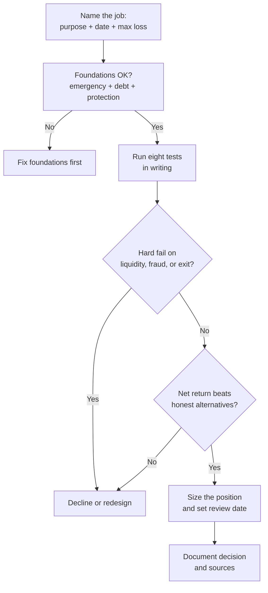

Kenyan investors do not suffer from a shortage of options. They suffer from a shortage of **filters**. Money market funds, T-bills, infrastructure bonds, NSE shares, REITs, land syndicates, chamas, gold, foreign ETFs, endowment plans, and private placements all arrive with confident stories. The stories differ. The decision process should not.

This article is the desk's reusable filter: eight tests that apply whether the offer is a CMA-licensed unit trust or a plot in a peri-urban corridor. Use it before capital moves. If an opportunity cannot survive these questions in writing, it is not ready for your money.

> **Key Insight:** You are not evaluating a product. You are evaluating a **job for a specific pot of money**. The same REIT can be excellent for a five-year income sleeve and disastrous for school fees due in nine months. Start with the job, then test the product. Product-first evaluation is how good assets end up in the wrong hands at the wrong time.

```cards
- icon: Target
  title: Start with the job
  desc: Name the money's purpose, date, and maximum tolerable loss before you open a brochure.
  linkText: Investing map
  linkUrl: /blog/ultimate-guide-to-investing-in-kenya
- icon: Scale
  title: Score the eight tests
  desc: Return, liquidity, risk, tax, horizon, opportunity cost, inflation, and exit, all in writing.
  linkText: Savings vehicles
  linkUrl: /blog/bank-vs-sacco-vs-mmf-savings
  type: amber
- icon: ShieldCheck
  title: Refuse the sales frame
  desc: Guaranteed above T-bill, pressure to pay today, or vague exit terms are automatic pauses.
  linkText: Book a session
  linkUrl: /contact
  type: emerald
```

---

### Before You Evaluate Anything

Three foundations sit **above** this framework. If they are missing, skip the opportunity and fix the base:

1. **Emergency fund.** Three to six months of expenses in a liquid vehicle such as an MMF. Without it, every investment becomes a forced-sale risk. See [Bank Account vs SACCO vs MMF vs Insurance](/blog/bank-vs-sacco-vs-mmf-savings).
2. **Expensive debt controlled.** Digital loans and revolving card balances at high effective APR usually beat any honest investment return. Clearing them is a guaranteed, tax-free gain. See [mobile loan APR reality](/blog/mobile-loan-vs-bank-loan-apr-breakdown).
3. **Protection sized for dependants.** Term life and medical cover protect the plan; they are not optional cosmetics. See [the insurance stack](/blog/insurance-stack-kenya-life-stages).

Only surplus capital that can stay invested for its stated horizon belongs in the filter below.

---

### The Eight Tests

Work through them in order. A hard fail on liquidity or exit often ends the conversation even if the headline return looks strong.

#### 1. Expected return (honest, net, and comparable)

Ask: **What do I actually earn after fees and tax, and against what benchmark?**

- Prefer **net yield** or expected total return over marketing gross figures.
- Compare like with like: a 10% bond coupon is not the same as a 10% "projected" land appreciation, because one is contractual cash and the other is a hope until sale.
- Use a public anchor. As of early July 2026, CBK indicative figures used across this library included a **Central Bank Rate of 8.75%**, a **91-day T-bill near 8.8%**, average savings near **3.2%**, and inflation near **6.4%**. Confirm live rates on the [CBK](https://www.centralbank.go.ke/) site before acting.

$$ \text{Net expected return} \approx \text{Gross return} - \text{Fees} - \text{Tax} - \text{Other drag} $$

**Red flag:** return promised **above** short government paper with "no risk" language. In Kenya that is usually mispriced risk, not free alpha.

#### 2. Liquidity (how fast cash comes back)

Ask: **If I need the money on a known date, can I exit without destroying value?**

| Liquidity band | Typical vehicles | Practical exit |
|---|---|---|
| Same day to 3 days | Bank float, many MMFs | Strong for emergencies |
| Weeks to months | T-bills, listed bonds (market dependent) | Plan around maturities or secondary market |
| Years | Land, private equity, many chamas, endowments early | Exit is a project, not a button |
| Structural lock | Some SACCO deposits while borrowing, early endowment surrender | Rules, not wishes, govern access |

Money needed within two years almost never belongs in multi-year illiquid assets, however attractive the brochure. Laddered T-bills and MMFs own that job; see [Advanced DhowCSD Strategies](/blog/advanced-dhowcsd-t-bill-ladder).

#### 3. Risk (what can go wrong, and who eats the loss)

Ask: **What is the loss mechanism, and am I paid enough to carry it?**

Separate at least four risk types:

- **Credit risk:** the issuer or counterparty fails to pay (corporate paper, private loans, weak borrowers).
- **Market risk:** price moves against you before you exit (equities, REITs, bond prices if sold early).
- **Operational and fraud risk:** process failure, fake titles, unlicensed platforms, weak custody.
- **Concentration risk:** one asset, one corridor, one friend group, one currency.

For households and SMEs, the practical test is the **sleep test**: would a 20% paper drawdown force a panic sale? If yes, the risk level is too high for that pot, regardless of historical averages. Risk profiling in [the investing cornerstone](/blog/ultimate-guide-to-investing-in-kenya) maps Capital Preserver, Income Builder, and Growth Seeker profiles to asset homes.

#### 4. Tax (the second yield)

Ask: **What is the after-tax, after-fee outcome?**

Kenyan examples that change rankings:

- **Infrastructure bond (IFB) coupons** can be tax-free under the published IFB regime, which is why they often beat higher-coupon taxable paper after tax. Detail in [Kenyan Treasury Bonds Guide](/blog/kb-bond-guide-2026).
- **Withholding tax** on many interest distributions is commonly **15%** for residents (confirm current KRA treatment for your vehicle).
- **NSE resident dividends** often face a lower withholding rate than interest (commonly discussed at **5%** for residents; verify for your status).
- **Pension wrappers** can shelter growth and create deduction headroom; see [retirement planning](/blog/retirement-planning-kenya-guide).

$$ \text{After-tax yield} = \text{Pre-tax yield} \times (1 - t) \quad \text{(when tax is a simple withholding)} $$

Never rank opportunities on pre-tax headlines alone. Tax drag is a silent portfolio killer; the same logic appears in [sleeping asset optimisation](/blog/sleeping-asset-optimization).

#### 5. Time horizon (the date the money must work)

Ask: **When must this capital be free, and is that date written down?**

- **Under 2 years:** capital preservation and liquidity dominate.
- **2 to 7 years:** income and moderate growth instruments compete.
- **7+ years:** equities, diversified growth, and long bonds can earn their volatility.

Horizon mismatch is the most common Kenyan error: land bought with money that has a near-term date, or equities funded by next term's school fees. Date the money first; choose the asset second.

#### 6. Opportunity cost (what you give up)

Ask: **What else could this shilling do, and is that alternative better on a risk-adjusted basis?**

Opportunity cost is not abstract. Concrete alternatives always exist:

- Clearing a **15%+** facility may beat a speculative 12% "deal".
- A clean [T-bill ladder](/blog/advanced-dhowcsd-t-bill-ladder) is the default opportunity cost for any private placement.
- Building SACCO deposits may unlock cheaper credit than the investment's yield; see [SACCO membership](/blog/ultimate-guide-to-sacco-membership-kenya).

If the opportunity only wins by ignoring a safer, liquid alternative at a similar net return, it has not earned a place.

#### 7. Inflation (the silent benchmark)

Ask: **Does this preserve purchasing power after inflation?**

With inflation near **6.4%** in the mid-2026 snapshot used across this library, a 5% fixed deposit is not "safe growth"; it is slow erosion with a smile. Real return is the only return that funds a future lifestyle.

$$ \text{Approx. real return} \approx \text{Nominal net return} - \text{Inflation} $$

Capital Preservers still need instruments that at least fight inflation over their horizon. Parking everything in a transactional account fails this test by design.

#### 8. Exit (how the story ends)

Ask: **Who buys from me, at what process cost, and under what rules?**

| Asset | Typical exit path | Friction to price in |
|---|---|---|
| MMF units | Redeem with fund manager | Settlement days, cut-off times |
| T-bills / bonds | Maturity or secondary market | Price risk if sold early |
| NSE shares | Sell on exchange via broker | Spreads, liquidity of the counter |
| REITs | Market sale on the relevant platform | Thin trading can widen spreads |
| Land | Find a buyer, conveyancing, rates clearance | Months, legal cost, price discovery |
| Chama / syndicate share | Pre-agreed buyout or dissolution rules | Governance quality is the exit |
| Endowment | Maturity or surrender | Early surrender can destroy capital |

No clear exit is not a detail. It is a different product: a donation to uncertainty. Land and group structures need written exit rules before capital is pooled; see [complete chama guide](/blog/complete-chama-guide-kenya) and [Kikuyu Ridge syndicate](/blog/kikuyu-ridge-syndicate).

---

### Worked Examples: Same Framework, Different Verdicts

#### Example A: KES 500,000 for school fees in 14 months

| Test | Reading |
|---|---|
| Return | Modest net yield is fine; capital certainty dominates |
| Liquidity | Must be high |
| Risk | No equity drawdown risk |
| Tax | Prefer simple, transparent vehicles |
| Horizon | 14 months, fixed |
| Opportunity cost | Beating a savings account is enough |
| Inflation | Accept small real loss if required for certainty |
| Exit | Maturity ladder preferred |

**Verdict:** MMF plus a short [T-bill ladder](/blog/advanced-dhowcsd-t-bill-ladder). Reject land, private equity, and long endowments for this pot.

#### Example B: KES 2,000,000 surplus, 10-year growth sleeve

| Test | Reading |
|---|---|
| Return | Need real growth above inflation over a decade |
| Liquidity | Can be low if emergency fund is separate |
| Risk | Can tolerate equity volatility |
| Tax | Prefer efficient wrappers and low-fee vehicles |
| Horizon | 10 years |
| Opportunity cost | Idle cash and pure land with zero income lose |
| Inflation | Must beat it over the full period |
| Exit | Listed markets or scheduled contributions work |

**Verdict:** Diversified equities (NSE and/or foreign index exposure), possibly with a bond spine. See [how to buy NSE shares](/blog/how-to-buy-shares-nse-kenya) and [foreign ETFs](/blog/foreign-etfs-offshore-investing-kenya). Cap speculative satellites.

#### Example C: "Guaranteed 4% a month" WhatsApp placement

| Test | Reading |
|---|---|
| Return | 48%+ annualised with "guarantee" language |
| Liquidity | Often locked or informal |
| Risk | Extreme credit and fraud risk |
| Tax | Usually undocumented |
| Horizon | Vague |
| Opportunity cost | T-bills exist at a fraction of the promised yield |
| Inflation | Irrelevant if principal vanishes |
| Exit | Unclear or dependent on new inflows |

**Verdict:** Automatic fail. Anything that needs new investors to pay old ones is not an investment evaluation problem; it is a scam filter problem. The investing cornerstone's rule still holds: guaranteed above the T-bill rate is a decline.

---

### Scoring Sheet You Can Reuse

Copy this table into a notebook or spreadsheet. Score each test **1 (weak)** to **5 (strong)** for the specific pot of money. A single **1** on liquidity, risk honesty, or exit is usually fatal.

| Test | Score (1-5) | Notes / evidence |
|---|---|---|
| Expected return (net) | | Source of figure; fees; tax |
| Liquidity | | Days/months to cash |
| Risk clarity | | Loss mechanisms named |
| Tax treatment | | Verified or assumed? |
| Horizon match | | Written date of need |
| Opportunity cost | | Compared to T-bill / debt clearance |
| Inflation resilience | | Real return estimate |
| Exit quality | | Buyer, process, cost |
| **Total** | **/40** | |

**Interpretation guide (not a magic formula):**

- **32 to 40:** strong candidate if foundations are already funded.
- **24 to 31:** fix the weak tests or reduce size.
- **Below 24:** walk away or redesign the structure.

Judgment still matters. A land deal can score poorly on liquidity and still fit a true 10-year surplus sleeve if exit and title risk are handled. The sheet forces honesty; it does not replace it.



---

### Risk Factors

- **Narrative bias:** a good story is not a risk analysis. Brochures optimise for emotion.
- **Relative performance theatre:** last year's winner is not next year's allocation rule.
- **Complexity premium:** structures you cannot explain to a sceptical friend usually hide fees or control risks.
- **Group dynamics:** chamas and syndicates fail on governance more often than on asset selection.
- **Currency blindness:** offshore assets add USD/KES path risk; model it, do not ignore it.
- **Advice adjacency:** this framework is education. It is not a personal recommendation for any product.

---

### Decision Framework: Printable Checklist

Before you pay:

1. **Job statement written:** "This KES ___ is for ___, needed by ___, and can lose at most ___."
2. **Foundations confirmed:** emergency fund, high-cost debt plan, core protection.
3. **Eight tests scored** with sources dated.
4. **Licence checked** where relevant (CMA, CBK, SASRA, IRA, lands processes).
5. **Documents read:** fact sheet, term sheet, title search plan, constitution, or prospectus.
6. **Exit path named** in one sentence.
7. **Position size capped** so a total loss of this sleeve does not break the household or firm.
8. **Review date set** (quarterly glance, annual full review, or event-driven).
9. **Cooling-off used:** no same-day commitment under social or sales pressure.
10. **Second opinion** for large or illiquid tickets (advocate, licensed advisor, or trusted financially literate peer).

---

### Bengula View

The desk's position is deliberately unfashionable. Kenya does not lack investment products; it lacks **repeated, boring evaluation**. The same eight questions that approve a dull T-bill ladder will correctly reject a glamorous private placement, and the same questions that slow down a land purchase will also stop an investor from over-concentrating in a single NSE darling after a rally year.

We weigh **horizon match, exit quality, and net-of-tax return** above storytelling. We treat government paper as the default opportunity-cost benchmark for shilling cash. We treat unlicensed yield as a compliance and fraud problem first. And we insist that every serious allocation leave a paper trail: what was decided, why, against which dated rates, and when it will be re-checked.

If you want the map of instruments after you have the filter, use [The Ultimate Guide to Investing in Kenya](/blog/ultimate-guide-to-investing-in-kenya). If you want help applying the filter to a live decision, use [services](/services) or [book a session](/contact).

---

### Sources and Further Reading

- [Central Bank of Kenya](https://www.centralbank.go.ke/): policy rates, government securities, DhowCSD.
- [Capital Markets Authority](https://www.cma.or.ke/): licensed intermediaries and collective schemes.
- Bengula Inc: [Ultimate Guide to Investing in Kenya](/blog/ultimate-guide-to-investing-in-kenya), [Bank Account vs SACCO vs MMF vs Insurance](/blog/bank-vs-sacco-vs-mmf-savings), [Monthly Income Engine](/blog/monthly-income-engine-kenya), [Sleeping Asset Optimization](/blog/sleeping-asset-optimization), [Kenyan Treasury Bonds Guide](/blog/kb-bond-guide-2026), [Complete Chama Guide](/blog/complete-chama-guide-kenya), [Insurance Stack](/blog/insurance-stack-kenya-life-stages).

*General financial education for Kenyan readers, not individualised investment, tax, or legal advice. Rates and tax treatments change; verify current figures and licences before acting, and obtain professional advice for material decisions. Past performance is not a promise of future returns.*
