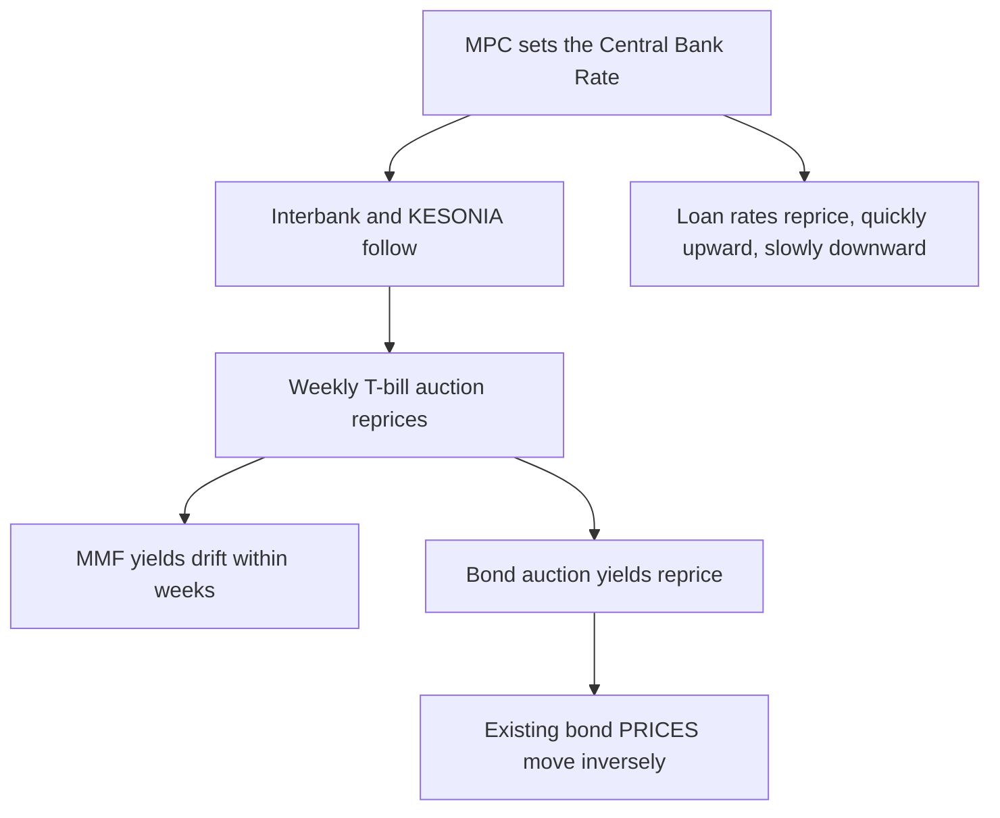

Ask a Kenyan saver where their money is and you will usually get an answer about a rate. The MMF is paying 10-something. The T-bill was 9. Somebody's cousin got an infrastructure bond at 17% back when those existed. The number is always the headline, and the number is almost always the least useful thing about the instrument.

It is the least useful thing because it is not comparable. A money market fund quoting 10% and an infrastructure bond quoting 12.7% are not two points on the same scale. One is an annualised, variable, taxable rate on money you can withdraw in three days. The other is a fixed, tax-free coupon on money you have committed for sixteen years, whose market price will move against you if rates rise and which you may not be able to sell quickly at a fair price when you need to. Comparing 10 to 12.7 tells you nothing about which one belongs in your portfolio, because they are answers to different questions.

This guide is the map of the whole ladder, from cash to the long end. It covers what each instrument is actually for, how the Central Bank Rate and the weekly auction reprice everything above them, what withholding tax does to each headline (the rates differ on every rung and the difference is large), the risks that the word "safe" hides, and how to assemble a laddered sleeve that produces income on a calendar rather than on a hope. It sits above a cluster that already runs deep: [Treasury bonds](/blog/kb-bond-guide-2026), [the T-bill rollover ladder](/blog/advanced-dhowcsd-t-bill-ladder), [the CBR playbook](/blog/cbr-cycle-portfolio-positioning-kenya), [money market funds](/blog/future-mmfs-kenya) and [how to stress-test one](/blog/mmf-stress-test-kenya), [diaspora access to DhowCSD](/blog/cbk-diaspora-bond-access), and [sovereign debt itself](/blog/sovereign-debt-explained). What follows connects them and owns the ground between them.

> **Key Insight:** Every fixed-income decision is a trade of three things against each other: liquidity, income, and price stability. You can have any two. Cash gives you liquidity and stability but no income. A long bond gives you income and, if held to maturity, certainty, but no liquidity and no price stability along the way. The saver who wants all three ends up with none, moving money constantly, paying tax at every stop and never earning the term premium. Decide what each shilling is for first, and the instrument chooses itself.

```cards
- icon: Layers
  title: Match the tenor to the job
  desc: Emergency cash belongs in an MMF. Money with a date belongs in a bill or bond that matures on it. Money with no date is the only money that belongs at the long end.
- icon: Percent
  title: The headline is not the yield
  desc: Withholding tax is 15% on bills and MMFs, 10% on bonds of ten years or more, and zero on infrastructure bonds. Compare after tax or you are comparing nothing.
  type: amber
- icon: CalendarClock
  title: A ladder beats a forecast
  desc: Spread maturities across the curve and something matures on a schedule. You stop predicting rates and start averaging them.
  linkText: Build the T-bill ladder
  linkUrl: /blog/advanced-dhowcsd-t-bill-ladder
  type: emerald
```

---

### Part 1: What Fixed Income Actually Is

Fixed income is lending. You hand money to a borrower (a bank, a fund, a company, or the Government of Kenya), the borrower agrees to pay interest at a stated rate for a stated period, and at the end you get the principal back. That is the whole idea. It is called fixed income because the income is contractual, not because the value of the instrument is fixed.

That distinction is the source of nearly every misunderstanding in this asset class. **The income is fixed. The price is not.** A twenty-year bond bought today at par will return exactly what the coupon promises if you hold it to maturity. If you sell it in year three, you will get whatever the market pays that day, which could be well below what you paid.

Within a portfolio, fixed income does three jobs, and it is worth naming which job each pot of your money is doing:

1. **Liquidity.** Money that must be reachable in days. Emergency fund, school fees due next term, the deposit you are saving toward. The job is availability, and any yield is a bonus.
2. **Income.** Money whose purpose is to produce a predictable stream to spend or reinvest. Here the tenor should match how long the income is needed, and the yield genuinely matters.
3. **Ballast.** Money that exists to stop the rest of the portfolio from swinging. In a Kenyan portfolio holding NSE equities, property and business equity, the bond sleeve is what lets you avoid selling a good asset at a bad moment.

Most Kenyan savers hold one undifferentiated pile and treat all three jobs as the same problem. Splitting the pile is the single highest-return administrative act in personal finance here, because it stops the emergency fund from being locked in a bond and stops long-term money from earning a savings rate.

---

### Part 2: The Instrument Map

Everything available to a Kenyan retail investor, on one table. All rates dated August 2026 and moving constantly; treat them as the shape of the market, not as quotes.

| Instrument | Minimum | Tenor | Liquidity | Withholding tax | Real job |
|---|---|---|---|---|---|
| Bank savings account | Any | None | Instant | 15% | Transaction buffer only |
| Fixed deposit | Typically KES 20,000+ | 1 to 12 months | Locked, penalty to break | 15% | Known date, known amount |
| Money market fund | KES 500 to 5,000 | None | 2 to 4 working days | 15% at source | Emergency fund and cash parking |
| SACCO deposits (BOSA) | Per by-laws | Long, illiquid | Very poor | 15% on interest | Access to credit, not liquidity |
| Treasury bill (91/182/364 day) | KES 50,000 | Under 1 year | Rediscount or sell, at a cost | 15% | Dated goals, ladder rungs |
| Treasury bond (FXD), under 10 years | KES 50,000 | 2 to 9 years | Secondary market | 15% | Medium-term income |
| Treasury bond (FXD), 10 years and over | KES 50,000 | 10 to 30 years | Secondary market | **10%** | Long income, portfolio ballast |
| Infrastructure bond (IFB) | KES 50,000 | Typically 7 to 21 years | Secondary market, usually the most traded | **Exempt** | The tax-efficient income core |
| Corporate bond | Varies by issue | 3 to 7 years typically | Thin | 15% (confirm per issue) | Extra yield for real credit risk |
| Bond or fixed-income unit trust | KES 1,000 to 10,000 | None | Days | 15% at source | Diversified access without a CDS account |

Two things jump out of that table and both are worth internalising before any yield is compared.

**The minimum for direct government securities is KES 50,000, not millions.** CBK sets the minimum face value at KES 50,000 for non-competitive bids, in denominations of KES 50,000. Competitive bidding, where you name the yield you want rather than accepting the auction's weighted average, requires KES 2 million per CSD account per tenor. Almost every retail investor should be bidding non-competitively, which means the practical entry price to lending directly to the government is one month's rent.

**The tax treatment is not uniform, and the differences are enormous.** A 15% withholding tax against a 10% tax against an exemption is not a rounding difference; it is the difference between instruments. Part 6 works it through properly.

---

### Part 3: The On-Ramp, Cash and Money Market Funds

The savings account is where Kenyan money goes to lose purchasing power slowly. The CBK indicative savings rate stood at **3.23%** (May 2026). Against inflation of **6.41%** (June 2026), that is a guaranteed loss in real terms, before the 15% withholding tax on the interest is even applied. Part 8 puts a number on it.

The money market fund is the correct replacement for cash that must stay liquid. It is a collective scheme that buys short-dated instruments (T-bills, fixed deposits, commercial paper, short bonds) and distributes the interest daily. Withdrawals settle in two to four working days. The yield is annualised and variable, moving with the short end of the market.

Three practical rules that the [MMF stress test](/blog/mmf-stress-test-kenya) develops properly:

- **The advertised yield is a rear-view mirror.** It reports what the fund earned recently, usually annualised from a short window. It is not a promise, and comparing two funds on last month's number rewards whoever took the most risk in the last month.
- **Look at what the fund holds.** A fund reaching for yield through commercial paper concentration is taking corporate credit risk with money you believe is safe. Read the asset allocation on the fact sheet, not the headline.
- **Withholding tax at 15% is deducted at source.** The quoted yield is normally gross. A fund quoting 10.2% is delivering roughly 8.67% to a resident individual.

The MMF's job is liquidity, not return. Once a pot of money has passed the point where you might need it within a month, the MMF is no longer the right home for it, and the ladder begins.

For the wider unit trust family beyond MMFs, including fixed income, balanced and equity funds, see [unit trusts beyond MMFs](/blog/unit-trusts-beyond-mmfs-kenya). For the choice between a bank account, a SACCO and an MMF for savings, see [where should your savings actually sit](/blog/bank-vs-sacco-vs-mmf-savings).

---

### Part 4: Treasury Bills

A Treasury bill is a loan to the government for under a year, sold at a discount. You do not receive a coupon; you pay less than face value and receive face value at maturity, and the difference is your interest. CBK auctions all three tenors every week.

The rates carried into the 6 August 2026 auction:

| Tenor | Average rate | Issue |
|---|---:|---|
| 91-day | 8.7882% | 2694/091 |
| 182-day | 8.9545% | 2668/182 |
| 364-day | 9.0169% | 2623/364 |

*Source: Central Bank of Kenya, previous average rates published for the auction dated 6 August 2026.*

Look at the shape rather than the level. Twenty-three basis points separate three months from twelve. That is an almost flat curve, and a flat curve carries a message: the market is not paying you meaningfully more to commit for longer, because it expects short rates to fall. Part 7 explains what to do about that. The mechanics of the discount price, the rollover discipline and the ladder construction are worked in full in [the DhowCSD T-bill ladder](/blog/advanced-dhowcsd-t-bill-ladder).

Two things bills are excellent at, and one they are not.

**Excellent at dated goals.** School fees in January, a land deposit in June: buy the bill that matures just before the date. You know the exact amount arriving and the exact day. Nothing else in Kenyan finance gives you that certainty at that yield.

**Excellent as ladder rungs.** Because they mature so often, bills let you rebuild a portfolio quickly when rates move, without selling anything.

**Poor at long-term income.** A bill ladder must be reinvested four times a year, and every reinvestment happens at whatever rate exists that week. That is reinvestment risk, and in a falling-rate environment it is a slow erosion of income. Savers who kept everything in 91-day bills through the 2025 to 2026 easing cycle watched their income fall by a third while bond holders locked in the old rates. Bills protect you from price risk by exposing you to reinvestment risk. There is no free position.

A note on business cash. For an SME choosing between a fixed deposit and a T-bill for surplus cash, the comparison is worked in [fixed deposit vs Treasury bills](/blog/fixed-deposit-lending-arbitrage), and the answer usually favours the bill on yield while the deposit sometimes wins on convenience and on the relationship value it buys with the bank.

---

### Part 5: Treasury Bonds

A Treasury bond is a loan to the government for two to thirty years, paying a fixed coupon twice a year, with the principal returned at maturity. This is where the term premium lives, and where most Kenyan household wealth in fixed income should eventually sit.

#### How to Read a Bond's Name

Government bonds carry codes that tell you everything: **FXD1/2022/015** means the first fixed-coupon issue of 2022 with an original tenor of fifteen years. **IFB1/2021/018** is the first infrastructure bond of 2021, eighteen years original tenor. Because bonds are frequently reopened (the Treasury sells more of an existing bond rather than creating a new one), the *remaining* tenor is often far shorter than the name suggests, and the remaining tenor is what matters to you.

#### Coupon Versus Yield

These are different numbers and confusing them is the classic beginner error.

The **coupon** is fixed at issue and never changes. It is calculated on face value. A KES 1,000,000 holding of a bond with a 12.667% coupon pays KES 126,670 a year, in two payments of KES 63,335, for the life of the bond, regardless of what happens to interest rates.

The **yield** is what the bond returns at the price you actually pay. When a bond is reopened at auction, bidders compete on yield, and the price adjusts so that the fixed coupon delivers the market's required return. If the market wants more than the coupon offers, the bond sells below par. If it wants less, above par.

Worked, from a real auction: **FXD1/2022/015**, a fifteen-year bond, was reopened at the auction of 19 January 2026 carrying a coupon of **13.942%**, and cleared at a weighted average accepted yield of **13.1669%**. The market wanted less than the coupon paid, so the bond sold at a premium: buyers paid more than KES 100 per KES 100 of face value, and their effective return was the 13.17%, not the 13.94%.

$$
\text{Current yield} = \frac{\text{Annual coupon}}{\text{Price paid}} \times 100
$$

Current yield is a useful sanity check but not the full answer, because it ignores the capital gain or loss you will realise at maturity. The auction's weighted average yield already accounts for both.

#### Buying at the Auction

The primary market is the cheapest way in and requires no broker.

1. Open a CDS account with CBK, now done through the DhowCSD portal or app, with an ID and a KRA PIN.
2. Watch the prospectus for each issue, published on the CBK site with the coupon, tenor, auction date and value date.
3. Submit a **non-competitive** bid of at least KES 50,000, in KES 50,000 denominations. You accept the auction's weighted average yield rather than naming your own. For anyone below institutional scale this is the right choice, because a competitive bid that names too high a yield is simply rejected.
4. Pay by the deadline. Interest lands in your bank account every six months automatically, net of withholding tax where it applies.

#### Buying in the Secondary Market

Between auctions, bonds trade on the NSE through licensed dealers, usually your bank's treasury desk or a stockbroker. This is how you buy a specific existing bond, or how you exit before maturity. Two things to understand before you use it:

**You will pay accrued interest.** The price is quoted "clean", but you settle "dirty": clean price plus the interest that has accumulated since the last coupon date, which the seller has earned and you have not. You get it back at the next coupon payment. It is not a fee, but it does mean the cash required is more than the quoted price implies.

**The spread is your cost of liquidity.** Retail-size trades in less-traded bonds attract a wide bid-offer spread. Infrastructure bonds and large recent issues trade most actively; a small, old, obscure issue may cost you several percent of value to exit. This is the practical meaning of illiquidity, and it is the reason the "I can always sell it" reassurance should be tested before you rely on it.

---

### Part 6: Infrastructure Bonds and the Tax Question

Infrastructure bonds are ordinary Treasury bonds, issued to fund infrastructure projects, with one decisive difference: **the interest is exempt from withholding tax** where the bond has a tenor of three years or more. That exemption is the most valuable feature in Kenyan retail fixed income, and it is routinely undervalued because savers compare gross yields.

As at the end of July 2026, CBK opened a **KES 150 billion** tax-free infrastructure bond sale, reopening three issues with an auction date of 12 August 2026 and settlement on 17 August 2026:

| Issue | Approximate remaining tenor | Coupon | Withholding tax |
|---|---|---:|---|
| IFB1/2019/016 | 9.3 years | 11.7500% | Exempt |
| IFB1/2021/018 | 12.7 years | 12.6670% | Exempt |
| IFB1/2021/021 | 16.2 years | 12.7370% | Exempt |

*Source: CBK prospectus for the reopened infrastructure bonds, subscription opened 30 July 2026. Minimum KES 50,000 for non-competitive bids; KES 2 million per CSD account per tenor for competitive bids.*

#### The Withholding Tax Table

This is the comparison no single article in the library has owned, and it should be the first thing anyone looks at before choosing a rung.

| Instrument | Resident withholding tax | Notes |
|---|---:|---|
| Bank and SACCO deposit interest | 15% | Deducted at source, final for individuals |
| Money market and unit trust distributions | 15% | Deducted at source |
| Treasury bills, all tenors | 15% | Netted in the settlement figures |
| Treasury bonds with tenor under 10 years | 15% | |
| Treasury bonds with tenor of 10 years or more | 10% | The long end is taxed more lightly |
| Infrastructure bonds, tenor 3 years or more | **Exempt** | The exemption sits in the Income Tax Act's list of exempt income |
| Listed dividends (for contrast) | 5% | See [dividend income on the NSE](/blog/dividend-income-nse-kenya) |

*Rates stated as at August 2026 and Finance Act sensitive. Confirm on KRA before relying on them, and note that non-resident treatment differs.*

#### Tax-Equivalent Yield: The Only Fair Comparison

To compare a tax-free bond against a taxable one, gross the tax-free yield up to what a taxable instrument would have to pay to leave you the same money:

$$
\text{Tax-equivalent yield} = \frac{\text{Tax-free yield}}{1 - t}
$$

Run it on the longest IFB above, against the 10% rate that applies to a long taxable bond:

$$
\frac{12.737\%}{1 - 0.10} = 14.152\%
$$

An infrastructure bond paying 12.737% is worth the same to you as a taxable long bond paying **14.15%**. Compared against a shorter taxable bond at 15% tax, the equivalent is 12.737 / 0.85 = **14.98%**.

Now put that beside the FXD1/2022/015 auction: a taxable fifteen-year bond clearing at 13.1669% gross leaves a resident 11.85% after 10% withholding tax. The infrastructure bond, quoting a *lower* headline of 12.737%, pays you nearly a full percentage point more. **The bond with the smaller number is the better instrument, and only the after-tax comparison reveals it.**

This is why infrastructure bonds are heavily oversubscribed in Kenya, and why they should form the core of a long-term income sleeve for anyone paying Kenyan tax. Two qualifications keep it honest. The exemption is a feature of tax law, and tax law changes with every Finance Act; and IFB issues are irregular, so you buy when the Treasury offers, not when you decide.

A related category worth knowing about: **green bonds** and other listed sustainability issues, where the use of proceeds is ring-fenced for environmental projects. The Kenyan market is young, and the instrument's investment merits should be judged on the same yield, tenor, tax and credit tests as anything else. The market context is in [green financing in Kenya](/blog/green-financing-kenya-guide).

---

### Part 7: What Actually Reprices Your Money

Fixed income has one weather system, and it starts at the Central Bank.

#### The Chain



The current setting: the **Central Bank Rate stands at 8.75%** (8 April 2026) and **KESONIA at 8.75%** (23 July 2026), with the CBK discount window at 9.25%. Against that, 91-day bills at 8.79% and 364-day bills at 9.02% look exactly where they should be: the short end is anchored to policy.

The transmission runs at different speeds and in different directions for savers and borrowers, which is the asymmetry every Kenyan feels and few name. Cuts reach your loan slowly and your deposit rate quickly. The positioning playbook for each phase of the cycle is set out in [how the CBR cycle should change your money](/blog/cbr-cycle-portfolio-positioning-kenya), and the borrower's side of the same machinery is in [KESONIA, CBR and risk-based pricing](/blog/risk-based-credit-pricing-kesonia-cbr-kenya).

#### Reading the Auction, Not Just the Rate

The headline rate is the least informative number in an auction result. Three others tell you more:

- **Bid-to-cover ratio.** Total bids divided by the amount offered. A ratio well above one means heavy demand, which usually means yields are about to fall. The infrastructure bond auctions of recent years have been repeatedly and dramatically oversubscribed.
- **Amount accepted versus offered.** The Treasury can reject expensive bids. Accepting far less than offered signals that CBK refused to pay up, and that yields are being held down deliberately.
- **The gap between average bid and average accepted.** When accepted yields sit meaningfully below what the market bid, the Treasury is being firm. When they converge, the market is setting the price.

#### The Shape of the Curve

Plotting yield against tenor produces the curve, and its shape is a forecast written by the market.

- **Normal (upward sloping):** longer money pays meaningfully more. You are compensated for locking up. Ladders trade a little yield for a lot of liquidity.
- **Flat:** the long end barely exceeds the short end. This is roughly the Kenyan short curve in August 2026, with 23 basis points between 91 and 364 days. A flat curve says the market expects rates to fall, and it means committing long is nearly free in liquidity terms today but locks in a rate you will be glad of if the market is right.
- **Inverted:** short money pays more than long. Usually a sign of stress or of an expected sharp easing.

The practical use: when the curve is flat or falling, extend duration, because the income you lock in today is better than the income you will be reinvesting into next year. When the curve is steep and rates are expected to rise, stay short and roll. This is one decision, made once or twice a year, and it matters more than any individual instrument choice.

---

### Part 8: The Risks Behind the Word "Safe"

Government securities carry no credit risk in the ordinary Kenyan sense: the government can always pay shillings. That is the only risk they lack. Five others remain, and the phrase "risk-free" hides all five.

**Interest rate risk (price risk).** If yields rise, the market price of your existing bond falls, because a buyer can get the new, higher coupon elsewhere. The rough measure is modified duration: the percentage price change for a one percentage point move in yields.

$$
\%\Delta\text{Price} \approx -\text{Modified duration} \times \Delta\text{Yield}
$$

A sixteen-year infrastructure bond at around a 12.7% yield has a modified duration of roughly seven. If market yields rise by two percentage points, its price falls by roughly 14%. Hold it to maturity and that is a paper movement you can ignore entirely. Need to sell in year three and it is a real, realised loss. **This is why the long end is only for money with no date attached to it.**

**Reinvestment risk.** The mirror image. Short instruments protect the price and expose the income. Every 91-day rollover is a fresh bet at a fresh rate, and in a falling market your income falls with it.

**Liquidity risk.** A bond is sellable, at a price. Thin issues have wide spreads and small buyers get the worst of them. Do not build an emergency plan on the assumption that a twenty-year bond can be turned into cash at fair value on a Tuesday.

**Inflation risk.** The most reliably underestimated. A fixed coupon is fixed in shillings, and shillings lose purchasing power. Part 9 quantifies it.

**Sovereign and policy risk.** The government will pay in shillings, but the terms around it can change: withholding tax rates, the infrastructure bond exemption, and the fiscal position that determines how much the Treasury must borrow and at what price. Kenya's debt trajectory is a genuine variable for a thirty-year holding, and the background is in [sovereign debt explained](/blog/sovereign-debt-explained).

For corporate bonds, add ordinary credit risk. The extra yield over a government bond of the same tenor is the market's price for the chance the issuer does not pay. Kenya's corporate bond market has delivered defaults within living memory, and a retail investor cannot analyse an issuer's balance sheet as well as an institution can. Treat the spread as a warning, not as free money.

---

### Part 9: What You Actually Keep

Three deductions stand between a headline and a real return: tax, inflation, and fees. Only the first two apply to direct government securities, which is a large part of their appeal.

The correct real return calculation is not subtraction:

$$
\text{Real return} = \frac{1 + r_{\text{after tax}}}{1 + \pi} - 1
$$

Using inflation of **6.41%** (June 2026) and the rates dated above:

| Instrument | Headline | Tax | After tax | Real return |
|---|---:|---:|---:|---:|
| Savings account | 3.23% | 15% | 2.75% | **-3.44%** |
| Bank deposit (average) | 6.80% | 15% | 5.78% | -0.59% |
| 364-day T-bill | 9.02% | 15% | 7.66% | +1.18% |
| Long taxable bond (FXD, Jan 2026 auction) | 13.17% | 10% | 11.85% | +5.11% |
| Infrastructure bond (IFB1/2021/021) | 12.74% | 0% | 12.74% | **+5.95%** |

Read that table twice. A savings account is not a low-return asset; it is a **guaranteed loss of purchasing power of roughly three and a half percent a year**, compounding. The average bank deposit barely holds its ground. Only from the T-bill upward does the money actually grow, and the infrastructure bond, with a lower headline than the taxable bond above it, delivers the best real return on the list.

This is the arithmetic behind the house position that saving alone does not build wealth, and it is why [where your savings actually sit](/blog/bank-vs-sacco-vs-mmf-savings) is a more consequential decision than how much you manage to save in any given month.

---

### Part 10: Access, Including From Abroad

**Directly, through DhowCSD.** CBK's platform replaced the old paper CDS process. A Kenyan with an ID and a KRA PIN can register, bid in weekly bill auctions and monthly bond auctions, and receive coupons straight to a bank account. There are no brokerage fees on primary market purchases. This is the cheapest access in Kenyan finance to any asset class.

**Through a bank or stockbroker.** For secondary market purchases, or where you want the paperwork handled. You pay a spread or commission for the service.

**Through a fund.** A fixed-income or bond unit trust holds government paper on your behalf, with daily liquidity and a much lower minimum, in exchange for a management fee. The trade is fees for convenience and diversification, and for many savers with under KES 50,000 to commit it is the only door open.

**From the diaspora.** Kenyans abroad can hold government securities, and the practicalities, including the account requirements and the currency question, are covered in [CBK diaspora bond access](/blog/cbk-diaspora-bond-access). The critical point for diaspora investors is that these are shilling instruments: a 12.7% tax-free shilling yield is a different proposition to someone whose liabilities are in pounds or dollars, and the currency exposure must be a conscious decision rather than an accident. Currency thinking for households sits in [foreign ETFs and offshore investing](/blog/foreign-etfs-offshore-investing-kenya).

---

### Part 11: Building the Income Sleeve

Here is the assembly, on a realistic KES 3,000,000 of long-term savings for someone who wants monthly income without watching markets.

**Step one: split by job.**

| Job | Amount | Instrument | Why |
|---|---:|---|---|
| Liquidity (6 months of expenses) | 600,000 | Money market fund | Reachable in days, no price risk |
| Dated goals within 2 years | 400,000 | T-bill ladder, 182 and 364 day | Matures when the money is needed |
| Core income and ballast | 2,000,000 | Infrastructure and long Treasury bonds | Highest after-tax income, no reinvestment risk for years |

**Step two: ladder the core so income arrives on a calendar.** Treasury bonds pay semi-annually, on dates set by the issue. Holding three or four issues with staggered coupon dates converts lumpy half-yearly payments into something close to a monthly income. Two bonds paying in January/July and April/October already gives you four payment months; four well-chosen issues can cover eight.

On KES 2,000,000 split across the three infrastructure bonds above, the annual coupon income runs roughly:

| Holding | Amount | Coupon | Annual income |
|---|---:|---:|---:|
| IFB1/2019/016 | 700,000 | 11.750% | 82,250 |
| IFB1/2021/018 | 650,000 | 12.667% | 82,336 |
| IFB1/2021/021 | 650,000 | 12.737% | 82,791 |
| **Total** | **2,000,000** | | **247,377** |

KES 247,377 a year, tax-free, roughly KES 20,600 a month averaged, from money that is still entirely yours and returns in full at maturity. That is the whole point of the sleeve, and it is the mechanism behind [the monthly income engine](/blog/monthly-income-engine-kenya).

**Step three: decide the reinvestment rule in advance.** Every coupon that arrives either gets spent or gets reinvested, and the decision should be made once, as a policy, not monthly as a mood. The simplest workable rule: coupons sweep into the MMF, and whenever the MMF balance exceeds the emergency fund target by KES 50,000, that KES 50,000 goes into the next auction. It requires no forecasting and it never leaves money idle.

**Step four: rebalance once a year, not more.** Check three things: has the emergency fund kept pace with expenses, are any bonds now short enough that they belong in the "dated goals" bucket, and has the curve changed shape enough to alter where new money goes. Then stop.

Where this sleeve sits inside a whole portfolio, next to equities, property, and business equity, is the subject of [the ultimate guide to investing in Kenya](/blog/ultimate-guide-to-investing-in-kenya), and any individual opportunity should still pass the tests in [how to evaluate any investment opportunity](/blog/evaluate-investment-opportunity-kenya).

---

### Part 12: The Common Mistakes

**Chasing the headline yield across instruments with different tax treatment.** Covered at length above and still the single most expensive error. Compare after tax or do not compare.

**Putting the emergency fund in a bond.** It will be needed on the worst possible day, and you will sell into whatever spread the market offers. The emergency fund's job is availability. Nothing else.

**Rolling 91-day bills forever with money that has no date.** This maximises reinvestment risk to avoid price risk you were never going to realise, because you were never going to sell. Long money belongs long.

**Treating an MMF as an investment.** It is a cash management tool that happens to pay a decent rate. A portfolio that is 100% MMF has no term premium, no tax efficiency, and no ballast; it just feels safe.

**Ignoring the coupon dates when building for income.** Buying three bonds that all pay in February and August produces two windfalls and ten dry months. Check the coupon calendar before you bid.

**Buying a corporate bond for the extra two percent without reading the issuer's accounts.** The spread is the price of risk, not a bonus. If you cannot read a balance sheet, [learn to](/blog/how-to-read-financial-statements-kenya) or stay with government paper.

**Forgetting that the exemption is a policy, not a right.** Infrastructure bond tax treatment is set by statute and could change. Existing holdings have historically been protected, but concentration in a single tax-driven trade is still concentration.

**Selling a long bond because its price fell.** If you hold to maturity, a price fall is an accounting event, not a loss. The instrument still pays the coupon it promised and still returns par. The only people harmed by rate rises are those who must sell, which is why the tenor should have been matched to the money's job at the start.

---

### Part 13: Fixed Income for a Business, Not Just a Household

Company money follows the same physics with one extra constraint: it may be needed by the operations at short notice, and the cost of not having it is not inconvenience but a missed order or a bounced supplier payment.

The discipline is a written cash policy that splits the balance into three tiers. Most Kenyan SMEs have never written one, which is why surplus cash typically sits in a current account earning nothing while the same business runs an overdraft at 14.5% on the other side of the ledger.

| Tier | What it covers | Where it sits | Test |
|---|---|---|---|
| Operating float | Payroll, rent, suppliers for the next 4 to 6 weeks | Current account and MMF | Must be available same or next day |
| Reserve | Tax payments, insurance renewals, known lumps | 91 and 182-day bills, or fixed deposits timed to the date | Must be there on a known day |
| Strategic | Money genuinely surplus for a year or more | 364-day bills or short bonds | Only this tier may be locked |

Sizing the tiers is not guesswork. It falls straight out of [the 13-week cash forecast](/blog/13-week-cash-forecast-kenya-sme): the lowest projected closing balance across the thirteen weeks, plus a buffer, is the operating float, and anything reliably above that line for a year is strategic.

Three business-specific points that households do not face.

**Interest income is taxable business income, not final.** For a company, withholding tax deducted on interest is generally an advance against corporation tax rather than a final settlement, so the after-tax comparison in Part 9 does not transfer directly. Take this one to your tax adviser rather than assuming the household treatment.

**Do not fund a term deposit while running an overdraft.** Depositing at 6.8% while borrowing at 14.5% is a 7.7 percentage point loss dressed as prudence. The arbitrage question, and the cases where the deposit is still worth holding because it secures a facility or a relationship, is examined in [fixed deposit vs Treasury bills](/blog/fixed-deposit-lending-arbitrage).

**Locked cash can still be useful as security.** A fixed deposit or a bond holding can be pledged against a facility, which sometimes makes a lower-yielding instrument the right choice because of what it unlocks. That is a financing decision, not an investment one, and it belongs in the conversation described in [the complete SME finance handbook](/blog/sme-finance-handbook-kenya).

---

### Frequently Asked Questions

**Is KES 50,000 really enough to buy a government bond?**
Yes. CBK's minimum face value for a non-competitive bid is KES 50,000, in denominations of KES 50,000, and non-competitive bidders simply accept the auction's weighted average yield. The KES 2 million minimum applies only to competitive bids, where you name your own yield.

**What happens if I need my money before a bond matures?**
You sell it in the secondary market through a bank treasury desk or a stockbroker, at whatever price the market offers that day. That price may be above or below what you paid, depending on where yields have moved since. There is no penalty in the fixed-deposit sense, but there is no guarantee of your capital either. This is exactly why tenor should be matched to the money's job.

**Are infrastructure bonds really tax-free, or is that a marketing line?**
Genuinely tax-free. Interest on infrastructure bonds with a tenor of three years or more sits in the Income Tax Act's schedule of exempt income, and CBK prospectuses state withholding tax as not applicable. It is a statutory exemption, which also means it is a statutory decision that a future Finance Act could revisit.

**Why would I buy a taxable bond when infrastructure bonds exist?**
Availability and diversification. IFB issues are irregular; the Treasury offers them when it wants to fund infrastructure, not when you have money. Taxable bonds are offered monthly and come in a much wider range of tenors, which matters when you are matching a bond to a specific date.

**Should I buy bonds directly or through a fund?**
Directly, if you have KES 50,000 or more per bid and are willing to run a CDS account. You keep the full yield, pay no management fee, and control the tenor. Use a fund when your amounts are below the minimum, when you want daily liquidity, or when you genuinely will not do the administration. The fee is the price of the convenience, and over a long holding it is not trivial.

**Do bonds still make sense when rates are falling?**
That is when they make the most sense, and it is when most savers do the opposite. Falling rates mean the income you lock in today is better than the income available next year, and existing bond prices rise as yields fall. The instrument that suffers in a falling-rate world is the short bill that must be rolled at a lower rate every quarter.

**How do I get income every month rather than every six months?**
Hold several bonds with staggered coupon dates. Each issue has fixed payment months set at issue, so four well-chosen holdings can cover eight months of the year, and sweeping the payments through a money market fund smooths the rest.

---

### Decision Framework: Choosing a Rung

Four questions, answered in order, and the instrument is chosen for you.

1. **When might I need this money?** Under a month: MMF. Under two years, with a known date: a bill or short bond maturing just before it. No date at all: the long end.
2. **Am I buying for income or for a lump sum later?** Income means bonds with staggered coupon dates. A lump sum means a bill or bond maturing on the date, with no reinvestment decisions in between.
3. **What is my after-tax yield on each candidate?** Apply the withholding table. Gross a tax-free yield up with the tax-equivalent formula before comparing.
4. **What happens if I am forced to sell early?** Estimate the price move with the duration rule and ask whether you could absorb it. If the honest answer is no, the tenor is too long for that money.

---

### Risk Factors

**Rate direction is unknowable and irrelevant if you ladder.** Anyone confident about the next twelve months of Kenyan yields is guessing. A ladder makes the guess unnecessary.

**Duration cuts both ways.** The long bonds that produce the best income are the ones whose prices move most. That is fine for money that will never be sold and dangerous for money that might be.

**Tax law changes annually.** Every rate in this guide is dated to August 2026. The infrastructure bond exemption, the 10% long-bond rate and the 15% general rate are all statutory and all movable.

**Auction rates move weekly.** Every yield here will be stale within days. Take live figures from CBK and DhowCSD before bidding.

**Fiscal risk is real over thirty years.** Kenya's borrowing requirement drives both the supply of paper and the yield you are offered. Heavy issuance is good for a buyer's yield and a signal about the underlying position.

**Concentration.** A portfolio that is entirely Kenyan government shillings is concentrated in one issuer and one currency, however safe each individual holding looks.

---

### Bengula View

The most common fixed-income conversation I have is not about which bond to buy. It is with someone holding several million shillings in a savings account, earning a rate that guarantees they will be poorer next year, who has been meaning to "look into T-bills" for two years. The obstacle was never information. It was that opening a CDS account felt like a project, and the project never had a deadline.

That obstacle is now almost gone. DhowCSD reduced the entry to an ID, a KRA PIN, KES 50,000 and an afternoon. There is no broker, no fee on primary purchases and no minimum that excludes an ordinary salaried Kenyan. The gap between the savings account at 3.23% and a tax-free infrastructure bond at 12.7% is roughly nine and a half percentage points a year, paid for by paperwork you do once.

If you do only one thing after reading this, do this one: split your cash into the three jobs, put the liquidity portion into a money market fund this week, and put the portion with no date on it into the next auction. The ladder, the curve reading and the coupon calendar are refinements, and refinements are worth far less than the first move. Fixed income does not reward cleverness. It rewards showing up at the auction with money that has been given a job.

---

### Sources and Further Reading

- [Central Bank of Kenya](https://www.centralbank.go.ke/) for Treasury bill and bond auction results, prospectuses, minimum investment rules, and indicative lending, deposit and savings rates.
- [DhowCSD investor portal](https://dhowcsd.centralbank.go.ke/) for CDS account registration and bidding.
- [Kenya Revenue Authority](https://www.kra.go.ke/) for current withholding tax rates and the exempt income schedule.
- [Nairobi Securities Exchange](https://www.nse.co.ke/) for secondary market bond trading data.
- [Kenya National Bureau of Statistics](https://www.knbs.or.ke/) for the inflation series.

*Rates cited: Central Bank Rate 8.75% (8 April 2026), KESONIA 8.75% (23 July 2026), Treasury bill averages carried into the 6 August 2026 auction, inflation 6.41% (June 2026), savings rate 3.23% and average deposit rate 6.80% (May 2026), infrastructure bond coupons from the CBK prospectus opened 30 July 2026, FXD1/2022/015 auction results of 19 January 2026. Withholding tax rates stated as at August 2026 and Finance Act sensitive. This guide is educational and does not constitute investment or tax advice. Yields move weekly; verify every figure with CBK before you bid.*
