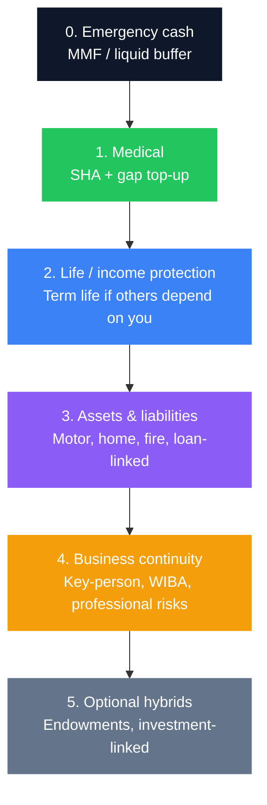

Most Kenyans meet insurance the wrong way around: a broker pushes a bundled endowment, a bank cross-sells credit life on a loan, or a hospital bill arrives before any medical top-up exists. The result is either **over-insured in the wrong places** or **naked where one event can wipe years of saving**.

Insurance is not the opposite of investing. It is what keeps your investment plan alive when life is unfair. A strong [personal finance system](/blog/ultimate-guide-to-personal-finance-kenya) still fails if one hospital stay forces a SACCO withdrawal, a CRB-damaging loan, or the sale of a long-term bond position at the worst moment.

> **Key Insight:** Buy protection in **priority order**, not product popularity. Cash buffer first, then medical, then income protection for dependants, then assets and business continuity. Investment-linked policies and “savings with cover” come only after the basics are solid - or they compete with better tools like [MMFs](/blog/bank-vs-sacco-vs-mmf-savings), [bonds](/blog/kb-bond-guide-2026), and [pensions](/blog/retirement-planning-kenya-guide).

```cards
- icon: Shield
  title: Starter stack
  desc: Emergency fund, SHA awareness, affordable outpatient/inpatient top-up if the budget allows, and basic asset cover where debt exists.
  linkText: Personal finance guide
  linkUrl: /blog/ultimate-guide-to-personal-finance-kenya
- icon: HeartPulse
  title: Growing family
  desc: Serious medical cover, term life sized to dependants, education backup thinking, and a will that matches the policies.
  linkText: Retirement & long-term plan
  linkUrl: /blog/retirement-planning-kenya-guide
  type: amber
- icon: Building2
  title: Owner-manager
  desc: Key-person and business continuity, WIBA where staff apply, asset and liability cover, personal stack still non-negotiable.
  linkText: Book a structure session
  linkUrl: /contact
  type: emerald
```

---

### The Stack Principle (Protect, Then Grow)

Think in layers. Skipping a lower layer is how “well invested” households still go broke after one shock.



**Layer 0 is not insurance, but it is mandatory.** Without 3–6 months of essential expenses in a liquid vehicle, every premium competes with survival cash and every claim delay becomes a crisis. Build this before sophisticated cover. Place the buffer with the product logic in [bank vs SACCO vs MMF](/blog/bank-vs-sacco-vs-mmf-savings) and the full household system in the [personal finance guide](/blog/ultimate-guide-to-personal-finance-kenya).

---

### Layer 1: Medical Cover (The Bill That Arrives Without Warning)

Health shocks are the most common wealth destroyer for Kenyan households: outpatient creep, inpatient events, chronic medication, and maternity or specialist care.

**Practical stack for most people:**

1. **Understand your public/base cover** (including contributions and benefits under the social health framework you actually qualify for). Treat it as a **floor**, not a full private hospital plan.  
2. **Add private medical insurance or a hospital cash / top-up product** sized to the facilities you would actually use in Nairobi, Mombasa, Kisumu, or your county town.  
3. **Read exclusions, waiting periods, and co-pays** before you need them - pre-existing conditions and maternity rules decide whether the policy is real cover or a brochure.

**Budget rule of thumb:** if premiums force you to raid the emergency fund every other month, the policy is mis-sized. Reduce hospital class or outpatient benefits before you cancel inpatient protection entirely.

Medical cover is also a business issue for employers and owner-managers: staff productivity and loyalty often track benefits more than slogans. Price it as part of total reward, not only as a “nice to have.”

---

### Layer 2: Term Life (Income Replacement, Not a Savings Plan)

If anyone depends on your income - children, spouse, aging parents, business partners who co-signed debt - you need a clean answer to: **what happens to them if I die while the plan is unfinished?**

**Prefer pure term life for pure protection.** It pays a lump sum if you die within the term. It is usually far cheaper per shilling of cover than whole-life or endowment structures that mix savings and insurance.

A simple starting heuristic (adjust for debts, education goals, and spouse earnings):

$$
\text{Indicative life cover} \approx \bigl(10 \times \text{annual income}\bigr) + \text{outstanding debts} - \text{liquid assets already earmarked for the family}
$$

Example: income KES 1.8M/year, mortgage and other debts KES 4M, liquid earmarked assets KES 1M:

$$
\text{Cover} \approx (10 \times 1.8\text{M}) + 4\text{M} - 1\text{M} = 21\text{M}
$$

You will not always buy the full theoretical number on day one. You *should* know the gap, prioritise cover while children are young and debts are high, and reduce or restructure as dependence falls - not the other way around.

**Credit life** on a loan protects the *lender* as much as the estate. It can be useful, but it is not a substitute for family term cover sized to living costs and school fees.

For long-horizon education and hybrid products, compare carefully against [endowment plans](/blog/endowment-plans-kenya-guide) - useful for some savers, expensive and misunderstood for others.

```cards
- icon: Umbrella
  title: Term life first
  desc: Cheap, large, time-bound cover while dependants and debts peak. Review every major life event.
  linkText: Full personal finance map
  linkUrl: /blog/ultimate-guide-to-personal-finance-kenya
- icon: PiggyBank
  title: Hybrids second
  desc: Endowments and investment-linked plans can help disciplined savers - but only after pure protection and liquid reserves exist.
  linkText: Endowment guide
  linkUrl: /blog/endowment-plans-kenya-guide
  type: amber
- icon: ScrollText
  title: Paperwork that pays
  desc: Beneficiaries, wills, and nomination forms decide who actually receives the money. Update them after marriage, children, or divorce.
  linkText: Talk it through
  linkUrl: /contact
  type: emerald
```

---

### Layer 3: Assets and Liabilities

**Motor.** Comprehensive vs third-party is a risk decision, not a pride decision. High-value cars, financed vehicles, and vehicles used for income usually justify stronger cover. Always align cover with [asset finance](/blog/asset-finance-vs-conventional-loans) contracts - lenders often require comprehensive insurance and named loss-payee clauses.

**Home and contents / fire.** Landlords, mortgages, and household rebuild costs are where one electrical fault becomes a balance-sheet event. Mortgage-linked fire cover is often mandatory; contents cover is optional until the first theft or fire teaches otherwise.

**Personal liability and gadgets.** Secondary for most stacks; useful when lifestyle or profession creates real third-party exposure.

**Rule:** insure what you cannot afford to replace from the emergency fund within 12 months without derailing investing and debt plans.

---

### Layer 4: Business and Owner-Manager Cover

If the business is the household’s engine, personal cover alone is incomplete.

| Need | Typical tool | Why it matters |
|---|---|---|
| Staff injury at work | **WIBA** (where applicable) | Legal and moral obligation; one claim can stall operations |
| Owner or rainmaker dies/disabled | **Key-person cover** | Buys time for succession, debt service, and hiring |
| Premises, stock, equipment | **Fire, burglary, all-risks** | Stock financed on overdraft is still your loss if uninsured |
| Professional advice roles | **Professional indemnity** | Claim defence costs destroy small firms |
| Contract conditions | **Bonds / specified covers** | Some tenders and leases require proof of cover |

Owner-managers should still keep **personal** medical and life cover outside the company where possible, so family protection does not vanish in a shareholder dispute or frozen business account.

Working-capital stress and insurance gaps often arrive together: after a shock, facilities get maxed and collections slip. Keep the business cycle healthy using the same discipline as in the [working capital cycle guide](/blog/working-capital-cycle-kenya-smes).

---

### Life-Stage Playbooks

#### Starter (early career, few dependants)

| Priority | Action |
|---|---|
| 1 | Emergency fund in liquid form |
| 2 | Base health access + modest private top-up if budget allows |
| 3 | Avoid expensive investment-linked premiums that crowd out MMF/pension |
| 4 | Third-party or reasonable motor cover if you drive |
| 5 | Skip large life cover until someone truly depends on you - or buy a small policy if you have co-signed family debt |

#### Growing family

| Priority | Action |
|---|---|
| 1 | Inpatient-strong medical for the household |
| 2 | Term life on earning adults; debts + education years in the sum assured |
| 3 | Write or update a will; align policy beneficiaries |
| 4 | Education funding plan that does **not** rely only on school-fee panic loans |
| 5 | Mortgage/fire and adequate motor if applicable |

#### Owner-manager / high earner

| Priority | Action |
|---|---|
| 1 | Personal stack still complete (medical + term life) |
| 2 | Key-person and business asset covers sized to debt service |
| 3 | WIBA and staff medical policy decisions as business infrastructure |
| 4 | Estate and succession thinking - shares, signatories, and insurance nominations |
| 5 | Only then: endowments, investment-linked, or legacy products that fit tax and cash-flow |

```cards
- icon: Sprout
  title: Starter
  desc: Liquidity and health first. Do not buy complex policies to feel “adult” while the emergency fund is empty.
  linkText: Bank vs SACCO vs MMF
  linkUrl: /blog/bank-vs-sacco-vs-mmf-savings
- icon: Users
  title: Growing family
  desc: Medical + term life + beneficiaries. This is the decade where under-insurance hurts children most.
  linkText: Personal finance guide
  linkUrl: /blog/ultimate-guide-to-personal-finance-kenya
  type: amber
- icon: Briefcase
  title: Owner-manager
  desc: Key-person and business assets protect the household engine. Personal and company covers are both required.
  linkText: SME finance handbook
  linkUrl: /blog/sme-finance-handbook-kenya
  type: emerald
```

---

### How Much Should Premiums Cost?

There is no universal percentage, but a useful stress test is:

$$
\text{Total essential premiums} \leq 5\%\text{–}10\% \text{ of take-home pay}
$$

If you are above that range:

- Cut **savings hybrids** before pure term life and inpatient medical  
- Raise deductibles / co-pays where you can fund them from the emergency reserve  
- Lengthen review cycles but do **not** lapse critical cover to free cash for speculative investing  

Paying 15% of income into poorly understood policies while carrying [expensive short-term debt](/blog/mobile-digital-loans-real-cost-kenya) is inverted priority. Clear destructive debt, keep protection, then invest.

---

### Common Kenyan Mistakes

1. **Buying endowment “savings” with no emergency fund or medical top-up.**  
2. **Assuming company medical covers the whole family forever** - resignations and job changes end it.  
3. **Ignoring beneficiaries and wills** so proceeds fight succession drama.  
4. **Duplicate cover** (multiple thin outpatient policies) while inpatient limits are tiny.  
5. **Insuring the car comprehensively and the breadwinner for almost nothing.**  
6. **Letting credit life on one loan substitute for household income protection.**  
7. **Surrendering long policies early** without reading penalties - see the surrender traps in the [endowment guide](/blog/endowment-plans-kenya-guide).  
8. **No disability thinking** - many households need income protection logic for disability as much as for death.

---

### Annual Review Checklist

- Dependants, debts, and income still match life cover?  
- Medical network still matches where you actually seek care?  
- Beneficiaries and will updated after birth, marriage, divorce, or death?  
- Business covers still match asset values and loan covenants?  
- Premiums still fit cash-flow after school fees and rate changes?  
- Any hybrid policy underperforming a simple MMF + term life split?

---

### Closing

A good insurance stack is boring on purpose. It does not chase the highest illustrated bonus or the cleverest investment wrapper. It makes sure that **one hospital admission, one funeral, one fire, or one key resignation** does not erase a decade of disciplined [investing](/blog/ultimate-guide-to-investing-in-kenya).

Start from the bottom of the pyramid: liquid buffer, medical, term life if others depend on you, then assets, then business continuity. Add hybrid savings products only when the foundation is stable and the premium does not cannibalise better wealth tools - pensions, bonds, diversified funds, and clean banking structure.

If you want a prioritised stack for your household or company - cover gaps, beneficiary structure, or how insurance sits next to loans and investments - explore [services](/services) or [book a session](/contact). Protection is not pessimism. It is how optimistic plans survive contact with reality.
