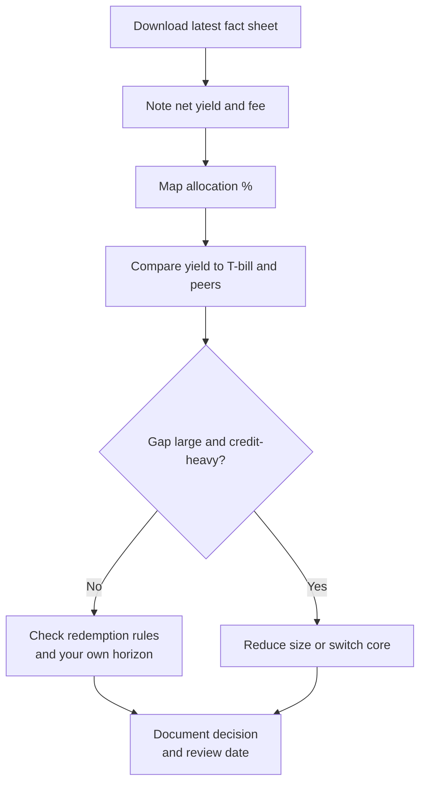

Money market funds earned their place in Kenyan household finance for a good reason: they pay more than a sleepy savings account while staying far more liquid than land or a five-year endowment. The danger is the next step in human nature: treating the **leaderboard yield** as a safety score.

This article is a **reader skill**, not a market outlook. For the industry arc and role of MMFs, use [The Future of MMFs in Kenya](/blog/future-mmfs-kenya). For where MMFs sit among banks, SACCOs, and insurance savings, use [Bank Account vs SACCO vs MMF vs Insurance](/blog/bank-vs-sacco-vs-mmf-savings). Here you will learn to **stress what is inside the fund**.

> **Key Insight:** An MMF is a portfolio of short-term credit decisions wearing a daily yield mask. When two funds show 10% and 13%, the gap is rarely magic. It is usually **more risk, more fees opacity, or both**. Your job is to ask what you are being paid to underwrite.

```cards
- icon: FileSearch
  title: Read holdings
  desc: Asset mix, top exposures, and weighted maturity matter more than yesterday's effective rate.
  linkText: MMF market context
  linkUrl: /blog/future-mmfs-kenya
- icon: Droplets
  title: Test liquidity
  desc: Emergency money must survive redemptions without drama; concentration is the enemy.
  linkText: Savings decision guide
  linkUrl: /blog/bank-vs-sacco-vs-mmf-savings
  type: amber
- icon: Gauge
  title: Cap the chase
  desc: If yield sits far above T-bills, demand a written explanation you understand.
  linkText: T-bill ladder
  linkUrl: /blog/advanced-dhowcsd-t-bill-ladder
  type: emerald
```

---

### What an MMF Is Under the Bonnet

A Kenyan money market fund is typically a **CMA-regulated collective investment scheme** that pools money into short-dated instruments such as:

- Treasury bills and other government securities
- Bank deposits and call placements
- Commercial paper and other short corporate or quasi-government paper
- Cash and near-cash balances

You buy units. The fund publishes performance. You redeem under the scheme's rules (often one to three business days, sometimes faster).

**Not the same as a bank deposit:** MMFs are not KDIC-insured deposits. Regulation and trustee structures matter; "feels like a bank" is not a guarantee.

---

### The Documents You Actually Need

Before you chase a yield screenshot, collect:

1. **Fact sheet** (latest month)
2. **Scheme information memorandum / trust deed highlights** (fees, redemption rules)
3. **Portfolio breakdown** (asset allocation and, where published, top holdings)
4. **Total expense / management fee** disclosure
5. **Trustee and fund manager** identity (licensed names, not brand nicknames only)

If a seller cannot produce a fact sheet, you do not have a product conversation yet.

---

### The Five Stress Lenses

#### 1. Yield versus the government anchor

Compare the fund's gross/net yield with the latest **91-day T-bill** and with peer MMFs.

As a mid-2026 library snapshot, CBK-linked short rates sat near the high-8% area with CBR at **8.75%**; always re-check live auctions. A fund printing far above that band must explain **how**.

| Pattern | Interpretation |
|---|---|
| Yield ≈ T-bill after fees | Classic government-heavy or high-quality short book |
| Yield modestly above T-bill | Possible credit premium or active positioning |
| Yield far above T-bill and peers | Read holdings twice; size the position smaller |

#### 2. Asset allocation quality

Sketch the book:

| Bucket | Role | Stress question |
|---|---|---|
| Government securities | Core safety and liquidity | Is this actually the majority? |
| Bank placements | Yield + relationship liquidity | Which banks? Concentration? |
| Commercial paper / corporate | Yield pickup | Who are the issuers? Tenor? |
| Other / "alternative" short assets | Sometimes yield, sometimes fog | Can you explain it in one sentence? |

**Red flag:** large unidentified "other" or heavy non-government credit without names.

#### 3. Concentration

Even short paper hurts if many holdings are economically the same bet (one sector, one issuer group, one bank cluster).

Simple rules of thumb for emergency money:

- Prefer diversified government-heavy books
- Be cautious when a few private issuers dominate yield
- Remember your **own** concentration: holding emergency cash in one ultra-aggressive fund is still concentration

#### 4. Liquidity and maturity profile

Ask:

- What is the **weighted average maturity** (or typical tenor) of holdings?
- How quickly can the fund raise cash if many unitholders redeem in the same week?
- Are redemptions paid from cash buffers or from selling paper into a thin market?

Emergency-fund money should not live in the MMF equivalent of a "yield project."

#### 5. Fees and net truth

$$ \text{Investor outcome} \approx \text{Gross portfolio yield} - \text{Fees} - \text{Tax (e.g. WHT on distributions)} $$

Two funds with identical portfolios can diverge after fees. Rank on **net**, not on marketing gross. Tax treatment should be confirmed for your situation; many resident distributions face withholding (commonly discussed at 15% on interest-like income; verify current practice).

---

### Worked Stress Table (Anonymised Teaching Example)

The figures below are **illustrative composites** for method training, not a real named fund recommendation.

| Item | Fund A "Steady" | Fund B "Leaderboard" |
|---|---|---|
| Advertised effective yield | 10.2% | 13.1% |
| Est. mgmt fee drag | 1.5% | 2.0% |
| Govt & cash allocation | 70% | 35% |
| Bank placements | 20% | 25% |
| Commercial paper / other credit | 10% | 40% |
| Top 3 private exposures | Low | High (names thin) |
| WAM (indicative) | Short | Longer short-end |
| Fit for 3-6 month emergency fund? | Stronger | Only as a satellite, if at all |

**Stress question:** If commercial paper spreads widen and redemptions spike, which book has more forced-sale risk? Fund B's extra ~3 points of yield is the market's way of asking you to underwrite that question.

---

### How to Run Your Own 20-Minute Review



1. Write the **job** of this money (emergency, near-term tax, school fees date).
2. Pull the latest fact sheet.
3. Fill a five-line allocation table.
4. Compare yield to T-bill and two peer funds.
5. Decide: **core**, **satellite**, or **exit**.
6. Diary a quarterly re-read (or after any rate shock).

This is the same spirit as [evaluate any investment](/blog/evaluate-investment-opportunity-kenya), specialised to MMFs.

---

### What This Test Does Not Do

- It does not predict next month's league table winner.
- It does not replace reading the full scheme documents.
- It does not make MMFs "risk-free."
- It does not tell you to abandon MMFs; for liquid reserves they remain a central tool in [personal finance](/blog/ultimate-guide-to-personal-finance-kenya) and [investing](/blog/ultimate-guide-to-investing-in-kenya) maps.

For longer dated money, graduate to [T-bill ladders](/blog/advanced-dhowcsd-t-bill-ladder) and [bonds](/blog/kb-bond-guide-2026) rather than forcing an MMF to be a total-wealth product.

---

### Risk Factors

- **Fact sheets lag.** Holdings can shift between publications.
- **Past yield is not promised.** Rate cycles reprice short assets.
- **Operational and manager risk** exist even in regulated schemes.
- **Platform and M-Pesa distribution convenience** is not a credit analysis.
- **Education only;** not a recommendation to buy or sell any named fund.

---

### Decision Framework

| If... | Then... |
|---|---|
| Money is true emergency reserve | Prefer plain, government-heavy, understandable books |
| Yield ≫ T-bill without clear credit explanation | Do not use as sole cash home |
| You cannot obtain a fact sheet | Do not invest |
| Horizon is 12-24 months+ with known date | Consider T-bills/bonds instead of perpetual MMF parking |
| Fund is one of several cash tools | Size the aggressive sleeve deliberately |

---

### Bengula View

The desk likes MMFs for the job they were built for: **liquid reserves that should not sit at 3%**. The desk dislikes MMFs when they become a personality contest on yield leaderboards.

Stress the book. Prefer intelligibility over bragging rights for money you may need in a bad month. Chase yield only with eyes open, position limits, and a fact sheet you have actually read. When the cash job ends and the investment job begins, step up the curve on purpose.

For instrument selection after the cash layer, use [the investing cornerstone](/blog/ultimate-guide-to-investing-in-kenya). For a portfolio conversation, use [services](/services) or [book a session](/contact).

---

### Sources and Further Reading

- [Capital Markets Authority](https://www.cma.or.ke/): licensing and collective investment scheme oversight.
- [Central Bank of Kenya](https://www.centralbank.go.ke/): T-bill and policy rate context.
- Bengula Inc: [Future of MMFs in Kenya](/blog/future-mmfs-kenya), [Bank vs SACCO vs MMF vs Insurance](/blog/bank-vs-sacco-vs-mmf-savings), [Advanced DhowCSD T-Bill Ladder](/blog/advanced-dhowcsd-t-bill-ladder), [Evaluate Any Investment Opportunity](/blog/evaluate-investment-opportunity-kenya), [Ultimate Guide to Investing in Kenya](/blog/ultimate-guide-to-investing-in-kenya), [Monthly Income Engine](/blog/monthly-income-engine-kenya).

*General financial education, not individualised investment advice. Fund holdings, yields, fees, and tax treatments change; verify current fact sheets and licences, and consider professional advice for material sums. Past performance is not a promise of future returns.*
