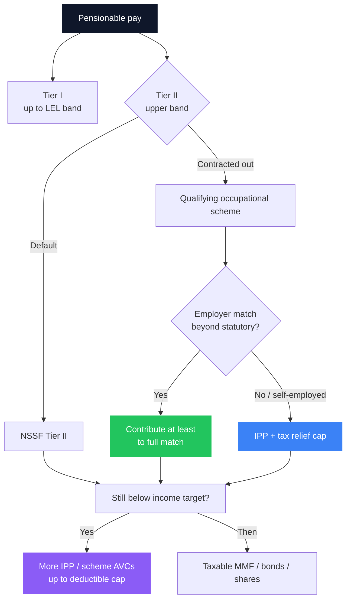

Most Kenyan workers treat retirement as “whatever NSSF does.” That was almost rational when contributions were a few hundred shillings a month. It is not rational now. Under the phased NSSF Act rollout, formal employees and their employers can put up to **KES 12,960 a month** into the fund at the contribution ceiling - yet that is still a **floor**, not a lifestyle replacement at sixty.

The real decision for anyone who can save more is narrower and more useful: **once the mandatory NSSF layer is handled, where should the next shilling of retirement money go - contracted-out Tier II, an employer occupational scheme, or a private Individual Pension Plan (IPP)?** This article answers that without product marketing, using the same three-pillar map as the full [retirement planning guide](/blog/retirement-planning-kenya-guide).

> **Key Insight:** Capture **employer match** and **tax relief** before you optimise fund manager brands. The sequence is: understand Tier I vs Tier II → use contracting-out if your scheme qualifies → fill the deductible pension cap (up to **KES 30,000/month** across registered contributions) → only then load taxable long-term investments. A brilliant unit trust cannot beat free employer money and immediate PAYE savings.

```cards
- icon: Landmark
  title: NSSF is the floor
  desc: Tier I and Tier II are mandatory for formal pay. Treat them as the base layer you credit in your plan, not the entire retirement.
  linkText: Full retirement guide
  linkUrl: /blog/retirement-planning-kenya-guide
- icon: Building2
  title: Match beats marketing
  desc: If your employer runs a registered scheme with a match, contributing below the match ceiling is refusing a pay rise.
  linkText: Personal finance system
  linkUrl: /blog/ultimate-guide-to-personal-finance-kenya
  type: amber
- icon: Receipt
  title: Tax relief is the lever
  desc: Registered pension contributions can be deductible up to KES 30,000 a month. Structure savings to capture it before taxable pots.
  linkText: Book a plan session
  linkUrl: /contact
  type: emerald
```

---

### Quick Map: What You Are Choosing Between

| Vehicle | Who it is for | What it is | Your control |
|---|---|---|---|
| **NSSF Tier I** | Formal employees (mandatory band) | First slice of statutory contributions | Low - rules set by law |
| **NSSF Tier II** | Formal employees (upper band) | Second statutory slice; can sometimes be **contracted out** | Medium - scheme choice if contracted out |
| **Occupational scheme** | Staff of employers who offer one | Employer + employee pension (often DC) | Medium - investment menu inside scheme rules |
| **Individual Pension Plan (IPP)** | Anyone, especially self-employed / no scheme | Private RBA-registered pension | High - provider, contribution, often fund choice |
| **Taxable investments** (MMF, bonds, shares) | Everyone | Flexible wealth tools | High - but no pension tax wrapper |

These are **complements**. The secure path stacks them; it does not pick one slogan.

---

### How NSSF Tiers Work (2026 Framing)

From **1 February 2026 (Year 4 of the phased rollout)**, contributions are **6% of pensionable pay from the employee and 6% from the employer**, split across two tiers ([NSSF contribution rates](https://www.nssf.or.ke/new-contribution-rates)):

| Tier | Monthly earnings band | Rate each side | Max each side |
|---|---|---|---|
| **Tier I** | Up to Lower Earnings Limit **KES 9,000** | 6% | **KES 540** |
| **Tier II** | From **KES 9,001** to Upper Earnings Limit **KES 108,000** | 6% | **KES 5,940** |
| **Total** | | | **KES 6,480** each side |

At the ceiling, **KES 12,960 a month** (employee + employer) can flow into retirement saving through NSSF mechanics alone. That is serious money over a career - and still usually **not enough** alone for a middle-class replacement income. For how large a pot you actually need, use the capital maths in the [retirement guide](/blog/retirement-planning-kenya-guide).

**Tier I** is the non-negotiable social-security style base.  
**Tier II** is where scheme design gets interesting: many employers can **contract out** Tier II to a qualifying occupational pension so that the “upper band” contributions sit in the company scheme (or equivalent arrangement) rather than only in NSSF’s default path. Confirm the exact status with HR and the scheme administrator - do not assume.



---

### Contracting Out Tier II: When It Helps

Contracting out is not a loophole. It is a **routing decision**: Tier II money lands in a scheme your employer (and the regulator framework) already recognises.

**It tends to help when:**

- The occupational scheme has **clear reporting**, reasonable fees, and a sensible default fund  
- You get **governance and HR support** you will not get as a lone IPP shopper  
- Vesting and portability rules are written and understandable  
- The scheme allows **additional voluntary contributions (AVCs)** toward the tax cap  

**It does not automatically mean “higher returns.”** Returns depend on asset allocation and fees. A poorly explained scheme with high charges can underperform a clean IPP - or a disciplined [bond ladder](/blog/advanced-dhowcsd-t-bill-ladder) outside the pension wrapper if you already maxed tax relief (rare for most people).

**Questions for HR / the administrator:**

1. Is Tier II contracted out for my grade?  
2. What is the **employee + employer** total contribution rate beyond statutory minima?  
3. What is the **vesting** schedule on employer money?  
4. What are **total annual fees** (admin + fund management)?  
5. On resignation, is the default **transfer** or a cash-out temptation?  

The cash-out temptation is the career destroyer: spending a pension on every job change resets compounding. Transfer; do not “clear the balance” for lifestyle.

---

### Private Pension (IPP): Who Should Prioritise It

An **Individual Pension Plan** is the right primary engine when:

- You are **self-employed**, a director taking irregular draws, or informal  
- Your employer has **no occupational scheme**  
- You have maxed the useful match and still sit under the **tax-deductible** contribution ceiling  
- You want a wrapper that is harder to raid than a plain MMF (discipline value)

IPPs are offered by RBA-registered providers (insurers and fund managers). Compare **fees, fund range, service, and claims/retirement options** - not only last year’s illustrated return.

For informal earners, an IPP plus SACCO plus a titled asset is a realistic three-part stack; SACCO alone is not a full pension substitute ([guarantor and governance risks](/blog/sacco-savers-guarantors)).

```cards
- icon: User
  title: Employee with a scheme
  desc: Confirm Tier II routing, take the full employer match, then AVCs or IPP only to fill tax relief and the income gap.
  linkText: Retirement pillars explained
  linkUrl: /blog/retirement-planning-kenya-guide
- icon: Store
  title: Owner / self-employed
  desc: No match to capture - make IPP + tax relief the core, then taxable investments for liquidity and goals under 10 years.
  linkText: Owner wealth map
  linkUrl: /blog/ultimate-guide-to-personal-finance-kenya
  type: amber
- icon: ArrowLeftRight
  title: Job changer
  desc: Portability beats cash-out. Transfer benefits; spending the pot on exit is the most expensive “bonus” you will ever take.
  linkText: Talk it through
  linkUrl: /contact
  type: emerald
```

---

### The Tax Relief That Decides the Order

Since the **Tax Laws (Amendment) Act, 2024** (effective late December 2024), registered pension contributions can be tax-deductible up to **KES 30,000 per month (KES 360,000 a year)** - up from the old KES 20,000 monthly cap ([RBA analysis](https://www.rba.go.ke/the-tax-laws-amendment-act-2024-a-detailed-analysis-of-the-amendments-benefiting-the-retirement-benefits-sector/); [KRA notice](https://www.kra.go.ke/news-center/public-notices/2157-amendments-to-paye-computation-pursuant-to-the-tax-laws-amendment-act,-2024)).

Statutory NSSF and scheme contributions count toward how you structure the cap; the planning job is to use the room intentionally.

Illustrative relief at a **30%** marginal PAYE band if you place a full **KES 360,000** of deductible contributions in a year:

$$
\text{Annual tax saved} \approx 360{,}000 \times 0.30 = \text{KES } 108{,}000
$$

That is an immediate, policy-backed return **before** investment performance. Two further reasons the wrapper matters in 2026 framing:

- **Retirement income** can be tax-favoured for qualifying members (age, ill health, or long membership rules - confirm current KRA/RBA guidance for your case)  
- **Post-retirement medical** contributions have their own deductible room in the reforms - pair health cost planning with the [insurance stack](/blog/insurance-stack-kenya-life-stages)

**Order of operations:**

1. Statutory NSSF (and contracted-out Tier II where applicable)  
2. Employer match to the last shilling  
3. Additional registered pension (scheme AVC or IPP) up toward **KES 30,000/month** deductible capacity, if cash-flow allows  
4. Taxable tools: [MMFs](/blog/bank-vs-sacco-vs-mmf-savings), [Treasury bonds](/blog/kb-bond-guide-2026), equities - for goals and liquidity pensions should not fund  

Do **not** starve the [emergency fund](/blog/ultimate-guide-to-personal-finance-kenya) to chase tax relief. Illiquid retirement money is a poor substitute for three to six months of expenses.

---

### Worked Comparison: Three Earners

Assume simplified monthly pictures (illustrative - not a payslip engine).

| Profile | Statutory NSSF path | Best “next shilling” | Why |
|---|---|---|---|
| **Amina**, employed, matched DC scheme | Tier I + contracted-out Tier II into scheme | Extra AVCs to tax cap | Match + relief + payroll discipline |
| **Brian**, employed, NSSF only, no scheme | Tier I + Tier II at NSSF | Open IPP; automate after payday | Builds Pillar 3; captures relief beyond statutory |
| **Carol**, SME owner, irregular draws | Voluntary / director path as advised by tax agent | IPP sized to deductible room + clean business accounts | No employer match; wrapper + tax planning matter most |

For Carol, “profit left in the company” is not a pension. Separate owner retirement funding from [working capital](/blog/working-capital-cycle-kenya-smes) or you will raid the future every time a client pays late.

---

### Fees, Risk, and What “Private” Does Not Mean

- **Private pension is not higher risk by definition** - risk follows the funds you choose (money market vs equity-heavy).  
- **NSSF is not “no risk”** - it is a large statutory fund with its own investment policy; your outcome is still long-horizon and rule-bound.  
- **A 1% annual fee gap** compounds into years of retirement income. Demand total expense clarity in writing.  
- **Land and SACCO** remain common Kenyan retirement assets; they are complements. They do not replace the tax wrapper or the income-planning problem at retirement.

When you eventually turn the pot into income - annuity, drawdown, or bond ladder - use the decumulation section of the [retirement planning guide](/blog/retirement-planning-kenya-guide) and the [monthly income engine](/blog/monthly-income-engine-kenya).

```cards
- icon: Scale
  title: Compare total cost
  desc: Admin plus fund management, not last year’s top fund. Fees are certain; past returns are not.
  linkText: Tax and fee drag
  linkUrl: /blog/sleeping-asset-optimization
- icon: TrendingUp
  title: Then compare growth tools
  desc: After the pension cap, taxable bonds and funds handle medium-term goals without locking every shilling.
  linkText: Bond guide
  linkUrl: /blog/kb-bond-guide-2026
  type: amber
- icon: ShieldCheck
  title: Protect the plan
  desc: Medical and life cover stop one shock from forcing a pension cash-out.
  linkText: Insurance stack
  linkUrl: /blog/insurance-stack-kenya-life-stages
  type: emerald
```

---

### Decision Checklist

1. **Do I know my Tier I / Tier II split and whether Tier II is contracted out?**  
2. **Is there an employer match I have not fully taken?**  
3. **Am I using registered contributions toward the KES 30,000/month relief room?**  
4. **If self-employed, is an IPP automated on a realistic contribution - not “when cash allows”?**  
5. **On job change, is my default transfer - not spend?**  
6. **Do I have a separate emergency fund so the pension lock is a feature, not a trap?**  
7. **Have I estimated the capital needed for target retirement income?**  

If you cannot answer (1)–(3), start there before opening another investment app.

---

### Closing

NSSF Tier II vs private pension is not a tribal fight. **NSSF (and contracted-out Tier II) is the statutory base; private and occupational pensions are how you turn a floor into an income.** The winning sequence is boring and powerful: understand the tiers, take every match, fill tax-efficient pension room, keep liquidity outside the lock, and refuse to cash out on every resignation.

For the full income-target maths and decumulation options, read the [retirement planning guide](/blog/retirement-planning-kenya-guide). For a household system that sits around the pension stack, use the [personal finance guide](/blog/ultimate-guide-to-personal-finance-kenya). If you want help mapping Tier II, scheme rules, and IPP sizing to your payslip or business drawings, explore [services](/services) or [book a session](/contact).
