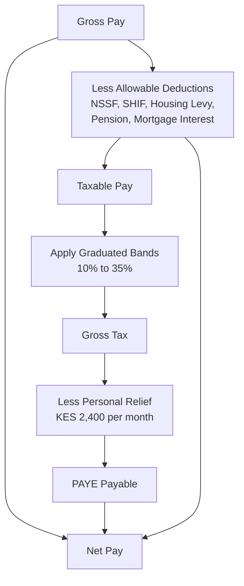

Two people can be offered the same KES 150,000 a month and end up with different money in the bank. One contributes to a registered pension scheme and services a mortgage. The other does not. The difference is not small, and none of it is visible in the offer letter.

Most conversations about pay stop at the gross number, because gross is the number you negotiate. Net is the number you live on, and net is decided by an order of operations that is rarely explained. Statutory contributions come off first. Tax is calculated on what remains. Relief is subtracted at the end. Get the sequence wrong and your mental arithmetic will be wrong by thousands of shillings every month.

This guide walks the whole sequence, twice. Once for an employee, where an employer runs the machine for you, and once for a freelancer, where you are the machine and the penalties for getting it wrong are yours alone.

### Key Insight

Since **27 December 2024**, SHIF and the Affordable Housing Levy are treated as **allowable deductions from taxable income** rather than as tax reliefs. That single change means every shilling you contribute is a shilling the taxman never sees.

For someone in the 30% band, a KES 4,125 SHIF contribution does not cost KES 4,125. It costs KES 2,887.50, because the contribution reduces taxable pay and therefore reduces tax by KES 1,237.50. The same logic applies to your pension contribution, your NSSF deduction, and your mortgage interest.

$$ \text{Net Cost of a Deduction} = \text{Contribution} \times (1 - \text{Marginal Rate}) $$

This is the same principle Bengula applies to bond yields and loan pricing. The headline number is never the number that matters. What lands in your account is.

### The Order of Operations on a Kenyan Payslip

Every payslip runs the same sequence. The confusion comes from the fact that statutory contributions appear **twice**: once to reduce the income that gets taxed, and once again as actual cash leaving your gross pay.

Read it as two paths converging. The left path computes your tax. The right path computes your cash. Your contributions reduce both, which is exactly why they are worth more than they look.

### The Tax Bands, Dated

Kenya taxes individual income progressively. These bands took effect on **1 July 2023** and remain current as at **July 2026**.

| Annual Taxable Income (KES) | Monthly Equivalent (KES) | Rate |
|---|---|---|
| First 288,000 | First 24,000 | 10% |
| Next 100,000 | Next 8,333 | 25% |
| Next 5,612,000 | Next 467,667 | 30% |
| Next 3,600,000 | Next 300,000 | 32.5% |
| Above 9,600,000 | Above 800,000 | 35% |

Monthly figures are the annual bands divided by twelve and rounded, which is how payroll systems apply them.

**Personal relief is KES 2,400 per month, or KES 28,800 per year.** It is a credit against tax computed, not a deduction from income, which is why it sits at the end of the sequence. Holders of a valid KRA disability exemption certificate receive a further KES 2,400 per month.

The band you sit in is your **marginal** rate, the rate charged on your next shilling. It is not the rate you pay on your whole salary. Almost nobody pays their marginal rate on average, and confusing the two is the most common error in salary conversations.

### What Comes Off Before Tax

These are the deductions that reduce taxable pay. Each has its own ceiling and its own effective date.

| Deduction | Rate or Limit | Notes |
|---|---|---|
| NSSF Tier I | 6% of the lower limit | KES 540 per month from February 2026 |
| NSSF Tier II | 6% of pay between the limits | Maximum KES 5,940 per month from February 2026 |
| SHIF | 2.75% of gross pay | No upper cap; deductible since 27 December 2024 |
| Affordable Housing Levy | 1.5% of gross pay | Employer matches; deductible since 27 December 2024 |
| Registered pension | Lowest of actual, 30% of pensionable pay, or KES 360,000 a year | Raised from KES 240,000 by the Tax Laws (Amendment) Act 2024 |
| Mortgage interest | Up to KES 360,000 a year (KES 30,000 a month) | Finance Act 2025 extended this to funds used for construction |

**The NSSF numbers move.** February 2026 marked the fourth phase of the NSSF Act 2013 schedule. The lower earnings limit rose from KES 8,000 to **KES 9,000** and the upper limit from KES 72,000 to **KES 108,000**. The rate itself did not change: it remains 6% from the employee and 6% matched by the employer. What changed is the ceiling, so anyone earning above KES 72,000 saw their contribution rise sharply. Future phases are to be effected by Gazette Notice, so this is a line to re-check annually rather than assume.

### A Worked Payslip: KES 150,000 Gross

Take an employee on KES 150,000 a month, no pension scheme beyond NSSF, no mortgage.

**Step one, statutory contributions.** Pay exceeds the NSSF upper limit, so contributions cap out.

- NSSF Tier I: 6% × 9,000 = **KES 540**
- NSSF Tier II: 6% × (108,000 − 9,000) = **KES 5,940**
- SHIF: 2.75% × 150,000 = **KES 4,125**
- Housing Levy: 1.5% × 150,000 = **KES 2,250**
- Total allowable deductions: **KES 12,855**

**Step two, taxable pay.** 150,000 − 12,855 = **KES 137,145**

**Step three, apply the bands.**

| Band | Amount Taxed (KES) | Rate | Tax (KES) |
|---|---|---|---|
| First | 24,000 | 10% | 2,400.00 |
| Second | 8,333 | 25% | 2,083.25 |
| Third | 104,812 | 30% | 31,443.60 |
| **Gross tax** | | | **35,926.85** |

**Step four, personal relief.** 35,926.85 − 2,400 = **KES 33,527** PAYE payable (rounded).

**Step five, net pay.**

| Line | Amount (KES) |
|---|---|
| Gross pay | 150,000 |
| Less NSSF | (6,480) |
| Less SHIF | (4,125) |
| Less Housing Levy | (2,250) |
| Less PAYE | (33,527) |
| **Net pay** | **103,618** |

Three numbers are worth sitting with. The marginal rate is **30%**. The effective PAYE rate is **22.4%**, because most of the salary was taxed in lower bands. And total deductions are **30.9% of gross**, because tax is not the only thing leaving the payslip.

$$ \text{Effective PAYE Rate} = \frac{33{,}527}{150{,}000} = 22.4\% $$

There is a quieter number too. Because SHIF and the Housing Levy are now deductible, this earner keeps roughly **KES 1,913 a month** that would otherwise have gone in tax under the pre-2025 treatment. Nobody sends a notice about that. It simply sits in the arithmetic.

### The Freelancer's Version

A freelancer faces the same bands and the same personal relief. What changes is that nobody computes it for you, and the money arrives having already been partly taxed in a way that feels final but is not.

**Withholding tax is an advance payment, not a settlement.** When a company pays you for professional, consultancy, management, or training services, it is required to withhold **5%** if you are a resident, remit it to KRA within **five working days**, and issue you a certificate through iTax. Fees to a resident aggregating **KES 24,000 or less in a month** are exempt from withholding.

Two features of this catch people out every year.

First, **the 5% is charged on your invoice value, not your profit.** Your expenses do not reduce the amount withheld. Second, **5% is nowhere near most freelancers' actual rate.** It is a credit against your final liability, and the balance is yours to find.

Take a consultant billing KES 1,200,000 in a year with KES 300,000 of allowable business expenses.

| Line | Amount (KES) |
|---|---|
| Gross fees | 1,200,000 |
| Less allowable expenses | (300,000) |
| Taxable income | 900,000 |
| Tax on first 288,000 at 10% | 28,800 |
| Tax on next 100,000 at 25% | 25,000 |
| Tax on next 512,000 at 30% | 153,600 |
| Gross tax | 207,400 |
| Less personal relief | (28,800) |
| **Total liability** | **178,600** |
| Less withholding tax credit (5% × 1,200,000) | (60,000) |
| **Balance payable on filing** | **118,600** |

The KES 60,000 already withheld felt like tax paid. It covered barely a third of the bill. The remaining **KES 118,600** falls due at filing, in one lump, usually in June, usually when it has already been spent.

**Instalment tax exists precisely to stop this.** Where an individual's annual liability exceeds **KES 40,000**, tax is payable in four instalments, due on **20 April, 20 June, 20 September, and 20 December**. It does not apply to income fully covered by PAYE. The consultant above, with a liability of KES 178,600, was required to pay quarterly through the year. Filing in June to discover the whole amount at once is not a cash-flow surprise, it is a compliance failure with penalties attached.

A separate presumptive regime, Turnover Tax, exists for resident businesses within a turnover band of KES 1 million to KES 25 million. It carries exclusions and its own election rules, and certain professional and management fees do not sit comfortably inside it, so do not assume it covers consultancy income. It deserves its own treatment and will get one.

### Risk Factors

- **The Finance Act moves annually.** Every figure here is dated. Bands have held since July 2023, but reliefs, levies, and limits have all changed inside the last two years. Confirm on KRA before acting on any number.
- **NSSF is still phasing in.** The February 2026 limits are the fourth phase, not the final one. Further increases come by Gazette Notice.
- **Your employer's remittance is not your proof.** PAYE deducted but not remitted is a live exposure. Check that your P9 reconciles to what you were actually deducted.
- **Two employers, two personal reliefs.** Relief may only be claimed once. Where a second employer also applies it, the shortfall surfaces on assessment with interest.
- **Missing WHT certificates are lost money.** If a payer withholds but never issues the certificate on iTax, you cannot claim the credit. Chase certificates in the same month, not at filing.
- **Nil is not optional.** A return is due even in a year with no income. Late filing carries a penalty regardless.

### Decision Framework: Which Version Are You?

**If you are employed and that is your only income.** Your employer runs the sequence. Your job is to file an annual return using your P9 by 30 June, confirm the P9 matches your payslips, and check whether a pension contribution or mortgage interest deduction is being applied. If you contribute to a registered scheme and it is not on your payslip, you are paying tax you do not owe.

**If you are employed with income on the side.** Your employer taxes the salary correctly and knows nothing about the rest. The side income stacks on top of your salary, so it is taxed at your **marginal** rate, not from the bottom band up. If total liability crosses KES 40,000, instalment tax applies. Set aside 30% of side income from the first shilling and treat it as never having been yours.

**If you are fully self-employed.** Register the right obligation, keep expense records that would survive a query, collect every WHT certificate, pay instalments on the four dates, and reconcile credits before filing. Budget on **net**, not on invoice value.

### Bengula View

The discipline here is the same one that runs through everything we publish about yields and loan pricing: **the headline number is a starting point, not an answer**. An advertised 16% coupon is not 16% after withholding tax. A KES 150,000 salary is not KES 150,000 after the sequence runs. A KES 1.2 million billing year is not KES 1.2 million after the balance falls due in June.

The practical move is unglamorous. Learn the order of operations once, apply it to your own numbers, and you stop being surprised. The earner who knows their effective rate is 22.4% rather than assuming it is 30% plans differently, saves differently, and negotiates differently. The freelancer who sets aside on receipt rather than on filing is the one still solvent in June.

Tax is not the enemy of wealth. Surprise is.

### Related Reading

- [Tax, Compliance, and Cash in Kenya](/blog/tax-compliance-cash-kenya-guide) for the whole stack added up, the filing calendar, and the penalty table across every tax head
- [The Complete Guide to Fixed Income in Kenya](/blog/fixed-income-kenya-complete-guide) for the same after-tax principle applied to investment returns
- [VAT for Kenyan SMEs](/blog/vat-for-smes-kenya) for the business-side tax that is a cash-flow event rather than a cost
- [Turnover Tax vs Corporation Tax](/blog/turnover-tax-vs-corporation-tax-kenya) for why professional and management fees are excluded from turnover tax, so most consultants cannot use that regime at all
- [The Ultimate Guide to Personal Finance in Kenya](/blog/ultimate-guide-to-personal-finance-kenya) for where tax sits in the wider plan
- [NSSF Tier II vs Private Pension](/blog/nssf-tier-ii-vs-private-pension-kenya) for what the contribution buys you
- [Retirement Planning in Kenya](/blog/retirement-planning-kenya-guide) for the pension deduction in context
- [Check-Off and Salary Loans](/blog/check-off-salary-loans-kenya) for the statutory ceiling on total payslip deductions
- [Dividend Income on the NSE](/blog/dividend-income-nse-kenya) for withholding tax on investment income
- [Rental Income in Kenya](/blog/rental-income-yield-tax-kenya) for the Monthly Rental Income regime
- [eTIMS for Kenyan SMEs](/blog/etims-kenya-sme-guide) for the invoicing side of compliance

### References

- Kenya Revenue Authority, [Withholding Tax](https://www.kra.go.ke/individual/filing-paying/types-of-taxes/individual-withholding-tax), accessed 29 July 2026
- Kenya Revenue Authority, [Installment Tax](https://www.kra.go.ke/individual/filing-paying/types-of-taxes/installment-tax), accessed 29 July 2026
- PwC Worldwide Tax Summaries, [Kenya: Taxes on Personal Income](https://taxsummaries.pwc.com/kenya/individual/taxes-on-personal-income), accessed 29 July 2026
- PwC Worldwide Tax Summaries, [Kenya: Individual Deductions](https://taxsummaries.pwc.com/kenya/individual/deductions), accessed 29 July 2026
- Cliffe Dekker Hofmeyr, [2025 Payslip Overhaul: Housing Levy and SHIF Become Allowable Deductions](https://www.cliffedekkerhofmeyr.com/en/news/publications/2025/Practice/Tax-Exchange-Control/tax-exchange-control-alert-21-February-2025-2025-payslip-overhaul-housing-levy-and-shif-become-allowable-deductions-as-nssf-contributions-surge), February 2025
- Tax Laws (Amendment) Act 2024, effective 27 December 2024
- NSSF Act 2013, Third Schedule, fourth phase effective February 2026

---

*The analytical calculators, projections, and educational tools provided are built exclusively for academic, informational, and general financial literacy education. They do not constitute formal, binding regulated financial, legal, or licensed brokerage counsel. Any regulated banking product is opened and finalised directly with the licensed bank or provider that issues it.*

*Tax legislation in Kenya changes with each Finance Act. Every rate, band, and limit in this article is dated and sourced above, and should be confirmed on the KRA portal before you act on it. For complex affairs, engage a registered tax agent.*
