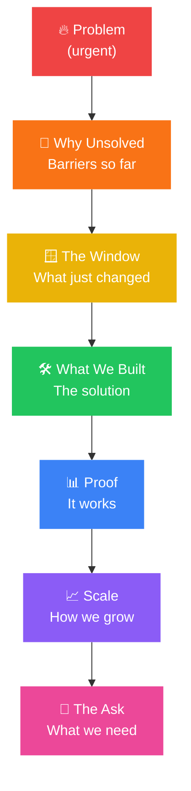

# How to Create a Pitch Deck Narrative That Raises Money

A pitch deck is not a slide checklist. It is a story with a funding decision at the end.

Most founders build decks in the wrong order, they start with what they have (a product, a team, a market size estimate) and arrange it into slides. What investors actually read is a narrative: one argument, building across ten to fifteen slides, that answers a single question, *why this, why now, why you?*

[In 93% of pitch decks reviewed by investors, the design works against the founder.](https://www.focusedchaos.co/p/i-reviewed-50-startup-pitch-decks) Not because it is ugly, but because there is no pulse. No narrative friction pulling the reader forward. Slides that cover problem, features, TAM, business model, and team in sequence without a connecting thread are not a story. They are a filing system.

The decks that raised money, Airbnb's $4.4 billion, Facebook's $500,000 from Peter Thiel, Buffer's half a million, all did the same thing: they made the investor feel the problem before they explained the solution.

---

### What a Narrative Pitch Deck Actually Is

The narrative structure follows a simple arc:

Every slide should advance that argument. If a slide does not move the story forward, it should not be in the deck.

[The most effective structure follows a "bowtie" pattern](https://www.linkedin.com/pulse/how-create-best-pitch-deck-your-investors-have-ever-seen-ang): start wide (the market context the investor already understands), narrow to the specific pain point and your product, then expand back out to the scale of the opportunity. The product is the pivot, everything before it builds the problem, everything after it builds the case for investment.

---

### The Slides, and What Each One Is Actually For

#### Slide 1: Title

Company name, one-line description, your contact information. The description should be one sentence a twelve-year-old can understand. [If you cannot describe the business simply, you do not understand the customer well enough.](https://www.focusedchaos.co/p/i-reviewed-50-startup-pitch-decks) Airbnb's original deck opened with: "Book rooms with locals, rather than hotels." That is the bar.

#### Slide 2: The Problem

[Open with pain, something visceral, something urgent.](https://www.focusedchaos.co/p/i-reviewed-50-startup-pitch-decks) Get the investor emotionally invested before you mention your product. Quantify the pain where possible. "Small Kenyan importers lose an average of 18% of working capital to FX spread and slow bank clearings" is a problem. "Importers face challenges with banking" is not.

Make the problem feel personal and time-sensitive. If it has existed for ten years and nobody solved it, you need to explain why, is it a regulatory shift, a technology unlock, a behavioural change? [75% of pitch decks reviewed by investors skip this context entirely.](https://www.focusedchaos.co/p/i-reviewed-50-startup-pitch-decks) The ones that include it raise faster.

#### Slide 3: The Solution

One sentence on what you do. Then one sentence on how it solves the specific pain from the previous slide. Not a feature list. Not a product roadmap. The value it creates, what gets better, faster, or cheaper for the customer.

[Do not jump to the solution and immediately explain product features.](https://www.focusedchaos.co/p/i-reviewed-50-startup-pitch-decks) Focus on the value, not the mechanism.

#### Slide 4: Market Opportunity

Define your Total Addressable Market (TAM), Serviceable Addressable Market (SAM), and the segment you are targeting first. Be specific. "The Kenyan SME lending market processes KES 800 billion annually, of which 65% is underserved by formal credit" is a market slide. "The African fintech market is large and growing" is not.

[Investors fund markets, not just products.](https://www.cirrusinsight.com/blog/startup-pitch-decks) A great product in a small or shrinking market is still a bad investment. Show the size, the growth rate, and why your entry point is the right wedge.

#### Slide 5: The Product

Show it, do not describe it. A screenshot, a demo flow, a visual of the user journey. One key insight per slide. [Keep each slide focused on one point with fewer design elements, consistent fonts, high contrast, aligned layouts.](https://www.focusedchaos.co/p/i-reviewed-50-startup-pitch-decks) Investors should understand how the product works in under thirty seconds of looking at this slide.

#### Slide 6: Business Model

How do you make money? Per transaction, subscription, take rate, licensing, be specific. Include the unit economics if you have them: revenue per customer, cost to acquire, lifetime value. [A clear financial model that shows annual revenue trajectory and the path to margin is more compelling than projections alone.](https://piktochart.com/blog/startup-pitch-decks-what-you-can-learn/)

#### Slide 7: Traction

[If you have proof, bring it forward, do not wait twelve slides.](https://www.focusedchaos.co/p/i-reviewed-50-startup-pitch-decks) Revenue, user numbers, growth rate, retention, signed Letters of Intent (LOIs) , pilot partnerships, paying customers. Even a failed experiment with clear learnings signals that you have touched the market. Investors want evidence you are iterating, not theorising.

Buffer's pitch deck closed $500,000 with 800 users and a $150,000 annual revenue run rate. [The numbers were modest but specific and credible, solid data beats inflated projections.](https://piktochart.com/blog/startup-pitch-decks-what-you-can-learn/)

#### Slide 8: Go-to-Market Strategy

[Include a dedicated GTM slide, right after the product or problem-solution section.](https://www.focusedchaos.co/p/i-reviewed-50-startup-pitch-decks) Show your starting wedge, what channel you are testing, what signals you are seeing, who your early adopter is and how you are reaching them. Be specific. "We are targeting SACCOs with over 5,000 members in Nairobi and Kisumu, using direct outreach through KUSCCO's network" is a GTM strategy. "We will use social media and word of mouth" is not.

#### Slide 9: Competitive Landscape

Name your competitors, direct and indirect. Show your differentiators clearly. [Explain why your solution is better, faster, or cheaper, and why the window is open now.](https://www.cirrusinsight.com/blog/startup-pitch-decks) A common mistake: listing only direct competitors and ignoring the "do nothing" option, which is usually the real competition for first-time customers.

LinkedIn's original deck used a "Web 1.0 vs Web 2.0" analogy, Alta Vista was Search 1.0, Google was Search 2.0, LinkedIn was Networking 2.0. [A clear analogy that places your product in a known context is more memorable than a feature comparison table.](https://piktochart.com/blog/startup-pitch-decks-what-you-can-learn/)

#### Slide 10: The Team

Investors back people before products, especially at early stage. [Include individual bios with specific, relevant experience, not generic titles.](https://piktochart.com/blog/startup-pitch-decks-what-you-can-learn/) "Jane led risk at Equity Bank for six years before founding this" is a team slide. "Jane is an experienced finance professional" is not.

[Social proof matters here, if team members have notable prior employers, investors, or advisors, name them.](https://piktochart.com/blog/startup-pitch-decks-what-you-can-learn/) Square's deck highlighted team experience at Twitter, Google, LinkedIn, and PayPal. That signal alone reduces investor risk perception.

#### Slide 11: Financials

Show your burn rate and your 18–24 month projection. Keep it simple, one clear chart. [For pre-seed and seed stage, multi-year financial projections are largely fiction and experienced investors know it.](https://www.linkedin.com/pulse/stop-over-optimizing-your-startup-pitch-deck-mark-birch--wuzne) What they want to see is that you understand your unit economics and have a credible path to the next milestone.

#### Slide 12: The Ask

How much are you raising? What will you use it for? What milestones will this capital get you to? Be specific on all three. "We are raising KES 15 million to fund 12 months of product development and acquire 500 paying customers, which positions us for a Series A at 10x current valuation" is an ask. "We are raising KES 15 million to grow the business" is not.

[Set a minimum round size, define the minimum total capital needed before you accept the first cheque](https://blog.promise.legal/startup-central/how-to-structure-a-friends-and-family-investment-agreement-a-practical-legal-checklist-for-startup-founders/) and make this clear in the ask slide if you are still in the process of closing.

---

### What the Best Decks Have in Common

Study the canonical examples and the pattern is consistent:

**Airbnb** ($4.4B raised): [Opened with a hook, described the business in the simplest possible terms. The intro is all about grabbing attention using as few words as possible.](https://piktochart.com/blog/startup-pitch-decks-what-you-can-learn/) The problem slide was visual and immediately relatable. The weakness: no "why now" slide. The original deck, slide by slide:

**Facebook** ($500K from Peter Thiel): [Built the case on solid engagement metrics, user numbers, session time, growth rate, not projected revenue.](https://piktochart.com/blog/startup-pitch-decks-what-you-can-learn/) At that stage, they had no revenue to show. They bet on the numbers they did have.

**Buffer** ($500K): [Shared the deck publicly, one of the first founders to do so, and raised half a million with only 800 users and $150K ARR.](https://piktochart.com/blog/startup-pitch-decks-what-you-can-learn/) The lesson: specific, modest, credible numbers beat inflated projections.

**YouTube** (Series A for Sequoia): [Ten slides, basic design, but a logically structured story with market statistics and product metrics.](https://www.failory.com/blog/pitch-deck-examples) Design is not the point. Clarity is.

---

### Common Mistakes Kenyan Founders Make

**Starting with the solution.** Investors who do not feel the problem first do not care about the solution. Build the pain before you introduce the product.

**TAM slides with no credibility.** "The African SME market is worth $1.5 trillion" means nothing without a sourced breakdown of the segment you are actually targeting, with a realistic path from your current position to that market.

**Generic team slides.** Listing job titles and university degrees without connecting the team's specific experience to why they are uniquely positioned to solve this problem.

**No "why now" argument.** [If the opportunity has been around for years, what unlocked it now?](https://www.focusedchaos.co/p/i-reviewed-50-startup-pitch-decks) Regulation, technology, behaviour change, infrastructure, specify the shift. Without it, the opportunity feels optional, not urgent.

**Projections without proof.** Five-year revenue models with no basis in current metrics. Replace with unit economics and a realistic 18-month milestone road.

**Too many slides.** [A pitch deck runs 10 to 20 slides.](https://www.cirrusinsight.com/blog/startup-pitch-decks) If you cannot make the case in that range, the narrative is not tight enough, not the slide count.

---

### Before You Send It

- Does every slide advance the core argument, or is it filler?
- Can someone who knows nothing about your industry understand slide 2 in thirty seconds?
- Have you named your actual competitors, including "doing nothing"?
- Does your ask specify amount, use of funds, and milestones clearly?
- Is the design clean, consistent, and legible, not just attractive?
- Have you included an appendix with Q&A for anticipated investor questions?

A pitch deck is the first version of your investor relationship. Build it like the argument matters, because it does.

---

### Sources and Further Reading

- [I Reviewed 50 Startup Pitch Decks, Focused Chaos](https://www.focusedchaos.co/p/i-reviewed-50-startup-pitch-decks)
- [30 Best Startup Pitch Deck Examples, Cirrus Insight](https://www.cirrusinsight.com/blog/startup-pitch-decks)
- [37 Legendary Pitch Decks, Piktochart](https://piktochart.com/blog/startup-pitch-decks-what-you-can-learn/)
- [35 Best Startup Pitch Decks, Failory](https://www.failory.com/blog/pitch-deck-examples)
- [Stop Over-Optimising Your Pitch Deck, LinkedIn](https://www.linkedin.com/pulse/stop-over-optimizing-your-startup-pitch-deck-mark-birch--wuzne)
- [How to Create the Best Pitch Deck, LinkedIn](https://www.linkedin.com/pulse/how-create-best-pitch-deck-your-investors-have-ever-seen-ang)
- Bengula Inc: [How to Structure Friends and Family Investments](/blog/how-to-structure-friends-and-family-investments), [How to Build an Accurate Startup Budget](/blog/how-to-build-an-accurate-startup-budget), [Best Backgrounds for Pitch Decks](/blog/best-backgrounds-for-pitch-decks), [How Long Does It Take to Make a Pitch Deck?](/blog/how-long-does-it-take-to-make-a-pitch-deck), [Banking-as-a-Service in Kenya](/blog/banking-as-a-service-kenya-baas-guide)
