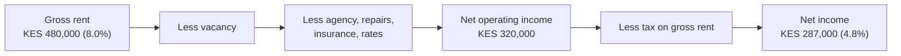

Owning a rental property is the default wealth ambition of the Kenyan middle class, and the reason is a single, seductive number: the rent. A flat that lets for KES 40,000 a month feels like a KES 480,000-a-year salary that arrives whether or not you go to work. On that arithmetic, a property paying 8% of its value in annual rent looks like an easy win over a savings account.

The 8% is real. It is also almost entirely fictional as a measure of what you actually earn, because it is the **gross** yield: rent before a single cost has been paid. Between that headline and the money that finally reaches your account sits a waterfall of leakage that most first-time landlords discover one deduction at a time, usually after they have already bought. Empty months when no tenant is paying. Repairs that are never once-off. An agent taking a slice of every shilling. Insurance, service charge, land rates. And, unusually, a tax charged not on your profit but on your gross rent, so you can owe it in a year you barely broke even.

This guide runs that waterfall in full on a realistic Kenyan rental, explains how residential rental income is actually taxed, and then does the comparison every prospective landlord avoids: it puts the honest net yield next to a Treasury bond and a REIT, and asks whether the property is earning its place. It is not a guide to buying land safely, that title-and-fraud work sits in [buying land from the diaspora without getting burned](/blog/diaspora-land-purchase-kenya). This is about the cash a building actually produces once you own it.

> **Key Insight:** Gross yield is what the property advertises. Net yield is what you earn. The gap between them, driven by vacancy, running costs, and a tax on gross rent, routinely halves the headline. A residential rental quoted at an 8% gross yield often nets under 5%, which is the number that must then justify itself against a bond ladder paying more with none of the work. Buy on the gross yield and you have bought a story; buy on the net yield and you have bought an asset.

```cards
- icon: TrendingDown
  title: Gross is not net
  desc: An 8% gross yield commonly becomes under 5% after voids, repairs, agency, insurance, rates, and tax. Underwrite the net, never the headline.
- icon: Receipt
  title: The tax is on gross rent
  desc: Residential rental tax is charged on gross rent received, not profit, so a high-cost year can still owe tax. Know the rate and the bands before you buy.
- icon: Scale
  title: Compare it to a bond
  desc: If a net rental yield is below what a tax-free infrastructure bond pays for no effort, the case for the property rests entirely on capital growth. Say so out loud.
  linkText: The bond alternative
  linkUrl: /blog/kb-bond-guide-2026
  type: emerald
```

---

### Part 1: Gross Yield vs Net Yield

Two numbers, and confusing them is the costliest mistake a landlord makes.

**Gross yield** is annual rent as a percentage of what the property cost you:

$$
\text{Gross yield} = \frac{\text{Annual rent}}{\text{Total property cost}} \times 100
$$

Note "total property cost", not just the price. The denominator must include the purchase price plus everything it took to own and let the place: legal fees, stamp duty, agent's purchase commission, and any furnishing or first repairs. Landlords who divide rent by the sticker price alone are flattering the yield before they even reach the costs.

**Net yield** is what you keep, after every operating cost and after tax, as a percentage of the same total cost:

$$
\text{Net yield} = \frac{\text{Annual rent} - \text{vacancy} - \text{operating costs} - \text{tax}}{\text{Total property cost}} \times 100
$$

The net yield is the only figure that means anything, because it is the only one you can actually spend or compare. Everything that follows is about honestly filling in the top line of that fraction.

---

### Part 2: The Gross-to-Net Waterfall

Take a concrete, ordinary case. You buy a residential unit and, all-in (price plus legal, stamp duty, agent, and first furnishing), it costs you **KES 6,000,000**. It lets for **KES 40,000 a month**, so gross rent is **KES 480,000 a year** and the gross yield is a healthy-looking **8.0%**.

Now subtract reality, one layer at a time.

| Line | Amount (KES) | Note |
|---|---|---|
| Annual gross rent (KES 40,000 × 12) | 480,000 | The headline |
| Less vacancy (1 month void) | (40,000) | One empty month between tenants is normal, not bad luck |
| **Rent actually collected** | **440,000** | |
| Less letting and management (8%) | (35,000) | Agent's cut of collected rent |
| Less repairs and maintenance | (30,000) | Recurring, not one-off; budget it every year |
| Less landlord insurance | (12,000) | Building and liability cover |
| Less service charge, land rates, ground rent | (30,000) | The landlord's share, often forgotten |
| Less re-letting and bad-debt provision | (13,000) | Advertising, a defaulting tenant, turnover costs |
| **Net operating income (pre-tax)** | **320,000** | |
| Less residential rental tax (7.5% of gross rent) | (33,000) | Charged on rent received, not on this profit |
| **Net income after tax** | **287,000** | |

Now put that back over the KES 6,000,000 you actually spent:

$$
\text{Net yield} = \frac{287{,}000}{6{,}000{,}000} \times 100 \approx 4.8\%
$$

The 8.0% you bought on has become **4.8%**. Nearly half the headline yield evaporated, and not one line above is pessimistic: a single empty month, ordinary running costs, and the standard tax. Assume two void months, a major repair, or a defaulting tenant, and the net drifts below 4%.



The lesson is not that rentals are bad. It is that the number to underwrite is the one at the right of that diagram, not the one at the left, and the two are a world apart.


---

### Part 3: The Tax Layer, and Why It Bites Harder Than Expected

Rental tax in Kenya has a feature that catches people out: for residential property it is charged on **gross rent, not on profit**.

As at 2026, residential rental income falls under the **Monthly Rental Income (MRI) tax** where the gross rent is between **KES 288,000 and KES 15,000,000 a year**. The rate is **7.5% of gross rent received**, and it is a **final tax** with **no deductions** for your agent, repairs, insurance, or interest. The rate was reduced from 10% with effect from 1 January 2024. Below KES 288,000 a year the rent sits outside the MRI band; above KES 15,000,000 it is taxed under the normal income tax rules instead.

Two consequences follow, and both matter to the waterfall above.

**You are taxed even in a bad year.** Because the charge is on gross rent and not on your net position, a year with a major repair or a long void can leave you paying tax on rent that barely covered your costs. The tax does not care that your profit was thin; it is a slice off the top line. That is exactly why the KES 33,000 in the table above is deducted after the operating costs but calculated on the rent, not the profit.

**For a high-cost year, you may be better off electing out.** A landlord within the band can, in defined circumstances, apply to the Commissioner to be taxed under the **normal income tax regime instead**, where actual expenses (including repairs, agency, insurance, and mortgage interest) are deductible. When your costs are genuinely high, being taxed at graduated rates on your real profit can beat 7.5% on the gross. This is a calculation worth doing with a tax agent, not a default to assume.

A few boundaries to keep straight:

- **Commercial rental income is different.** It is taxed under the normal income tax rules with deductions allowed, and where the landlord is VAT-registered, **VAT at 16%** generally applies on commercial rent. Residential rent is not subject to VAT.
- **Rent paid to a non-resident landlord** is subject to withholding tax, typically deducted by the tenant or appointed agent.
- **KRA can appoint rental income agents** to withhold and remit the tax at source, so the obligation is not always yours to pay manually.

Rates, bands, and reliefs here move with each Finance Act. Treat every figure in this section as *as at 2026* and confirm the current position on the [KRA](https://www.kra.go.ke/) portal or with a tax agent before you rely on it. The one structural point that rarely changes is the one to remember: residential rental tax is a charge on gross rent, and it belongs in your yield calculation from the first day, not as an afterthought at filing.

---

### Part 4: Vacancy, Deposits, and Tenant Risk

The waterfall assumed one void month. Vacancy is the single most underestimated line in rental economics, because it is invisible until it happens and then it is total: an empty unit earns nothing while every cost except the agent continues.

- **Voids are structural, not exceptional.** Tenants leave, and re-letting takes time to advertise, show, vet, and sign. One month a year is a reasonable base assumption; in a soft local market or an oversupplied estate it can be more. Model it, do not hope it away.
- **A deposit is security, not income.** A tenant's deposit (commonly one to two months' rent) is held against damage and unpaid rent; it is not yours to spend, and you may have to return it. Treating deposits as cash flow is how landlords find themselves unable to refund a departing tenant.
- **Tenant quality is a yield decision.** A slightly lower rent to a reliable, long-staying tenant usually beats a higher rent to one who pays late, damages the unit, or leaves early. The cost of turnover, re-letting, and arrears dwarfs a small rent premium. Screen properly; the reference check is cheaper than the eviction.
- **Arrears and eviction are slow.** Recovering possession from a non-paying tenant is a process, not a phone call. Build a bad-debt provision into your model, and keep the tenancy documented, because your protection lives in the paperwork.

None of this makes rentals unworkable. It makes them a **business with operating risk**, not a bond that pays itself. The landlords who do well treat vacancy, screening, and arrears as the core of the job, not as surprises.

---

### Part 5: Is It Better Than a Bond Ladder or a REIT?

Here is the comparison every prospective landlord should force themselves to make, and most skip because they suspect the answer.

Our worked rental nets **4.8%** in income. Set that beside the alternatives a Kenyan investor can access with none of the management:

| Option | Indicative net income yield | Effort | Liquidity |
|---|---|---|---|
| Residential rental (worked example) | ~4.8% after costs and tax | High (you run it) | Very low (months to sell) |
| [Infrastructure bond](/blog/kb-bond-guide-2026) (tax-free) | Low-to-mid teens, tax-free | None | Secondary market |
| [Money market fund](/blog/future-mmfs-kenya) | ~11% to 12% after 15% WHT | None | Days |
| [Income REIT](/blog/reits-in-kenya-guide) | Rental exposure, professionally managed | None | Traded, more liquid than a building |

On **income alone**, the rental loses, and it is not close. A tax-free infrastructure bond can pay roughly three times the net rental yield for no work, no voids, no repairs, and no defaulting tenants. That is an uncomfortable table, and it is the honest one.

So why does anyone buy rental property? Three reasons that the income comparison leaves out, each of which must be argued explicitly rather than assumed:

1. **Capital appreciation.** A building can rise in value while a bond returns only its face value. Property's real case is total return, income *plus* appreciation, and in the right location the appreciation can dominate. But appreciation is a forecast, not a coupon; underwrite it conservatively, because a rental bought for appreciation that does not come is just a low-yield bond with a leaking roof.
2. **Leverage.** You can borrow most of a property's price and control a large asset with a smaller stake, which magnifies appreciation (and losses). You cannot borrow to hold a bond in the same way. Part 6 shows why this cuts both ways.
3. **Inflation hedge and control.** Rent tends to rise with inflation, and you control the asset directly. A [REIT](/blog/reits-in-kenya-guide) gives you the rental exposure and the professional management without the plumbing, at the cost of that direct control; for many investors that is the better trade, and it is worth weighing honestly rather than dismissing as "not real property".

The disciplined conclusion is not "never buy rentals". It is: **if the net rental yield is below the bond, you are buying appreciation and leverage, so make sure you actually believe in them.** Run the property through the same neutral filter as any other asset, the eight tests in [how to evaluate any investment opportunity](/blog/evaluate-investment-opportunity-kenya), and let it earn its place rather than inherit it from sentiment.


---

### Part 6: The Leverage Trap, Worked

Leverage is property's superpower and its most common way to hurt people, and the mechanism is simple negative carry: paying more to hold the asset than it earns.

Suppose you buy the same KES 6,000,000 unit with a 25% deposit and a **KES 4,500,000 mortgage** at 15% over 20 years, roughly the shape described in the [mortgage decision framework](/blog/mortgage-decision-framework-kenya). The monthly repayment is about **KES 59,000**, or **KES 711,000 a year**.

Set that against the property's own output:

| Line | Annual (KES) |
|---|---|
| Net rental income after costs and tax | 287,000 |
| Mortgage repayments | (711,000) |
| **Cash shortfall you fund from other income** | **(424,000)** |

The property does not pay for itself. It costs you roughly **KES 35,000 every month out of your salary** to hold, on top of the deposit you already sank. You are not earning income from this asset; you are **subsidising it monthly** in a pure bet that its value will rise enough to reward the deposit and the shortfall combined.

Sometimes that bet pays, in a genuinely appreciating location bought at a genuinely good price. Often it does not, and the landlord discovers they have taken on a second, negative salary secured against a house they cannot easily sell. This is the exact scenario the [evaluate-investment tests](/blog/evaluate-investment-opportunity-kenya) are built to catch: an asset whose income does not service its financing, justified entirely by a capital gain the buyer has assumed rather than demonstrated.

The rule that follows is not "never borrow to buy property". It is: **if leverage turns the deal cash-flow negative, the entire return depends on appreciation, so the appreciation case must be strong, specific, and conservative, not a vague faith that Kenyan land always goes up.**

### Risk Factors

| Risk | How it arises | Consequence |
|---|---|---|
| Buying on gross yield | Dividing rent by price, ignoring costs and tax | Paying for a 4.8% asset believing it earns 8% |
| Vacancy underestimated | Assuming near-full occupancy | Every void month removes income while costs continue |
| Tax on gross, not profit | Residential MRI charged on gross rent | Owing tax in a thin or loss-making year |
| Wrong tax regime | Staying on MRI in a high-cost year | Paying 7.5% on gross when normal-regime deductions would cost less |
| Deposit treated as income | Spending a tenant's held deposit | Unable to refund on exit; a liability, not cash |
| Poor tenant selection | Chasing top rent over reliability | Arrears, damage, turnover, and slow eviction |
| Negative carry | Leverage where rent does not cover the mortgage | Subsidising the asset monthly; return hinges wholly on appreciation |
| Assumed appreciation | Buying on a capital gain not yet earned | A low-yield asset with no gain is a poor bond with maintenance |
| Illiquidity | Property sells in months, not days | Cannot exit quickly when cash is needed or the thesis breaks |

### Decision Framework: Before You Buy a Rental

**What is the net yield, not the gross?** Build the full waterfall, vacancy, agency, repairs, insurance, rates, and tax on gross rent, over total cost including purchase fees. Decide on that number.

**Does it beat a bond after tax and effort?** Put the net yield next to a tax-free infrastructure bond and a REIT. If it loses on income, you are buying appreciation and leverage, so state your case for both explicitly.

**Which tax regime is cheaper for me?** For a high-cost or leveraged property, check whether electing out of MRI into the normal regime (with deductions) beats 7.5% on gross. Confirm current rates and the election rules with KRA or a tax agent.

**If I borrow, is it cash-flow positive?** If the rent does not cover the mortgage and costs, know the monthly subsidy in detail, and know that your whole return now rests on a capital gain you have not yet earned.

**Can I run it, or should I own the exposure through a REIT?** Rentals are a business with voids, tenants, and repairs. If you do not want that job, a [REIT](/blog/reits-in-kenya-guide) gives the rental exposure without the management, and that is a legitimate answer, not a lesser one.

### Bengula View

Three observations from the desk.

First, **the gross yield is the most quoted and least useful number in Kenyan property**, and almost every disappointed landlord I meet bought on it. They divided the rent by the price, got a number that beat their savings account, and never built the waterfall. The single habit that separates landlords who compound wealth from landlords who own a stressful liability is that the first group underwrites the net yield, with an honest void assumption and the tax on gross rent, before they buy, and the second group learns those numbers afterward, deduction by deduction. The arithmetic is not hard. Doing it before, rather than after, is the whole discipline.

Second, **the bond comparison is uncomfortable on purpose, and it should be made anyway.** A net rental yield under 5% sitting next to a tax-free infrastructure bond in the teens is a genuinely awkward table, and the temptation is to look away and fall back on "but it's property". Resist that. The comparison does not prove property is wrong; it isolates what you are actually paying for, which is appreciation and leverage, not income. Once that is clear, you can make an honest decision: is the location's growth story strong enough, and the entry price low enough, to earn the yield you are giving up? Sometimes yes. But you should only reach that yes after the awkward table, not by avoiding it.

Third, **leverage is where the real damage happens, because it converts a modest disappointment into a monthly bleed.** An unleveraged rental at 4.8% is simply a lazy asset. A leveraged one that is cash-flow negative is an active drain on your salary, defended by a capital gain you have assumed rather than proven, and secured against something you cannot sell in a hurry. I am not against borrowing to buy property; I am against borrowing to buy property whose numbers only work if a forecast comes true. Make the deal stand up on conservative assumptions, or make it smaller, or make it a bond.

### Conclusion

A rental property is a business that sells occupancy, not a salary that arrives by itself. The rent on the wall is the gross yield, and the gross yield is a story. The number that matters is the net: rent minus the empty months, the agent, the repairs, the insurance, the rates, and a tax charged on your gross rent rather than your profit. On an ordinary Kenyan unit that waterfall turns a headline 8% into something closer to 5%, and that 5% must then justify itself against a tax-free bond paying far more for none of the work.

That does not make rentals a mistake. It makes them a total-return play, income plus appreciation, that only works when you underwrite the net yield honestly, choose good tenants, keep the tax regime efficient, and refuse any leverage that turns the deal into a monthly subsidy for a capital gain you have merely hoped for. Build the waterfall first. Compare it to the bond without flinching. And buy the asset only when the real number, not the number on the wall, earns its place in your portfolio.

### Related Reading

- [How to Evaluate Any Investment Opportunity](/blog/evaluate-investment-opportunity-kenya) for the neutral eight-test filter every property should pass.
- [The KB Bond Guide](/blog/kb-bond-guide-2026) for the tax-free fixed-income yield the rental must beat on income.
- [REITs in Kenya](/blog/reits-in-kenya-guide) for rental exposure without the management, voids, or repairs.
- [The Future of MMFs in Kenya](/blog/future-mmfs-kenya) for the liquid, low-effort income benchmark.
- [Buying Land From the Diaspora Without Getting Burned](/blog/diaspora-land-purchase-kenya) for the title and fraud due diligence this guide deliberately leaves out.
- [The Mortgage Decision Framework](/blog/mortgage-decision-framework-kenya) for sizing the debt behind a leveraged rental.
- [Chama LLPs for Land-Banking](/blog/chama-llp-land-banking-kenya) for pooling into property without buying a whole unit alone.

### References

- [Kenya Revenue Authority: Rental Income Tax](https://www.kra.go.ke/). Residential Monthly Rental Income (MRI) tax, the KES 288,000 to KES 15,000,000 annual band, the 7.5% rate on gross rent (reduced from 10% with effect from 1 January 2024), the election into the normal regime, and the treatment of commercial rent and VAT. Rates and bands are set by the Finance Act and change; confirm the current position with KRA before relying on it.
- [Central Bank of Kenya](https://www.centralbank.go.ke/). Treasury bond and bill yields, and the mortgage-rate environment, for the fixed-income and leverage comparisons.
- Bengula Inc: [The Complete Guide to Property Money in Kenya](/blog/property-money-kenya-complete-guide), the hub covering the five property vehicles, the transaction cost stack, funding routes, and the exit.
- [Capital Markets Authority](https://www.cma.or.ke/). Regulation of REITs, the listed route to rental-property exposure.
- [Kenya National Bureau of Statistics](https://www.knbs.or.ke/). Housing, rent, and inflation data useful when underwriting vacancy and appreciation assumptions.

*All prices, rents, costs, yields, and worked examples are illustrative and used to demonstrate the mechanics of rental cash flow. Actual rents, vacancy rates, running costs, tax, and property values vary widely by location, property, and year; build your own numbers before deciding.*

*General market education, not individualized investment, tax, or legal advice. Rental taxation depends on your circumstances and on current law, and property purchase involves title and conveyancing risk beyond the scope of this guide. Confirm tax treatment with KRA or a qualified tax agent, and use an advocate for the purchase itself, before acting.*
