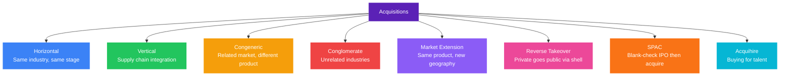

# What Are the Different Types of Acquisitions? A Kenya Business Guide

Acquisitions have reshaped Kenya's corporate landscape more visibly in the last three years than in the previous decade. [In 2025 alone, Nigeria's Access Bank completed a 100% acquisition of National Bank of Kenya, KCB Group acquired a majority stake in fintech startup Riverbank Solutions, and Java House changed hands from Actis to Alterra Capital and Phatisa Group.](https://www.tuko.co.ke/business-economy/613986-list-biggest-mergers-acquisitions-kenya-2025/) These are not isolated events. [The Competition Authority of Kenya's annual report for 2023/2024 recorded manufacturing as the most active sector at 34% of approved mergers, followed by distribution at 12% and financial services at 10%.](https://practiceguides.chambers.com/practice-guides/corporate-ma-2025/kenya)

An acquisition is a corporate transaction in which one company purchases a substantial portion or all of another company's shares or assets to gain control of its operations, profits, or strategic position. The acquired company may continue operating under its own name as a subsidiary, or it may be absorbed entirely into the acquirer.

Understanding the type of acquisition matters because each one reflects a different strategic intent, carries different regulatory risk, and creates different value for shareholders.

---

### Mergers vs Acquisitions: The Distinction That Matters

The two terms are used interchangeably. They are not the same.

In a **merger**, two companies of roughly equal size consolidate into a single new legal entity. Both companies' stocks are surrendered and new shares issued for the combined entity. The transaction is voluntary. No cash necessarily changes hands. Both management teams typically negotiate the terms.

In an **acquisition**, one company takes control of another by purchasing its shares or assets. The acquired company may cease to exist or operate as a subsidiary. The buyer sets the terms. The transaction may be friendly or hostile.

True mergers are rare. [Most deals labelled as mergers in Kenya and globally are acquisitions, the merger framing is applied to avoid the hostile connotation of a takeover.](https://practiceguides.chambers.com/practice-guides/corporate-ma-2025/kenya) The Exxon-Mobil deal, widely called a merger, was effectively Exxon acquiring Mobil.

**Amalgamation** is a third structure, distinct from both: two or more companies combine their assets and liabilities into a single new entity. The transferor companies are absorbed into a stronger transferee company. Common in professional services and financial institutions seeking to consolidate balance sheets.

---

### The Regulatory Framework in Kenya

All significant M&A activity in Kenya passes through two regulators:

**Competition Authority of Kenya (CAK).** Reviews mergers and acquisitions for competition impact and public interest before they are finalised. Any deal that meets prescribed turnover or asset thresholds must be notified and approved. CAK can approve unconditionally, approve with conditions, or block a deal outright.

**Central Bank of Kenya (CBK).** Has oversight over any acquisition involving a licensed bank or financial institution. The Access Bank acquisition of National Bank of Kenya required CBK approval before it could be finalised.

[The new minimum core capital requirement of KES 10 billion by 2029, up from KES 1 billion, is expected to trigger further M&A activity in the banking sector as smaller lenders that cannot meet the threshold seek merger partners rather than raise fresh capital.](https://cytonn.com/topicals/kenya-listed-banks-28)

---

### The Eight Types of Acquisitions

| Type | The Target | Strategic Logic | Example |
|---|---|---|---|
| Horizontal | A direct competitor | Market share, cost consolidation | Access Bank buys National Bank of Kenya |
| Vertical | A supplier or distributor | Control the value chain | KCB buys Riverbank Solutions |
| Congeneric | Related market, different product | Cross-sell to the same customers | KCB invests in PesaPal |
| Conglomerate | An unrelated business | Diversify revenue streams | Dangote buys a Kenyan tourism firm |
| Market extension | Same product, new geography | Buy your way into a territory | Absa acquires Barclays Kenya |
| Reverse takeover | A listed shell company | Go public without an IPO | NYSE via Archipelago (global) |
| SPAC | Blank-check listed vehicle | Raise capital first, acquire later | DWAC and Truth Social (global) |
| Acquihire | The team, not the product | Buy scarce talent | Rise acquires Hisa |

---

### 1. Horizontal Acquisition

A horizontal acquisition is the purchase of a direct competitor operating at the same stage of production in the same market.

The strategic logic is consolidation: combining two competing entities increases market share, eliminates duplicate costs, and strengthens pricing power. The acquirer expands capacity while the acquired company continues operating in the same business.

**Kenya example:** [Access Bank's acquisition of National Bank of Kenya in April 2025 is a horizontal acquisition, both are licensed commercial banks competing in the same Kenyan retail and SME banking market.](https://www.tuko.co.ke/business-economy/613986-list-biggest-mergers-acquisitions-kenya-2025/) Access Bank had already acquired Transnational Bank in 2019, making this its second Kenyan banking acquisition.

**Regulatory risk:** Horizontal acquisitions attract the closest CAK scrutiny because they reduce competition most directly. A deal that gives the acquirer excessive market share will face conditions or be blocked.

---

### 2. Vertical Acquisition

A vertical acquisition targets a company at a different stage of the same value chain. Two directions: backward integration (buying a supplier) or forward integration (buying a distributor or customer).

Backward integration gives the acquirer control over its inputs, reducing supply risk and cost. Forward integration gives it direct access to the end customer, improving margins by cutting out the intermediary.

**Kenya example:** [KCB Group's acquisition of a 75% majority stake in Riverbank Solutions for $15.4 million is a vertical acquisition with a forward integration logic.](https://financeinafrica.com/news/kenyas-largest-bank-buy-startup/) KCB had been a Riverbank customer since 2013, using its platforms for agency banking. By acquiring the fintech, KCB brings the technology infrastructure in-house, reduces its dependence on an external vendor, and gains direct control over the digital tools it uses to serve SME customers.

---

### 3. Congeneric Acquisition

A congeneric acquisition targets a company in a related industry or adjacent market, serving similar customers through different products or distribution channels. The two companies do not compete directly but share enough overlap that combining them creates a broader offering for the same customer base.

The aim is to become a one-stop shop: the combined entity can cross-sell, share distribution infrastructure, and charge a premium for the integrated experience.

**Kenya example:** [KCB Group's investment in PesaPal is congeneric.](https://www.linkedin.com/posts/alihkassim_kcbgroup-pesapal-fintech-activity-7390964098789888000-q8TP) PesaPal is a payment gateway serving merchants. KCB is a bank serving the same merchants with credit, accounts, and trade finance. The overlap is in the merchant customer base. The products are different. Combining them allows KCB to offer integrated payment and banking services to merchants who previously used two separate providers.

Global parallel: Facebook's acquisitions of WhatsApp (messaging) and Instagram (photo sharing) are textbook congeneric deals. The platforms served the same social media user but through different products and formats.

---

### 4. Conglomerate Acquisition

A conglomerate acquisition targets a company in a completely unrelated industry, with a different product line, customer base, business model, or geography. The strategic logic is diversification: spreading risk across uncorrelated revenue streams so that a downturn in one sector does not cripple the whole group.

These deals are harder to justify operationally since there are no direct synergies between the two businesses. The value comes from financial diversification and capital allocation, not product or market integration.

**Kenya example:** [Aliko Dangote's acquisition of a Kenyan tourism firm in 2025](https://www.tuko.co.ke/business-economy/613986-list-biggest-mergers-acquisitions-kenya-2025/) is a conglomerate acquisition. Dangote's core businesses are cement, petrochemicals, and agriculture. Tourism shares none of those characteristics. The acquisition is a geographic and sectoral diversification into a new market.

Global parallel: Amazon's acquisition of Whole Foods. An online retailer buying a brick-and-mortar grocery chain has no operational overlap. The value case is financial diversification and data.

---

### 5. Market Extension Acquisition

A market extension acquisition resembles a horizontal deal but targets a company in a different geographic market, not the same one. The acquirer and the target produce similar or identical products but serve different territories.

The strategic logic is geographic expansion without building from scratch: instead of entering a new market organically, the acquirer buys an established player with existing customers, distribution, and regulatory approvals.

**Kenya example:** Absa Group's acquisition of Barclays Africa Group's Kenya operations is the most consequential market extension acquisition in Kenya's banking history. Barclays Bank of Kenya had operated in the country since 1916. When Barclays PLC divested its Africa operations in 2017, Absa Group acquired the business and completed a full rebrand to Absa Bank Kenya in 2020. Rather than entering the Kenyan market from scratch, Absa inherited an established network, an existing customer base, and a tier-1 regulatory position, all through acquisition. The deal gave Absa immediate scale in one of East Africa's most competitive banking markets.

[The acquisition of Java House by Alterra Capital and Phatisa Group](https://www.tuko.co.ke/business-economy/613986-list-biggest-mergers-acquisitions-kenya-2025/) follows the same logic. Alterra, based in Mauritius, gains access to an established brand across Kenya, Uganda, and Rwanda rather than entering each market independently.

Classic global example: RBC Centura's acquisition of Eagle Bancshares (Atlanta, Georgia, 90,000 accounts, $1.1 billion in assets), a Canadian bank buying a US bank to extend its geographic reach into the American market without building a new branch network.

---

### 6. Reverse Takeover

A reverse takeover (RTO) is a mechanism for a private company to become publicly listed without going through the full IPO process. The private company acquires a shell public company, typically one with no active operations, and in doing so inherits its listing on the stock exchange.

The process: the private company's shareholders acquire majority shares in the shell company. The shell company then adopts the private company's operations, management, and branding. The result is a publicly listed entity without the cost, time, and regulatory burden of a conventional IPO.

RTOs are common in markets where the IPO pipeline is slow or expensive. In Kenya, the Nairobi Securities Exchange has relatively few active listings. For a Kenyan private company looking to access public capital markets, an RTO may be faster than a full NSE listing process.

**Global examples:** The New York Stock Exchange itself went public via an RTO, acquiring Archipelago Holdings to gain a listing. Warren Buffett took Berkshire Hathaway public through the same mechanism.

---

### 7. SPAC (Special Purpose Acquisition Company)

A SPAC is a shell company with no commercial operations, created solely to raise capital through an IPO and then use that capital to acquire a private company within a set timeframe, typically two years. The result is the same as a reverse takeover: a private company becomes publicly listed without going through a conventional IPO. The difference is that a SPAC raises the money first, then hunts for the target, rather than the private company finding an existing shell.

The process runs as follows. A SPAC sponsor raises capital from public investors through an IPO, listing on a stock exchange as a blank-check company. The proceeds sit in a trust account. The sponsor then identifies a private acquisition target and negotiates a merger agreement. Once the merger closes, the private company inherits the SPAC's listing and the capital in the trust. Shareholders who disapprove of the chosen target can redeem their shares before the merger closes.

**Global example: Truth Social.** [Digital World Acquisition Corp. (DWAC) was founded in 2021 as a SPAC listed on the Nasdaq, created for the purpose of acquiring a private company and making it public without going through the full IPO process.](https://en.wikipedia.org/wiki/Digital_World_Acquisition_Corp.) [In October 2021, DWAC announced a definitive merger agreement with Trump Media and Technology Group (TMTG), the owner of Truth Social.](https://en.wikipedia.org/wiki/Digital_World_Acquisition_Corp.) The deal completed in March 2024, taking TMTG public on the Nasdaq under the ticker DJT.

The deal became one of the most closely followed SPAC mergers globally, and not for clean reasons. [The SEC found that DWAC had held undisclosed talks with Trump's team before its IPO, contrary to its public filings, and settled for an $18 million penalty.](https://www.cnn.com/2023/07/20/business/digital-world-acquisition-corporation-sec-settlement/) The case illustrated the central disclosure risk of SPACs: investors in a blank-check company are trusting the sponsor's integrity entirely, since there is no operating business to evaluate at the point of investment.

**The SPAC advantage over a conventional IPO.** Speed and cost. A traditional IPO takes 12-18 months of regulatory filing, roadshows, and underwriter negotiations. A SPAC merger can close in 3-6 months. For a private company with strong growth but limited appetite for the full IPO process, a SPAC offers a faster, cheaper route to public capital markets.

**The SPAC risk.** Dilution, misaligned incentives, and disclosure failures. SPAC sponsors typically receive 20% of the combined entity's shares as a "promote," meaning they profit even when the deal destroys value for ordinary shareholders. Post-merger performance of SPAC-listed companies has historically underperformed conventional IPOs.

**Kenya context.** The Capital Markets Authority (CMA) has been exploring SPAC frameworks as a mechanism to attract more listings to the Nairobi Securities Exchange, which has a relatively thin active listing base. A SPAC structure would allow Kenyan institutional investors to pool capital into a listed vehicle, identify a high-growth private company, and bring it to the NSE without the cost and timeline of a full IPO. No SPAC has been listed on the NSE yet, but the regulatory groundwork is being laid.

---

### 8. Acquihire

An acquihire is an acquisition where the primary asset being purchased is the target company's people, not its products, technology, or market share. The acquirer wants specific talent, expertise, or founder credentials. The acquired company's product or revenue is secondary or irrelevant.

Acquihires are common in technology and fintech, where skilled engineering or product teams are scarce and expensive to recruit individually. Buying a small startup with five exceptional engineers is often cheaper and faster than hiring each one through a competitive recruitment process.

**Kenya context:** [Fintech startup Hisa was acquired by Nigerian fintech Rise in 2024.](https://kenyanwallstreet.com/the-mergers-acquisitions-and-deals-that-shaped-2024/) Hisa had built a retail investing product for Kenyan users. Rise, which was building cross-border investment tools, acquired Hisa primarily for its team's knowledge of the Kenyan market and its user onboarding infrastructure.

---

### Why Most Acquisitions Fail

[It is estimated that 70-90% of all corporate acquisitions and mergers fail to create the value projected at the time of the deal.](https://www.forbes.com/sites/forbescoachescouncil/2019/06/24/most-mergers-fail-because-people-arent-boxes/) The reasons are consistent: cultural misalignment between the two organisations, overpayment driven by competitive bidding, poor integration planning, and overestimation of synergies.

The acquisitions that succeed have a few things in common: the acquirer is a serial buyer with a repeatable integration process, the strategic rationale is specific (not generic "growth"), and integration planning begins before the deal closes rather than after.

For Kenyan businesses evaluating an acquisition target, three questions matter before anything else: What specifically does this acquisition give us that we cannot build ourselves? How long will integration take and what will it cost? And at what price does this deal stop making sense?

---

### The M&A Landscape Kenya Is Heading Into

[The KES 10 billion minimum core capital requirement for banks by 2029 will be the single biggest structural driver of M&A in Kenya's financial sector over the next three years.](https://cytonn.com/topicals/kenya-listed-banks-28) Tier-3 banks that cannot raise capital fast enough will become acquisition targets for larger domestic banks or regional acquirers like Access Bank, which has demonstrated a clear appetite for Kenyan banking assets.

[Fintech acquisitions will accelerate as tier-1 banks build digital infrastructure through acquisition rather than development.](https://financeinafrica.com/news/kenyas-largest-bank-buy-startup/) KCB's Riverbank deal is the template. Agriculture and manufacturing will remain active sectors given their historical share of CAK approvals.

For founders building in these spaces, understanding which type of acquirer is most likely to be interested in your business, and which type of acquisition your company represents to them, is the starting point for building a business that can attract a strategic exit.

---

### Sources and Further Reading

- [Biggest Mergers and Acquisitions in Kenya 2025, Tuko](https://www.tuko.co.ke/business-economy/613986-list-biggest-mergers-acquisitions-kenya-2025/)
- [Corporate M&A 2025, Kenya, Chambers and Partners](https://practiceguides.chambers.com/practice-guides/corporate-ma-2025/kenya)
- [Mergers Acquisitions and Deals That Shaped 2024, Kenyan Wall Street](https://kenyanwallstreet.com/the-mergers-acquisitions-and-deals-that-shaped-2024)
- [KCB Acquires Riverbank Solutions, Finance in Africa](https://financeinafrica.com/news/kenyas-largest-bank-buy-startup/)
- [Kenya Listed Banks FY 2025 Report, Cytonn](https://cytonn.com/topicals/kenya-listed-banks-28)
- [Top 2024 Mergers Approved by CAK, Tuko](https://www.tuko.co.ke/business-economy/573503-top-2024-mergers-company-sales-approved-by-competition-authority-kenya/)
- [Digital World Acquisition Corp, Wikipedia](https://en.wikipedia.org/wiki/Digital_World_Acquisition_Corp.)
- [SPAC Seeking to Merge with Truth Social Settles with SEC, CNN Business](https://www.cnn.com/2023/07/20/business/digital-world-acquisition-corporation-sec-settlement/)
- [Truth Social Goes Public After DWAC Approves Merger, Forbes](https://www.forbes.com/sites/caileygleeson/2024/03/22/trumps-truth-social-will-go-public-after-dwac-approves-merger/)
- Bengula Inc: [Ultimate Guide to Banking in Kenya](/blog/ultimate-guide-to-banking-in-kenya), [Banking-as-a-Service in Kenya](/blog/banking-as-a-service-kenya-baas-guide), [How to Structure Friends and Family Investments](/blog/how-to-structure-friends-and-family-investments)
