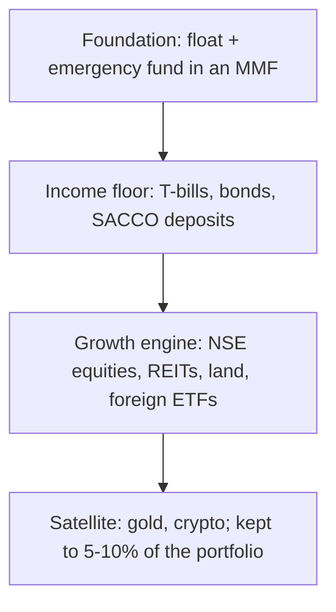

Kenya has quietly become one of the most interesting places in the world to be a retail investor. In 2025 the Nairobi Securities Exchange was among the best-performing stock markets globally, with the NSE 20 index up 56.13% and the NSE 25 up 49.78%. Money market funds crossed from niche product to household word. The minimum NSE trade dropped from 100 shares to a single share. DhowCSD put Treasury bills and bonds a phone registration away from anyone with an ID and KES 50,000. Platforms now route Kenyan shillings into global ETFs from KES 5,000.

And yet most Kenyan money still sits in three places: a current account earning nothing, a plot of land earning nothing until exit, and whatever a persuasive salesperson last recommended.

This guide is the map. It covers every meaningful asset class available to a Kenyan investor in 2026: what each one is, what it honestly returns, how to buy it, what it costs, who it suits, and how to combine them. Where Bengula has published a deep dive on a topic, this guide links it; where it has not yet, the section here is the reference.

> **Key Insight:** There is no best investment in Kenya. There is only the best investment for a specific job: this money, this goal, this horizon, this tolerance for a bad year. Investors who ask "what should I buy?" get sold products. Investors who ask "what is this money for, and when do I need it back?" build portfolios. Every section of this guide ends at that question.

---

### What This Guide Covers

| Part | Ground Covered |
|---|---|
| Foundations | What must be true before you invest a shilling |
| Risk profiling | The three investor profiles and how to find yours |
| Cash and near-cash | Money market funds, Treasury bills |
| Fixed income | Treasury bonds, infrastructure bonds, green bonds |
| Equities | NSE shares: the 2025 rally, how to buy, what to expect |
| Property-linked | REITs, land, and development real estate |
| Member-owned | SACCO shares and deposits, chamas |
| Alternatives | Gold, cryptocurrency, foreign ETFs and offshore investing |
| Retirement | The pension wrapper: schemes, tax relief, and access rules |
| Getting practical | Account walkthroughs, compounding maths, staged journeys, the scam filter, FAQs |
| Putting it together | The master comparison, tax, model portfolios, mistakes, decision framework |

All rates and index figures in this guide are dated in the text. The CBK reference figures used throughout are the indicative rates of 2 July 2026: Central Bank Rate 8.75%, 91-day T-bill 8.835%, average savings rate 3.23%, average fixed deposit 6.8%, inflation 6.41%, USD/KES 129.30. Rates move; re-check them before acting.

---

### Before You Invest: The Foundations

Investing sits on top of a financial base, never instead of one. Four things come first:

**1. The float and the emergency fund.** One month of spending in your transactional account, and three to six months of expenses in a money market fund. Without this buffer, your investments become your emergency fund, and emergencies have perfect timing for forcing you to sell your best asset at its worst price. The full logic is in [Bank Account vs SACCO vs MMF vs Insurance](/blog/bank-vs-sacco-vs-mmf-savings).

**2. Expensive debt cleared.** A digital loan at an annualised cost above 50%, or a credit card balance rolling at 3-4% a month, outruns every legal investment in this guide. Paying it off is a guaranteed, tax-free return at that rate. See [the real cost of mobile loans](/blog/mobile-loan-vs-bank-loan-apr-breakdown) before convincing yourself an investment can beat your debt.

**3. Protection priced separately.** If people depend on your income, term life cover comes before growth assets, bought as insurance rather than bundled into a savings product. The arithmetic of why is worked through in the endowment section of [the savings comparison guide](/blog/bank-vs-sacco-vs-mmf-savings).

**4. The paperwork.** A KRA PIN, an ID, and, for most of what follows, a CDS account (for NSE securities, opened through a broker or custodian bank) or a DhowCSD registration (for government securities, opened directly with CBK online). Both are free. The evidence discipline that serves borrowers, clean records that reconcile, serves investors identically.

---

### Risk Profiling: Know Which Investor You Are

Every asset class in this guide will be mapped against three profiles. Be honest about which one describes the money in question, and note that one person usually holds different profiles for different pots.

| | Capital Preserver | Income Builder | Growth Seeker |
|---|---|---|---|
| **The priority** | Never lose the principal | Reliable payouts that beat inflation | Maximum long-term growth |
| **Horizon** | Under 2 years | 2-7 years | 7+ years |
| **Tolerable bad year** | Zero loss | Single-digit paper loss | 20-30% paper loss without selling |
| **Natural home** | MMFs, T-bills, fixed deposits | Bonds, dividend shares, I-REITs, SACCO deposits | Equities, D-REITs, land, foreign ETFs |
| **Typical mistakes** | Holding cash so safe it loses to inflation | Chasing yield into hidden risk | Confusing volatility tolerance claimed with volatility tolerance lived |

Two rules apply across all three profiles:

**The horizon rule.** Money needed within two years never belongs in an asset that can fall 20% in a quarter, however attractive the recent returns. The 2025 NSE rally rewarded investors who could stay; it punished anyone forced to sell during the drawdowns along the way.

**The sleep rule.** The right portfolio is the most aggressive one that never makes you check prices anxiously. An investor who panic-sells a good asset in a bad month converts a temporary loss into a permanent one. Your true risk tolerance is revealed in the bad month, not the questionnaire.

---

### The Two Registrations That Unlock Everything

Almost every asset in this guide is reached through one of two free accounts. Open both in the same week and the entire Kenyan capital market is available to you.

**DhowCSD (for government securities), step by step:**

1. Download the DhowCSD app or visit the CBK portal and select individual investor registration.
2. Provide your ID or passport, KRA PIN, a passport photo, bank account details, and your signature.
3. Receive your CSD account number (processing typically takes a few working days).
4. Fund the account by bank transfer when you want to invest, then bid in the weekly T-bill auction or the current bond offer. Choose the **non-competitive** bid unless you have a view on rates; it accepts the auction's weighted average and always fills.
5. On maturity or coupon dates, money lands back in your registered bank account. Set a calendar reminder to reinvest; idle maturities are the silent leak.

**CDS account plus broker (for NSE shares, ETFs, and listed REITs), step by step:**

1. Choose a CMA-licensed stockbroker; the app-first options (Hisa by AIB-AXYS, DigiTrader by Faida, and the bank-owned brokers) onboard fully online.
2. Submit ID, KRA PIN, and a photo; the broker opens your CDS account as your Central Depository Agent.
3. Fund the trading wallet via M-Pesa or bank transfer.
4. Buy from as little as one share. Orders execute during NSE trading hours; settlement is T+2.
5. Dividends pay into your registered account or wallet automatically once your details are on the register.

Neither account costs anything to open or hold. The only ongoing costs are transaction-linked: brokerage commission on NSE trades, nothing at all on DhowCSD purchases held to maturity.

---

### Asset Class 1: Money Market Funds

**What it is.** A CMA-regulated collective investment scheme pooling savers' money into T-bills, bank deposits, and commercial paper. Daily or near-daily liquidity, low minimums (many funds start at KES 1,000), yield accrues daily.

**What it returns.** MMF gross yields track short-term government paper. As at mid-2026 the industry average effective yield was around 9.1%, with the top published fund near 13.2% gross; the 91-day T-bill anchor stood at 8.835% (2 July 2026). All MMF distributions carry 15% withholding tax, so compare net: a 9% gross yield is 7.65% in your pocket.

**How to buy.** Directly with the fund manager (online onboarding with ID, KRA PIN, and M-Pesa is now standard) or through aggregator apps. Confirm the fund appears on the CMA's licensed collective investment scheme list before sending money.

**The risks.** The yield is not guaranteed and the fund is not insured. A fund advertising far above the T-bill rate is buying that headline with credit risk, usually commercial paper concentration. Read the fact sheet's asset allocation, not just the yield.

**Who it suits.** Everyone, for the right pot: it is the emergency fund's natural home and the parking bay for money awaiting a better assignment. It is not a long-term wealth engine; at roughly 2-3% above inflation net, it preserves and slightly grows purchasing power. Deep dive: [The Future of MMFs in Kenya](/blog/future-mmfs-kenya).

**The wider unit trust family.** The MMF is one member of the CMA-regulated collective scheme family. The same managers offer **fixed income funds** (longer paper, slightly higher yield and volatility than MMFs), **balanced funds** (a bonds-plus-equities blend), **equity funds** (hands-off NSE exposure at MMF-sized minimums), and increasingly **dollar funds** (USD money market exposure without opening a foreign account). The evaluation method never changes: read the fact sheet for holdings, check the total expense ratio, compare net-of-fee performance to the obvious benchmark (the T-bill for fixed income, the NSE 25 for equity funds), and confirm the scheme on the CMA register. For an investor who wants the equity section of this guide without picking counters, a low-cost equity or balanced fund is a legitimate one-line answer.

---

### Asset Class 2: Treasury Bills

**What it is.** Short-term government debt sold at a discount and redeemed at face value: 91-day, 182-day, and 364-day tenors, auctioned weekly by CBK. You lend the government money; the difference between what you pay and the KES 100 face value is your return.

**What it returns.** The 91-day bill yielded 8.835% on 2 July 2026, with the longer tenors typically slightly higher. T-bill returns carry 15% withholding tax. Because you buy direct with no management fee, a T-bill generally beats an MMF holding the same paper, at the price of locking the money to maturity.

**How to buy.** Through DhowCSD, CBK's online portal and app: register with your ID and KRA PIN, fund your virtual account, and bid in the weekly auction (minimum KES 50,000 for bills, in multiples of KES 50,000). Non-competitive bids accept the weighted average rate and are the sensible default for retail investors. The full mechanics are in [Sovereign Debt Explained](/blog/sovereign-debt-explained).

**The ladder.** The professional retail move is a rollover ladder: split the pot across 91, 182, and 364-day maturities so a tranche matures every quarter, then reinvest each maturity at the current rate. You get near-quarterly liquidity, average out rate movements, and stay fully invested. The full construction, with the current auction numbers and the portal mechanics, is in [Advanced DhowCSD Strategies: Building a T-Bill Rollover Ladder](/blog/advanced-dhowcsd-t-bill-ladder).

**Who it suits.** Capital preservers and the near-cash layer of every portfolio. Sovereign risk in shillings is the lowest credit risk available to a Kenyan investor; the real risks are reinvestment (rates falling when your bill matures, which is the current direction of travel) and inflation quietly outpacing the net yield.

---

### Asset Class 3: Treasury Bonds, Infrastructure Bonds, and Green Bonds

**What it is.** Longer-term government debt, 2 to 30 years, paying a fixed coupon every six months and principal at maturity. The retail-relevant variants:

- **Ordinary Treasury bonds**: coupons taxed at 15% withholding (10% for tenors above 10 years is the historic structure; confirm per prospectus).
- **Infrastructure bonds (IFBs)**: coupons **tax-free**, which is why they are perennially oversubscribed and often trade at a premium. For a taxpaying investor, a tax-free IFB coupon beats an equal taxable coupon by construction.
- **M-Akiba**: the mobile-first retail bond, historically from KES 3,000 via phone, proof that government paper can be a mass-market product.
- **Green and sustainability-linked bonds**: the newest wing, covered in [Green Financing in Kenya](/blog/green-financing-kenya-guide); NSE-listed green bonds carry their own tax exemptions.

**What it returns.** Whatever coupon the auction sets, locked for the life of the bond. Recent years' issues carried double-digit coupons; in the current falling-rate environment new issues price lower, which is precisely the argument for locking long tenors before cuts continue. Check the current prospectus on CBK's site for the live coupon; never buy from a screenshot.

**How to buy.** Same DhowCSD registration as bills (minimum KES 50,000). Bonds can also be sold before maturity on the NSE's secondary market through a broker, where the price moves inversely with rates: if rates fall after you buy, your bond gains value; if they rise, it loses. Hold to maturity and none of that matters; you collect the coupon and the face value.

**Who it suits.** Income builders above all. A bond ladder is the closest thing Kenya offers to a private pension you control: predictable semi-annual cash flows, sovereign credit, and tax-free options via IFBs. The full construction, including laddering coupons into monthly income, is in the [Kenyan Treasury Bonds Guide](/blog/kb-bond-guide-2026) and the [Monthly Income Engine](/blog/monthly-income-engine-kenya). Diaspora investors have a dedicated path covered in [CBK Diaspora Bond Access](/blog/cbk-diaspora-bond-access).

---

### What Compounding Actually Does (Run Your Own Numbers)

Before the growth assets, the arithmetic that makes the whole guide matter. The future value of a steady monthly contribution is:

$$ \text{FV} = P \times \frac{(1+i)^n - 1}{i} $$

where P is the monthly amount, i the monthly rate, and n the number of months. Here is KES 10,000 a month at different net annual returns:

| Net Annual Return | 5 Years | 10 Years | 20 Years |
|---|---|---|---|
| Contributions alone | KES 600,000 | KES 1,200,000 | KES 2,400,000 |
| 6% (savings-account territory) | KES 698,000 | KES 1,639,000 | KES 4,620,000 |
| 8% (T-bill/MMF territory) | KES 735,000 | KES 1,829,000 | KES 5,890,000 |
| 10% (bond-ladder territory) | KES 774,000 | KES 2,048,000 | KES 7,594,000 |
| 12% (equity-era territory) | KES 817,000 | KES 2,300,000 | KES 9,893,000 |

Read the table vertically and horizontally. Vertically: at five years, the difference between 6% and 12% is about KES 119,000, real but modest, which is why asset choice matters less than starting for short horizons. Horizontally: at twenty years, the same rate difference is over KES 5.2 million on identical contributions. Time multiplies rate differences; rate differences barely matter without time. This is why the guide keeps insisting that long-horizon money must not idle in short-horizon vehicles.

---

### Asset Class 4: NSE Equities

**What it is.** Part-ownership of listed companies: banks, Safaricom, breweries, insurers, manufacturers, and around sixty other counters on the Nairobi Securities Exchange. Returns come two ways: dividends (cash paid from profits, typically twice a year for the payers) and capital gains (the share price rising).

**What it returned recently, and the honest context.** 2025 was extraordinary: the NSE 20 rose 56.13%, the NSE 25 gained 49.78%, and total market capitalisation expanded past KES 2.5 trillion, driven by falling interest rates, strong bank and telecom earnings, foreign inflows, and a stable shilling. The honest context is that this rally followed a brutal 2020-2023 stretch in which the same market fell for years and foreign investors fled. Equities are the asset class where the average is made of extremes: plan on long-run returns well below 2025's, and expect years that are negative. That is the price of the asset class, not a defect in it.

**How to buy.** Three steps, all cheaper and easier than they were five years ago:

1. **Open a CDS account** through a licensed stockbroker or custodian bank (free, needs ID, KRA PIN, photo).
2. **Fund a brokerage account** with any of the 20+ CMA-licensed brokers; app-based options like Hisa (AIB-AXYS), DigiTrader (Faida), and bank-broker platforms have removed the paperwork era.
3. **Trade.** Since August 2025 the minimum trade is **a single share**, down from the historic 100-share board lot. A retail investor can now buy one Safaricom share with pocket change; the barrier is gone.

Brokerage commissions run around 1.5-1.85% per trade on small tickets (negotiable above KES 100,000), which is a real drag on frequent trading and a rounding error on long holding.

**The tax angle.** Two genuine advantages: dividends carry only 5% withholding for residents, and **capital gains on NSE-listed securities are exempt from capital gains tax**. A patient equity investor in Kenya keeps more of the return than a landlord or an unlisted-business seller.

**The risks.** Volatility (see 2020-2023), concentration (Safaricom and the big banks dominate the index, so "the market" is really a dozen companies), liquidity in the small counters (wide spreads, slow exits), and governance failures in individual names. The mitigations are boring and effective: diversify across counters and sectors, buy on a schedule rather than on excitement, and treat any single stock above 10% of your portfolio as a decision requiring a written reason.

**Reading a counter before you buy.** Four numbers turn a ticker into a decision, all published in the dailies and the broker apps:

- **Dividend yield** (dividend per share ÷ price): the income you are paid to wait. Compare it to the T-bill rate; a mature company yielding far below it needs a growth story to justify itself.
- **Price-to-earnings ratio** (price ÷ earnings per share): what you pay for each shilling of profit. Useful mainly against the same company's history and its sector peers, not as an absolute.
- **Price-to-book** (price ÷ net assets per share): the classic bank-stock lens; sustained discounts to book ask "why?", and sometimes the answer is opportunity while sometimes it is rot.
- **Free float and turnover**: how much of the company actually trades. A thin counter can be impossible to exit at the printed price; check that days pass with real volume before committing meaningful money.

The sector map helps too: the NSE is roughly banks (the deepest, most liquid segment), Safaricom (a quarter of the market by itself), consumer and manufacturing (EABL, BAT, the millers), insurance, energy and utilities (KenGen, Kenya Power), and a long agricultural tail (the tea and sisal counters). An index-like Kenyan portfolio is, in practice, banks plus Safaricom plus a diversifier or two; know that before believing you are diversified.

**Who it suits.** Growth seekers with genuine 7+ year horizons, and income builders via the dividend aristocrats (the banks have paid through every cycle). The NSE's planned M-Pesa integration, covered in [How Embedded Finance Is Reimagining the Point of Payment](/blog/embedded-finance-kenya-guide), aims to grow retail participation to nine million investors; being early to that normalisation is the quiet opportunity. Full beginner walkthrough: [How to Buy Shares on the NSE](/blog/how-to-buy-shares-nse-kenya).

---

### Asset Class 5: REITs

**What it is.** Real Estate Investment Trusts: CMA-regulated vehicles that hold property portfolios and pass income to unit-holders. Two species matter: **I-REITs** (income: own completed, rent-generating property and distribute the rent) and **D-REITs** (development: fund construction and pay out on sale or completion).

**The Kenyan reality check.** The market is young, small (approaching KES 25 billion), and instructive:

| REIT | Type | Where It Trades | Yield / Price Signal |
|---|---|---|---|
| LAPTrust Imara | I-REIT | NSE restricted segment | 8.2% annualised yield (FY2024); minimum KES 5M, professional investors only |
| Acorn (Vuka platform) D-REIT | D-REIT | NSE Unquoted Securities Platform | KES 27.4/unit (Mar 2026); 4.5% FY2024 yield |
| Acorn I-REIT | I-REIT | NSE Unquoted Securities Platform | KES 23.2/unit (Mar 2026); 1.7% FY2024 yield |
| ILAM Fahari | I-REIT | NSE Unquoted Securities Platform | KES 11.0 (Mar 2026), a 45% loss from its KES 20 inception price; 2.7% FY2024 yield |
| ALP Industrial | I-REIT | NSE Main Market (restricted), debuted 11 March 2026 | The newest listing; logistics and industrial property |

**How to read that table honestly.** The best yield (Imara's 8.2%) is gated behind a KES 5 million professional-investor minimum. The retail-accessible options have yielded less than a T-bill, and the longest-listed retail REIT (Fahari) has destroyed 45% of its holders' capital since inception. REITs in Kenya are a promising structure whose track record does not yet justify the brochure. They earn a small allocation from income builders who understand what they hold, not a core position.

**Why bother at all?** Because the structure solves a real problem this guide keeps meeting: property income without property lumpiness. A REIT unit is divisible, professionally managed, and (on the USP or the restricted board) at least somewhat sellable, none of which is true of a plot in Kitengela. As the market matures and new listings like ALP Industrial build track records, this section of the Kenyan market deserves re-checking annually.

**Who it suits.** Income builders as a satellite holding; anyone who wants the [Kikuyu Ridge](/blog/kikuyu-ridge-syndicate) asset class without the syndicate governance work, and accepts a shorter, rougher track record in exchange. Full deep dive: [REITs in Kenya](/blog/reits-in-kenya-guide).

---

### Asset Class 6: SACCO Shares and Deposits

**What it is.** Member-owned cooperative finance: non-withdrawable deposits (BOSA) that earn annual interest rebates and anchor your borrowing power, plus share capital that earns dividends set at the AGM.

**What it returns.** The headline numbers are striking: top SACCOs announced FY2025 dividends up to 21% on share capital (Nyati DT), with deposit interest at the strong societies commonly 7-11%. The structural catch, unpacked in [the savings comparison guide](/blog/bank-vs-sacco-vs-mmf-savings), is that the 21% applies only to the deliberately small share-capital base, both figures are backward-looking AGM decisions, and the deposits earning them are locked while you remain a member.

**The real product.** The loan multiplier: roughly three times your deposits, guarantor-backed, at rates usually below unsecured bank credit. A SACCO is best understood as an investment in your own future borrowing capacity that happens to pay a return meanwhile.

**The risks.** Guarantor exposure (you can lose more than you saved by signing for others), governance quality that varies enormously across 4,000+ societies, and near-total illiquidity of shares. SASRA's recent licensing rounds have restricted or removed non-compliant societies; check the current licensed list before joining. The full risk anatomy is in [Safe for Savers, Risky for Guarantors](/blog/sacco-savers-guarantors).

**Who it suits.** Income builders with a concrete borrowing plan within three years. Without a borrowing plan, the same money works harder and stays freer elsewhere in this guide.

---

### Asset Class 7: Chamas and Group Investing

**What it is.** Kenya's native investment vehicle: pooled group money, from merry-go-rounds through table banking to registered investment clubs holding land, bonds, and businesses.

**Why it earns a place in an investment guide.** Scale and discipline. A chama turns twelve people who could each save KES 5,000 into a group that can hold a KES 1 million bond ladder or a two-acre parcel, with contribution discipline no individual replicates alone. The vehicle's returns are whatever the group buys; the vehicle's *value* is access and enforcement.

**The rules that separate compounding chamas from cautionary tales.** A written constitution with an exit clause, a two-to-sign bank mandate, a legal structure (usually an LLP) before the first serious asset, and instruments matched to the exit promises. All of it, including the arithmetic showing a rotation-only merry-go-round costs its members roughly KES 30,000 a year versus investing the same contributions, is in [The Complete Chama Guide](/blog/complete-chama-guide-kenya).

**Who it suits.** Anyone whose individual ticket is too small for the asset they want, and any group that will write its rules down before collecting. Group money climbs the same ladder as individual money; it just needs governance to climb safely.

---

### Asset Class 8: Land and Direct Real Estate

**What it is.** Kenya's most trusted asset class: titled land held for appreciation, rental property held for income, and development plays that add value through servicing, subdivision, or construction.

**The honest arithmetic.** Land in the right corridor has built more Kenyan family wealth than any other asset, and the emotional case ("they are not making more of it") is culturally unanswerable. The financial case needs more care:

- **Raw land pays nothing until exit.** Every year held is a year of foregone bond coupons; at recent yields, KES 2 million in a tax-free infrastructure bond pays income every six months while the plot pays fencing costs and county rates. The comparison is worked through in the [Kikuyu Ridge syndicate case study](/blog/kikuyu-ridge-syndicate).
- **Appreciation is corridor-specific, not universal.** Satellite-town price indices (Hass Consult publishes quarterly) show flat and falling corridors alongside the famous ones. Land is a market, not a guarantee.
- **Liquidity is the buried cost.** A plot can take a year to sell at a fair price, and forced sales price brutally. Land is the last asset to hold money you may need on a date.
- **Fraud risk is highest here.** Independent title searches, licensed surveyors, and advocates are not overheads; they are the investment's insurance. Group purchases need the structure disciplines of the [chama guide](/blog/complete-chama-guide-kenya); the value-add mechanics of turning raw acreage into serviced plots are in the [Kikuyu Ridge infrastructure case study](/blog/kikuyu-ridge-infrastructure).

**Rental property** deserves its own honesty: gross yields of 5-8% in most Nairobi segments become materially less after voids, agents, maintenance, and rental income tax, and the capital is indivisible and slow. It competes directly with a bond ladder that pays more, on time, with no tenants.

**Who it suits.** Growth seekers with genuinely long horizons and the patience for due diligence; income-focused investors should run the rental-vs-bonds comparison before defaulting to bricks. The right land, held for the right decade, remains a superb asset. The wrong land, bought for the right feelings, remains the most expensive mistake in Kenyan retail investing.

---

### Asset Class 9: Gold

**What it is.** The oldest store of value, held not for income (it pays none) but as insurance against currency weakness and systemic stress.

**The Kenyan access routes, from best to most romantic:**

1. **The Absa NewGold ETF**, listed on the NSE since 2017 and still the exchange's only ETF. Each unit tracks the global gold price; you buy it through the same CDS account and broker as any share, it costs a brokerage commission rather than a safe, and as an NSE-listed security its capital gains are CGT-exempt. For almost every Kenyan investor who wants gold exposure, this is the answer.
2. **Offshore gold ETFs** (GLD, SGOL) via the foreign-investing platforms in the next section, for those already investing globally.
3. **Physical gold**: coins and bars carry dealer margins on both ends, storage and insurance costs, and authentication risk. Jewellery is consumption wearing an investment costume; the making charges never come back.

**What it returns.** The global gold price, minus costs, converted through USD/KES. That currency layer matters: a Kenyan holder of NewGold wins twice when gold rises and the shilling weakens, and loses the second bet when the shilling strengthens.

**Who it suits, and how much.** All profiles, as ballast: 5-10% of a portfolio, rebalanced annually. Gold's job is to be the thing that holds when everything correlated falls together. An allocation above that is a currency-and-fear speculation, not a hedge. Full deep dive, including Kenya's fake-gold scam anatomy: [How to Invest in Gold in Kenya](/blog/how-to-invest-in-gold-kenya).

---

### Asset Class 10: Cryptocurrency

**What it is.** Digital assets on public blockchains: Bitcoin as the flagship, stablecoins as the practical workhorse for cross-border transfers, and a long tail of everything else.

**The 2026 Kenyan context.** The regulatory ground shifted: the Virtual Asset Service Providers Act, 2025 created a licensing framework for exchanges and custodians, moving crypto from grey zone to regulated perimeter. Kenya remains among Africa's highest-adoption markets, driven as much by remittances and dollar access as by speculation; the EU's MiCA framework, covered in [the MiCA overview](/blog/linkedin-mica-regulation-overview), signals where global rules are heading.

**The honest classification.** Bitcoin is a high-volatility speculative asset with a legitimate thesis and drawdowns that have exceeded 70%. Stablecoins are a payments tool, not an investment (a dollar that stays a dollar). The rest of the market is venture-style risk without venture-style diligence. Position sizing, custody, platform risk, and the pre-trade checklist are covered in [How to Trade Bitcoins Without Confusing Speculation for Strategy](/blog/linkedin-how-to-trade-bitcoins).

**Who it suits, and how much.** Growth seekers who have already built the boring layers, at a size whose total loss would be tolerable: for most portfolios that is 0-5%, inside the same satellite bucket as gold. Anyone offered "guaranteed" crypto returns is being offered a scam; guarantees and blockchains do not coexist.

---

### Asset Class 11: Foreign ETFs and Offshore Investing

**What it is.** Buying the world from Nairobi: index funds and ETFs tracking the S&P 500, global technology, world markets, or specific themes, accessed through licensed digital platforms.

**Why it matters more than its novelty suggests.** Every other asset in this guide shares one risk: Kenya. Same economy, same currency, same political cycle. A Kenyan professional whose salary, SACCO, land, and shares are all Kenyan is running total home-country concentration. Foreign ETFs are the only asset class here that diversifies that, and the access problem is solved: platforms like Ndovu route Kenyan investors into global index funds from around KES 5,000, and Hisa offers US fractional shares from $5, with onboarding built on the same ID-plus-KRA-PIN pattern as everything else.

**The currency dimension cuts both ways.** Offshore returns arrive in dollars. When the shilling weakens, your global holdings gain in KES terms; when it strengthens (as in the 2024-2025 recovery), dollar returns shrink in translation. Over decades this is diversification working as designed; over any single year it can dominate the underlying return.

**The costs and the caution.** Platform fees stack on top of underlying fund fees; read the full fee schedule, not the marketing rate. Confirm the platform's regulatory status (CMA licensing for the local entity) and understand that offshore assets add estate-planning complexity your CDS account does not have.

**Who it suits.** Every growth seeker and most income builders, once the Kenyan foundations exist: a world-index allocation of 10-30% of long-term money is the cheapest genuine diversification a Kenyan portfolio can buy. Full deep dive, including the fee layers and estate wrinkles: [Foreign ETFs and Offshore Investing From Kenya](/blog/foreign-etfs-offshore-investing-kenya).

---

### Asset Class 12: The Pension Wrapper

**What it is.** Not an asset but a tax-privileged container: RBA-registered personal pension plans and occupational schemes (plus mandatory NSSF tiers) that hold the same underlying assets this guide has covered, mostly government paper, deposits, listed equities, and property, inside a wrapper with two special properties.

**Property one: the tax break on the way in.** Registered pension contributions are tax-deductible up to a statutory monthly cap, raised by the Finance Act 2024 changes to KES 30,000 per month; confirm the current limit with KRA before planning around it. For a saver in the 30% band, every capped shilling contributed carries an immediate return no market can promise: tax not paid.

**Property two: the lock.** Pension money has access rules, portions locked to retirement age or restricted on job changes, and payouts structured as lump sums, annuities, or income drawdown. The lock is the point: it is the one wrapper your own worst month cannot raid. The same feature makes it wrong for any money with a pre-retirement date.

**The honest caveats.** Scheme fees vary widely and compound against you exactly as returns compound for you; ask for the total expense figure in writing. Guaranteed funds trade upside for a floor; segregated funds do the opposite. And NSSF's rising tier contributions are a floor, not a plan. The full treatment, the February 2026 NSSF tiers, personal pension plans, the tax relief, and how to turn the pot into income, is in [Retirement Planning in Kenya](/blog/retirement-planning-kenya-guide); the rule of thumb meanwhile: capture the full tax-deductible cap before adding to taxable long-term investments, unless liquidity needs forbid it.

**Who it suits.** Every profile, for the retirement pot specifically, in proportion to how much of the tax cap you can use.

---

### The Diaspora Corner

Kenyans abroad face the same map with three extra layers:

- **Access is largely solved.** DhowCSD onboards diaspora investors remotely (the dedicated walkthrough is in [CBK Diaspora Bond Access](/blog/cbk-diaspora-bond-access)), CDS accounts open through brokers without a Nairobi visit, and the KES 649.9 billion of 2025 remittances increasingly arrives through channels cheaper than the old rails.
- **Currency thinking inverts.** Earning in dollars or pounds and investing in KES assets is a deliberate currency position, attractive when Kenyan yields exceed home-country yields by more than expected depreciation, painful otherwise. The balanced answer is usually both: Kenyan paper for yield and eventual return, home-currency index funds for the life actually lived abroad.
- **The property trap bites hardest here.** Distance plus trust plus urgency is the exact recipe for Kenya's land-fraud industry. The forthcoming Bengula guide on diaspora land purchases will cover the full defence; the short version is the chama guide's rule made personal: never let title, payment, or supervision run through one relative's goodwill.

---

### Reading the Economic Dashboard

Every asset in this guide is priced off a handful of public numbers. Learn to read them once and every rate decision, auction result, and headline becomes information instead of noise:

- **The Central Bank Rate (8.75%, July 2026).** The anchor. Cuts push MMF and T-bill yields down over the following months, lift bond prices (existing fixed coupons become more valuable), and historically fuel equity rallies as money leaves cash for growth; 2025's NSE surge rode exactly this mechanism. Hikes reverse all three.
- **The 91-day T-bill (8.835%).** The living benchmark for "guaranteed". Every MMF yield, fixed deposit offer, and too-good pitch should be compared against it the day you hear it.
- **Inflation (6.41%).** The hurdle. Net returns below it are polite losses. The gap between the T-bill and inflation, currently around 2.4 points, is the real return on doing nothing clever.
- **KESONIA (8.7505%).** The interbank overnight average that now anchors variable-rate lending; where it goes, loan pricing follows, which feeds bank earnings, which feeds a third of the NSE.
- **USD/KES (129.30).** The translator for gold, foreign ETFs, diaspora decisions, and half the cost of living. A weakening shilling flatters offshore returns and inflates imported costs simultaneously.
- **Auction results (weekly, on CBK's site).** Oversubscription signals institutional appetite; under-subscription and rising yields signal the government paying up for money. Retail investors get the same table the professionals read, one day later, free.

The site's live rates ticker carries the current values of most of these; this guide's figures are the 2 July 2026 snapshot.

---

### What Everything Costs

Returns are quoted loudly and costs quietly; the portfolio compounds the difference.

| Route | What You Pay | The Quiet Note |
|---|---|---|
| DhowCSD (bills and bonds) | Nothing to buy or hold to maturity | The rare genuinely free lunch in finance |
| MMFs and unit trusts | Management fee inside the yield, commonly 1-2% | Quoted yields are usually net; confirm |
| NSE trades | Brokerage ~1.5-1.85% per side on small tickets, plus statutory levies | Round-tripping a share costs ~3.5%; trade rarely |
| REITs (USP/restricted) | Brokerage plus wide bid-ask spreads | The spread is the real fee in thin markets |
| Foreign platforms | Platform fee plus underlying fund fee plus FX conversion | Three layers; read all three |
| Pension schemes | Administration plus fund management fees | Ask for the total expense figure in writing |
| Land | Stamp duty, legal, survey, agent, plus exit costs | Easily 8-12% round trip before any price movement |
| Crypto exchanges | Trading fees plus spreads plus withdrawal fees | Spreads widen exactly when you need to exit |

The rule that falls out of the table: **the long-term core belongs in the cheap wrappers** (DhowCSD paper, low-fee funds, buy-and-hold listed securities), and the expensive wrappers must earn their costs with something the cheap ones cannot do.

---

### The Master Comparison

Reference figures dated as noted; net returns assume the standard withholding where applicable.

| Asset Class | Indicative Return (Dated) | Liquidity | Realistic Minimum | Tax Note | Core Risk |
|---|---|---|---|---|---|
| Money market fund | ~9.1% gross avg, mid-2026 | 1-3 days | KES 1,000 | 15% WHT | Credit risk behind high headlines |
| Treasury bills | 8.835% (91-day, 2 Jul 2026) | Lock to maturity | KES 50,000 | 15% WHT | Reinvestment at lower rates |
| Treasury bonds | Coupon set at auction; double digits on recent issues | NSE secondary market | KES 50,000 | 15%/10% WHT; IFBs tax-free | Price falls if rates rise and you sell early |
| NSE equities | NSE 20 +56.13% in 2025; long-run far lower, negative years certain | T+2 settlement, instant quote | 1 share | 5% dividend WHT; no CGT | Volatility, concentration |
| REITs | 1.7-8.2% FY2024 yields; best gated at KES 5M | Thin: USP/restricted board | Varies; retail via USP | Distributions taxed; REIT-level exemptions | Short, mixed track record (Fahari -45%) |
| SACCO deposits/shares | Deposits 7-11%; top dividend 21% on small share base (FY2025) | Poor; locked while member | Society-specific | WHT on payouts | Guarantor exposure, governance |
| Chama (vehicle) | Whatever the group buys | Per constitution | KES 1,000/month | Per underlying asset | Governance, exit clauses |
| Land / rental | Corridor-specific; rental 5-8% gross | Months to years | KES 500K+ (direct) | Rental income taxed; CGT on sale | Illiquidity, fraud, concentration |
| Gold (NewGold ETF) | Global gold price in KES | NSE session | ~1 unit via broker | No CGT on NSE-listed | No income; currency layer |
| Cryptocurrency | Extreme variance; 70%+ drawdowns on record | 24/7 | Any | Evolving under VASP Act | Volatility, custody, scams |
| Foreign ETFs | World-index returns in USD | Days (platform) | KES 5,000 / $5 | Platform + foreign tax layers | Currency translation, fee stacking |
| Pension wrapper | Underlying fund returns; some schemes guarantee a floor | Locked to retirement rules | KES 1,000/month | Contributions deductible to the statutory cap | Fees, access rules, fund selection |

---

### The Tax Corner

Kenya quietly rewards some assets and quietly taxes others; after-tax return is the only return.

- **15% withholding** on MMF distributions, T-bill and most bond interest, and bank deposit interest.
- **5% withholding** on NSE dividends for residents, final tax.
- **Zero capital gains tax on NSE-listed securities**, the single most underused break in Kenyan investing; unlisted asset sales (including land) attract CGT at 15%.
- **Infrastructure bond coupons are fully tax-free**, making their effective yield beat equal taxable coupons by the width of the withholding.
- **Rental income** is taxed under its own regime; model it before believing a gross yield.
- **Insurance premium relief** (15% of premiums, capped at KES 60,000/year) belongs to the protection budget, not the investment case, as argued in [the savings guide](/blog/bank-vs-sacco-vs-mmf-savings).
- The quiet killer is **tax drag compounded over decades**; favour the exempt wrappers (IFBs, listed securities) for the long-term layers of the portfolio.

---

### Putting It Together: Three Model Portfolios

Illustrative allocations, not prescriptions; the percentages matter less than the layering.

| Layer | Capital Preserver | Income Builder | Growth Seeker |
|---|---|---|---|
| MMF (emergency + near-term) | 50% | 20% | 10% |
| T-bills / fixed deposits | 30% | 15% | 5% |
| Treasury bonds / IFBs | 15% | 35% | 15% |
| NSE equities | 0% | 15% | 35% |
| Foreign ETFs | 0% | 5% | 20% |
| REITs / property-linked | 0% | 5% | 5% |
| Gold + crypto satellite | 5% | 5% | 10% |

Three disciplines make any of these work:

1. **Automate the contributions.** A standing order into the MMF, a quarterly DhowCSD bid, a monthly index purchase. The investor who automates beats the investor who decides monthly, because the second one eventually decides not to.
2. **Rebalance annually, not emotionally.** Once a year, sell what grew beyond its target and top up what shrank. This forces the buy-low-sell-high behaviour that instinct forbids.
3. **Match every shilling to a date.** The portfolio is not one pot; it is the emergency fund (MMF), the school fees due 2028 (bond maturing 2027), the retirement decades away (equities and world index). When each shilling has a date, market noise loses its power to panic you.

**A rebalancing example, to make discipline concrete.** An income builder starts the year with KES 1,000,000 allocated per the model: KES 350,000 in bonds, KES 150,000 in equities, the rest across the other layers. A 2025-style equity year turns the KES 150,000 into KES 220,000 while bonds tick along; equities are now well above their 15% target. The rebalance sells roughly KES 55,000 of equities back to target and tops up the underweight layers, mechanically banking part of the rally into boring assets. If the next year reverses, the same mechanism buys equities cheaply with bond money. No forecasting, no genius: just a calendar entry and the willingness to sell what feels wonderful and buy what feels dull. Historically, that willingness is most of what separates portfolio returns from investor returns.

---

### Three Investors, Three Maps

The same framework, worn by three real shapes of Kenyan financial life.

**Amina, 28, employed, KES 40,000 a month to deploy.** Time is her superpower and the compounding table is her argument. Map: emergency fund first (three months, MMF, roughly six months of contributions to build), then the pension cap to the extent her employer matches, then a standing split of the remainder, roughly KES 15,000 to a world-index platform and KES 10,000 to an NSE schedule (or one equity fund doing both jobs). No land yet, not because land is wrong but because a plot now would consume five years of her compounding at exactly the age the table rewards most. Twenty years of this, at the table's 10-12% rows, is a KES 8-10 million outcome from KES 25,000 a month of investing.

**Kamau, 45, business owner, lumpy income, KES 4 million liquid after a strong year.** His risks are concentration (the business is already a leveraged bet on Kenya and on himself) and liquidity (the business eats cash without warning). Map: a fatter emergency layer than the model suggests (six months of both household and business fixed costs, in an MMF and short T-bills), a bond ladder with IFB core for the school-fees years already visible on the calendar, a world-index allocation at the top of the range precisely because his working capital is 100% Kenyan, and equities via a monthly schedule rather than a lump sum. The plot he is being offered next to the bypass gets the full due-diligence stack and competes, in writing, against the bond ladder's dated coupons.

**Grace, 60, five years from retirement, KES 12 million across a pension, a SACCO, and two plots.** Her enemy is sequence risk: a bad market in the first years of drawdown does damage that later good years cannot repair. Map: the coming five years of income needs moved progressively into T-bills and short bonds (nothing that can be down 20% on the day she needs it), the pension's payout structured, drawdown versus annuity, with advice worth paying for, one plot sold while she chooses the timing rather than when circumstances do, and the SACCO deposits reviewed against the guarantor exposures signed over the years. Growth assets do not vanish, retirement at 60 can be a 25-year horizon, but they shrink to the share she could watch fall by a third without changing a single plan.

---

### What 2026 Conditions Mean for Each Layer

A dated read, valid for the conditions of mid-2026 and to be re-examined as they change:

- **Falling rates favour locking.** Each CBK cut makes today's bond coupons more valuable and tomorrow's T-bill rollovers less generous; the argument for extending some short-paper money into longer IFBs is currently strong for income builders.
- **Equities after a 50% year deserve respect, not extrapolation.** The 2025 rally re-rated the market; the easy re-rating money has been made. Continue the monthly schedule, resist lump-sum enthusiasm at the top of a euphoric year, and let valuations, not momentum, set expectations.
- **The REIT board is worth watching, not yet crowding.** The ALP Industrial debut and any successors begin building the track record the sector lacks; annual re-checks beat pioneering.
- **The shilling's stability is an assumption, not a law.** It has flattered KES returns and dampened offshore ones; the 10-30% world-index allocation is for the years it does not.
- **MMF yields will follow the CBR down.** Savers who anchored expectations at the double-digit peak should re-anchor to the T-bill, not shop for whoever still advertises yesterday's yield with tomorrow's risk.

---

### The Staged Journey: First KES 100K, First 1M, First 10M

The same principles, applied at three sizes.

**The first KES 100,000.** One job: build the machine. Emergency fund into an MMF (KES 50,000-70,000), open both accounts from the walkthrough section, buy your first T-bill or your first few NSE shares with the remainder purely to learn the mechanics with money too small to hurt. The return on this stage is measured in habits, not shillings.

**The first KES 1,000,000.** Structure appears: the emergency fund fully funded, a starter T-bill or bond position through DhowCSD, a monthly automated purchase into equities or a world-index fund, the pension cap captured if employed. At this size, costs and taxes start mattering: favour the exempt wrappers (IFBs, listed securities), and resist the plot-of-land pressure that peaks exactly here, when the deposit is finally affordable but would consume the entire portfolio's liquidity.

**The first KES 10,000,000.** Allocation becomes the whole game: the model-portfolio percentages, rebalanced annually, across at least four asset classes and two currencies. Concentration is now the main threat, one counter, one corridor, one currency, and so is complacency about structures: this is where a chama or family holding needs the LLP disciplines and where professional tax and estate advice pays for itself. New asset classes (a D-REIT allocation, a development play) are affordable; they still obey the satellite caps.

---

### The Scam Filter

Every Kenyan investing cycle produces the same predators with new logos. Seven sentences that end the conversation:

| The Pitch Says | The Truth Is |
|---|---|
| "Guaranteed 5% per month" | 80% a year, guaranteed, exists nowhere legal; the T-bill rate is the ceiling on "guaranteed" |
| "Returns start immediately, recruit two friends" | Payouts funded by recruitment are the definition of a pyramid |
| "The fund is offshore, regulators do not apply" | Unregulated means unrecoverable; that is the feature, for them |
| "Limited slots, closing tonight" | Real investments do not expire at midnight; urgency is the anaesthetic |
| "Send to this personal M-Pesa" | Licensed firms collect into institutional accounts, never personal numbers |
| "Our returns come from forex/crypto bots" | Anyone with a genuinely profitable bot does not need your KES 20,000 |
| "Check our website and certificates" | Check the CMA, CBK, SASRA, or IRA licence lists instead; certificates are printed, licences are looked up |

The single habit that defeats all of it: **verify the licence, not the story**, on the regulator's own website, before any money moves.

---

### The Mistakes That Cost Kenyans the Most

**Chasing the league table.** Last year's best MMF, last cycle's hottest counter, the SACCO with the loudest dividend. Every table in this guide is dated because every table changes; buy the structure, not the screenshot.

**All eggs in the home basket.** Salary, land, SACCO, and shares all in one economy and one currency. The 10-30% world-index allocation exists for the year Kenya has a bad year.

**Confusing income with growth, and both with liquidity.** Land bought for income pays none; an endowment bought for growth compounds at low single digits; an emergency fund in a 5-year bond is not an emergency fund. Job, then vehicle.

**The guaranteed-return pitch.** Anything above the T-bill rate described as "guaranteed" is either lying about the return or hiding the risk. Kenya's pyramid-scheme history repeats on this exact sentence; the CMA's licensed lists are one search away and checking them is the cheapest due diligence in finance.

**Investing before the foundations.** Buying shares while carrying a 90%-APR digital loan, or holding land while one hospital bill would force its sale. The foundations section is first for a reason.

**Selling good assets in bad months.** The 2025 NSE rally paid the investors who held through 2023's gloom. Volatility only becomes loss when you convert it; size positions so you never have to.

---

### Risk Factors

- **Rate cycle risk:** the current falling-rate path lifts bonds and equities but shrinks reinvestment yields; ladders and long locks are the response, not forecasting.
- **Currency risk:** USD/KES (129.30 at 2 July 2026) moves both your import-heavy cost of living and your offshore returns; diversification, not prediction, is the tool.
- **Inflation risk:** at 6.41% (July 2026), anything netting less is losing purchasing power politely, including most savings accounts.
- **Platform and counterparty risk:** every app between you and the asset is a company that can fail; favour regulated wrappers, segregated custody, and boring institutions for the big layers.
- **Political-cycle risk:** Kenyan markets price elections; long horizons and dated money are the defence.
- **Your own behaviour:** the largest documented destroyer of retail returns everywhere is the gap between investment returns and investor returns, created by buying high and selling low. Every discipline in this guide targets that gap.

---

### Decision Framework: Which Investment Suits Which Investor?

Work down; stop at the first question that catches you.

1. **No emergency fund yet?** MMF. Nothing else until it exists.
2. **Money needed within 2 years?** T-bill ladder or MMF; nothing that can be down 20% on the date you need it.
3. **Need income you can spend, starting soon?** Bond ladder with IFBs at the core, SACCO deposits if you also plan to borrow, dividend counters as the equity sleeve.
4. **Growing money for 7+ years?** NSE equities plus a world-index allocation, added to monthly, ignored daily.
5. **Drawn to property?** Run REITs vs direct land vs the bond comparison honestly; if it is still land, buy it with the full due-diligence stack and money that has no other date.
6. **Excited by gold or crypto?** Cap the satellite at 5-10%, size crypto to survivable loss, and let the excitement live there without touching the layers below.
7. **Offered anything guaranteed above the T-bill rate?** Decline, then check the licence of whoever offered it.

---

### Frequently Asked Questions

**How much do I need to start investing in Kenya?** KES 1,000 opens most MMFs; one share (a few hundred shillings) starts an NSE position; KES 50,000 buys a T-bill. The honest minimum is whatever funds your emergency buffer first.

**Should I invest or clear my loan first?** Compare rates. A loan costing 15% is beaten by nothing guaranteed in this guide, so clear it; a 9% mortgage against a 10%+ long-horizon portfolio is a genuine choice, and splitting is legitimate. A digital loan at 50%+ annualised is not a choice at all.

**Is land better than bonds?** Wrong question; they do different jobs. Bonds pay dated income with sovereign credit and no tenants; land offers corridor-specific appreciation with zero income and slow exit. The [Kikuyu Ridge comparison](/blog/kikuyu-ridge-syndicate) runs the honest numbers; most portfolios that own land should also own the bond ladder that pays for holding it.

**Are money market funds safe?** Safe-ish, with a specific meaning: regulated, diversified, historically stable, but not insured and not guaranteed. The risk lives in what the fund holds; a yield far above the T-bill is your cue to read the fact sheet.

**What about unit trusts beyond MMFs, balanced and equity funds?** Same CMA wrapper, more volatile contents, useful for hands-off equity exposure at low minimums. Judge them on fees and holdings exactly as you would an MMF, and expect equity-like swings.

**How do I invest from abroad?** DhowCSD and CDS accounts both onboard remotely; start with the [diaspora bond walkthrough](/blog/cbk-diaspora-bond-access), keep a home-currency allocation for the life you actually live, and treat remote land purchases as the highest-risk transaction in this entire guide.

**How often should I check my portfolio?** Quarterly glance, annual rebalance, and on genuine life changes. Daily checking correlates with worse returns everywhere it has been studied; the portfolio is a farm, not a feed.

**What is the single best first move?** Fund the emergency MMF, then automate one standing order into one boring asset. Everything sophisticated in this guide is optional; starting and not stopping is not.

---

### Bengula View

The desk's honest summary of Kenyan investing in 2026: the tools have outrun the habits. A Kenyan with a phone can now build, in an afternoon, a portfolio that a 2015 private-banking client could not buy at any price: T-bills direct from CBK, a bond ladder with tax-free coupons, the entire NSE from one share, world index funds from KES 5,000, and gold without a safe. What has not changed is behaviour: idle cash, undated money, league-table chasing, and the eternal plot bought for feelings.

Our view is unfashionable and consistent. The foundations first, always. Government paper as the spine of every portfolio, because in shillings there is no better credit. Equities and the world index as the growth engine, bought on a schedule and judged in decades. Property and REITs on evidence, not inheritance of belief. Satellites capped. Everything dated, everything net of tax, everything boring enough to sleep through. Wealth in Kenya is not built by finding the secret asset; it is built by matching ordinary assets to honest dates and refusing to interrupt them.

---

### Glossary: The Fifteen Terms That Unlock the Rest

- **CDS account:** your electronic securities locker at the Central Depository, required for NSE trading.
- **DhowCSD:** CBK's portal for buying government securities directly, without a broker.
- **Coupon:** the fixed interest a bond pays, usually every six months, as a percentage of face value.
- **Yield:** what you actually earn at the price you paid; falls as prices rise and vice versa.
- **Tenor:** how long a security runs (91 days for the shortest bill, up to decades for bonds).
- **IFB:** infrastructure bond; its coupons are tax-free, which is the entire attraction.
- **Withholding tax (WHT):** tax deducted at source; 15% on most interest, 5% on resident NSE dividends.
- **NAV:** net asset value; a fund's holdings divided by its units, the honest price behind the quoted one.
- **I-REIT / D-REIT:** income REIT (owns rent-paying property) versus development REIT (funds construction).
- **USP:** the NSE's Unquoted Securities Platform, where the retail-accessible REITs currently trade.
- **BOSA / FOSA:** the SACCO's two pockets: locked deposits that anchor loans versus withdrawable front-office savings.
- **Diminishing musharaka, sukuk:** Islamic finance's property partnership and certificate structures; the full map is in [Islamic Banking in Kenya](/blog/islamic-banking-kenya-murabaha-musharaka-hajj-savings).
- **Drawdown:** both the fall from an investment's peak and, in pensions, taking retirement income directly from the invested fund.
- **Rebalancing:** annually selling the overgrown allocation and topping the shrunken one, back to target.
- **Home bias:** the universal habit of over-investing where you live; in Kenya it compounds with the land inheritance of belief.

---

### Sources and Further Reading

- [Central Bank of Kenya](https://www.centralbank.go.ke/): indicative rates (2 July 2026), DhowCSD, auction calendars and prospectuses.
- [Nairobi Securities Exchange](https://www.nse.co.ke/): listings, indices, ETF and REIT segments.
- [Capital Markets Authority](https://www.cma.or.ke/): licensed brokers, fund managers, and collective schemes.
- [The Nairobi Securities Exchange Explained, Huduma Global](https://hudumaglobal.com/blog/nairobi-securities-exchange-explained-how-nse-works-indices-start-trading): 2025 index performance and market structure.
- [Kenya's REITs FY'2025 Report, Cytonn](https://cytonnreport.com/research/kenyas-real-estate-4): REIT pricing, yields, and the March 2026 ALP listing.
- [A Guide to ETFs in Kenya, Kenyan Wallstreet](https://kenyanwallstreet.com/a-guide-to-exchange-traded-funds-etfs-in-kenya-2025): the NewGold ETF and ETF mechanics.
- [How to Invest in Index Funds in Kenya, Ndovu](https://www.ndovu.co/post/how-to-invest-in-index-funds-in-kenya): foreign ETF access and minimums.
- [Kenya Virtual Asset Service Providers Act, 2025](https://new.kenyalaw.org/akn/ke/act/2025/20): the crypto licensing framework.
- Bengula Inc deep dives: [The Future of MMFs in Kenya](/blog/future-mmfs-kenya), [Sovereign Debt Explained](/blog/sovereign-debt-explained), [Kenyan Treasury Bonds Guide](/blog/kb-bond-guide-2026), [Monthly Income Engine](/blog/monthly-income-engine-kenya), [CBK Diaspora Bond Access](/blog/cbk-diaspora-bond-access), [Bank Account vs SACCO vs MMF vs Insurance](/blog/bank-vs-sacco-vs-mmf-savings), [Safe for Savers, Risky for Guarantors](/blog/sacco-savers-guarantors), [The Complete Chama Guide](/blog/complete-chama-guide-kenya), [Kikuyu Ridge Syndicate](/blog/kikuyu-ridge-syndicate), [Kikuyu Ridge Infrastructure](/blog/kikuyu-ridge-infrastructure), [Sleeping Asset Optimization](/blog/sleeping-asset-optimization), [Green Financing in Kenya](/blog/green-financing-kenya-guide), [How to Trade Bitcoins](/blog/linkedin-how-to-trade-bitcoins), [MiCA Regulation Overview](/blog/linkedin-mica-regulation-overview), [Fixed Deposit Lending Arbitrage](/blog/fixed-deposit-lending-arbitrage).

*General financial education, not individualised investment, tax, or legal advice. All rates, yields, and index figures are dated in the text and will change; verify current figures, confirm licensing with the CMA, CBK, SASRA, or IRA as relevant, and consider professional advice for significant decisions. Past performance, including the NSE's 2025 rally, is not a promise of future returns.*

