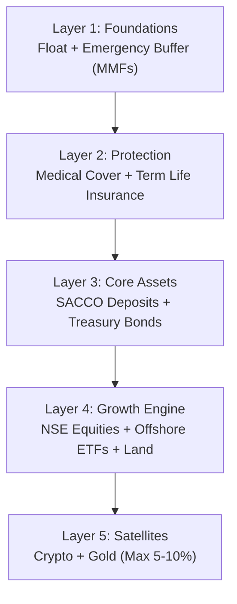
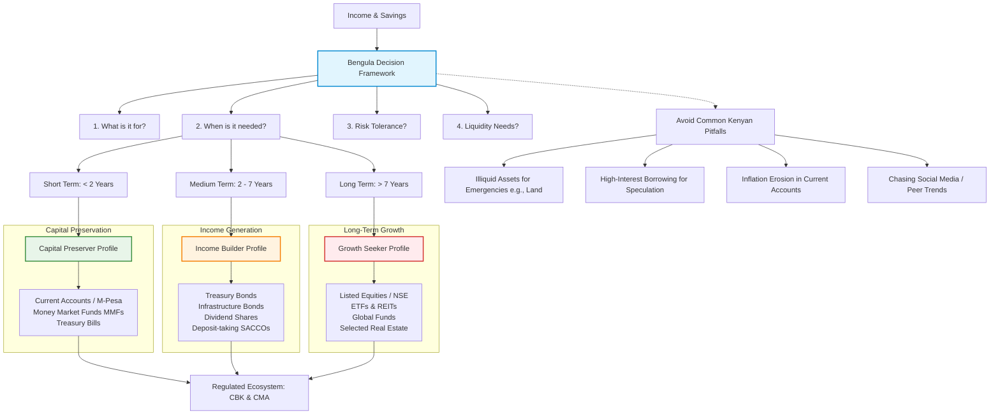
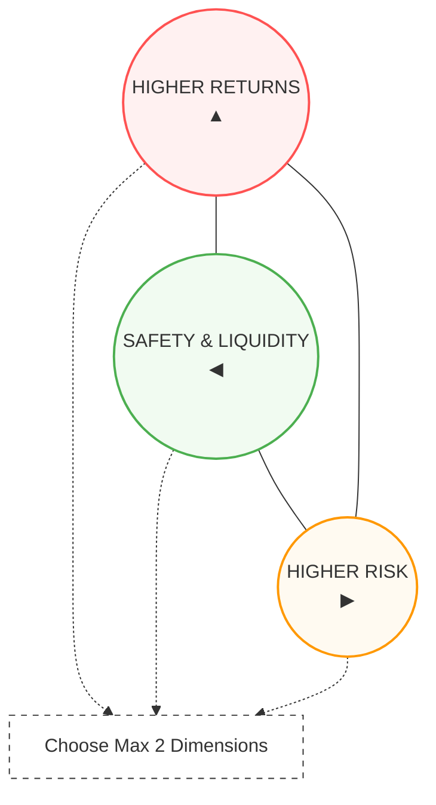
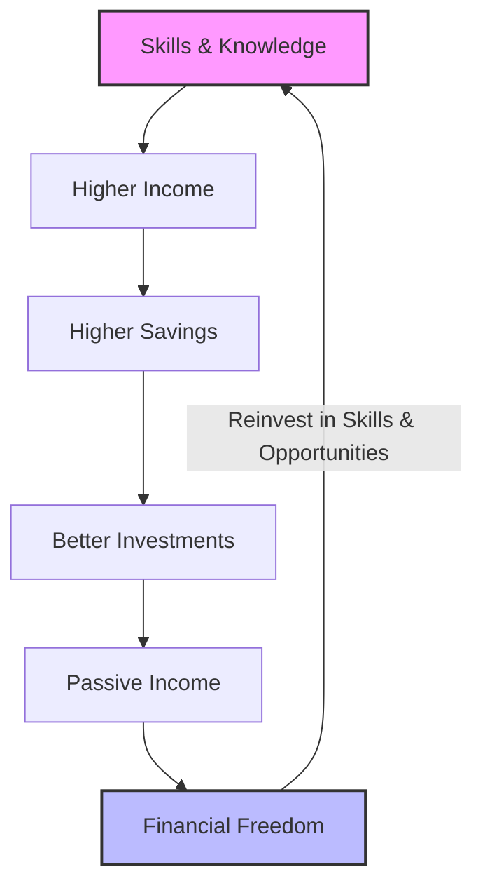
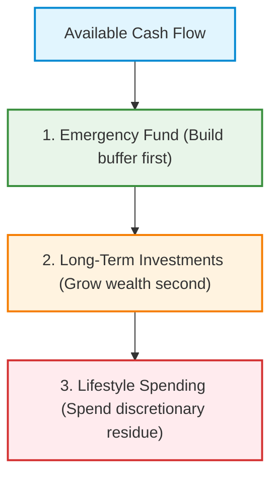

_How to earn, protect, invest, borrow, and transfer wealth in a changing economy_

Personal finance is often presented as a collection of financial products: [open a savings account](/blog/ultimate-guide-to-banking-in-kenya), invest in a Money Market Fund (MMF), buy Treasury Bonds, or contribute to a pension scheme. While these products matter, they are only tools. Sound financial management is ultimately about making better decisions with limited resources.

Every Kenyan household operates under the same basic constraints. Income is finite, expenses are unavoidable, and unexpected events such as illness, unemployment, business disruptions, or inflation can quickly derail even the best financial plans. The objective of personal finance is therefore not simply to accumulate wealth, but to build resilience while steadily improving long-term financial security.

The economic environment makes disciplined financial planning more important than ever. The [Central Bank of Kenya (CBK)](https://www.centralbank.go.ke/) held the Central Bank Rate (CBR) at **8.75%** at its June 9, 2026 Monetary Policy Committee meeting - its second consecutive hold after ten straight cuts totalling 425 basis points since August 2024 - reflecting a cautious stance amid global oil-price and geopolitical uncertainty. At the same time, annual inflation eased to **6.4%** in June 2026 from 6.7% in May, remaining within the CBK's 2.5%–7.5% target band but still well above yields on idle cash. This means money left sitting in a low-interest current account continues to lose purchasing power over time, even while nominally "safe."

This has practical implications.

A savings account earning 2% or 3% may preserve nominal capital, but it does not preserve purchasing power when inflation exceeds the return. Conversely, pursuing high advertised yields without understanding credit risk, liquidity constraints, taxation, or fees can expose investors to unnecessary losses.

Successful personal finance is therefore a balancing act between four competing objectives:

- Maintaining sufficient liquidity for day-to-day needs.
- Protecting yourself and your family against financial shocks.
- Growing wealth through disciplined long-term investing.
- Preserving purchasing power by earning returns that outpace inflation over time.

These objectives cannot all be maximized simultaneously. Higher returns usually require accepting greater volatility or locking money away for longer periods. Greater liquidity often comes at the expense of investment returns. Understanding these trade-offs is the foundation of every financial decision.

Rather than promoting individual financial products, this guide presents a decision-making framework for Kenyan households. It explains how income, budgeting, emergency savings, debt, investing, insurance, retirement planning, taxation, and estate planning fit together into a coherent financial system.

Whether you are starting your first job, running a small business, planning for retirement, or simply looking to make better financial decisions, the goal is the same:

> Build a financial system that continues working even when the economy becomes uncertain.

---

## Key Takeaways

Before reading the rest of this guide, remember these five principles:

1. **Income is your greatest asset.** Increasing your earning capacity often has a larger long-term impact than finding a slightly better investment.
2. **Liquidity comes before investing.** An emergency fund prevents temporary setbacks from becoming long-term financial crises.
3. **Eliminate expensive debt before chasing high returns.** Paying off costly debt often produces a better guaranteed outcome than investing.
4. **Match investments to your time horizon.** Money needed soon should not be invested in volatile assets.
5. **Personal finance is a process, not a product.** Sustainable wealth is built through consistent decisions rather than occasional investment wins.

---

### The Kenyan Wealth Pyramid

A sound financial life is built from the bottom up. Skipping a layer creates vulnerability, where one unexpected expense can derail years of saving.



---

## Pillar 1: Financial Planning & Risk Profiling

> _"Before choosing an investment, choose a destination. The right financial product is simply the one that gets you there with the least unnecessary risk."_

Most financial mistakes in Kenya are not caused by choosing the "wrong" investment. They happen because people invest without first defining **what the money is for**.

Someone saving for school fees due in nine months should not invest that money in equities. Likewise, a 28-year-old saving for retirement in 35 years may lose significant long-term returns by keeping all their savings in a bank account or Money Market Fund.

Successful personal finance begins with matching **time, risk, and purpose**.

---

# What Is Financial Planning?

Financial planning is the process of allocating your income, savings, and investments to achieve clearly defined life goals while managing uncertainty.

Every financial decision should answer four questions:

|Question|Example|
|---|---|
|What is this money for?|Emergency fund, school fees, retirement|
|When will I need it?|6 months, 5 years, 30 years|
|How much risk can I tolerate?|None, moderate, high|
|How liquid must it be?|Immediately accessible or long-term|

These four questions determine almost every investment recommendation in this guide.

### The Bengula Decision Framework

The following diagram maps how these four questions define your risk profile, determine your time horizon, and guide you toward the appropriate regulated financial asset class while helping you avoid common pitfalls:



---

# The Three Dimensions of Every Financial Decision

Every financial product represents a trade-off between three competing objectives.

### 1. Liquidity

Liquidity measures how quickly you can convert an investment into cash without losing value. The higher the liquidity the higher the chances of converting an asset to cash. Highly liquid financial product are very necessary for short-term financial goal and sorting out emergencies.

| Liquidity Level        | Description                                      | Examples                                             | Best Used For                                   |
| ---------------------- | ------------------------------------------------ | ---------------------------------------------------- | ----------------------------------------------- |
| **High Liquidity**     | Converts to cash instantly with zero value loss. | Current account, M-Pesa balance, Money Market Funds. | Unexpected emergencies and short-term expenses. |
| **Moderate Liquidity** | Takes days or weeks to convert to cash.          | Treasury Bills, Fixed deposits.                      | Planned mid-term goals and structured savings.  |
| **Low Liquidity**      | Takes months or years to sell and cash out.      | Land, Rental property, Private businesses.           | Long-term wealth building and growth.           |

Money that may be needed unexpectedly should remain in highly liquid assets.

---

### 2. Risk

Risk is not simply the possibility of losing money.

It includes:

- **Inflation risk** - the danger that rising prices erode the real purchasing power of your money faster than it grows, so a "safe" balance can still lose value in real terms.
- **Credit risk** - the chance that a borrower, bank, SACCO, or bond issuer fails to repay what they owe you, whether through default, delayed payment, or insolvency.
- **Market risk** - the risk that the price of an asset (shares, bonds, property) moves against you because of broader economic, sectoral, or sentiment-driven swings.
- **Liquidity risk** - the risk of being unable to convert an asset into cash quickly, or only being able to do so at a steep discount, when you actually need the money.
- **Currency risk** - the risk that shifts in the shilling's exchange rate erode the value of foreign-currency assets, debts, or income (relevant for diaspora remittances, dollar loans, and importers/exporters - see our [guide to hedging USD/KES exposure](/blog/usd-shilling-hedging) for a practical treatment).

Keeping all your savings in cash may feel safe, but inflation steadily erodes purchasing power. Conversely, investing all your emergency savings in shares exposes you to market volatility at exactly the wrong time.

---

### 3. Return

In professional asset management, securing **premium alpha or higher expected yields** requires a structural compromise across the other two dimensions - this is the classic **Investment Trilemma**. To unlock elevated returns, you must actively assume at least one of the following underlying risk exposures:

The Cost of Higher Yields

- **Elevated Volatility**: Accepting wider, short-term market price fluctuations and potential drawdowns.
- **Extended Horizon**: Locking in capital over longer durations, absorbing maturity premiums.
- **Illiquidity Discount**: Investing in restricted assets that cannot be quickly exited without incurring severe haircut losses.

The Impossible Trinity of Investing. In efficient financial markets, there is no permanent arbitrage opportunity that can simultaneously deliver:

- Maximised yield
- Zero capital risk
- Instantaneous market liquidity

Any asset class, structure, or fund manager claiming to seamlessly unify all three of these features violates core economic principles and warrants immediate, rigorous **forensic due diligence** to uncover underlying structural flaws or fraudulent mechanics. This is precisely the pattern behind most Ponzi schemes and unlicensed "investment club" collapses that have hit Kenyan savers - unusually high, guaranteed, instantly-liquid returns with no clear underlying business. Before committing funds, verify that a scheme, fund manager, or broker is licensed by checking the [Capital Markets Authority's list of licensees](https://www.cma.or.ke/) or the [Central Bank of Kenya's list of licensed institutions](https://www.centralbank.go.ke/).

---

# The Bengula Investment Triangle

Every investment sits somewhere within this triangle:




You can generally optimise for two of these characteristics, but rarely all three at once.

---

# Risk Profiling

Rather than asking _"Which investment pays the highest return?"_, ask:

> **"Which investment is appropriate for this particular goal?"**

| | **Capital Preserver** | **Income Builder** | **Growth Seeker** |
|---|---|---|---|
| **Primary objective** | Protect purchasing power while maintaining liquidity | Generate reliable cash flow | Maximise long-term wealth |
| **Characteristics** | Low tolerance for losses; short investment horizon; stable income needs | Medium investment horizon; moderate risk tolerance; values predictable income | Long investment horizon; comfortable with temporary market declines; focused on capital appreciation |
| **Suitable investments** | Money Market Funds; Treasury Bills; high-quality bank deposits | Treasury Bonds; Infrastructure Bonds; dividend-paying shares; deposit-taking [SACCOs](/blog/sacco-savers-guarantors) | [Listed equities](/blog/how-to-buy-shares-nse-kenya); broad-market ETFs (see [foreign ETFs and offshore investing from Kenya](/blog/foreign-etfs-offshore-investing-kenya)); diversified global funds; carefully selected real estate, including [REITs](/blog/reits-in-kenya-guide) |

The Nairobi Securities Exchange is pursuing reforms to deepen retail participation, broaden investment products such as ETFs and REITs, and improve market access, which may expand long-term investment opportunities for Kenyan investors.

---

# The Time Horizon Rule

Perhaps the most important rule in this handbook is:

> **Money should be invested according to when it will be needed, not according to the latest investment trend.**

As a practical guide:

|Time Horizon|Primary Objective|Typical Investments|
|---|---|---|
|Less than 2 years|Capital preservation|Current account, MMFs, Treasury Bills|
|2 to 7 years|Income and moderate growth|Treasury Bonds, SACCO deposits, diversified balanced portfolios|
|More than 7 years|Long-term growth|Equities, global funds, selected property|

A parent saving for school fees due next year should prioritise capital preservation. Someone saving for retirement 30 years away can usually tolerate greater market volatility because there is time to recover from downturns.

---

# Common Mistakes

Many Kenyans unintentionally create risk by mismatching investments with their goals.

Common examples include:

- Investing an emergency fund in land that cannot be sold quickly.
- Borrowing at high interest to invest in speculative assets.
- Keeping retirement savings entirely in low-yield current accounts.
- Choosing investments solely because friends or social media report high returns.

These mistakes are often more costly than selecting an average-performing investment.

---

# Bengula Decision Framework

Before investing a single shilling, ask yourself:

✅ What is this money for?

✅ When will I need it?

✅ Can I tolerate temporary losses?

✅ How quickly might I need access to the money?

✅ Does this investment match my objective, or am I chasing recent performance?

If you cannot confidently answer these questions, the investment decision should wait.

---

### Research Insight
Kenya's financial system offers a wide range of regulated savings and investment options, from bank deposits and government securities to collective investment schemes supervised by the Capital Markets Authority. The challenge for most households is not a lack of products, but choosing the right one for the right financial objective. The Central Bank of Kenya continues to emphasize price stability and financial resilience, while the Capital Markets Authority's framework is designed to promote orderly markets and investor protection

---

# Pillar 2: Income Generation & Human Capital

> _"Your first and most valuable investment is not a stock, a bond, or a piece of land. It is your ability to earn income over the next 30 or 40 years."_

Most discussions about personal finance begin with budgeting or investing. In reality, wealth creation begins much earlier, with **earning capacity**. The amount you can save and invest is ultimately constrained by the income you generate. While careful budgeting is essential, there is a practical limit to how much you can reduce expenses. By contrast, there is often far greater potential to increase income through education, skills, entrepreneurship, and career development.

For most Kenyans, particularly early in their careers, investing in **human capital** delivers a higher long-term return than searching for marginally better investment yields.

---

# What Is Human Capital?

Human capital refers to the knowledge, skills, experience, health, and professional reputation that enable you to earn income.

Unlike financial assets, human capital can appreciate rapidly through deliberate investment.



Examples include:

- Professional certifications
- University and technical education
- Digital skills
- Leadership experience
- Industry expertise
- Professional networks
- Communication and negotiation skills

A software engineer who doubles their salary over five years has created significantly more long-term wealth than someone earning the same salary while achieving slightly higher investment returns.

---

# The Income Hierarchy

Think of income in four stages.

|Stage|Primary Goal|Typical Examples|
|---|---|---|
|Employment|Stable cash flow|Salary, wages, contracts|
|Professional Growth|Increase earning power|Promotions, certifications, specialist skills|
|Business Income|Diversify earnings|Consultancy, SME, e-commerce, agriculture|
|Investment Income|Financial independence|Dividends, bond coupons, rental income|

Many people attempt to skip directly to investment income before strengthening the earlier stages.

---

# Career Growth as an Investment

When evaluating further education or training, ask:

- Will this improve my earning potential?
- Are these skills in growing demand?
- Can they be applied internationally or remotely?
- Will they remain valuable over the next decade?

Kenya's labour market continues to evolve, with increasing demand for digital, analytical, and technical skills. The World Bank has consistently highlighted digital transformation and skills development as key drivers of productivity and employment in East Africa.

Examples of high-demand capabilities include:

- Data analytics
- Software engineering
- Cybersecurity
- Cloud computing
- Financial analysis
- Digital marketing
- Project management
- AI implementation
- Supply chain management

These skills often generate returns that far exceed traditional investment products because they increase lifetime earning capacity.

---

# Multiple Income Streams

Relying on a single source of revenue exposes a household to severe **concentration risk**, where any macroeconomic shift or sudden job loss can compromise financial stability. True **financial resilience** is achieved through structural income diversification, spreading risk across distinct economic sectors and asset classes. 

|Income Stream|Core Function & Kenyan Context|Strategic Implementation|Risk Profile|
|---|---|---|---|
|**Earned Employment**|Regular salary providing a predictable liquidity foundation.|Optimise for stability, corporate benefits, and institutional networks.|**High Concentration**: Vulnerable to retrenchment or corporate restructuring.|
|**Active Business**|Small-scale enterprises, consulting, retail, logistics, manufacturing, or farming.|Build operational structures that do not demand 100% of your daily presence.|**Medium to High**: Tied to operational execution and domestic market cycles.|
|**Digital Services**|Remote freelancing, software engineering, content writing, and virtual assistance.|Access global markets via online platforms to hedge against local currency depreciation.|**Medium**: Highly competitive, but provides excellent global arbitrage and FX earnings.|
|**Investment Yield**|Dividends, bond coupons, Money Market Funds (MMFs), and rental yields.|Reinvest capital systematically to purchase passive cash-flowing assets.|**Low to Medium**: Market-dependent but entirely decoupled from active labor.|
The ultimate strategic objective is **not to pursue every micro-opportunity simultaneously**, which fractures focus and dilutes operational efficiency. Instead, households must systematically **decouple survival from a single paycheck** by building or buying secondary revenue channels that perform independently of their primary employment. 
# Building a Bankable Business

Operating entirely in cash keeps many growing side businesses invisible to mainstream lenders. ==**Formalising your operations** is the most direct path to unlocking access to commercial capital and expansion finance==.

Transitioning from a casual side project to a bankable business requires replacing informal habits with structured financial practices.

- **Dedicated Banking**: Open a distinct commercial account to cleanly separate personal and business funds.
- **Digital Point-of-Sale**: Adopt digital payment methods to build an verifiable, automated paper trail of your daily revenue.
- **Bookkeeping**: Maintain meticulous accounting records to clearly demonstrate your underlying profitability.
- **Fiscal Responsibility**: File accurate tax returns to officially validate your top-line revenue history.
- **Professional Billing**: Issue compliant invoices to track receivables and establish institutional legitimacy.
Lenders do not just look at past data files; they look at active partnerships. Do not wait for a cash crunch to make your first introduction. Proactively engaging your bank's Relationship Manager ensures they understand your business model before you formally apply for capital.

Review this comprehensive article on [why the Relationship Manager is a business's most underrated growth](/blog/why-rm-is-sme-growth-asset) asset to learn exactly how to leverage this critical connection to secure trade finance, maximize credit lines, and optimize your overall cash management strategy.

---

# Income vs Lifestyle Inflation

One of the greatest threats to long-term wealth is **lifestyle inflation**.

As income rises, spending often rises just as quickly.

Examples include:

- Upgrading vehicles before building investments.
- Increasing rent after every promotion.
- Financing luxury consumption through debt.
- Expanding recurring subscriptions.

Higher income only creates wealth when part of the increase is consistently converted into productive assets.

---

# The Bengula Income Rule

Whenever your income increases:

- Allocate a portion to improving your standard of living.
- Increase your emergency fund if necessary.
- Raise your long-term investment contributions.
- Avoid matching every salary increase with new recurring expenses.

This allows your savings rate to improve alongside your income.

---

# Decision Framework: Should You Invest in Yourself?

Before paying for a course, certification, or degree, ask:

✅ Will it increase my earning potential?

✅ Is there clear market demand for these skills?

✅ Can I recover the cost through higher future income?

✅ Will the qualification remain relevant over the next decade?

✅ Does it improve my career resilience if my current industry changes?

If most answers are "yes," the investment may generate returns that exceed many traditional financial products.

---

# Bengula Insight

Financial independence begins with **cash flow**, not investment products.
Money Market Funds, Treasury Bonds, and equities all play important roles, but they cannot compensate for weak earning power. The strongest personal financial plans are built on growing income first, then converting part of that income into diversified investments over time.

---

# Pillar 3: Budgeting, Cash Flow Management, and Building Financial Resilience

> _"Wealth is not determined by how much you earn, but by how effectively you direct every shilling toward your financial goals."_

Many people believe budgeting is about restricting spending. In reality, budgeting is about **making intentional decisions**. A good budget ensures that today's spending does not compromise tomorrow's opportunities.

In Kenya, where household budgets are increasingly strained by rising costs of food, transport, housing, education, and healthcare, budgeting has become less about cutting luxuries and more about preserving financial stability. According to the Kenya National Bureau of Statistics (KNBS), annual inflation reached **6.4% in June 2026**, with food, transport, and housing accounting for the largest price increases. These categories represent more than half of the average household's consumption basket, meaning many families continue to feel financial pressure even as headline inflation remains within the Central Bank of Kenya's target range.

Budgeting is therefore not simply an accounting exercise. It is a risk-management tool.

---

# Budgeting Starts With Cash Flow

Many households focus on income while overlooking cash flow.

**Income** is what you earn.

**Cash flow** is what remains after meeting your financial obligations.

Two people earning KSh 150,000 per month can have completely different financial outcomes depending on how they manage expenses, debt, and savings.

The objective is not to maximize income alone but to consistently create a positive cash flow that can be directed toward emergency savings, investments, and debt reduction.

---

# Understand Your Cash Flow

Every budget begins with three simple numbers:

|Category|Examples|
|---|---|
|Income|Salary, business profits, freelance work, rental income, dividends|
|Essential Expenses|Rent, food, transport, school fees, insurance, utilities|
|Financial Priorities|Emergency savings, investments, debt repayments, retirement contributions|

A healthy financial plan ensures that financial priorities are treated as planned expenses rather than optional activities.

---

# The Bengula Cash Flow Formula

Rather than asking:

> "How much can I save?"

Ask:

> "Where does every shilling go?"

A simplified framework looks like this:

$ \text{Available Cash Flow} = \text{Income} - \text{Taxes \& Statutory Deductions} - \text{Essential Living Expenses} - \text{Debt Repayments} $

The generated available cash flow is then allocated sequentially down the priority stack:



The order matters.

Savings should not depend on whether money happens to remain at the end of the month.

---

# Pay Yourself First

One of the simplest but most effective financial habits is to automate saving.

Instead of saving what remains after spending:

1. Receive income.
2. Transfer a predetermined amount to savings or investments.
3. Live on the remaining balance.

This approach reduces the temptation to spend first and save later.

The Government's National Financial Inclusion Strategy identifies strengthening Kenya's savings culture as a priority, noting that improving household savings is essential for long-term financial resilience and wealth creation.

---

Effective budgeting relies on prioritizing expenses and distinguishing between flexible costs and rigid commitments.

# Fixed vs. Variable Expenses

Optimizing a budget requires identifying which costs can be immediately modified.

- **Fixed Expenses**: These are predictable, recurring commitments that are difficult to change quickly. Examples include rent, loan repayments, school fees, insurance premiums, and internet subscriptions.
- **Variable Expenses**: These are flexible costs that offer immediate room for adjustment. Examples include dining out, entertainment, clothing, fuel, and shopping.

|Expense Type|Characteristics|Examples|Strategic Focus|
|---|---|---|---|
|**Fixed**|Predictable, recurring, and difficult to alter quickly.|Rent, loan repayments, school fees, insurance, internet.|Keep monitored; hard to cut short-term.|
|**Variable**|Flexible and highly responsive to behavioral changes.|Dining out, entertainment, clothing, fuel, shopping.|**Focus here first** for instant savings.|

> **Key Strategy**: Focus first on controlling variable expenses. They provide instant flexibility without disrupting your essential legal or living obligations.

# The Three Budget Categories

Every transaction should directly support one of three core financial objectives:

|Category|Definition|Key Examples|Strategic Rule|
|---|---|---|---|
|**1. Living**|Costs that sustain daily life.|Food, rent, utilities, healthcare, transport.|Cover these essential needs first.|
|**2. Building**|Capital that improves future security.|Savings, retirement, investments, education.|View as investments, not costs.|
|**3. Lifestyle**|Spending that improves quality of life.|Travel, hobbies, dining out, luxury items.|Must grow slower than your income.|

# Managing Lifestyle Inflation

A salary increase should accelerate your progress toward financial freedom, not just expand your consumer spending. Wealth accumulation stalls when higher earners immediately absorb raises into elevated living standards.

- **Housing upgrades**: Moving into a significantly more expensive home immediately after a raise.
- **Premature financing**: Taking on a new vehicle loan before securing an emergency fund.
- **Subscription creep**: Automatically upgrading recurring services without verifying their utility.

## Redefining "Emergency" Expenses

True emergencies are entirely unforeseen events. Many disruptive costs are actually predictable seasonal obligations disguised as emergencies.

- **Annual school fees**
- **Scheduled vehicle servicing**
- **Insurance renewals**
- **Holiday travel**
- **Routine medical check-ups**

> **The Fix**: Create dedicated **sinking funds** for these known irregular costs. Saving for them incrementally ensures they never disrupt your monthly cash flow.

---
# Building Financial Resilience

Financial resilience is the ability to absorb shocks without experiencing long-term financial damage.

The Competition Authority of Kenya notes that financial health is measured not only by access to financial services but also by the ability to meet day-to-day obligations, recover from financial shocks, and invest for the future. Despite high levels of financial inclusion, many households remain financially vulnerable because they lack adequate reserves and emergency savings.

Financial resilience depends on:

- Positive monthly cash flow.
- Emergency savings.
- Appropriate insurance.
- Manageable debt.
- Diversified income sources.

These pillars work together. Weakness in one area increases pressure on the others.

---

# The Bengula Budget Review

At the end of every month, ask:

✅ Did my spending reflect my priorities?

✅ Did I increase my net worth?

✅ Did I save before spending?

✅ Did any unnecessary subscriptions or recurring costs emerge?

✅ Would I be financially secure if my income stopped for three months?

If the answer to the final question is "no," your next financial goal should not necessarily be investing. It should be strengthening your financial resilience.

---

## Bengula Insight

A budget is not about deprivation.

It is about ensuring that every shilling has a purpose before it is spent.

People who consistently build wealth are rarely those who eliminate every discretionary expense. They are the ones who deliberately direct surplus cash toward assets that increase their future financial freedom while maintaining enough liquidity to withstand life's inevitable uncertainties.

---

# Pillar 4: Emergency Funds - Building Your Financial Safety Net

> _"The purpose of an emergency fund is not to earn the highest return. Its purpose is to buy you time when life becomes unpredictable."_

Most financial setbacks do not begin with poor investments. They begin with unexpected events that force people to make desperate financial decisions.

A job loss, medical emergency, business slowdown, major vehicle repair, or family crisis can quickly derail years of financial progress if there is no readily accessible cash reserve. Without an emergency fund, many households resort to expensive digital loans, [credit cards](/blog/credit-card-interest-free-period), selling productive assets, or interrupting long-term investments at the worst possible time.

An emergency fund is therefore the foundation upon which every other financial goal is built.

---

# What Is an Emergency Fund?

An emergency fund is money set aside exclusively to cover **unexpected and essential expenses** without disrupting your long-term financial plan.

Its purpose is to:

- Maintain financial stability during income interruptions.
- Avoid high-cost borrowing.
- Prevent the sale of long-term investments at unfavorable prices.
- Reduce financial stress during crises.

An emergency fund is **insurance against uncertainty**, not an investment portfolio.

---

# Why Every Kenyan Household Needs One

Kenya has made remarkable progress in financial inclusion, but financial resilience remains a challenge.

According to the **Kenya National Financial Inclusion Strategy 2025-2028**, based on the **2024 FinAccess Survey**:

- Only **33.2%** of adults could set money aside for emergencies.
- Only **24.5%** could raise a lump sum within three days if faced with an unexpected expense.
- Just **18.3%** of adults were classified as financially healthy across multiple indicators.

These figures illustrate an important distinction:

> **Access to financial services does not automatically translate into financial resilience.**

Many people have bank accounts and mobile money, yet remain vulnerable because they lack emergency savings.

---

# What Qualifies as an Emergency?

A genuine emergency is:

- Unexpected.
- Essential.
- Time-sensitive.

Examples include:

✅ Medical emergencies

✅ Sudden unemployment

✅ Major business disruption

✅ Essential home repairs

✅ Emergency travel for close family

✅ Critical vehicle repairs needed to continue earning income

---

## What Is _Not_ an Emergency?

Many expenses are predictable and should be planned for separately.

Examples include:

- Christmas celebrations
- School fees due every term
- Holidays
- Annual insurance premiums
- Routine vehicle servicing
- Planned electronics purchases

These should be funded through dedicated savings ("sinking funds"), not your emergency reserve.

---

# How Much Should You Save?

There is no universal amount.

The appropriate size depends on:

- Income stability
- Family responsibilities
- Debt obligations
- Number of income earners
- Access to insurance

A practical guide is:

|Employment Situation|Recommended Emergency Fund|
|---|---|
|Stable salaried employee|3-6 months of essential expenses|
|Commission-based employee|6-9 months|
|Freelancer or consultant|6-12 months|
|Business owner|9-12 months of business and household expenses|

These are guidelines rather than fixed rules. Someone with a highly stable income and strong insurance coverage may require less than someone with irregular earnings.

---

# Emergency Fund vs Opportunity Fund

Many people mix these together.

They serve different purposes.

|Emergency Fund|Opportunity Fund|
|---|---|
|Protects against unexpected events|Enables planned investments|
|Highly liquid|Can tolerate moderate illiquidity|
|Never invested aggressively|May seek higher returns|
|Used only during genuine emergencies|Used for planned purchases or opportunities|

Separating these funds prevents short-term opportunities from compromising financial security.

---

# Where Should an Emergency Fund Be Kept?

The ideal emergency fund balances **safety**, **liquidity**, and **capital preservation**. Our side-by-side comparison of [bank savings accounts, SACCOs, and MMFs](/blog/bank-vs-sacco-vs-mmf-savings) can help you decide where to actually park it.

Suitable options include:

### Money Market Funds (MMFs)

For many households, regulated Money Market Funds provide daily liquidity while seeking returns that have historically exceeded those of most current accounts, although returns fluctuate with interest-rate conditions. See our deeper look at [the trajectory of MMF yields in Kenya](/blog/future-mmfs-kenya) for how these rates tend to move with the CBR.

### High-Interest Savings Accounts

Useful for immediate accessibility, particularly when linked to salary accounts or digital banking platforms.

### Short-Term Government Securities

Treasury Bills may suit portions of a larger emergency reserve that are unlikely to be needed immediately, though they are generally less liquid than bank deposits or MMFs. Our [comparison of fixed deposits versus Treasury Bills](/blog/fixed-deposit-lending-arbitrage) walks through the yield, liquidity, and tax trade-offs in more detail.

The right choice depends on how quickly funds may be required.

---

# Building an Emergency Fund

An empty emergency fund leaves you completely exposed to financial disaster. Trying to lock away six months of living expenses overnight feels impossible, but breaking that massive goal into tactical milestones makes financial peace inevitable.

|Milestone|Target Amount|Strategic Purpose|Local Tool to Use|
|---|---|---|---|
|**Stage 1: The Shield**|**KSh 10,000 – 20,000**|Absorbs minor shocks like a cracked phone screen or sudden clinic visit.|**M-Shwari Lock Savings** (keeps cash out of your main M-Pesa wallet).|
|**Stage 2: The Bridge**|**1 Month of Essentials**|Prevents panic and expensive digital app loans if cash flow stalls.|**KCBOmni** or **NCBA Loop** (separate digital pots earning interest).|
|**Stage 3: The Fortress**|**3 – 6 Months of Living**|Delivers true freedom to switch jobs, invest, or handle major transitions.|**High-Yield Money Market Funds (MMFs)** (e.g., CIC, Sanlam, or ICEA).|

---

**Automate! Automate! Automate**! Relying on discipline alone fails because your M-Pesa wallet always finds a way to spend "spare" cash. Successful investors do not save what is left after spending; they spend what is left after automating their savings on payday.

- **For College Students**: Set up a weekly **KSh 200** transfer to an **M-Shwari Lock Savings** account. It keeps the cash invisible to your daily campus spending impulses.
- **For Salaried Professionals**: Schedule a standing order to route 10% of your salary directly into a **Money Market Fund** or a digital lock account on the exact day your salary hits.
- **For Aspiring Investors**: Think of this fund as your launchpad. You cannot confidently take advantage of high-yield investment opportunities if a sudden emergency forces you to liquidate your assets at a loss.

Moving money automatically guarantees progress. It removes emotion from saving and builds your financial fortress silently in the background.

---

# Common Mistakes

Avoid these common errors:

❌ Investing emergency savings in illiquid assets such as land.

❌ Chasing the highest advertised returns at the expense of accessibility.

❌ Using emergency savings to finance discretionary purchases.

❌ Failing to replenish the fund after it has been used.

The emergency fund is a revolving safety net. Whenever it is drawn down for a genuine emergency, rebuilding it should become the next financial priority.

---

# The Bengula Emergency Fund Framework

Before considering higher-risk investments, ask yourself:

✅ Could I cover three months of essential expenses if my income stopped tomorrow?

✅ Would I need to borrow at high interest to handle a medical emergency?

✅ Can I access my emergency savings within one business day?

✅ Is my emergency fund separated from money allocated for investments or planned purchases?

If the answer to any of these questions is **no**, strengthening your emergency fund is likely to provide a greater improvement to your financial security than seeking higher investment returns.

---

## Bengula Insight

An emergency fund rarely makes headlines, and it will never be the highest-returning part of your portfolio.

Its value lies elsewhere.

It gives you the freedom to decline expensive debt, remain invested during market downturns, negotiate career changes without panic, and recover from unexpected setbacks without dismantling years of financial progress.

In personal finance, **resilience is often the highest-return investment you can make.** Supported by Kenya's National Financial Inclusion Strategy, improving households' ability to save for emergencies is a key national objective because stronger emergency reserves reduce financial vulnerability and improve long-term financial health.

---

# Pillar 5: Insurance - Protecting the Wealth You Are Building

> _"Building wealth is only half the challenge. The other half is protecting it from events that could erase years of financial progress."_

Many people see insurance as an expense rather than an investment in financial resilience. This perception often leads households to prioritise saving and investing while postponing insurance until after a crisis occurs.

In reality, insurance is one of the foundations of a sound financial plan. Investments help you grow wealth over time, but insurance protects that wealth against low-probability, high-impact events that could otherwise force you to liquidate investments, borrow at high interest, or deplete your emergency fund.

Insurance does not make you wealthier.

It prevents you from becoming poorer.

---

# Why Insurance Matters

Every financial plan is built on assumptions:

- You will remain healthy.
- You will continue earning income.
- Your business will continue operating.
- Your property will not suffer catastrophic loss.

Insurance exists because these assumptions do not always hold true.

Without adequate protection, one serious medical emergency, motor accident, fire, or death of a family's primary income earner can undo decades of financial progress.

---

# Insurance in Kenya

Despite the increasing importance of financial resilience, insurance remains one of the least utilised financial products in Kenya.

According to the **Insurance Regulatory Authority (IRA)** and the **FinAccess 2024** report:

- Insurance penetration increased modestly from **2.29% in 2022 to 2.39% in 2024**.
- Kenya remains among Africa's stronger insurance markets, but penetration is still low relative to the size of the economy.
- Industry assets exceeded **KES 1 trillion**, demonstrating the sector's growing importance despite limited household uptake.

The implication is significant:

> Millions of Kenyans remain financially exposed to risks that could otherwise be transferred to insurers.

---

# Risk Before Return

Many first-time investors ask:

> "Where should I invest?"

A better question is:

> "What financial risks could destroy my investment plan?"

Before increasing investment contributions, consider whether you have protected yourself against risks such as:

- Serious illness
- Disability
- Death of an income earner
- Property damage
- Motor accidents
- Business interruption

Insurance addresses these risks before they become financial crises.

---

# The Role of Insurance in Personal Finance

Insurance should complement, not replace:

- Emergency savings
- Investments
- Retirement planning

Each serves a different purpose.

|Financial Tool|Primary Purpose|
|---|---|
|Emergency Fund|Covers small and immediate unexpected expenses|
|Insurance|Protects against catastrophic financial losses|
|Investments|Builds long-term wealth|
|Retirement Savings|Provides income after employment|

Using investments to pay for major unexpected losses often interrupts long-term wealth creation.

---

# Essential Types of Insurance

## Health Insurance

Medical expenses are among the fastest ways to exhaust household savings.

Health insurance helps protect against:

- Hospital admissions
- Surgery
- Specialist treatment
- Chronic illness management
- Major medical emergencies

Even households enrolled in public health programmes often choose complementary private medical cover to reduce out-of-pocket costs and expand access to healthcare.

---

## Life Insurance

Life insurance protects people who depend on your income.

It becomes particularly important if you have:

- Children
- A spouse
- Outstanding loans
- Elderly dependants
- Business partners relying on you

The objective is income replacement rather than investment returns - pure term cover is generally more cost-effective for this purpose than investment-linked policies. If you are weighing a policy that bundles savings with cover, our [guide to endowment plans in Kenya](/blog/endowment-plans-kenya-guide) breaks down when that combination makes sense and when it doesn't.

---

## Disability and Income Protection

For many professionals, their ability to earn income is their largest financial asset.

Disability cover provides financial support if illness or injury prevents continued employment.

Although less discussed than life insurance, it can be equally important for protecting long-term financial plans.

---

## Motor Insurance

Motor insurance is legally required for vehicles using Kenyan roads.

Beyond legal compliance, comprehensive cover can significantly reduce the financial impact of accidents, theft, or damage.

Always confirm that your insurer is licensed by the Insurance Regulatory Authority before purchasing cover.

---

## Home Insurance

Many homeowners insure buildings but neglect household contents.

A comprehensive household policy may cover:

- Fire
- Theft
- Flood damage (subject to policy terms)
- Household contents
- Personal liability

The value of replacing furniture, electronics, and appliances is often underestimated until a loss occurs.

---

## Business Insurance

Business owners face additional risks, including:

- Fire
- Theft
- Public liability
- Professional liability
- Equipment damage
- Business interruption

Appropriate insurance allows businesses to recover more quickly from unexpected disruptions.

---

# How Much Insurance Do You Need?

Insurance should be based on financial obligations rather than arbitrary figures.

Consider:

- Outstanding debts
- Dependants
- Future education costs
- Household living expenses
- Existing investments
- Emergency savings

As financial circumstances change, insurance needs should be reviewed periodically.

---

# Choosing an Insurer

Price should never be the only consideration.

Evaluate:

✅ Financial strength

✅ Claims settlement reputation

✅ Coverage limits

✅ Exclusions

✅ Customer service

✅ Regulatory status

The Insurance Regulatory Authority maintains a public register of licensed insurers and publishes consumer information to help policyholders make informed decisions.

---

# Common Insurance Mistakes

Avoid these frequent errors:

❌ Buying insurance solely because it is cheapest.

❌ Failing to understand policy exclusions.

❌ Underinsuring valuable assets.

❌ Allowing policies to lapse unintentionally.

❌ Assuming employer-provided insurance is sufficient for all circumstances.

❌ Treating insurance as an investment rather than risk protection.

---

# The Bengula Insurance Framework

Before purchasing any policy, ask:

✅ What financial risk am I transferring?

✅ Could I comfortably absorb this loss without insurance?

✅ Do I understand what is covered and what is excluded?

✅ Is the insurer licensed and regulated?

✅ Does the premium fit comfortably within my long-term financial plan?

If the answers are clear, insurance becomes a strategic tool rather than an emotional purchase.

---

# Bengula Insight

Insurance is often overlooked because its value is invisible until something goes wrong.

The most successful financial plans do not rely on hope.

They assume that unexpected events will occur and prepare accordingly.

Your emergency fund protects against manageable setbacks.

Your investments build future wealth.

**Your insurance protects both.**

For most households, insurance is not the product that generates the highest return. It is the product that preserves the returns earned elsewhere by preventing a single unexpected event from undoing years of disciplined saving and investing.

---

# Pillar 6: Retirement Planning - Building Financial Independence Beyond Your Working Years

> _"Retirement is not an age. It is the point at which your investments, savings, and pension generate enough income to support the lifestyle you want without relying on employment."_

Many Kenyans assume retirement planning begins in their 50s. In reality, retirement planning begins with the **first income you earn**. The greatest advantage in retirement investing is not choosing the highest-returning investment but giving your investments enough time to compound.

Every year you delay saving reduces the time available for compound growth and increases the amount you must save later to reach the same retirement goal. The Retirement Benefits Authority (RBA) consistently advises that the best time to begin saving for retirement is **now**, regardless of age. For a deeper walkthrough of the vehicles available, see our [complete retirement planning guide for Kenya](/blog/retirement-planning-kenya-guide).

---

# What Is Retirement Planning?

Retirement planning is the process of accumulating assets that will provide sufficient income after you stop working.

The objective is simple:

> Replace employment income with investment and pension income.

A complete retirement strategy combines several sources of income rather than relying on a single one.

Examples include:

- National Social Security Fund (NSSF)
- Occupational pension schemes
- Individual pension plans
- Personal investments
- Rental income
- Dividend income
- Business ownership

The more diversified these income streams become, the more resilient retirement finances are likely to be.

---

# Why Retirement Planning Matters

Life expectancy has improved significantly over recent decades.

That is good news.

It also means retirement savings must potentially support:

- 20 years
- 25 years
- or even 30 years

after employment ends.

Without adequate preparation, retirees risk:

- Outliving their savings
- Becoming financially dependent on family
- Selling assets at unfavorable prices
- Reducing their quality of life

Retirement planning is therefore about preserving dignity and financial independence.

---

# The Power of Starting Early

Consider two investors.

### Investor A

Starts saving at age 25.

### Investor B

Starts saving at age 40.

Even if Investor B contributes substantially more every month, Investor A often accumulates significantly greater retirement wealth because compound returns have much longer to work.

This is why time is often a more valuable asset than investment performance.

The RBA emphasizes that beginning pension contributions in your twenties allows even relatively modest monthly contributions to grow substantially over time through compounding.

---

# The Three Pillars of Retirement Income

## 1. National Social Security Fund (NSSF)

The NSSF provides Kenya's mandatory basic retirement savings framework for eligible workers.

Following reforms under the NSSF Act, the Fund operates as a pension scheme intended to provide retirement income while also offering benefits in cases such as disability and survivorship.

For most households, however, NSSF should be viewed as **a foundation rather than a complete retirement solution**.

---

## 2. Occupational Pension Schemes

Many employers provide registered retirement schemes.

Benefits include:

- Employer contributions
- Professional fund management
- Tax advantages
- Long-term investing

These schemes can significantly strengthen retirement outcomes when combined with personal savings.

---

## 3. Individual Pension Plans (IPPs)

Self-employed professionals, entrepreneurs, freelancers, and employees seeking additional retirement savings can join **RBA-registered Individual Pension Plans**.

These plans offer:

- Flexible contributions
- Professional investment management
- Portability between employers
- Tax incentives for qualifying contributions

The RBA notes that registered personal retirement plans allow flexible contribution schedules and that qualifying contributions receive tax relief up to the statutory limits.

---

# Retirement Is More Than a Pension

A strong retirement plan should combine multiple asset classes.

Examples:

- Pension savings
- Government securities
- Equities
- Money Market Funds (for liquidity)
- Rental property
- Business ownership

Diversification reduces dependence on any single income source.

---

# How Much Should You Save?

There is no universal percentage.

A commonly used guideline is to save **10% to 15% of income** toward retirement, increasing contributions as income grows.

The RBA also encourages workers to aim for retirement income that replaces approximately **70% to 80%** of their pre-retirement earnings, although individual circumstances will differ.

If retirement saving begins later in life, higher contribution rates may be necessary.

---

# Retirement Planning by Life Stage

## Ages 20 to 30

Focus on:

- Building saving habits
- Joining a pension scheme
- Maximizing compound growth
- Investing in career development

Priority:

Time.

---

## Ages 30 to 45

Focus on:

- Increasing pension contributions
- Diversifying investments
- Protecting family income
- Paying down expensive debt

Priority:

Asset accumulation.

---

## Ages 45 to 60

Focus on:

- Reviewing retirement goals
- Reducing unnecessary debt
- Increasing income-producing assets
- Reviewing insurance and estate plans

Priority:

Preparation.

---

## Retirement

Focus on:

- Income sustainability
- Capital preservation
- Healthcare planning
- Estate management

Priority:

Financial independence.

---

# Common Retirement Planning Mistakes

Avoid these common pitfalls:

❌ Assuming NSSF alone will fund retirement.

❌ Starting to save only a few years before retirement.

❌ Frequently withdrawing long-term retirement savings.

❌ Ignoring inflation when estimating future expenses.

❌ Failing to review beneficiary nominations.

❌ Concentrating retirement wealth in a single asset class.

---

# The Bengula Retirement Framework

Before making retirement decisions, ask yourself:

✅ If I stopped working today, where would my income come from?

✅ Am I relying on one retirement asset or several?

✅ Are my retirement savings keeping pace with inflation?

✅ Have I increased retirement contributions as my income has grown?

✅ Have I nominated beneficiaries and reviewed them recently?

---

# Tax Advantages Matter

Retirement planning is not only about investment returns.

It is also about tax efficiency.

Registered pension schemes in Kenya enjoy important tax advantages. Contributions that meet the legal requirements qualify for tax relief up to statutory limits, and investment income within registered schemes benefits from favorable tax treatment. These incentives can materially improve long-term retirement outcomes.

---

## Bengula Insight

Retirement planning is one of the few financial goals where **time is often more valuable than money**.

A modest contribution started consistently in your twenties can outperform much larger contributions that begin decades later because compound growth has longer to work.

The goal is not simply to retire.

The goal is to reach a point where **work becomes a choice rather than a financial necessity**, supported by diversified income streams, disciplined saving, and decades of thoughtful financial planning.

---

# Pillar 7: Estate Planning & Wealth Transfer - Ensuring Your Wealth Outlives You

> _"Building wealth is only part of the journey. Estate planning ensures that the wealth you build benefits the people and causes you care about, according to your wishes rather than chance."_

Many people associate estate planning with the wealthy. In reality, anyone who owns property, has savings, runs a business, or supports dependants has an estate.

Without a clear estate plan, families may face delays, legal disputes, unnecessary costs, and uncertainty at an already difficult time. In Kenya, the distribution of a deceased person's estate is governed primarily by the **Law of Succession Act**, which sets out the rules for wills, intestacy (dying without a valid will), probate, and the rights of dependants.

Estate planning is therefore not about preparing for death.

It is about protecting the people who depend on you.

---

# What Is Estate Planning?

Estate planning is the process of deciding how your assets will be managed if you become incapacitated and how they will be distributed after your death.

Your estate may include:

- Bank accounts
- SACCO deposits and shares
- Investment portfolios
- Pension benefits
- Insurance policies
- Real estate
- Vehicles
- Business interests
- Digital assets
- Intellectual property

The goal is to ensure these assets are transferred efficiently and according to your wishes.

---

# Why Estate Planning Matters

Estate planning provides several important benefits:

- Protects family members from unnecessary legal disputes.
- Helps ensure dependants are adequately provided for.
- Reduces delays in administering an estate.
- Supports continuity for family businesses.
- Clarifies who should receive specific assets.

Although a valid will is an important planning tool, Kenyan courts may still intervene in limited circumstances to make reasonable provision for certain dependants if they have not been adequately provided for under the law.

---

# Dying With or Without a Will

## Testate Succession

A person who dies leaving a valid will dies **testate**.

The will generally specifies:

- Executors
- Beneficiaries
- Distribution of assets
- Guardians for minor children
- Funeral wishes (where included)

A properly drafted will gives greater certainty and reduces ambiguity.

---

## Intestate Succession

A person who dies without a valid will dies **intestate**.

In that situation, the Law of Succession Act determines how the estate is distributed, taking into account the surviving spouse, children, and other eligible dependants. The exact outcome depends on the family circumstances and the nature of the estate.

---

# Writing a Will

A will should be reviewed whenever major life events occur, such as:

- Marriage
- Divorce
- Birth or adoption of children
- Acquisition of significant assets
- Starting or selling a business

A comprehensive will commonly identifies:

- Executors
- Beneficiaries
- Specific gifts
- Guardians for minor children
- Residual estate arrangements

A will should be stored securely, and trusted executors should know where it can be found.

---

# Beneficiary Nominations

Some financial products allow you to nominate beneficiaries separately from your will.

Examples may include:

- Pension schemes
- Life insurance policies
- Certain investment products

Because nomination rules differ between products, periodically review beneficiary nominations to ensure they remain up to date after major life events such as marriage, divorce, or the birth of children. Pension trustees and insurers generally have their own rules and processes that operate alongside succession law.

---

# Planning for Business Owners

Business owners should consider:

- Who will manage the business immediately after death?
- Should ownership transfer to family members?
- Should the business be sold?
- Are there documented succession procedures?
- Are key financial records accessible?

A profitable business can quickly lose value if there is no continuity plan.

---

# Digital Assets

Modern estates increasingly include digital property.

Examples include:

- Online banking
- Investment accounts
- Domain names
- Websites
- Cloud storage
- Digital intellectual property
- Social media accounts
- Cryptocurrency wallets

Maintain a secure inventory of important digital assets and instructions on how trusted executors can identify and access them lawfully.

---

# Probate and Estate Administration

Even where a valid will exists, estate administration usually involves a legal process.

In Kenya, executors or administrators generally obtain authority through probate or letters of administration before distributing estate assets. This process helps ensure debts are settled and assets are transferred lawfully.

---

# Common Estate Planning Mistakes

Avoid these common errors:

❌ Assuming a will is only necessary for wealthy individuals.

❌ Failing to review beneficiary nominations after major life events.

❌ Leaving no instructions for digital assets.

❌ Ignoring business succession planning.

❌ Assuming family members can automatically access bank accounts or transfer property without following legal procedures.

---

# The Bengula Estate Planning Framework

Review your estate plan by asking:

✅ Do I have a valid and up-to-date will?

✅ Have I nominated beneficiaries where appropriate?

✅ Would my family know where important documents are kept?

✅ Does my business have a succession plan?

✅ Have I considered how digital assets should be managed?

If you answer "no" to several of these questions, estate planning deserves attention before expanding your investment portfolio.

---

# Bengula Insight

Estate planning is the final stage of personal financial planning because it connects every earlier decision.

Your income creates wealth.

Your budget directs it.

Your emergency fund protects it.

Your investments grow it.

Your insurance safeguards it.

Your retirement plan provides for you.

**Your estate plan ensures that what remains continues to benefit the people and purposes you value most.**

Ultimately, successful personal finance is measured not only by how much wealth you accumulate during your lifetime, but also by how effectively that wealth serves future generations and minimizes unnecessary uncertainty for those you leave behind.

# Pillar 8: Tax Planning - Keeping More of What You Earn (Legally)

> _"Successful financial planning is not only about increasing income. It is also about understanding the tax system so that every financial decision is made with full knowledge of its costs and benefits."_

Tax planning is often misunderstood. Some people associate it with avoiding taxes altogether, while others ignore it until filing season.

Neither approach builds long-term wealth.

Effective tax planning means **making informed financial decisions within the law**. It involves understanding how different sources of income are taxed, taking advantage of legitimate reliefs and deductions, maintaining proper records, and ensuring compliance with Kenya Revenue Authority (KRA) requirements.

The objective is simple:

> **Pay the right amount of tax, no more and no less.**

---

# Why Tax Planning Matters

Every investment should be evaluated based on its **after-tax return**, not just the advertised interest rate or yield.

For example:

- Two investments may offer identical returns before tax but produce different outcomes after taxes and fees.
- Retirement contributions may qualify for tax relief, increasing their overall value.
- Poor record-keeping can result in penalties, missed deductions, or delayed tax compliance.

Small tax decisions made consistently over many years can significantly affect long-term wealth accumulation.

---

# Understanding Kenya's Tax System

Most individuals interact with several types of taxes during their financial lives.

Common examples include:

|Tax|Typical Application|Current Rate (2026)|
|---|---|---|
|PAYE|Employment income|Progressive, 10%–35% (see bands below)|
|Income Tax|Business and professional income|Progressive for individuals; 30% flat for resident companies|
|Withholding Tax|Certain payments including professional services and investment income in specified cases|Varies by payment type, typically 5%–20%|
|Capital Gains Tax (CGT)|Disposal of qualifying property such as land, buildings, and unquoted shares|**15%** of the net gain (final tax)|
|VAT|Purchases of taxable goods and services|**16%** standard rate|
|Excise Duty|Selected products and services|Varies by product|
|Turnover Tax (TOT)|Small business gross sales between KES 1M–25M/year|**3%** of gross turnover|

Understanding which taxes apply to your income sources is an important part of financial planning. Rates and thresholds change with each Finance Act, so always confirm the current figures on the [KRA website](https://www.kra.go.ke/) or via [iTax](https://itax.kra.go.ke/) before filing.

---

# Employment Income

For salaried employees, most income tax is collected through the **Pay As You Earn (PAYE)** system.

Employers deduct PAYE before salaries are paid and remit it to the [Kenya Revenue Authority (KRA)](https://www.kra.go.ke/) on behalf of employees, by the 9th of the following month. PAYE applies to taxable employment income, including salaries, wages, bonuses, commissions, and many taxable benefits.

As of 2026, Kenya applies **five progressive PAYE bands** to monthly taxable pay:

| Monthly Taxable Pay (KES) | Rate |
|---|---|
| First 24,000 | 10% |
| Next 8,333 (24,001 – 32,333) | 25% |
| Next 467,667 (32,334 – 500,000) | 30% |
| Next 300,000 (500,001 – 800,000) | 32.5% |
| Above 800,000 | 35% |

Every resident employee also receives a **personal relief of KES 2,400 per month (KES 28,800 per year)**, deducted directly from the tax computed above.

Before PAYE is applied, gross pay is also reduced by several other statutory deductions:

- **NSSF (Tier I & II)**: 6% of pensionable pay, matched by the employer, up to a monthly earnings ceiling that is reviewed periodically by the NSSF.
- **Social Health Authority (SHA/SHIF) levy**: 2.75% of gross pay, which replaced NHIF.
- **Affordable Housing Levy (AHL)**: 1.5% of gross pay, matched by the employer.

Because these deductions directly affect take-home pay and retirement savings, it is worth checking your payslip periodically against the [NSSF](https://www.nssf.or.ke/), [SHA](https://sha.go.ke/), and KRA's official guidance to confirm the correct amounts are being applied.

Although PAYE is deducted automatically, employees remain responsible for filing annual income tax returns where required.

---

# Filing Annual Tax Returns

Many people mistakenly assume that paying PAYE means they have no further obligations.

In Kenya:

- Every individual with a KRA PIN and an Income Tax obligation is generally required to file an annual income tax return.
- Individuals with no taxable income during the year may still need to file a Nil Return if the obligation remains active.
- The standard filing period for annual returns runs from **1 January to 30 June** for the preceding year of income.

Filing on time helps avoid unnecessary penalties and supports good financial standing.

---

# Tax Reliefs and Allowable Deductions

One of the most overlooked areas of personal finance is making full use of legitimate tax reliefs.

Depending on individual circumstances and current legislation, examples include:

- Personal tax relief.
- Contributions to registered pension or provident funds (up to statutory limits).
- Contributions to qualifying post-retirement medical funds.
- Mortgage interest relief for qualifying owner-occupied residential property.
- Statutory deductions such as contributions required under applicable laws.

Because tax legislation changes over time, always confirm current limits and eligibility with the latest KRA guidance.

---

# Tax Planning for Investors

Tax should never be the only reason to choose an investment.

Instead, ask:

- What is my expected **after-tax** return?
- How liquid is the investment?
- What fees apply?
- What level of risk am I accepting?

A lower-tax investment is not automatically a better investment if it carries substantially higher risk or lower suitability for your financial goals.

---

# Tax Planning for Business Owners, Freelancers, and Side-Hustlers

If you run a side-hustle, consult as a freelancer, or operate a small business, tax compliance is no longer a private matter between you and the KRA. In Kenya's digitized payments landscape, your tax strategy directly affects your commercial viability. Large corporate clients require eTIMS compliance before paying you, and banks review tax declarations alongside bank statements to determine credit eligibility.

### Choosing Your Tax Structure: Turnover Tax (TOT) vs. Individual Income Tax

As a sole proprietor or unregistered side-hustler, you generally have two main paths for declaring and paying tax on your business income:

| Tax Parameter | Turnover Tax (TOT) | Individual Income Tax (Progressive) |
| :--- | :--- | :--- |
| **Eligibility Threshold** | Gross sales between KSh 1 million and KSh 25 million annually. | Any business income; mandatory if turnover exceeds KSh 25 million or falls below KSh 1 million. |
| **Tax Rate** | **3% of gross sales** (gross turnover). | **Progressive rates from 10% to 35%** (10%, 25%, 30%, 32.5%, and 35% on monthly income above KSh 800,000) of **net profit**. |
| **Treatment of Expenses** | Expenses are **not deductible**. Tax is calculated directly on gross sales. | Expenses are **deductible** if they are wholly and exclusively incurred in the production of income. |
| **Filing Frequency** | Monthly (filed and paid by the 20th of the following month). | Annually (filed and paid by June 30th of the following year). |
| **Best Suited For** | High-margin businesses with low overheads or simple operations. | Low-margin/high-volume businesses with significant deductible operational costs (rent, salaries, stock). |

### The eTIMS Compliance Layer
Regardless of whether you choose Turnover Tax or Individual Income Tax, KRA's **electronic Tax Invoice Management System (eTIMS)** acts as the official ledger. 
* **For Businesses above KSh 5 Million Turnover:** You must issue eTIMS invoices for all sales.
* **For Businesses below KSh 5 Million Turnover:** While legally exempt from issuing eTIMS invoices, you are not invisible. Corporate buyers will use **buyer-initiated (reverse) invoicing** to declare their purchases from you. Onboarding onto eTIMS voluntarily (using eTIMS Lite via USSD or the web portal) keeps you in control of your declared revenue trail.
* **Building a Credit-Ready File:** As highlighted in [eTIMS and the SME](/blog/etims-kenya-sme-guide), an active eTIMS record matching your bank and mobile money statements is the cheapest collateral you can build. It provides independent proof of turnover that banks use to approve business and asset finance.

---

# Good Record Keeping

Strong financial records make tax planning much easier.

Maintain copies of:

- P9 forms.
- Investment statements.
- Pension contribution records.
- Insurance documents.
- Bank statements.
- Business invoices and receipts.
- Property purchase and sale documents.

Good records reduce errors, simplify return preparation, and support claims where documentation is required.

---

# Common Tax Planning Mistakes

Avoid these common errors:

❌ Waiting until the filing deadline to organize records.

❌ Assuming PAYE eliminates all filing obligations.

❌ Ignoring allowable deductions and reliefs.

❌ Mixing personal and business finances.

❌ Failing to keep supporting documentation.

❌ Making investment decisions based solely on tax considerations.

---

# The Bengula Tax Planning Framework

Before making a major financial decision, ask:

✅ Have I considered the after-tax return?

✅ Am I taking advantage of legitimate tax reliefs?

✅ Do I understand my filing obligations?

✅ Are my financial records complete and organized?

✅ Is this decision improving my long-term financial position, not just reducing taxes today?

If the answer to any of these questions is "no," review the tax implications before proceeding.

---

# Bengula Insight

Tax planning is one of the least exciting aspects of personal finance, but it is one of the few areas where informed decisions can improve financial outcomes **without increasing investment risk**.

The goal is not to avoid tax.

The goal is to understand the rules, comply with them, and structure your financial life efficiently. Over a lifetime, disciplined tax planning, combined with prudent investing and sound record-keeping, can preserve more of your wealth and reduce unnecessary financial friction.

# Pillar 9: Investing for Long-Term Wealth Creation

> _"Investing is not about finding the next winning asset. It is about consistently allocating capital in a way that allows your wealth to grow faster than inflation while managing risk over decades rather than months."_

Many first-time investors believe investing is about predicting markets or finding the highest-return product. In reality, successful investing is built on discipline, diversification, patience, and alignment with clearly defined financial goals. For a broader tour of the landscape, see our [ultimate guide to investing in Kenya](/blog/ultimate-guide-to-investing-in-kenya).

In Kenya, investors today have access to a wider range of regulated investment opportunities than ever before. The Capital Markets Authority (CMA) has continued expanding the collective investment scheme market by approving new money market, fixed income, multi-asset, and multi-currency funds to improve investor choice and deepen the capital markets. If your goal is to convert savings into a steady stream of monthly income, our framework for [building a monthly income engine from MMFs, T-Bills, bonds, and dividends](/blog/monthly-income-engine-kenya) walks through how to layer these instruments in practice.

The objective of investing is therefore not simply to earn high returns.

It is to build purchasing power over time while managing uncertainty.

---

# Saving Is Not Investing

Many people use these terms interchangeably.

They are different.

|Saving|Investing|
|---|---|
|Preserves money|Grows money|
|Low risk|Varying levels of risk|
|Short-term focus|Medium to long-term focus|
|High liquidity|Liquidity depends on the asset|
|Suitable for emergencies|Suitable for future financial goals|

Saving prepares you to invest.

Investing prepares you for financial independence.

---

# The Four Principles of Investing

Every successful investment strategy rests on four principles.

## 1. Start Early

Time is one of the few advantages every investor can control.

Even modest investments made consistently over decades often outperform large lump-sum investments made much later because of compound growth.

---

## 2. Invest Regularly

Trying to predict the perfect time to invest is rarely successful.

A disciplined strategy of investing fixed amounts at regular intervals, often called **rupee-cost** or **dollar-cost averaging**, reduces the impact of market volatility and removes emotion from investing.

---

## 3. Diversify

Diversification reduces the impact of poor performance from any single investment.

Rather than placing all your money into one asset, spread investments across:

- Cash
- Fixed income
- Equities
- Property
- International investments where appropriate

Diversification does not eliminate risk.

It reduces concentration risk.

---

## 4. Stay Invested

Markets rise.

Markets fall.

Both are normal.

Many investors lose money not because markets perform poorly, but because they buy after prices have risen sharply and sell after markets decline.

Long-term investing rewards patience more than prediction.

---

# Understanding Asset Classes

Every investment belongs to an asset class.

Each has different characteristics.

---

## Understanding the Major Asset Classes

| Asset Class | Examples | Strengths | Weaknesses | Best Suited For |
|---|---|---|---|---|
| **Cash & Cash Equivalents** | Bank deposits; Money Market Funds; Treasury Bills | High liquidity; lower volatility; capital preservation | Lower long-term growth potential; inflation may erode purchasing power | Emergency funds; short-term goals |
| **Fixed Income** | [Treasury Bonds](/blog/kb-bond-guide-2026); Corporate Bonds; fixed income funds - see our [explainer on lending to government](/blog/sovereign-debt-explained) | Predictable income; lower volatility than equities | Interest-rate risk; inflation risk | Income-focused investors; retirement portfolios; medium-term goals |
| **Equities (Shares)** | Listed company shares - partial ownership, returns via capital appreciation and dividends | Strong long-term growth potential | Higher short-term volatility | Long-term wealth building |
| **Real Estate** | Residential and commercial property; agricultural land; [REITs](/blog/reits-in-kenya-guide) | Potential rental income; capital appreciation; diversification | High transaction costs; lower liquidity; maintenance expenses | Long-term investors - see [KMRC-backed mortgages](/blog/kmrc-affordable-housing-mortgage) if financing rather than buying outright |
| **Alternative Investments** | Commodities; infrastructure funds; private equity; venture capital | Diversification beyond traditional assets | Higher risk; often illiquid; requires specialist knowledge | Experienced investors with higher risk tolerance and diversified portfolios |

Historically, equities have outperformed many other asset classes over long investment horizons, but investors should expect periods of significant market fluctuations along the way.

---

# Asset Allocation

Research consistently shows that **asset allocation** is one of the biggest drivers of long-term investment outcomes, often more important than selecting individual securities. Strategic asset allocation begins by identifying an investor's goals, time horizon, and risk tolerance before choosing specific investments.

Instead of asking:

> "Which investment is best?"

Ask:

> "How should my portfolio be allocated?"

An example:

|Asset Class|Growth Investor|Balanced Investor|Conservative Investor|
|---|---|---|---|
|Cash & MMFs|10%|20%|40%|
|Fixed Income|20%|40%|50%|
|Equities|60%|30%|10%|
|Property & Alternatives|10%|10%|0%|

These allocations are illustrative rather than prescriptive. Individual circumstances differ.

---

# Inflation Is Your Silent Competitor

Many investors compare returns only against bank interest rates.

The more important comparison is inflation.

If your investments earn:

6%

while inflation averages:

6%

Your real purchasing power has barely increased before taxes and fees.

Long-term investing should therefore aim to preserve and increase **real wealth**, not just nominal account balances.

---

# Common Investing Mistakes

Avoid these common pitfalls:

❌ Chasing the highest advertised returns.

❌ Investing emergency funds in volatile assets.

❌ Concentrating all investments in one company or one asset class.

❌ Buying investments you do not understand.

❌ Reacting emotionally during market downturns.

❌ Ignoring fees, taxes, and inflation.

---

# The Bengula Investment Framework

Before making any investment, ask:

✅ What financial goal does this investment support?

✅ What is my investment horizon?

✅ How much volatility can I tolerate?

✅ Does this investment improve my portfolio's diversification?

✅ What are the risks, costs, taxes, and liquidity constraints?

If you cannot answer these questions confidently, spend more time understanding the investment before committing your money.

---

# Looking Ahead

Kenya's investment landscape is becoming broader and more accessible. The CMA has approved new collective investment schemes and multi-asset funds, while the Nairobi Securities Exchange's long-term strategy aims to expand investor participation, diversify listed products, and improve retail access to regulated investments. These developments increase opportunities, but they also reinforce the importance of financial literacy and disciplined decision-making.

---

# Bengula Insight

Investing is not a competition against other investors.

It is a long-term partnership with time.

The investor who consistently contributes, diversifies wisely, ignores short-term market noise, and remains committed to a disciplined plan will usually outperform the investor who constantly searches for the next "hot" opportunity.

Successful investing is rarely spectacular.

It is usually **patient, systematic, evidence-based, and remarkably ordinary**. That ordinary discipline, repeated over decades, is what ultimately creates extraordinary wealth.

# Pillar 10: Borrowing, Debt Management & Responsible Use of Credit

> _"Debt is neither inherently good nor bad. It is a financial tool. Used wisely, it can accelerate wealth creation. Used carelessly, it can delay financial independence for years."_

Nearly every household or business will use credit at some point. A mortgage may help purchase a home, a business loan may finance expansion, and a student loan may increase future earning potential. Equally, expensive consumer debt can erode wealth by diverting future income toward interest payments instead of investments.

Responsible borrowing is therefore less about **whether** you borrow and more about **why, how much, and under what terms**.

Kenya has one of Africa's most developed credit markets, with commercial banks, microfinance banks, SACCOs, digital lenders, and government-backed financing programmes offering a wide range of borrowing options. This increased access to credit creates opportunities, but also places greater responsibility on borrowers to understand costs, risks, and repayment obligations. Our [complete guide to borrowing money in Kenya](/blog/borrowing-money-in-kenya-guide) surveys the full landscape of lenders and products in more depth.

---

# What Is Good Debt?

Good debt finances assets or activities that are likely to increase your future financial position.

Examples include:

- Education that improves earning potential.
- Business expansion supported by realistic cash-flow projections.
- Commercial equipment that increases productivity - often best financed through [asset finance rather than a conventional unsecured loan](/blog/asset-finance-vs-conventional-loans), since the asset itself serves as security and typically earns a lower rate.
- A reasonably priced mortgage for a suitable long-term home.

The key characteristic is that the borrowing helps generate future value that outweighs its cost.

---

# What Is Bad Debt?

Bad debt finances consumption that quickly loses value while creating long-term repayment obligations.

Examples include:

- Financing luxury purchases with high-interest loans.
- Borrowing for holidays.
- Using [expensive mobile loans](/blog/mobile-digital-loans-real-cost-kenya) to fund discretionary spending.
- Taking one loan simply to service another without addressing the underlying financial problem.

These forms of borrowing reduce future financial flexibility.

---

# The True Cost of Credit

The advertised interest rate rarely tells the full story.

Before borrowing, understand:

- Interest charges.
- Arrangement fees.
- Insurance premiums.
- Legal and valuation costs (where applicable).
- Early repayment conditions.
- Penalties for missed payments.

This is why comparing the **Total Cost of Credit (TCC)** rather than interest rates alone provides a more accurate picture of borrowing costs. See our breakdowns of [how Kenyan banks price loans using base rate plus a "K" margin](/blog/how-kenyan-banks-price-loans) and [the real cost of mobile and digital loans](/blog/mobile-digital-loans-real-cost-kenya) for worked examples of how advertised rates translate into what you actually pay.

---

# Borrow Only for a Defined Purpose

Every loan should answer one question:

> **How will this borrowing improve my future financial position?**

Examples of appropriate reasons:

- Purchasing productive business equipment.
- Financing professional education.
- Buying a reasonably priced home.
- [Consolidating expensive debt](/blog/debt-consolidation-refinancing-kenya) where overall costs are genuinely reduced.

Poor reasons include:

- Maintaining an unsustainable lifestyle.
- Purchasing depreciating luxury items.
- Covering recurring monthly deficits caused by overspending.

---

# Understanding Debt Capacity

The right amount of debt depends on:

- Stable income.
- Existing financial obligations.
- Emergency savings.
- Family responsibilities.
- Interest rate risk.

Just because a lender approves a larger loan does not mean you should borrow the maximum amount available.

Lenders evaluate credit risk.

Borrowers must evaluate financial sustainability.

---

# Debt Before Investing?

One of the most common questions in personal finance is:

> **Should I invest or pay off debt first?**

The answer depends largely on the cost of the debt.

As a general framework:

|Situation|Priority|
|---|---|
|High-interest consumer debt|Repay aggressively|
|Moderate-cost productive debt|Balance repayment with investing|
|Low-cost long-term productive debt|Continue investing while servicing debt responsibly|

Paying off expensive debt often provides a **guaranteed financial return** equal to the interest you no longer have to pay.

---

# Credit Scores and Credit History

Your borrowing history influences future access to credit.

Responsible credit behaviour includes:

- Paying instalments on time.
- Avoiding unnecessary defaults.
- Borrowing only what you can comfortably repay.
- Monitoring your credit records periodically.

Kenya's credit information sharing framework allows lenders to assess repayment history when making lending decisions, encouraging responsible borrowing and improving credit risk assessment across the financial sector. See our [guide to how credit scores work in Kenya](/blog/credit-score-kenya-guide) for how CRB data actually translates into a score, and our walkthrough on [how to check and fix your CRB listing](/blog/how-to-fix-your-crb-listing-kenya) if you have never reviewed your own record - a wrong or stale entry can quietly raise the price of every loan you take.

---

# Managing Existing Debt

If you already have multiple loans:

Prioritise:

1. Listing every outstanding debt.
2. Recording interest rates.
3. Recording minimum repayments.
4. Avoiding new unnecessary borrowing.
5. Building a structured repayment plan.

The objective is to reduce total borrowing costs while maintaining good repayment discipline.

---

# Warning Signs of Financial Stress

Seek help before debt becomes unmanageable.

Common warning signs include:

- Borrowing to repay existing loans.
- Missing repayments.
- Using overdrafts for everyday expenses.
- Constantly refinancing without reducing balances.
- Depending on short-term digital credit for monthly living expenses.

These usually indicate cash-flow problems rather than a shortage of available credit.

---

# Common Borrowing Mistakes

Avoid these common errors:

❌ Borrowing because you qualify rather than because you need to.

❌ Comparing loans using interest rates alone.

❌ Ignoring fees and repayment conditions.

❌ Financing depreciating lifestyle purchases.

❌ Borrowing without an emergency fund.

❌ Assuming refinancing automatically reduces borrowing costs.

---

# The Bengula Borrowing Framework

Before signing any loan agreement, ask yourself:

✅ Why am I borrowing?

✅ Will this loan increase my future earning capacity or financial position?

✅ Can I comfortably repay the loan if my income falls temporarily?

✅ Have I calculated the **total cost**, not just the advertised interest rate?

✅ Would postponing the purchase leave me financially better off?

If you cannot answer these questions confidently, delay the borrowing decision until you can.

---

# Decision Matrix: Should You Borrow?

|Purpose|Borrow?|Why|
|---|---|---|
|University education with strong employment prospects|Usually yes|Builds future earning capacity|
|Business expansion supported by cash-flow projections|Often yes|Productive use of capital|
|Buying machinery or equipment|Often yes|Can increase productivity and revenue|
|Luxury holiday|Usually no|Creates debt without generating future value|
|Latest smartphone upgrade|Usually no|Depreciating asset|
|Covering routine monthly expenses|No|Indicates underlying budgeting or income problem|

---

# Bengula Insight

Debt should accelerate your financial plan, **not become your financial plan**.

The best borrowers are not those who qualify for the largest loans.

They are the ones who understand the purpose of credit, compare the total cost of borrowing, maintain repayment discipline, and ensure that debt supports productive goals rather than temporary consumption.

Used responsibly, credit can help build businesses, finance education, and acquire long-term assets.

Used carelessly, it can quietly consume the very income that should have been building wealth.

---
# Pillar 11: Financial Independence & Building a Lifetime Wealth Strategy

> _"Financial independence is not about becoming rich overnight. It is about reaching the point where work becomes optional because your assets generate sufficient income to support your desired lifestyle."_

Many people define financial success by income, job title, or the size of their home. Yet high incomes alone do not guarantee financial security. Across the world, there are professionals earning substantial salaries who remain financially vulnerable because their spending rises as quickly as their earnings.

True financial independence is measured differently.

It is the ability to make life decisions without being driven solely by the need for your next paycheck.

This chapter brings together every principle covered in this guide, showing how budgeting, emergency savings, insurance, investing, debt management, retirement planning, taxation, and estate planning work together as one integrated financial system.

---

# What Is Financial Independence?

Financial independence (FI) is the stage where the income generated by your assets and investments is sufficient to cover your recurring living expenses.

These income sources may include:

- Pension income
- Treasury Bond coupons
- Dividend income
- Rental income
- Business profits
- Money Market Fund withdrawals
- Royalties and intellectual property
- Other passive or semi-passive income

At this stage, employment becomes a choice rather than a necessity.

Financial independence does **not** necessarily mean retiring early. Many financially independent people continue working because they enjoy their careers or wish to pursue new opportunities.

---

# The Three Stages of Wealth

Every household progresses through three broad stages.

## Stage 1: Financial Stability

Primary objectives:

- Build a budget.
- Eliminate expensive debt.
- Create an emergency fund.
- Obtain appropriate insurance.
- Develop stable income.

Success at this stage means being able to absorb financial shocks without falling into debt.

---

## Stage 2: Wealth Accumulation

Once financial stability has been established, attention shifts to growing net worth.

Key priorities include:

- Increasing investment contributions.
- Diversifying across asset classes.
- Maximizing retirement savings.
- Increasing earning capacity.
- Managing taxes efficiently.

At this stage, assets begin working alongside employment income.

---

## Stage 3: Financial Independence

Eventually, investment income begins replacing employment income.

The objective becomes:

- Preserving capital.
- Generating reliable income.
- Managing longevity risk.
- Passing wealth efficiently to future generations.

---

# Measuring Financial Progress

Many people focus exclusively on income.

A better measure is **net worth**.

Net worth is calculated as:

> **Assets − Liabilities = Net Worth**

Assets include:

- Cash
- Investments
- Property
- Pension balances
- Businesses

Liabilities include:

- Mortgages
- SACCO loans
- Bank loans
- Credit card balances
- Personal loans

Tracking net worth annually provides a clearer picture of financial progress than monitoring salary alone.

---

# The Financial Independence Ratio

One useful indicator is the proportion of your living expenses covered by passive income.

|Passive Income Covers|Financial Position|
|---|---|
|Less than 25%|Dependent primarily on employment|
|25% to 50%|Building financial resilience|
|50% to 75%|Approaching financial independence|
|100% or more|Financially independent|

This ratio often provides more insight than investment balances alone.

---

# The Bengula Wealth Pyramid

Each stage supports the next.

```
              Legacy
        Estate Planning
──────────────────────────
       Financial Freedom
    Passive Investment Income
──────────────────────────
     Long-Term Investments
 Retirement • Bonds • Shares
──────────────────────────
      Emergency Savings
──────────────────────────
      Insurance Protection
──────────────────────────
 Positive Cash Flow & Budget
──────────────────────────
      Human Capital
 Skills • Income • Career
```

Notice that **income sits at the foundation**.

Without strong earning capacity, every higher layer becomes more difficult to sustain.

---

# Wealth Is Built Through Systems

Many people search for the perfect investment.

Successful investors build systems instead.

Examples include:

- Automatic monthly investments.
- Annual portfolio reviews.
- Regular pension contributions.
- Insurance reviews every few years.
- Annual net worth calculations.
- Updating wills after major life events.

Systems outperform motivation because they continue working even when enthusiasm fades.

---

# Avoiding Lifestyle Traps

One of the greatest obstacles to financial independence is **lifestyle inflation**.

Higher income often leads to:

- Larger homes.
- More expensive vehicles.
- Additional subscriptions.
- Greater discretionary spending.

If spending increases at the same pace as income, wealth accumulation slows dramatically.

Financial independence requires ensuring that **assets grow faster than lifestyle costs**.

---

# Reviewing Your Financial Plan

A financial plan should not be written once and forgotten.

Review it at least annually or after major life events such as:

- Marriage.
- Divorce.
- Birth of a child.
- Career changes.
- Starting a business.
- Purchasing property.
- Retirement.

Financial planning is a living process rather than a one-time exercise.

---

# The Bengula Annual Financial Check-Up

At the end of each year, ask yourself:

### Income

✅ Has my earning capacity improved?

### Budget

✅ Did I maintain positive cash flow?

### Emergency Fund

✅ Could I survive six months without employment income?

### Insurance

✅ Is my coverage still appropriate?

### Investments

✅ Am I diversified?

### Retirement

✅ Did I increase my pension contributions?

### Debt

✅ Is my debt supporting wealth creation rather than consumption?

### Estate Planning

✅ Are my will and beneficiary nominations current?

These questions provide a practical framework for keeping your financial plan aligned with your changing circumstances.

---

# Looking Ahead

Kenya's financial landscape continues to evolve. The Capital Markets Authority has expanded the range of regulated collective investment schemes, while the Nairobi Securities Exchange's 2025–2029 strategy seeks to broaden retail participation, increase the number of listed investment products such as ETFs and REITs, and improve access through technology. These developments create more opportunities for investors, but they also make financial literacy and disciplined decision-making increasingly important.

---

# Bengula Insight

Financial independence is rarely achieved through a single investment, a winning stock, or a sudden increase in income.

It is usually the result of thousands of small, disciplined decisions made consistently over decades.

Every budget you maintain.

Every unnecessary debt you avoid.

Every pension contribution you make.

Every investment you leave untouched to compound.

Every insurance policy that protects you from financial catastrophe.

Every review that keeps your plan on course.

Individually, these decisions may seem ordinary.

Together, they become extraordinary.

Ultimately, personal finance is not about predicting the future. It is about building a financial system capable of succeeding through whatever future arrives.
# Conclusion: Personal Finance Is a Lifetime System, Not a Destination

> _"The most successful financial plans are rarely the most complicated. They are the ones that survive changes in the economy, personal circumstances, and the passage of time."_

Personal finance is often portrayed as a sequence of isolated decisions: choosing a savings account, buying shares, applying for a mortgage, or selecting a pension scheme. In reality, these are only individual components of a much larger system.

A sound financial plan connects every decision to a broader objective.

Your career determines your earning capacity.

Your budget determines your cash flow.

Your emergency fund determines your resilience.

Insurance protects your wealth from catastrophic losses.

Investments help preserve and grow purchasing power.

Retirement planning provides future financial independence.

Estate planning ensures your wealth benefits future generations.

None of these pillars can compensate entirely for the absence of the others. Together, however, they create a financial system capable of adapting to changing economic conditions, inflation, evolving family responsibilities, and unexpected life events. Financial planning is therefore best understood as a continuous process of review and adjustment rather than a one-time exercise.

---

# The Bengula Financial Blueprint

Throughout this guide, we have followed a deliberate sequence.

```
Increase Your Human Capital
            │
            ▼
Generate Sustainable Income
            │
            ▼
Build Positive Cash Flow
            │
            ▼
Create an Emergency Fund
            │
            ▼
Protect Against Major Risks
            │
            ▼
Invest for Long-Term Growth
            │
            ▼
Plan for Retirement
            │
            ▼
Transfer Wealth Efficiently
```

Each step strengthens the next.

Attempting to skip foundational stages, such as investing aggressively before establishing an emergency fund or borrowing heavily without stable cash flow, often weakens the entire financial plan.

---

# The Bengula Principles of Wealth

If you remember nothing else from this guide, remember these ten principles.

### 1. Income Is Your Greatest Asset

The ability to earn income over the next 30 or 40 years is often worth far more than your current investment portfolio.

Continue investing in:

- Skills
- Education
- Health
- Professional relationships
- Reputation

---

### 2. Spend With Intention

Every shilling should have a purpose.

Budgeting is not about restriction.

It is about alignment.

---

### 3. Protect Before You Grow

Emergency savings and insurance come before aggressive investing.

Protection preserves future opportunities.

---

### 4. Invest Consistently

Time in the market generally matters more than attempting to predict the market.

Consistent investing has historically outperformed emotional decision-making over long periods.

---

### 5. Avoid Expensive Debt

Debt should finance productive assets rather than recurring consumption.

Borrow to build.

Not to impress.

---

### 6. Understand Every Financial Product

Never invest in something simply because:

- friends recommend it,
- social media promotes it,
- returns appear unusually high,
- everyone else seems to be buying it.

Understanding should always come before investing.

---

### 7. Review Your Plan Regularly

Financial planning is dynamic.

Review your plan after:

- Marriage
- Divorce
- Career changes
- Business expansion
- Birth of children
- Major inheritances
- Retirement

Annual reviews help ensure that your financial strategy continues to reflect your goals and circumstances.

---

### 8. Think in Decades

Short-term market movements receive disproportionate attention.

Long-term wealth is usually built through:

- patience,
- discipline,
- diversification,
- continuous learning.

---

### 9. Leave a Legacy

Estate planning is not about preparing for death.

It is about protecting the people and causes that matter most.

---

### 10. Financial Freedom Is About Choice

Ultimately, wealth is not measured solely by the size of your portfolio.

It is measured by the choices your financial position allows you to make.

---

# Your Annual Financial Review Checklist

At least once every year, conduct a complete financial review.

### Human Capital

☐ Have my skills and earning capacity improved?

☐ Have I invested in learning this year?

---

### Income

☐ Has my income increased?

☐ Have I diversified my income sources?

---

### Budget

☐ Am I consistently generating positive cash flow?

☐ Have I eliminated unnecessary recurring expenses?

---

### Emergency Fund

☐ Do I still have at least three to six months of essential expenses readily available?

---

### Insurance

☐ Does my insurance still reflect my current circumstances?

---

### Investments

☐ Is my portfolio diversified?

☐ Have I reviewed fees, taxes, and asset allocation?

---

### Debt

☐ Is every outstanding loan helping improve my long-term financial position?

---

### Retirement

☐ Have I increased retirement contributions this year?

---

### Estate Planning

☐ Is my will current?

☐ Are beneficiary nominations still accurate?

---

### Personal Goals

☐ Does my financial plan still reflect the life I want to build?

---

# Official Resources & Further Reading

Products, rates, and regulations referenced in this guide change over time. Bookmark these official regulator and institution websites to verify current figures before making decisions:

**Regulators**
- [Central Bank of Kenya (CBK)](https://www.centralbank.go.ke/) - CBR, inflation data, T-bill/T-bond auction results, licensed banks and microfinance institutions
- [Kenya Revenue Authority (KRA)](https://www.kra.go.ke/) - PAYE bands, iTax filing, tax reliefs, CGT and TOT guidance
- [Capital Markets Authority (CMA)](https://www.cma.or.ke/) - licensed fund managers, stockbrokers, and investment advisers; investor alerts on unlicensed schemes
- [Retirement Benefits Authority (RBA)](https://www.rba.go.ke/) - registered pension schemes and Individual Pension Plans
- [Insurance Regulatory Authority (IRA)](https://www.ira.go.ke/) - licensed insurers and insurance market statistics
- [Sacco Societies Regulatory Authority (SASRA)](https://www.sasra.go.ke/) - licensed deposit-taking SACCOs

**Institutions & Platforms**
- [Nairobi Securities Exchange (NSE)](https://www.nse.co.ke/) - listed equities, bonds, and market data
- [National Social Security Fund (NSSF)](https://www.nssf.or.ke/) - statutory pension contributions and statements
- [Social Health Authority (SHA)](https://sha.go.ke/) - SHIF contributions and medical cover
- [CBK Treasury Mobile Direct / DhowCSD](https://www.centralbank.go.ke/national-payments-system/dhowcsd/) - buying Treasury bills and bonds directly (diaspora readers: see our [step-by-step DhowCSD walkthrough](/blog/cbk-diaspora-bond-access))
- [Financial Sector Deepening Kenya (FSD Kenya)](https://www.fsdkenya.org/) - FinAccess survey data and financial inclusion research

Always confirm you are dealing with a licensed entity before investing or borrowing - the CMA and CBK both publish updated lists of licensees and regularly issue public alerts about unlicensed or fraudulent schemes.

---

# A Final Word

Financial success is rarely the result of extraordinary intelligence, perfect market timing, or finding a secret investment.

More often, it comes from making sound decisions repeatedly over many years.

The Kenya of the next decade will almost certainly differ from the Kenya of today. Inflation will rise and fall. Interest rates will change. New financial products will emerge. Technology will continue reshaping banking, investing, and commerce.

The fundamentals, however, are unlikely to change.

People who consistently:

- earn and develop valuable skills,
- spend less than they earn,
- build emergency reserves,
- manage debt responsibly,
- invest patiently,
- protect themselves against major risks,
- prepare for retirement, and
- plan for future generations,

will remain better positioned than those who chase short-term opportunities without a coherent financial strategy.

This is the philosophy behind **The Bengula Blueprint**.

It is not a guide to becoming wealthy overnight.

It is a framework for making better financial decisions throughout your lifetime, regardless of changing markets or economic conditions.

Because in the end, **wealth is not simply what you own. It is the freedom, resilience, opportunities, and peace of mind that your financial decisions create over time.**