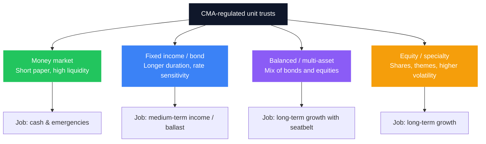
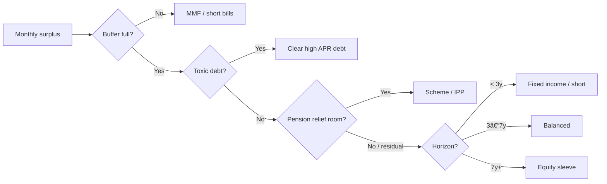

Kenya’s collective investment story of the last decade has a clear hero: the **Money Market Fund**. Households moved emergency cash out of 3% savings accounts into CMA-regulated pools that track short-term rates, stay liquid, and scale from small balances. That shift is real - MMFs now dominate unit-trust assets - and it is covered in depth in [The Future of MMFs in Kenya](/blog/future-mmfs-kenya) and the parking decision in [Bank vs SACCO vs MMF](/blog/bank-vs-sacco-vs-mmf-savings).

The next maturity step is equally important: **stop using an MMF for money that has a five- or fifteen-year job.** Fixed-income funds, balanced funds, and equity funds are still “unit trusts.” They are not riskier *because* they are trusts; they are riskier because of **what they own**. This guide is the map beyond the money-market sleeve.

> **Key Insight:** An MMF is a **liquidity product** with yield. Other unit trusts are **risk products** with professional packaging. Match the fund type to the time horizon first, then compare fees and managers. Chasing last quarter’s top equity fund with next month’s school fees is how unit trusts get a bad name they do not deserve.

```cards
- icon: Droplets
  title: MMF sleeve
  desc: Emergency fund and near-term cash. Liquidity in days, yield that moves with short rates - not a 10-year growth engine.
  linkText: MMF deep dive
  linkUrl: /blog/future-mmfs-kenya
- icon: Landmark
  title: Fixed-income sleeve
  desc: Longer bonds and credit inside a fund wrapper when you want duration without running your own DhowCSD book.
  linkText: Bond guide
  linkUrl: /blog/kb-bond-guide-2026
  type: amber
- icon: TrendingUp
  title: Growth sleeve
  desc: Balanced and equity funds for multi-year goals - after the buffer and any pension tax room are handled.
  linkText: Investing cornerstone
  linkUrl: /blog/ultimate-guide-to-investing-in-kenya
  type: emerald
```

---

### What a Unit Trust Is (One Structure, Many Portfolios)

A **unit trust** (collective investment scheme) pools investors’ money, holds assets in a regulated structure with a manager and trustee/custodian framework under the **Capital Markets Authority (CMA)**, and issues **units** whose price moves with the portfolio’s net asset value (NAV).

You are not depositing with a bank. You are buying a share of a portfolio. That means:

- **No KDIC deposit insurance** the way a bank account has (up to the insured limit)  
- **Market and credit risk** sit with you according to the fund’s mandate  
- **Fees** are usually embedded in performance (management, trustee, other expenses)  
- **Tax** on distributions often involves **withholding** (commonly discussed at **15%** on interest-style income - confirm current treatment for your fund and status)

MMFs, fixed-income funds, balanced funds, and equity funds are **mandates** inside that legal family - not separate inventions.



---

### The Risk Ladder (Read Left to Right)

| Fund type | Typical holdings | Liquidity feel | Main risks | Best job |
|---|---|---|---|---|
| **Money market** | T-bills, short deposits, short paper | Days | Rate resets down; fund/platform risk | Emergency & near cash |
| **Fixed income / bond** | Longer Treasuries, corporates per mandate | Often days–week | Interest-rate (duration), credit, liquidity of underlying | 2–7+ year goals, income ballast |
| **Balanced** | Mix of bonds and equities | Days–week | Both rate and equity markets | Long-term wealth with less full equity drawdown |
| **Equity** | Listed shares (local/regional/thematic) | Days–week (market days) | Price volatility, concentration, liquidity of NSE names | 7–15+ year growth |

**Duration risk in one line:** when market yields rise, existing longer bonds fall in price. A pure MMF’s very short paper reprices quickly; a bond fund with longer average maturity can show **negative periods** even if every issuer eventually pays. That is not “fraud” - it is bond maths. The [CBR cycle playbook](/blog/cbr-cycle-portfolio-positioning-kenya) is how you think about when to emphasise short vs long fixed income.

---

### Fixed-Income Funds vs DIY Bonds and T-Bill Ladders

| Approach | Strengths | Trade-offs |
|---|---|---|
| **DIY T-bill ladder / DhowCSD bonds** | Direct ownership, transparent auctions, full control of tenor | Admin time, lot sizes, reinvestment discipline ([ladder guide](/blog/advanced-dhowcsd-t-bill-ladder), [bond guide](/blog/kb-bond-guide-2026)) |
| **Fixed-income unit trust** | Professional selection, easy monthly contributions, diversification inside one product | TER drag; less control of exact maturity; NAV can move |
| **MMF only** | Maximum simplicity for cash | Reinvestment risk when rates fall; weak for long goals |

**Rule of thumb:** if you will not run auctions and ladders, a **quality fixed-income fund** can be the ballast sleeve. If you enjoy (and will maintain) DhowCSD discipline, DIY sovereign paper is often cleaner for the core rate exposure - then use funds for credit diversification or automation.

---

### Equity and Balanced Funds vs Buying Shares Yourself

[Buying shares on the NSE](/blog/how-to-buy-shares-nse-kenya) teaches markets; it also tempts concentration in two banks and a telco. Equity unit trusts offer:

- Diversification across many names  
- Mandate and rebalancing by a manager  
- Small recurring contributions  

They do **not** remove market drawdowns. A 20–40% peak-to-trough move in risk assets is normal history, not a unique Kenyan curse. Balanced funds exist to **dampen** that path with bonds - at the cost of upside in roaring equity years.

Offshore equity access has its own path ([foreign ETFs / offshore](/blog/foreign-etfs-offshore-investing-kenya)); do not confuse a local “equity fund” with global diversification unless the mandate says so.

```cards
- icon: Layers
  title: Fixed income fund
  desc: Use when you want bond exposure without auction homework - or to complement a sovereign DIY core.
  linkText: T-bill ladder
  linkUrl: /blog/advanced-dhowcsd-t-bill-ladder
- icon: Scale
  title: Balanced fund
  desc: Default long-term sleeve for many salaried investors who will not rebalance a DIY mix.
  linkText: Personal finance system
  linkUrl: /blog/ultimate-guide-to-personal-finance-kenya
  type: amber
- icon: LineChart
  title: Equity fund
  desc: Only with true multi-year horizon and a full emergency fund already in an MMF or cash ladder.
  linkText: NSE shares guide
  linkUrl: /blog/how-to-buy-shares-nse-kenya
  type: emerald
```

---

### How to Read Returns: Gross, Tax, and TER

Fund adverts love **gross** yield or short windows. Your wealth cares about **net**.

Illustrative interest-style income after withholding:

$$
\text{Net yield} \approx \text{Gross yield} \times (1 - t)
$$

Example: gross **12%**, withholding \(t = 15\%\):

$$
\text{Net} \approx 0.12 \times (1 - 0.15) = 10.2\%
$$

Management costs are often **already inside** the published performance for many CIS reports - but you should still know the **total expense burden**. A simple planning decomposition:

$$
\text{Investor outcome} \approx \text{Portfolio return} - \text{TER-like costs} - \text{Tax effects} - \text{Behavioural mistakes}
$$

A **1%** annual fee gap does not sound dramatic. Over long horizons it is years of retirement income - same fee discipline as in [pension comparisons](/blog/nssf-tier-ii-vs-private-pension-kenya) and [sleeping asset optimisation](/blog/sleeping-asset-optimization).

**Compare funds on:**

1. Mandate match (do not buy equity for a 12-month goal)  
2. Trailing multi-year risk-adjusted results, not one lucky quarter  
3. Fee transparency and trustee/custody setup  
4. Liquidity and redemption timelines in the factsheet  
5. CMA licensing and use of regulated platforms  

---

### A Practical Sleeve Framework

Think in **jobs**, then assign unit trusts (and non-trust tools) to each.

| Job | Horizon | Primary tools |
|---|---|---|
| **Survive shocks** | 0–1 year | MMF, short T-bills, transaction bank balance |
| **Known goal (fees, deposit)** | 1–4 years | Short ladder, conservative fixed-income fund, avoid pure equity |
| **Long-term wealth** | 5–15+ years | Balanced / equity funds, DIY shares, pension wrappers first for tax |
| **Income in retirement** | Decumulation | Bond ladders, drawdown rules - see [retirement](/blog/retirement-planning-kenya-guide) and [monthly income engine](/blog/monthly-income-engine-kenya) |

**Order of operations for a salaried household:**

1. Emergency MMF (or equivalent) filled  
2. Expensive consumer debt crushed  
3. [Pension tax room](/blog/nssf-tier-ii-vs-private-pension-kenya) used where cash-flow allows  
4. Then taxable unit trusts by horizon - not before  

Owner-managers should not park **working capital** in equity funds. Operating cash belongs in the [working capital cycle](/blog/working-capital-cycle-kenya-smes) design, not in last month’s top CIS table.



---

### Sample Allocations (Illustrative, Not Advice)

| Profile | MMF / cash | Fixed income | Balanced / equity | Notes |
|---|---|---|---|---|
| **Early career, renting** | 40% | 20% | 40% | Buffer heavy until stable |
| **Family, 10-year house goal** | 25% | 45% | 30% | Protect the deposit timeline; see [mortgage framework](/blog/mortgage-decision-framework-kenya) |
| **High earner, long horizon** | 15% | 25% | 60% | Only after insurance and pension basics ([insurance stack](/blog/insurance-stack-kenya-life-stages)) |
| **Near retirement** | 30% | 50% | 20% | Sequence-of-returns risk matters more than max growth |

Percentages are **starting conversations**, not targets to copy blindly. Income stability, dependants, and business risk change the mix more than any model portfolio PDF.

---

### Behaviour Rules That Matter More Than Fund Picks

1. **Automate contributions** on payday - unit trusts reward consistency.  
2. **Do not check daily NAV** for long-term sleeves; you will sell the bottom.  
3. **Rebalance yearly**, not weekly.  
4. **Separate accounts/goals** so school fees money never “temporarily” enters an equity fund.  
5. **Read the factsheet** when a fund is renamed or the mandate drifts.  
6. **Platform risk is real** - operational and custody arrangements matter; diversification across managers can be rational for large balances (see the spirit of [platform risk](/blog/ultimate-guide-to-investing-in-kenya) thinking).  

```cards
- icon: ClipboardCheck
  title: Factsheet first
  desc: Mandate, fees, top holdings, and redemption rules beat a WhatsApp screenshot of yesterday’s yield.
  linkText: Compare cash vehicles
  linkUrl: /blog/bank-vs-sacco-vs-mmf-savings
- icon: RefreshCw
  title: Horizon second
  desc: If the money is needed inside three years, default away from pure equity unit trusts.
  linkText: CBR and duration
  linkUrl: /blog/cbr-cycle-portfolio-positioning-kenya
  type: amber
- icon: GraduationCap
  title: Tax wrapper third
  desc: Fill efficient pension room before loading every shilling into taxable CIS growth funds.
  linkText: NSSF vs private pension
  linkUrl: /blog/nssf-tier-ii-vs-private-pension-kenya
  type: emerald
```

---

### How This Fits the Rest of the Library

| If you need… | Read |
|---|---|
| Why MMFs exist and how yields move | [Future of MMFs](/blog/future-mmfs-kenya) |
| MMF vs bank vs SACCO job map | [Bank vs SACCO vs MMF](/blog/bank-vs-sacco-vs-mmf-savings) |
| Direct government paper | [Bonds](/blog/kb-bond-guide-2026), [T-bill ladder](/blog/advanced-dhowcsd-t-bill-ladder) |
| Listed shares DIY | [NSE guide](/blog/how-to-buy-shares-nse-kenya) |
| Property income without a building | [REITs](/blog/reits-in-kenya-guide) |
| Policy rates and duration | [CBR cycle positioning](/blog/cbr-cycle-portfolio-positioning-kenya) |

---

### Closing

Money market funds earned their place as Kenya’s default **liquid yield** tool. Unit trusts **beyond** MMFs earn their place only when you give them the right job: fixed-income funds for ballast and medium horizons, balanced funds for automated long-term mixes, equity funds for true growth capital you will not touch in a panic.

Build the stack in order - **buffer, debt clean-up, pension tax efficiency, then taxable risk sleeves** - and judge every fund by mandate, net-of-fee reality, and horizon fit. That is how collective schemes become a wealth system instead of a yield-chasing habit.

For a full-balance-sheet view across banking, credit, and investments, use the [personal finance](/blog/ultimate-guide-to-personal-finance-kenya) and [investing](/blog/ultimate-guide-to-investing-in-kenya) cornerstones. To design sleeves against your actual goals and cash-flow, explore [services](/services) or [book a session](/contact).
