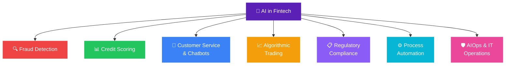

# The Role of Artificial Intelligence in Fintech: A Kenya Perspective

AI in fintech is no longer experimental. It powers credit scoring, fraud detection, compliance automation, algorithmic trading, and customer service at scale. [The global AI-in-fintech market was worth $17.64 billion in 2025 and is projected to reach $97.70 billion by 2034, a compound annual growth rate of 19.9%.](https://www.eicta.iitk.ac.in/knowledge-hub/artificial-intelligence/ai-in-fintech-use-cases)

In Kenya, the context is specific. [32% of Kenyan adults borrow from mobile money providers, with 25% borrowing exclusively this way, according to the World Bank's 2025 Global Findex report.](https://arxiv.org/pdf/2602.01824) [86% of borrowers use mobile money to meet everyday needs including school fees and household consumption.](https://arxiv.org/pdf/2602.01824) The volume of transactions generated by 47.7 million active mobile money subscribers creates a data environment where AI is not optional. It is the only way to process, detect, and act at that scale.

[AI-powered fraud detection systems now prevent an estimated $40 billion in fraudulent transactions annually globally.](https://www.gitnexa.com/blogs/ai-in-fintech-applications) [Over 85% of financial institutions globally reported investing in AI-driven systems in 2025.](https://www.gitnexa.com/blogs/ai-in-fintech-applications) For Kenya's banks, fintechs, and SACCOs, the question is no longer whether to adopt AI but which use cases to prioritise and how to do so responsibly.

---

### What AI Actually Means in a Fintech Context

AI in fintech is an umbrella term covering several distinct technologies:

**Machine Learning (ML).** Algorithms that improve their accuracy over time by learning from data. Used for credit scoring, fraud detection, and customer segmentation.

**Natural Language Processing (NLP).** AI that reads, interprets, and generates human language. Powers chatbots, document analysis, and sentiment monitoring of customer complaints.

**Robotic Process Automation (RPA).** Software that executes repetitive, rule-based tasks without human intervention. Used for data entry, reconciliation, and regulatory reporting.

**Predictive Analytics.** Statistical models that forecast future outcomes from historical data. Used for loan default prediction, churn modelling, and market risk forecasting.

**Agentic AI.** Systems that execute multi-step workflows autonomously without human prompting at each step. [The fastest-growing category in financial services in 2026, with 52% of financial services respondents actively adopting agentic systems according to a CCAF April 2026 survey.](https://www.eicta.iitk.ac.in/knowledge-hub/artificial-intelligence/ai-in-fintech-use-cases)

---

### Seven Proven AI Use Cases in Fintech

| Use Case | What AI Does | Kenya Signal |
|---|---|---|
| Fraud detection | Real-time risk scoring on live transactions | SIM swap and push-payment scams at mobile money scale |
| Credit scoring | Underwrites on behavioural and mobile money data | M-Shwari, Fuliza, Branch; $330B untapped African credit demand |
| Chatbots | 24/7 triage and first-line resolution | Equity and KCB assistants on WhatsApp and USSD |
| Algorithmic trading | Automated execution and robo-advisory | Emerging on the NSE ahead of M-Pesa equity access |
| Compliance and AML | KYC in seconds, monitoring at scale | Lower false positives under CBK reporting rules |
| Process automation | RPA bridging legacy systems | 20-40% operating cost reduction (Deloitte 2025) |
| AIOps | Predicts and remediates IT incidents | Outages are direct revenue loss at mobile money volume |

---

#### 1. Fraud Detection and Prevention

Fraud detection is the most mature and widely deployed AI application in fintech. [AI-powered fraud detection systems now prevent an estimated $40 billion in fraudulent transactions annually.](https://www.gitnexa.com/blogs/ai-in-fintech-applications) Rule-based systems cannot keep up with the pace and sophistication of modern fraud vectors. Machine learning models trained on millions of flagged transactions can catch anomalies in real time.

In Kenya, the fraud landscape is shaped by the scale of mobile money. [With over 100 million mobile users generating transaction data across East Africa, AI is the only viable detection mechanism at that volume.](https://african.business/2025/04/technology-information/banks-and-fintechs-drive-surge-in-ai-approved-loans) A model that detects a user inserting ten different SIM cards into one phone in a month can flag potential SIM swap fraud while distinguishing it from legitimate multi-SIM usage, a distinction no rule-based system can make accurately at scale.

Common fraud vectors AI targets in the Kenyan market: SIM swap fraud, account takeovers, synthetic identity creation, authorised push payment scams, and fake merchant registrations on payment platforms.

**How it works technically.** Transaction data flows through a streaming pipeline, features are extracted and stored, and an ML model generates a risk score in real time. The API response approves, flags, or blocks the transaction. PayPal uses deep learning on billions of annual transactions. Stripe Radar uses ML trained on global payment data. Mastercard Decision Intelligence applies contextual risk scoring. Kenyan banks and fintechs are deploying similar architectures, scaled to local transaction patterns.

---

#### 2. Credit Scoring and Loan Underwriting

Traditional credit scoring uses a narrow set of data points: salary slips, bank statements, credit bureau records. This excludes most of Kenya's population, who operate informally or have thin credit files.

[Branch International runs ML models trained on real repayment data across Kenya, Nigeria, and Tanzania.](https://creativetechafrica.blog/ai-fintech-africa-guide/) [DevelopmentAid estimates $330 billion in untapped credit demand across Africa. AI credit scoring is the primary mechanism for closing that gap.](https://creativetechafrica.blog/ai-fintech-africa-guide/) AI models score borrowers on alternative data: mobile money transaction history, airtime top-up patterns, app usage behaviour, social network signals, and GPS location consistency.

In Kenya, this has produced both progress and problems. Progress: millions of previously unscored Kenyans now access credit through M-Shwari, Fuliza, and digital lenders. Problems: [Kenyan fintechs have been accused of annualised interest rates above 100%, aggressive debt collection including public shaming, and consumer privacy violations.](https://arxiv.org/pdf/2602.01824) The model gives access; the terms of that access are a separate regulatory challenge.

[CBK's licensing of Digital Credit Providers is the regulatory response, requiring minimum capital, consumer protection standards, and accountability for scoring systems.](https://african.business/2025/04/technology-information/banks-and-fintechs-drive-surge-in-ai-approved-loans) The direction is toward explainable AI models, where a borrower who is declined can be told why, in terms they understand.

---

#### 3. Customer Service and Chatbots

AI-powered chatbots handle account queries, payment confirmations, dispute resolution, and product recommendations 24 hours a day without human agents. They scale without adding headcount and maintain consistent service quality across every interaction.

For Kenyan banks and fintechs with large retail customer bases, chatbots reduce call centre load significantly. Equity Bank, KCB, and several fintechs have deployed chatbot and virtual assistant layers across WhatsApp, USSD, and mobile apps. WhatsApp-based financial service chatbots have become a primary customer engagement channel across African markets where WhatsApp penetration is near-universal.

The limitation: chatbots handle routine queries well. Complex complaints, loan restructuring requests, and emotional customer situations still require human agents. The best implementations use AI for triage and first-line resolution, routing genuine complexity to human relationship managers.

---

#### 4. Algorithmic Trading and Investment Management

AI processes market data, news, sentiment signals, and historical price patterns to execute trades at speeds and with data volumes no human trader can match. This is primarily relevant to institutional investors, hedge funds, and investment platforms rather than retail banking.

In the Kenyan context, algorithmic trading is emerging on the NSE as the exchange modernises its infrastructure and as the planned M-Pesa equity trading integration brings retail investor volumes that require automated order matching and portfolio management tools.

Robo-advisors, a subset of this use case, are more immediately relevant: AI-driven tools that assess an investor's risk tolerance, goals, and time horizon and automatically allocate across a portfolio of instruments. Several Kenyan investment platforms are building robo-advisory features, particularly targeting the diaspora remittance-to-investment use case.

---

#### 5. Regulatory Compliance and AML Automation

Compliance is one of the highest-cost functions in banking. Know Your Customer (KYC) verification, Anti-Money Laundering (AML) transaction monitoring, and suspicious activity reporting are all labour-intensive, high-stakes processes.

AI automates the document processing layer of KYC: ID verification, liveness checks, and sanctions screening can be completed in seconds rather than days. AML monitoring uses ML to identify unusual transaction patterns across millions of accounts simultaneously, flagging clusters of activity that would be invisible to a manual review team.

For Kenyan banks under CBK's AML reporting requirements, AI compliance tools reduce false positive rates in transaction monitoring, cutting the manual review burden while improving detection of genuine suspicious activity. The regulatory expectation is increasing: CBK's evolving framework for digital lenders and BaaS providers requires demonstrable compliance infrastructure, not just policy documents.

---

#### 6. Process Automation and Back Office Operations

Robotic Process Automation handles the repetitive, rule-based tasks that have historically consumed significant banking back-office capacity: data entry, reconciliation, report generation, loan documentation processing, and inter-system data transfers.

[AI-driven automation can reduce operational costs by 20-40% according to Deloitte 2025.](https://www.gitnexa.com/blogs/ai-in-fintech-applications) For Kenyan banks operating on legacy core banking systems alongside modern fintech integrations, RPA is often the fastest path to efficiency gains without a full system overhaul. A bank running T24 for core banking and a separate CRM, a separate AML platform, and a separate digital banking layer can use RPA to automate the data flows between them rather than rebuilding the entire stack.

This connects to the [Banking-as-a-Service](/blog/banking-as-a-service-kenya-baas-guide) infrastructure question. BaaS opens banking rails to third parties. AI-powered process automation makes those rails run efficiently at scale without proportionally scaling headcount.

---

#### 7. AIOps: AI for IT Operations in Financial Institutions

AIOps applies AI to IT operations management: detecting incidents, correlating alerts, predicting failures, and automating remediation before outages affect customers.

For a Kenyan bank or fintech processing millions of mobile money transactions daily, an IT outage is not an inconvenience. It is a direct revenue loss and a reputational event. [The cost of a single technology failure in fintech can be detrimental to the business's survival.](https://www.gitnexa.com/blogs/ai-in-fintech-applications)

AIOps tools like AWS DevOps Guru collect and correlate data from IT logs, metrics, and system events to spot patterns and resolve incidents faster than a human operations team can. They reduce alert noise by grouping correlated events into single incidents, allowing IT teams to focus on what actually needs immediate attention rather than working through hundreds of individual alarms.

The adoption barrier: AIOps requires clean, consistent data from all monitored systems. Many Kenyan financial institutions run fragmented IT environments where data quality is inconsistent. Getting the data architecture right is a prerequisite for AIOps, not an afterthought.

---

### AI in Fintech: The Kenya-Specific Risks

**Regulatory grey areas.** [Many AI-driven credit models in Kenya still operate without full regulatory accountability.](https://african.business/2025/04/technology-information/banks-and-fintechs-drive-surge-in-ai-approved-loans) CBK's DCP licensing framework is a step forward, but enforcement is inconsistent. A borrower scored and declined by an AI model in Kenya has limited recourse compared to their counterpart in a jurisdiction with explicit algorithmic accountability requirements.

**Data privacy.** AI models in fintech consume transaction data, behavioural data, and in some cases social network data. Kenya's Data Protection Act 2019 governs how this data must be collected, stored, and processed. Fintechs deploying AI credit models must ensure their data practices comply with both the DPA and CBK's consumer protection guidelines.

**Bias in credit models.** AI models trained on historical data inherit the biases embedded in that data. If women, rural borrowers, or informal sector workers have historically been underserved by formal credit, a model trained on past credit performance may perpetuate that exclusion rather than correcting it. Building inclusive AI credit models requires deliberate choices about training data, feature selection, and model validation.

**Over-reliance on technology.** A financial system that routes all decisions through AI models becomes brittle if those models fail, are manipulated, or encounter data distributions they were not trained for. Kenya's experience during the Finance Bill 2025 debates showed how quickly public sentiment can shift against digital financial infrastructure when trust is broken.

---

### What This Means for Kenyan Businesses and Banks

For **banks and regulated lenders**: AI is now a competitive requirement, not a differentiator. Institutions that do not deploy AI for fraud detection, AML monitoring, and credit decisioning will face higher fraud losses and compliance costs than those that do.

For **fintechs and digital lenders**: AI credit scoring opens a $330 billion credit gap. Closing it responsibly, with explainable models, fair terms, and regulatory compliance, is the business model. Predatory AI lending is a short-term revenue strategy that ends in regulatory shutdown.

For **SMEs and individuals**: AI-scored credit means more access, faster decisions, and in some cases better terms than traditional bank lending. The risk is accepting credit at terms you do not fully understand, from a model you cannot interrogate. Read the terms. Understand the interest rate as an annual figure, not a daily or monthly one.

---

### Sources and Further Reading

- [AI in Fintech 2026: Applications, Use Cases and Leading Companies, EICTA Consortium](https://www.eicta.iitk.ac.in/knowledge-hub/artificial-intelligence/ai-in-fintech-use-cases)
- [AI Fintech Africa: The 2026 Guide, Creative Tech Africa](https://creativetechafrica.blog/ai-fintech-africa-guide/)
- [AI in FinTech Applications: Complete 2026 Guide, GitNexa](https://www.gitnexa.com/blogs/ai-in-fintech-applications)
- [Banks and Fintechs Drive Surge in AI-Approved Loans, African Business](https://african.business/2025/04/technology-information/banks-and-fintechs-drive-surge-in-ai-approved-loans)
- [Risk, Data, Alignment: Making Credit Scoring Work in Kenya, arXiv 2026](https://arxiv.org/pdf/2602.01824)
- [AI Fraud Detection in Banking, Coherent Solutions](https://www.coherentsolutions.com/insights/ai-financial-fraud-prevention-whitepaper)
- Bengula Inc: [Banking-as-a-Service in Kenya](/blog/banking-as-a-service-kenya-baas-guide), [How Embedded Finance Is Reimagining the Point of Payment](/blog/embedded-finance-kenya-guide), [What Is a Cashless Economy](/blog/what-is-a-cashless-economy), [What Is Accounts Receivable](/blog/what-is-accounts-receivable)
